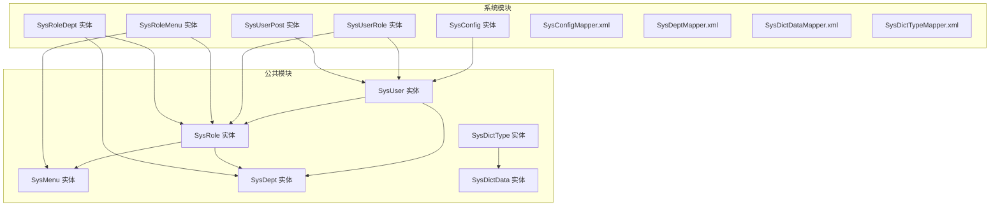
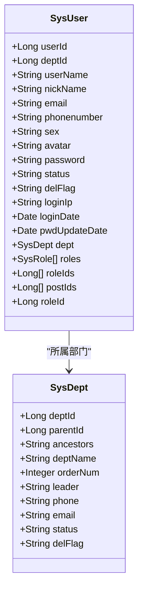
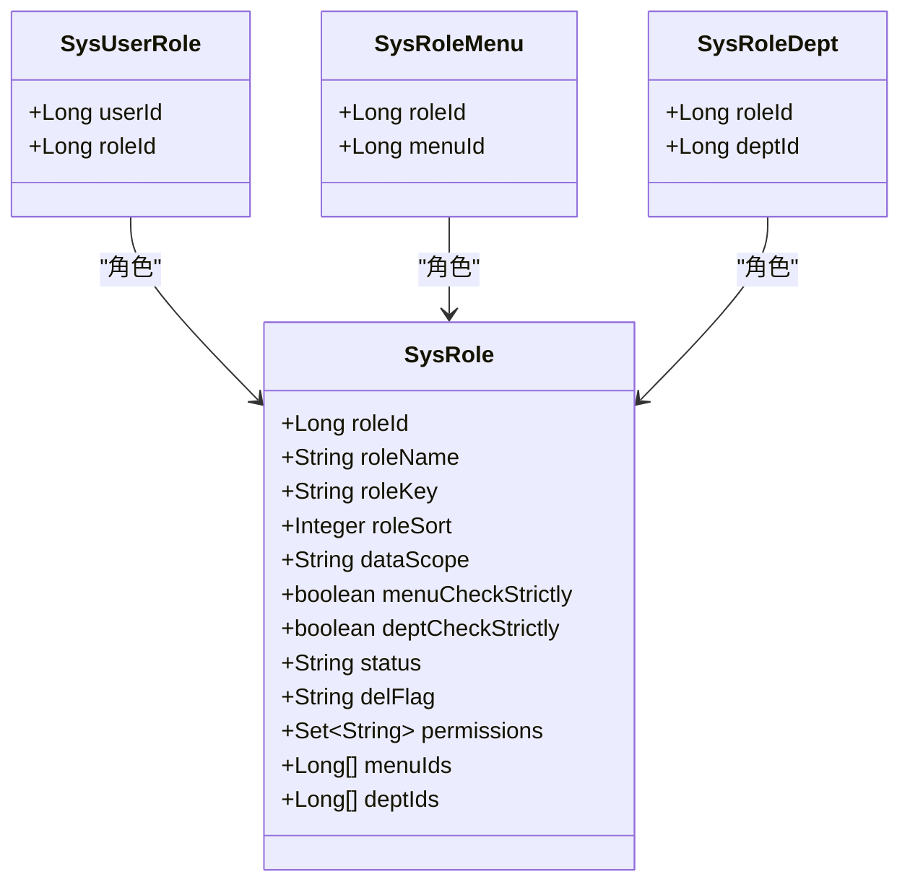
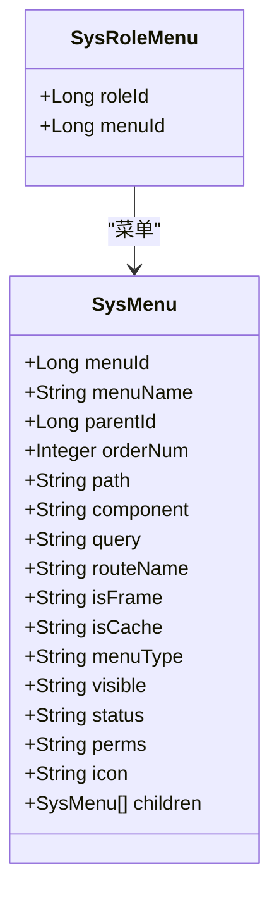
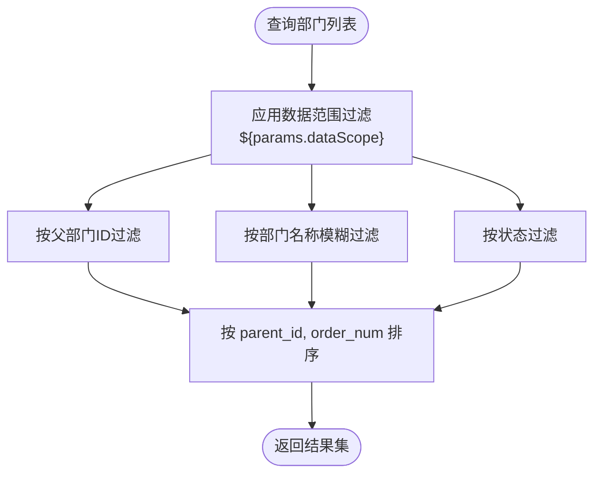
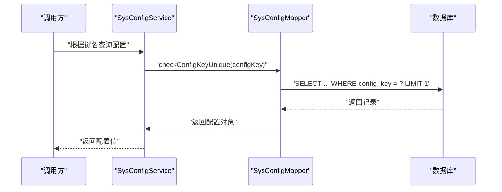
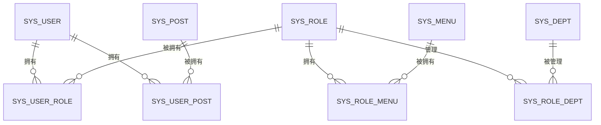
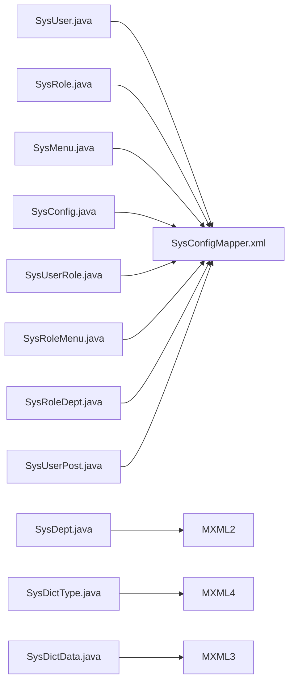

# 系统管理表设计

<cite>
**本文档引用的文件**
- [SysUser.java](file://blog-common/src/main/java/blog/common/core/domain/entity/SysUser.java)
- [SysRole.java](file://blog-common/src/main/java/blog/common/core/domain/entity/SysRole.java)
- [SysMenu.java](file://blog-common/src/main/java/blog/common/core/domain/entity/SysMenu.java)
- [SysDept.java](file://blog-common/src/main/java/blog/common/core/domain/entity/SysDept.java)
- [SysDictData.java](file://blog-common/src/main/java/blog/common/core/domain/entity/SysDictData.java)
- [SysDictType.java](file://blog-common/src/main/java/blog/common/core/domain/entity/SysDictType.java)
- [SysConfig.java](file://blog-system/src/main/java/blog/system/domain/SysConfig.java)
- [SysUserRole.java](file://blog-system/src/main/java/blog/system/domain/SysUserRole.java)
- [SysRoleMenu.java](file://blog-system/src/main/java/blog/system/domain/SysRoleMenu.java)
- [SysRoleDept.java](file://blog-system/src/main/java/blog/system/domain/SysRoleDept.java)
- [SysUserPost.java](file://blog-system/src/main/java/blog/system/domain/SysUserPost.java)
- [SysConfigMapper.xml](file://blog-system/src/main/resources/mapper/system/SysConfigMapper.xml)
- [SysDeptMapper.xml](file://blog-system/src/main/resources/mapper/system/SysDeptMapper.xml)
- [SysDictDataMapper.xml](file://blog-system/src/main/resources/mapper/system/SysDictDataMapper.xml)
- [SysDictTypeMapper.xml](file://blog-system/src/main/resources/mapper/system/SysDictTypeMapper.xml)
- [ry-vue-owner.sql](file://ry-vue-owner.sql)
</cite>

## 目录
1. [简介](#简介)
2. [项目结构](#项目结构)
3. [核心组件](#核心组件)
4. [架构总览](#架构总览)
5. [详细组件分析](#详细组件分析)
6. [依赖分析](#依赖分析)
7. [性能考虑](#性能考虑)
8. [故障排查指南](#故障排查指南)
9. [结论](#结论)
10. [附录](#附录)

## 简介
本文件面向博客系统后台管理的数据库表设计，系统性梳理用户、角色、菜单、部门、字典与配置等核心管理表的结构与关系，重点阐释：
- 用户认证授权相关表结构设计（用户基本信息、角色权限映射、菜单权限控制）
- 组织架构管理表设计（部门层级关系、父子节点关联、权限继承机制）
- 配置管理表设计（系统参数配置、动态配置更新、配置缓存）
- 完整权限体系表结构（用户-角色、角色-菜单、角色-部门等多对多关系）

通过可视化图表帮助开发者快速理解系统管理的数据库设计架构。

## 项目结构
系统管理相关代码主要分布在以下模块：
- 实体层：位于公共模块，定义各管理表对应的Java实体类
- 系统模块：包含配置、字典、部门等业务域的领域模型与MyBatis映射
- SQL脚本：提供完整的建库建表与初始化数据



**图表来源**
- [SysUser.java:24-339](file://blog-common/src/main/java/blog/common/core/domain/entity/SysUser.java#L24-L339)
- [SysRole.java:21-240](file://blog-common/src/main/java/blog/common/core/domain/entity/SysRole.java#L21-L240)
- [SysMenu.java:20-277](file://blog-common/src/main/java/blog/common/core/domain/entity/SysMenu.java#L20-L277)
- [SysDept.java:24-95](file://blog-common/src/main/java/blog/common/core/domain/entity/SysDept.java#L24-L95)
- [SysDictData.java:22-93](file://blog-common/src/main/java/blog/common/core/domain/entity/SysDictData.java#L22-L93)
- [SysDictType.java:20-100](file://blog-common/src/main/java/blog/common/core/domain/entity/SysDictType.java#L20-L100)
- [SysConfig.java:17-113](file://blog-system/src/main/java/blog/system/domain/SysConfig.java#L17-L113)
- [SysUserRole.java:11-46](file://blog-system/src/main/java/blog/system/domain/SysUserRole.java#L11-L46)
- [SysRoleMenu.java:11-46](file://blog-system/src/main/java/blog/system/domain/SysRoleMenu.java#L11-L46)
- [SysRoleDept.java:11-46](file://blog-system/src/main/java/blog/system/domain/SysRoleDept.java#L11-L46)
- [SysUserPost.java:11-46](file://blog-system/src/main/java/blog/system/domain/SysUserPost.java#L11-L46)
- [SysConfigMapper.xml:5-117](file://blog-system/src/main/resources/mapper/system/SysConfigMapper.xml#L5-L117)
- [SysDeptMapper.xml:5-159](file://blog-system/src/main/resources/mapper/system/SysDeptMapper.xml#L5-L159)
- [SysDictDataMapper.xml:5-124](file://blog-system/src/main/resources/mapper/system/SysDictDataMapper.xml#L5-L124)
- [SysDictTypeMapper.xml:5-105](file://blog-system/src/main/resources/mapper/system/SysDictTypeMapper.xml#L5-L105)

**章节来源**
- [SysUser.java:24-339](file://blog-common/src/main/java/blog/common/core/domain/entity/SysUser.java#L24-L339)
- [SysRole.java:21-240](file://blog-common/src/main/java/blog/common/core/domain/entity/SysRole.java#L21-L240)
- [SysMenu.java:20-277](file://blog-common/src/main/java/blog/common/core/domain/entity/SysMenu.java#L20-L277)
- [SysDept.java:24-95](file://blog-common/src/main/java/blog/common/core/domain/entity/SysDept.java#L24-L95)
- [SysDictData.java:22-93](file://blog-common/src/main/java/blog/common/core/domain/entity/SysDictData.java#L22-L93)
- [SysDictType.java:20-100](file://blog-common/src/main/java/blog/common/core/domain/entity/SysDictType.java#L20-L100)
- [SysConfig.java:17-113](file://blog-system/src/main/java/blog/system/domain/SysConfig.java#L17-L113)
- [SysUserRole.java:11-46](file://blog-system/src/main/java/blog/system/domain/SysUserRole.java#L11-L46)
- [SysRoleMenu.java:11-46](file://blog-system/src/main/java/blog/system/domain/SysRoleMenu.java#L11-L46)
- [SysRoleDept.java:11-46](file://blog-system/src/main/java/blog/system/domain/SysRoleDept.java#L11-L46)
- [SysUserPost.java:11-46](file://blog-system/src/main/java/blog/system/domain/SysUserPost.java#L11-L46)
- [SysConfigMapper.xml:5-117](file://blog-system/src/main/resources/mapper/system/SysConfigMapper.xml#L5-L117)
- [SysDeptMapper.xml:5-159](file://blog-system/src/main/resources/mapper/system/SysDeptMapper.xml#L5-L159)
- [SysDictDataMapper.xml:5-124](file://blog-system/src/main/resources/mapper/system/SysDictDataMapper.xml#L5-L124)
- [SysDictTypeMapper.xml:5-105](file://blog-system/src/main/resources/mapper/system/SysDictTypeMapper.xml#L5-L105)

## 核心组件
本节概述系统管理的核心表及其职责：
- 用户表（sys_user）：存储用户基本信息、登录信息、状态与关联部门
- 角色表（sys_role）：存储角色信息、数据范围、角色状态与权限标识
- 菜单表（sys_menu）：存储菜单结构、路由信息、权限标识与类型
- 部门表（sys_dept）：存储组织架构、层级关系、祖先链与状态
- 字典类型表（sys_dict_type）与字典数据表（sys_dict_data）：存储可配置枚举与标签键值
- 配置表（sys_config）：存储系统参数配置与内置标记
- 多对多关系表：sys_user_role（用户-角色）、sys_role_menu（角色-菜单）、sys_role_dept（角色-部门）、sys_user_post（用户-岗位）

**章节来源**
- [SysUser.java:24-339](file://blog-common/src/main/java/blog/common/core/domain/entity/SysUser.java#L24-L339)
- [SysRole.java:21-240](file://blog-common/src/main/java/blog/common/core/domain/entity/SysRole.java#L21-L240)
- [SysMenu.java:20-277](file://blog-common/src/main/java/blog/common/core/domain/entity/SysMenu.java#L20-L277)
- [SysDept.java:24-95](file://blog-common/src/main/java/blog/common/core/domain/entity/SysDept.java#L24-L95)
- [SysDictType.java:20-100](file://blog-common/src/main/java/blog/common/core/domain/entity/SysDictType.java#L20-L100)
- [SysDictData.java:22-93](file://blog-common/src/main/java/blog/common/core/domain/entity/SysDictData.java#L22-L93)
- [SysConfig.java:17-113](file://blog-system/src/main/java/blog/system/domain/SysConfig.java#L17-L113)
- [SysUserRole.java:11-46](file://blog-system/src/main/java/blog/system/domain/SysUserRole.java#L11-L46)
- [SysRoleMenu.java:11-46](file://blog-system/src/main/java/blog/system/domain/SysRoleMenu.java#L11-L46)
- [SysRoleDept.java:11-46](file://blog-system/src/main/java/blog/system/domain/SysRoleDept.java#L11-L46)
- [SysUserPost.java:11-46](file://blog-system/src/main/java/blog/system/domain/SysUserPost.java#L11-L46)

## 架构总览
系统管理表采用“实体-映射-服务”的分层设计，实体类定义字段与校验规则，MyBatis映射文件定义SQL查询与更新逻辑，服务层负责业务编排与数据范围过滤。

```mermaid
erDiagram
SYS_USER {
bigint user_id PK
bigint dept_id
varchar user_name
varchar nick_name
varchar email
varchar phone_number
varchar sex
varchar avatar
varchar password
varchar status
varchar del_flag
varchar login_ip
datetime login_date
datetime pwd_update_date
}
SYS_ROLE {
bigint role_id PK
varchar role_name
varchar role_key
int role_sort
varchar data_scope
tinyint menu_check_strictly
tinyint dept_check_strictly
varchar status
varchar del_flag
}
SYS_MENU {
bigint menu_id PK
varchar menu_name
bigint parent_id
int order_num
varchar path
varchar component
varchar query
varchar route_name
varchar is_frame
varchar is_cache
varchar menu_type
varchar visible
varchar status
varchar perms
varchar icon
}
SYS_DEPT {
bigint dept_id PK
bigint parent_id
varchar ancestors
varchar dept_name
int order_num
varchar leader
varchar phone
varchar email
varchar status
varchar del_flag
}
SYS_DICT_TYPE {
bigint dict_id PK
varchar dict_name
varchar dict_type UK
varchar status
}
SYS_DICT_DATA {
bigint dict_code PK
int dict_sort
varchar dict_label
varchar dict_value
varchar dict_type
varchar css_class
varchar list_class
varchar is_default
varchar status
}
SYS_CONFIG {
bigint config_id PK
varchar config_name
varchar config_key UK
varchar config_value
varchar config_type
}
SYS_USER_ROLE {
bigint user_id
bigint role_id
}
SYS_ROLE_MENU {
bigint role_id
bigint menu_id
}
SYS_ROLE_DEPT {
bigint role_id
bigint dept_id
}
SYS_USER_POST {
bigint user_id
bigint post_id
}
SYS_USER }o--|| SYS_DEPT : "所属部门"
SYS_USER }o--o|| SYS_USER_ROLE : "拥有角色"
SYS_ROLE }o--o|| SYS_ROLE_MENU : "拥有菜单"
SYS_ROLE }o--o|| SYS_ROLE_DEPT : "管理部门"
SYS_DICT_TYPE ||--o{ SYS_DICT_DATA : "包含"
```

**图表来源**
- [SysUser.java:24-339](file://blog-common/src/main/java/blog/common/core/domain/entity/SysUser.java#L24-L339)
- [SysRole.java:21-240](file://blog-common/src/main/java/blog/common/core/domain/entity/SysRole.java#L21-L240)
- [SysMenu.java:20-277](file://blog-common/src/main/java/blog/common/core/domain/entity/SysMenu.java#L20-L277)
- [SysDept.java:24-95](file://blog-common/src/main/java/blog/common/core/domain/entity/SysDept.java#L24-L95)
- [SysDictType.java:20-100](file://blog-common/src/main/java/blog/common/core/domain/entity/SysDictType.java#L20-L100)
- [SysDictData.java:22-93](file://blog-common/src/main/java/blog/common/core/domain/entity/SysDictData.java#L22-L93)
- [SysConfig.java:17-113](file://blog-system/src/main/java/blog/system/domain/SysConfig.java#L17-L113)
- [SysUserRole.java:11-46](file://blog-system/src/main/java/blog/system/domain/SysUserRole.java#L11-L46)
- [SysRoleMenu.java:11-46](file://blog-system/src/main/java/blog/system/domain/SysRoleMenu.java#L11-L46)
- [SysRoleDept.java:11-46](file://blog-system/src/main/java/blog/system/domain/SysRoleDept.java#L11-L46)
- [SysUserPost.java:11-46](file://blog-system/src/main/java/blog/system/domain/SysUserPost.java#L11-L46)

## 详细组件分析

### 用户表（sys_user）
- 关键字段：用户ID、部门ID、账号、昵称、邮箱、手机、性别、头像、密码、状态、删除标志、登录IP与时间、密码更新时间
- 关联关系：与部门表一对多，与用户-角色表一对多
- 设计要点：支持软删除、登录审计、密码更新追踪；提供管理员标识判断



**图表来源**
- [SysUser.java:24-339](file://blog-common/src/main/java/blog/common/core/domain/entity/SysUser.java#L24-L339)
- [SysDept.java:24-95](file://blog-common/src/main/java/blog/common/core/domain/entity/SysDept.java#L24-L95)

**章节来源**
- [SysUser.java:24-339](file://blog-common/src/main/java/blog/common/core/domain/entity/SysUser.java#L24-L339)

### 角色表（sys_role）
- 关键字段：角色ID、角色名称、角色权限（roleKey）、排序、数据范围、菜单/部门勾选策略、状态、删除标志
- 关联关系：与用户-角色表一对多，与角色-菜单表一对多，与角色-部门表一对多
- 设计要点：数据范围用于数据权限控制；菜单/部门勾选策略影响树选择行为



**图表来源**
- [SysRole.java:21-240](file://blog-common/src/main/java/blog/common/core/domain/entity/SysRole.java#L21-L240)
- [SysUserRole.java:11-46](file://blog-system/src/main/java/blog/system/domain/SysUserRole.java#L11-L46)
- [SysRoleMenu.java:11-46](file://blog-system/src/main/java/blog/system/domain/SysRoleMenu.java#L11-L46)
- [SysRoleDept.java:11-46](file://blog-system/src/main/java/blog/system/domain/SysRoleDept.java#L11-L46)

**章节来源**
- [SysRole.java:21-240](file://blog-common/src/main/java/blog/common/core/domain/entity/SysRole.java#L21-L240)

### 菜单表（sys_menu）
- 关键字段：菜单ID、菜单名称、父菜单ID、显示顺序、路由地址、组件路径、路由参数、路由名称、是否外链、是否缓存、菜单类型（目录/菜单/按钮）、显示状态、状态、权限标识、图标
- 关联关系：与角色-菜单表一对多
- 设计要点：支持树形结构与权限标识；类型区分目录/菜单/按钮，便于前端渲染与权限控制



**图表来源**
- [SysMenu.java:20-277](file://blog-common/src/main/java/blog/common/core/domain/entity/SysMenu.java#L20-L277)
- [SysRoleMenu.java:11-46](file://blog-system/src/main/java/blog/system/domain/SysRoleMenu.java#L11-L46)

**章节来源**
- [SysMenu.java:20-277](file://blog-common/src/main/java/blog/common/core/domain/entity/SysMenu.java#L20-L277)

### 部门表（sys_dept）
- 关键字段：部门ID、父部门ID、祖先链（ancestors）、部门名称、显示顺序、负责人、电话、邮箱、状态、删除标志
- 关联关系：与用户表一对多，与角色-部门表一对多
- 设计要点：祖先链支持树形遍历；提供子部门查询、状态批量更新、删除软删除



**图表来源**
- [SysDeptMapper.xml:30-48](file://blog-system/src/main/resources/mapper/system/SysDeptMapper.xml#L30-L48)

**章节来源**
- [SysDept.java:24-95](file://blog-common/src/main/java/blog/common/core/domain/entity/SysDept.java#L24-L95)
- [SysDeptMapper.xml:5-159](file://blog-system/src/main/resources/mapper/system/SysDeptMapper.xml#L5-L159)

### 字典表（sys_dict_type/sys_dict_data）
- 字典类型表：字典主键、字典名称、字典类型（唯一）、状态
- 字典数据表：字典编码、排序、标签、键值、类型、样式、是否默认、状态
- 关联关系：字典类型与字典数据一对多
- 设计要点：字典类型采用小写字母+数字+下划线命名规范；支持按类型查询有效字典项

```mermaid
classDiagram
class SysDictType {
+Long dictId
+String dictName
+String dictType
+String status
}
class SysDictData {
+Long dictCode
+Integer dictSort
+String dictLabel
+String dictValue
+String dictType
+String cssClass
+String listClass
+String isDefault
+String status
}
SysDictType ||--o{ SysDictData : "包含"
```

**图表来源**
- [SysDictType.java:20-100](file://blog-common/src/main/java/blog/common/core/domain/entity/SysDictType.java#L20-L100)
- [SysDictData.java:22-93](file://blog-common/src/main/java/blog/common/core/domain/entity/SysDictData.java#L22-L93)

**章节来源**
- [SysDictType.java:20-100](file://blog-common/src/main/java/blog/common/core/domain/entity/SysDictType.java#L20-L100)
- [SysDictData.java:22-93](file://blog-common/src/main/java/blog/common/core/domain/entity/SysDictData.java#L22-L93)
- [SysDictTypeMapper.xml:5-105](file://blog-system/src/main/resources/mapper/system/SysDictTypeMapper.xml#L5-L105)
- [SysDictDataMapper.xml:5-124](file://blog-system/src/main/resources/mapper/system/SysDictDataMapper.xml#L5-L124)

### 配置表（sys_config）
- 关键字段：参数主键、参数名称、参数键名（唯一）、参数键值、系统内置标记
- 关联关系：与系统配置服务交互
- 设计要点：键名唯一约束；支持按键名精确查询与批量删除；提供内置标记用于区分系统参数



**图表来源**
- [SysConfig.java:17-113](file://blog-system/src/main/java/blog/system/domain/SysConfig.java#L17-L113)
- [SysConfigMapper.xml:67-70](file://blog-system/src/main/resources/mapper/system/SysConfigMapper.xml#L67-L70)

**章节来源**
- [SysConfig.java:17-113](file://blog-system/src/main/java/blog/system/domain/SysConfig.java#L17-L113)
- [SysConfigMapper.xml:5-117](file://blog-system/src/main/resources/mapper/system/SysConfigMapper.xml#L5-L117)

### 多对多关系表
- 用户-角色（sys_user_role）：用户ID与角色ID组合唯一
- 角色-菜单（sys_role_menu）：角色ID与菜单ID组合唯一
- 角色-部门（sys_role_dept）：角色ID与部门ID组合唯一
- 用户-岗位（sys_user_post）：用户ID与岗位ID组合唯一



**图表来源**
- [SysUserRole.java:11-46](file://blog-system/src/main/java/blog/system/domain/SysUserRole.java#L11-L46)
- [SysRoleMenu.java:11-46](file://blog-system/src/main/java/blog/system/domain/SysRoleMenu.java#L11-L46)
- [SysRoleDept.java:11-46](file://blog-system/src/main/java/blog/system/domain/SysRoleDept.java#L11-L46)
- [SysUserPost.java:11-46](file://blog-system/src/main/java/blog/system/domain/SysUserPost.java#L11-L46)

**章节来源**
- [SysUserRole.java:11-46](file://blog-system/src/main/java/blog/system/domain/SysUserRole.java#L11-L46)
- [SysRoleMenu.java:11-46](file://blog-system/src/main/java/blog/system/domain/SysRoleMenu.java#L11-L46)
- [SysRoleDept.java:11-46](file://blog-system/src/main/java/blog/system/domain/SysRoleDept.java#L11-L46)
- [SysUserPost.java:11-46](file://blog-system/src/main/java/blog/system/domain/SysUserPost.java#L11-L46)

## 依赖分析
- 实体类之间通过字段与集合建立关联（如用户-部门、角色-菜单等）
- MyBatis映射文件承担数据访问职责，提供条件查询、树形查询、批量更新等能力
- 多对多关系通过独立实体类承载，确保关系表的可维护性与扩展性



**图表来源**
- [SysUser.java:24-339](file://blog-common/src/main/java/blog/common/core/domain/entity/SysUser.java#L24-L339)
- [SysRole.java:21-240](file://blog-common/src/main/java/blog/common/core/domain/entity/SysRole.java#L21-L240)
- [SysMenu.java:20-277](file://blog-common/src/main/java/blog/common/core/domain/entity/SysMenu.java#L20-L277)
- [SysDept.java:24-95](file://blog-common/src/main/java/blog/common/core/domain/entity/SysDept.java#L24-L95)
- [SysDictType.java:20-100](file://blog-common/src/main/java/blog/common/core/domain/entity/SysDictType.java#L20-L100)
- [SysDictData.java:22-93](file://blog-common/src/main/java/blog/common/core/domain/entity/SysDictData.java#L22-L93)
- [SysConfig.java:17-113](file://blog-system/src/main/java/blog/system/domain/SysConfig.java#L17-L113)
- [SysUserRole.java:11-46](file://blog-system/src/main/java/blog/system/domain/SysUserRole.java#L11-L46)
- [SysRoleMenu.java:11-46](file://blog-system/src/main/java/blog/system/domain/SysRoleMenu.java#L11-L46)
- [SysRoleDept.java:11-46](file://blog-system/src/main/java/blog/system/domain/SysRoleDept.java#L11-L46)
- [SysUserPost.java:11-46](file://blog-system/src/main/java/blog/system/domain/SysUserPost.java#L11-L46)
- [SysConfigMapper.xml:5-117](file://blog-system/src/main/resources/mapper/system/SysConfigMapper.xml#L5-L117)
- [SysDeptMapper.xml:5-159](file://blog-system/src/main/resources/mapper/system/SysDeptMapper.xml#L5-L159)
- [SysDictDataMapper.xml:5-124](file://blog-system/src/main/resources/mapper/system/SysDictDataMapper.xml#L5-L124)
- [SysDictTypeMapper.xml:5-105](file://blog-system/src/main/resources/mapper/system/SysDictTypeMapper.xml#L5-L105)

**章节来源**
- [SysUser.java:24-339](file://blog-common/src/main/java/blog/common/core/domain/entity/SysUser.java#L24-L339)
- [SysRole.java:21-240](file://blog-common/src/main/java/blog/common/core/domain/entity/SysRole.java#L21-L240)
- [SysMenu.java:20-277](file://blog-common/src/main/java/blog/common/core/domain/entity/SysMenu.java#L20-L277)
- [SysDept.java:24-95](file://blog-common/src/main/java/blog/common/core/domain/entity/SysDept.java#L24-L95)
- [SysDictType.java:20-100](file://blog-common/src/main/java/blog/common/core/domain/entity/SysDictType.java#L20-L100)
- [SysDictData.java:22-93](file://blog-common/src/main/java/blog/common/core/domain/entity/SysDictData.java#L22-L93)
- [SysConfig.java:17-113](file://blog-system/src/main/java/blog/system/domain/SysConfig.java#L17-L113)
- [SysUserRole.java:11-46](file://blog-system/src/main/java/blog/system/domain/SysUserRole.java#L11-L46)
- [SysRoleMenu.java:11-46](file://blog-system/src/main/java/blog/system/domain/SysRoleMenu.java#L11-L46)
- [SysRoleDept.java:11-46](file://blog-system/src/main/java/blog/system/domain/SysRoleDept.java#L11-L46)
- [SysUserPost.java:11-46](file://blog-system/src/main/java/blog/system/domain/SysUserPost.java#L11-L46)
- [SysConfigMapper.xml:5-117](file://blog-system/src/main/resources/mapper/system/SysConfigMapper.xml#L5-L117)
- [SysDeptMapper.xml:5-159](file://blog-system/src/main/resources/mapper/system/SysDeptMapper.xml#L5-L159)
- [SysDictDataMapper.xml:5-124](file://blog-system/src/main/resources/mapper/system/SysDictDataMapper.xml#L5-L124)
- [SysDictTypeMapper.xml:5-105](file://blog-system/src/main/resources/mapper/system/SysDictTypeMapper.xml#L5-L105)

## 性能考虑
- 树形查询优化：部门表使用祖先链（ancestors）与find_in_set配合进行层级查询，适合中低复杂度组织架构
- 索引建议：在sys_dept.parent_id、sys_dept.ancestors、sys_menu.parent_id、sys_config.config_key上建立索引以提升查询效率
- 分页与过滤：MyBatis映射文件已提供条件过滤与分页查询模板，建议结合业务场景合理设置分页大小
- 缓存策略：配置表可结合Redis进行热点配置缓存，减少频繁读取数据库的开销

## 故障排查指南
- 部门删除失败：检查是否存在用户或子部门关联，使用“存在用户”与“存在子部门”查询确认
- 字典类型唯一性：新增/修改时需校验dict_type唯一性，避免重复
- 配置键唯一性：新增/修改时需校验config_key唯一性，防止重复键覆盖
- 数据范围过滤：部门列表查询包含数据范围过滤表达式${params.dataScope}，需确保传入正确的过滤条件

**章节来源**
- [SysDeptMapper.xml:68-83](file://blog-system/src/main/resources/mapper/system/SysDeptMapper.xml#L68-L83)
- [SysDictTypeMapper.xml:58-61](file://blog-system/src/main/resources/mapper/system/SysDictTypeMapper.xml#L58-L61)
- [SysConfigMapper.xml:67-70](file://blog-system/src/main/resources/mapper/system/SysConfigMapper.xml#L67-L70)

## 结论
本设计以清晰的实体模型与规范的映射文件为基础，构建了完善的系统管理表结构与权限体系。通过树形结构（部门）与多对多关系（用户-角色、角色-菜单、角色-部门）实现了灵活的组织架构与权限控制，配合字典与配置表提供了可扩展的参数化能力。建议在生产环境中结合索引与缓存策略进一步优化查询性能，并严格遵循唯一性约束与数据范围过滤以保障数据一致性与安全性。

## 附录
- 初始化脚本：参考仓库中的SQL脚本文件，完成建库建表与基础数据导入
- 参考路径：[ry-vue-owner.sql](file://ry-vue-owner.sql)