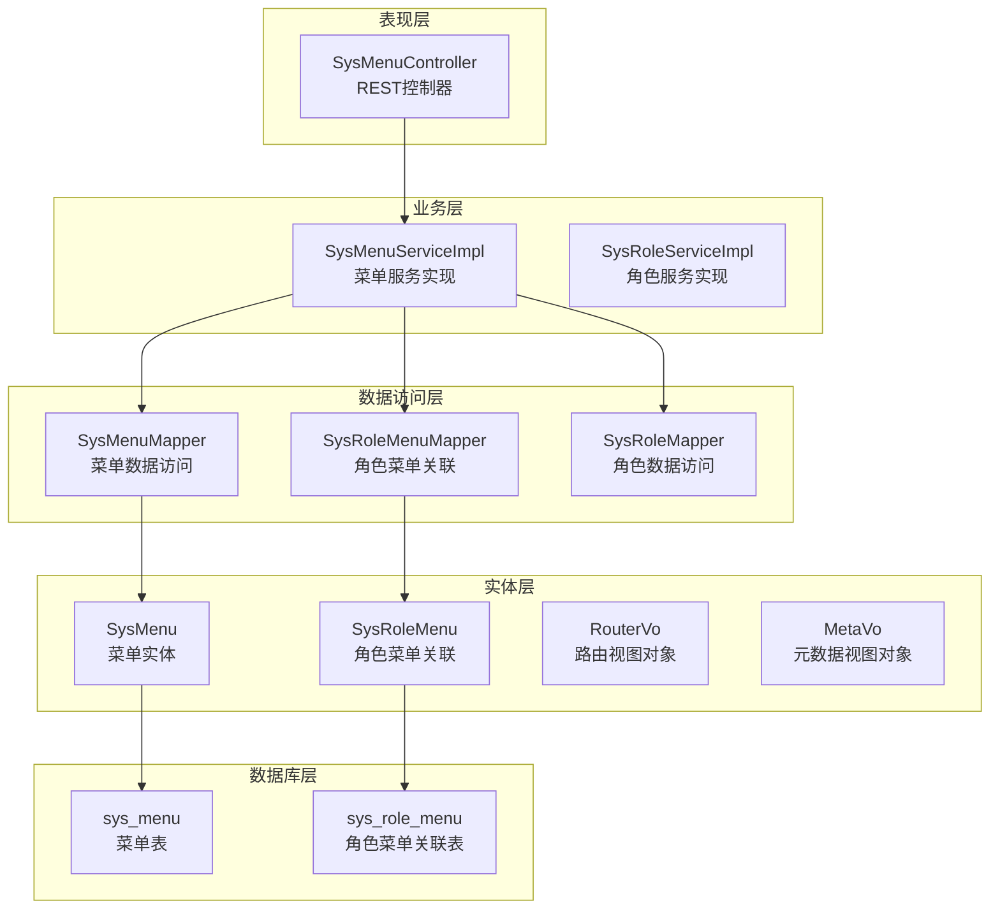
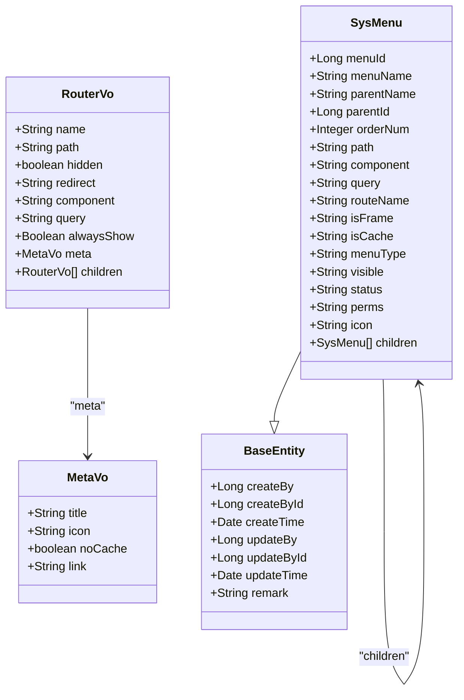
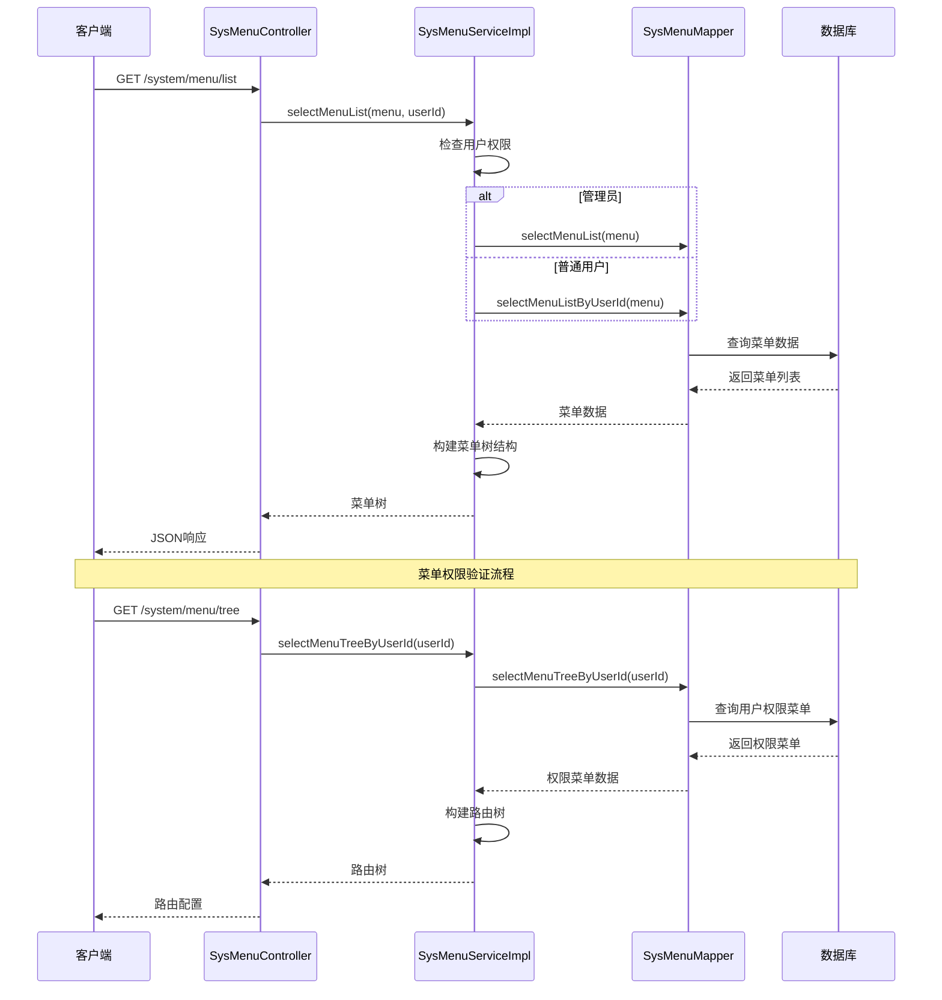
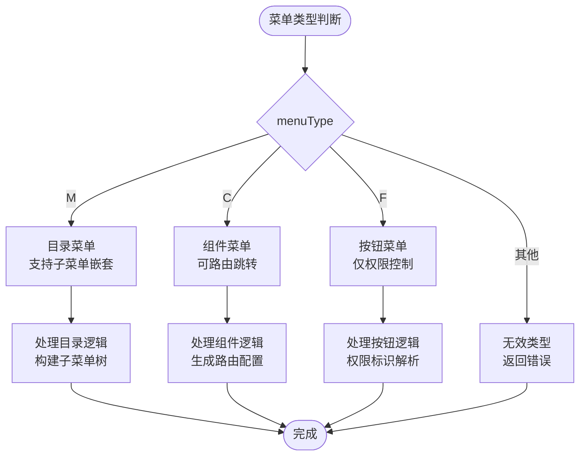
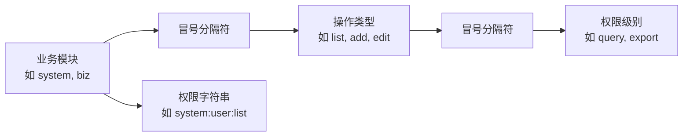
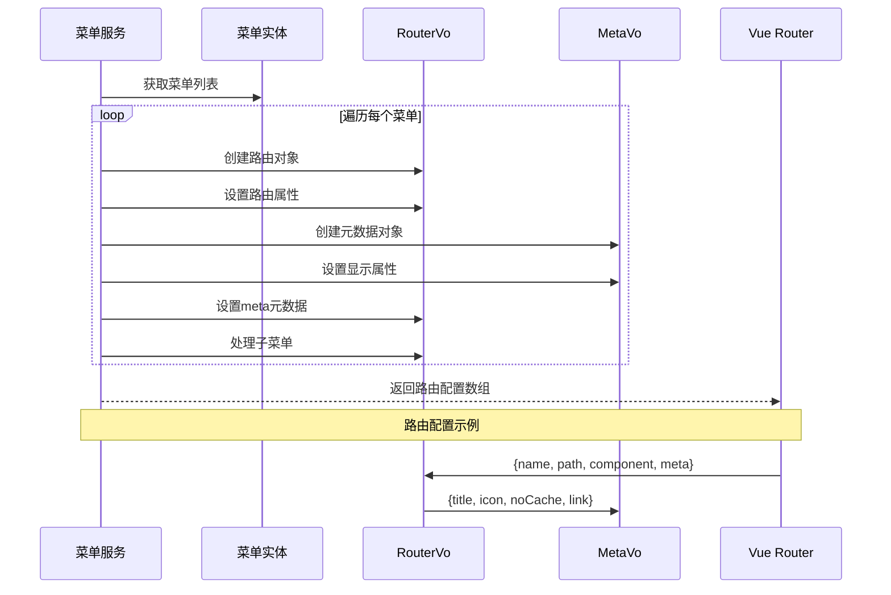
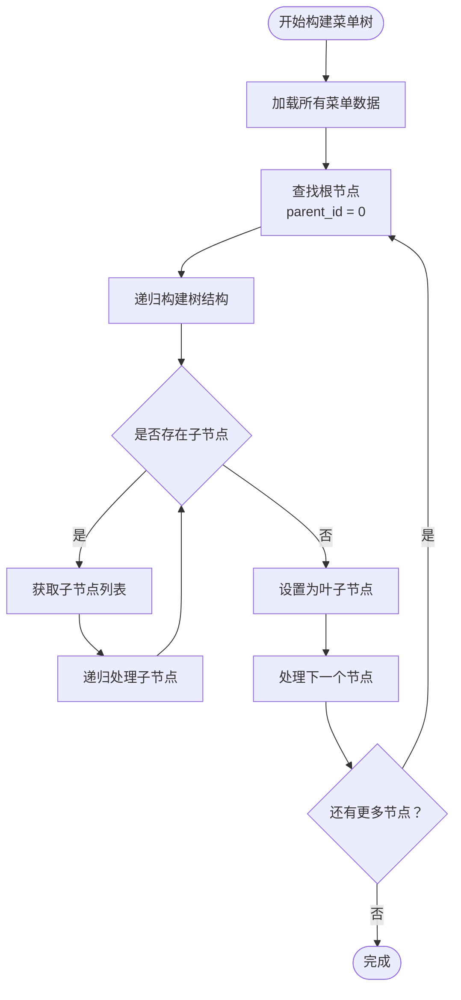
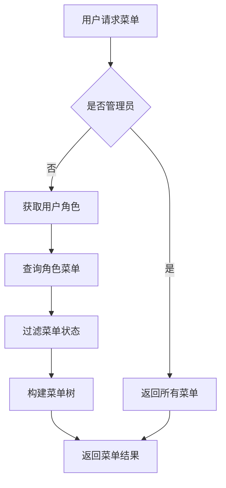
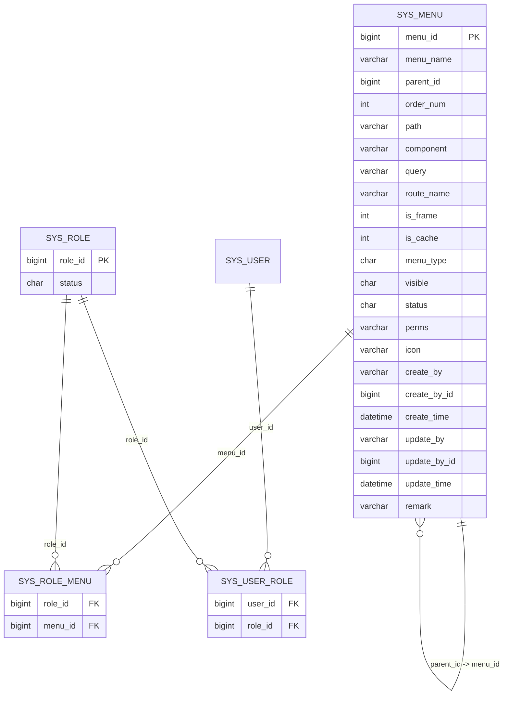
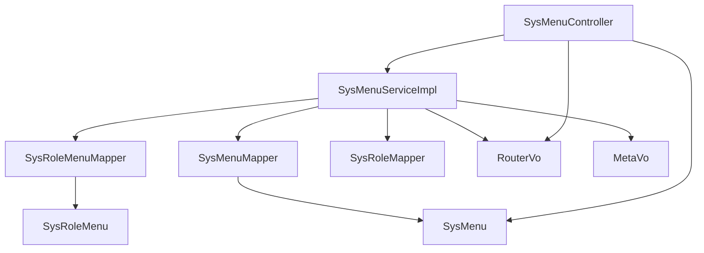

# 菜单系统表设计

<cite>
**本文档引用的文件**
- [SysMenu.java](file://blog-common/src/main/java/blog/common/core/domain/entity/SysMenu.java)
- [SysMenuMapper.xml](file://blog-system/src/main/resources/mapper/system/SysMenuMapper.xml)
- [SysMenuServiceImpl.java](file://blog-system/src/main/java/blog/system/service/impl/SysMenuServiceImpl.java)
- [SysMenuController.java](file://blog-admin/src/main/java/blog/web/controller/system/SysMenuController.java)
- [RouterVo.java](file://blog-system/src/main/java/blog/system/domain/vo/RouterVo.java)
- [MetaVo.java](file://blog-system/src/main/java/blog/system/domain/vo/MetaVo.java)
- [UserConstants.java](file://blog-common/src/main/java/blog/common/constant/UserConstants.java)
- [SysRoleMenu.java](file://blog-system/src/main/java/blog/system/domain/SysRoleMenu.java)
- [SysRoleMenuMapper.java](file://blog-system/src/main/java/blog/system/mapper/SysRoleMenuMapper.java)
- [ry-vue-owner.sql](file://ry-vue-owner.sql)
</cite>

## 目录
1. [简介](#简介)
2. [项目结构](#项目结构)
3. [核心组件](#核心组件)
4. [架构概览](#架构概览)
5. [详细组件分析](#详细组件分析)
6. [依赖关系分析](#依赖关系分析)
7. [性能考虑](#性能考虑)
8. [故障排除指南](#故障排除指南)
9. [结论](#结论)

## 简介

本文件详细介绍了基于RuoYi框架的菜单管理系统表设计，包括数据库表结构、实体模型、业务逻辑实现以及前后端集成方案。该系统支持树形菜单结构、多级权限控制、动态路由生成等功能，为博客管理系统提供完整的菜单权限控制能力。

## 项目结构

菜单系统采用分层架构设计，主要包含以下层次：

**图表来源**
- [SysMenuController.java:1-125](file://blog-admin/src/main/java/blog/web/controller/system/SysMenuController.java#L1-L125)
- [SysMenuServiceImpl.java:1-482](file://blog-system/src/main/java/blog/system/service/impl/SysMenuServiceImpl.java#L1-L482)
- [SysMenuMapper.xml:1-206](file://blog-system/src/main/resources/mapper/system/SysMenuMapper.xml#L1-L206)

**章节来源**
- [SysMenuController.java:1-125](file://blog-admin/src/main/java/blog/web/controller/system/SysMenuController.java#L1-L125)
- [SysMenuServiceImpl.java:1-482](file://blog-system/src/main/java/blog/system/service/impl/SysMenuServiceImpl.java#L1-L482)

## 核心组件

### 数据库表结构设计

菜单系统的核心数据表为 `sys_menu`，采用标准的关系型数据库设计，支持树形结构的层级关系管理。

#### sys_menu 表结构

| 字段名 | 数据类型 | 约束条件 | 描述 | 默认值 |
|--------|----------|----------|------|--------|
| menu_id | bigint | 主键, 自增 | 菜单ID | - |
| menu_name | varchar(50) | NOT NULL | 菜单名称 | - |
| parent_id | bigint | DEFAULT 0 | 父菜单ID | 0 |
| order_num | int | DEFAULT 0 | 显示顺序 | 0 |
| path | varchar(200) | DEFAULT '' | 路由地址 | '' |
| component | varchar(255) | DEFAULT NULL | 组件路径 | NULL |
| query | varchar(255) | DEFAULT NULL | 路由参数 | NULL |
| route_name | varchar(50) | DEFAULT '' | 路由名称 | '' |
| is_frame | int | DEFAULT 1 | 是否为外链 | 1 |
| is_cache | int | DEFAULT 0 | 是否缓存 | 0 |
| menu_type | char(1) | DEFAULT '' | 菜单类型 | '' |
| visible | char(1) | DEFAULT '0' | 菜单状态 | '0' |
| status | char(1) | DEFAULT '0' | 菜单状态 | '0' |
| perms | varchar(100) | DEFAULT NULL | 权限标识 | NULL |
| icon | varchar(100) | DEFAULT '#' | 菜单图标 | '#' |
| create_by | varchar(64) | DEFAULT '' | 创建者 | '' |
| create_by_id | bigint | DEFAULT NULL | 创建人ID | NULL |
| create_time | datetime | DEFAULT NULL | 创建时间 | NULL |
| update_by | varchar(64) | DEFAULT '' | 更新者 | '' |
| update_by_id | bigint | DEFAULT NULL | 更新人ID | NULL |
| update_time | datetime | DEFAULT NULL | 更新时间 | NULL |
| remark | varchar(500) | DEFAULT '' | 备注 | '' |

#### sys_role_menu 关联表

| 字段名 | 数据类型 | 约束条件 | 描述 |
|--------|----------|----------|------|
| role_id | bigint | NOT NULL | 角色ID |
| menu_id | bigint | NOT NULL | 菜单ID |

**章节来源**
- [ry-vue-owner.sql:748-773](file://ry-vue-owner.sql#L748-L773)
- [SysMenu.java:20-277](file://blog-common/src/main/java/blog/common/core/domain/entity/SysMenu.java#L20-L277)

### 实体模型设计

#### SysMenu 实体类

SysMenu 是菜单系统的核心实体类，继承自 BaseEntity，包含完整的菜单属性定义：

**图表来源**
- [SysMenu.java:10-277](file://blog-common/src/main/java/blog/common/core/domain/entity/SysMenu.java#L10-L277)
- [RouterVo.java:12-131](file://blog-system/src/main/java/blog/system/domain/vo/RouterVo.java#L12-L131)
- [MetaVo.java:10-92](file://blog-system/src/main/java/blog/system/domain/vo/MetaVo.java#L10-L92)

**章节来源**
- [SysMenu.java:10-277](file://blog-common/src/main/java/blog/common/core/domain/entity/SysMenu.java#L10-L277)
- [RouterVo.java:12-131](file://blog-system/src/main/java/blog/system/domain/vo/RouterVo.java#L12-L131)
- [MetaVo.java:10-92](file://blog-system/src/main/java/blog/system/domain/vo/MetaVo.java#L10-L92)

## 架构概览

菜单系统采用典型的三层架构设计，实现了从数据库到前端的完整菜单管理流程：

**图表来源**
- [SysMenuController.java:36-74](file://blog-admin/src/main/java/blog/web/controller/system/SysMenuController.java#L36-L74)
- [SysMenuServiceImpl.java:54-129](file://blog-system/src/main/java/blog/system/service/impl/SysMenuServiceImpl.java#L54-L129)
- [SysMenuMapper.xml:52-86](file://blog-system/src/main/resources/mapper/system/SysMenuMapper.xml#L52-L86)

**章节来源**
- [SysMenuController.java:36-124](file://blog-admin/src/main/java/blog/web/controller/system/SysMenuController.java#L36-L124)
- [SysMenuServiceImpl.java:54-129](file://blog-system/src/main/java/blog/system/service/impl/SysMenuServiceImpl.java#L54-L129)

## 详细组件分析

### 菜单类型分类实现

系统支持三种菜单类型，通过 `menu_type` 字段进行区分：

| 菜单类型 | 编码 | 描述 | 特性 |
|----------|------|------|------|
| 目录 | M | 菜单目录，可包含子菜单 | 支持嵌套，可展开 |
| 菜单 | C | 可直接访问的页面菜单 | 支持路由跳转 |
| 按钮 | F | 页面上的操作按钮 | 仅用于权限控制 |

#### 菜单类型常量定义

**图表来源**
- [UserConstants.java:70-82](file://blog-common/src/main/java/blog/common/constant/UserConstants.java#L70-L82)
- [SysMenuServiceImpl.java:320-338](file://blog-system/src/main/java/blog/system/service/impl/SysMenuServiceImpl.java#L320-L338)

**章节来源**
- [UserConstants.java:70-82](file://blog-common/src/main/java/blog/common/constant/UserConstants.java#L70-L82)
- [SysMenuServiceImpl.java:320-338](file://blog-system/src/main/java/blog/system/service/impl/SysMenuServiceImpl.java#L320-L338)

### 权限标识符设计

权限标识符采用统一的命名规范，通过 `perms` 字段存储，格式为 `{业务模块}:{操作类型}:{权限级别}`。

#### 权限标识符生成规则

**图表来源**
- [SysMenuMapper.xml:106-120](file://blog-system/src/main/resources/mapper/system/SysMenuMapper.xml#L106-L120)
- [SysMenuServiceImpl.java:84-112](file://blog-system/src/main/java/blog/system/service/impl/SysMenuServiceImpl.java#L84-L112)

**章节来源**
- [SysMenuMapper.xml:106-120](file://blog-system/src/main/resources/mapper/system/SysMenuMapper.xml#L106-L120)
- [SysMenuServiceImpl.java:84-112](file://blog-system/src/main/java/blog/system/service/impl/SysMenuServiceImpl.java#L84-L112)

### 前端路由映射机制

系统通过 `RouterVo` 和 `MetaVo` 对象将后端菜单数据转换为前端路由配置：

#### 路由配置生成流程

**图表来源**
- [SysMenuServiceImpl.java:149-192](file://blog-system/src/main/java/blog/system/service/impl/SysMenuServiceImpl.java#L149-L192)
- [RouterVo.java:13-131](file://blog-system/src/main/java/blog/system/domain/vo/RouterVo.java#L13-L131)
- [MetaVo.java:10-92](file://blog-system/src/main/java/blog/system/domain/vo/MetaVo.java#L10-L92)

**章节来源**
- [SysMenuServiceImpl.java:149-192](file://blog-system/src/main/java/blog/system/service/impl/SysMenuServiceImpl.java#L149-L192)
- [RouterVo.java:13-131](file://blog-system/src/main/java/blog/system/domain/vo/RouterVo.java#L13-L131)
- [MetaVo.java:10-92](file://blog-system/src/main/java/blog/system/domain/vo/MetaVo.java#L10-L92)

### 菜单状态管理

系统提供了完整的菜单状态管理机制，包括显示状态、启用状态和权限状态：

#### 菜单状态控制

| 状态字段 | 状态值 | 含义 | 用途 |
|----------|--------|------|------|
| visible | 0 | 显示 | 控制菜单在侧边栏的显示 |
| visible | 1 | 隐藏 | 控制菜单在侧边栏的隐藏 |
| status | 0 | 正常 | 控制菜单的启用状态 |
| status | 1 | 停用 | 控制菜单的禁用状态 |
| is_frame | 0 | 外链 | 控制菜单是否为外链 |
| is_frame | 1 | 内链 | 控制菜单是否为内链 |

**章节来源**
- [SysMenu.java:84-91](file://blog-common/src/main/java/blog/common/core/domain/entity/SysMenu.java#L84-L91)
- [UserConstants.java:62-67](file://blog-common/src/main/java/blog/common/constant/UserConstants.java#L62-L67)

### 菜单树形结构设计

系统采用标准的树形结构设计，通过 `parent_id` 字段建立父子关系：

#### 菜单树构建算法

**图表来源**
- [SysMenuServiceImpl.java:200-216](file://blog-system/src/main/java/blog/system/service/impl/SysMenuServiceImpl.java#L200-L216)
- [SysMenuServiceImpl.java:419-470](file://blog-system/src/main/java/blog/system/service/impl/SysMenuServiceImpl.java#L419-L470)

**章节来源**
- [SysMenuServiceImpl.java:200-216](file://blog-system/src/main/java/blog/system/service/impl/SysMenuServiceImpl.java#L200-L216)
- [SysMenuServiceImpl.java:419-470](file://blog-system/src/main/java/blog/system/service/impl/SysMenuServiceImpl.java#L419-L470)

### 菜单权限控制流程

系统实现了基于角色的权限控制机制，通过 `sys_role_menu` 关联表实现菜单权限分配：

#### 权限验证流程

**图表来源**
- [SysMenuServiceImpl.java:54-76](file://blog-system/src/main/java/blog/system/service/impl/SysMenuServiceImpl.java#L54-L76)
- [SysMenuMapper.xml:58-75](file://blog-system/src/main/resources/mapper/system/SysMenuMapper.xml#L58-L75)

**章节来源**
- [SysMenuServiceImpl.java:54-76](file://blog-system/src/main/java/blog/system/service/impl/SysMenuServiceImpl.java#L54-L76)
- [SysMenuMapper.xml:58-75](file://blog-system/src/main/resources/mapper/system/SysMenuMapper.xml#L58-L75)

## 依赖关系分析

### 数据模型依赖关系

**图表来源**
- [ry-vue-owner.sql:748-773](file://ry-vue-owner.sql#L748-L773)
- [SysRoleMenu.java:11-46](file://blog-system/src/main/java/blog/system/domain/SysRoleMenu.java#L11-L46)

**章节来源**
- [ry-vue-owner.sql:748-773](file://ry-vue-owner.sql#L748-L773)
- [SysRoleMenu.java:11-46](file://blog-system/src/main/java/blog/system/domain/SysRoleMenu.java#L11-L46)

### 业务逻辑依赖关系

**图表来源**
- [SysMenuController.java:30-35](file://blog-admin/src/main/java/blog/web/controller/system/SysMenuController.java#L30-L35)
- [SysMenuServiceImpl.java:36-47](file://blog-system/src/main/java/blog/system/service/impl/SysMenuServiceImpl.java#L36-L47)

**章节来源**
- [SysMenuController.java:30-35](file://blog-admin/src/main/java/blog/web/controller/system/SysMenuController.java#L30-L35)
- [SysMenuServiceImpl.java:36-47](file://blog-system/src/main/java/blog/system/service/impl/SysMenuServiceImpl.java#L36-L47)

## 性能考虑

### 查询优化策略

1. **索引设计**
   - `parent_id` 索引：支持树形查询
   - `menu_type` 索引：支持类型过滤
   - `status` 索引：支持状态过滤
   - `perms` 索引：支持权限查询

2. **查询优化**
   - 使用 `LEFT JOIN` 进行权限关联查询
   - 通过 `DISTINCT` 去重避免重复数据
   - 使用 `ORDER BY` 保证查询结果有序

3. **缓存策略**
   - 菜单树结构可缓存到Redis
   - 权限标识符可缓存到本地
   - 路由配置可缓存到浏览器

### 数据一致性保证

1. **事务处理**
   - 菜单删除时检查关联关系
   - 角色菜单分配使用事务保证一致性

2. **约束检查**
   - 菜单名称唯一性检查
   - 父子菜单循环引用检查
   - 外链地址格式验证

## 故障排除指南

### 常见问题及解决方案

#### 菜单权限验证失败

**问题描述**：用户无法看到某些菜单项

**可能原因**：
1. 用户未分配相应角色
2. 角色状态为停用
3. 菜单状态为停用
4. 权限标识符配置错误

**解决步骤**：
1. 检查用户角色分配
2. 验证角色状态
3. 确认菜单状态
4. 核对权限标识符

#### 菜单树构建异常

**问题描述**：菜单树显示不正确或出现循环引用

**可能原因**：
1. 父子关系配置错误
2. 递归算法问题
3. 数据库连接异常

**解决步骤**：
1. 检查 `parent_id` 配置
2. 验证递归算法逻辑
3. 查看数据库连接状态

#### 路由配置生成错误

**问题描述**：前端路由无法正确渲染

**可能原因**：
1. 路由组件路径错误
2. 路由参数配置问题
3. 路由名称冲突

**解决步骤**：
1. 检查组件路径配置
2. 验证路由参数格式
3. 确认路由名称唯一性

**章节来源**
- [SysMenuServiceImpl.java:260-263](file://blog-system/src/main/java/blog/system/service/impl/SysMenuServiceImpl.java#L260-L263)
- [SysMenuController.java:116-124](file://blog-admin/src/main/java/blog/web/controller/system/SysMenuController.java#L116-L124)

## 结论

本菜单系统表设计充分体现了现代Web应用的权限管理需求，通过标准化的数据库设计、清晰的业务逻辑分层和完善的前后端集成方案，实现了灵活的菜单管理和严格的权限控制。系统的主要特点包括：

1. **标准化设计**：采用标准的关系型数据库设计，支持完整的树形结构
2. **灵活权限**：支持基于角色的细粒度权限控制
3. **动态路由**：自动将菜单数据转换为前端路由配置
4. **性能优化**：通过合理的索引设计和查询优化保证系统性能
5. **扩展性强**：模块化设计便于功能扩展和维护

该设计为博客管理系统提供了坚实的基础，能够满足复杂业务场景下的菜单管理需求。