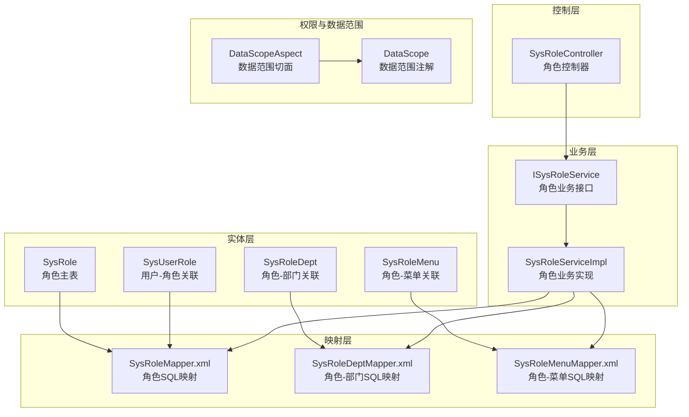
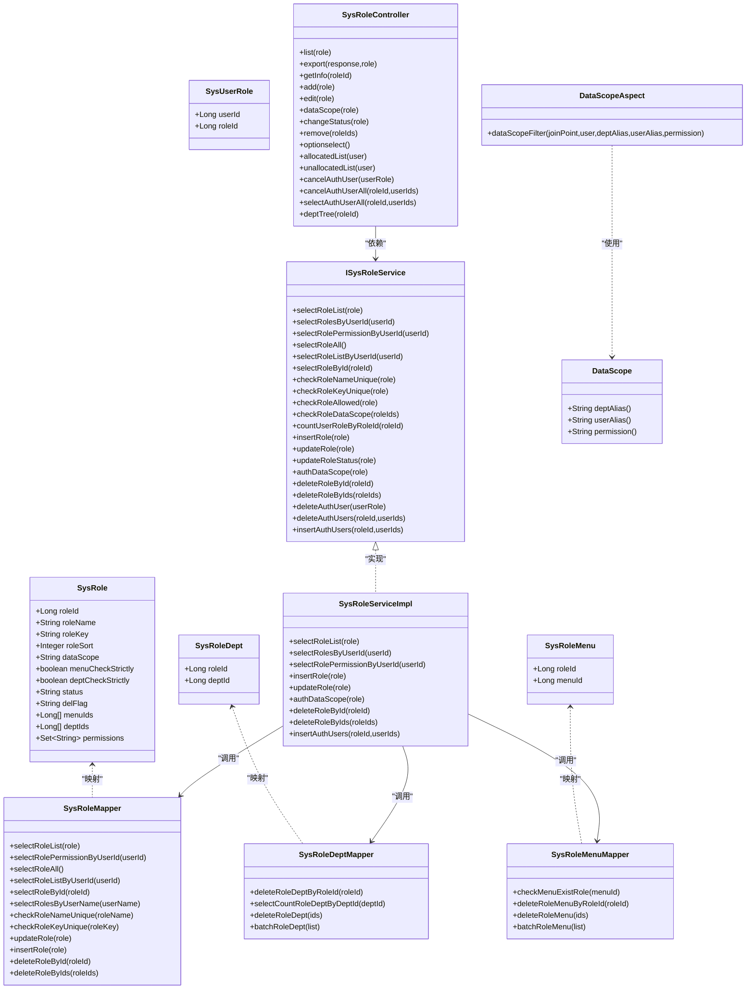
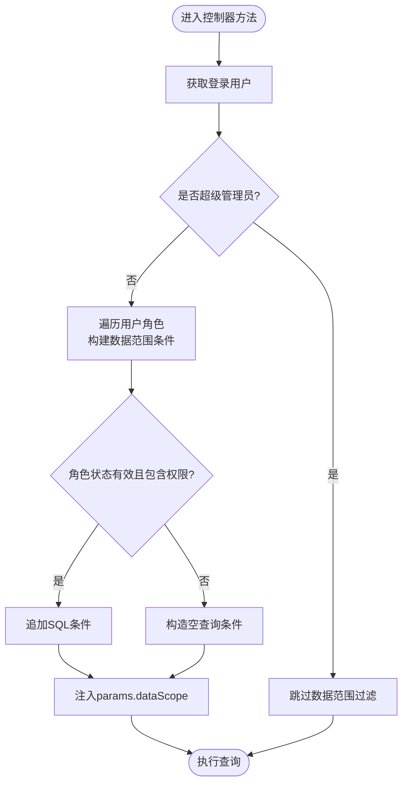
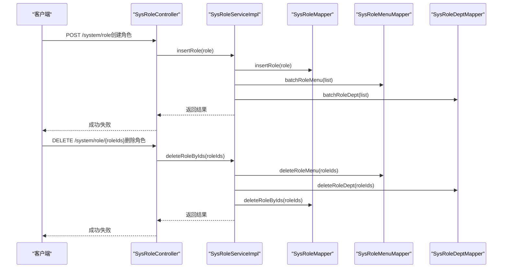
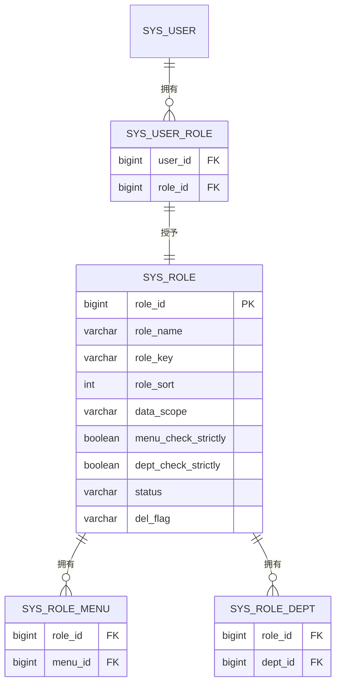
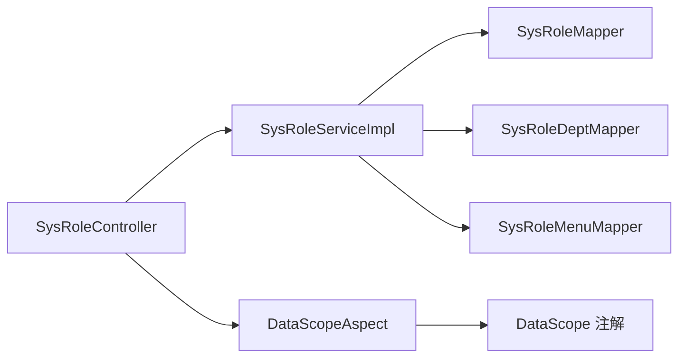

# 角色权限表设计

<cite>
**本文档引用的文件**
- [SysRole.java](file://blog-common/src/main/java/blog/common/core/domain/entity/SysRole.java)
- [SysRoleDept.java](file://blog-system/src/main/java/blog/system/domain/SysRoleDept.java)
- [SysRoleMenu.java](file://blog-system/src/main/java/blog/system/domain/SysRoleMenu.java)
- [SysUserRole.java](file://blog-system/src/main/java/blog/system/domain/SysUserRole.java)
- [SysRoleMapper.java](file://blog-system/src/main/java/blog/system/mapper/SysRoleMapper.java)
- [SysRoleDeptMapper.java](file://blog-system/src/main/java/blog/system/mapper/SysRoleDeptMapper.java)
- [SysRoleMenuMapper.java](file://blog-system/src/main/java/blog/system/mapper/SysRoleMenuMapper.java)
- [SysRoleMapper.xml](file://blog-system/src/main/resources/mapper/system/SysRoleMapper.xml)
- [SysRoleDeptMapper.xml](file://blog-system/src/main/resources/mapper/system/SysRoleDeptMapper.xml)
- [SysRoleMenuMapper.xml](file://blog-system/src/main/resources/mapper/system/SysRoleMenuMapper.xml)
- [ISysRoleService.java](file://blog-system/src/main/java/blog/system/service/ISysRoleService.java)
- [SysRoleServiceImpl.java](file://blog-system/src/main/java/blog/system/service/impl/SysRoleServiceImpl.java)
- [SysRoleController.java](file://blog-admin/src/main/java/blog/web/controller/system/SysRoleController.java)
- [DataScopeAspect.java](file://blog-framework/src/main/java/blog/framework/aspectj/DataScopeAspect.java)
- [DataScope.java](file://blog-common/src/main/java/blog/common/annotation/DataScope.java)
- [ry-vue-owner.sql](file://ry-vue-owner.sql)
</cite>

## 目录
1. [简介](#简介)
2. [项目结构](#项目结构)
3. [核心组件](#核心组件)
4. [架构总览](#架构总览)
5. [详细组件分析](#详细组件分析)
6. [依赖关系分析](#依赖关系分析)
7. [性能考量](#性能考量)
8. [故障排除指南](#故障排除指南)
9. [结论](#结论)
10. [附录](#附录)

## 简介
本文件系统性梳理角色权限表设计，围绕角色主表（sys_role）、角色部门关联表（sys_role_dept）、角色菜单关联表（sys_role_menu）以及用户角色关联表（sys_user_role）展开，阐明字段定义、角色级别与权限范围、权限继承与数据权限控制、菜单权限分配机制、状态管理与权限验证策略，并提供完整的数据库操作流程与可视化图表，帮助开发者快速理解并实施角色权限管理的数据库架构。

## 项目结构
角色权限相关代码分布在以下模块：
- 实体层：SysRole、SysRoleDept、SysRoleMenu、SysUserRole
- 映射层：各Mapper接口与对应的XML映射文件
- 业务层：ISysRoleService与SysRoleServiceImpl
- 控制层：SysRoleController
- 权限与数据范围切面：DataScopeAspect与DataScope注解
- 数据库脚本：ry-vue-owner.sql

**图表来源**
- [SysRole.java:15-240](file://blog-common/src/main/java/blog/common/core/domain/entity/SysRole.java#L15-L240)
- [SysRoleDept.java:6-46](file://blog-system/src/main/java/blog/system/domain/SysRoleDept.java#L6-L46)
- [SysRoleMenu.java:6-46](file://blog-system/src/main/java/blog/system/domain/SysRoleMenu.java#L6-L46)
- [SysUserRole.java:6-46](file://blog-system/src/main/java/blog/system/domain/SysUserRole.java#L6-L46)
- [SysRoleMapper.xml:1-152](file://blog-system/src/main/resources/mapper/system/SysRoleMapper.xml#L1-L152)
- [SysRoleDeptMapper.xml:1-34](file://blog-system/src/main/resources/mapper/system/SysRoleDeptMapper.xml#L1-L34)
- [SysRoleMenuMapper.xml:1-34](file://blog-system/src/main/resources/mapper/system/SysRoleMenuMapper.xml#L1-L34)
- [ISysRoleService.java:1-175](file://blog-system/src/main/java/blog/system/service/ISysRoleService.java#L1-L175)
- [SysRoleServiceImpl.java:1-389](file://blog-system/src/main/java/blog/system/service/impl/SysRoleServiceImpl.java#L1-L389)
- [SysRoleController.java:1-240](file://blog-admin/src/main/java/blog/web/controller/system/SysRoleController.java#L1-L240)
- [DataScopeAspect.java:48-153](file://blog-framework/src/main/java/blog/framework/aspectj/DataScopeAspect.java#L48-L153)
- [DataScope.java:1-32](file://blog-common/src/main/java/blog/common/annotation/DataScope.java#L1-L32)

**章节来源**
- [SysRole.java:15-240](file://blog-common/src/main/java/blog/common/core/domain/entity/SysRole.java#L15-L240)
- [SysRoleMapper.xml:1-152](file://blog-system/src/main/resources/mapper/system/SysRoleMapper.xml#L1-L152)
- [SysRoleServiceImpl.java:1-389](file://blog-system/src/main/java/blog/system/service/impl/SysRoleServiceImpl.java#L1-L389)

## 核心组件
本节聚焦角色权限表设计的关键实体与映射文件，明确字段含义、约束与用途。

- 角色主表（sys_role）
  - 字段要点：角色ID、角色名称、角色权限（roleKey）、显示顺序、数据范围（dataScope）、菜单/部门勾选严格模式、状态、删除标志、创建/更新信息等
  - 关键设计：roleKey用于权限标识，支持多角色权限拼接；dataScope定义数据可见范围；menuCheckStrictly与deptCheckStrictly控制树选择联动显示
  - 状态管理：status=0正常，status=1停用；delFlag=0存在，delFlag=2删除（软删除）

- 角色部门关联表（sys_role_dept）
  - 字段要点：roleId、deptId
  - 设计要点：多角色可绑定多个部门，用于数据权限控制

- 角色菜单关联表（sys_role_menu）
  - 字段要点：roleId、menuId
  - 设计要点：多角色可绑定多个菜单，用于菜单权限分配

- 用户角色关联表（sys_user_role）
  - 字段要点：userId、roleId
  - 设计要点：多对多关系，用户可拥有多个角色

**章节来源**
- [SysRole.java:24-94](file://blog-common/src/main/java/blog/common/core/domain/entity/SysRole.java#L24-L94)
- [SysRoleDept.java:12-20](file://blog-system/src/main/java/blog/system/domain/SysRoleDept.java#L12-L20)
- [SysRoleMenu.java:12-20](file://blog-system/src/main/java/blog/system/domain/SysRoleMenu.java#L12-L20)
- [SysUserRole.java:12-20](file://blog-system/src/main/java/blog/system/domain/SysUserRole.java#L12-L20)
- [SysRoleMapper.xml:7-22](file://blog-system/src/main/resources/mapper/system/SysRoleMapper.xml#L7-L22)
- [SysRoleDeptMapper.xml:7-10](file://blog-system/src/main/resources/mapper/system/SysRoleDeptMapper.xml#L7-L10)
- [SysRoleMenuMapper.xml:7-10](file://blog-system/src/main/resources/mapper/system/SysRoleMenuMapper.xml#L7-L10)

## 架构总览
角色权限体系采用“实体-映射-业务-控制-权限切面”的分层架构，结合数据范围注解与切面实现动态权限过滤与数据权限控制。

**图表来源**
- [SysRole.java:21-239](file://blog-common/src/main/java/blog/common/core/domain/entity/SysRole.java#L21-L239)
- [SysRoleDept.java:11-46](file://blog-system/src/main/java/blog/system/domain/SysRoleDept.java#L11-L46)
- [SysRoleMenu.java:11-46](file://blog-system/src/main/java/blog/system/domain/SysRoleMenu.java#L11-L46)
- [SysUserRole.java:11-46](file://blog-system/src/main/java/blog/system/domain/SysUserRole.java#L11-L46)
- [SysRoleMapper.java:13-109](file://blog-system/src/main/java/blog/system/mapper/SysRoleMapper.java#L13-L109)
- [SysRoleDeptMapper.java:12-45](file://blog-system/src/main/java/blog/system/mapper/SysRoleDeptMapper.java#L12-L45)
- [SysRoleMenuMapper.java:12-45](file://blog-system/src/main/java/blog/system/mapper/SysRoleMenuMapper.java#L12-L45)
- [ISysRoleService.java:15-175](file://blog-system/src/main/java/blog/system/service/ISysRoleService.java#L15-L175)
- [SysRoleServiceImpl.java:36-389](file://blog-system/src/main/java/blog/system/service/impl/SysRoleServiceImpl.java#L36-L389)
- [SysRoleController.java:42-240](file://blog-admin/src/main/java/blog/web/controller/system/SysRoleController.java#L42-L240)
- [DataScopeAspect.java:65-142](file://blog-framework/src/main/java/blog/framework/aspectj/DataScopeAspect.java#L65-L142)
- [DataScope.java:17-32](file://blog-common/src/main/java/blog/common/annotation/DataScope.java#L17-L32)

## 详细组件分析

### 角色主表（sys_role）设计
- 字段定义与职责
  - 角色ID：主键，唯一标识
  - 角色名称：角色展示名称，校验长度
  - 角色权限（roleKey）：权限标识符，支持多角色权限拼接
  - 显示顺序：用于排序
  - 数据范围（dataScope）：定义数据可见范围（所有、自定义、本部门、本部门及以下、仅本人）
  - 菜单/部门勾选严格模式：控制树选择联动显示
  - 状态与删除标志：状态=0正常/1停用；delFlag=0存在/2删除（软删除）
  - 创建/更新信息：记录创建与更新时间与人员

- 角色级别与权限范围
  - dataScope字段定义了四种数据范围策略，配合切面实现动态过滤
  - menuCheckStrictly与deptCheckStrictly用于前端树选择联动控制

- 状态管理
  - 支持启用/停用切换，停用后不再参与权限计算
  - 软删除避免物理删除造成关联数据丢失

**章节来源**
- [SysRole.java:24-94](file://blog-common/src/main/java/blog/common/core/domain/entity/SysRole.java#L24-L94)
- [SysRoleMapper.xml:7-22](file://blog-system/src/main/resources/mapper/system/SysRoleMapper.xml#L7-L22)

### 角色部门关联表（sys_role_dept）设计
- 字段定义
  - roleId：角色ID
  - deptId：部门ID
- 设计要点
  - 多角色可绑定多个部门，用于实现部门维度的数据权限控制
  - 提供批量删除与批量新增接口，便于角色数据权限的集中维护

**章节来源**
- [SysRoleDept.java:12-20](file://blog-system/src/main/java/blog/system/domain/SysRoleDept.java#L12-L20)
- [SysRoleDeptMapper.xml:12-18](file://blog-system/src/main/resources/mapper/system/SysRoleDeptMapper.xml#L12-L18)
- [SysRoleServiceImpl.java:286-304](file://blog-system/src/main/java/blog/system/service/impl/SysRoleServiceImpl.java#L286-L304)

### 角色菜单关联表（sys_role_menu）设计
- 字段定义
  - roleId：角色ID
  - menuId：菜单ID
- 设计要点
  - 多角色可绑定多个菜单，用于菜单权限分配
  - 提供菜单使用量检查，避免菜单被角色引用时误删

**章节来源**
- [SysRoleMenu.java:12-20](file://blog-system/src/main/java/blog/system/domain/SysRoleMenu.java#L12-L20)
- [SysRoleMenuMapper.xml:12-14](file://blog-system/src/main/resources/mapper/system/SysRoleMenuMapper.xml#L12-L14)
- [SysRoleServiceImpl.java:269-283](file://blog-system/src/main/java/blog/system/service/impl/SysRoleServiceImpl.java#L269-L283)

### 用户角色关联表（sys_user_role）设计
- 字段定义
  - userId：用户ID
  - roleId：角色ID
- 设计要点
  - 多对多关系，支持用户拥有多个角色
  - 提供批量授权与取消授权接口

**章节来源**
- [SysUserRole.java:12-20](file://blog-system/src/main/java/blog/system/domain/SysUserRole.java#L12-L20)
- [SysRoleServiceImpl.java:376-387](file://blog-system/src/main/java/blog/system/service/impl/SysRoleServiceImpl.java#L376-L387)

### 权限验证与数据范围控制
- 数据范围注解与切面
  - DataScope注解用于标注方法，指定部门别名、用户别名与权限字符
  - DataScopeAspect在前置通知中解析当前用户角色与权限，拼接SQL过滤条件
  - 支持多种数据范围策略：全部、自定义、本部门、本部门及以下、仅本人
  - 当角色不包含目标权限或状态为禁用时，过滤条件为空，确保不返回任何数据

**图表来源**
- [DataScopeAspect.java:65-142](file://blog-framework/src/main/java/blog/framework/aspectj/DataScopeAspect.java#L65-L142)
- [DataScope.java:17-32](file://blog-common/src/main/java/blog/common/annotation/DataScope.java#L17-L32)

**章节来源**
- [DataScopeAspect.java:48-153](file://blog-framework/src/main/java/blog/framework/aspectj/DataScopeAspect.java#L48-L153)
- [DataScope.java:1-32](file://blog-common/src/main/java/blog/common/annotation/DataScope.java#L1-L32)

### 角色权限分配与回收流程
- 角色创建
  - 控制器接收请求，校验角色名称与权限字符唯一性
  - 业务层新增角色并写入sys_role
  - 同步写入角色菜单关联（sys_role_menu）与角色部门关联（sys_role_dept）

- 权限回收
  - 删除角色时，先删除角色菜单关联与角色部门关联
  - 再进行软删除（更新delFlag=2）

- 授权与取消授权
  - 批量授权用户角色：插入sys_user_role
  - 批量取消授权：删除sys_user_role

**图表来源**
- [SysRoleController.java:88-164](file://blog-admin/src/main/java/blog/web/controller/system/SysRoleController.java#L88-L164)
- [SysRoleServiceImpl.java:212-344](file://blog-system/src/main/java/blog/system/service/impl/SysRoleServiceImpl.java#L212-L344)
- [SysRoleMapper.xml:96-151](file://blog-system/src/main/resources/mapper/system/SysRoleMapper.xml#L96-L151)
- [SysRoleMenuMapper.xml:27-32](file://blog-system/src/main/resources/mapper/system/SysRoleMenuMapper.xml#L27-L32)
- [SysRoleDeptMapper.xml:27-32](file://blog-system/src/main/resources/mapper/system/SysRoleDeptMapper.xml#L27-L32)

**章节来源**
- [SysRoleController.java:88-164](file://blog-admin/src/main/java/blog/web/controller/system/SysRoleController.java#L88-L164)
- [SysRoleServiceImpl.java:212-344](file://blog-system/src/main/java/blog/system/service/impl/SysRoleServiceImpl.java#L212-L344)

### 角色权限继承与菜单权限分配机制
- 权限继承
  - 用户可拥有多个角色，权限集合为各角色权限的并集
  - 权限验证时，按角色状态与权限字符进行过滤

- 菜单权限分配
  - 通过sys_role_menu将角色与菜单建立关联
  - 前端路由与按钮权限由菜单perms字段与角色权限共同决定

**图表来源**
- [SysRole.java:24-94](file://blog-common/src/main/java/blog/common/core/domain/entity/SysRole.java#L24-L94)
- [SysRoleDept.java:12-20](file://blog-system/src/main/java/blog/system/domain/SysRoleDept.java#L12-L20)
- [SysRoleMenu.java:12-20](file://blog-system/src/main/java/blog/system/domain/SysRoleMenu.java#L12-L20)
- [SysUserRole.java:12-20](file://blog-system/src/main/java/blog/system/domain/SysUserRole.java#L12-L20)

**章节来源**
- [SysRoleServiceImpl.java:88-98](file://blog-system/src/main/java/blog/system/service/impl/SysRoleServiceImpl.java#L88-L98)
- [SysRoleMapper.xml:59-62](file://blog-system/src/main/resources/mapper/system/SysRoleMapper.xml#L59-L62)

## 依赖关系分析
- 组件耦合
  - SysRoleServiceImpl依赖SysRoleMapper、SysRoleDeptMapper、SysRoleMenuMapper与SysUserRoleMapper
  - SysRoleController依赖ISysRoleService与权限服务
  - DataScopeAspect通过注解与切面实现横切数据范围过滤

- 外部依赖
  - MyBatis XML映射文件负责SQL执行
  - Spring AOP实现权限切面与事务管理

**图表来源**
- [SysRoleController.java:42-240](file://blog-admin/src/main/java/blog/web/controller/system/SysRoleController.java#L42-L240)
- [SysRoleServiceImpl.java:36-389](file://blog-system/src/main/java/blog/system/service/impl/SysRoleServiceImpl.java#L36-L389)
- [DataScopeAspect.java:65-142](file://blog-framework/src/main/java/blog/framework/aspectj/DataScopeAspect.java#L65-L142)
- [DataScope.java:17-32](file://blog-common/src/main/java/blog/common/annotation/DataScope.java#L17-L32)

**章节来源**
- [SysRoleController.java:42-240](file://blog-admin/src/main/java/blog/web/controller/system/SysRoleController.java#L42-L240)
- [SysRoleServiceImpl.java:36-389](file://blog-system/src/main/java/blog/system/service/impl/SysRoleServiceImpl.java#L36-L389)

## 性能考量
- 索引与查询
  - 建议在sys_role_menu(menu_id)与sys_role_dept(dept_id)建立索引，提升菜单/部门使用量检查与权限过滤效率
  - 在sys_user_role(userId, roleId)建立复合索引，优化用户角色查询与授权/取消授权操作

- 批量操作
  - 批量新增角色菜单/部门时使用批量插入，减少网络往返与事务开销
  - 批量删除角色时先清理关联再软删除，避免冗余数据

- 缓存与权限刷新
  - 角色权限变更后建议刷新用户权限缓存，确保权限即时生效

## 故障排除指南
- 角色删除失败
  - 现象：提示角色已分配，无法删除
  - 原因：角色仍被用户持有
  - 处理：先取消授权用户角色，再删除角色

- 权限验证无效
  - 现象：数据范围过滤未生效
  - 原因：角色状态为停用或不包含目标权限字符
  - 处理：检查角色状态与权限字符，确保角色处于正常状态且包含所需权限

- 菜单删除失败
  - 现象：提示菜单已被角色引用
  - 处理：先清理角色对该菜单的授权，再删除菜单

**章节来源**
- [SysRoleServiceImpl.java:335-337](file://blog-system/src/main/java/blog/system/service/impl/SysRoleServiceImpl.java#L335-L337)
- [DataScopeAspect.java:97-134](file://blog-framework/src/main/java/blog/framework/aspectj/DataScopeAspect.java#L97-L134)
- [SysRoleMenuMapper.xml:12-14](file://blog-system/src/main/resources/mapper/system/SysRoleMenuMapper.xml#L12-L14)

## 结论
本角色权限表设计通过清晰的实体模型与映射关系，实现了角色、菜单、部门与用户的灵活关联；结合数据范围注解与切面，提供了强大的动态权限过滤能力；配套的业务层封装与控制器接口，确保了角色创建、权限分配与回收的完整闭环。该架构具备良好的扩展性与可维护性，适用于大多数后台管理系统的需求。

## 附录
- 数据库脚本位置：ry-vue-owner.sql
- 关键表结构参考：
  - sys_role：角色主表
  - sys_role_dept：角色-部门关联
  - sys_role_menu：角色-菜单关联
  - sys_user_role：用户-角色关联

**章节来源**
- [ry-vue-owner.sql:1-800](file://ry-vue-owner.sql#L1-L800)