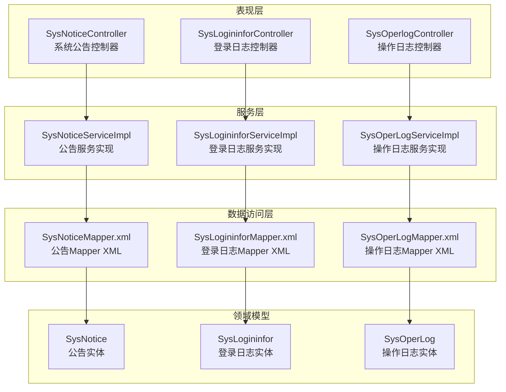
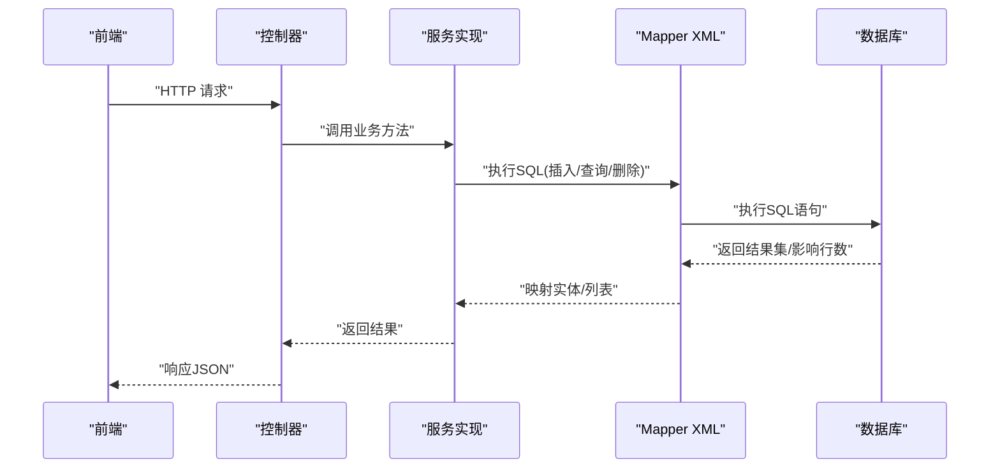
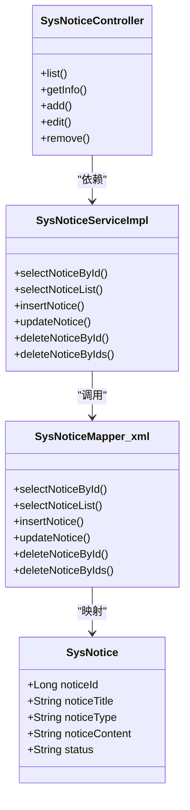
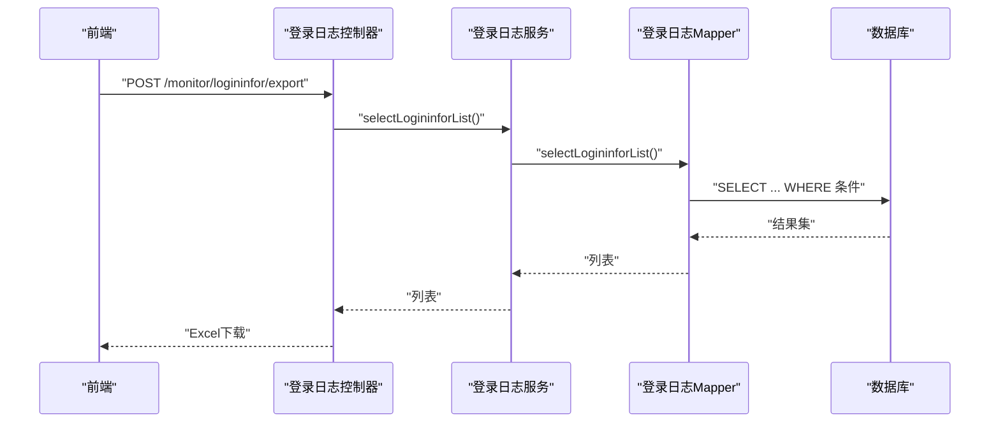
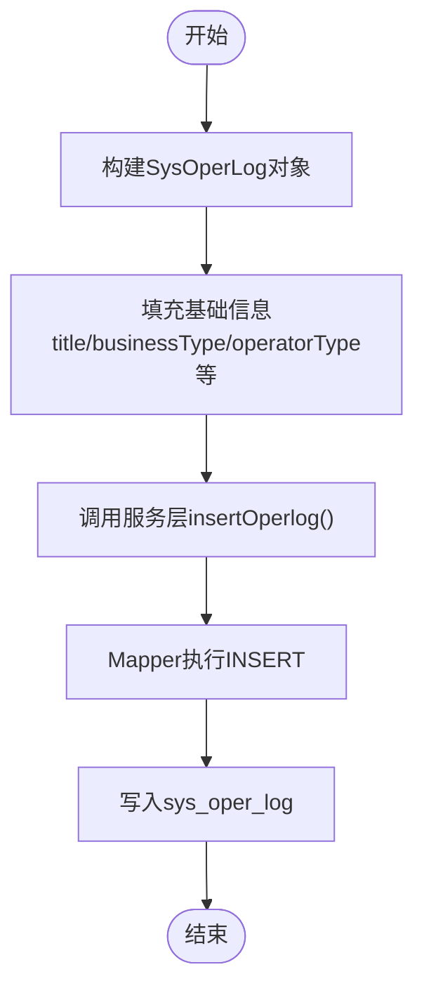
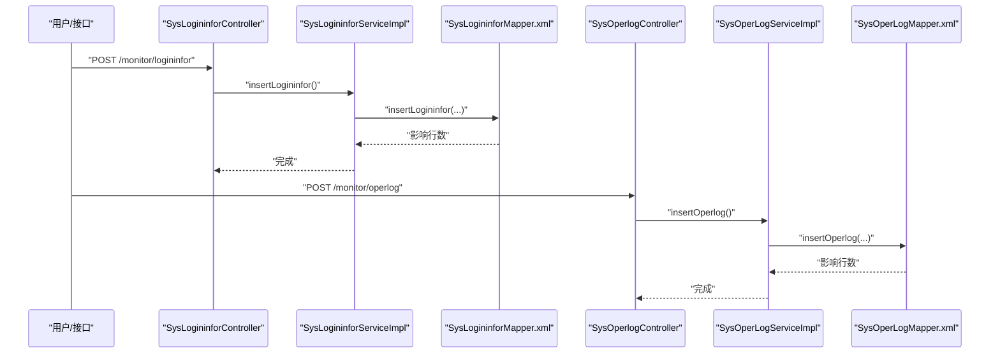
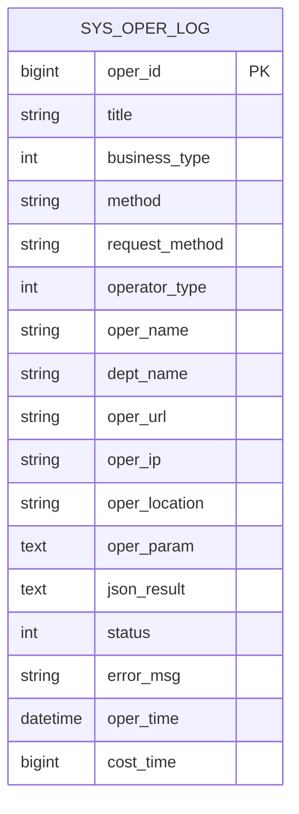
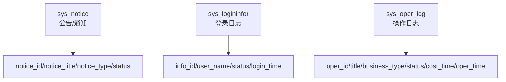
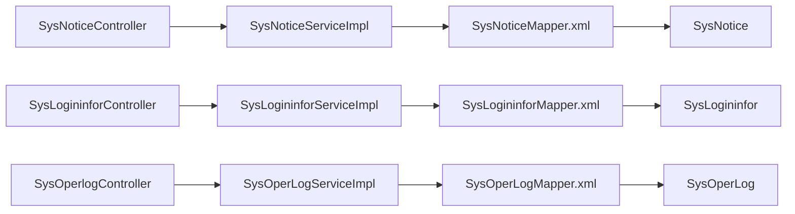

# 通知日志表设计

<cite>
**本文引用的文件**
- [SysNotice.java](file://blog-system/src/main/java/blog/system/domain/SysNotice.java)
- [SysLogininfor.java](file://blog-system/src/main/java/blog/system/domain/SysLogininfor.java)
- [SysOperLog.java](file://blog-system/src/main/java/blog/system/domain/SysOperLog.java)
- [SysNoticeMapper.xml](file://blog-system/src/main/resources/mapper/system/SysNoticeMapper.xml)
- [SysLogininforMapper.xml](file://blog-system/src/main/resources/mapper/system/SysLogininforMapper.xml)
- [SysOperLogMapper.xml](file://blog-system/src/main/resources/mapper/system/SysOperLogMapper.xml)
- [SysNoticeServiceImpl.java](file://blog-system/src/main/java/blog/system/service/impl/SysNoticeServiceImpl.java)
- [SysLogininforServiceImpl.java](file://blog-system/src/main/java/blog/system/service/impl/SysLogininforServiceImpl.java)
- [SysOperLogServiceImpl.java](file://blog-system/src/main/java/blog/system/service/impl/SysOperLogServiceImpl.java)
- [SysNoticeController.java](file://blog-admin/src/main/java/blog/web/controller/system/SysNoticeController.java)
- [SysLogininforController.java](file://blog-admin/src/main/java/blog/web/controller/monitor/SysLogininforController.java)
- [SysOperlogController.java](file://blog-admin/src/main/java/blog/web/controller/monitor/SysOperlogController.java)
- [ry-vue-owner.sql](file://ry-vue-owner.sql)
</cite>

## 目录
1. [引言](#引言)
2. [项目结构](#项目结构)
3. [核心组件](#核心组件)
4. [架构总览](#架构总览)
5. [详细组件分析](#详细组件分析)
6. [依赖分析](#依赖分析)
7. [性能考虑](#性能考虑)
8. [故障排查指南](#故障排查指南)
9. [结论](#结论)
10. [附录](#附录)

## 引言
本文件面向“通知日志表设计”的主题，系统性梳理与通知公告、系统登录日志、系统操作日志相关的数据库表结构、实体模型、持久化映射、服务层与控制器层的调用链路，并结合现有代码实现，给出日志记录策略、分类、查询、导出、清理等完整能力的数据库层面实现要点。同时通过多种可视化图表帮助开发者快速理解系统日志管理的数据库设计架构。

## 项目结构
围绕通知与日志管理，系统采用分层清晰的结构：领域模型(domain)、MyBatis 映射(mapper)、服务(service)、控制器(controller)，并配合统一的响应封装与权限注解，形成从接口到数据库的完整闭环。

**图表来源**
- [SysNoticeController.java:1-87](file://blog-admin/src/main/java/blog/web/controller/system/SysNoticeController.java#L1-87)
- [SysLogininforController.java:1-78](file://blog-admin/src/main/java/blog/web/controller/monitor/SysLogininforController.java#L1-78)
- [SysOperlogController.java:1-66](file://blog-admin/src/main/java/blog/web/controller/monitor/SysOperlogController.java#L1-66)
- [SysNoticeServiceImpl.java:1-88](file://blog-system/src/main/java/blog/system/service/impl/SysNoticeServiceImpl.java#L1-88)
- [SysLogininforServiceImpl.java:1-63](file://blog-system/src/main/java/blog/system/service/impl/SysLogininforServiceImpl.java#L1-63)
- [SysOperLogServiceImpl.java:1-73](file://blog-system/src/main/java/blog/system/service/impl/SysOperLogServiceImpl.java#L1-73)
- [SysNoticeMapper.xml:1-89](file://blog-system/src/main/resources/mapper/system/SysNoticeMapper.xml#L1-89)
- [SysLogininforMapper.xml:1-57](file://blog-system/src/main/resources/mapper/system/SysLogininforMapper.xml#L1-57)
- [SysOperLogMapper.xml:1-87](file://blog-system/src/main/resources/mapper/system/SysOperLogMapper.xml#L1-87)
- [SysNotice.java:1-104](file://blog-system/src/main/java/blog/system/domain/SysNotice.java#L1-104)
- [SysLogininfor.java:1-147](file://blog-system/src/main/java/blog/system/domain/SysLogininfor.java#L1-147)
- [SysOperLog.java:1-134](file://blog-system/src/main/java/blog/system/domain/SysOperLog.java#L1-134)

**章节来源**
- [SysNoticeController.java:1-87](file://blog-admin/src/main/java/blog/web/controller/system/SysNoticeController.java#L1-87)
- [SysLogininforController.java:1-78](file://blog-admin/src/main/java/blog/web/controller/monitor/SysLogininforController.java#L1-78)
- [SysOperlogController.java:1-66](file://blog-admin/src/main/java/blog/web/controller/monitor/SysOperlogController.java#L1-66)

## 核心组件
本节聚焦三类核心表：通知公告(sys_notice)、系统登录日志(sys_logininfor)、系统操作日志(sys_oper_log)。下述表格给出各表的关键字段与约束说明（基于实体类与Mapper XML映射）：

- 通知公告表(sys_notice)
  - 主键：notice_id
  - 关键字段：notice_title、notice_type、notice_content、status、create_by、create_time、update_by、update_time、remark
  - 字段含义与约束：
    - notice_type：1=通知；2=公告
    - status：0=正常；1=关闭
    - notice_title：标题长度校验与XSS过滤
    - notice_content：富文本内容，使用CAST为字符类型便于读取
  - 常见操作：新增、更新、删除、批量删除、按条件查询

- 系统登录日志表(sys_logininfor)
  - 主键：info_id
  - 关键字段：user_name、status、ipaddr、login_location、browser、os、msg、login_time
  - 字段含义与约束：
    - status：0=成功；1=失败
    - login_time：使用系统时间写入
  - 常见操作：新增、分页查询、按条件筛选、批量删除、清空(truncate)

- 系统操作日志表(sys_oper_log)
  - 主键：oper_id
  - 关键字段：title、business_type、method、request_method、operator_type、oper_name、dept_name、oper_url、oper_ip、oper_location、oper_param、json_result、status、error_msg、oper_time、cost_time
  - 字段含义与约束：
    - business_type：0=其它；1=新增；2=修改；3=删除；4=授权；5=导出；6=导入；7=强退；8=生成代码；9=清空数据
    - operator_type：0=其它；1=后台用户；2=手机端用户
    - status：0=正常；1=异常
    - oper_time：使用系统时间写入
  - 常见操作：新增、分页查询、按业务类型/状态/时间范围筛选、批量删除、清空(truncate)

**章节来源**
- [SysNotice.java:11-104](file://blog-system/src/main/java/blog/system/domain/SysNotice.java#L11-L104)
- [SysNoticeMapper.xml:7-43](file://blog-system/src/main/resources/mapper/system/SysNoticeMapper.xml#L7-L43)
- [SysLogininfor.java:11-147](file://blog-system/src/main/java/blog/system/domain/SysLogininfor.java#L11-L147)
- [SysLogininforMapper.xml:7-44](file://blog-system/src/main/resources/mapper/system/SysLogininforMapper.xml#L7-L44)
- [SysOperLog.java:14-134](file://blog-system/src/main/java/blog/system/domain/SysOperLog.java#L14-L134)
- [SysOperLogMapper.xml:7-69](file://blog-system/src/main/resources/mapper/system/SysOperLogMapper.xml#L7-L69)

## 架构总览
下图展示从前端请求到数据库落库的总体流程，涵盖控制器、服务层、Mapper XML与实体类之间的协作关系。

**图表来源**
- [SysNoticeController.java:30-87](file://blog-admin/src/main/java/blog/web/controller/system/SysNoticeController.java#L30-L87)
- [SysNoticeServiceImpl.java:18-88](file://blog-system/src/main/java/blog/system/service/impl/SysNoticeServiceImpl.java#L18-L88)
- [SysNoticeMapper.xml:45-89](file://blog-system/src/main/resources/mapper/system/SysNoticeMapper.xml#L45-L89)
- [SysLogininforController.java:30-78](file://blog-admin/src/main/java/blog/web/controller/monitor/SysLogininforController.java#L30-L78)
- [SysLogininforServiceImpl.java:18-63](file://blog-system/src/main/java/blog/system/service/impl/SysLogininforServiceImpl.java#L18-L63)
- [SysLogininforMapper.xml:19-57](file://blog-system/src/main/resources/mapper/system/SysLogininforMapper.xml#L19-L57)
- [SysOperlogController.java:28-66](file://blog-admin/src/main/java/blog/web/controller/monitor/SysOperlogController.java#L28-L66)
- [SysOperLogServiceImpl.java:18-73](file://blog-system/src/main/java/blog/system/service/impl/SysOperLogServiceImpl.java#L18-L73)
- [SysOperLogMapper.xml:32-87](file://blog-system/src/main/resources/mapper/system/SysOperLogMapper.xml#L32-L87)

## 详细组件分析

### 通知公告表(sys_notice)设计
- 表结构要点
  - 主键：notice_id
  - 类型字段：notice_type（1=通知；2=公告）
  - 状态字段：status（0=正常；1=关闭）
  - 内容字段：notice_content（以字符类型读取，支持富文本）
  - 安全与校验：notice_title进行XSS过滤与长度限制
- 常用操作
  - 新增：insertNotice，动态拼接字段，自动填充创建时间
  - 更新：updateNotice，动态更新字段，自动更新时间
  - 查询：按noticeId、noticeTitle、noticeType、createBy等条件查询
  - 删除：单条与批量删除
- 控制器与服务
  - 控制器提供分页列表、详情、新增、修改、删除接口
  - 服务实现封装Mapper调用，统一事务与返回值

**图表来源**
- [SysNotice.java:16-104](file://blog-system/src/main/java/blog/system/domain/SysNotice.java#L16-L104)
- [SysNoticeMapper.xml:20-89](file://blog-system/src/main/resources/mapper/system/SysNoticeMapper.xml#L20-L89)
- [SysNoticeServiceImpl.java:18-88](file://blog-system/src/main/java/blog/system/service/impl/SysNoticeServiceImpl.java#L18-L88)
- [SysNoticeController.java:30-87](file://blog-admin/src/main/java/blog/web/controller/system/SysNoticeController.java#L30-L87)

**章节来源**
- [SysNotice.java:11-104](file://blog-system/src/main/java/blog/system/domain/SysNotice.java#L11-L104)
- [SysNoticeMapper.xml:7-89](file://blog-system/src/main/resources/mapper/system/SysNoticeMapper.xml#L7-L89)
- [SysNoticeServiceImpl.java:18-88](file://blog-system/src/main/java/blog/system/service/impl/SysNoticeServiceImpl.java#L18-L88)
- [SysNoticeController.java:30-87](file://blog-admin/src/main/java/blog/web/controller/system/SysNoticeController.java#L30-L87)

### 系统登录日志表(sys_logininfor)设计
- 表结构要点
  - 主键：info_id
  - 登录状态：status（0=成功；1=失败）
  - 地址与设备：ipaddr、login_location、browser、os
  - 时间：login_time（写入系统时间）
- 常用操作
  - 新增：insertLogininfor，自动填充登录时间
  - 查询：按ip、status、user_name及时间区间筛选
  - 导出：ExcelUtil导出
  - 清理：cleanLogininfor（truncate清空）

**图表来源**
- [SysLogininforController.java:38-53](file://blog-admin/src/main/java/blog/web/controller/monitor/SysLogininforController.java#L38-L53)
- [SysLogininforServiceImpl.java:18-63](file://blog-system/src/main/java/blog/system/service/impl/SysLogininforServiceImpl.java#L18-L63)
- [SysLogininforMapper.xml:24-44](file://blog-system/src/main/resources/mapper/system/SysLogininforMapper.xml#L24-L44)

**章节来源**
- [SysLogininfor.java:11-147](file://blog-system/src/main/java/blog/system/domain/SysLogininfor.java#L11-L147)
- [SysLogininforMapper.xml:7-57](file://blog-system/src/main/resources/mapper/system/SysLogininforMapper.xml#L7-L57)
- [SysLogininforServiceImpl.java:18-63](file://blog-system/src/main/java/blog/system/service/impl/SysLogininforServiceImpl.java#L18-L63)
- [SysLogininforController.java:38-78](file://blog-admin/src/main/java/blog/web/controller/monitor/SysLogininforController.java#L38-L78)

### 系统操作日志表(sys_oper_log)设计
- 表结构要点
  - 主键：oper_id
  - 业务类型：business_type（枚举值覆盖常见业务场景）
  - 操作类别：operator_type（区分后台与移动端）
  - 状态：status（0=正常；1=异常）
  - 性能：cost_time（毫秒）
  - 时间：oper_time（写入系统时间）
- 常用操作
  - 新增：insertOperlog
  - 查询：按operIp、title、businessType、businessTypes、status、operName及时间区间筛选
  - 清理：cleanOperLog（truncate清空）

**图表来源**
- [SysOperLog.java:22-134](file://blog-system/src/main/java/blog/system/domain/SysOperLog.java#L22-L134)
- [SysOperLogMapper.xml:32-35](file://blog-system/src/main/resources/mapper/system/SysOperLogMapper.xml#L32-L35)
- [SysOperLogServiceImpl.java:27-30](file://blog-system/src/main/java/blog/system/service/impl/SysOperLogServiceImpl.java#L27-L30)

**章节来源**
- [SysOperLog.java:14-134](file://blog-system/src/main/java/blog/system/domain/SysOperLog.java#L14-L134)
- [SysOperLogMapper.xml:7-87](file://blog-system/src/main/resources/mapper/system/SysOperLogMapper.xml#L7-L87)
- [SysOperLogServiceImpl.java:18-73](file://blog-system/src/main/java/blog/system/service/impl/SysOperLogServiceImpl.java#L18-L73)
- [SysOperlogController.java:34-66](file://blog-admin/src/main/java/blog/web/controller/monitor/SysOperlogController.java#L34-L66)

### 日志记录流程图
以下流程图展示登录日志与操作日志的典型记录路径，体现控制器、服务与Mapper的协作。

**图表来源**
- [SysLogininforController.java:30-31](file://blog-admin/src/main/java/blog/web/controller/monitor/SysLogininforController.java#L30-L31)
- [SysLogininforServiceImpl.java:28-31](file://blog-system/src/main/java/blog/system/service/impl/SysLogininforServiceImpl.java#L28-L31)
- [SysLogininforMapper.xml:19-22](file://blog-system/src/main/resources/mapper/system/SysLogininforMapper.xml#L19-L22)
- [SysOperlogController.java:28-29](file://blog-admin/src/main/java/blog/web/controller/monitor/SysOperlogController.java#L28-L29)
- [SysOperLogServiceImpl.java:27-30](file://blog-system/src/main/java/blog/system/service/impl/SysOperLogServiceImpl.java#L27-L30)
- [SysOperLogMapper.xml:32-35](file://blog-system/src/main/resources/mapper/system/SysOperLogMapper.xml#L32-L35)

### 审计追踪图
以下图示展示操作日志的审计维度与关键字段，便于审计与合规追溯。

**图表来源**
- [SysOperLog.java:22-134](file://blog-system/src/main/java/blog/system/domain/SysOperLog.java#L22-L134)
- [SysOperLogMapper.xml:7-25](file://blog-system/src/main/resources/mapper/system/SysOperLogMapper.xml#L7-L25)

### 日志分类架构图
以下图示展示三类日志的分类与关键字段，便于理解日志体系的整体架构。

**图表来源**
- [SysNotice.java:19-86](file://blog-system/src/main/java/blog/system/domain/SysNotice.java#L19-L86)
- [SysLogininfor.java:19-145](file://blog-system/src/main/java/blog/system/domain/SysLogininfor.java#L19-L145)
- [SysOperLog.java:24-131](file://blog-system/src/main/java/blog/system/domain/SysOperLog.java#L24-L131)

## 依赖分析
- 控制器到服务：各控制器通过Spring注入服务接口，统一处理分页、鉴权、日志注解与响应封装
- 服务到Mapper：服务实现继承通用基类，直接调用对应Mapper XML执行SQL
- 实体到映射：Mapper XML通过resultMap将数据库列映射到实体类属性
- 外部依赖：MyBatis、Spring Security、Excel工具类等

**图表来源**
- [SysNoticeController.java:30-87](file://blog-admin/src/main/java/blog/web/controller/system/SysNoticeController.java#L30-L87)
- [SysLogininforController.java:30-78](file://blog-admin/src/main/java/blog/web/controller/monitor/SysLogininforController.java#L30-L78)
- [SysOperlogController.java:28-66](file://blog-admin/src/main/java/blog/web/controller/monitor/SysOperlogController.java#L28-L66)
- [SysNoticeServiceImpl.java:18-88](file://blog-system/src/main/java/blog/system/service/impl/SysNoticeServiceImpl.java#L18-L88)
- [SysLogininforServiceImpl.java:18-63](file://blog-system/src/main/java/blog/system/service/impl/SysLogininforServiceImpl.java#L18-L63)
- [SysOperLogServiceImpl.java:18-73](file://blog-system/src/main/java/blog/system/service/impl/SysOperLogServiceImpl.java#L18-L73)
- [SysNoticeMapper.xml:7-18](file://blog-system/src/main/resources/mapper/system/SysNoticeMapper.xml#L7-L18)
- [SysLogininforMapper.xml:7-17](file://blog-system/src/main/resources/mapper/system/SysLogininforMapper.xml#L7-L17)
- [SysOperLogMapper.xml:7-25](file://blog-system/src/main/resources/mapper/system/SysOperLogMapper.xml#L7-L25)

**章节来源**
- [SysNoticeController.java:30-87](file://blog-admin/src/main/java/blog/web/controller/system/SysNoticeController.java#L30-L87)
- [SysLogininforController.java:30-78](file://blog-admin/src/main/java/blog/web/controller/monitor/SysLogininforController.java#L30-L78)
- [SysOperlogController.java:28-66](file://blog-admin/src/main/java/blog/web/controller/monitor/SysOperlogController.java#L28-L66)

## 性能考虑
- 查询性能
  - 合理使用索引：对高频查询字段如login_time、oper_time、status、oper_ip、oper_name等建立索引可提升查询效率
  - 分页与条件过滤：控制器已内置分页与多条件过滤，建议在高并发场景下限制查询范围与时间窗口
- 写入性能
  - 批量删除与清空：提供批量删除与truncate清空接口，适合定期清理历史数据
  - 动态字段插入：公告Mapper采用动态字段插入，减少无效字段写入
- 导出性能
  - Excel导出建议限制导出数量或分批次导出，避免大结果集导致内存压力

## 故障排查指南
- 登录日志导出为空
  - 检查查询条件是否过于严格（如时间范围、状态、IP等），确认是否存在匹配数据
  - 确认ExcelUtil导出逻辑未抛出异常
- 操作日志查询异常
  - 检查businessTypes数组是否正确传入，确保in子句构造正确
  - 确认oper_time的时间格式与边界条件
- 清空日志后数据恢复
  - truncate为DDL操作，通常不可回滚；如需可恢复，请使用DELETE或备份策略
- XSS与长度校验
  - 公告标题存在XSS过滤与长度限制，若提交失败请检查输入内容是否符合规则

**章节来源**
- [SysLogininforMapper.xml:24-44](file://blog-system/src/main/resources/mapper/system/SysLogininforMapper.xml#L24-L44)
- [SysOperLogMapper.xml:37-69](file://blog-system/src/main/resources/mapper/system/SysOperLogMapper.xml#L37-L69)
- [SysNoticeMapper.xml:30-43](file://blog-system/src/main/resources/mapper/system/SysNoticeMapper.xml#L30-L43)

## 结论
本设计以清晰的分层架构与完善的日志能力覆盖了通知公告、登录日志与操作日志的全生命周期管理。通过实体类、Mapper XML与服务层的协同，实现了稳定的增删改查、条件查询、导出与清理能力。建议在生产环境中结合索引优化、分页查询与定期清理策略，保障系统性能与合规要求。

## 附录
- 数据库初始化脚本参考：ry-vue-owner.sql
- 建议的索引与维护策略
  - sys_logininfor(login_time, status, user_name)
  - sys_oper_log(oper_time, status, business_type, oper_name)
  - sys_notice(create_time, status, notice_type)

**章节来源**
- [ry-vue-owner.sql](file://ry-vue-owner.sql)