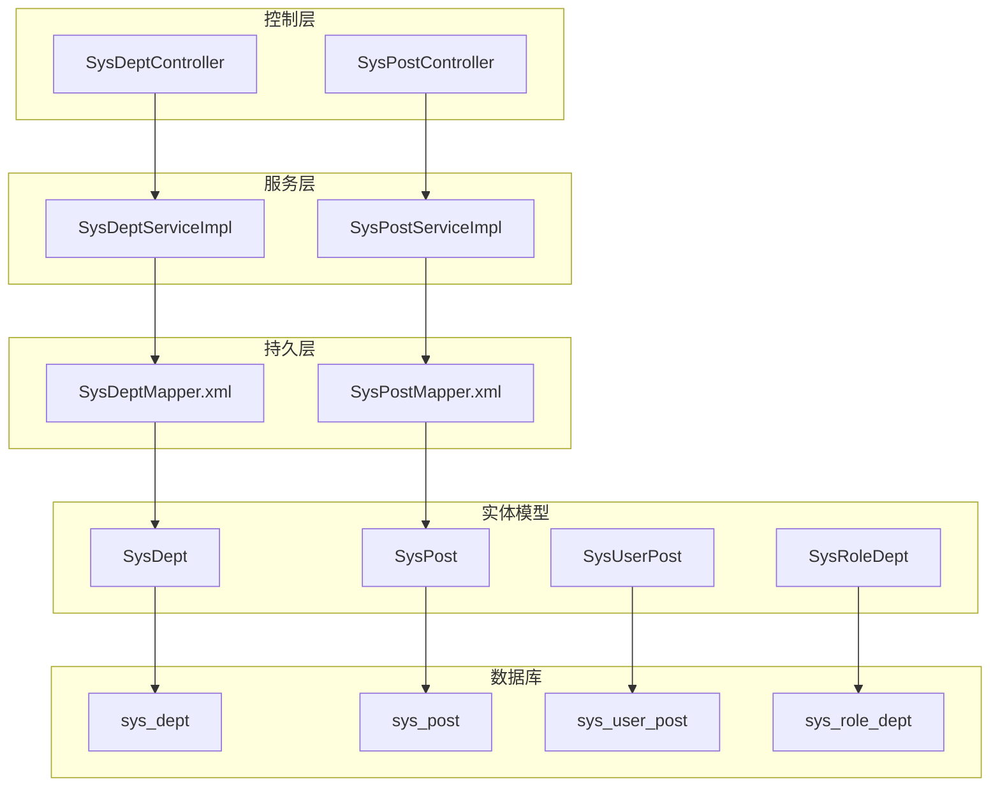
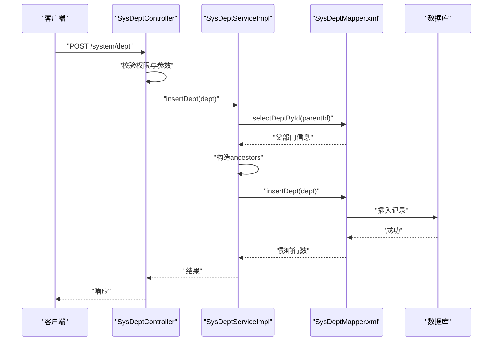
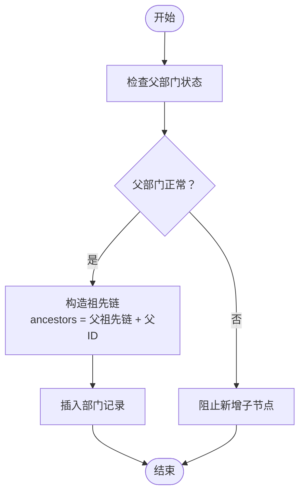
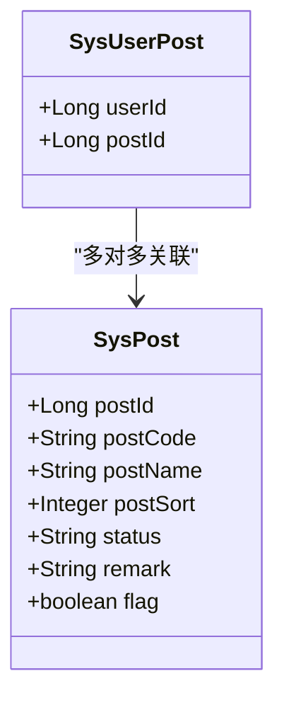
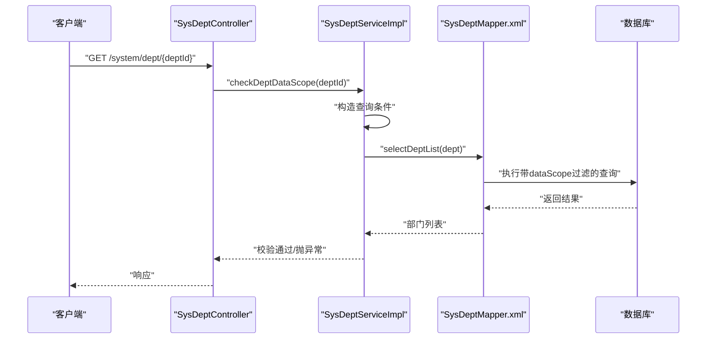
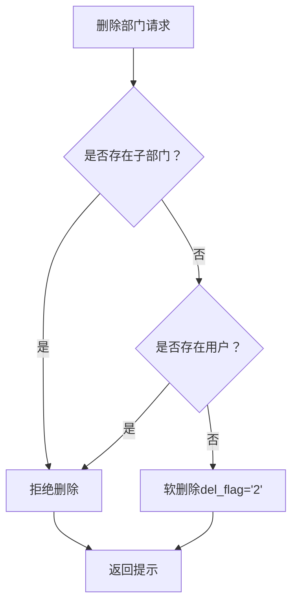
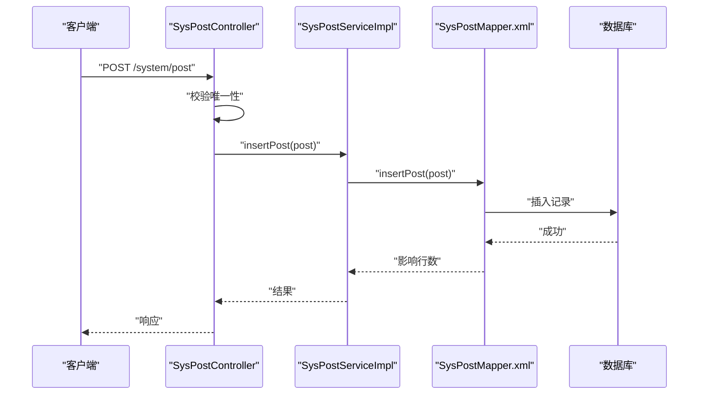
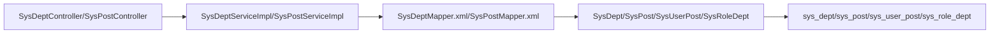

# 部门组织表设计

<cite>
**本文档引用的文件**
- [SysDept.java](file://blog-common/src/main/java/blog/common/core/domain/entity/SysDept.java)
- [SysPost.java](file://blog-system/src/main/java/blog/system/domain/SysPost.java)
- [SysUserPost.java](file://blog-system/src/main/java/blog/system/domain/SysUserPost.java)
- [SysRoleDept.java](file://blog-system/src/main/java/blog/system/domain/SysRoleDept.java)
- [SysDeptMapper.xml](file://blog-system/src/main/resources/mapper/system/SysDeptMapper.xml)
- [SysPostMapper.xml](file://blog-system/src/main/resources/mapper/system/SysPostMapper.xml)
- [SysDeptServiceImpl.java](file://blog-system/src/main/java/blog/system/service/impl/SysDeptServiceImpl.java)
- [SysPostServiceImpl.java](file://blog-system/src/main/java/blog/system/service/impl/SysPostServiceImpl.java)
- [SysDeptController.java](file://blog-admin/src/main/java/blog/web/controller/system/SysDeptController.java)
- [SysPostController.java](file://blog-admin/src/main/java/blog/web/controller/system/SysPostController.java)
- [ry-vue-owner.sql](file://ry-vue-owner.sql)
</cite>

## 目录
1. [简介](#简介)
2. [项目结构](#项目结构)
3. [核心组件](#核心组件)
4. [架构总览](#架构总览)
5. [详细组件分析](#详细组件分析)
6. [依赖关系分析](#依赖关系分析)
7. [性能考虑](#性能考虑)
8. [故障排查指南](#故障排查指南)
9. [结论](#结论)
10. [附录](#附录)

## 简介
本文件系统性梳理了组织架构管理相关的数据库表结构与业务实现，重点覆盖：
- 部门主表（sys_dept）的树形层级设计、父子关系维护、部门层级限制等核心概念
- 岗位管理表（sys_post）的设计，包括岗位类型、岗位级别、岗位职责等字段定义
- 部门与用户的关联关系、部门权限控制、组织架构变更等机制
- 完整的组织架构管理表结构，包括部门创建、合并、拆分、权限分配等操作的数据库实现
- 提供组织架构树形图、部门权限继承图、岗位职责映射图等可视化内容，帮助开发者理解组织架构管理的数据库设计架构

## 项目结构
围绕组织架构管理的关键模块分布如下：
- 实体模型：SysDept（部门）、SysPost（岗位）、SysUserPost（用户-岗位关联）、SysRoleDept（角色-部门关联）
- 持久层：SysDeptMapper.xml、SysPostMapper.xml
- 服务层：SysDeptServiceImpl、SysPostServiceImpl
- 控制层：SysDeptController、SysPostController
- 数据库脚本：ry-vue-owner.sql（包含表结构）

图表来源
- [SysDeptController.java:1-119](file://blog-admin/src/main/java/blog/web/controller/system/SysDeptController.java#L1-L119)
- [SysPostController.java:1-117](file://blog-admin/src/main/java/blog/web/controller/system/SysPostController.java#L1-L117)
- [SysDeptServiceImpl.java:1-306](file://blog-system/src/main/java/blog/system/service/impl/SysDeptServiceImpl.java#L1-L306)
- [SysPostServiceImpl.java:1-165](file://blog-system/src/main/java/blog/system/service/impl/SysPostServiceImpl.java#L1-L165)
- [SysDeptMapper.xml:1-159](file://blog-system/src/main/resources/mapper/system/SysDeptMapper.xml#L1-L159)
- [SysPostMapper.xml:1-122](file://blog-system/src/main/resources/mapper/system/SysPostMapper.xml#L1-L122)

章节来源
- [SysDeptController.java:1-119](file://blog-admin/src/main/java/blog/web/controller/system/SysDeptController.java#L1-L119)
- [SysPostController.java:1-117](file://blog-admin/src/main/java/blog/web/controller/system/SysPostController.java#L1-L117)
- [SysDeptServiceImpl.java:1-306](file://blog-system/src/main/java/blog/system/service/impl/SysDeptServiceImpl.java#L1-L306)
- [SysPostServiceImpl.java:1-165](file://blog-system/src/main/java/blog/system/service/impl/SysPostServiceImpl.java#L1-L165)
- [SysDeptMapper.xml:1-159](file://blog-system/src/main/resources/mapper/system/SysDeptMapper.xml#L1-L159)
- [SysPostMapper.xml:1-122](file://blog-system/src/main/resources/mapper/system/SysPostMapper.xml#L1-L122)

## 核心组件
本节聚焦于组织架构管理的核心表结构与关键字段语义。

- 部门表（sys_dept）
  - 主键：dept_id
  - 父节点：parent_id
  - 祖先链：ancestors（以逗号分隔的祖先节点ID序列，用于快速判断层级与继承关系）
  - 名称与排序：dept_name、order_num
  - 负责人与联系方式：leader、phone、email
  - 状态与删除标记：status、del_flag
  - 扩展字段：parent_name（父部门名称，便于展示）
  - 关联属性：children（子部门列表，用于树形构建）

- 岗位表（sys_post）
  - 主键：post_id
  - 编码与名称：post_code、post_name
  - 排序：post_sort
  - 状态：status（0正常、1停用）
  - 备注：remark
  - 标识位：flag（用于前端交互，表示用户是否具备该岗位）

- 用户-岗位关联表（sys_user_post）
  - 用户ID：user_id
  - 岗位ID：post_id

- 角色-部门关联表（sys_role_dept）
  - 角色ID：role_id
  - 部门ID：dept_id

章节来源
- [SysDept.java:1-95](file://blog-common/src/main/java/blog/common/core/domain/entity/SysDept.java#L1-L95)
- [SysPost.java:1-126](file://blog-system/src/main/java/blog/system/domain/SysPost.java#L1-L126)
- [SysUserPost.java:1-46](file://blog-system/src/main/java/blog/system/domain/SysUserPost.java#L1-L46)
- [SysRoleDept.java:1-46](file://blog-system/src/main/java/blog/system/domain/SysRoleDept.java#L1-L46)

## 架构总览
组织架构管理采用经典的分层架构：
- 控制层负责权限校验与请求转发
- 服务层封装业务规则（如树形构建、父子关系维护、权限继承）
- 持久层通过MyBatis映射XML执行SQL（树遍历、祖先链更新、权限查询等）
- 实体模型承载数据结构与约束

图表来源
- [SysDeptController.java:68-80](file://blog-admin/src/main/java/blog/web/controller/system/SysDeptController.java#L68-L80)
- [SysDeptServiceImpl.java:195-204](file://blog-system/src/main/java/blog/system/service/impl/SysDeptServiceImpl.java#L195-L204)
- [SysDeptMapper.xml:90-116](file://blog-system/src/main/resources/mapper/system/SysDeptMapper.xml#L90-L116)

## 详细组件分析

### 部门表（sys_dept）设计与树形层级
- 祖先链（ancestors）设计
  - 通过“祖先ID序列”支持O(1)的层级判断与继承查询
  - 支持find_in_set等函数进行快速子树查询
- 父子关系维护
  - 新增：根据父部门ancestors拼接新祖先链
  - 修改：计算新旧祖先链差异，批量更新子节点祖先链
  - 删除：软删除（del_flag='2'），避免破坏树结构
- 层级限制与状态约束
  - 父部门非正常状态时禁止新增子节点
  - 启用子节点时自动启用其所有上级部门
  - 停用部门前需确保无未停用子部门

图表来源
- [SysDeptServiceImpl.java:196-204](file://blog-system/src/main/java/blog/system/service/impl/SysDeptServiceImpl.java#L196-L204)
- [SysDeptMapper.xml:90-116](file://blog-system/src/main/resources/mapper/system/SysDeptMapper.xml#L90-L116)

章节来源
- [SysDept.java:27-87](file://blog-common/src/main/java/blog/common/core/domain/entity/SysDept.java#L27-L87)
- [SysDeptServiceImpl.java:195-240](file://blog-system/src/main/java/blog/system/service/impl/SysDeptServiceImpl.java#L195-L240)
- [SysDeptMapper.xml:77-83](file://blog-system/src/main/resources/mapper/system/SysDeptMapper.xml#L77-L83)

### 岗位表（sys_post）设计
- 字段定义
  - 岗位编码（post_code）与名称（post_name）用于唯一性校验
  - 排序（post_sort）决定展示顺序
  - 状态（status）控制启用/停用
  - 备注（remark）用于扩展说明
- 唯一性约束
  - 岗位名称与编码均需唯一，防止重复
- 用户-岗位关联
  - 通过sys_user_post表建立多对多关系，支持用户拥有多个岗位

图表来源
- [SysPost.java:21-100](file://blog-system/src/main/java/blog/system/domain/SysPost.java#L21-L100)
- [SysUserPost.java:12-36](file://blog-system/src/main/java/blog/system/domain/SysUserPost.java#L12-L36)

章节来源
- [SysPost.java:1-126](file://blog-system/src/main/java/blog/system/domain/SysPost.java#L1-L126)
- [SysPostMapper.xml:25-73](file://blog-system/src/main/resources/mapper/system/SysPostMapper.xml#L25-L73)
- [SysPostServiceImpl.java:78-102](file://blog-system/src/main/java/blog/system/service/impl/SysPostServiceImpl.java#L78-L102)

### 部门权限控制与继承
- 角色-部门关联（sys_role_dept）
  - 通过角色绑定部门，形成权限继承路径
  - 查询部门列表时可结合角色严格模式（deptCheckStrictly）控制权限范围
- 数据范围过滤
  - MyBatis XML中通过${params.dataScope}注入数据范围条件，实现按部门粒度的数据隔离
- 权限校验流程
  - 控制器调用服务层的checkDeptDataScope，若当前用户无权访问目标部门则抛出异常

图表来源
- [SysDeptController.java:61-66](file://blog-admin/src/main/java/blog/web/controller/system/SysDeptController.java#L61-L66)
- [SysDeptServiceImpl.java:177-187](file://blog-system/src/main/java/blog/system/service/impl/SysDeptServiceImpl.java#L177-L187)
- [SysDeptMapper.xml:30-48](file://blog-system/src/main/resources/mapper/system/SysDeptMapper.xml#L30-L48)
- [SysRoleDept.java:11-45](file://blog-system/src/main/java/blog/system/domain/SysRoleDept.java#L11-L45)

章节来源
- [SysDeptServiceImpl.java:104-108](file://blog-system/src/main/java/blog/system/service/impl/SysDeptServiceImpl.java#L104-L108)
- [SysDeptMapper.xml:50-59](file://blog-system/src/main/resources/mapper/system/SysDeptMapper.xml#L50-L59)

### 组织架构变更机制
- 创建部门
  - 校验父部门状态，构造祖先链，插入记录
- 修改部门
  - 计算新旧祖先链差异，批量更新子节点祖先链；必要时启用上级部门
- 删除部门
  - 仅允许无子部门且无用户的部门删除；采用软删除策略

图表来源
- [SysDeptController.java:102-117](file://blog-admin/src/main/java/blog/web/controller/system/SysDeptController.java#L102-L117)
- [SysDeptServiceImpl.java:265-268](file://blog-system/src/main/java/blog/system/service/impl/SysDeptServiceImpl.java#L265-L268)
- [SysDeptMapper.xml:155-157](file://blog-system/src/main/resources/mapper/system/SysDeptMapper.xml#L155-L157)

章节来源
- [SysDeptController.java:68-117](file://blog-admin/src/main/java/blog/web/controller/system/SysDeptController.java#L68-L117)
- [SysDeptServiceImpl.java:212-229](file://blog-system/src/main/java/blog/system/service/impl/SysDeptServiceImpl.java#L212-L229)

### API与操作流程
- 部门管理API
  - 列表查询、树形构建、详情查询、新增、修改、删除
  - 包含权限校验与参数校验
- 岗位管理API
  - 列表查询、导出、详情查询、新增、修改、删除
  - 唯一性校验（名称、编码）

图表来源
- [SysPostController.java:67-80](file://blog-admin/src/main/java/blog/web/controller/system/SysPostController.java#L67-L80)
- [SysPostServiceImpl.java:149-152](file://blog-system/src/main/java/blog/system/service/impl/SysPostServiceImpl.java#L149-L152)
- [SysPostMapper.xml:89-109](file://blog-system/src/main/resources/mapper/system/SysPostMapper.xml#L89-L109)

章节来源
- [SysDeptController.java:37-117](file://blog-admin/src/main/java/blog/web/controller/system/SysDeptController.java#L37-L117)
- [SysPostController.java:37-116](file://blog-admin/src/main/java/blog/web/controller/system/SysPostController.java#L37-L116)

## 依赖关系分析
- 控制层依赖服务层，服务层依赖持久层
- 实体模型与数据库表一一对应
- MyBatis XML承担复杂SQL逻辑（树查询、祖先链更新、权限查询）

图表来源
- [SysDeptController.java:1-119](file://blog-admin/src/main/java/blog/web/controller/system/SysDeptController.java#L1-L119)
- [SysPostController.java:1-117](file://blog-admin/src/main/java/blog/web/controller/system/SysPostController.java#L1-L117)
- [SysDeptServiceImpl.java:1-306](file://blog-system/src/main/java/blog/system/service/impl/SysDeptServiceImpl.java#L1-L306)
- [SysPostServiceImpl.java:1-165](file://blog-system/src/main/java/blog/system/service/impl/SysPostServiceImpl.java#L1-L165)
- [SysDeptMapper.xml:1-159](file://blog-system/src/main/resources/mapper/system/SysDeptMapper.xml#L1-L159)
- [SysPostMapper.xml:1-122](file://blog-system/src/main/resources/mapper/system/SysPostMapper.xml#L1-L122)

章节来源
- [SysDeptServiceImpl.java:32-37](file://blog-system/src/main/java/blog/system/service/impl/SysDeptServiceImpl.java#L32-L37)
- [SysPostServiceImpl.java:22-27](file://blog-system/src/main/java/blog/system/service/impl/SysPostServiceImpl.java#L22-L27)

## 性能考虑
- 祖先链（ancestors）与find_in_set的组合，适合中小型组织的树查询场景
- 对于大规模树形数据，建议：
  - 在ancestors上建立索引（如复合索引）
  - 限制树深度或引入层级字段（level）辅助查询
  - 使用分页与数据范围过滤减少扫描范围
- MyBatis批量更新祖先链时，注意控制批量大小，避免单条SQL过长

## 故障排查指南
- 新增部门失败
  - 检查父部门状态是否为正常
  - 检查部门名称在同级是否唯一
- 修改部门失败
  - 检查是否将部门设置为自己的上级
  - 检查是否存在未停用的子部门
- 删除部门失败
  - 检查是否存在子部门或用户
  - 确认软删除是否生效
- 权限访问异常
  - 检查角色-部门关联是否正确
  - 检查数据范围过滤条件是否注入

章节来源
- [SysDeptController.java:93-97](file://blog-admin/src/main/java/blog/web/controller/system/SysDeptController.java#L93-L97)
- [SysDeptController.java:109-116](file://blog-admin/src/main/java/blog/web/controller/system/SysDeptController.java#L109-L116)
- [SysDeptServiceImpl.java:177-187](file://blog-system/src/main/java/blog/system/service/impl/SysDeptServiceImpl.java#L177-L187)

## 结论
本设计以“祖先链+树形查询”的方式实现了高效的组织架构管理，配合角色-部门权限模型与数据范围过滤，满足了权限控制与数据隔离的需求。通过明确的业务规则（如父部门状态约束、停用前置条件、软删除策略）与完善的API接口，系统在易用性与安全性之间取得了良好平衡。对于更大规模的组织，建议进一步优化索引与查询策略，并考虑引入层级字段与分页优化。

## 附录
- 表结构概览（基于实体模型）
  - sys_dept：dept_id、parent_id、ancestors、dept_name、order_num、leader、phone、email、status、del_flag、parent_name
  - sys_post：post_id、post_code、post_name、post_sort、status、remark
  - sys_user_post：user_id、post_id
  - sys_role_dept：role_id、dept_id

章节来源
- [SysDept.java:27-87](file://blog-common/src/main/java/blog/common/core/domain/entity/SysDept.java#L27-L87)
- [SysPost.java:21-100](file://blog-system/src/main/java/blog/system/domain/SysPost.java#L21-L100)
- [SysUserPost.java:12-36](file://blog-system/src/main/java/blog/system/domain/SysUserPost.java#L12-L36)
- [SysRoleDept.java:11-45](file://blog-system/src/main/java/blog/system/domain/SysRoleDept.java#L11-L45)