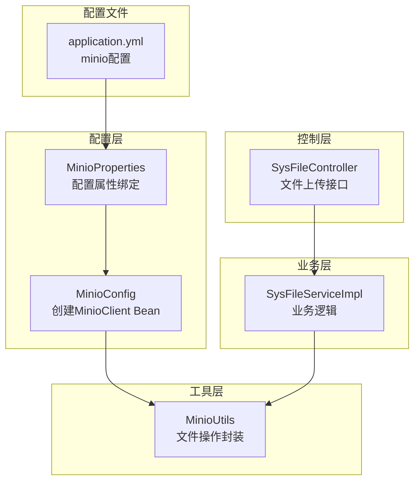
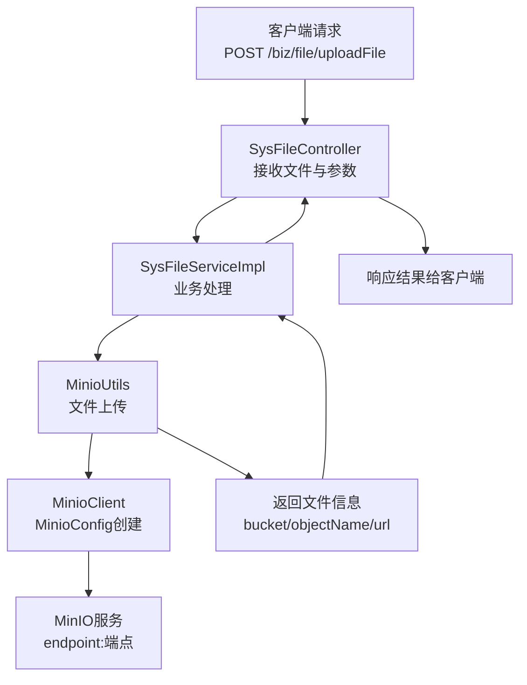
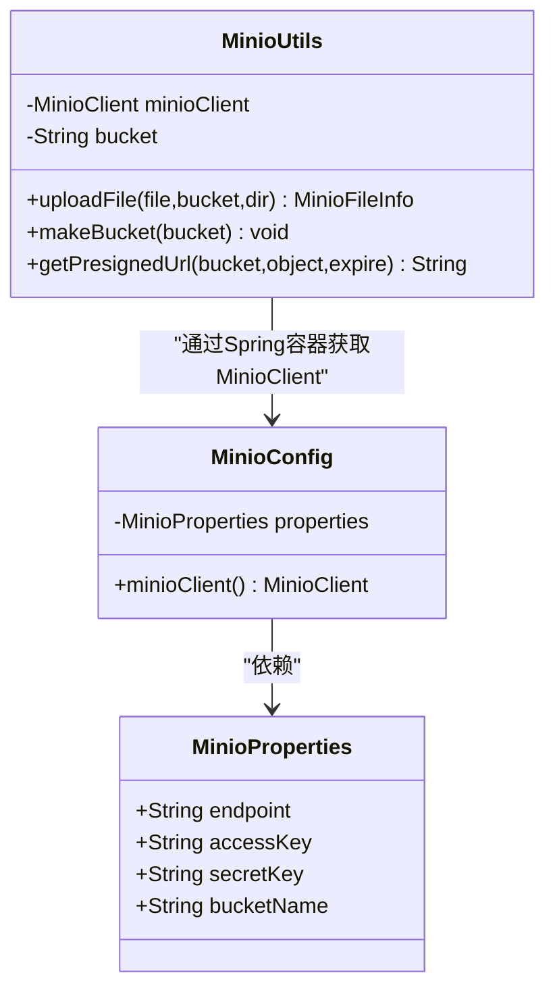
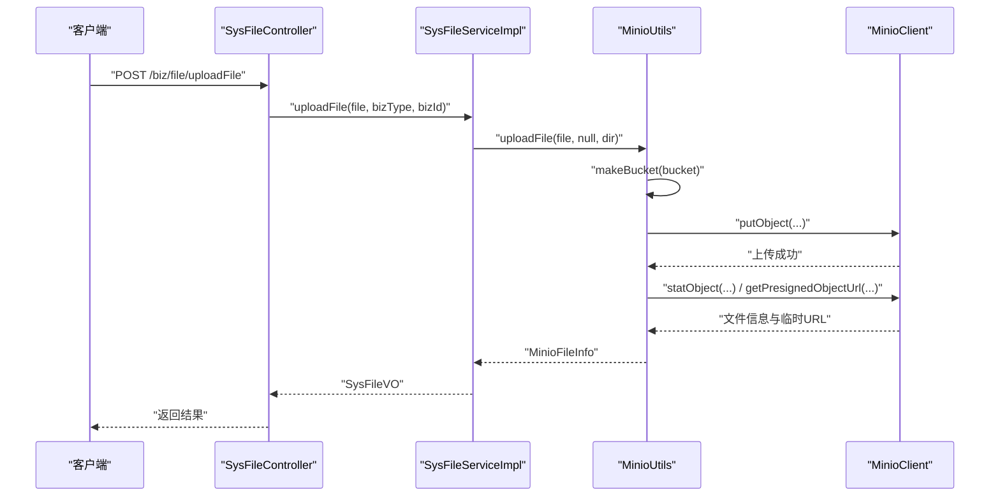
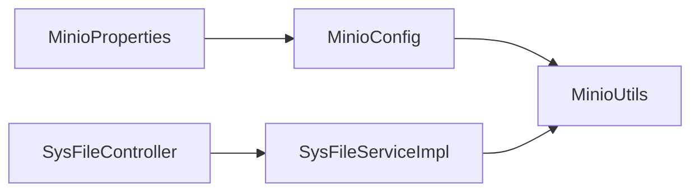

# MinIO集成配置

<cite>
**本文档引用的文件**
- [MinioConfig.java](file://blog-common/src/main/java/blog/common/config/minio/MinioConfig.java)
- [MinioProperties.java](file://blog-common/src/main/java/blog/common/config/minio/MinioProperties.java)
- [MinioUtils.java](file://blog-common/src/main/java/blog/common/utils/minio/MinioUtils.java)
- [application.yml](file://blog-admin/src/main/resources/application.yml)
- [SysFileController.java](file://blog-admin/src/main/java/blog/web/controller/common/SysFileController.java)
- [SysFileServiceImpl.java](file://blog-biz/src/main/java/blog/biz/service/impl/SysFileServiceImpl.java)
- [BlogServerApplication.java](file://blog-admin/src/main/java/blog/BlogServerApplication.java)
</cite>

## 目录
1. [简介](#简介)
2. [项目结构](#项目结构)
3. [核心组件](#核心组件)
4. [架构概览](#架构概览)
5. [详细组件分析](#详细组件分析)
6. [依赖关系分析](#依赖关系分析)
7. [性能考虑](#性能考虑)
8. [故障排除指南](#故障排除指南)
9. [结论](#结论)
10. [附录](#附录)

## 简介
本文件面向开发者，系统性阐述RuoYi项目中MinIO对象存储的集成配置方案。内容涵盖：
- MinIO客户端初始化与配置（连接参数、认证、桶设置）
- 配置类设计（MinioProperties）与配置类实现（MinioConfig）
- 配置文件中的MinIO参数设置方法
- 完整的配置示例与最佳实践
- 通过工具类MinioUtils实现文件上传、下载、删除、列表等核心功能

## 项目结构
MinIO集成相关代码主要分布在以下模块：
- 配置层：MinioProperties（配置绑定）、MinioConfig（客户端Bean创建）
- 工具层：MinioUtils（封装常用文件操作）
- 控制器层：SysFileController（对外提供文件上传接口）
- 业务层：SysFileServiceImpl（调用MinioUtils完成文件上传逻辑）
- 配置文件：application.yml（包含minio配置）

**图表来源**
- [MinioProperties.java:1-23](file://blog-common/src/main/java/blog/common/config/minio/MinioProperties.java#L1-L23)
- [MinioConfig.java:1-34](file://blog-common/src/main/java/blog/common/config/minio/MinioConfig.java#L1-L34)
- [MinioUtils.java:1-325](file://blog-common/src/main/java/blog/common/utils/minio/MinioUtils.java#L1-L325)
- [SysFileController.java:1-123](file://blog-admin/src/main/java/blog/web/controller/common/SysFileController.java#L1-L123)
- [SysFileServiceImpl.java:1-169](file://blog-biz/src/main/java/blog/biz/service/impl/SysFileServiceImpl.java#L1-L169)
- [application.yml:155-161](file://blog-admin/src/main/resources/application.yml#L155-L161)

**章节来源**
- [MinioProperties.java:1-23](file://blog-common/src/main/java/blog/common/config/minio/MinioProperties.java#L1-L23)
- [MinioConfig.java:1-34](file://blog-common/src/main/java/blog/common/config/minio/MinioConfig.java#L1-L34)
- [MinioUtils.java:1-325](file://blog-common/src/main/java/blog/common/utils/minio/MinioUtils.java#L1-L325)
- [SysFileController.java:1-123](file://blog-admin/src/main/java/blog/web/controller/common/SysFileController.java#L1-L123)
- [SysFileServiceImpl.java:1-169](file://blog-biz/src/main/java/blog/biz/service/impl/SysFileServiceImpl.java#L1-L169)
- [application.yml:155-161](file://blog-admin/src/main/resources/application.yml#L155-L161)

## 核心组件
本节深入解析MinIO集成的关键组件及其职责。

- MinioProperties：负责将application.yml中的minio.*配置项绑定到Java对象，提供endpoint、accessKey、secretKey、bucketName等属性。
- MinioConfig：基于MinioProperties创建MinioClient Bean，并在启动时通过listBuckets验证连接与认证。
- MinioUtils：封装桶管理、文件上传、下载、删除、列表、URL生成等常用操作，支持MultipartFile与本地文件路径两种上传方式。
- SysFileController：对外暴露文件上传接口，接收前端传入的文件、业务类型、业务ID等参数。
- SysFileServiceImpl：调用MinioUtils完成实际上传，组装返回的文件信息VO。

**章节来源**
- [MinioProperties.java:1-23](file://blog-common/src/main/java/blog/common/config/minio/MinioProperties.java#L1-L23)
- [MinioConfig.java:1-34](file://blog-common/src/main/java/blog/common/config/minio/MinioConfig.java#L1-L34)
- [MinioUtils.java:1-325](file://blog-common/src/main/java/blog/common/utils/minio/MinioUtils.java#L1-L325)
- [SysFileController.java:1-123](file://blog-admin/src/main/java/blog/web/controller/common/SysFileController.java#L1-L123)
- [SysFileServiceImpl.java:151-167](file://blog-biz/src/main/java/blog/biz/service/impl/SysFileServiceImpl.java#L151-L167)

## 架构概览
下图展示MinIO集成的整体架构与交互流程：

**图表来源**
- [SysFileController.java:111-121](file://blog-admin/src/main/java/blog/web/controller/common/SysFileController.java#L111-L121)
- [SysFileServiceImpl.java:151-167](file://blog-biz/src/main/java/blog/biz/service/impl/SysFileServiceImpl.java#L151-L167)
- [MinioUtils.java:85-111](file://blog-common/src/main/java/blog/common/utils/minio/MinioUtils.java#L85-L111)
- [MinioConfig.java:17-31](file://blog-common/src/main/java/blog/common/config/minio/MinioConfig.java#L17-L31)

## 详细组件分析

### MinioProperties配置类设计
- 配置前缀：minio
- 关键属性：
  - endpoint：MinIO服务地址（如http://localhost:9000）
  - accessKey：访问密钥
  - secretKey：私有密钥
  - bucketName：默认桶名称（用于工具类默认桶）
- 设计要点：
  - 使用@ConfigurationProperties注解自动绑定配置
  - Lombok的@Data提供getter/setter
  - 作为组件被MinioConfig注入使用

**章节来源**
- [MinioProperties.java:9-22](file://blog-common/src/main/java/blog/common/config/minio/MinioProperties.java#L9-L22)
- [application.yml:155-161](file://blog-admin/src/main/resources/application.yml#L155-L161)

### MinioConfig配置类实现原理
- Bean定义：通过@Bean声明minioClient()，返回MinioClient实例
- 初始化流程：
  - 使用builder模式设置endpoint与凭据
  - 启动阶段调用listBuckets验证连接与认证
  - 成功/失败分别记录日志
- 默认桶设置：通过MinioUtils中的@Value("${minio.bucket-name}")注入默认桶名
- 连接池配置：当前实现未显式配置连接池参数；如需优化可在builder中添加相应配置

**图表来源**
- [MinioProperties.java:11-22](file://blog-common/src/main/java/blog/common/config/minio/MinioProperties.java#L11-L22)
- [MinioConfig.java:14-31](file://blog-common/src/main/java/blog/common/config/minio/MinioConfig.java#L14-L31)
- [MinioUtils.java:28-35](file://blog-common/src/main/java/blog/common/utils/minio/MinioUtils.java#L28-L35)

**章节来源**
- [MinioConfig.java:17-31](file://blog-common/src/main/java/blog/common/config/minio/MinioConfig.java#L17-L31)
- [MinioUtils.java:30-31](file://blog-common/src/main/java/blog/common/utils/minio/MinioUtils.java#L30-L31)

### MinioUtils工具类实现要点
- 桶管理：
  - bucketExists：检查桶是否存在
  - makeBucket：不存在则创建桶
- 文件上传：
  - 支持MultipartFile与本地文件路径两种方式
  - 自动生成objectName（目录+UUID+原扩展名）
  - 自动创建桶并上传
- 文件信息：
  - getFileInfo：获取文件大小、类型、上传时间、临时访问URL
- 下载/删除/列表：
  - getFileStream：获取文件输入流
  - deleteFile/deleteFiles：单个/批量删除
  - listObjects：列出指定前缀的文件（支持递归）
- URL生成：
  - getPresignedUrl：生成临时访问URL（默认24小时）
  - getPermanentUrl：生成永久访问URL（需桶公共可读）

**图表来源**
- [SysFileController.java:111-121](file://blog-admin/src/main/java/blog/web/controller/common/SysFileController.java#L111-L121)
- [SysFileServiceImpl.java:151-167](file://blog-biz/src/main/java/blog/biz/service/impl/SysFileServiceImpl.java#L151-L167)
- [MinioUtils.java:85-111](file://blog-common/src/main/java/blog/common/utils/minio/MinioUtils.java#L85-L111)
- [MinioUtils.java:159-182](file://blog-common/src/main/java/blog/common/utils/minio/MinioUtils.java#L159-L182)

**章节来源**
- [MinioUtils.java:60-73](file://blog-common/src/main/java/blog/common/utils/minio/MinioUtils.java#L60-L73)
- [MinioUtils.java:85-111](file://blog-common/src/main/java/blog/common/utils/minio/MinioUtils.java#L85-L111)
- [MinioUtils.java:159-182](file://blog-common/src/main/java/blog/common/utils/minio/MinioUtils.java#L159-L182)
- [MinioUtils.java:221-223](file://blog-common/src/main/java/blog/common/utils/minio/MinioUtils.java#L221-L223)
- [MinioUtils.java:233-255](file://blog-common/src/main/java/blog/common/utils/minio/MinioUtils.java#L233-L255)
- [MinioUtils.java:266-288](file://blog-common/src/main/java/blog/common/utils/minio/MinioUtils.java#L266-L288)
- [MinioUtils.java:300-309](file://blog-common/src/main/java/blog/common/utils/minio/MinioUtils.java#L300-L309)
- [MinioUtils.java:318-320](file://blog-common/src/main/java/blog/common/utils/minio/MinioUtils.java#L318-L320)

### 配置文件中的MinIO相关配置项
- 配置位置：application.yml
- 关键参数：
  - minio.endpoint：MinIO服务地址
  - minio.access-key：访问密钥
  - minio.secret-key：私有密钥
  - minio.bucket-name：默认桶名称
- 配置示例（来自仓库）：
  - endpoint: http://localhost:9000
  - access-key: YOfz6VNqtztqoMYMKJEG
  - secret-key: gAHjeLeYM4vL21z5UCVcRcL3gRt587rqoQhOvJVR
  - bucket-name: blog-bucket

**章节来源**
- [application.yml:155-161](file://blog-admin/src/main/resources/application.yml#L155-L161)

## 依赖关系分析
- 组件耦合：
  - MinioConfig依赖MinioProperties
  - MinioUtils依赖MinioClient（由Spring容器提供）
  - SysFileServiceImpl依赖MinioUtils
  - SysFileController依赖SysFileServiceImpl
- 外部依赖：
  - io.minio：MinIO Java SDK
  - Spring Boot Starter：自动装配与配置绑定
- 潜在循环依赖：
  - 当前结构无循环依赖，各层职责清晰

**图表来源**
- [MinioProperties.java:11-22](file://blog-common/src/main/java/blog/common/config/minio/MinioProperties.java#L11-L22)
- [MinioConfig.java:14-31](file://blog-common/src/main/java/blog/common/config/minio/MinioConfig.java#L14-L31)
- [MinioUtils.java:28-35](file://blog-common/src/main/java/blog/common/utils/minio/MinioUtils.java#L28-L35)
- [SysFileController.java:41-42](file://blog-admin/src/main/java/blog/web/controller/common/SysFileController.java#L41-L42)
- [SysFileServiceImpl.java:41-42](file://blog-biz/src/main/java/blog/biz/service/impl/SysFileServiceImpl.java#L41-L42)

**章节来源**
- [MinioProperties.java:11-22](file://blog-common/src/main/java/blog/common/config/minio/MinioProperties.java#L11-L22)
- [MinioConfig.java:14-31](file://blog-common/src/main/java/blog/common/config/minio/MinioConfig.java#L14-L31)
- [MinioUtils.java:28-35](file://blog-common/src/main/java/blog/common/utils/minio/MinioUtils.java#L28-L35)
- [SysFileController.java:41-42](file://blog-admin/src/main/java/blog/web/controller/common/SysFileController.java#L41-L42)
- [SysFileServiceImpl.java:41-42](file://blog-biz/src/main/java/blog/biz/service/impl/SysFileServiceImpl.java#L41-L42)

## 性能考虑
- 连接池配置：当前MinioConfig未显式设置连接池参数。若需提升高并发场景下的性能，可在MinioClient.builder中增加连接池相关配置（如线程数、超时时间等）。
- 上传策略：MinioUtils对每个上传请求都会确保桶存在，建议在业务侧统一管理桶命名规范，减少重复创建开销。
- URL生成：临时URL默认有效期24小时，可根据业务需求调整过期时间以平衡安全与可用性。
- 日志与监控：MinioConfig在启动时验证连接，建议结合应用日志与指标监控观察MinIO连接状态。

## 故障排除指南
- 连接失败：
  - 检查endpoint是否正确（含协议与端口）
  - 确认accessKey与secretKey有效且具有足够权限
  - 查看启动日志中Minio连接验证的错误信息
- 认证失败：
  - 核对密钥是否匹配MinIO用户配置
  - 确保桶策略允许访问（特别是公共读写）
- 上传失败：
  - 检查目标桶是否存在或是否可写
  - 确认文件大小与类型符合要求
  - 查看MinioUtils抛出的具体异常信息
- URL无法访问：
  - 临时URL需在有效期内访问
  - 永久URL需确保桶为公共可读

**章节来源**
- [MinioConfig.java:24-29](file://blog-common/src/main/java/blog/common/config/minio/MinioConfig.java#L24-L29)
- [MinioUtils.java:159-182](file://blog-common/src/main/java/blog/common/utils/minio/MinioUtils.java#L159-L182)

## 结论
本项目通过简洁的配置类与工具类实现了MinIO对象存储的集成，具备以下特点：
- 配置绑定清晰，易于维护
- 工具类封装完善，覆盖常用文件操作
- 启动时验证连接，提升系统可靠性
建议后续根据业务规模与性能需求，进一步完善连接池配置与安全策略。

## 附录

### 完整配置示例与最佳实践
- 配置示例（application.yml片段）：
  - endpoint: http://localhost:9000
  - access-key: YOfz6VNqtztqoMYMKJEG
  - secret-key: gAHjeLeYM4vL21z5UCVcRcL3gRt587rqoQhOvJVR
  - bucket-name: blog-bucket
- 最佳实践：
  - 将敏感信息放入环境变量或配置中心，避免硬编码
  - 为不同业务域划分独立桶，便于权限与成本控制
  - 在生产环境启用TLS（HTTPS），并在MinioConfig中按需配置SSL/TLS参数
  - 对上传文件进行类型与大小校验，防止恶意文件
  - 使用临时URL进行文件分享，严格控制有效期
  - 定期清理不再使用的文件，降低存储成本

**章节来源**
- [application.yml:155-161](file://blog-admin/src/main/resources/application.yml#L155-L161)