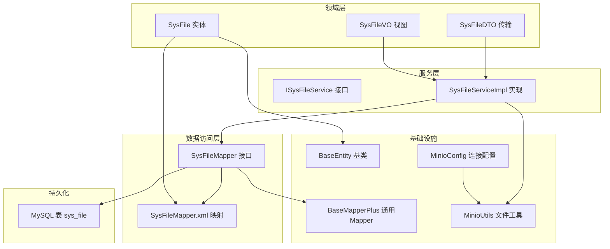
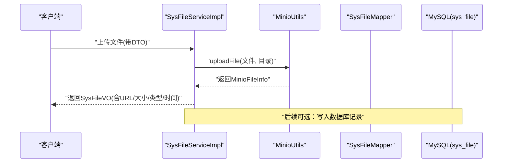
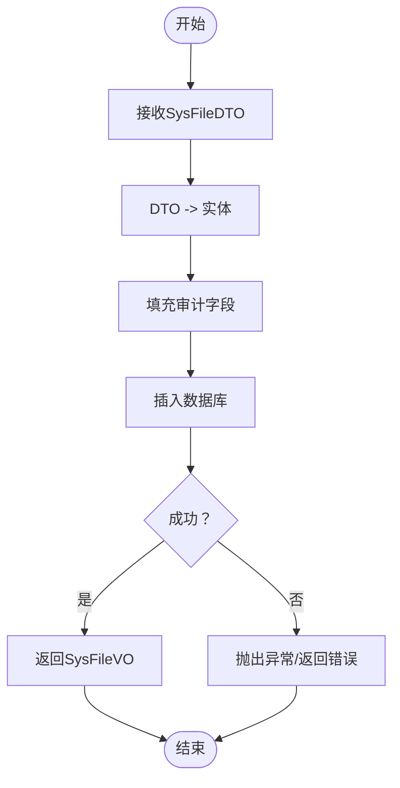
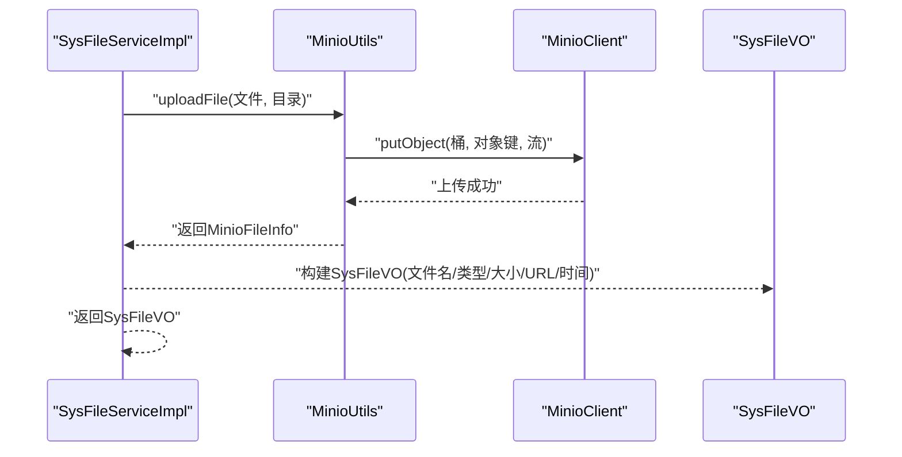
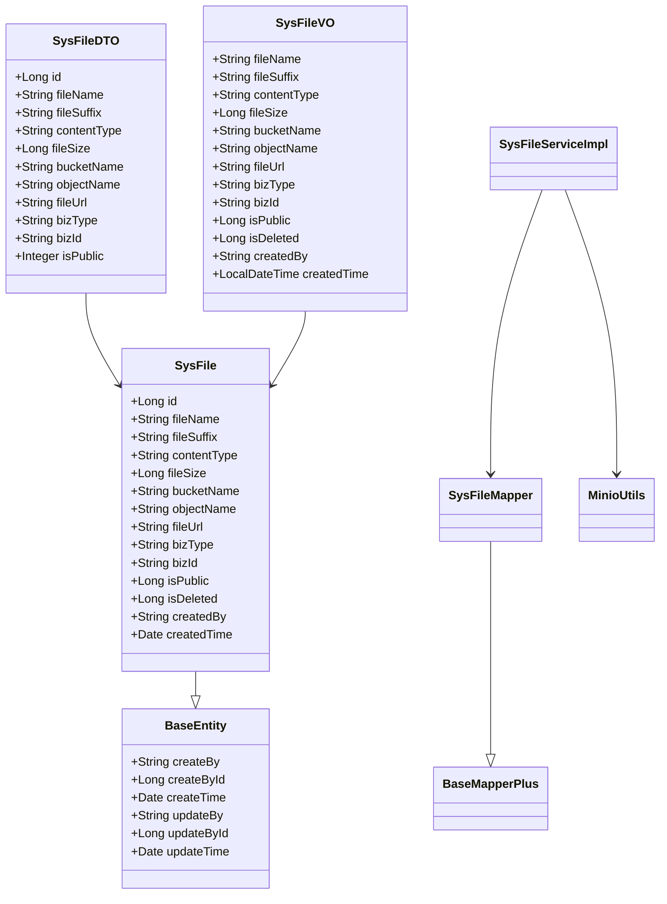

# SysFile实体设计

<cite>
**本文引用的文件**
- [SysFile.java](file://blog-biz/src/main/java/blog/biz/domain/SysFile.java)
- [SysFileDTO.java](file://blog-biz/src/main/java/blog/biz/domain/dto/SysFileDTO.java)
- [SysFileVO.java](file://blog-biz/src/main/java/blog/biz/domain/vo/SysFileVO.java)
- [SysFileMapper.java](file://blog-biz/src/main/java/blog/biz/mapper/SysFileMapper.java)
- [SysFileMapper.xml](file://blog-biz/src/main/resources/mapper/SysFileMapper.xml)
- [ISysFileService.java](file://blog-biz/src/main/java/blog/biz/service/ISysFileService.java)
- [SysFileServiceImpl.java](file://blog-biz/src/main/java/blog/biz/service/impl/SysFileServiceImpl.java)
- [BaseEntity.java](file://blog-common/src/main/java/blog/common/base/entity/BaseEntity.java)
- [BaseMapperPlus.java](file://blog-common/src/main/java/blog/common/base/mapper/BaseMapperPlus.java)
- [MinioUtils.java](file://blog-common/src/main/java/blog/common/utils/minio/MinioUtils.java)
- [MinioConfig.java](file://blog-common/src/main/java/blog/common/config/minio/MinioConfig.java)
- [ry-vue-owner.sql](file://ry-vue-owner.sql)
</cite>

## 目录
1. [简介](#简介)
2. [项目结构](#项目结构)
3. [核心组件](#核心组件)
4. [架构总览](#架构总览)
5. [详细组件分析](#详细组件分析)
6. [依赖分析](#依赖分析)
7. [性能考虑](#性能考虑)
8. [故障排查指南](#故障排查指南)
9. [结论](#结论)
10. [附录](#附录)

## 简介
本文件系统性阐述 SysFile 实体的设计与实现，覆盖以下关键维度：
- 实体字段定义与业务语义：文件标识、原始名称、存储路径、文件大小、内容类型、上传时间、访问权限等
- DTO/VO 设计分离原则：SysFileDTO 用于数据传输，SysFileVO 用于视图展示，以及二者之间的转换机制
- ORM 映射关系：MyBatis-Plus 注解与 XML 结果映射、字段对应、索引与约束
- 生命周期管理：创建、更新、删除、归档等状态变化及业务逻辑
- 最佳实践：字段命名规范、数据验证规则、性能优化策略
- 完整示例与使用场景：基于现有代码的路径引用与流程示意

## 项目结构
围绕 SysFile 的核心模块分布如下：
- 领域模型：SysFile（实体）、SysFileDTO（传输）、SysFileVO（视图）
- 数据访问：SysFileMapper 接口、SysFileMapper.xml 映射
- 业务服务：ISysFileService 接口、SysFileServiceImpl 实现
- 基类与通用能力：BaseEntity、BaseMapperPlus
- 文件存储：MinioUtils 封装上传与文件信息获取
- 数据库表：sys_file 的建表脚本与索引

图表来源
- [SysFile.java:11-95](file://blog-biz/src/main/java/blog/biz/domain/SysFile.java#L11-L95)
- [SysFileDTO.java:13-83](file://blog-biz/src/main/java/blog/biz/domain/dto/SysFileDTO.java#L13-L83)
- [SysFileVO.java:18-114](file://blog-biz/src/main/java/blog/biz/domain/vo/SysFileVO.java#L18-L114)
- [ISysFileService.java:15-75](file://blog-biz/src/main/java/blog/biz/service/ISysFileService.java#L15-L75)
- [SysFileServiceImpl.java:29-169](file://blog-biz/src/main/java/blog/biz/service/impl/SysFileServiceImpl.java#L29-L169)
- [SysFileMapper.java:7-16](file://blog-biz/src/main/java/blog/biz/mapper/SysFileMapper.java#L7-L16)
- [SysFileMapper.xml:7-24](file://blog-biz/src/main/resources/mapper/SysFileMapper.xml#L7-L24)
- [BaseEntity.java:16-85](file://blog-common/src/main/java/blog/common/base/entity/BaseEntity.java#L16-L85)
- [BaseMapperPlus.java:23-335](file://blog-common/src/main/java/blog/common/base/mapper/BaseMapperPlus.java#L23-L335)
- [MinioUtils.java:22-200](file://blog-common/src/main/java/blog/common/utils/minio/MinioUtils.java#L22-L200)
- [MinioConfig.java:10-34](file://blog-common/src/main/java/blog/common/config/minio/MinioConfig.java#L10-L34)
- [ry-vue-owner.sql:1325-1347](file://ry-vue-owner.sql#L1325-L1347)

章节来源
- [SysFile.java:11-95](file://blog-biz/src/main/java/blog/biz/domain/SysFile.java#L11-L95)
- [SysFileMapper.java:7-16](file://blog-biz/src/main/java/blog/biz/mapper/SysFileMapper.java#L7-L16)
- [SysFileMapper.xml:7-24](file://blog-biz/src/main/resources/mapper/SysFileMapper.xml#L7-L24)
- [ry-vue-owner.sql:1325-1347](file://ry-vue-owner.sql#L1325-L1347)

## 核心组件
- 实体 SysFile：承载 sys_file 表的完整字段，继承 BaseEntity，具备创建/更新审计字段
- DTO SysFileDTO：面向传输层的校验与序列化控制，包含必填字段校验
- VO SysFileVO：面向前端展示的导出字段与格式化控制，支持 Excel 导出注解
- Mapper/Xml：MyBatis-Plus 映射 sys_file 字段，提供实体与数据库的字段对应关系
- Service：封装查询、分页、新增、更新、删除、上传等业务逻辑
- Minio：封装 MinIO 上传、文件信息获取与 URL 生成

章节来源
- [SysFile.java:11-95](file://blog-biz/src/main/java/blog/biz/domain/SysFile.java#L11-L95)
- [SysFileDTO.java:13-83](file://blog-biz/src/main/java/blog/biz/domain/dto/SysFileDTO.java#L13-L83)
- [SysFileVO.java:18-114](file://blog-biz/src/main/java/blog/biz/domain/vo/SysFileVO.java#L18-L114)
- [SysFileMapper.java:7-16](file://blog-biz/src/main/java/blog/biz/mapper/SysFileMapper.java#L7-L16)
- [SysFileMapper.xml:7-24](file://blog-biz/src/main/resources/mapper/SysFileMapper.xml#L7-L24)
- [ISysFileService.java:15-75](file://blog-biz/src/main/java/blog/biz/service/ISysFileService.java#L15-L75)
- [SysFileServiceImpl.java:29-169](file://blog-biz/src/main/java/blog/biz/service/impl/SysFileServiceImpl.java#L29-L169)
- [MinioUtils.java:22-200](file://blog-common/src/main/java/blog/common/utils/minio/MinioUtils.java#L22-L200)

## 架构总览
SysFile 的整体架构遵循“领域驱动”的分层设计：
- 领域层：SysFile 实体与 DTO/VO
- 应用层：ISysFileService 及其实现
- 基础设施：Minio 文件存储与 MyBatis-Plus 数据访问
- 展示层：控制器通过服务调用完成对外暴露

图表来源
- [SysFileServiceImpl.java:151-167](file://blog-biz/src/main/java/blog/biz/service/impl/SysFileServiceImpl.java#L151-L167)
- [MinioUtils.java:85-111](file://blog-common/src/main/java/blog/common/utils/minio/MinioUtils.java#L85-L111)
- [SysFileMapper.java:13](file://blog-biz/src/main/java/blog/biz/mapper/SysFileMapper.java#L13)
- [ry-vue-owner.sql:1325-1347](file://ry-vue-owner.sql#L1325-L1347)

## 详细组件分析

### 实体字段与业务属性设计
- 主键 ID：Long 类型，自增主键
- 原始文件名：字符串，用于展示与下载
- 文件后缀：字符串，便于识别类型
- 内容类型：字符串，标准 MIME 类型
- 文件大小：字节数，Long 类型
- MinIO 桶名：字符串，标识存储桶
- MinIO 对象路径：字符串，对象键
- 文件访问 URL：字符串，可为临时或永久链接
- 业务类型与业务 ID：用于业务归因，如头像、文章图片
- 是否公开：TinyInt(0/1)，控制访问策略
- 审计字段：创建者、创建时间、更新者、更新时间（继承 BaseEntity）

字段设计要点
- 字段命名采用下划线风格与数据库一致，便于映射
- isPublic/isDeleted 使用数值型便于比较与索引
- createdTime 使用 Date 或 LocalDateTime（视 VO），统一 JSON 序列化格式

章节来源
- [SysFile.java:22-91](file://blog-biz/src/main/java/blog/biz/domain/SysFile.java#L22-L91)
- [BaseEntity.java:37-70](file://blog-common/src/main/java/blog/common/base/entity/BaseEntity.java#L37-L70)
- [SysFileVO.java:109](file://blog-biz/src/main/java/blog/biz/domain/vo/SysFileVO.java#L109)
- [ry-vue-owner.sql:1325-1347](file://ry-vue-owner.sql#L1325-L1347)

### DTO 与 VO 的设计分离
- SysFileDTO
  - 职责：数据传输与校验，包含必填字段校验（原始文件名、MinIO 桶名、对象路径）
  - 与实体差异：isPublic 类型为 Integer；继承 BaseEntity
- SysFileVO
  - 职责：视图展示与导出，标注 Excel 注解，JSON 时间格式化
  - 与实体差异：createdTime 类型为 LocalDateTime；字段顺序与展示需求对齐

转换机制
- Service 层在新增/更新时将 DTO 转换为实体入库
- Mapper 扩展 BaseMapperPlus 提供 selectVoById/List/Page 等方法，自动将实体转换为 VO

章节来源
- [SysFileDTO.java:21-82](file://blog-biz/src/main/java/blog/biz/domain/dto/SysFileDTO.java#L21-L82)
- [SysFileVO.java:28-114](file://blog-biz/src/main/java/blog/biz/domain/vo/SysFileVO.java#L28-L114)
- [BaseMapperPlus.java:132-176](file://blog-common/src/main/java/blog/common/base/mapper/BaseMapperPlus.java#L132-L176)

### ORM 映射关系
- 实体注解
  - @TableName("sys_file")：实体与表映射
  - @TableId：主键映射
  - 继承 BaseEntity：自动填充创建/更新审计字段
- XML 映射
  - 通过 <resultMap> 将实体属性与数据库列一一对应
  - 支持复杂查询与分页返回 VO
- 数据库表结构
  - 主键、非空约束、默认值、索引（biz_type,biz_id 组合索引）
  - 字段长度与类型与实体保持一致

章节来源
- [SysFile.java:19-26](file://blog-biz/src/main/java/blog/biz/domain/SysFile.java#L19-L26)
- [SysFileMapper.xml:7-22](file://blog-biz/src/main/resources/mapper/SysFileMapper.xml#L7-L22)
- [ry-vue-owner.sql:1325-1347](file://ry-vue-owner.sql#L1325-L1347)

### 生命周期管理
- 创建：Service 在新增时将 DTO 转为实体，填充审计字段后入库
- 更新：Service 在更新时将 DTO 转为实体，按主键更新
- 删除：支持批量删除，可选业务校验
- 归档：实体未显式提供 isDeleted 字段的软删逻辑，可在业务层扩展

图表来源
- [SysFileServiceImpl.java:106-114](file://blog-biz/src/main/java/blog/biz/service/impl/SysFileServiceImpl.java#L106-L114)
- [BaseEntity.java:37-70](file://blog-common/src/main/java/blog/common/base/entity/BaseEntity.java#L37-L70)

章节来源
- [SysFileServiceImpl.java:105-149](file://blog-biz/src/main/java/blog/biz/service/impl/SysFileServiceImpl.java#L105-L149)
- [BaseEntity.java:37-70](file://blog-common/src/main/java/blog/common/base/entity/BaseEntity.java#L37-L70)

### 文件上传与访问
- 上传流程：Service 调用 MinioUtils 上传文件，生成对象键与临时 URL
- 返回 VO：包含文件名、类型、大小、URL、上传时间等
- 访问策略：isPublic 控制公开性；URL 由 MinIO 生成

图表来源
- [SysFileServiceImpl.java:151-167](file://blog-biz/src/main/java/blog/biz/service/impl/SysFileServiceImpl.java#L151-L167)
- [MinioUtils.java:85-111](file://blog-common/src/main/java/blog/common/utils/minio/MinioUtils.java#L85-L111)

章节来源
- [SysFileServiceImpl.java:151-167](file://blog-biz/src/main/java/blog/biz/service/impl/SysFileServiceImpl.java#L151-L167)
- [MinioUtils.java:85-182](file://blog-common/src/main/java/blog/common/utils/minio/MinioUtils.java#L85-L182)

### 查询与分页
- 条件查询：Service 构建 LambdaQueryWrapper，支持多字段模糊/精确匹配
- 分页返回：Mapper 扩展提供 selectVoPage，自动将实体分页转换为 VO 分页
- 导出：VO 标注 Excel 注解，便于导出

章节来源
- [SysFileServiceImpl.java:80-97](file://blog-biz/src/main/java/blog/biz/service/impl/SysFileServiceImpl.java#L80-L97)
- [BaseMapperPlus.java:296-320](file://blog-common/src/main/java/blog/common/base/mapper/BaseMapperPlus.java#L296-L320)
- [SysFileVO.java:36-110](file://blog-biz/src/main/java/blog/biz/domain/vo/SysFileVO.java#L36-L110)

## 依赖分析
- 实体依赖 BaseEntity：自动注入审计字段
- Mapper 依赖 BaseMapperPlus：提供 VO 转换与分页能力
- Service 依赖 Mapper 与 MinioUtils：完成 CRUD 与文件上传
- 配置依赖 MinioConfig：初始化 MinioClient

图表来源
- [SysFile.java:17-95](file://blog-biz/src/main/java/blog/biz/domain/SysFile.java#L17-L95)
- [SysFileDTO.java:19-82](file://blog-biz/src/main/java/blog/biz/domain/dto/SysFileDTO.java#L19-L82)
- [SysFileVO.java:24-114](file://blog-biz/src/main/java/blog/biz/domain/vo/SysFileVO.java#L24-L114)
- [BaseEntity.java:21-85](file://blog-common/src/main/java/blog/common/base/entity/BaseEntity.java#L21-L85)
- [BaseMapperPlus.java:32-335](file://blog-common/src/main/java/blog/common/base/mapper/BaseMapperPlus.java#L32-L335)
- [SysFileMapper.java:13](file://blog-biz/src/main/java/blog/biz/mapper/SysFileMapper.java#L13)
- [SysFileServiceImpl.java:38-41](file://blog-biz/src/main/java/blog/biz/service/impl/SysFileServiceImpl.java#L38-L41)
- [MinioUtils.java:25-50](file://blog-common/src/main/java/blog/common/utils/minio/MinioUtils.java#L25-L50)

章节来源
- [SysFile.java:17-95](file://blog-biz/src/main/java/blog/biz/domain/SysFile.java#L17-L95)
- [SysFileMapper.java:13](file://blog-biz/src/main/java/blog/biz/mapper/SysFileMapper.java#L13)
- [BaseMapperPlus.java:32-335](file://blog-common/src/main/java/blog/common/base/mapper/BaseMapperPlus.java#L32-L335)
- [SysFileServiceImpl.java:38-41](file://blog-biz/src/main/java/blog/biz/service/impl/SysFileServiceImpl.java#L38-L41)
- [MinioUtils.java:25-50](file://blog-common/src/main/java/blog/common/utils/minio/MinioUtils.java#L25-L50)

## 性能考虑
- 索引设计：biz_type 与 biz_id 组合索引，有利于按业务维度检索
- 字段类型：Long 适合大文件大小；字符串长度与数据库一致避免截断
- 分页查询：使用 BaseMapperPlus 的 selectVoPage，减少实体转换开销
- 上传策略：MinIO 生成临时 URL，降低直连压力；可结合 CDN 缓存热点资源
- 审计字段：统一填充 createBy/createTime/updateBy/updateTime，便于审计与排序

章节来源
- [ry-vue-owner.sql:1346](file://ry-vue-owner.sql#L1346)
- [BaseMapperPlus.java:296-320](file://blog-common/src/main/java/blog/common/base/mapper/BaseMapperPlus.java#L296-L320)
- [MinioUtils.java:164-171](file://blog-common/src/main/java/blog/common/utils/minio/MinioUtils.java#L164-L171)

## 故障排查指南
- 上传失败
  - 检查 MinIO 连接配置与桶是否存在
  - 查看 MinioUtils 抛出的异常与日志
- 查询不到数据
  - 确认查询条件是否正确（模糊/精确）
  - 检查 BizType/BizId 组合索引是否命中
- DTO 校验失败
  - 关注 SysFileDTO 的必填字段校验提示
- VO 导出异常
  - 确认 SysFileVO 的 Excel 注解与字段类型匹配

章节来源
- [MinioConfig.java:17-31](file://blog-common/src/main/java/blog/common/config/minio/MinioConfig.java#L17-L31)
- [MinioUtils.java:85-111](file://blog-common/src/main/java/blog/common/utils/minio/MinioUtils.java#L85-L111)
- [SysFileServiceImpl.java:80-97](file://blog-biz/src/main/java/blog/biz/service/impl/SysFileServiceImpl.java#L80-L97)
- [SysFileDTO.java:31,52,58](file://blog-biz/src/main/java/blog/biz/domain/dto/SysFileDTO.java#L31,L52,L58)
- [SysFileVO.java:36-110](file://blog-biz/src/main/java/blog/biz/domain/vo/SysFileVO.java#L36-L110)

## 结论
SysFile 实体以清晰的字段设计与严格的分层架构支撑了文件元数据的全生命周期管理。通过 DTO/VO 的职责分离、MyBatis-Plus 的 ORM 映射、MinIO 的文件能力集成，系统实现了高内聚、低耦合且易于扩展的文件管理方案。

## 附录

### 字段命名规范与数据验证规则
- 字段命名：数据库风格（下划线）与实体风格（驼峰）分离，XML 映射确保一致性
- 必填校验：原始文件名、MinIO 桶名、对象路径在 DTO 中强制校验
- 类型选择：isPublic 使用 Integer 与 Long 保持与数据库 TinyInt/BigInt 的兼容

章节来源
- [SysFileDTO.java:31,52,58](file://blog-biz/src/main/java/blog/biz/domain/dto/SysFileDTO.java#L31,L52,L58)
- [SysFileVO.java:79,91](file://blog-biz/src/main/java/blog/biz/domain/vo/SysFileVO.java#L79,L91)

### 使用场景示例（路径引用）
- 上传文件并返回视图对象
  - [SysFileServiceImpl.uploadFile:151-167](file://blog-biz/src/main/java/blog/biz/service/impl/SysFileServiceImpl.java#L151-L167)
  - [MinioUtils.uploadFile:85-111](file://blog-common/src/main/java/blog/common/utils/minio/MinioUtils.java#L85-L111)
- 新增文件记录
  - [SysFileServiceImpl.insertByDTO:105-114](file://blog-biz/src/main/java/blog/biz/service/impl/SysFileServiceImpl.java#L105-L114)
  - [SysFileMapper.insert](file://blog-biz/src/main/java/blog/biz/mapper/SysFileMapper.java#L13)
- 分页查询与 VO 转换
  - [SysFileServiceImpl.queryPageList:62-66](file://blog-biz/src/main/java/blog/biz/service/impl/SysFileServiceImpl.java#L62-L66)
  - [BaseMapperPlus.selectVoPage:296-320](file://blog-common/src/main/java/blog/common/base/mapper/BaseMapperPlus.java#L296-L320)