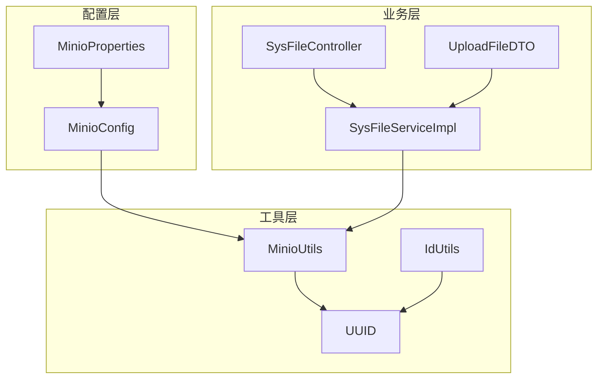
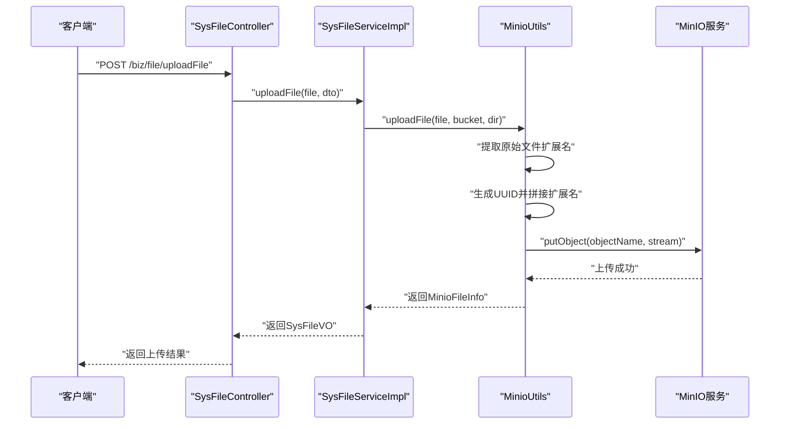
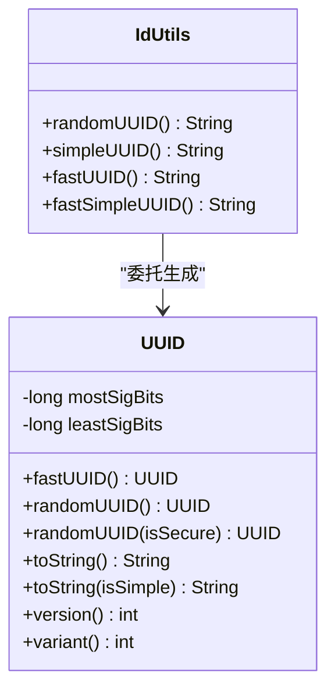
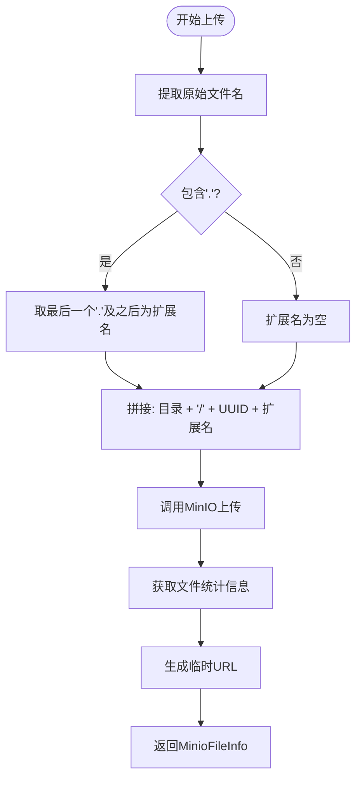
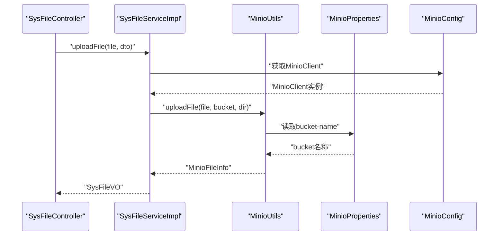
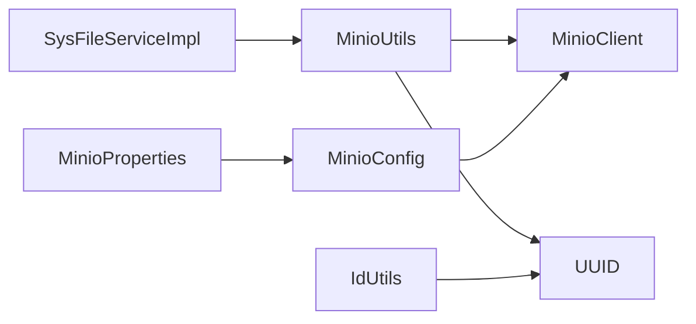

# UUID文件命名机制

<cite>
**本文档引用的文件**
- [MinioUtils.java](file://blog-common/src/main/java/blog/common/utils/minio/MinioUtils.java)
- [UUID.java](file://blog-common/src/main/java/blog/common/utils/uuid/UUID.java)
- [IdUtils.java](file://blog-common/src/main/java/blog/common/utils/uuid/IdUtils.java)
- [MinioProperties.java](file://blog-common/src/main/java/blog/common/config/minio/MinioProperties.java)
- [MinioConfig.java](file://blog-common/src/main/java/blog/common/config/minio/MinioConfig.java)
- [SysFileServiceImpl.java](file://blog-biz/src/main/java/blog/biz/service/impl/SysFileServiceImpl.java)
- [SysFileController.java](file://blog-admin/src/main/java/blog/web/controller/common/SysFileController.java)
- [UploadFileDTO.java](file://blog-biz/src/main/java/blog/biz/domain/dto/UploadFileDTO.java)
- [application.yml](file://blog-admin/src/main/resources/application.yml)
</cite>

## 目录
1. [简介](#简介)
2. [项目结构](#项目结构)
3. [核心组件](#核心组件)
4. [架构概览](#架构概览)
5. [详细组件分析](#详细组件分析)
6. [依赖关系分析](#依赖关系分析)
7. [性能考量](#性能考量)
8. [故障排查指南](#故障排查指南)
9. [结论](#结论)
10. [附录](#附录)

## 简介
本文件系统性阐述了项目中的UUID文件命名机制，重点覆盖：
- UUID v4算法的实现细节与唯一性保证
- 与传统文件命名方式的对比优势（冲突避免、并发安全、性能影响）
- MinioUtils中的具体实现（UUID.randomUUID()调用时机、扩展名保留策略、命名空间隔离）
- 安全性考量（随机性保证、熵值分析、潜在风险评估）
- 最佳实践建议（命名长度控制、字符集限制、兼容性考虑）
- 具体的代码示例与使用场景演示

## 项目结构
围绕UUID文件命名机制的相关模块分布如下：
- 文件上传与存储：MinioUtils负责上传、命名与元数据获取
- UUID生成：UUID与IdUtils提供多种UUID生成策略
- 配置：MinioConfig与MinioProperties提供MinIO客户端配置
- 业务集成：SysFileServiceImpl与SysFileController将上传流程与业务解耦

图表来源
- [MinioProperties.java:12-22](file://blog-common/src/main/java/blog/common/config/minio/MinioProperties.java#L12-L22)
- [MinioConfig.java:17-31](file://blog-common/src/main/java/blog/common/config/minio/MinioConfig.java#L17-L31)
- [SysFileController.java:111-121](file://blog-admin/src/main/java/blog/web/controller/common/SysFileController.java#L111-L121)
- [SysFileServiceImpl.java:151-167](file://blog-biz/src/main/java/blog/biz/service/impl/SysFileServiceImpl.java#L151-L167)
- [MinioUtils.java:85-111](file://blog-common/src/main/java/blog/common/utils/minio/MinioUtils.java#L85-L111)
- [UUID.java:80-100](file://blog-common/src/main/java/blog/common/utils/uuid/UUID.java#L80-L100)
- [IdUtils.java:14-25](file://blog-common/src/main/java/blog/common/utils/uuid/IdUtils.java#L14-L25)

章节来源
- [application.yml:155-161](file://blog-admin/src/main/resources/application.yml#L155-L161)
- [MinioConfig.java:17-31](file://blog-common/src/main/java/blog/common/config/minio/MinioConfig.java#L17-L31)
- [MinioUtils.java:85-111](file://blog-common/src/main/java/blog/common/utils/minio/MinioUtils.java#L85-L111)
- [UUID.java:80-100](file://blog-common/src/main/java/blog/common/utils/uuid/UUID.java#L80-L100)
- [IdUtils.java:14-25](file://blog-common/src/main/java/blog/common/utils/uuid/IdUtils.java#L14-L25)

## 核心组件
- UUID与IdUtils：提供UUID v4生成、简化字符串输出、安全与性能双选项
- MinioUtils：封装MinIO上传、命名、元数据获取与URL生成
- 配置模块：MinioProperties与MinioConfig负责MinIO连接与桶管理
- 业务集成：SysFileServiceImpl通过MinioUtils完成文件上传与记录落库

章节来源
- [UUID.java:80-100](file://blog-common/src/main/java/blog/common/utils/uuid/UUID.java#L80-L100)
- [IdUtils.java:14-25](file://blog-common/src/main/java/blog/common/utils/uuid/IdUtils.java#L14-L25)
- [MinioUtils.java:85-111](file://blog-common/src/main/java/blog/common/utils/minio/MinioUtils.java#L85-L111)
- [MinioProperties.java:12-22](file://blog-common/src/main/java/blog/common/config/minio/MinioProperties.java#L12-L22)
- [MinioConfig.java:17-31](file://blog-common/src/main/java/blog/common/config/minio/MinioConfig.java#L17-L31)

## 架构概览
UUID文件命名机制在整体架构中的位置如下：

图表来源
- [SysFileController.java:111-121](file://blog-admin/src/main/java/blog/web/controller/common/SysFileController.java#L111-L121)
- [SysFileServiceImpl.java:151-167](file://blog-biz/src/main/java/blog/biz/service/impl/SysFileServiceImpl.java#L151-L167)
- [MinioUtils.java:85-111](file://blog-common/src/main/java/blog/common/utils/minio/MinioUtils.java#L85-L111)

## 详细组件分析

### UUID v4算法与唯一性保证
- 算法实现要点
  - 使用安全随机源或高性能线程本地随机源生成128位随机数
  - 显式设置版本位为4（随机/伪随机），变体位为IETF规范
  - 通过字节数组直接构造UUID，避免字符串解析开销
- 唯一性与安全性
  - 版本4 UUID由122位随机/伪随机位组成，碰撞概率极低
  - 支持安全随机源（SecureRandom）与性能随机源（ThreadLocalRandom）两种模式
- 字符串表示
  - 支持标准格式（带连字符）与简化格式（无连字符）

图表来源
- [UUID.java:80-100](file://blog-common/src/main/java/blog/common/utils/uuid/UUID.java#L80-L100)
- [UUID.java:317-343](file://blog-common/src/main/java/blog/common/utils/uuid/UUID.java#L317-L343)
- [IdUtils.java:14-25](file://blog-common/src/main/java/blog/common/utils/uuid/IdUtils.java#L14-L25)

章节来源
- [UUID.java:80-100](file://blog-common/src/main/java/blog/common/utils/uuid/UUID.java#L80-L100)
- [UUID.java:317-343](file://blog-common/src/main/java/blog/common/utils/uuid/UUID.java#L317-L343)
- [IdUtils.java:14-25](file://blog-common/src/main/java/blog/common/utils/uuid/IdUtils.java#L14-L25)

### MinioUtils中的UUID命名实现
- 扩展名保留策略
  - 从原始文件名中提取最后一个点及其后的部分作为扩展名
  - 若无扩展名则保持空字符串
- 命名空间隔离
  - 对象名采用“业务目录/UUID.扩展名”的结构
  - 业务目录由UploadFileDTO.getDir()生成，形如“业务类型/业务ID”
- UUID调用时机
  - 在上传文件阶段生成UUID，确保对象名唯一
  - 无论MultipartFile还是本地文件路径，均遵循同一命名规则
- 元数据与URL
  - 上传完成后获取文件统计信息、生成临时访问URL并返回

图表来源
- [MinioUtils.java:91-95](file://blog-common/src/main/java/blog/common/utils/minio/MinioUtils.java#L91-L95)
- [MinioUtils.java:97-97](file://blog-common/src/main/java/blog/common/utils/minio/MinioUtils.java#L97-L97)
- [MinioUtils.java:159-182](file://blog-common/src/main/java/blog/common/utils/minio/MinioUtils.java#L159-L182)
- [MinioUtils.java:164-171](file://blog-common/src/main/java/blog/common/utils/minio/MinioUtils.java#L164-L171)

章节来源
- [MinioUtils.java:85-111](file://blog-common/src/main/java/blog/common/utils/minio/MinioUtils.java#L85-L111)
- [MinioUtils.java:159-182](file://blog-common/src/main/java/blog/common/utils/minio/MinioUtils.java#L159-L182)
- [UploadFileDTO.java:32-34](file://blog-biz/src/main/java/blog/biz/domain/dto/UploadFileDTO.java#L32-L34)

### 业务集成与使用场景
- 控制器层
  - 提供REST接口接收文件与业务参数
  - 组装UploadFileDTO并调用服务层
- 服务层
  - 调用MinioUtils完成上传
  - 将返回的MinioFileInfo转换为SysFileVO并返回
- 配置层
  - 通过application.yml配置MinIO连接参数
  - MinioConfig自动注入MinioClient并进行连通性验证

图表来源
- [SysFileController.java:111-121](file://blog-admin/src/main/java/blog/web/controller/common/SysFileController.java#L111-L121)
- [SysFileServiceImpl.java:151-167](file://blog-biz/src/main/java/blog/biz/service/impl/SysFileServiceImpl.java#L151-L167)
- [MinioUtils.java:30-35](file://blog-common/src/main/java/blog/common/utils/minio/MinioUtils.java#L30-L35)
- [MinioProperties.java:20-20](file://blog-common/src/main/java/blog/common/config/minio/MinioProperties.java#L20-L20)
- [MinioConfig.java:17-31](file://blog-common/src/main/java/blog/common/config/minio/MinioConfig.java#L17-L31)

章节来源
- [SysFileController.java:111-121](file://blog-admin/src/main/java/blog/web/controller/common/SysFileController.java#L111-L121)
- [SysFileServiceImpl.java:151-167](file://blog-biz/src/main/java/blog/biz/service/impl/SysFileServiceImpl.java#L151-L167)
- [application.yml:155-161](file://blog-admin/src/main/resources/application.yml#L155-L161)

## 依赖关系分析
- 组件耦合
  - SysFileServiceImpl依赖MinioUtils完成上传
  - MinioUtils依赖MinioClient与UUID/IdUtils进行命名
  - 配置模块通过Spring注入MinioClient
- 外部依赖
  - MinIO客户端库
  - Java SecureRandom与ThreadLocalRandom
- 潜在环路
  - 未发现循环依赖，职责清晰

图表来源
- [SysFileServiceImpl.java:41-41](file://blog-biz/src/main/java/blog/biz/service/impl/SysFileServiceImpl.java#L41-L41)
- [MinioUtils.java:28-35](file://blog-common/src/main/java/blog/common/utils/minio/MinioUtils.java#L28-L35)
- [UUID.java:16-16](file://blog-common/src/main/java/blog/common/utils/uuid/UUID.java#L16-L16)
- [IdUtils.java:8-8](file://blog-common/src/main/java/blog/common/utils/uuid/IdUtils.java#L8-L8)
- [MinioConfig.java:17-31](file://blog-common/src/main/java/blog/common/config/minio/MinioConfig.java#L17-L31)
- [MinioProperties.java:12-22](file://blog-common/src/main/java/blog/common/config/minio/MinioProperties.java#L12-L22)

章节来源
- [SysFileServiceImpl.java:41-41](file://blog-biz/src/main/java/blog/biz/service/impl/SysFileServiceImpl.java#L41-L41)
- [MinioUtils.java:28-35](file://blog-common/src/main/java/blog/common/utils/minio/MinioUtils.java#L28-L35)
- [MinioConfig.java:17-31](file://blog-common/src/main/java/blog/common/config/minio/MinioConfig.java#L17-L31)

## 性能考量
- UUID生成性能
  - fastUUID()/fastSimpleUUID()使用ThreadLocalRandom，适合高并发场景
  - randomUUID()/simpleUUID()使用SecureRandom，安全性更高但略有性能损耗
- 上传性能
  - MinioUtils对MultipartFile与本地文件路径分别处理，扩展名提取为O(n)扫描
  - 对象名拼接为常量时间操作
- 并发安全
  - UUID v4天然具备高并发下的唯一性保障
  - MinioUtils在单次上传流程内使用一次UUID，避免重复命名

[本节为通用性能讨论，无需特定文件来源]

## 故障排查指南
- 上传失败
  - 检查MinIO连接参数与桶是否存在
  - 确认bucket名称配置正确
- 命名冲突
  - UUID v4冲突概率极低，通常为配置错误导致的重复目录或对象名
- 扩展名丢失
  - 确认原始文件名包含'.'且位于末尾
- URL无法访问
  - 检查临时URL过期时间与MinIO权限配置

章节来源
- [application.yml:155-161](file://blog-admin/src/main/resources/application.yml#L155-L161)
- [MinioUtils.java:85-111](file://blog-common/src/main/java/blog/common/utils/minio/MinioUtils.java#L85-L111)
- [MinioUtils.java:159-182](file://blog-common/src/main/java/blog/common/utils/minio/MinioUtils.java#L159-L182)

## 结论
UUID文件命名机制通过以下设计实现了高效、安全与可维护：
- 使用UUID v4确保唯一性与高并发安全性
- 保留原始文件扩展名，提升兼容性
- 采用命名空间隔离（业务类型/业务ID），便于组织与检索
- 通过配置模块与工具层解耦，便于扩展与维护

[本节为总结性内容，无需特定文件来源]

## 附录

### UUID命名最佳实践
- 命名长度控制
  - 标准UUID长度为36字符（含连字符），简化UUID为32字符
- 字符集限制
  - UUID仅包含十六进制字符与连字符，兼容大多数文件系统与URL
- 兼容性考虑
  - 保留扩展名，避免类型识别问题
  - 使用业务目录隔离，便于按业务维度管理
- 安全性建议
  - 生产环境优先使用randomUUID()以获得更强随机性
  - 对高并发场景可使用fastUUID()平衡性能与安全

章节来源
- [UUID.java:317-343](file://blog-common/src/main/java/blog/common/utils/uuid/UUID.java#L317-L343)
- [IdUtils.java:14-25](file://blog-common/src/main/java/blog/common/utils/uuid/IdUtils.java#L14-L25)
- [MinioUtils.java:91-95](file://blog-common/src/main/java/blog/common/utils/minio/MinioUtils.java#L91-L95)