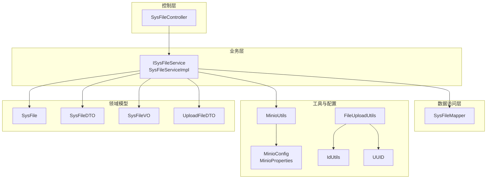
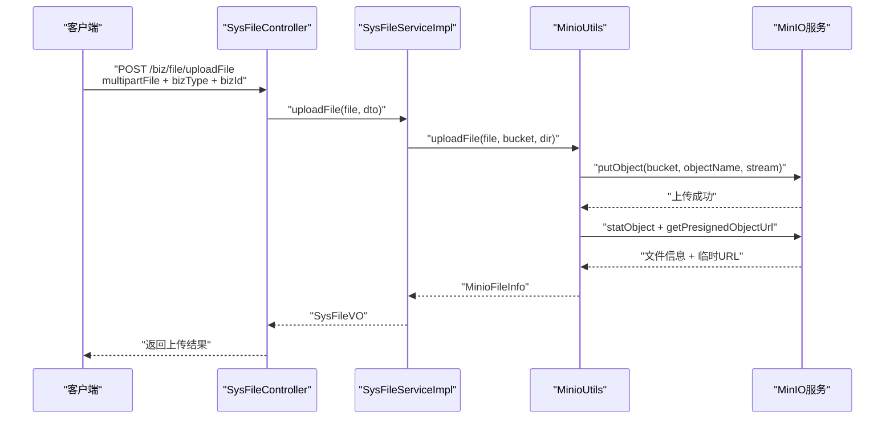
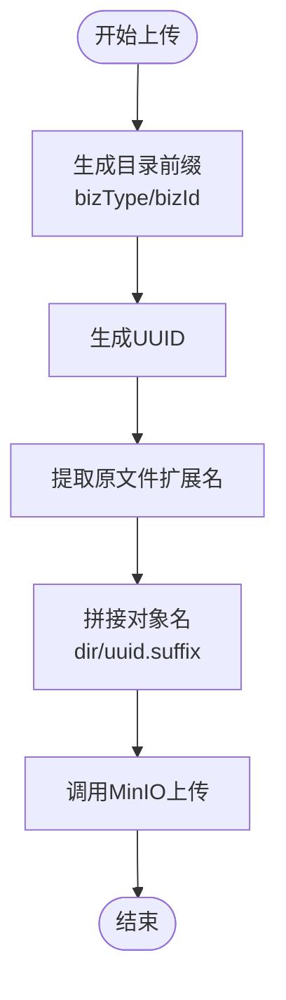
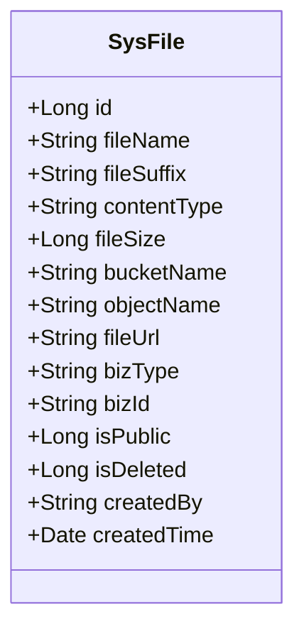
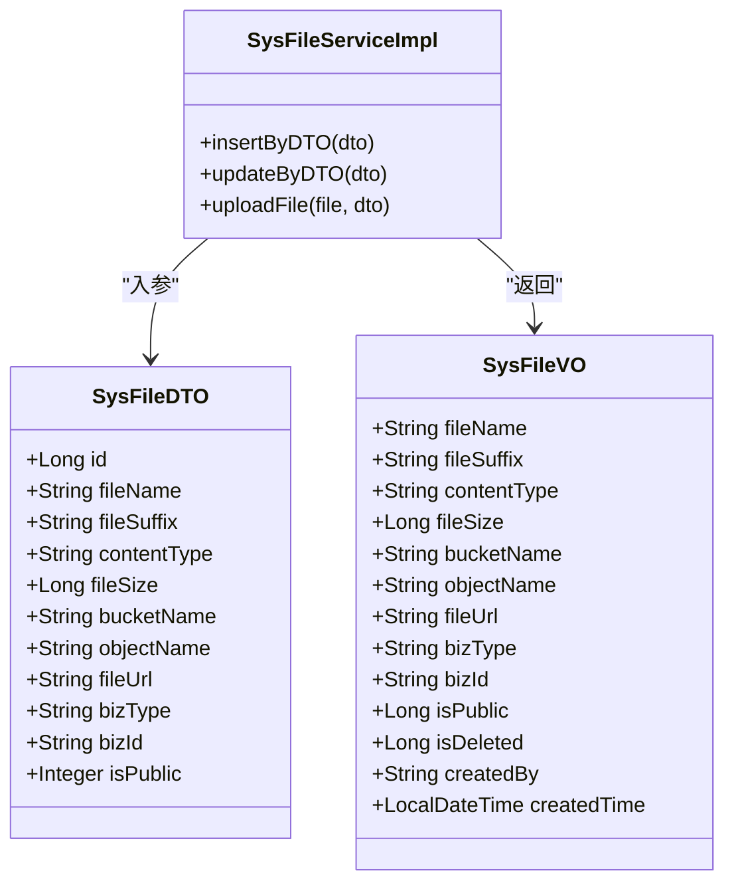
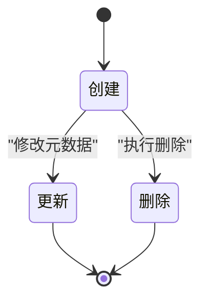
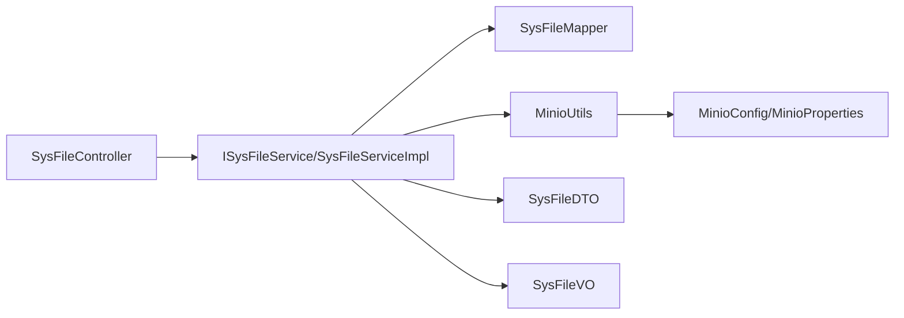

# 存储策略设计

<cite>
**本文引用的文件**
- [SysFile.java](file://blog-biz/src/main/java/blog/biz/domain/SysFile.java)
- [SysFileDTO.java](file://blog-biz/src/main/java/blog/biz/domain/dto/SysFileDTO.java)
- [SysFileVO.java](file://blog-biz/src/main/java/blog/biz/domain/vo/SysFileVO.java)
- [ISysFileService.java](file://blog-biz/src/main/java/blog/biz/service/ISysFileService.java)
- [SysFileServiceImpl.java](file://blog-biz/src/main/java/blog/biz/service/impl/SysFileServiceImpl.java)
- [SysFileMapper.java](file://blog-biz/src/main/java/blog/biz/mapper/SysFileMapper.java)
- [SysFileController.java](file://blog-admin/src/main/java/blog/web/controller/common/SysFileController.java)
- [UploadFileDTO.java](file://blog-biz/src/main/java/blog/biz/domain/dto/UploadFileDTO.java)
- [MinioUtils.java](file://blog-common/src/main/java/blog/common/utils/minio/MinioUtils.java)
- [MinioConfig.java](file://blog-common/src/main/java/blog/common/config/minio/MinioConfig.java)
- [MinioProperties.java](file://blog-common/src/main/java/blog/common/config/minio/MinioProperties.java)
- [FileUploadUtils.java](file://blog-common/src/main/java/blog/common/utils/file/FileUploadUtils.java)
- [IdUtils.java](file://blog-common/src/main/java/blog/common/utils/uuid/IdUtils.java)
- [UUID.java](file://blog-common/src/main/java/blog/common/utils/uuid/UUID.java)
- [application.yml](file://blog-admin/src/main/resources/application.yml)
</cite>

## 目录
1. [简介](#简介)
2. [项目结构](#项目结构)
3. [核心组件](#核心组件)
4. [架构总览](#架构总览)
5. [组件详解](#组件详解)
6. [依赖关系分析](#依赖关系分析)
7. [性能考量](#性能考量)
8. [故障排查指南](#故障排查指南)
9. [结论](#结论)
10. [附录](#附录)

## 简介
本文件面向“存储策略设计”，系统化阐述文件存储在本项目中的设计与实现，重点覆盖：
- 文件命名规则与UUID生成机制
- 目录结构组织策略（按业务类型与业务ID）
- SysFile实体设计与元数据字段
- 文件DTO/VO设计与转换机制
- 文件存储生命周期管理（创建、更新、删除、归档思路）
- 最佳实践与性能优化建议

## 项目结构
围绕文件存储的关键模块分布如下：
- 控制层：SysFileController 提供REST接口，负责接收上传请求与查询请求
- 业务层：ISysFileService 及其实现 SysFileServiceImpl，封装上传、查询、分页等逻辑
- 数据访问层：SysFileMapper 继承基础泛型Mapper，支持实体与VO的分页查询
- 工具与配置：MinioUtils 封装MinIO客户端操作；MinioConfig/MinioProperties 提供连接配置；FileUploadUtils/IdUtils/UUID 提供本地文件上传与UUID生成能力
- 领域模型：SysFile（持久化实体）、SysFileDTO（业务入参/校验）、SysFileVO（视图输出）

图表来源
- [SysFileController.java:1-123](file://blog-admin/src/main/java/blog/web/controller/common/SysFileController.java#L1-123)
- [ISysFileService.java:1-75](file://blog-biz/src/main/java/blog/biz/service/ISysFileService.java#L1-75)
- [SysFileServiceImpl.java:1-169](file://blog-biz/src/main/java/blog/biz/service/impl/SysFileServiceImpl.java#L1-169)
- [SysFileMapper.java:1-16](file://blog-biz/src/main/java/blog/biz/mapper/SysFileMapper.java#L1-16)
- [MinioUtils.java:1-325](file://blog-common/src/main/java/blog/common/utils/minio/MinioUtils.java#L1-325)
- [MinioConfig.java:1-34](file://blog-common/src/main/java/blog/common/config/minio/MinioConfig.java#L1-34)
- [MinioProperties.java:1-23](file://blog-common/src/main/java/blog/common/config/minio/MinioProperties.java#L1-23)
- [FileUploadUtils.java:1-225](file://blog-common/src/main/java/blog/common/utils/file/FileUploadUtils.java#L1-225)
- [IdUtils.java:1-45](file://blog-common/src/main/java/blog/common/utils/uuid/IdUtils.java#L1-45)
- [UUID.java:1-442](file://blog-common/src/main/java/blog/common/utils/uuid/UUID.java#L1-442)
- [SysFile.java:1-95](file://blog-biz/src/main/java/blog/biz/domain/SysFile.java#L1-95)
- [SysFileDTO.java:1-83](file://blog-biz/src/main/java/blog/biz/domain/dto/SysFileDTO.java#L1-83)
- [SysFileVO.java:1-114](file://blog-biz/src/main/java/blog/biz/domain/vo/SysFileVO.java#L1-114)
- [UploadFileDTO.java:1-36](file://blog-biz/src/main/java/blog/biz/domain/dto/UploadFileDTO.java#L1-36)

章节来源
- [SysFileController.java:1-123](file://blog-admin/src/main/java/blog/web/controller/common/SysFileController.java#L1-123)
- [SysFileServiceImpl.java:1-169](file://blog-biz/src/main/java/blog/biz/service/impl/SysFileServiceImpl.java#L1-169)
- [MinioUtils.java:1-325](file://blog-common/src/main/java/blog/common/utils/minio/MinioUtils.java#L1-325)
- [application.yml:155-161](file://blog-admin/src/main/resources/application.yml#L155-L161)

## 核心组件
- SysFile：数据库持久化实体，记录文件的原始名、后缀、类型、大小、MinIO桶与对象名、访问URL、业务类型与ID、公开状态、删除标记、创建者与时间等
- SysFileDTO：业务入参对象，承载新增/编辑时的校验规则与字段
- SysFileVO：视图对象，用于对外输出，包含导出与展示所需的字段
- ISysFileService/SysFileServiceImpl：封装上传、查询、分页、删除等业务流程，并通过MinioUtils完成实际的文件上传与信息获取
- MinioUtils：封装MinIO上传、下载、删除、列举、URL生成等操作，统一返回MinioFileInfo
- UploadFileDTO：封装业务类型与业务ID，生成MinIO目录前缀
- FileUploadUtils/IdUtils/UUID：提供本地文件上传与UUID生成能力（作为对比或本地场景参考）

章节来源
- [SysFile.java:17-95](file://blog-biz/src/main/java/blog/biz/domain/SysFile.java#L17-L95)
- [SysFileDTO.java:19-83](file://blog-biz/src/main/java/blog/biz/domain/dto/SysFileDTO.java#L19-L83)
- [SysFileVO.java:24-114](file://blog-biz/src/main/java/blog/biz/domain/vo/SysFileVO.java#L24-L114)
- [ISysFileService.java:21-75](file://blog-biz/src/main/java/blog/biz/service/ISysFileService.java#L21-L75)
- [SysFileServiceImpl.java:35-169](file://blog-biz/src/main/java/blog/biz/service/impl/SysFileServiceImpl.java#L35-L169)
- [MinioUtils.java:25-325](file://blog-common/src/main/java/blog/common/utils/minio/MinioUtils.java#L25-L325)
- [UploadFileDTO.java:15-36](file://blog-biz/src/main/java/blog/biz/domain/dto/UploadFileDTO.java#L15-L36)

## 架构总览
文件上传与存储的整体流程如下：

图表来源
- [SysFileController.java:111-121](file://blog-admin/src/main/java/blog/web/controller/common/SysFileController.java#L111-L121)
- [SysFileServiceImpl.java:151-167](file://blog-biz/src/main/java/blog/biz/service/impl/SysFileServiceImpl.java#L151-L167)
- [MinioUtils.java:85-111](file://blog-common/src/main/java/blog/common/utils/minio/MinioUtils.java#L85-L111)

章节来源
- [SysFileController.java:111-121](file://blog-admin/src/main/java/blog/web/controller/common/SysFileController.java#L111-L121)
- [SysFileServiceImpl.java:151-167](file://blog-biz/src/main/java/blog/biz/service/impl/SysFileServiceImpl.java#L151-L167)
- [MinioUtils.java:85-111](file://blog-common/src/main/java/blog/common/utils/minio/MinioUtils.java#L85-L111)

## 组件详解

### 文件命名规则与UUID生成机制
- MinIO对象名生成策略
  - 目录前缀由 UploadFileDTO.getDir() 生成，格式为 “业务类型/业务ID”
  - 对象名为 “目录前缀/UUID.原扩展名”
  - UUID采用Java UUID随机生成，确保高可用与低冲突概率
- 本地文件命名策略（对比参考）
  - FileUploadUtils 支持两种命名：基于日期路径+原始名+序列号，或基于日期路径+UUID+扩展名
  - 本地命名工具与UUID工具位于独立包，便于区分本地与云存储场景

图表来源
- [UploadFileDTO.java:32-34](file://blog-biz/src/main/java/blog/biz/domain/dto/UploadFileDTO.java#L32-L34)
- [MinioUtils.java:97-98](file://blog-common/src/main/java/blog/common/utils/minio/MinioUtils.java#L97-L98)
- [FileUploadUtils.java:138-140](file://blog-common/src/main/java/blog/common/utils/file/FileUploadUtils.java#L138-L140)

章节来源
- [UploadFileDTO.java:15-36](file://blog-biz/src/main/java/blog/biz/domain/dto/UploadFileDTO.java#L15-L36)
- [MinioUtils.java:85-111](file://blog-common/src/main/java/blog/common/utils/minio/MinioUtils.java#L85-L111)
- [FileUploadUtils.java:138-140](file://blog-common/src/main/java/blog/common/utils/file/FileUploadUtils.java#L138-L140)
- [IdUtils.java:14-43](file://blog-common/src/main/java/blog/common/utils/uuid/IdUtils.java#L14-L43)
- [UUID.java:71-100](file://blog-common/src/main/java/blog/common/utils/uuid/UUID.java#L71-L100)

### 目录结构组织方式
- MinIO目录策略
  - 采用“业务类型/业务ID”两级目录，便于按业务维度隔离与检索
  - 上传时自动创建桶（若不存在），并以对象名唯一标识文件
- 本地目录策略（对比参考）
  - 默认按“日期路径”组织，如“yyyyMMdd/”
  - 支持自定义命名策略（序列号或UUID）

章节来源
- [UploadFileDTO.java:32-34](file://blog-biz/src/main/java/blog/biz/domain/dto/UploadFileDTO.java#L32-L34)
- [MinioUtils.java:69-73](file://blog-common/src/main/java/blog/common/utils/minio/MinioUtils.java#L69-L73)
- [FileUploadUtils.java:131-133](file://blog-common/src/main/java/blog/common/utils/file/FileUploadUtils.java#L131-L133)

### SysFile实体设计
- 字段说明
  - 基础元数据：原始文件名、后缀、内容类型、大小
  - 存储定位：MinIO桶名、对象名、访问URL
  - 业务关联：业务类型、业务ID
  - 访问控制：公开标志
  - 生命周期：删除标志、创建者、创建时间
- 设计要点
  - 与MinIO上传结果一一对应，便于落库与回显
  - 与业务解耦，通过bizType/bizId实现多业务复用

图表来源
- [SysFile.java:20-95](file://blog-biz/src/main/java/blog/biz/domain/SysFile.java#L20-L95)

章节来源
- [SysFile.java:17-95](file://blog-biz/src/main/java/blog/biz/domain/SysFile.java#L17-L95)

### 文件DTO与VO设计及转换机制
- SysFileDTO
  - 用于新增/编辑时的入参校验，包含必填字段与校验组
- SysFileVO
  - 用于对外输出与导出，包含Excel注解字段，便于表格导出
- 转换机制
  - 业务层在入库前将DTO复制到实体类进行持久化
  - 上传完成后，业务层构建VO返回给前端（字段来自MinioUtils返回的文件信息）

图表来源
- [SysFileDTO.java:19-83](file://blog-biz/src/main/java/blog/biz/domain/dto/SysFileDTO.java#L19-L83)
- [SysFileVO.java:24-114](file://blog-biz/src/main/java/blog/biz/domain/vo/SysFileVO.java#L24-L114)
- [SysFileServiceImpl.java:105-127](file://blog-biz/src/main/java/blog/biz/service/impl/SysFileServiceImpl.java#L105-L127)

章节来源
- [SysFileDTO.java:19-83](file://blog-biz/src/main/java/blog/biz/domain/dto/SysFileDTO.java#L19-L83)
- [SysFileVO.java:24-114](file://blog-biz/src/main/java/blog/biz/domain/vo/SysFileVO.java#L24-L114)
- [SysFileServiceImpl.java:105-127](file://blog-biz/src/main/java/blog/biz/service/impl/SysFileServiceImpl.java#L105-L127)

### 文件存储生命周期管理
- 创建
  - 控制器接收文件与业务信息
  - 业务层调用MinioUtils上传，生成对象名并返回文件信息
  - 业务层构建SysFileVO返回前端
- 更新
  - 通过SysFileServiceImpl.updateByDTO更新元数据（如公开标志、业务关联等）
- 删除
  - 通过SysFileServiceImpl.deleteWithValidByIds执行删除（可选业务校验）
  - MinIO侧可通过MinioUtils.deleteFile或deleteFiles执行物理删除
- 归档
  - 代码未直接实现归档逻辑，建议通过isDeleted字段与业务策略实现软归档；或在MinIO侧通过标签/生命周期策略实现对象归档

图表来源
- [SysFileController.java:79-109](file://blog-admin/src/main/java/blog/web/controller/common/SysFileController.java#L79-L109)
- [SysFileServiceImpl.java:105-149](file://blog-biz/src/main/java/blog/biz/service/impl/SysFileServiceImpl.java#L105-L149)
- [MinioUtils.java:233-255](file://blog-common/src/main/java/blog/common/utils/minio/MinioUtils.java#L233-L255)

章节来源
- [SysFileController.java:79-109](file://blog-admin/src/main/java/blog/web/controller/common/SysFileController.java#L79-L109)
- [SysFileServiceImpl.java:105-149](file://blog-biz/src/main/java/blog/biz/service/impl/SysFileServiceImpl.java#L105-L149)
- [MinioUtils.java:233-255](file://blog-common/src/main/java/blog/common/utils/minio/MinioUtils.java#L233-L255)

### MinIO集成与配置
- MinioConfig/MinioProperties
  - 通过配置文件注入endpoint、accessKey、secretKey、bucket-name
  - 初始化MinioClient并在启动时验证连接
- MinioUtils
  - 提供上传、下载、删除、列举、URL生成等能力
  - 上传时自动生成对象名并返回MinioFileInfo（包含桶名、对象名、URL、大小、类型、上传时间）

章节来源
- [MinioConfig.java:12-34](file://blog-common/src/main/java/blog/common/config/minio/MinioConfig.java#L12-L34)
- [MinioProperties.java:9-23](file://blog-common/src/main/java/blog/common/config/minio/MinioProperties.java#L9-L23)
- [MinioUtils.java:25-325](file://blog-common/src/main/java/blog/common/utils/minio/MinioUtils.java#L25-L325)
- [application.yml:155-161](file://blog-admin/src/main/resources/application.yml#L155-L161)

## 依赖关系分析
- 控制层依赖业务层接口，业务层依赖数据访问层与MinIO工具
- 业务层与领域模型之间通过DTO/VO进行数据转换
- MinIO工具依赖MinioClient与配置类

图表来源
- [SysFileController.java:1-123](file://blog-admin/src/main/java/blog/web/controller/common/SysFileController.java#L1-123)
- [SysFileServiceImpl.java:1-169](file://blog-biz/src/main/java/blog/biz/service/impl/SysFileServiceImpl.java#L1-169)
- [SysFileMapper.java:1-16](file://blog-biz/src/main/java/blog/biz/mapper/SysFileMapper.java#L1-16)
- [MinioUtils.java:1-325](file://blog-common/src/main/java/blog/common/utils/minio/MinioUtils.java#L1-325)
- [MinioConfig.java:1-34](file://blog-common/src/main/java/blog/common/config/minio/MinioConfig.java#L1-34)
- [MinioProperties.java:1-23](file://blog-common/src/main/java/blog/common/config/minio/MinioProperties.java#L1-23)

章节来源
- [SysFileController.java:1-123](file://blog-admin/src/main/java/blog/web/controller/common/SysFileController.java#L1-123)
- [SysFileServiceImpl.java:1-169](file://blog-biz/src/main/java/blog/biz/service/impl/SysFileServiceImpl.java#L1-169)
- [SysFileMapper.java:1-16](file://blog-biz/src/main/java/blog/biz/mapper/SysFileMapper.java#L1-16)
- [MinioUtils.java:1-325](file://blog-common/src/main/java/blog/common/utils/minio/MinioUtils.java#L1-325)
- [MinioConfig.java:1-34](file://blog-common/src/main/java/blog/common/config/minio/MinioConfig.java#L1-34)
- [MinioProperties.java:1-23](file://blog-common/src/main/java/blog/common/config/minio/MinioProperties.java#L1-23)

## 性能考量
- UUID生成
  - 使用高性能随机UUID生成（fastUUID），避免阻塞与竞争
- 上传路径
  - MinIO对象名采用“目录前缀/UUID.扩展名”，避免同名冲突与热点问题
- URL生成
  - 默认生成24小时临时URL，兼顾安全性与易用性；可根据业务需求调整过期时间
- 并发与线程
  - MinIO客户端为线程安全；上传过程使用流式写入，降低内存占用
- 建议
  - 大文件上传建议结合断点续传与分片策略（需在上层业务扩展）
  - 对频繁访问的文件可考虑开启MinIO对象版本控制与生命周期策略

章节来源
- [IdUtils.java:32-43](file://blog-common/src/main/java/blog/common/utils/uuid/IdUtils.java#L32-L43)
- [MinioUtils.java:97-111](file://blog-common/src/main/java/blog/common/utils/minio/MinioUtils.java#L97-L111)
- [MinioUtils.java:164-171](file://blog-common/src/main/java/blog/common/utils/minio/MinioUtils.java#L164-L171)

## 故障排查指南
- 连接MinIO失败
  - 检查配置项endpoint、accessKey、secretKey、bucket-name是否正确
  - 查看MinioConfig启动日志验证连接
- 上传失败
  - 检查文件大小与扩展名校验（本地上传工具）
  - 检查MinIO桶是否存在，必要时启用自动创建
- 下载/访问异常
  - 确认对象名与桶名一致
  - 若使用临时URL，确认过期时间设置合理
- 删除异常
  - 使用MinioUtils.deleteFile或deleteFiles进行批量删除，关注返回的错误信息

章节来源
- [application.yml:155-161](file://blog-admin/src/main/resources/application.yml#L155-L161)
- [MinioConfig.java:24-30](file://blog-common/src/main/java/blog/common/config/minio/MinioConfig.java#L24-L30)
- [MinioUtils.java:69-73](file://blog-common/src/main/java/blog/common/utils/minio/MinioUtils.java#L69-L73)
- [MinioUtils.java:233-255](file://blog-common/src/main/java/blog/common/utils/minio/MinioUtils.java#L233-L255)

## 结论
本项目的存储策略以MinIO为核心，采用“业务类型/业务ID”的目录结构与UUID对象名，确保唯一性与可维护性。通过SysFile实体与DTO/VO清晰分离职责，配合业务层统一编排，形成完整的文件生命周期管理闭环。建议在生产环境中结合对象版本控制、生命周期策略与访问控制进一步完善。

## 附录
- 关键配置项
  - MinIO连接参数：endpoint、access-key、secret-key、bucket-name
  - 文件上传大小限制：spring.servlet.multipart.max-file-size、max-request-size
- 建议的目录策略
  - 按业务类型/业务ID分层，便于权限控制与容量统计
  - 可引入时间维度（如年/月）作为第三层级，提升大体量场景下的可管理性

章节来源
- [application.yml:52-58](file://blog-admin/src/main/resources/application.yml#L52-L58)
- [application.yml:155-161](file://blog-admin/src/main/resources/application.yml#L155-L161)
- [UploadFileDTO.java:32-34](file://blog-biz/src/main/java/blog/biz/domain/dto/UploadFileDTO.java#L32-L34)