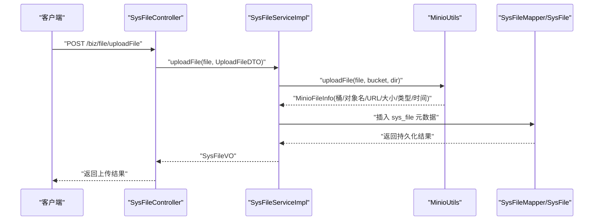
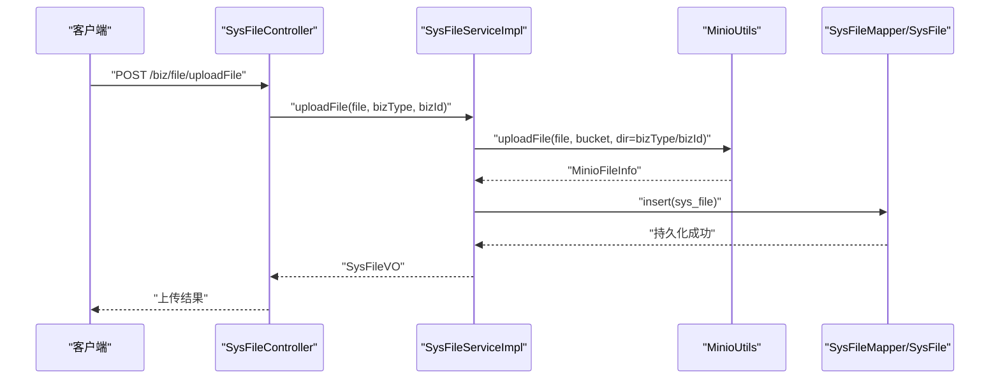
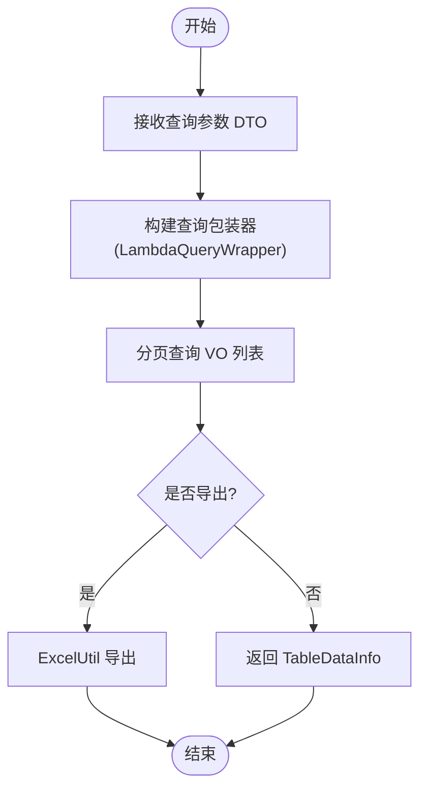
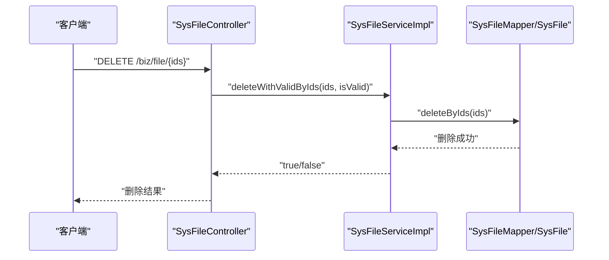
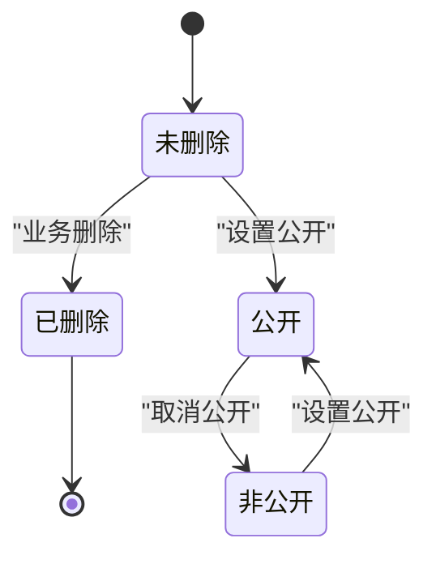
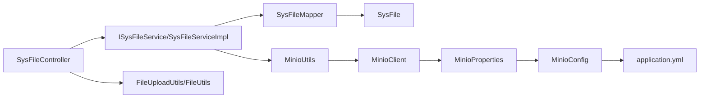

# 文件生命周期管理

<cite>
**本文引用的文件**
- [SysFileController.java](file://blog-admin/src/main/java/blog/web/controller/common/SysFileController.java)
- [ISysFileService.java](file://blog-biz/src/main/java/blog/biz/service/ISysFileService.java)
- [SysFileServiceImpl.java](file://blog-biz/src/main/java/blog/biz/service/impl/SysFileServiceImpl.java)
- [SysFileMapper.java](file://blog-biz/src/main/java/blog/biz/mapper/SysFileMapper.java)
- [SysFile.java](file://blog-biz/src/main/java/blog/biz/domain/SysFile.java)
- [SysFileDTO.java](file://blog-biz/src/main/java/blog/biz/domain/dto/SysFileDTO.java)
- [SysFileVO.java](file://blog-biz/src/main/java/blog/biz/domain/vo/SysFileVO.java)
- [UploadFileDTO.java](file://blog-biz/src/main/java/blog/biz/domain/dto/UploadFileDTO.java)
- [MinioUtils.java](file://blog-common/src/main/java/blog/common/utils/minio/MinioUtils.java)
- [MinioConfig.java](file://blog-common/src/main/java/blog/common/config/minio/MinioConfig.java)
- [MinioProperties.java](file://blog-common/src/main/java/blog/common/config/minio/MinioProperties.java)
- [FileUploadUtils.java](file://blog-common/src/main/java/blog/common/utils/file/FileUploadUtils.java)
- [FileUtils.java](file://blog-common/src/main/java/blog/common/utils/file/FileUtils.java)
- [application.yml](file://blog-admin/src/main/resources/application.yml)
- [ry-vue-owner.sql](file://ry-vue-owner.sql)
</cite>

## 目录
1. [简介](#简介)
2. [项目结构](#项目结构)
3. [核心组件](#核心组件)
4. [架构总览](#架构总览)
5. [详细组件分析](#详细组件分析)
6. [依赖分析](#依赖分析)
7. [性能考虑](#性能考虑)
8. [故障排查指南](#故障排查指南)
9. [结论](#结论)
10. [附录](#附录)

## 简介
本技术文档围绕“文件生命周期管理”主题，系统梳理从文件创建、上传、存储、访问、更新、删除、归档到清理回收的全链路处理流程；阐明文件状态管理机制（状态定义、转换、检查与同步）；给出版本管理策略（版本控制、历史版本保留、版本回滚与合并思路）；解释清理与回收机制（垃圾文件检测、过期文件处理、存储空间回收、磁盘清理）；说明备份与恢复策略（数据备份、灾难恢复、一致性保证、恢复测试）；并提供监控与审计能力（操作日志、使用统计、容量监控、性能分析）。文档同时提供生命周期流程图与实施指导，帮助读者快速落地。

## 项目结构
本项目采用多模块分层架构：admin 控制层负责对外接口；biz 业务层负责领域模型与服务；common 公共层提供通用工具与配置；数据库脚本定义了文件元数据表结构。与文件生命周期直接相关的模块与文件如下：
- 控制层：SysFileController 提供文件上传与查询接口
- 业务层：ISysFileService、SysFileServiceImpl 封装上传与持久化逻辑
- 数据层：SysFileMapper、SysFile 实体映射 sys_file 表
- 存储层：MinioUtils 封装 MinIO 上传、访问、删除、列举等操作
- 配置层：MinioConfig、MinioProperties、application.yml 提供 MinIO 连接与桶配置
- 本地文件工具：FileUploadUtils、FileUtils 支持本地上传与下载辅助能力

```mermaid
graph TB
subgraph "控制层"
C1["SysFileController<br/>REST 接口"]
end
subgraph "业务层"
S1["ISysFileService<br/>接口"]
S2["SysFileServiceImpl<br/>实现"]
end
subgraph "数据层"
D1["SysFileMapper<br/>MyBatis Plus"]
D2["SysFile<br/>实体"]
end
subgraph "存储层"
U1["MinioUtils<br/>MinIO 客户端封装"]
P1["MinioProperties<br/>配置属性"]
Cfg["MinioConfig<br/>客户端 Bean"]
end
subgraph "配置"
Y1["application.yml<br/>minio 配置"]
end
subgraph "本地工具"
L1["FileUploadUtils<br/>本地上传"]
L2["FileUtils<br/>文件下载/删除"]
end
C1 --> S1
S1 < --> S2
S2 --> D1
D1 --> D2
S2 --> U1
U1 --> Cfg
Cfg --> P1
P1 --> Y1
C1 --> L1
C1 --> L2
```

图表来源
- [SysFileController.java:35-123](file://blog-admin/src/main/java/blog/web/controller/common/SysFileController.java#L35-L123)
- [SysFileServiceImpl.java:35-168](file://blog-biz/src/main/java/blog/biz/service/impl/SysFileServiceImpl.java#L35-L168)
- [SysFileMapper.java:13-15](file://blog-biz/src/main/java/blog/biz/mapper/SysFileMapper.java#L13-L15)
- [SysFile.java:20-94](file://blog-biz/src/main/java/blog/biz/domain/SysFile.java#L20-L94)
- [MinioUtils.java:25-35](file://blog-common/src/main/java/blog/common/utils/minio/MinioUtils.java#L25-L35)
- [MinioConfig.java:12-31](file://blog-common/src/main/java/blog/common/config/minio/MinioConfig.java#L12-L31)
- [MinioProperties.java:12-22](file://blog-common/src/main/java/blog/common/config/minio/MinioProperties.java#L12-L22)
- [application.yml:155-161](file://blog-admin/src/main/resources/application.yml#L155-L161)
- [FileUploadUtils.java:25-225](file://blog-common/src/main/java/blog/common/utils/file/FileUploadUtils.java#L25-L225)
- [FileUtils.java:29-258](file://blog-common/src/main/java/blog/common/utils/file/FileUtils.java#L29-L258)

章节来源
- [SysFileController.java:35-123](file://blog-admin/src/main/java/blog/web/controller/common/SysFileController.java#L35-L123)
- [SysFileServiceImpl.java:35-168](file://blog-biz/src/main/java/blog/biz/service/impl/SysFileServiceImpl.java#L35-L168)
- [MinioUtils.java:25-35](file://blog-common/src/main/java/blog/common/utils/minio/MinioUtils.java#L25-L35)
- [MinioConfig.java:12-31](file://blog-common/src/main/java/blog/common/config/minio/MinioConfig.java#L12-L31)
- [MinioProperties.java:12-22](file://blog-common/src/main/java/blog/common/config/minio/MinioProperties.java#L12-L22)
- [application.yml:155-161](file://blog-admin/src/main/resources/application.yml#L155-L161)
- [FileUploadUtils.java:25-225](file://blog-common/src/main/java/blog/common/utils/file/FileUploadUtils.java#L25-L225)
- [FileUtils.java:29-258](file://blog-common/src/main/java/blog/common/utils/file/FileUtils.java#L29-L258)

## 核心组件
- 控制器层：SysFileController 提供文件上传、查询、导出、删除等接口，并记录操作日志与防重复提交
- 业务服务层：SysFileServiceImpl 将上传结果映射为 VO 并持久化到 sys_file 表；支持分页查询与列表导出
- 数据访问层：SysFileMapper 继承通用 MapperPlus，SysFile 实体映射 sys_file 表字段
- 存储工具层：MinioUtils 封装 MinIO 的上传、信息获取、临时 URL 生成、删除、列举等操作
- 配置层：MinioConfig 构建 MinioClient 并验证连通性；MinioProperties 读取配置项；application.yml 提供 endpoint、access-key、secret-key、bucket-name
- 本地工具层：FileUploadUtils 与 FileUtils 提供本地上传与下载辅助能力（作为补充）

章节来源
- [SysFileController.java:35-123](file://blog-admin/src/main/java/blog/web/controller/common/SysFileController.java#L35-L123)
- [SysFileServiceImpl.java:35-168](file://blog-biz/src/main/java/blog/biz/service/impl/SysFileServiceImpl.java#L35-L168)
- [SysFileMapper.java:13-15](file://blog-biz/src/main/java/blog/biz/mapper/SysFileMapper.java#L13-L15)
- [SysFile.java:20-94](file://blog-biz/src/main/java/blog/biz/domain/SysFile.java#L20-L94)
- [MinioUtils.java:25-35](file://blog-common/src/main/java/blog/common/utils/minio/MinioUtils.java#L25-L35)
- [MinioConfig.java:12-31](file://blog-common/src/main/java/blog/common/config/minio/MinioConfig.java#L12-L31)
- [MinioProperties.java:12-22](file://blog-common/src/main/java/blog/common/config/minio/MinioProperties.java#L12-L22)
- [application.yml:155-161](file://blog-admin/src/main/resources/application.yml#L155-L161)
- [FileUploadUtils.java:25-225](file://blog-common/src/main/java/blog/common/utils/file/FileUploadUtils.java#L25-L225)
- [FileUtils.java:29-258](file://blog-common/src/main/java/blog/common/utils/file/FileUtils.java#L29-L258)

## 架构总览
文件生命周期管理由“接口层—业务层—数据层—存储层—配置层—本地工具层”构成，形成清晰的职责边界与调用链路。上传流程通过控制器接收文件，业务层调用 MinIO 工具完成对象存储，随后将元数据写入数据库；查询与导出通过业务层封装 VO 返回；删除通过业务层删除数据库记录并调用 MinIO 删除对象。



图表来源
- [SysFileController.java:111-121](file://blog-admin/src/main/java/blog/web/controller/common/SysFileController.java#L111-L121)
- [SysFileServiceImpl.java:151-167](file://blog-biz/src/main/java/blog/biz/service/impl/SysFileServiceImpl.java#L151-L167)
- [MinioUtils.java:77-147](file://blog-common/src/main/java/blog/common/utils/minio/MinioUtils.java#L77-L147)
- [SysFileMapper.java:13-15](file://blog-biz/src/main/java/blog/biz/mapper/SysFileMapper.java#L13-L15)
- [SysFile.java:20-94](file://blog-biz/src/main/java/blog/biz/domain/SysFile.java#L20-L94)

## 详细组件分析

### 文件上传组件分析
- 控制器接口：提供上传文件接口，接收 MultipartFile 与业务类型/业务 ID 参数，构造 UploadFileDTO 并调用业务层
- 业务层实现：调用 MinioUtils 上传文件，生成对象名与目录结构（基于 bizType/bizId），返回 MinioFileInfo 映射为 SysFileVO
- 存储工具：MinioUtils 封装上传、信息获取、临时 URL 生成、删除、列举等操作，确保与 MinIO 的交互一致可靠
- 数据持久化：SysFileServiceImpl 在上传成功后将文件元数据写入 sys_file 表，便于后续查询与管理



图表来源
- [SysFileController.java:111-121](file://blog-admin/src/main/java/blog/web/controller/common/SysFileController.java#L111-L121)
- [SysFileServiceImpl.java:151-167](file://blog-biz/src/main/java/blog/biz/service/impl/SysFileServiceImpl.java#L151-L167)
- [MinioUtils.java:77-147](file://blog-common/src/main/java/blog/common/utils/minio/MinioUtils.java#L77-L147)
- [SysFileMapper.java:13-15](file://blog-biz/src/main/java/blog/biz/mapper/SysFileMapper.java#L13-L15)
- [SysFile.java:20-94](file://blog-biz/src/main/java/blog/biz/domain/SysFile.java#L20-L94)

章节来源
- [SysFileController.java:111-121](file://blog-admin/src/main/java/blog/web/controller/common/SysFileController.java#L111-L121)
- [SysFileServiceImpl.java:151-167](file://blog-biz/src/main/java/blog/biz/service/impl/SysFileServiceImpl.java#L151-L167)
- [MinioUtils.java:77-147](file://blog-common/src/main/java/blog/common/utils/minio/MinioUtils.java#L77-L147)
- [SysFileMapper.java:13-15](file://blog-biz/src/main/java/blog/biz/mapper/SysFileMapper.java#L13-L15)
- [SysFile.java:20-94](file://blog-biz/src/main/java/blog/biz/domain/SysFile.java#L20-L94)

### 文件查询与导出组件分析
- 控制器提供分页查询与导出接口，支持按文件名、后缀、内容类型、桶名、对象名、业务类型/ID、公开状态、创建人、创建时间等条件过滤
- 业务层构建查询包装器并分页查询 VO 列表，支持导出 Excel
- 数据层通过 MapperPlus 提供 VO 分页与列表查询能力



图表来源
- [SysFileController.java:46-62](file://blog-admin/src/main/java/blog/web/controller/common/SysFileController.java#L46-L62)
- [SysFileServiceImpl.java:61-78](file://blog-biz/src/main/java/blog/biz/service/impl/SysFileServiceImpl.java#L61-L78)
- [SysFileServiceImpl.java:80-97](file://blog-biz/src/main/java/blog/biz/service/impl/SysFileServiceImpl.java#L80-L97)
- [SysFileMapper.java:13-15](file://blog-biz/src/main/java/blog/biz/mapper/SysFileMapper.java#L13-L15)

章节来源
- [SysFileController.java:46-62](file://blog-admin/src/main/java/blog/web/controller/common/SysFileController.java#L46-L62)
- [SysFileServiceImpl.java:61-78](file://blog-biz/src/main/java/blog/biz/service/impl/SysFileServiceImpl.java#L61-L78)
- [SysFileServiceImpl.java:80-97](file://blog-biz/src/main/java/blog/biz/service/impl/SysFileServiceImpl.java#L80-L97)
- [SysFileMapper.java:13-15](file://blog-biz/src/main/java/blog/biz/mapper/SysFileMapper.java#L13-L15)

### 文件删除组件分析
- 控制器提供删除接口，支持批量删除并记录日志
- 业务层执行删除前可进行有效性校验（预留扩展点）
- 数据层删除记录；存储层可选调用 MinioUtils 删除对象（当前实现仅删除数据库记录）



图表来源
- [SysFileController.java:103-109](file://blog-admin/src/main/java/blog/web/controller/common/SysFileController.java#L103-L109)
- [SysFileServiceImpl.java:143-149](file://blog-biz/src/main/java/blog/biz/service/impl/SysFileServiceImpl.java#L143-L149)
- [SysFileMapper.java:13-15](file://blog-biz/src/main/java/blog/biz/mapper/SysFileMapper.java#L13-L15)

章节来源
- [SysFileController.java:103-109](file://blog-admin/src/main/java/blog/web/controller/common/SysFileController.java#L103-L109)
- [SysFileServiceImpl.java:143-149](file://blog-biz/src/main/java/blog/biz/service/impl/SysFileServiceImpl.java#L143-L149)
- [SysFileMapper.java:13-15](file://blog-biz/src/main/java/blog/biz/mapper/SysFileMapper.java#L13-L15)

### 文件状态管理机制
- 状态定义：sys_file 表包含 is_public（公开状态）、is_deleted（删除标记）等字段，用于表达文件状态
- 状态转换：公开状态与删除状态可通过业务层更新接口进行变更；删除操作目前仅标记数据库记录，未在存储层同步删除对象
- 状态检查：查询接口支持按 is_public、is_deleted 条件过滤；导出功能可用于审计与核对
- 状态同步：建议在删除流程中同步调用 MinIO 删除对象，并在更新公开状态时同步调整对象权限策略（需结合 MinIO ACL/策略）



图表来源
- [SysFile.java:75-81](file://blog-biz/src/main/java/blog/biz/domain/SysFile.java#L75-L81)
- [SysFileServiceImpl.java:122-127](file://blog-biz/src/main/java/blog/biz/service/impl/SysFileServiceImpl.java#L122-L127)
- [SysFileServiceImpl.java:143-149](file://blog-biz/src/main/java/blog/biz/service/impl/SysFileServiceImpl.java#L143-L149)

章节来源
- [SysFile.java:75-81](file://blog-biz/src/main/java/blog/biz/domain/SysFile.java#L75-L81)
- [SysFileServiceImpl.java:122-127](file://blog-biz/src/main/java/blog/biz/service/impl/SysFileServiceImpl.java#L122-L127)
- [SysFileServiceImpl.java:143-149](file://blog-biz/src/main/java/blog/biz/service/impl/SysFileServiceImpl.java#L143-L149)

### 文件版本管理策略
- 当前实现：SysFile 实体未包含版本字段；MinioUtils 未提供版本化 API 调用
- 版本控制建议：在对象名中引入版本号或使用 MinIO 版本化能力（需在桶策略启用版本化），并在 sys_file 中增加 version 字段
- 历史版本保留：通过版本化保留策略与生命周期规则，自动清理过期版本
- 版本回滚：通过版本 ID 恢复到指定版本；需在业务层提供回滚接口与权限校验
- 版本合并：对多版本差异进行对比与合并，建议采用对象标签与元数据标记版本关系

章节来源
- [SysFile.java:20-94](file://blog-biz/src/main/java/blog/biz/domain/SysFile.java#L20-L94)
- [MinioUtils.java:25-35](file://blog-common/src/main/java/blog/common/utils/minio/MinioUtils.java#L25-L35)

### 文件清理与回收机制
- 垃圾文件检测：定期扫描 sys_file 中已删除记录但存储仍存在的对象；或通过对象标签/元数据识别未被业务引用的对象
- 过期文件处理：结合对象元数据或标签设置过期时间；通过定时任务清理过期对象
- 存储空间回收：删除对象后释放存储空间；建议配合桶生命周期规则自动清理
- 磁盘清理：本地上传场景下，FileUtils 提供删除文件能力；建议清理临时导入目录与无效文件

章节来源
- [MinioUtils.java:233-255](file://blog-common/src/main/java/blog/common/utils/minio/MinioUtils.java#L233-L255)
- [FileUtils.java:110-118](file://blog-common/src/main/java/blog/common/utils/file/FileUtils.java#L110-L118)

### 文件备份与恢复策略
- 数据备份：定期导出 sys_file 表结构与数据；结合数据库快照实现增量备份
- 对象备份：MinIO 支持跨区域复制与版本化；建议开启版本化并配置生命周期规则
- 一致性保证：在上传完成后先写入数据库再写入对象存储，失败时回滚数据库；或采用事务性写入（需结合具体存储能力）
- 恢复测试：定期进行恢复演练，验证备份数据完整性与可用性

章节来源
- [SysFileServiceImpl.java:151-167](file://blog-biz/src/main/java/blog/biz/service/impl/SysFileServiceImpl.java#L151-L167)
- [MinioUtils.java:121-147](file://blog-common/src/main/java/blog/common/utils/minio/MinioUtils.java#L121-L147)

### 监控与审计功能
- 操作日志：控制器使用注解记录上传、删除、导出等操作日志，便于审计
- 使用统计：通过查询接口统计文件数量、类型分布、业务域分布等
- 容量监控：定期统计 sys_file 总量与总大小，结合 MinIO 存储指标进行容量预警
- 性能分析：关注上传并发、数据库查询性能与 MinIO 延迟，必要时引入缓存与异步处理

章节来源
- [SysFileController.java:46-62](file://blog-admin/src/main/java/blog/web/controller/common/SysFileController.java#L46-L62)
- [SysFileController.java:103-109](file://blog-admin/src/main/java/blog/web/controller/common/SysFileController.java#L103-L109)

## 依赖分析
- 控制器依赖业务服务接口；业务服务依赖存储工具与数据访问层
- 存储工具依赖 MinIO 客户端 Bean；MinIO 客户端 Bean 依赖配置属性
- 数据访问层依赖 MyBatis Plus 通用 MapperPlus；实体映射 sys_file 表
- 本地工具层为上传与下载提供辅助能力



图表来源
- [SysFileController.java:35-123](file://blog-admin/src/main/java/blog/web/controller/common/SysFileController.java#L35-L123)
- [SysFileServiceImpl.java:35-168](file://blog-biz/src/main/java/blog/biz/service/impl/SysFileServiceImpl.java#L35-L168)
- [SysFileMapper.java:13-15](file://blog-biz/src/main/java/blog/biz/mapper/SysFileMapper.java#L13-L15)
- [SysFile.java:20-94](file://blog-biz/src/main/java/blog/biz/domain/SysFile.java#L20-L94)
- [MinioUtils.java:25-35](file://blog-common/src/main/java/blog/common/utils/minio/MinioUtils.java#L25-L35)
- [MinioConfig.java:12-31](file://blog-common/src/main/java/blog/common/config/minio/MinioConfig.java#L12-L31)
- [MinioProperties.java:12-22](file://blog-common/src/main/java/blog/common/config/minio/MinioProperties.java#L12-L22)
- [application.yml:155-161](file://blog-admin/src/main/resources/application.yml#L155-L161)
- [FileUploadUtils.java:25-225](file://blog-common/src/main/java/blog/common/utils/file/FileUploadUtils.java#L25-L225)
- [FileUtils.java:29-258](file://blog-common/src/main/java/blog/common/utils/file/FileUtils.java#L29-L258)

章节来源
- [SysFileController.java:35-123](file://blog-admin/src/main/java/blog/web/controller/common/SysFileController.java#L35-L123)
- [SysFileServiceImpl.java:35-168](file://blog-biz/src/main/java/blog/biz/service/impl/SysFileServiceImpl.java#L35-L168)
- [MinioUtils.java:25-35](file://blog-common/src/main/java/blog/common/utils/minio/MinioUtils.java#L25-L35)
- [MinioConfig.java:12-31](file://blog-common/src/main/java/blog/common/config/minio/MinioConfig.java#L12-L31)
- [MinioProperties.java:12-22](file://blog-common/src/main/java/blog/common/config/minio/MinioProperties.java#L12-L22)
- [application.yml:155-161](file://blog-admin/src/main/resources/application.yml#L155-L161)
- [FileUploadUtils.java:25-225](file://blog-common/src/main/java/blog/common/utils/file/FileUploadUtils.java#L25-L225)
- [FileUtils.java:29-258](file://blog-common/src/main/java/blog/common/utils/file/FileUtils.java#L29-L258)

## 性能考虑
- 上传性能：合理设置 Spring Boot 文件大小限制与线程池参数；MinIO 传输建议启用 HTTPS 与合适的并发
- 数据库性能：为 biz_type、biz_id 建立复合索引；分页查询避免一次性加载过多数据
- 存储性能：MinIO 桶内对象命名采用前缀分片，减少单目录对象过多导致的列举性能问题
- 缓存策略：热点文件元数据可引入 Redis 缓存，降低数据库压力

## 故障排查指南
- MinIO 连接失败：检查 MinioConfig 的连接验证日志与 application.yml 配置项
- 上传失败：检查文件大小限制、扩展名校验、桶是否存在与权限
- 删除异常：确认对象名与桶名正确；批量删除时关注返回的错误信息
- 下载异常：检查对象 URL 是否过期、浏览器编码与防盗链策略

章节来源
- [MinioConfig.java:24-29](file://blog-common/src/main/java/blog/common/config/minio/MinioConfig.java#L24-L29)
- [application.yml:155-161](file://blog-admin/src/main/resources/application.yml#L155-L161)
- [FileUploadUtils.java:114-126](file://blog-common/src/main/java/blog/common/utils/file/FileUploadUtils.java#L114-L126)
- [MinioUtils.java:243-255](file://blog-common/src/main/java/blog/common/utils/minio/MinioUtils.java#L243-L255)
- [FileUtils.java:181-194](file://blog-common/src/main/java/blog/common/utils/file/FileUtils.java#L181-L194)

## 结论
本项目已实现文件上传、查询、导出与删除的基础能力，结合 MinIO 对象存储与 sys_file 元数据表，形成较为完整的文件生命周期管理框架。建议后续完善以下方面：引入文件版本化与回滚能力、强化删除流程的状态同步与对象清理、建立定期清理与备份恢复机制、完善监控与审计体系，以满足生产环境对可靠性与可维护性的更高要求。

## 附录
- 数据库表结构（sys_file）关键字段：主键、原始文件名、后缀、内容类型、大小、桶名、对象名、访问 URL、业务类型、业务 ID、公开状态、删除标记、创建者、创建时间等
- 配置项：MinIO 端点、访问密钥、私有密钥、默认桶名

章节来源
- [ry-vue-owner.sql:1325-1347](file://ry-vue-owner.sql#L1325-L1347)
- [application.yml:155-161](file://blog-admin/src/main/resources/application.yml#L155-L161)