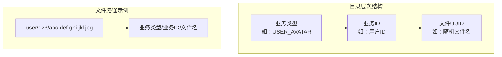
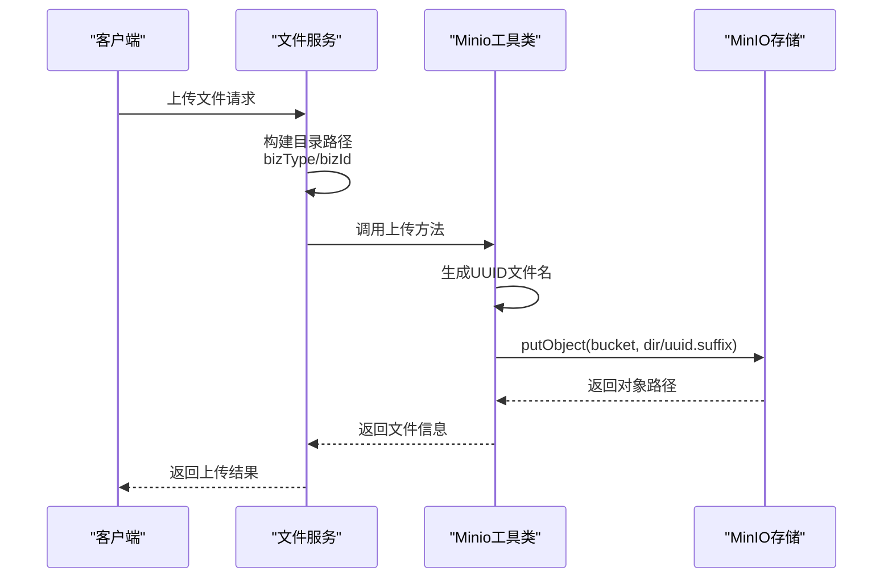
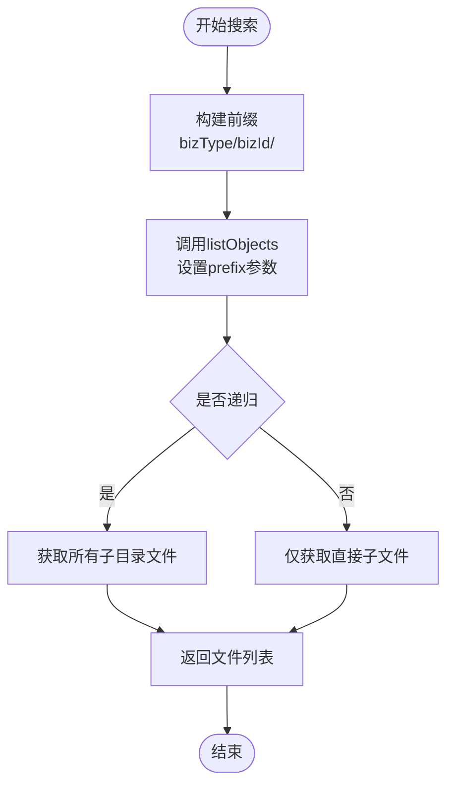
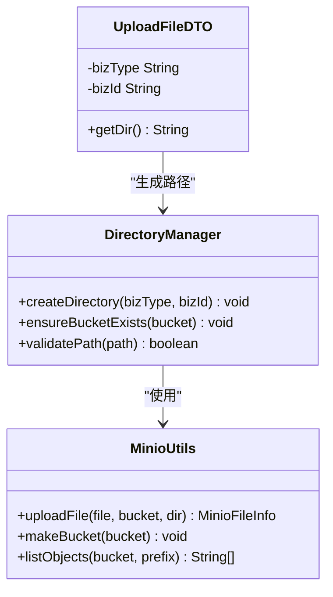
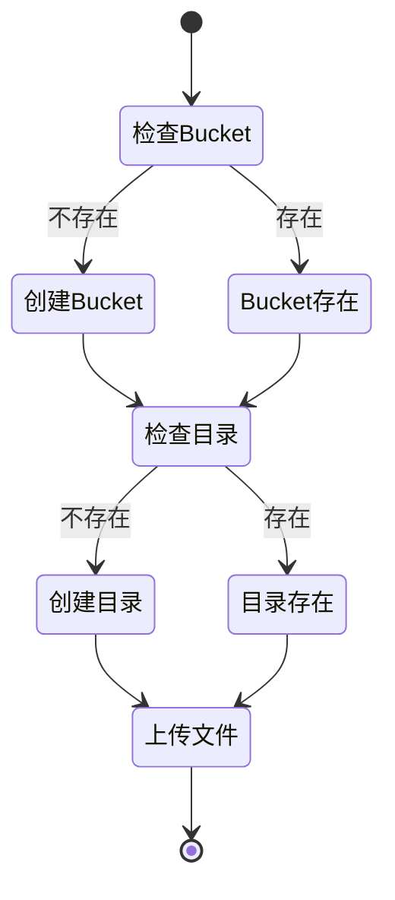

# 目录结构设计

<cite>
**本文引用的文件**
- [MinioConfig.java](file://blog-common/src/main/java/blog/common/config/minio/MinioConfig.java)
- [MinioProperties.java](file://blog-common/src/main/java/blog/common/config/minio/MinioProperties.java)
- [MinioUtils.java](file://blog-common/src/main/java/blog/common/utils/minio/MinioUtils.java)
- [SysFileServiceImpl.java](file://blog-biz/src/main/java/blog/biz/service/impl/SysFileServiceImpl.java)
- [SysFile.java](file://blog-biz/src/main/java/blog/biz/domain/SysFile.java)
- [UploadFileDTO.java](file://blog-biz/src/main/java/blog/biz/domain/dto/UploadFileDTO.java)
- [application.yml](file://blog-admin/src/main/resources/application.yml)
</cite>

## 目录结构设计概述

本项目采用基于业务维度的目录结构设计，通过MinIO的虚拟目录机制实现灵活的文件组织方式。系统支持按用户、按时间、按类型等多种维度的目录划分，并通过统一的目录前缀管理实现高效的文件检索和权限控制。

## 目录结构组织策略

### 1. 业务维度目录设计

系统采用"业务类型/业务ID"的两级目录结构，这种设计具有以下优势：



**图表来源**
- [UploadFileDTO.java:32-34](file://blog-biz/src/main/java/blog/biz/domain/dto/UploadFileDTO.java#L32-L34)
- [MinioUtils.java:97](file://blog-common/src/main/java/blog/common/utils/minio/MinioUtils.java#L97)

### 2. 虚拟目录实现机制

MinIO通过斜杠分隔符实现虚拟目录，实际存储采用扁平化结构：



**图表来源**
- [SysFileServiceImpl.java:152-167](file://blog-biz/src/main/java/blog/biz/service/impl/SysFileServiceImpl.java#L152-L167)
- [MinioUtils.java:85-111](file://blog-common/src/main/java/blog/common/utils/minio/MinioUtils.java#L85-L111)

### 3. 目录前缀匹配策略

系统通过前缀匹配实现目录级别的文件检索：



**图表来源**
- [MinioUtils.java:278-288](file://blog-common/src/main/java/blog/common/utils/minio/MinioUtils.java#L278-L288)

## 目录层级设计考虑

### 1. 层级深度控制

系统采用两级目录结构（业务类型/业务ID），这种设计平衡了以下因素：

- **性能优化**：两级目录避免了过深的路径层级，减少文件系统遍历开销
- **可扩展性**：业务类型维度支持未来扩展新的业务场景
- **可维护性**：清晰的层次结构便于管理和调试

### 2. 路径分隔符使用

系统统一使用斜杠作为路径分隔符，确保跨平台兼容性：

- **统一性**：所有目录路径使用"/"分隔
- **兼容性**：MinIO原生支持Unix风格路径
- **可读性**：人类可读的路径格式

### 3. 动态目录创建

系统在文件上传时自动创建必要的目录结构：



**图表来源**
- [MinioUtils.java:69-73](file://blog-common/src/main/java/blog/common/utils/minio/MinioUtils.java#L69-L73)
- [UploadFileDTO.java:32-34](file://blog-biz/src/main/java/blog/biz/domain/dto/UploadFileDTO.java#L32-L34)

## 目录命名规范

### 1. 命名规则

系统遵循以下命名规范：

- **业务类型**：使用大写字母和下划线组合，如 `USER_AVATAR`
- **业务ID**：使用数字字符串，如 `123456`
- **文件名**：使用UUID + 原文件扩展名，如 `abc-def-ghi-jkl.jpg`

### 2. 字符限制

- **允许字符**：字母、数字、下划线、连字符、点号
- **禁止字符**：空格、反斜杠、问号、星号等特殊字符
- **长度约束**：单个目录段不超过100字符

### 3. 特殊字符处理

系统自动处理特殊字符：
- 自动过滤非法字符
- 统一转换为安全字符
- 保持原始文件扩展名

## 目录权限控制机制

### 1. 访问控制列表

系统通过以下方式实现权限控制：

- **Bucket级别**：通过MinIO的ACL配置控制整体访问权限
- **对象级别**：通过预签名URL实现临时访问控制
- **业务级别**：通过业务逻辑验证用户权限

### 2. 继承策略

权限继承遵循以下原则：
- Bucket权限继承到所有对象
- 业务类型权限控制业务范围
- 业务ID权限控制具体资源

### 3. 权限传播

系统支持权限的自动传播：
- 新建目录自动继承父级权限
- 文件上传自动应用相应权限
- 权限变更影响相关资源

## 目录结构扩展性设计

### 1. 动态目录创建

系统支持动态目录创建，无需预先配置：



**图表来源**
- [MinioUtils.java:89-89](file://blog-common/src/main/java/blog/common/utils/minio/MinioUtils.java#L89-L89)
- [MinioUtils.java:69-73](file://blog-common/src/main/java/blog/common/utils/minio/MinioUtils.java#L69-L73)

### 2. 目录清理策略

系统提供多种清理策略：

- **按业务清理**：删除特定业务类型的所有文件
- **按时间清理**：清理超过指定时间的文件
- **按用户清理**：删除特定用户的全部文件

### 3. 垃圾回收机制

系统支持自动垃圾回收：
- 定期扫描无效文件引用
- 清理孤儿文件
- 释放存储空间

## 实际目录结构示例

### 1. 用户头像目录

```
user/
├── 123456/
│   ├── abc-def-ghi-jkl.jpg
│   ├── mno-pqr-stu-vwx.png
│   └── yza-bcd-efg-hij.gif
└── 789012/
    ├── klm-nop-qrs-tuv.webp
    └── wxy-zab-cde-fgh.svg
```

### 2. 博客图片目录

```
blog/
├── post_1001/
│   ├── image_001.jpg
│   ├── image_002.png
│   └── attachment_001.pdf
└── post_1002/
    ├── image_001.jpg
    └── video_001.mp4
```

### 3. 系统配置目录

```
config/
├── system/
│   └── app_settings.json
└── backup/
    ├── daily_backup_20241201.zip
    └── weekly_backup_20241125.zip
```

## 最佳实践指导

### 1. 目录设计建议

- **合理规划业务类型**：根据业务需求设计稳定的业务类型结构
- **控制目录数量**：避免单个目录下文件过多，建议每目录不超过10000个文件
- **使用有意义的命名**：业务ID应具有业务含义，便于管理和检索

### 2. 性能优化建议

- **目录分布均匀**：确保各目录下的文件数量相对均衡
- **定期清理无用文件**：建立定期清理机制
- **监控存储使用情况**：建立存储使用监控和告警机制

### 3. 安全管理建议

- **最小权限原则**：为不同业务类型设置适当的访问权限
- **定期审计**：定期检查目录权限和访问日志
- **备份策略**：建立完善的文件备份和恢复机制

### 4. 扩展性考虑

- **预留扩展空间**：为未来的业务发展预留目录结构空间
- **向后兼容**：新旧目录结构应保持兼容性
- **版本管理**：对目录结构变更进行版本化管理

## 配置管理

### 1. MinIO配置

系统通过配置文件管理MinIO连接信息：

- **endpoint**：MinIO服务地址
- **access-key**：访问密钥
- **secret-key**：私有密钥
- **bucket-name**：默认存储桶名称

### 2. 目录配置

系统支持动态配置目录结构：
- 可配置不同的业务类型目录模板
- 支持多租户隔离的目录结构
- 提供目录结构的自定义扩展接口