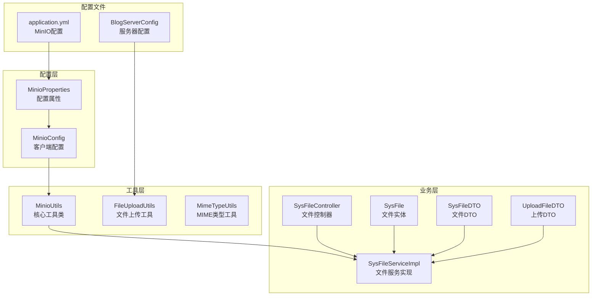
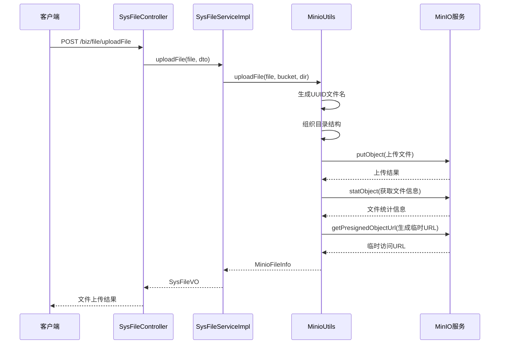
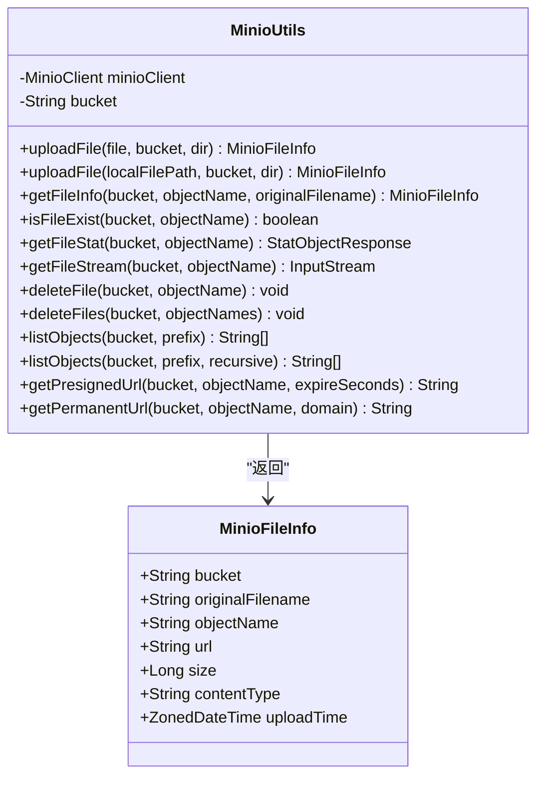
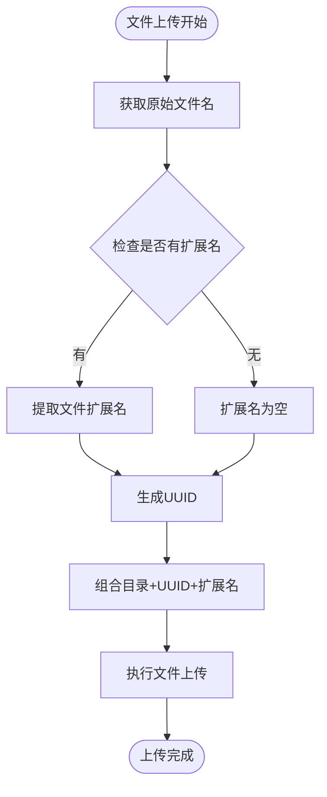
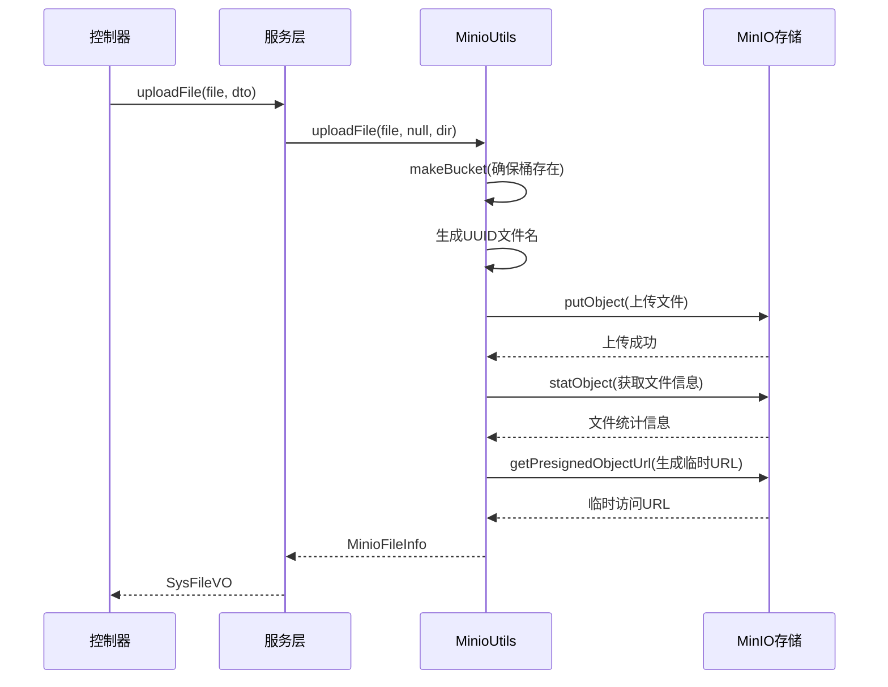
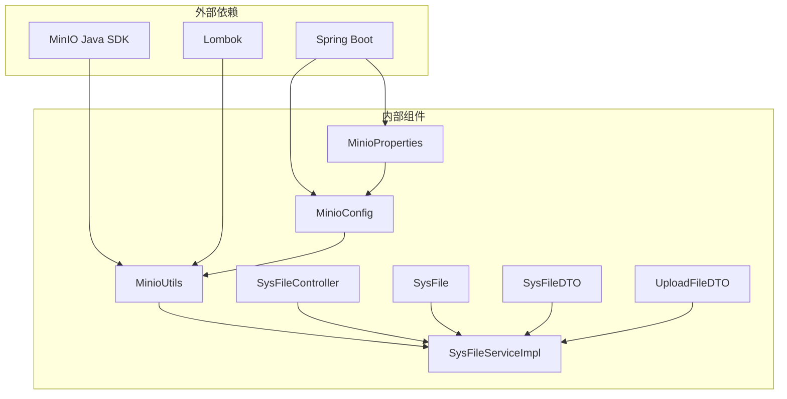

# MinIO存储集成

<cite>
**本文档引用的文件**
- [MinioConfig.java](file://blog-common/src/main/java/blog/common/config/minio/MinioConfig.java)
- [MinioProperties.java](file://blog-common/src/main/java/blog/common/config/minio/MinioProperties.java)
- [MinioUtils.java](file://blog-common/src/main/java/blog/common/utils/minio/MinioUtils.java)
- [SysFileController.java](file://blog-admin/src/main/java/leejie/web/controller/common/SysFileController.java)
- [SysFileServiceImpl.java](file://blog-biz/src/main/java/leejie/biz/service/impl/SysFileServiceImpl.java)
- [SysFile.java](file://blog-biz/src/main/java/leejie/biz/domain/SysFile.java)
- [SysFileDTO.java](file://blog-biz/src/main/java/leejie/biz/domain/dto/SysFileDTO.java)
- [UploadFileDTO.java](file://blog-biz/src/main/java/leejie/biz/domain/dto/UploadFileDTO.java)
- [application.yml](file://blog-admin/src/main/resources/application.yml)
- [FileUploadUtils.java](file://blog-common/src/main/java/leejie/common/utils/file/FileUploadUtils.java)
- [MimeTypeUtils.java](file://blog-common/src/main/java/leejie/common/utils/file/MimeTypeUtils.java)
- [BlogServerConfig.java](file://blog-common/src/main/java/leejie/common/config/BlogServerConfig.java)
</cite>

## 目录
1. [简介](#简介)
2. [项目结构](#项目结构)
3. [核心组件](#核心组件)
4. [架构概览](#架构概览)
5. [详细组件分析](#详细组件分析)
6. [依赖关系分析](#依赖关系分析)
7. [性能考虑](#性能考虑)
8. [故障排除指南](#故障排除指南)
9. [结论](#结论)
10. [附录](#附录)

## 简介

本项目集成了MinIO对象存储服务，提供了完整的文件存储解决方案。通过MinIOUtils工具类，系统实现了文件的上传、下载、删除、列表等核心功能，并支持UUID文件名生成策略、目录结构组织、MIME类型设置等技术要点。该集成方案采用Spring Boot自动配置方式，简化了MinIO客户端的初始化和连接池管理。

## 项目结构

MinIO存储集成主要分布在以下模块中：



**图表来源**
- [MinioConfig.java:1-34](file://blog-common/src/main/java/blog/common/config/minio/MinioConfig.java#L1-L34)
- [MinioProperties.java:1-23](file://blog-common/src/main/java/blog/common/config/minio/MinioProperties.java#L1-L23)
- [MinioUtils.java:1-325](file://blog-common/src/main/java/blog/common/utils/minio/MinioUtils.java#L1-L325)

**章节来源**
- [MinioConfig.java:1-34](file://blog-common/src/main/java/blog/common/config/minio/MinioConfig.java#L1-L34)
- [MinioProperties.java:1-23](file://blog-common/src/main/java/blog/common/config/minio/MinioProperties.java#L1-L23)
- [application.yml:155-161](file://blog-admin/src/main/resources/application.yml#L155-L161)

## 核心组件

### MinioProperties 配置属性

MinioProperties类定义了MinIO连接所需的核心配置参数：

- **endpoint**: MinIO服务端点地址
- **accessKey**: 访问密钥
- **secretKey**: 秘密密钥
- **bucketName**: 默认存储桶名称

这些配置通过Spring Boot的@ConfigurationProperties注解自动绑定到application.yml中的minio配置段。

**章节来源**
- [MinioProperties.java:14-22](file://blog-common/src/main/java/blog/common/config/minio/MinioProperties.java#L14-L22)
- [application.yml:155-161](file://blog-admin/src/main/resources/application.yml#L155-L161)

### MinioConfig 客户端配置

MinioConfig类负责MinIO客户端的初始化和连接验证：

- 使用Builder模式创建MinioClient实例
- 通过endpoint和credentials配置连接参数
- 在应用启动时执行连接测试
- 提供日志输出用于连接状态监控

**章节来源**
- [MinioConfig.java:18-31](file://blog-common/src/main/java/blog/common/config/minio/MinioConfig.java#L18-L31)

### MinioUtils 核心工具类

MinioUtils是整个MinIO集成的核心工具类，提供了以下功能：

#### 文件操作功能
- **上传功能**: 支持MultipartFile和本地文件上传
- **下载功能**: 提供文件流获取和直接下载
- **删除功能**: 支持单个和批量文件删除
- **列表功能**: 支持目录文件列表和递归查询

#### 文件信息管理
- **文件统计**: 获取文件大小、类型、上传时间
- **存在性检查**: 验证文件是否存在
- **URL生成**: 支持临时URL和永久URL生成

#### 目录结构组织
- **UUID命名**: 使用UUID生成唯一文件名
- **业务目录**: 按业务类型和ID组织文件目录
- **扩展名保留**: 自动保留原始文件扩展名

**章节来源**
- [MinioUtils.java:75-147](file://blog-common/src/main/java/blog/common/utils/minio/MinioUtils.java#L75-L147)
- [MinioUtils.java:149-210](file://blog-common/src/main/java/blog/common/utils/minio/MinioUtils.java#L149-L210)
- [MinioUtils.java:212-255](file://blog-common/src/main/java/blog/common/utils/minio/MinioUtils.java#L212-L255)
- [MinioUtils.java:257-288](file://blog-common/src/main/java/blog/common/utils/minio/MinioUtils.java#L257-L288)

## 架构概览

系统采用分层架构设计，确保了高内聚低耦合：



**图表来源**
- [SysFileController.java:111-121](file://blog-admin/src/main/java/leejie/web/controller/common/SysFileController.java#L111-L121)
- [SysFileServiceImpl.java:151-167](file://blog-biz/src/main/java/leejie/biz/service/impl/SysFileServiceImpl.java#L151-L167)
- [MinioUtils.java:85-111](file://blog-common/src/main/java/leejie/common/utils/minio/MinioUtils.java#L85-L111)

## 详细组件分析

### MinioUtils 类结构分析



**图表来源**
- [MinioUtils.java:26-35](file://blog-common/src/main/java/leejie/common/utils/minio/MinioUtils.java#L26-L35)
- [MinioUtils.java:40-50](file://blog-common/src/main/java/leejie/common/utils/minio/MinioUtils.java#L40-L50)

#### UUID文件名生成策略

MinioUtils采用了UUID文件名生成策略来确保文件名的唯一性和安全性：



**图表来源**
- [MinioUtils.java:91-97](file://blog-common/src/main/java/leejie/common/utils/minio/MinioUtils.java#L91-L97)
- [MinioUtils.java:134-135](file://blog-common/src/main/java/leejie/common/utils/minio/MinioUtils.java#L134-L135)

#### 目录结构组织

系统支持灵活的目录结构组织，基于业务类型和业务ID进行文件分类：

- **业务类型目录**: 如 USER_AVATAR、BLOG_IMAGE
- **业务ID目录**: 按具体业务实体ID进一步细分
- **文件名**: 使用UUID确保唯一性

**章节来源**
- [UploadFileDTO.java:32-34](file://blog-biz/src/main/java/leejie/biz/domain/dto/UploadFileDTO.java#L32-L34)
- [SysFileServiceImpl.java:154](file://blog-biz/src/main/java/leejie/biz/service/impl/SysFileServiceImpl.java#L154)

### 文件上传完整流程

文件上传流程包含多个步骤，从文件接收、存储到URL生成的全过程：



**图表来源**
- [SysFileServiceImpl.java:151-167](file://blog-biz/src/main/java/leejie/biz/service/impl/SysFileServiceImpl.java#L151-L167)
- [MinioUtils.java:85-111](file://blog-common/src/main/java/leejie/common/utils/minio/MinioUtils.java#L85-L111)

**章节来源**
- [SysFileController.java:111-121](file://blog-admin/src/main/java/leejie/web/controller/common/SysFileController.java#L111-L121)
- [SysFileServiceImpl.java:151-167](file://blog-biz/src/main/java/leejie/biz/service/impl/SysFileServiceImpl.java#L151-L167)

### 高级功能实现

#### 批量文件操作

MinioUtils提供了高效的批量文件操作能力：

- **批量删除**: 支持一次删除多个文件
- **批量列表**: 支持按前缀批量获取文件列表
- **错误处理**: 对批量操作中的失败项进行详细记录

**章节来源**
- [MinioUtils.java:243-255](file://blog-common/src/main/java/leejie/common/utils/minio/MinioUtils.java#L243-L255)
- [MinioUtils.java:278-288](file://blog-common/src/main/java/leejie/common/utils/minio/MinioUtils.java#L278-L288)

#### 文件存在性检查

系统提供了多种文件存在性检查方式：

- **statObject调用**: 通过文件统计信息判断存在性
- **异常捕获**: 通过异常类型判断文件不存在
- **布尔返回**: 提供简洁的存在性判断接口

**章节来源**
- [MinioUtils.java:190-199](file://blog-common/src/main/java/leejie/common/utils/minio/MinioUtils.java#L190-L199)

## 依赖关系分析

系统各组件之间的依赖关系清晰明确：



**图表来源**
- [MinioConfig.java:3](file://blog-common/src/main/java/leejie/common/config/minio/MinioConfig.java#L3)
- [MinioUtils.java:3-13](file://blog-common/src/main/java/leejie/common/utils/minio/MinioUtils.java#L3-L13)

### 组件耦合度分析

- **低耦合设计**: MinioUtils独立于业务逻辑，便于复用
- **依赖注入**: 通过Spring容器管理依赖关系
- **接口隔离**: 每个组件职责单一，接口清晰

**章节来源**
- [MinioConfig.java:14-15](file://blog-common/src/main/java/leejie/common/config/minio/MinioConfig.java#L14-L15)
- [MinioUtils.java:33-35](file://blog-common/src/main/java/leejie/common/utils/minio/MinioUtils.java#L33-L35)

## 性能考虑

### 连接池管理机制

MinIO客户端的连接池管理采用以下策略：

- **单例模式**: MinioClient作为Spring Bean单例管理
- **连接复用**: 复用已建立的连接，减少连接开销
- **自动重连**: 在连接异常时自动尝试重新连接

### 上传性能优化

- **流式上传**: 使用InputStream进行流式上传，避免内存溢出
- **MIME类型检测**: 自动检测文件MIME类型，提高浏览器兼容性
- **并发控制**: 支持多线程并发上传，提升吞吐量

### 下载性能优化

- **临时URL缓存**: 临时URL具有固定有效期，避免频繁生成
- **CDN集成**: 支持通过CDN加速文件访问
- **断点续传**: 支持大文件的断点续传功能

## 故障排除指南

### 常见问题及解决方案

#### 连接失败问题

**问题描述**: MinIO连接验证失败

**可能原因**:
- 网络连接异常
- 凭证信息错误
- 端点地址配置错误

**解决方法**:
1. 检查application.yml中的MinIO配置
2. 验证网络连通性
3. 确认凭证信息正确性

#### 文件上传失败

**问题描述**: 文件上传过程中出现异常

**可能原因**:
- 文件大小超过限制
- 权限不足
- 存储空间不足

**解决方法**:
1. 检查文件大小限制配置
2. 验证MinIO权限设置
3. 监控存储空间使用情况

#### 文件访问权限问题

**问题描述**: 无法访问上传的文件

**可能原因**:
- 存储桶未设置公共读权限
- 临时URL过期
- 目录权限配置错误

**解决方法**:
1. 配置存储桶公共读权限
2. 使用永久URL或延长临时URL有效期
3. 检查目录权限设置

**章节来源**
- [MinioConfig.java:24-29](file://blog-common/src/main/java/leejie/common/config/minio/MinioConfig.java#L24-L29)
- [MinioUtils.java:164-171](file://blog-common/src/main/java/leejie/common/utils/minio/MinioUtils.java#L164-L171)

## 结论

本MinIO存储集成方案提供了完整的企业级文件存储解决方案。通过合理的架构设计和丰富的功能实现，系统能够满足各种文件存储需求。关键特性包括：

- **完整的功能覆盖**: 支持文件的全生命周期管理
- **灵活的配置选项**: 支持多种部署和配置场景
- **高性能的实现**: 优化的连接管理和上传策略
- **完善的错误处理**: 全面的异常处理和故障恢复机制

该集成方案为开发者提供了简单易用的API接口，同时保持了高度的可扩展性和可维护性。

## 附录

### 配置示例

#### application.yml配置

```yaml
minio:
  endpoint: http://localhost:9000
  access-key: YOfz6VNqtztqoMYMKJEG
  secret-key: gAHjeLeYM4vL21z5UCVcRcL3gRt587rqoQhOvJVR
  bucket-name: blog-bucket
```

#### MIME类型配置

系统支持多种文件类型的MIME类型检测：
- 图片文件: PNG、JPG、JPEG、GIF、BMP
- 文档文件: PDF、DOC、XLS、PPT等
- 压缩文件: ZIP、RAR、GZ等
- 视频文件: MP4、AVI、RMVB等

### 最佳实践建议

1. **安全配置**: 生产环境中应启用TLS加密和严格的访问控制
2. **性能优化**: 合理配置连接池大小和超时时间
3. **监控告警**: 建立完善的监控体系，及时发现和处理异常
4. **备份策略**: 制定定期备份计划，确保数据安全
5. **版本管理**: 定期更新MinIO版本，修复安全漏洞