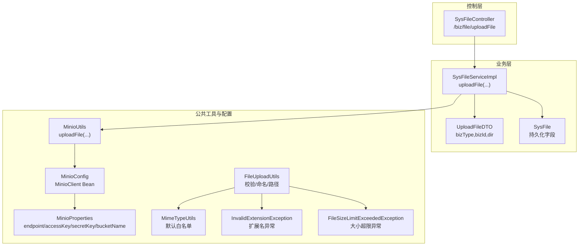
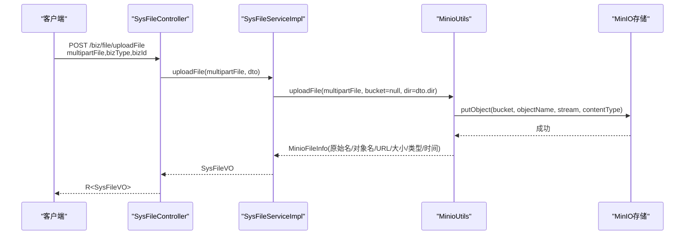
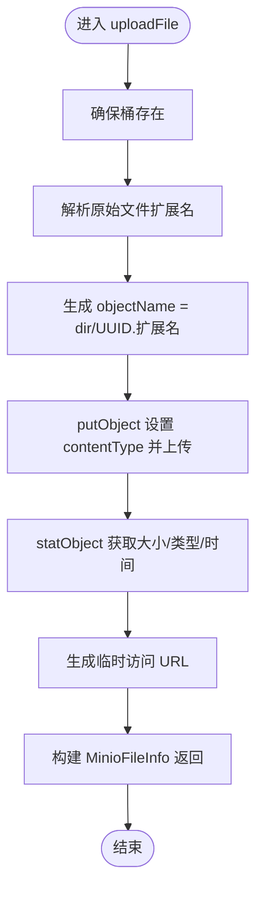
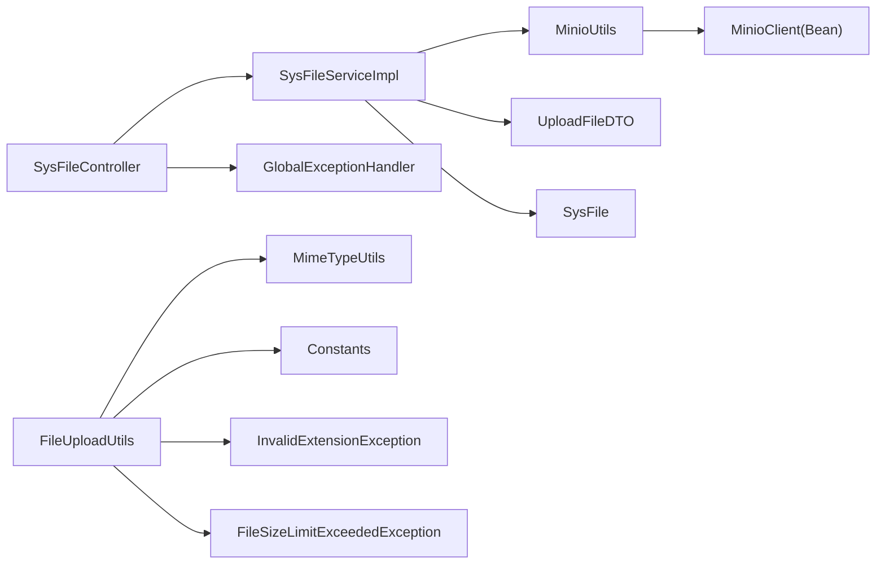

# 文件上传处理

<cite>
**本文引用的文件**
- [SysFileController.java](file://blog-admin/src/main/java/blog/web/controller/common/SysFileController.java)
- [SysFileServiceImpl.java](file://blog-biz/src/main/java/blog/biz/service/impl/SysFileServiceImpl.java)
- [UploadFileDTO.java](file://blog-biz/src/main/java/blog/biz/domain/dto/UploadFileDTO.java)
- [SysFile.java](file://blog-biz/src/main/java/blog/biz/domain/SysFile.java)
- [MinioUtils.java](file://blog-common/src/main/java/blog/common/utils/minio/MinioUtils.java)
- [MinioConfig.java](file://blog-common/src/main/java/blog/common/config/minio/MinioConfig.java)
- [MinioProperties.java](file://blog-common/src/main/java/blog/common/config/minio/MinioProperties.java)
- [FileUploadUtils.java](file://blog-common/src/main/java/blog/common/utils/file/FileUploadUtils.java)
- [MimeTypeUtils.java](file://blog-common/src/main/java/blog/common/utils/file/MimeTypeUtils.java)
- [FileTypeUtils.java](file://blog-common/src/main/java/blog/common/utils/file/FileTypeUtils.java)
- [InvalidExtensionException.java](file://blog-common/src/main/java/blog/common/exception/file/InvalidExtensionException.java)
- [FileSizeLimitExceededException.java](file://blog-common/src/main/java/blog/common/exception/file/FileSizeLimitExceededException.java)
- [FileUploadException.java](file://blog-common/src/main/java/blog/common/exception/file/FileUploadException.java)
- [GlobalExceptionHandler.java](file://blog-framework/src/main/java/blog/framework/web/exception/GlobalExceptionHandler.java)
- [Constants.java](file://blog-common/src/main/java/blog/common/constant/Constants.java)
</cite>

## 目录
1. [简介](#简介)
2. [项目结构](#项目结构)
3. [核心组件](#核心组件)
4. [架构总览](#架构总览)
5. [详细组件分析](#详细组件分析)
6. [依赖分析](#依赖分析)
7. [性能考虑](#性能考虑)
8. [故障排查指南](#故障排查指南)
9. [结论](#结论)
10. [附录](#附录)

## 简介
本文件围绕“文件上传处理”功能，系统性梳理从接口到存储的完整链路，重点覆盖以下方面：
- 接收与绑定：基于 MultipartFile 的单文件上传入口
- 校验与安全：文件类型白名单、大小限制、扩展名校验
- 存储与命名：MinIO 上传、UUID 文件名生成、目录结构组织、MIME 类型设置
- 控制器与服务：接口设计、业务编排、异常处理与统一返回
- 安全策略：权限控制、最小暴露原则、临时访问链接
- API 文档与使用示例：便于开发者快速集成

## 项目结构
文件上传相关代码分布于三个模块：
- 控制层：负责接口定义与参数校验
- 业务层：负责业务编排与领域模型转换
- 公共工具与配置：负责文件校验、MinIO 客户端配置与工具方法

图表来源
- [SysFileController.java:111-121](file://blog-admin/src/main/java/blog/web/controller/common/SysFileController.java#L111-L121)
- [SysFileServiceImpl.java:151-167](file://blog-biz/src/main/java/blog/biz/service/impl/SysFileServiceImpl.java#L151-L167)
- [MinioUtils.java:85-111](file://blog-common/src/main/java/blog/common/utils/minio/MinioUtils.java#L85-L111)
- [MinioConfig.java:17-31](file://blog-common/src/main/java/blog/common/config/minio/MinioConfig.java#L17-L31)
- [MinioProperties.java:11-22](file://blog-common/src/main/java/blog/common/config/minio/MinioProperties.java#L11-L22)
- [FileUploadUtils.java:92-126](file://blog-common/src/main/java/blog/common/utils/file/FileUploadUtils.java#L92-L126)
- [MimeTypeUtils.java:28-38](file://blog-common/src/main/java/blog/common/utils/file/MimeTypeUtils.java#L28-L38)

章节来源
- [SysFileController.java:111-121](file://blog-admin/src/main/java/blog/web/controller/common/SysFileController.java#L111-L121)
- [SysFileServiceImpl.java:151-167](file://blog-biz/src/main/java/blog/biz/service/impl/SysFileServiceImpl.java#L151-L167)
- [MinioUtils.java:85-111](file://blog-common/src/main/java/blog/common/utils/minio/MinioUtils.java#L85-L111)
- [MinioConfig.java:17-31](file://blog-common/src/main/java/blog/common/config/minio/MinioConfig.java#L17-L31)
- [MinioProperties.java:11-22](file://blog-common/src/main/java/blog/common/config/minio/MinioProperties.java#L11-L22)
- [FileUploadUtils.java:92-126](file://blog-common/src/main/java/blog/common/utils/file/FileUploadUtils.java#L92-L126)
- [MimeTypeUtils.java:28-38](file://blog-common/src/main/java/blog/common/utils/file/MimeTypeUtils.java#L28-L38)

## 核心组件
- 控制器接口：提供单文件上传入口，接收 MultipartFile、业务类型与业务 ID，并通过服务层完成上传与落库
- 业务服务：组装目录结构，调用 MinIO 工具上传，构建返回 VO
- MinIO 工具：封装上传、信息查询、URL 生成、删除等能力
- 文件校验工具：默认大小限制、文件名长度限制、扩展名校验
- 异常体系：扩展名不合法、大小超限、通用上传异常
- 全局异常处理：统一拦截并返回标准响应

章节来源
- [SysFileController.java:111-121](file://blog-admin/src/main/java/blog/web/controller/common/SysFileController.java#L111-L121)
- [SysFileServiceImpl.java:151-167](file://blog-biz/src/main/java/blog/biz/service/impl/SysFileServiceImpl.java#L151-L167)
- [MinioUtils.java:85-111](file://blog-common/src/main/java/blog/common/utils/minio/MinioUtils.java#L85-L111)
- [FileUploadUtils.java:92-126](file://blog-common/src/main/java/blog/common/utils/file/FileUploadUtils.java#L92-L126)
- [InvalidExtensionException.java:17-22](file://blog-common/src/main/java/blog/common/exception/file/InvalidExtensionException.java#L17-L22)
- [FileSizeLimitExceededException.java:11-13](file://blog-common/src/main/java/blog/common/exception/file/FileSizeLimitExceededException.java#L11-L13)
- [GlobalExceptionHandler.java:89-104](file://blog-framework/src/main/java/blog/framework/web/exception/GlobalExceptionHandler.java#L89-L104)

## 架构总览
文件上传整体流程如下：
- 控制器接收请求，参数校验（空值、长度）
- 业务层根据 bizType 与 bizId 组织目录路径
- MinIO 工具上传文件，生成 UUID 文件名，保留原始扩展名
- 返回包含文件名、类型、大小、URL、时间等信息的 VO

图表来源
- [SysFileController.java:111-121](file://blog-admin/src/main/java/blog/web/controller/common/SysFileController.java#L111-L121)
- [SysFileServiceImpl.java:151-167](file://blog-biz/src/main/java/blog/biz/service/impl/SysFileServiceImpl.java#L151-L167)
- [MinioUtils.java:85-111](file://blog-common/src/main/java/blog/common/utils/minio/MinioUtils.java#L85-L111)

## 详细组件分析

### 控制器：SysFileController
- 接口路径：POST /biz/file/uploadFile
- 参数：
  - file：MultipartFile，必填
  - bizType：业务类型，必填
  - bizId：业务 ID，必填
- 权限注解：@PreAuthorize 控制访问
- 日志注解：@Log 记录上传行为
- 返回：R<SysFileVO>，统一响应包装

章节来源
- [SysFileController.java:111-121](file://blog-admin/src/main/java/blog/web/controller/common/SysFileController.java#L111-L121)

### 业务服务：SysFileServiceImpl
- 核心方法：uploadFile(MultipartFile, UploadFileDTO)
- 目录组织：UploadFileDTO.getDir() = bizType/bizId
- MinIO 上传：调用 MinioUtils.uploadFile(file, bucket=null, dir)
- 返回：SysFileVO，包含文件名、类型、大小、桶名、对象名、URL、上传时间

章节来源
- [SysFileServiceImpl.java:151-167](file://blog-biz/src/main/java/blog/biz/service/impl/SysFileServiceImpl.java#L151-L167)
- [UploadFileDTO.java:32-34](file://blog-biz/src/main/java/blog/biz/domain/dto/UploadFileDTO.java#L32-L34)

### 数据模型：SysFile
- 字段覆盖：原始文件名、后缀、类型、大小、桶名、对象名、URL、业务类型/ID、公开状态、创建人与时间等
- 用于持久化与查询展示

章节来源
- [SysFile.java:20-95](file://blog-biz/src/main/java/blog/biz/domain/SysFile.java#L20-L95)

### MinIO 工具：MinioUtils.uploadFile
- 功能点：
  - 自动创建桶（若不存在）
  - 生成 UUID 文件名并保留原始扩展名
  - 使用 MultipartFile 的 contentType 设置 MIME 类型
  - 返回 MinioFileInfo，包含对象名、URL、大小、类型、上传时间
- 关键实现位置：
  - 上传入口与目录拼接：[MinioUtils.java:85-111](file://blog-common/src/main/java/blog/common/utils/minio/MinioUtils.java#L85-L111)
  - UUID 生成与扩展名保留：[MinioUtils.java:97](file://blog-common/src/main/java/blog/common/utils/minio/MinioUtils.java#L97)
  - MIME 类型设置：[MinioUtils.java:105](file://blog-common/src/main/java/blog/common/utils/minio/MinioUtils.java#L105)
  - 信息查询与 URL 生成：[MinioUtils.java:159-182](file://blog-common/src/main/java/blog/common/utils/minio/MinioUtils.java#L159-L182)

图表来源
- [MinioUtils.java:85-111](file://blog-common/src/main/java/blog/common/utils/minio/MinioUtils.java#L85-L111)
- [MinioUtils.java:159-182](file://blog-common/src/main/java/blog/common/utils/minio/MinioUtils.java#L159-L182)

章节来源
- [MinioUtils.java:85-111](file://blog-common/src/main/java/blog/common/utils/minio/MinioUtils.java#L85-L111)
- [MinioUtils.java:159-182](file://blog-common/src/main/java/blog/common/utils/minio/MinioUtils.java#L159-L182)

### 文件校验与安全
- 默认大小限制：50MB（常量 DEFAULT_MAX_SIZE）
- 文件名长度限制：100
- 扩展名校验：基于 MimeTypeUtils.DEFAULT_ALLOWED_EXTENSION 白名单
- 校验入口：
  - 校验与转移：[FileUploadUtils.java:92-126](file://blog-common/src/main/java/blog/common/utils/file/FileUploadUtils.java#L92-L126)
  - 大小与扩展名校验：[FileUploadUtils.java:167-193](file://blog-common/src/main/java/blog/common/utils/file/FileUploadUtils.java#L167-L193)
  - 默认白名单：[MimeTypeUtils.java:28-38](file://blog-common/src/main/java/blog/common/utils/file/MimeTypeUtils.java#L28-L38)
- 异常类型：
  - 扩展名不合法：InvalidExtensionException
  - 大小超限：FileSizeLimitExceededException
  - 通用上传异常：FileUploadException

章节来源
- [FileUploadUtils.java:27-47](file://blog-common/src/main/java/blog/common/utils/file/FileUploadUtils.java#L27-L47)
- [FileUploadUtils.java:167-193](file://blog-common/src/main/java/blog/common/utils/file/FileUploadUtils.java#L167-L193)
- [MimeTypeUtils.java:28-38](file://blog-common/src/main/java/blog/common/utils/file/MimeTypeUtils.java#L28-L38)
- [InvalidExtensionException.java:17-22](file://blog-common/src/main/java/blog/common/exception/file/InvalidExtensionException.java#L17-L22)
- [FileSizeLimitExceededException.java:11-13](file://blog-common/src/main/java/blog/common/exception/file/FileSizeLimitExceededException.java#L11-L13)

### MinIO 客户端配置
- 配置类：MinioConfig，创建 MinioClient Bean
- 属性类：MinioProperties，读取 endpoint、accessKey、secretKey、bucketName
- 连接验证：启动时调用 listBuckets 校验连通性

章节来源
- [MinioConfig.java:17-31](file://blog-common/src/main/java/blog/common/config/minio/MinioConfig.java#L17-L31)
- [MinioProperties.java:11-22](file://blog-common/src/main/java/blog/common/config/minio/MinioProperties.java#L11-L22)

### 异常处理与统一返回
- 控制器抛出的运行时异常由全局异常处理器捕获
- 全局异常处理：
  - AccessDeniedException：权限不足
  - RuntimeException：未知运行时异常
  - ServiceException：业务异常
  - 参数校验异常：BindException、MethodArgumentNotValidException 等
- 返回格式：Result/R 包装，包含状态码与消息

章节来源
- [GlobalExceptionHandler.java:34-104](file://blog-framework/src/main/java/blog/framework/web/exception/GlobalExceptionHandler.java#L34-L104)

## 依赖分析
- 控制器依赖业务服务
- 业务服务依赖 MinIO 工具
- MinIO 工具依赖 MinioClient Bean
- 文件校验工具依赖 MimeTypeUtils 与常量定义
- 异常体系与全局异常处理共同保证错误响应一致性

图表来源
- [SysFileController.java:111-121](file://blog-admin/src/main/java/blog/web/controller/common/SysFileController.java#L111-L121)
- [SysFileServiceImpl.java:151-167](file://blog-biz/src/main/java/blog/biz/service/impl/SysFileServiceImpl.java#L151-L167)
- [MinioUtils.java:85-111](file://blog-common/src/main/java/blog/common/utils/minio/MinioUtils.java#L85-L111)
- [MinioConfig.java:17-31](file://blog-common/src/main/java/blog/common/config/minio/MinioConfig.java#L17-L31)
- [FileUploadUtils.java:92-126](file://blog-common/src/main/java/blog/common/utils/file/FileUploadUtils.java#L92-L126)
- [MimeTypeUtils.java:28-38](file://blog-common/src/main/java/blog/common/utils/file/MimeTypeUtils.java#L28-L38)
- [Constants.java:140-141](file://blog-common/src/main/java/blog/common/constant/Constants.java#L140-L141)
- [GlobalExceptionHandler.java:89-104](file://blog-framework/src/main/java/blog/framework/web/exception/GlobalExceptionHandler.java#L89-L104)

## 性能考虑
- 流式上传：MinIO 工具使用 InputStream 与固定大小参数，避免一次性加载至内存
- 临时 URL：默认 24 小时过期，降低长期暴露风险
- 目录结构：按 bizType/bizId 组织，便于后续清理与管理
- 扩展名校验：在上传前完成，减少无效 IO

[本节为通用建议，无需列出具体文件来源]

## 故障排查指南
- 无法连接 MinIO：检查 MinioProperties 配置项与网络连通性；查看 MinioConfig 初始化日志
- 上传失败：确认桶存在且具备写入权限；检查文件大小与扩展名是否符合白名单
- 权限不足：确认接口权限注解与用户权限配置
- 参数缺失：检查 bizType、bizId、file 是否正确传递
- 统一错误响应：参考全局异常处理器的错误码与消息格式

章节来源
- [MinioConfig.java:23-30](file://blog-common/src/main/java/blog/common/config/minio/MinioConfig.java#L23-L30)
- [MinioProperties.java:14-20](file://blog-common/src/main/java/blog/common/config/minio/MinioProperties.java#L14-L20)
- [GlobalExceptionHandler.java:34-104](file://blog-framework/src/main/java/blog/framework/web/exception/GlobalExceptionHandler.java#L34-L104)

## 结论
该文件上传方案采用“控制器 + 业务服务 + MinIO 工具”的清晰分层，结合默认大小与扩展名校验、UUID 命名与目录组织、以及统一异常处理，形成一套可维护、可扩展、可审计的上传能力。开发者可直接复用现有接口与工具，快速集成各类业务场景。

[本节为总结性内容，无需列出具体文件来源]

## 附录

### API 接口文档
- 接口名称：单文件上传
- 请求地址：POST /biz/file/uploadFile
- 权限要求：具备 biz:file:add 或相应权限
- 请求参数：
  - multipartFile：文件（必填）
  - bizType：业务类型（必填，如 USER_AVATAR、BLOG_IMAGE）
  - bizId：业务 ID（必填，如用户 ID、文章 ID）
- 返回数据：
  - fileName：原始文件名
  - contentType：MIME 类型
  - fileSize：文件大小（字节）
  - bucketName：桶名
  - objectName：对象路径
  - fileUrl：访问 URL（默认临时链接）
  - createdTime：上传时间
- 错误响应：
  - 参数缺失或非法：统一由全局异常处理器返回
  - 权限不足：返回 403
  - 业务异常：返回对应错误码与消息

章节来源
- [SysFileController.java:111-121](file://blog-admin/src/main/java/blog/web/controller/common/SysFileController.java#L111-L121)
- [SysFileServiceImpl.java:151-167](file://blog-biz/src/main/java/blog/biz/service/impl/SysFileServiceImpl.java#L151-L167)
- [GlobalExceptionHandler.java:34-104](file://blog-framework/src/main/java/blog/framework/web/exception/GlobalExceptionHandler.java#L34-L104)

### 使用示例（步骤说明）
- 准备参数：选择文件、准备 bizType 与 bizId
- 发起请求：POST /biz/file/uploadFile，携带 multipartFile、bizType、bizId
- 处理响应：解析 R<SysFileVO>，记录 fileUrl 与 objectName
- 后续：将 objectName 与业务实体关联，必要时转为永久 URL 或公开访问

章节来源
- [SysFileController.java:111-121](file://blog-admin/src/main/java/blog/web/controller/common/SysFileController.java#L111-L121)
- [SysFileServiceImpl.java:151-167](file://blog-biz/src/main/java/blog/biz/service/impl/SysFileServiceImpl.java#L151-L167)
- [MinioUtils.java:164-171](file://blog-common/src/main/java/blog/common/utils/minio/MinioUtils.java#L164-L171)