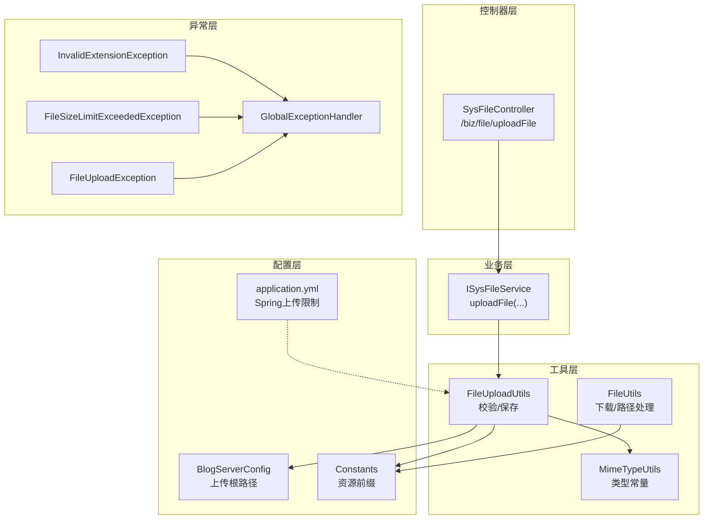
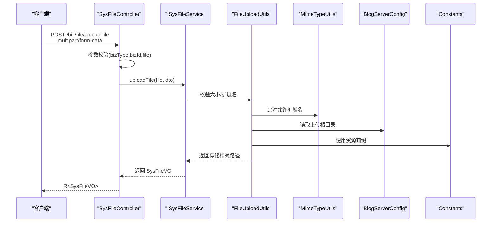
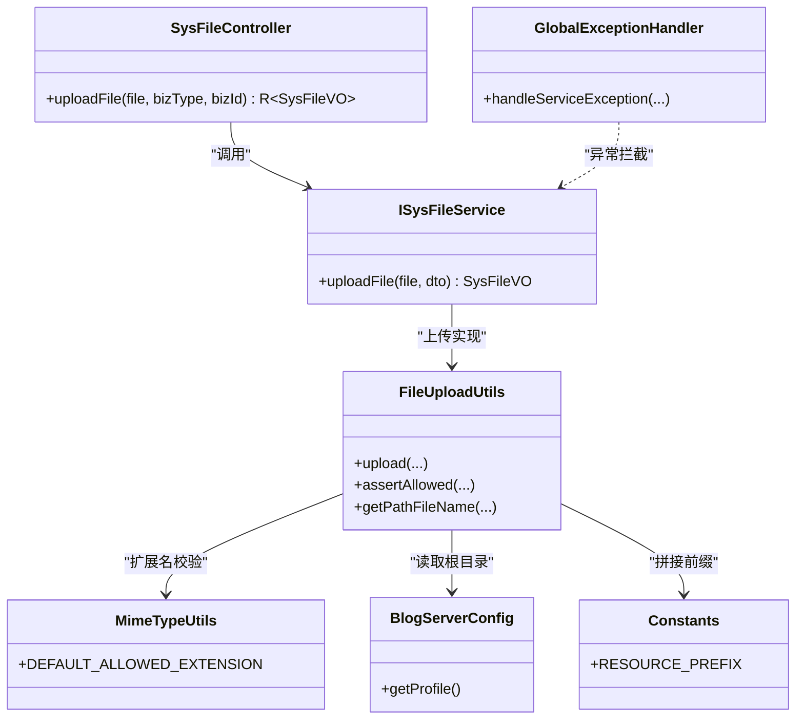

# 文件上传控制器

<cite>
**本文引用的文件**
- [SysFileController.java](file://blog-admin/src/main/java/blog/web/controller/common/SysFileController.java)
- [ISysFileService.java](file://blog-biz/src/main/java/blog/biz/service/ISysFileService.java)
- [UploadFileDTO.java](file://blog-biz/src/main/java/blog/biz/domain/dto/UploadFileDTO.java)
- [FileUploadUtils.java](file://blog-common/src/main/java/blog/common/utils/file/FileUploadUtils.java)
- [MimeTypeUtils.java](file://blog-common/src/main/java/blog/common/utils/file/MimeTypeUtils.java)
- [FileUtils.java](file://blog-common/src/main/java/blog/common/utils/file/FileUtils.java)
- [FileUploadException.java](file://blog-common/src/main/java/blog/common/exception/file/FileUploadException.java)
- [InvalidExtensionException.java](file://blog-common/src/main/java/blog/common/exception/file/InvalidExtensionException.java)
- [FileSizeLimitExceededException.java](file://blog-common/src/main/java/blog/common/exception/file/FileSizeLimitExceededException.java)
- [GlobalExceptionHandler.java](file://blog-framework/src/main/java/blog/framework/web/exception/GlobalExceptionHandler.java)
- [BlogServerConfig.java](file://blog-common/src/main/java/blog/common/config/BlogServerConfig.java)
- [Constants.java](file://blog-common/src/main/java/blog/common/constant/Constants.java)
- [application.yml](file://blog-admin/src/main/resources/application.yml)
</cite>

## 目录
1. [简介](#简介)
2. [项目结构](#项目结构)
3. [核心组件](#核心组件)
4. [架构总览](#架构总览)
5. [详细组件分析](#详细组件分析)
6. [依赖关系分析](#依赖关系分析)
7. [性能与配置](#性能与配置)
8. [故障排查指南](#故障排查指南)
9. [结论](#结论)
10. [附录：API 接口文档](#附录api-接口文档)

## 简介
本文面向开发者，系统性梳理并讲解文件上传控制器 SysFileController 的实现与使用，覆盖以下要点：
- 单文件上传接口的请求处理流程、参数绑定与校验
- 文件大小限制、文件类型限制、存储路径策略
- 异常处理机制与统一错误响应格式
- 完整的 API 接口文档（请求示例、参数说明、响应格式、错误码）

## 项目结构
围绕文件上传功能的关键代码分布在如下模块与文件中：
- 控制器层：SysFileController 提供上传入口
- 业务层：ISysFileService 定义上传契约
- 工具层：FileUploadUtils、MimeTypeUtils、FileUtils 提供上传与校验能力
- 配置层：application.yml、BlogServerConfig、Constants 提供上传路径与资源前缀
- 异常层：各类文件上传异常类
- 全局异常：GlobalExceptionHandler 统一拦截并返回标准响应

图表来源
- [SysFileController.java:111-121](file://blog-admin/src/main/java/blog/web/controller/common/SysFileController.java#L111-L121)
- [ISysFileService.java:73](file://blog-biz/src/main/java/blog/biz/service/ISysFileService.java#L73)
- [FileUploadUtils.java:92-126](file://blog-common/src/main/java/blog/common/utils/file/FileUploadUtils.java#L92-L126)
- [MimeTypeUtils.java:28-38](file://blog-common/src/main/java/blog/common/utils/file/MimeTypeUtils.java#L28-L38)
- [BlogServerConfig.java:68-118](file://blog-common/src/main/java/blog/common/config/BlogServerConfig.java#L68-L118)
- [Constants.java:141](file://blog-common/src/main/java/blog/common/constant/Constants.java#L141)
- [application.yml:52-58](file://blog-admin/src/main/resources/application.yml#L52-L58)
- [InvalidExtensionException.java:17-34](file://blog-common/src/main/java/blog/common/exception/file/InvalidExtensionException.java#L17-L34)
- [FileSizeLimitExceededException.java:11-13](file://blog-common/src/main/java/blog/common/exception/file/FileSizeLimitExceededException.java#L11-L13)
- [FileUploadException.java:25-28](file://blog-common/src/main/java/blog/common/exception/file/FileUploadException.java#L25-L28)
- [GlobalExceptionHandler.java:54-60](file://blog-framework/src/main/java/blog/framework/web/exception/GlobalExceptionHandler.java#L54-L60)

章节来源
- [SysFileController.java:111-121](file://blog-admin/src/main/java/blog/web/controller/common/SysFileController.java#L111-L121)
- [application.yml:52-58](file://blog-admin/src/main/resources/application.yml#L52-L58)

## 核心组件
- SysFileController.uploadFile：对外暴露的单文件上传接口，接收 MultipartFile 参数，绑定 bizType、bizId，并委托业务层完成上传。
- ISysFileService.uploadFile：业务契约，负责将文件持久化并返回 SysFileVO。
- FileUploadUtils：封装上传校验（大小、扩展名）、生成存储路径、落盘保存。
- MimeTypeUtils：定义默认允许的文件扩展名集合与分类扩展名集合。
- BlogServerConfig：提供上传根目录 profile，拼接最终访问路径。
- Constants：定义资源前缀 /profile，用于对外访问路径拼接。
- GlobalExceptionHandler：统一捕获业务异常并返回标准 Result。

章节来源
- [SysFileController.java:111-121](file://blog-admin/src/main/java/blog/web/controller/common/SysFileController.java#L111-L121)
- [ISysFileService.java:73](file://blog-biz/src/main/java/blog/biz/service/ISysFileService.java#L73)
- [FileUploadUtils.java:92-126](file://blog-common/src/main/java/blog/common/utils/file/FileUploadUtils.java#L92-L126)
- [MimeTypeUtils.java:28-38](file://blog-common/src/main/java/blog/common/utils/file/MimeTypeUtils.java#L28-L38)
- [BlogServerConfig.java:68-118](file://blog-common/src/main/java/blog/common/config/BlogServerConfig.java#L68-L118)
- [Constants.java:141](file://blog-common/src/main/java/blog/common/constant/Constants.java#L141)
- [GlobalExceptionHandler.java:54-60](file://blog-framework/src/main/java/blog/framework/web/exception/GlobalExceptionHandler.java#L54-L60)

## 架构总览
下图展示一次“单文件上传”的端到端调用链路，从控制器到业务层再到工具层与配置层：

图表来源
- [SysFileController.java:111-121](file://blog-admin/src/main/java/blog/web/controller/common/SysFileController.java#L111-L121)
- [ISysFileService.java:73](file://blog-biz/src/main/java/blog/biz/service/ISysFileService.java#L73)
- [FileUploadUtils.java:92-126](file://blog-common/src/main/java/blog/common/utils/file/FileUploadUtils.java#L92-L126)
- [MimeTypeUtils.java:28-38](file://blog-common/src/main/java/blog/common/utils/file/MimeTypeUtils.java#L28-L38)
- [BlogServerConfig.java:68-118](file://blog-common/src/main/java/blog/common/config/BlogServerConfig.java#L68-L118)
- [Constants.java:141](file://blog-common/src/main/java/blog/common/constant/Constants.java#L141)

## 详细组件分析

### 控制器：SysFileController.uploadFile
- 请求方法与路径：POST /biz/file/uploadFile
- 参数绑定：
  - file：MultipartFile，必填
  - bizType：String，必填，业务类型
  - bizId：String，必填，业务ID
- 参数校验：
  - 使用 @NotNull/@NotBlank 对 file、bizType、bizId 进行非空校验
- 处理流程：
  - 构造 UploadFileDTO（包含 bizType、bizId）
  - 调用 ISysFileService.uploadFile(file, dto)
  - 包装为 R<SysFileVO> 返回
- 权限控制：基于注解鉴权（需具备 biz:file:add 权限）

章节来源
- [SysFileController.java:111-121](file://blog-admin/src/main/java/blog/web/controller/common/SysFileController.java#L111-L121)

### 业务层：ISysFileService.uploadFile
- 方法签名：SysFileVO uploadFile(MultipartFile file, UploadFileDTO dto)
- 责任边界：将文件上传与业务元数据（bizType、bizId）关联，返回文件元信息 VO

章节来源
- [ISysFileService.java:73](file://blog-biz/src/main/java/blog/biz/service/ISysFileService.java#L73)

### DTO：UploadFileDTO
- 字段：
  - bizType：业务类型（如用户头像、文章图片）
  - bizId：业务ID（如用户ID、文章ID）
- 辅助方法：getDir() 返回目录路径 bizType/bizId

章节来源
- [UploadFileDTO.java:19-34](file://blog-biz/src/main/java/blog/biz/domain/dto/UploadFileDTO.java#L19-L34)

### 工具层：FileUploadUtils（上传核心）
- 默认限制：
  - 最大文件大小：50MB
  - 文件名最大长度：100
- 核心流程：
  - 校验文件名长度
  - 校验扩展名是否在允许集合内
  - 选择命名策略：日期目录+序列或日期目录+UUID
  - 生成绝对路径并 transferTo 写入磁盘
  - 返回对外可访问路径（拼接 Constants.RESOURCE_PREFIX）
- 关键点：
  - 支持传入 allowedExtension 自定义允许集合
  - 支持 useCustomNaming 使用 UUID 命名

章节来源
- [FileUploadUtils.java:27-47](file://blog-common/src/main/java/blog/common/utils/file/FileUploadUtils.java#L27-L47)
- [FileUploadUtils.java:92-126](file://blog-common/src/main/java/blog/common/utils/file/FileUploadUtils.java#L92-L126)
- [FileUploadUtils.java:167-193](file://blog-common/src/main/java/blog/common/utils/file/FileUploadUtils.java#L167-L193)
- [FileUploadUtils.java:217-223](file://blog-common/src/main/java/blog/common/utils/file/FileUploadUtils.java#L217-L223)

### 类型与扩展名：MimeTypeUtils
- 默认允许扩展名集合（DEFAULT_ALLOWED_EXTENSION）覆盖图片、办公文档、压缩包、视频、PDF 等
- 分类扩展名：IMAGE_EXTENSION、FLASH_EXTENSION、MEDIA_EXTENSION、VIDEO_EXTENSION

章节来源
- [MimeTypeUtils.java:28-38](file://blog-common/src/main/java/blog/common/utils/file/MimeTypeUtils.java#L28-L38)

### 配置与路径：BlogServerConfig、Constants
- BlogServerConfig.getProfile() 提供上传根目录
- Constants.RESOURCE_PREFIX 定义资源前缀 /profile
- 最终访问路径由工具层拼接返回

章节来源
- [BlogServerConfig.java:68-118](file://blog-common/src/main/java/blog/common/config/BlogServerConfig.java#L68-L118)
- [Constants.java:141](file://blog-common/src/main/java/blog/common/constant/Constants.java#L141)

### 异常处理：全局与专用异常
- 专用异常：
  - InvalidExtensionException：扩展名不合法
  - FileSizeLimitExceededException：超出大小限制
  - FileUploadException：通用文件上传异常
- 全局异常：
  - GlobalExceptionHandler 统一拦截 ServiceException 及其他运行时异常，返回标准 Result

章节来源
- [InvalidExtensionException.java:17-34](file://blog-common/src/main/java/blog/common/exception/file/InvalidExtensionException.java#L17-L34)
- [FileSizeLimitExceededException.java:11-13](file://blog-common/src/main/java/blog/common/exception/file/FileSizeLimitExceededException.java#L11-L13)
- [FileUploadException.java:25-28](file://blog-common/src/main/java/blog/common/exception/file/FileUploadException.java#L25-L28)
- [GlobalExceptionHandler.java:54-60](file://blog-framework/src/main/java/blog/framework/web/exception/GlobalExceptionHandler.java#L54-L60)

### 文件下载辅助：FileUtils
- 提供下载相关工具方法（设置响应头、百分号编码、剥离前缀等），便于后续文件预览/下载场景

章节来源
- [FileUtils.java:155-194](file://blog-common/src/main/java/blog/common/utils/file/FileUtils.java#L155-L194)
- [FileUtils.java:100-102](file://blog-common/src/main/java/blog/common/utils/file/FileUtils.java#L100-L102)

## 依赖关系分析
- 控制器依赖业务接口，业务接口依赖工具类完成上传校验与落盘
- 工具类依赖配置类与常量类确定存储根路径与对外访问前缀
- Spring 配置 application.yml 中的 multipart 限制与工具类默认限制共同生效
- 全局异常处理器统一承接业务异常，保证响应一致性

图表来源
- [SysFileController.java:111-121](file://blog-admin/src/main/java/blog/web/controller/common/SysFileController.java#L111-L121)
- [ISysFileService.java:73](file://blog-biz/src/main/java/blog/biz/service/ISysFileService.java#L73)
- [FileUploadUtils.java:92-126](file://blog-common/src/main/java/blog/common/utils/file/FileUploadUtils.java#L92-L126)
- [MimeTypeUtils.java:28-38](file://blog-common/src/main/java/blog/common/utils/file/MimeTypeUtils.java#L28-L38)
- [BlogServerConfig.java:68-118](file://blog-common/src/main/java/blog/common/config/BlogServerConfig.java#L68-L118)
- [Constants.java:141](file://blog-common/src/main/java/blog/common/constant/Constants.java#L141)
- [GlobalExceptionHandler.java:54-60](file://blog-framework/src/main/java/blog/framework/web/exception/GlobalExceptionHandler.java#L54-L60)

## 性能与配置
- Spring 上传限制（application.yml）：
  - 单文件大小：10MB
  - 总请求大小：20MB
- 工具类默认限制：
  - 默认最大大小：50MB
  - 默认文件名长度上限：100
- 存储策略：
  - 采用日期目录组织文件，避免单目录文件过多
  - 支持两种命名策略：序列命名或 UUID 命名
- 并发与线程：
  - 由 Tomcat 线程池与 Spring MVC 处理，建议结合 Nginx 或对象存储优化大文件传输

章节来源
- [application.yml:52-58](file://blog-admin/src/main/resources/application.yml#L52-L58)
- [FileUploadUtils.java:27-47](file://blog-common/src/main/java/blog/common/utils/file/FileUploadUtils.java#L27-L47)

## 故障排查指南
- 常见错误与定位
  - 文件过大：抛出 FileSizeLimitExceededException，检查 Spring 与工具类默认限制
  - 扩展名不合法：抛出 InvalidExtensionException，核对 MimeTypeUtils 允许集合
  - 文件名过长：抛出 FileNameLengthLimitExceededException（工具类内部触发）
  - 业务异常：被 GlobalExceptionHandler 捕获，返回标准 Result
- 响应格式
  - 成功：R.ok(data)
  - 失败：R.error(code,msg) 或 Result.error(msg)
- 建议排查步骤
  - 确认 bizType、bizId、file 参数是否完整
  - 确认文件扩展名在 DEFAULT_ALLOWED_EXTENSION 内
  - 确认文件大小未超过 Spring 与工具类限制
  - 查看日志定位具体异常类型

章节来源
- [FileSizeLimitExceededException.java:11-13](file://blog-common/src/main/java/blog/common/exception/file/FileSizeLimitExceededException.java#L11-L13)
- [InvalidExtensionException.java:17-34](file://blog-common/src/main/java/blog/common/exception/file/InvalidExtensionException.java#L17-L34)
- [GlobalExceptionHandler.java:54-60](file://blog-framework/src/main/java/blog/framework/web/exception/GlobalExceptionHandler.java#L54-L60)

## 结论
SysFileController 的文件上传接口通过清晰的参数校验、严格的上传限制与统一的异常处理，提供了稳定可靠的上传能力。配合工具层的路径拼接与配置层的根目录管理，可满足多业务类型的文件上传需求。开发者在调用时需关注参数完整性、扩展名合法性与大小限制，并按统一响应格式处理返回结果。

## 附录：API 接口文档

### 接口概览
- 接口名称：单文件上传
- 请求路径：POST /biz/file/uploadFile
- 权限要求：具备 biz:file:add
- 内容类型：multipart/form-data

### 请求参数
- form-data 字段
  - file：二进制文件，必填
  - bizType：业务类型，字符串，必填
  - bizId：业务ID，字符串，必填

### 响应数据
- 成功：R<SysFileVO>
  - code：状态码（成功为 0）
  - msg：描述信息
  - data：SysFileVO（包含文件访问路径等元信息）
- 失败：R<Void> 或 Result
  - code：错误码
  - msg：错误描述

### 错误码说明
- 400：参数缺失或类型不匹配（由全局异常拦截）
- 403：权限不足（由全局异常拦截）
- 500：业务异常（由全局异常拦截）
- 其他：详见各专用异常

### 请求示例
- curl
  - curl -X POST http://host:port/biz/file/uploadFile -F "file=@/path/to/file" -F "bizType=ARTICLE_IMAGE" -F "bizId=123456"

### 注意事项
- 文件大小与扩展名需满足限制
- 访问路径前缀为 /profile，结合后端配置使用
- 如需批量上传，可在业务层扩展批量处理逻辑

章节来源
- [SysFileController.java:111-121](file://blog-admin/src/main/java/blog/web/controller/common/SysFileController.java#L111-L121)
- [application.yml:52-58](file://blog-admin/src/main/resources/application.yml#L52-L58)
- [Constants.java:141](file://blog-common/src/main/java/blog/common/constant/Constants.java#L141)
- [GlobalExceptionHandler.java:54-60](file://blog-framework/src/main/java/blog/framework/web/exception/GlobalExceptionHandler.java#L54-L60)