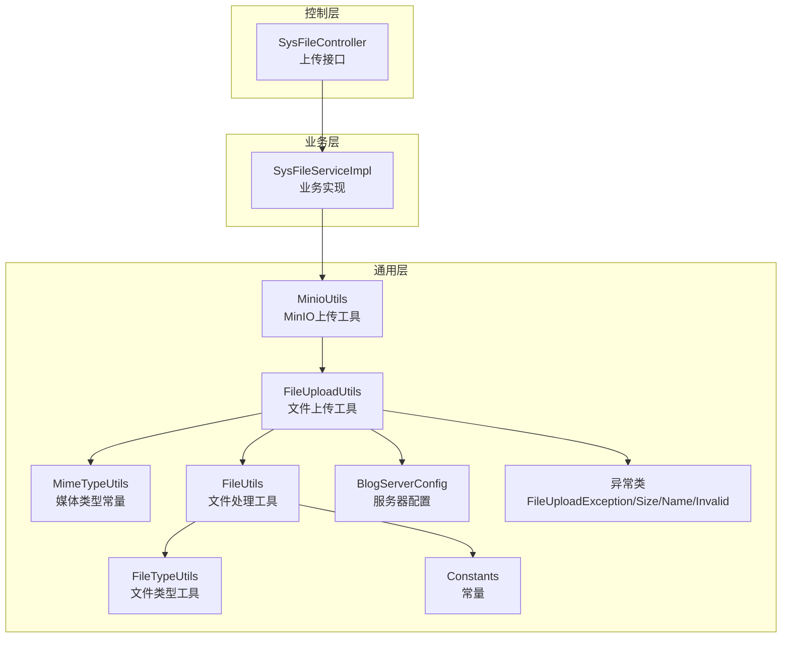
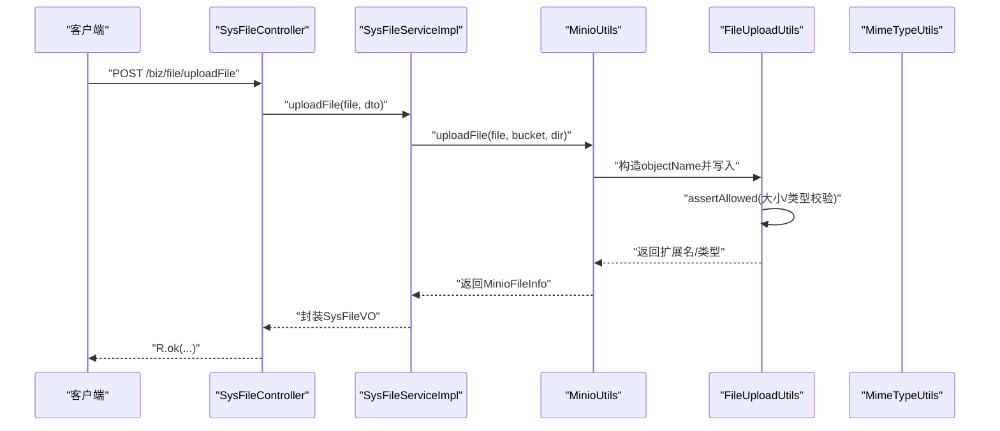
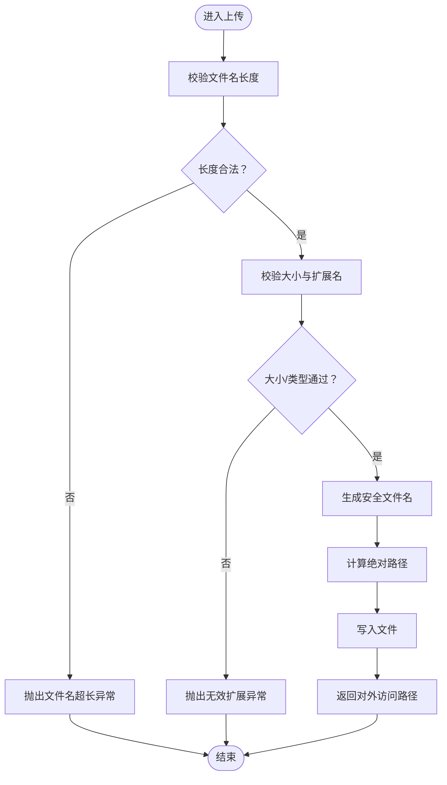
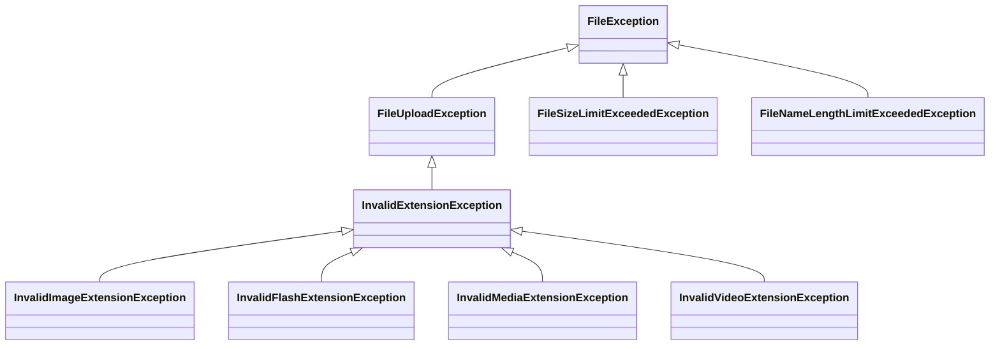
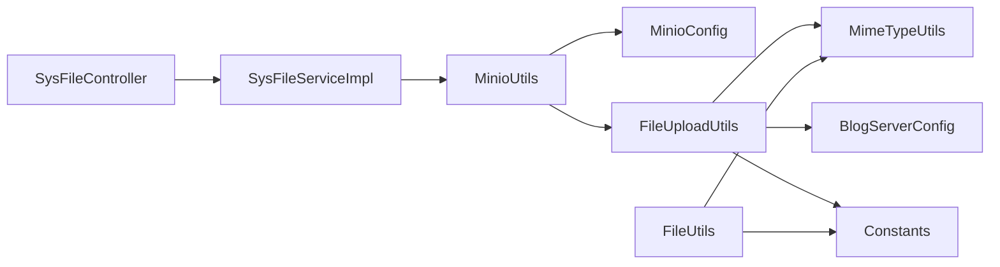

# 文件安全控制

<cite>
**本文引用的文件**
- [FileUploadUtils.java](file://blog-common/src/main/java/blog/common/utils/file/FileUploadUtils.java)
- [MimeTypeUtils.java](file://blog-common/src/main/java/blog/common/utils/file/MimeTypeUtils.java)
- [FileUtils.java](file://blog-common/src/main/java/blog/common/utils/file/FileUtils.java)
- [FileTypeUtils.java](file://blog-common/src/main/java/blog/common/utils/file/FileTypeUtils.java)
- [MinioUtils.java](file://blog-common/src/main/java/blog/common/utils/minio/MinioUtils.java)
- [MinioConfig.java](file://blog-common/src/main/java/blog/common/config/minio/MinioConfig.java)
- [BlogServerConfig.java](file://blog-common/src/main/java/blog/common/config/BlogServerConfig.java)
- [Constants.java](file://blog-common/src/main/java/blog/common/constant/Constants.java)
- [FileUploadException.java](file://blog-common/src/main/java/blog/common/exception/file/FileUploadException.java)
- [FileSizeLimitExceededException.java](file://blog-common/src/main/java/blog/common/exception/file/FileSizeLimitExceededException.java)
- [FileNameLengthLimitExceededException.java](file://blog-common/src/main/java/blog/common/exception/file/FileNameLengthLimitExceededException.java)
- [InvalidExtensionException.java](file://blog-common/src/main/java/blog/common/exception/file/InvalidExtensionException.java)
- [FileException.java](file://blog-common/src/main/java/blog/common/exception/file/FileException.java)
- [SysFileController.java](file://blog-admin/src/main/java/blog/web/controller/common/SysFileController.java)
- [SysFileServiceImpl.java](file://blog-biz/src/main/java/blog/biz/service/impl/SysFileServiceImpl.java)
</cite>

## 目录
1. [简介](#简介)
2. [项目结构](#项目结构)
3. [核心组件](#核心组件)
4. [架构总览](#架构总览)
5. [详细组件分析](#详细组件分析)
6. [依赖分析](#依赖分析)
7. [性能考虑](#性能考虑)
8. [故障排查指南](#故障排查指南)
9. [结论](#结论)
10. [附录](#附录)

## 简介
本技术文档围绕“文件安全控制”主题，系统性梳理并解释文件上传流程中的各项安全控制措施与异常处理机制，覆盖以下关键点：
- 文件大小限制、文件类型验证、文件名长度与合法性校验、上传路径安全
- 异常类型与处理逻辑：FileSizeLimitExceededException、InvalidExtensionException、FileUploadException、FileNameLengthLimitExceededException
- 在防止恶意文件上传攻击中的作用：XSS防护、文件包含漏洞防范、路径遍历攻击阻止
- 安全策略配置与自定义扩展机制
- 最佳实践与常见问题解决方案

## 项目结构
文件安全控制相关代码主要分布在如下模块与包中：
- blog-common：通用工具与异常、配置、常量、MinIO集成
- blog-admin：文件上传接口控制器
- blog-biz：业务层调用MinIO上传并返回结果

图表来源
- [SysFileController.java:111-121](file://blog-admin/src/main/java/blog/web/controller/common/SysFileController.java#L111-L121)
- [SysFileServiceImpl.java:151-167](file://blog-biz/src/main/java/blog/biz/service/impl/SysFileServiceImpl.java#L151-L167)
- [FileUploadUtils.java:56-126](file://blog-common/src/main/java/blog/common/utils/file/FileUploadUtils.java#L56-L126)
- [MimeTypeUtils.java:8-56](file://blog-common/src/main/java/blog/common/utils/file/MimeTypeUtils.java#L8-L56)
- [FileUtils.java:126-146](file://blog-common/src/main/java/blog/common/utils/file/FileUtils.java#L126-L146)
- [FileTypeUtils.java:21-42](file://blog-common/src/main/java/blog/common/utils/file/FileTypeUtils.java#L21-L42)
- [MinioUtils.java:85-111](file://blog-common/src/main/java/blog/common/utils/minio/MinioUtils.java#L85-L111)
- [BlogServerConfig.java:68-118](file://blog-common/src/main/java/blog/common/config/BlogServerConfig.java#L68-L118)
- [Constants.java:140-141](file://blog-common/src/main/java/blog/common/constant/Constants.java#L140-L141)
- [FileUploadException.java:11-52](file://blog-common/src/main/java/blog/common/exception/file/FileUploadException.java#L11-L52)

章节来源
- [SysFileController.java:111-121](file://blog-admin/src/main/java/blog/web/controller/common/SysFileController.java#L111-L121)
- [SysFileServiceImpl.java:151-167](file://blog-biz/src/main/java/blog/biz/service/impl/SysFileServiceImpl.java#L151-L167)
- [FileUploadUtils.java:56-126](file://blog-common/src/main/java/blog/common/utils/file/FileUploadUtils.java#L56-L126)
- [MinioUtils.java:85-111](file://blog-common/src/main/java/blog/common/utils/minio/MinioUtils.java#L85-L111)

## 核心组件
- 文件上传工具：负责大小限制、类型校验、文件名生成、绝对路径与对外访问路径拼接、文件落盘
- 媒体类型常量：集中定义允许的扩展名集合（图片、Flash、音视频、默认允许集合）
- 文件处理工具：文件名合法性校验、下载前路径与扩展名检查、下载响应头设置
- MinIO上传工具：封装桶创建、文件上传、信息获取、URL生成等
- 控制器与业务层：接收文件、调用上传工具、捕获异常并返回统一响应

章节来源
- [FileUploadUtils.java:25-224](file://blog-common/src/main/java/blog/common/utils/file/FileUploadUtils.java#L25-L224)
- [MimeTypeUtils.java:8-56](file://blog-common/src/main/java/blog/common/utils/file/MimeTypeUtils.java#L8-L56)
- [FileUtils.java:29-258](file://blog-common/src/main/java/blog/common/utils/file/FileUtils.java#L29-L258)
- [MinioUtils.java:26-325](file://blog-common/src/main/java/blog/common/utils/minio/MinioUtils.java#L26-L325)
- [SysFileController.java:111-121](file://blog-admin/src/main/java/blog/web/controller/common/SysFileController.java#L111-L121)
- [SysFileServiceImpl.java:151-167](file://blog-biz/src/main/java/blog/biz/service/impl/SysFileServiceImpl.java#L151-L167)

## 架构总览
文件上传从接口到落库/对象存储的关键流程如下：

图表来源
- [SysFileController.java:111-121](file://blog-admin/src/main/java/blog/web/controller/common/SysFileController.java#L111-L121)
- [SysFileServiceImpl.java:151-167](file://blog-biz/src/main/java/blog/biz/service/impl/SysFileServiceImpl.java#L151-L167)
- [MinioUtils.java:85-111](file://blog-common/src/main/java/blog/common/utils/minio/MinioUtils.java#L85-L111)
- [FileUploadUtils.java:167-193](file://blog-common/src/main/java/blog/common/utils/file/FileUploadUtils.java#L167-L193)
- [MimeTypeUtils.java:28-38](file://blog-common/src/main/java/blog/common/utils/file/MimeTypeUtils.java#L28-L38)

## 详细组件分析

### 文件上传工具：FileUploadUtils
职责与要点：
- 默认最大文件大小、默认文件名长度限制
- 校验文件大小与扩展名；支持按类型细分抛出具体异常
- 生成安全的文件名（日期目录 + 唯一标识 + 后缀）或使用UUID命名
- 计算绝对路径并写入磁盘，返回对外访问路径
- 通过BlogServerConfig与Constants配合，确保路径前缀与资源前缀一致

图表来源
- [FileUploadUtils.java:114-126](file://blog-common/src/main/java/blog/common/utils/file/FileUploadUtils.java#L114-L126)
- [FileUploadUtils.java:167-193](file://blog-common/src/main/java/blog/common/utils/file/FileUploadUtils.java#L167-L193)
- [FileUploadUtils.java:131-140](file://blog-common/src/main/java/blog/common/utils/file/FileUploadUtils.java#L131-L140)
- [FileUploadUtils.java:142-157](file://blog-common/src/main/java/blog/common/utils/file/FileUploadUtils.java#L142-L157)
- [BlogServerConfig.java:68-118](file://blog-common/src/main/java/blog/common/config/BlogServerConfig.java#L68-L118)
- [Constants.java:140-141](file://blog-common/src/main/java/blog/common/constant/Constants.java#L140-L141)

章节来源
- [FileUploadUtils.java:25-224](file://blog-common/src/main/java/blog/common/utils/file/FileUploadUtils.java#L25-L224)
- [BlogServerConfig.java:68-118](file://blog-common/src/main/java/blog/common/config/BlogServerConfig.java#L68-L118)
- [Constants.java:140-141](file://blog-common/src/main/java/blog/common/constant/Constants.java#L140-L141)

### 媒体类型与扩展名：MimeTypeUtils
- 定义图片、Flash、音视频、默认允许扩展名集合
- 提供根据Content-Type推断扩展名的能力
- 作为FileUploadUtils.assertAllowed的扩展名白名单来源

章节来源
- [MimeTypeUtils.java:8-56](file://blog-common/src/main/java/blog/common/utils/file/MimeTypeUtils.java#L8-L56)

### 文件处理与下载安全：FileUtils
- 文件名合法性校验（正则匹配），阻断非法字符
- 下载前检查：禁止路径穿越（包含“..”即拒绝）
- 仅允许在默认允许扩展名集合内下载
- 下载响应头设置，兼容多浏览器

章节来源
- [FileUtils.java:126-146](file://blog-common/src/main/java/blog/common/utils/file/FileUtils.java#L126-L146)
- [FileUtils.java:155-194](file://blog-common/src/main/java/blog/common/utils/file/FileUtils.java#L155-L194)

### 文件类型识别：FileTypeUtils
- 基于文件名后缀与文件头字节识别扩展名，辅助下载与导入场景

章节来源
- [FileTypeUtils.java:21-63](file://blog-common/src/main/java/blog/common/utils/file/FileTypeUtils.java#L21-L63)

### 对象存储上传：MinioUtils
- 自动创建桶、上传文件、生成预签名URL、获取文件信息
- 上传时使用随机objectName，避免路径暴露与冲突
- 支持临时URL与永久URL两种访问方式

章节来源
- [MinioUtils.java:85-111](file://blog-common/src/main/java/blog/common/utils/minio/MinioUtils.java#L85-L111)
- [MinioUtils.java:159-182](file://blog-common/src/main/java/blog/common/utils/minio/MinioUtils.java#L159-L182)
- [MinioConfig.java:17-31](file://blog-common/src/main/java/blog/common/config/minio/MinioConfig.java#L17-L31)

### 控制器与业务层：SysFileController/SysFileServiceImpl
- 接收multipart/form-data，调用业务层上传
- 业务层委托MinIO上传，封装返回值

章节来源
- [SysFileController.java:111-121](file://blog-admin/src/main/java/blog/web/controller/common/SysFileController.java#L111-L121)
- [SysFileServiceImpl.java:151-167](file://blog-biz/src/main/java/blog/biz/service/impl/SysFileServiceImpl.java#L151-L167)

### 异常体系与处理逻辑
- FileUploadException：文件上传基础异常
- FileSizeLimitExceededException：文件大小超限
- FileNameLengthLimitExceededException：文件名超长
- InvalidExtensionException：扩展名不在允许列表
  - 细分：InvalidImageExtensionException、InvalidFlashExtensionException、InvalidMediaExtensionException、InvalidVideoExtensionException
- FileException：文件异常基类，用于国际化消息装配

图表来源
- [FileUploadException.java:11-52](file://blog-common/src/main/java/blog/common/exception/file/FileUploadException.java#L11-L52)
- [FileException.java:10-17](file://blog-common/src/main/java/blog/common/exception/file/FileException.java#L10-L17)
- [FileSizeLimitExceededException.java:8-14](file://blog-common/src/main/java/blog/common/exception/file/FileSizeLimitExceededException.java#L8-L14)
- [FileNameLengthLimitExceededException.java:8-14](file://blog-common/src/main/java/blog/common/exception/file/FileNameLengthLimitExceededException.java#L8-L14)
- [InvalidExtensionException.java:10-67](file://blog-common/src/main/java/blog/common/exception/file/InvalidExtensionException.java#L10-L67)

章节来源
- [FileUploadException.java:11-52](file://blog-common/src/main/java/blog/common/exception/file/FileUploadException.java#L11-L52)
- [FileException.java:10-17](file://blog-common/src/main/java/blog/common/exception/file/FileException.java#L10-L17)
- [FileSizeLimitExceededException.java:8-14](file://blog-common/src/main/java/blog/common/exception/file/FileSizeLimitExceededException.java#L8-L14)
- [FileNameLengthLimitExceededException.java:8-14](file://blog-common/src/main/java/blog/common/exception/file/FileNameLengthLimitExceededException.java#L8-L14)
- [InvalidExtensionException.java:10-67](file://blog-common/src/main/java/blog/common/exception/file/InvalidExtensionException.java#L10-L67)

## 依赖分析
- 控制层依赖业务层，业务层依赖MinIO工具
- 上传工具依赖媒体类型常量、配置与常量
- 下载工具依赖常量与媒体类型常量，确保路径与扩展名安全
- MinIO配置通过Spring注入MinioClient，启动时验证连接

图表来源
- [SysFileController.java:111-121](file://blog-admin/src/main/java/blog/web/controller/common/SysFileController.java#L111-L121)
- [SysFileServiceImpl.java:151-167](file://blog-biz/src/main/java/blog/biz/service/impl/SysFileServiceImpl.java#L151-L167)
- [MinioUtils.java:85-111](file://blog-common/src/main/java/blog/common/utils/minio/MinioUtils.java#L85-L111)
- [MinioConfig.java:17-31](file://blog-common/src/main/java/blog/common/config/minio/MinioConfig.java#L17-L31)
- [FileUploadUtils.java:25-224](file://blog-common/src/main/java/blog/common/utils/file/FileUploadUtils.java#L25-L224)
- [MimeTypeUtils.java:8-56](file://blog-common/src/main/java/blog/common/utils/file/MimeTypeUtils.java#L8-L56)
- [BlogServerConfig.java:68-118](file://blog-common/src/main/java/blog/common/config/BlogServerConfig.java#L68-L118)
- [Constants.java:140-141](file://blog-common/src/main/java/blog/common/constant/Constants.java#L140-L141)
- [FileUtils.java:126-146](file://blog-common/src/main/java/blog/common/utils/file/FileUtils.java#L126-L146)

## 性能考虑
- 上传大小限制与扩展名校验在内存中完成，避免大文件占用IO
- 使用随机objectName与日期目录组织，便于后续清理与并发写入
- MinIO上传采用流式写入，减少内存峰值
- 下载前先做扩展名与路径校验，避免无效IO

[本节为通用建议，无需列出章节来源]

## 故障排查指南
- 文件大小超限
  - 现象：抛出文件大小限制异常
  - 处理：调整上传大小限制或提示用户
  - 参考：[FileSizeLimitExceededException.java:8-14](file://blog-common/src/main/java/blog/common/exception/file/FileSizeLimitExceededException.java#L8-L14)，[FileUploadUtils.java:169-172](file://blog-common/src/main/java/blog/common/utils/file/FileUploadUtils.java#L169-L172)
- 文件名超长
  - 现象：抛出文件名长度限制异常
  - 处理：缩短文件名或重命名
  - 参考：[FileNameLengthLimitExceededException.java:8-14](file://blog-common/src/main/java/blog/common/exception/file/FileNameLengthLimitExceededException.java#L8-L14)，[FileUploadUtils.java:114-117](file://blog-common/src/main/java/blog/common/utils/file/FileUploadUtils.java#L114-L117)
- 扩展名不被允许
  - 现象：抛出无效扩展异常，可能细分到图片/Flash/音视频
  - 处理：确认扩展名是否在允许列表，必要时扩展白名单
  - 参考：[InvalidExtensionException.java:10-67](file://blog-common/src/main/java/blog/common/exception/file/InvalidExtensionException.java#L10-L67)，[MimeTypeUtils.java:28-38](file://blog-common/src/main/java/blog/common/utils/file/MimeTypeUtils.java#L28-L38)，[FileUploadUtils.java:176-192](file://blog-common/src/main/java/blog/common/utils/file/FileUploadUtils.java#L176-L192)
- 下载失败或被拒绝
  - 现象：路径包含“..”或扩展名不在允许列表
  - 处理：修正路径、仅允许白名单扩展名
  - 参考：[FileUtils.java:136-146](file://blog-common/src/main/java/blog/common/utils/file/FileUtils.java#L136-L146)
- MinIO连接失败
  - 现象：MinIO初始化日志报错
  - 处理：检查endpoint、accessKey、secretKey配置
  - 参考：[MinioConfig.java:23-29](file://blog-common/src/main/java/blog/common/config/minio/MinioConfig.java#L23-L29)

章节来源
- [FileSizeLimitExceededException.java:8-14](file://blog-common/src/main/java/blog/common/exception/file/FileSizeLimitExceededException.java#L8-L14)
- [FileNameLengthLimitExceededException.java:8-14](file://blog-common/src/main/java/blog/common/exception/file/FileNameLengthLimitExceededException.java#L8-L14)
- [InvalidExtensionException.java:10-67](file://blog-common/src/main/java/blog/common/exception/file/InvalidExtensionException.java#L10-L67)
- [MimeTypeUtils.java:28-38](file://blog-common/src/main/java/blog/common/utils/file/MimeTypeUtils.java#L28-L38)
- [FileUploadUtils.java:114-192](file://blog-common/src/main/java/blog/common/utils/file/FileUploadUtils.java#L114-L192)
- [FileUtils.java:136-146](file://blog-common/src/main/java/blog/common/utils/file/FileUtils.java#L136-L146)
- [MinioConfig.java:23-29](file://blog-common/src/main/java/blog/common/config/minio/MinioConfig.java#L23-L29)

## 结论
该文件安全控制方案通过“上传前严格校验 + 安全命名 + 对象存储落地 + 下载前二次校验”的闭环，有效降低了恶意文件上传带来的风险。结合异常体系与配置化扩展，既保证了安全性，也提供了良好的可维护性与可扩展性。

[本节为总结，无需列出章节来源]

## 附录

### 安全控制策略配置与自定义扩展
- 扩展允许的文件类型
  - 在媒体类型常量中增加扩展名集合，或在调用上传工具时传入自定义allowedExtension
  - 参考：[MimeTypeUtils.java:28-38](file://blog-common/src/main/java/blog/common/utils/file/MimeTypeUtils.java#L28-L38)，[FileUploadUtils.java:92-96](file://blog-common/src/main/java/blog/common/utils/file/FileUploadUtils.java#L92-L96)
- 自定义上传路径
  - 通过配置类设置profile与upload路径，确保对外访问前缀一致
  - 参考：[BlogServerConfig.java:68-118](file://blog-common/src/main/java/blog/common/config/BlogServerConfig.java#L68-L118)，[Constants.java:140-141](file://blog-common/src/main/java/blog/common/constant/Constants.java#L140-L141)
- 自定义文件名策略
  - 使用自定义命名或UUID命名，避免原始文件名泄露
  - 参考：[FileUploadUtils.java:131-140](file://blog-common/src/main/java/blog/common/utils/file/FileUploadUtils.java#L131-L140)
- 下载白名单
  - 仅允许白名单扩展名下载，避免任意文件泄露
  - 参考：[FileUtils.java:143-143](file://blog-common/src/main/java/blog/common/utils/file/FileUtils.java#L143-L143)

### 常见安全问题与最佳实践
- XSS防护
  - 下载响应头进行编码，避免浏览器执行脚本
  - 参考：[FileUtils.java:155-194](file://blog-common/src/main/java/blog/common/utils/file/FileUtils.java#L155-L194)
- 文件包含漏洞防范
  - 严禁直接使用用户可控路径作为下载目标，必须在白名单内校验
  - 参考：[FileUtils.java:136-146](file://blog-common/src/main/java/blog/common/utils/file/FileUtils.java#L136-L146)
- 路径遍历攻击阻止
  - 拒绝包含“..”的路径，严格限定在受控目录
  - 参考：[FileUtils.java:136-140](file://blog-common/src/main/java/blog/common/utils/file/FileUtils.java#L136-L140)
- 文件大小限制
  - 服务端与前端共同限制，避免大文件耗尽资源
  - 参考：[FileUploadUtils.java](file://blog-common/src/main/java/blog/common/utils/file/FileUploadUtils.java#L29)，[FileUploadUtils.java:169-172](file://blog-common/src/main/java/blog/common/utils/file/FileUploadUtils.java#L169-L172)
- 文件名安全检查
  - 限制文件名长度与字符集，避免路径注入与系统兼容性问题
  - 参考：[FileUploadUtils.java:114-117](file://blog-common/src/main/java/blog/common/utils/file/FileUploadUtils.java#L114-L117)，[FileUtils.java:126-128](file://blog-common/src/main/java/blog/common/utils/file/FileUtils.java#L126-L128)

章节来源
- [MimeTypeUtils.java:28-38](file://blog-common/src/main/java/blog/common/utils/file/MimeTypeUtils.java#L28-L38)
- [BlogServerConfig.java:68-118](file://blog-common/src/main/java/blog/common/config/BlogServerConfig.java#L68-L118)
- [Constants.java:140-141](file://blog-common/src/main/java/blog/common/constant/Constants.java#L140-L141)
- [FileUploadUtils.java](file://blog-common/src/main/java/blog/common/utils/file/FileUploadUtils.java#L29)
- [FileUploadUtils.java:114-172](file://blog-common/src/main/java/blog/common/utils/file/FileUploadUtils.java#L114-L172)
- [FileUtils.java:126-194](file://blog-common/src/main/java/blog/common/utils/file/FileUtils.java#L126-L194)