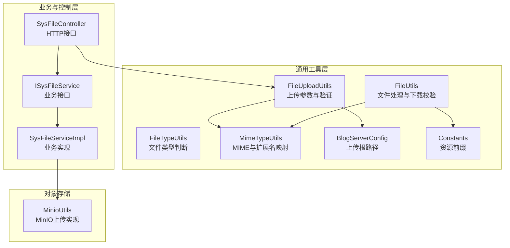
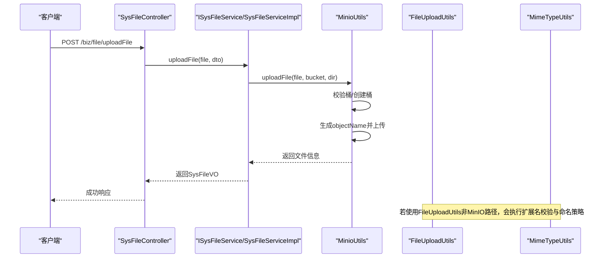
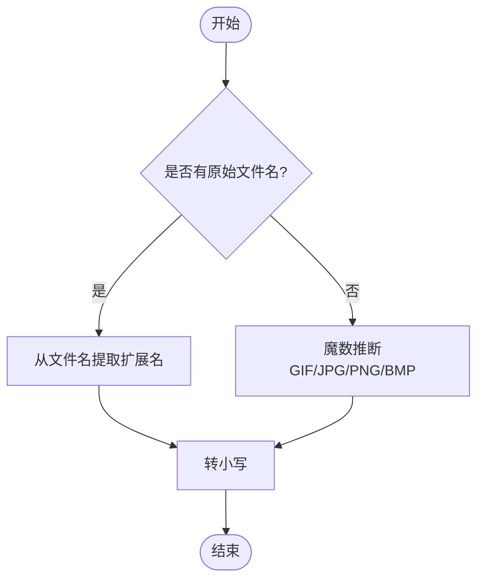
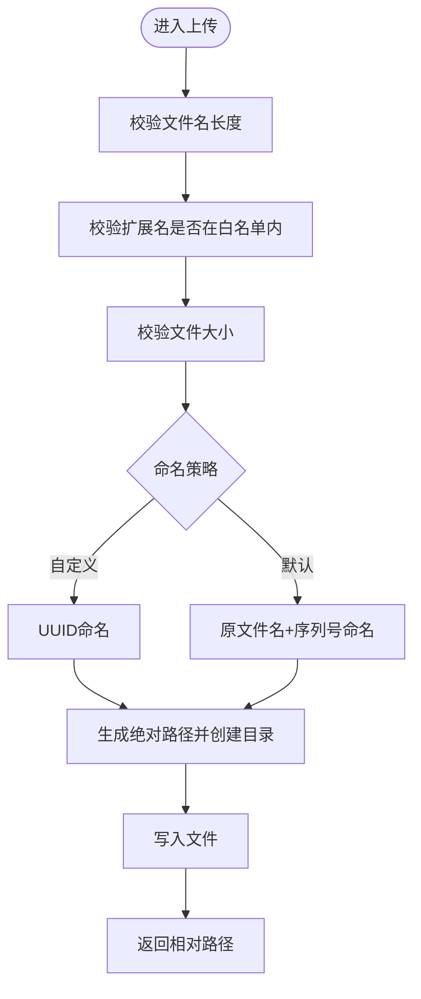
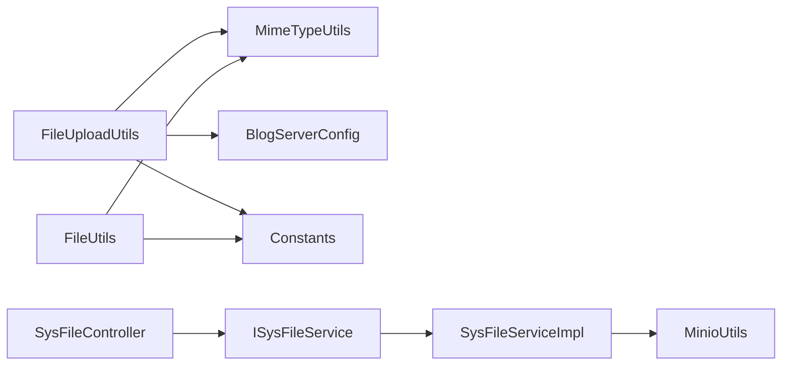

# 文件类型验证

<cite>
**本文引用的文件**
- [FileTypeUtils.java](file://blog-common/src/main/java/blog/common/utils/file/FileTypeUtils.java)
- [FileUploadUtils.java](file://blog-common/src/main/java/blog/common/utils/file/FileUploadUtils.java)
- [MimeTypeUtils.java](file://blog-common/src/main/java/blog/common/utils/file/MimeTypeUtils.java)
- [FileUtils.java](file://blog-common/src/main/java/blog/common/utils/file/FileUtils.java)
- [InvalidExtensionException.java](file://blog-common/src/main/java/blog/common/exception/file/InvalidExtensionException.java)
- [FileSizeLimitExceededException.java](file://blog-common/src/main/java/blog/common/exception/file/FileSizeLimitExceededException.java)
- [FileNameLengthLimitExceededException.java](file://blog-common/src/main/java/blog/common/exception/file/FileNameLengthLimitExceededException.java)
- [BlogServerConfig.java](file://blog-common/src/main/java/blog/common/config/BlogServerConfig.java)
- [Constants.java](file://blog-common/src/main/java/blog/common/constant/Constants.java)
- [MinioUtils.java](file://blog-common/src/main/java/blog/common/utils/minio/MinioUtils.java)
- [SysFileController.java](file://blog-admin/src/main/java/blog/web/controller/common/SysFileController.java)
- [ISysFileService.java](file://blog-biz/src/main/java/blog/biz/service/ISysFileService.java)
- [SysFileServiceImpl.java](file://blog-biz/src/main/java/blog/biz/service/impl/SysFileServiceImpl.java)
</cite>

## 目录
1. [简介](#简介)
2. [项目结构](#项目结构)
3. [核心组件](#核心组件)
4. [架构总览](#架构总览)
5. [详细组件分析](#详细组件分析)
6. [依赖关系分析](#依赖关系分析)
7. [性能与安全考量](#性能与安全考量)
8. [故障排查指南](#故障排查指南)
9. [结论](#结论)
10. [附录：配置与最佳实践](#附录配置与最佳实践)

## 简介
本技术文档围绕“文件类型验证”主题，系统梳理并深入解析以下能力：
- FileTypeUtils 中的文件类型判断与验证机制：包含基于扩展名的类型提取、基于文件头魔数的类型推断。
- FileUploadUtils 中的文件上传参数处理与验证逻辑：包含文件大小限制、文件类型白名单、上传目录安全检查、命名策略等。
- 在防止恶意文件上传中的作用与重要性：多策略验证如何降低风险面。
- 各种文件类型验证方法的使用场景与最佳实践。
- 文件类型配置示例与自定义验证规则的实现方法。
- 帮助开发者构建安全可靠的文件上传系统。

## 项目结构
该功能主要分布在如下模块与包中：
- blog-common/utils/file：文件类型与上传工具类
- blog-common/exception/file：文件上传相关异常
- blog-common/config：服务器配置（上传根路径）
- blog-common/constant：常量（资源前缀）
- blog-common/utils/minio：对象存储上传实现（可选）
- blog-admin/web/controller/common：文件上传接口入口
- blog-biz/service：业务层封装与对外暴露

图表来源
- [SysFileController.java:111-121](file://blog-admin/src/main/java/blog/web/controller/common/SysFileController.java#L111-L121)
- [ISysFileService.java:73-74](file://blog-biz/src/main/java/blog/biz/service/ISysFileService.java#L73-L74)
- [SysFileServiceImpl.java:151-167](file://blog-biz/src/main/java/blog/biz/service/impl/SysFileServiceImpl.java#L151-L167)
- [FileUploadUtils.java:92-126](file://blog-common/src/main/java/blog/common/utils/file/FileUploadUtils.java#L92-L126)
- [MimeTypeUtils.java:28-38](file://blog-common/src/main/java/blog/common/utils/file/MimeTypeUtils.java#L28-L38)
- [BlogServerConfig.java:68-118](file://blog-common/src/main/java/blog/common/config/BlogServerConfig.java#L68-L118)
- [Constants.java:139-141](file://blog-common/src/main/java/blog/common/constant/Constants.java#L139-L141)
- [MinioUtils.java:85-111](file://blog-common/src/main/java/blog/common/utils/minio/MinioUtils.java#L85-L111)

章节来源
- [SysFileController.java:111-121](file://blog-admin/src/main/java/blog/web/controller/common/SysFileController.java#L111-L121)
- [SysFileServiceImpl.java:151-167](file://blog-biz/src/main/java/blog/biz/service/impl/SysFileServiceImpl.java#L151-L167)
- [FileUploadUtils.java:92-126](file://blog-common/src/main/java/blog/common/utils/file/FileUploadUtils.java#L92-L126)
- [MimeTypeUtils.java:28-38](file://blog-common/src/main/java/blog/common/utils/file/MimeTypeUtils.java#L28-L38)
- [BlogServerConfig.java:68-118](file://blog-common/src/main/java/blog/common/config/BlogServerConfig.java#L68-L118)
- [Constants.java:139-141](file://blog-common/src/main/java/blog/common/constant/Constants.java#L139-L141)
- [MinioUtils.java:85-111](file://blog-common/src/main/java/blog/common/utils/minio/MinioUtils.java#L85-L111)

## 核心组件
- FileTypeUtils：负责从文件名与字节数组中提取扩展名，支持基于魔数的图片类型推断。
- FileUploadUtils：负责上传流程的参数校验与处理，包括大小限制、扩展名校验、命名策略、路径安全与返回相对路径。
- MimeTypeUtils：维护各类媒体类型的扩展名白名单与MIME到扩展名的映射。
- FileUtils：提供文件下载校验、路径剥离、文件名合法性校验、魔数推断等辅助能力。
- 异常体系：InvalidExtensionException、FileSizeLimitExceededException、FileNameLengthLimitExceededException。
- 配置与常量：BlogServerConfig 提供上传根路径；Constants 提供资源前缀。

章节来源
- [FileTypeUtils.java:12-63](file://blog-common/src/main/java/blog/common/utils/file/FileTypeUtils.java#L12-L63)
- [FileUploadUtils.java:25-224](file://blog-common/src/main/java/blog/common/utils/file/FileUploadUtils.java#L25-L224)
- [MimeTypeUtils.java:8-56](file://blog-common/src/main/java/blog/common/utils/file/MimeTypeUtils.java#L8-L56)
- [FileUtils.java:29-257](file://blog-common/src/main/java/blog/common/utils/file/FileUtils.java#L29-L257)
- [InvalidExtensionException.java:10-67](file://blog-common/src/main/java/blog/common/exception/file/InvalidExtensionException.java#L10-L67)
- [FileSizeLimitExceededException.java:8-14](file://blog-common/src/main/java/blog/common/exception/file/FileSizeLimitExceededException.java#L8-L14)
- [FileNameLengthLimitExceededException.java:8-14](file://blog-common/src/main/java/blog/common/exception/file/FileNameLengthLimitExceededException.java#L8-L14)
- [BlogServerConfig.java:68-118](file://blog-common/src/main/java/blog/common/config/BlogServerConfig.java#L68-L118)
- [Constants.java:139-141](file://blog-common/src/main/java/blog/common/constant/Constants.java#L139-L141)

## 架构总览
文件上传从接口层进入，经过业务层封装，最终落到上传工具或对象存储实现。上传工具会执行多层验证，确保安全与合规。

图表来源
- [SysFileController.java:111-121](file://blog-admin/src/main/java/blog/web/controller/common/SysFileController.java#L111-L121)
- [SysFileServiceImpl.java:151-167](file://blog-biz/src/main/java/blog/biz/service/impl/SysFileServiceImpl.java#L151-L167)
- [MinioUtils.java:85-111](file://blog-common/src/main/java/blog/common/utils/minio/MinioUtils.java#L85-L111)

## 详细组件分析

### FileTypeUtils：文件类型判断与魔数推断
- 文件类型提取
  - 支持从文件名中提取扩展名（不含点）。
  - 支持从字节数组中推断图片类型（GIF/JPG/PNG/BMP）。
- 设计要点
  - 优先使用扩展名；若缺失，则回退到魔数推断。
  - 魔数推断针对常见图片格式，避免被简单篡改扩展名绕过。

图表来源
- [FileTypeUtils.java:36-62](file://blog-common/src/main/java/blog/common/utils/file/FileTypeUtils.java#L36-L62)

章节来源
- [FileTypeUtils.java:12-63](file://blog-common/src/main/java/blog/common/utils/file/FileTypeUtils.java#L12-L63)

### FileUploadUtils：上传参数处理与验证
- 参数与默认值
  - 默认最大文件大小、默认文件名长度。
  - 默认上传根目录来自配置。
- 校验流程
  - 文件名长度校验。
  - 扩展名白名单校验（支持图片、Flash、音视频、默认白名单等）。
  - 大小限制校验。
- 命名策略
  - 日期目录 + 原文件名 + 序列值 + 后缀（extractFilename）。
  - 日期目录 + UUID + 后缀（uuidFilename）。
- 路径安全
  - 绝对路径生成与父目录创建。
  - 返回相对路径（资源前缀 + 相对目录 + 文件名）。
- 异常抛出
  - 超出大小、文件名过长、扩展名不合法等。

图表来源
- [FileUploadUtils.java:92-126](file://blog-common/src/main/java/blog/common/utils/file/FileUploadUtils.java#L92-L126)
- [FileUploadUtils.java:167-193](file://blog-common/src/main/java/blog/common/utils/file/FileUploadUtils.java#L167-L193)
- [FileUploadUtils.java:131-140](file://blog-common/src/main/java/blog/common/utils/file/FileUploadUtils.java#L131-L140)
- [FileUploadUtils.java:142-157](file://blog-common/src/main/java/blog/common/utils/file/FileUploadUtils.java#L142-L157)

章节来源
- [FileUploadUtils.java:25-224](file://blog-common/src/main/java/blog/common/utils/file/FileUploadUtils.java#L25-L224)

### MimeTypeUtils：MIME类型与扩展名映射
- 维护多类扩展名白名单：图片、Flash、音视频、默认允许扩展名集合。
- 提供 MIME 到扩展名的映射，用于当扩展名缺失时的回退。

章节来源
- [MimeTypeUtils.java:8-56](file://blog-common/src/main/java/blog/common/utils/file/MimeTypeUtils.java#L8-L56)

### FileUtils：下载校验与路径处理
- 下载校验：禁止目录穿越，仅允许白名单扩展名。
- 路径剥离：移除资源前缀。
- 文件名合法性：正则匹配允许的字符。
- 魔数推断：与 FileTypeUtils 的魔数推断一致，用于二进制数据写入场景。

章节来源
- [FileUtils.java:136-146](file://blog-common/src/main/java/blog/common/utils/file/FileUtils.java#L136-L146)
- [FileUtils.java:126-128](file://blog-common/src/main/java/blog/common/utils/file/FileUtils.java#L126-L128)
- [FileUtils.java:213-226](file://blog-common/src/main/java/blog/common/utils/file/FileUtils.java#L213-L226)

### 异常体系：上传过程中的错误分类
- InvalidExtensionException：扩展名不在白名单或类型不匹配。
- FileSizeLimitExceededException：文件超过最大大小。
- FileNameLengthLimitExceededException：文件名过长。

章节来源
- [InvalidExtensionException.java:10-67](file://blog-common/src/main/java/blog/common/exception/file/InvalidExtensionException.java#L10-L67)
- [FileSizeLimitExceededException.java:8-14](file://blog-common/src/main/java/blog/common/exception/file/FileSizeLimitExceededException.java#L8-L14)
- [FileNameLengthLimitExceededException.java:8-14](file://blog-common/src/main/java/blog/common/exception/file/FileNameLengthLimitExceededException.java#L8-L14)

### 接口与实现：SysFileController 与 SysFileServiceImpl
- 控制器：接收 multipart/form-data，调用业务层。
- 业务层：封装上传逻辑，当前采用 MinIO 实现，直接上传至对象存储。
- MinIO 实现：根据目录生成 objectName，上传并返回文件信息。

章节来源
- [SysFileController.java:111-121](file://blog-admin/src/main/java/blog/web/controller/common/SysFileController.java#L111-L121)
- [SysFileServiceImpl.java:151-167](file://blog-biz/src/main/java/blog/biz/service/impl/SysFileServiceImpl.java#L151-L167)
- [MinioUtils.java:85-111](file://blog-common/src/main/java/blog/common/utils/minio/MinioUtils.java#L85-L111)

## 依赖关系分析
- FileUploadUtils 依赖 MimeTypeUtils（扩展名白名单）、BlogServerConfig（上传根路径）、Constants（资源前缀）。
- FileUtils 依赖 MimeTypeUtils（白名单）、Constants（资源前缀）。
- SysFileServiceImpl 依赖 MinioUtils（对象存储上传）。
- SysFileController 依赖 ISysFileService。

图表来源
- [FileUploadUtils.java:10-18](file://blog-common/src/main/java/blog/common/utils/file/FileUploadUtils.java#L10-L18)
- [FileUtils.java:18-22](file://blog-common/src/main/java/blog/common/utils/file/FileUtils.java#L18-L22)
- [SysFileServiceImpl.java:41-41](file://blog-biz/src/main/java/blog/biz/service/impl/SysFileServiceImpl.java#L41-L41)
- [SysFileController.java:41-41](file://blog-admin/src/main/java/blog/web/controller/common/SysFileController.java#L41-L41)

章节来源
- [FileUploadUtils.java:10-18](file://blog-common/src/main/java/blog/common/utils/file/FileUploadUtils.java#L10-L18)
- [FileUtils.java:18-22](file://blog-common/src/main/java/blog/common/utils/file/FileUtils.java#L18-L22)
- [SysFileServiceImpl.java:41-41](file://blog-biz/src/main/java/blog/biz/service/impl/SysFileServiceImpl.java#L41-L41)
- [SysFileController.java:41-41](file://blog-admin/src/main/java/blog/web/controller/common/SysFileController.java#L41-L41)

## 性能与安全考量
- 性能
  - 扩展名校验为 O(n) 线性扫描白名单，n 通常较小，开销可忽略。
  - 魔数推断仅检查头部若干字节，成本低。
  - 使用 UUID 或日期目录命名避免重名冲突，减少磁盘碎片。
- 安全
  - 多策略验证：扩展名白名单 + 文件头魔数 + 文件大小限制 + 目录穿越防护。
  - 目录安全：通过绝对路径生成与父目录创建，避免跨目录写入。
  - 下载安全：仅允许白名单扩展名，禁止目录穿越。
  - 最佳实践：结合对象存储（如 MinIO）进行统一管理，避免直接写入应用服务器文件系统。

[本节为通用指导，无需特定文件来源]

## 故障排查指南
- 上传报错“扩展名不合法”
  - 检查文件扩展名是否在白名单中；必要时调整 MimeTypeUtils 的扩展名集合。
  - 若使用默认白名单，确认扩展名大小写与白名单一致。
- 上传报错“文件过大”
  - 调整 FileUploadUtils 的默认大小限制或在调用处传入更大上限。
- 上传报错“文件名过长”
  - 缩短文件名或调整默认文件名长度限制。
- 下载失败或提示非法
  - 检查资源前缀与路径拼接是否正确；确认扩展名在白名单中。
- 对象存储上传失败
  - 检查 MinIO 配置、桶是否存在、目录权限与网络连通性。

章节来源
- [InvalidExtensionException.java:17-22](file://blog-common/src/main/java/blog/common/exception/file/InvalidExtensionException.java#L17-L22)
- [FileSizeLimitExceededException.java:11-13](file://blog-common/src/main/java/blog/common/exception/file/FileSizeLimitExceededException.java#L11-L13)
- [FileNameLengthLimitExceededException.java:11-13](file://blog-common/src/main/java/blog/common/exception/file/FileNameLengthLimitExceededException.java#L11-L13)
- [FileUtils.java:136-146](file://blog-common/src/main/java/blog/common/utils/file/FileUtils.java#L136-L146)
- [MinioUtils.java:85-111](file://blog-common/src/main/java/blog/common/utils/minio/MinioUtils.java#L85-L111)

## 结论
通过 FileTypeUtils、FileUploadUtils、MimeTypeUtils 与 FileUtils 的协同，系统实现了从扩展名、魔数、大小、命名与路径等多维度的安全验证。结合对象存储上传与严格的白名单策略，能够有效降低恶意文件上传的风险。建议在生产环境中：
- 明确白名单并定期审计；
- 对上传目录进行最小权限控制；
- 使用对象存储统一管理文件；
- 在网关或中间件层面增加速率限制与大小限制。

[本节为总结，无需特定文件来源]

## 附录：配置与最佳实践

### 配置示例
- 上传根路径
  - 通过配置类获取上传根路径，用于生成绝对路径与相对路径。
- 资源前缀
  - 用于拼接对外可访问的资源路径，确保下载时路径正确。
- 默认白名单
  - 包含图片、文档、压缩包、视频与 PDF 等常见类型。

章节来源
- [BlogServerConfig.java:68-118](file://blog-common/src/main/java/blog/common/config/BlogServerConfig.java#L68-L118)
- [Constants.java:139-141](file://blog-common/src/main/java/blog/common/constant/Constants.java#L139-L141)
- [MimeTypeUtils.java:28-38](file://blog-common/src/main/java/blog/common/utils/file/MimeTypeUtils.java#L28-L38)

### 自定义验证规则
- 扩展名白名单
  - 在调用上传方法时传入自定义扩展名数组，覆盖默认白名单。
- 命名策略
  - 使用 UUID 命名或原文件名+序列号命名，按需选择。
- 目录安全
  - 通过相对路径与资源前缀组合，避免直接暴露绝对路径。

章节来源
- [FileUploadUtils.java:92-126](file://blog-common/src/main/java/blog/common/utils/file/FileUploadUtils.java#L92-L126)
- [FileUploadUtils.java:131-140](file://blog-common/src/main/java/blog/common/utils/file/FileUploadUtils.java#L131-L140)
- [FileUploadUtils.java:142-157](file://blog-common/src/main/java/blog/common/utils/file/FileUploadUtils.java#L142-L157)

### 使用场景与最佳实践
- 场景一：图片上传
  - 使用图片白名单；启用魔数推断作为第二道防线。
- 场景二：文档上传
  - 使用默认白名单；限制大小与文件名长度。
- 场景三：视频/音频上传
  - 使用媒体白名单；结合对象存储进行转码与访问控制。
- 最佳实践
  - 服务端与客户端均进行校验；
  - 上传后立即进行二次校验（魔数与白名单）；
  - 对外访问路径统一走资源前缀，避免直接暴露物理路径；
  - 对敏感文件（如脚本、可执行文件）严格禁止。

[本节为通用指导，无需特定文件来源]