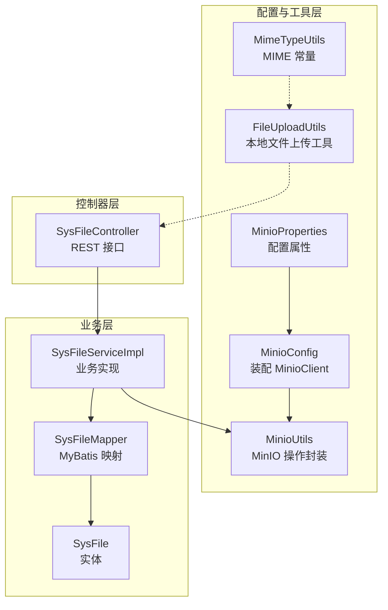
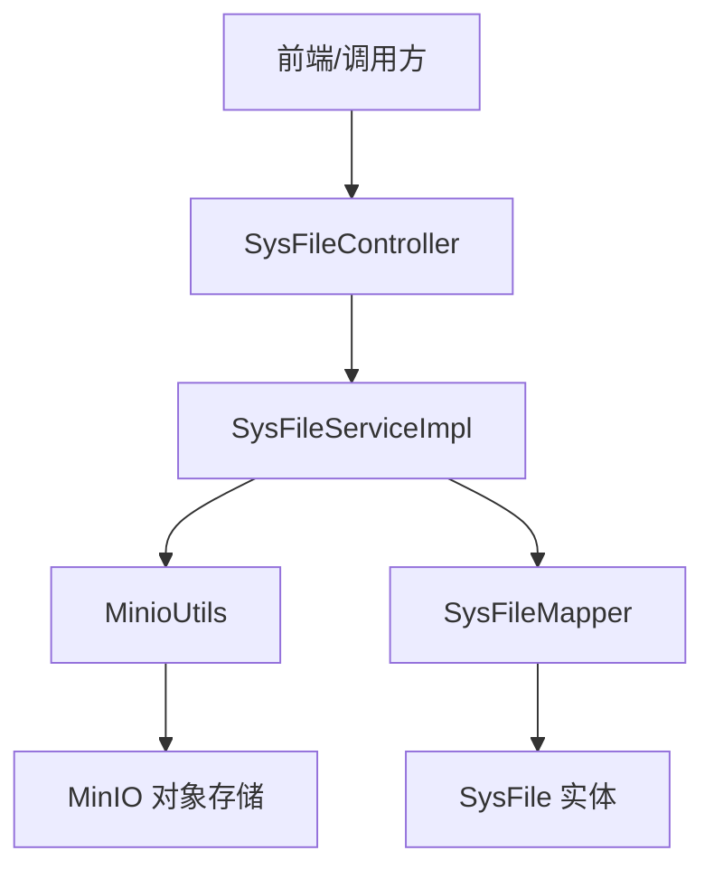
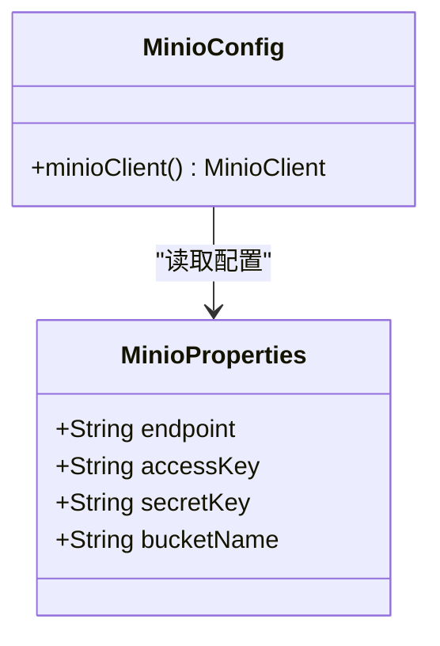
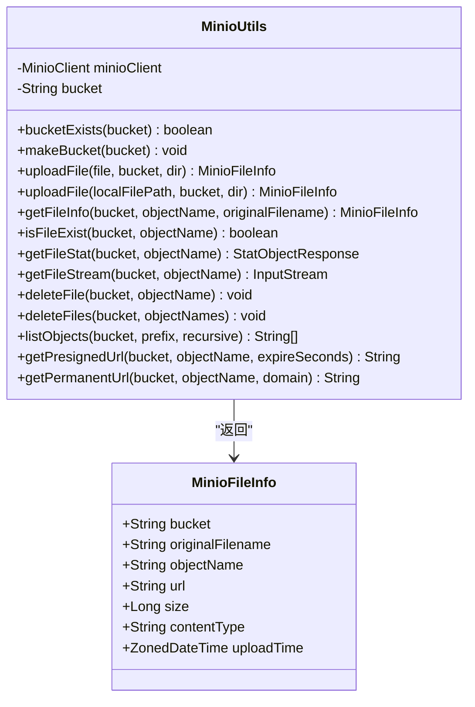
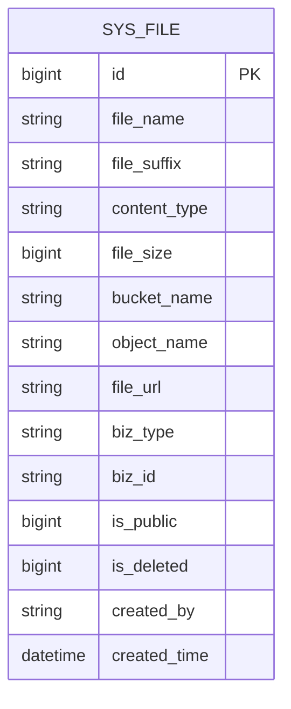
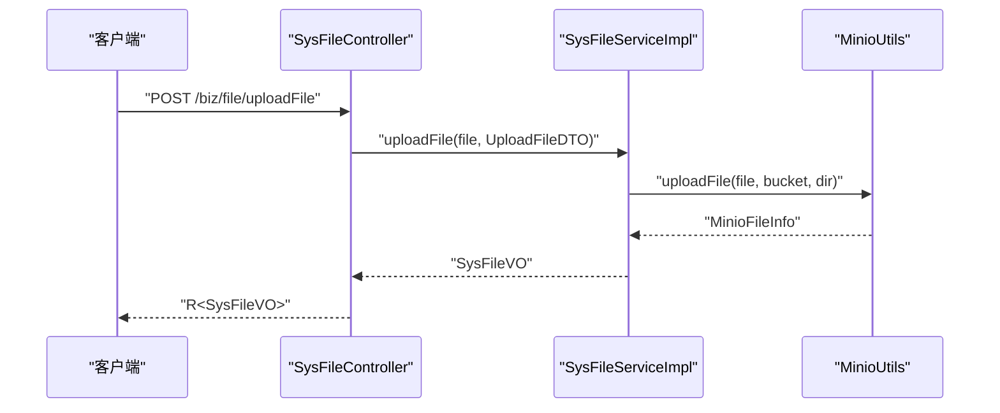
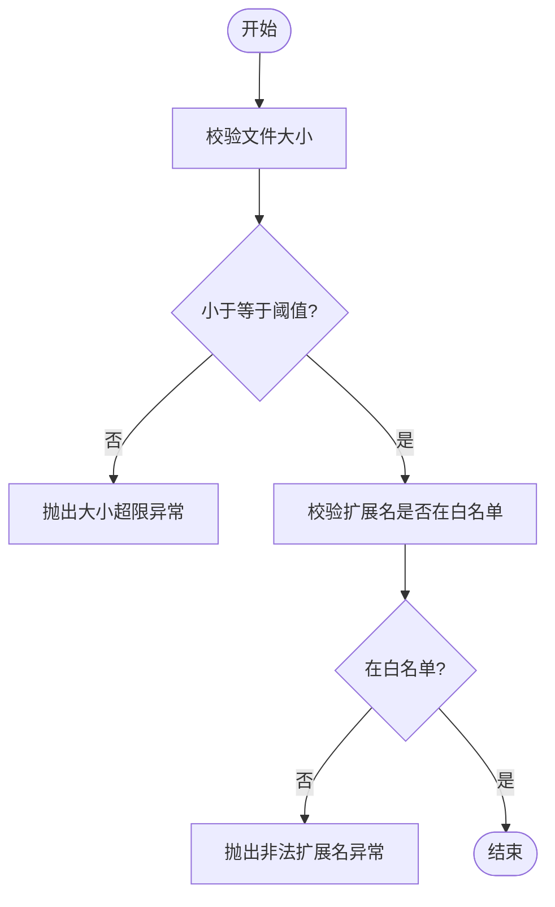
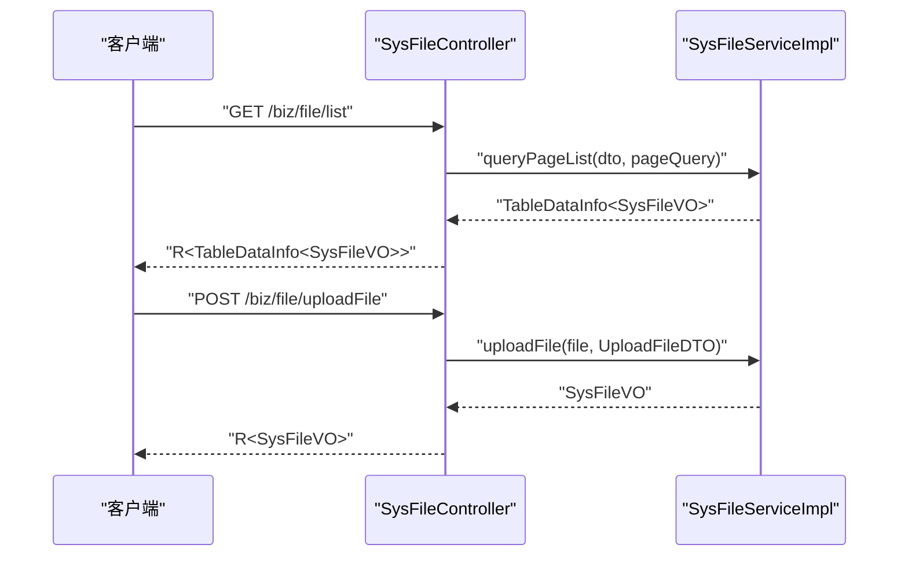
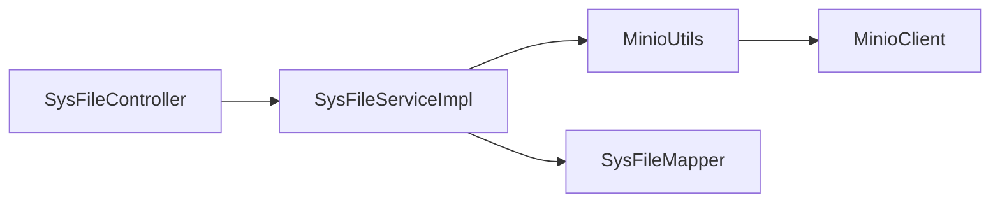

# 文件存储系统

<cite>
**本文引用的文件**
- [MinioConfig.java](file://blog-common/src/main/java/blog/common/config/minio/MinioConfig.java)
- [MinioProperties.java](file://blog-common/src/main/java/blog/common/config/minio/MinioProperties.java)
- [MinioUtils.java](file://blog-common/src/main/java/blog/common/utils/minio/MinioUtils.java)
- [SysFile.java](file://blog-biz/src/main/java/blog/biz/domain/SysFile.java)
- [SysFileServiceImpl.java](file://blog-biz/src/main/java/blog/biz/service/impl/SysFileServiceImpl.java)
- [SysFileMapper.java](file://blog-biz/src/main/java/blog/biz/mapper/SysFileMapper.java)
- [SysFileController.java](file://blog-admin/src/main/java/blog/web/controller/common/SysFileController.java)
- [SysFileDTO.java](file://blog-biz/src/main/java/blog/biz/domain/dto/SysFileDTO.java)
- [SysFileVO.java](file://blog-biz/src/main/java/blog/biz/domain/vo/SysFileVO.java)
- [UploadFileDTO.java](file://blog-biz/src/main/java/blog/biz/domain/dto/UploadFileDTO.java)
- [FileUploadUtils.java](file://blog-common/src/main/java/blog/common/utils/file/FileUploadUtils.java)
- [MimeTypeUtils.java](file://blog-common/src/main/java/blog/common/utils/file/MimeTypeUtils.java)
- [FileException.java](file://blog-common/src/main/java/blog/common/exception/file/FileException.java)
- [FileUploadException.java](file://blog-common/src/main/java/blog/common/exception/file/FileUploadException.java)
- [FileSizeLimitExceededException.java](file://blog-common/src/main/java/blog/common/exception/file/FileSizeLimitExceededException.java)
- [InvalidExtensionException.java](file://blog-common/src/main/java/blog/common/exception/file/InvalidExtensionException.java)
- [SysFileMapper.xml](file://blog-biz/src/main/resources/mapper/SysFileMapper.xml)
</cite>

## 目录
1. [简介](#简介)
2. [项目结构](#项目结构)
3. [核心组件](#核心组件)
4. [架构总览](#架构总览)
5. [详细组件分析](#详细组件分析)
6. [依赖分析](#依赖分析)
7. [性能考虑](#性能考虑)
8. [故障排查指南](#故障排查指南)
9. [结论](#结论)
10. [附录：API 接口与使用示例](#附录api-接口与使用示例)

## 简介
本文件存储系统基于 MinIO 对象存储，提供统一的文件上传、查询、删除与导出能力，并通过 SysFile 实体持久化文件元数据。系统采用分层架构：Web 控制器负责请求接入与鉴权；服务层完成业务编排与校验；工具层封装 MinIO 客户端操作；通用工具层提供文件类型与大小限制等基础能力。

## 项目结构
- 配置与工具层
  - MinIO 配置与客户端装配
  - MinIO 工具类（上传、下载、删除、列举、URL 生成）
  - 传统文件上传工具与 MIME 类型常量
- 业务层
  - SysFile 实体、Mapper、Service 及其实现
  - 文件上传 DTO/VO
- 控制器层
  - 文件控制器，提供列表、导出、详情、新增、编辑、删除、上传等接口

**图表来源**
- [MinioProperties.java:1-23](file://blog-common/src/main/java/blog/common/config/minio/MinioProperties.java#L1-L23)
- [MinioConfig.java:1-34](file://blog-common/src/main/java/blog/common/config/minio/MinioConfig.java#L1-L34)
- [MinioUtils.java:1-325](file://blog-common/src/main/java/blog/common/utils/minio/MinioUtils.java#L1-L325)
- [FileUploadUtils.java:1-225](file://blog-common/src/main/java/blog/common/utils/file/FileUploadUtils.java#L1-L225)
- [MimeTypeUtils.java:1-57](file://blog-common/src/main/java/blog/common/utils/file/MimeTypeUtils.java#L1-L57)
- [SysFile.java:1-95](file://blog-biz/src/main/java/blog/biz/domain/SysFile.java#L1-L95)
- [SysFileMapper.java:1-16](file://blog-biz/src/main/java/blog/biz/mapper/SysFileMapper.java#L1-L16)
- [SysFileServiceImpl.java:1-169](file://blog-biz/src/main/java/blog/biz/service/impl/SysFileServiceImpl.java#L1-L169)
- [SysFileController.java:1-123](file://blog-admin/src/main/java/blog/web/controller/common/SysFileController.java#L1-L123)

**章节来源**
- [MinioConfig.java:1-34](file://blog-common/src/main/java/blog/common/config/minio/MinioConfig.java#L1-L34)
- [MinioProperties.java:1-23](file://blog-common/src/main/java/blog/common/config/minio/MinioProperties.java#L1-L23)
- [MinioUtils.java:1-325](file://blog-common/src/main/java/blog/common/utils/minio/MinioUtils.java#L1-L325)
- [SysFileController.java:1-123](file://blog-admin/src/main/java/blog/web/controller/common/SysFileController.java#L1-L123)
- [SysFileServiceImpl.java:1-169](file://blog-biz/src/main/java/blog/biz/service/impl/SysFileServiceImpl.java#L1-L169)
- [SysFile.java:1-95](file://blog-biz/src/main/java/blog/biz/domain/SysFile.java#L1-L95)
- [SysFileMapper.java:1-16](file://blog-biz/src/main/java/blog/biz/mapper/SysFileMapper.java#L1-L16)
- [SysFileMapper.xml:1-24](file://blog-biz/src/main/resources/mapper/SysFileMapper.xml#L1-L24)
- [FileUploadUtils.java:1-225](file://blog-common/src/main/java/blog/common/utils/file/FileUploadUtils.java#L1-L225)
- [MimeTypeUtils.java:1-57](file://blog-common/src/main/java/blog/common/utils/file/MimeTypeUtils.java#L1-L57)

## 核心组件
- MinIO 配置与连接
  - 通过配置类装配 MinioClient，读取端点、访问密钥、密钥与默认桶名，启动时调用 listBuckets 验证连通性。
- MinioUtils 工具类
  - 提供 Bucket 检查/创建、文件上传（表单与本地文件）、文件信息查询、存在性判断、下载流获取、删除与批量删除、对象列举、预签名 URL 与永久 URL 生成等。
- SysFile 实体与服务
  - SysFile 记录文件元数据（原始名、后缀、类型、大小、桶名、对象名、URL、业务类型/ID、公开状态、删除标记等），服务层负责查询、分页、新增/更新、删除以及上传流程编排。
- 控制器接口
  - 提供文件列表、导出、详情、新增、编辑、删除、上传等 REST 接口，配合权限注解与日志注解。
- 文件类型与安全
  - 传统文件上传工具支持大小限制、文件名长度限制、扩展名白名单校验；MIME 常量定义图片、视频、压缩包等扩展名集合；异常体系覆盖文件大小超限、非法扩展名等场景。

**章节来源**
- [MinioConfig.java:17-31](file://blog-common/src/main/java/blog/common/config/minio/MinioConfig.java#L17-L31)
- [MinioUtils.java:54-182](file://blog-common/src/main/java/blog/common/utils/minio/MinioUtils.java#L54-L182)
- [SysFile.java:22-91](file://blog-biz/src/main/java/blog/biz/domain/SysFile.java#L22-L91)
- [SysFileServiceImpl.java:151-167](file://blog-biz/src/main/java/blog/biz/service/impl/SysFileServiceImpl.java#L151-L167)
- [SysFileController.java:46-121](file://blog-admin/src/main/java/blog/web/controller/common/SysFileController.java#L46-L121)
- [FileUploadUtils.java:92-126](file://blog-common/src/main/java/blog/common/utils/file/FileUploadUtils.java#L92-L126)
- [MimeTypeUtils.java:28-38](file://blog-common/src/main/java/blog/common/utils/file/MimeTypeUtils.java#L28-L38)

## 架构总览
系统采用典型的三层架构：表现层（控制器）、业务层（服务）、持久层（Mapper/实体）与基础设施层（MinIO 客户端）。控制器接收请求，服务层编排业务逻辑与校验，工具层封装底层存储交互，最终将结果以 VO 形式返回。

**图表来源**
- [SysFileController.java:38-121](file://blog-admin/src/main/java/blog/web/controller/common/SysFileController.java#L38-L121)
- [SysFileServiceImpl.java:38-167](file://blog-biz/src/main/java/blog/biz/service/impl/SysFileServiceImpl.java#L38-L167)
- [MinioUtils.java:26-321](file://blog-common/src/main/java/blog/common/utils/minio/MinioUtils.java#L26-L321)
- [SysFileMapper.java:13-15](file://blog-biz/src/main/java/blog/biz/mapper/SysFileMapper.java#L13-L15)
- [SysFile.java:20-91](file://blog-biz/src/main/java/blog/biz/domain/SysFile.java#L20-L91)

## 详细组件分析

### 组件一：MinIO 集成与连接管理
- 配置项
  - 从配置读取 endpoint、accessKey、secretKey、bucketName。
- 客户端装配
  - 使用 builder 模式构建 MinioClient，并在启动时调用 listBuckets 验证连接与认证。
- 连接验证
  - 成功打印连接成功日志，失败记录错误日志。

**图表来源**
- [MinioProperties.java:14-21](file://blog-common/src/main/java/blog/common/config/minio/MinioProperties.java#L14-L21)
- [MinioConfig.java:18-31](file://blog-common/src/main/java/blog/common/config/minio/MinioConfig.java#L18-L31)

**章节来源**
- [MinioProperties.java:1-23](file://blog-common/src/main/java/blog/common/config/minio/MinioProperties.java#L1-L23)
- [MinioConfig.java:17-31](file://blog-common/src/main/java/blog/common/config/minio/MinioConfig.java#L17-L31)

### 组件二：MinioUtils 工具类
- 功能清单
  - Bucket 操作：存在性检查、按需创建
  - 上传：支持 MultipartFile 与本地文件路径
  - 信息：统计、预签名 URL（默认 24 小时）、永久 URL（需公共可读）
  - 下载：返回 InputStream
  - 删除：单个与批量
  - 列举：支持前缀与递归
- 上传策略
  - 自动生成 UUID 对象名，保留原文件扩展名
  - 自动创建目标桶（若不存在）

**图表来源**
- [MinioUtils.java:26-321](file://blog-common/src/main/java/blog/common/utils/minio/MinioUtils.java#L26-L321)

**章节来源**
- [MinioUtils.java:54-182](file://blog-common/src/main/java/blog/common/utils/minio/MinioUtils.java#L54-L182)
- [MinioUtils.java:208-255](file://blog-common/src/main/java/blog/common/utils/minio/MinioUtils.java#L208-L255)
- [MinioUtils.java:266-288](file://blog-common/src/main/java/blog/common/utils/minio/MinioUtils.java#L266-L288)
- [MinioUtils.java:292-320](file://blog-common/src/main/java/blog/common/utils/minio/MinioUtils.java#L292-L320)

### 组件三：SysFile 实体设计
- 字段说明
  - 主键、原始文件名、后缀、内容类型、大小、桶名、对象名、URL、业务类型/ID、公开/删除标记、创建人与时间等。
- 设计要点
  - 与 MinIO 的对象模型一一对应，便于直接落库与回显。
  - 支持业务维度的分类与检索。

**图表来源**
- [SysFile.java:22-91](file://blog-biz/src/main/java/blog/biz/domain/SysFile.java#L22-L91)
- [SysFileMapper.xml:7-22](file://blog-biz/src/main/resources/mapper/SysFileMapper.xml#L7-L22)

**章节来源**
- [SysFile.java:22-91](file://blog-biz/src/main/java/blog/biz/domain/SysFile.java#L22-L91)
- [SysFileMapper.xml:7-22](file://blog-biz/src/main/resources/mapper/SysFileMapper.xml#L7-L22)

### 组件四：文件上传处理流程（服务层）
- 流程概览
  - 控制器接收文件与业务参数，构造上传目录（业务类型/业务ID），调用服务层上传方法。
  - 服务层委托 MinioUtils 完成上传，返回包含文件信息的 VO。
- 关键点
  - 上传目录由 UploadFileDTO.getDir() 生成，遵循“业务类型/业务ID”两级目录结构。
  - 上传后自动创建桶（若不存在），对象名为 UUID+原扩展名。

**图表来源**
- [SysFileController.java:111-121](file://blog-admin/src/main/java/blog/web/controller/common/SysFileController.java#L111-L121)
- [SysFileServiceImpl.java:151-167](file://blog-biz/src/main/java/blog/biz/service/impl/SysFileServiceImpl.java#L151-L167)
- [MinioUtils.java:85-111](file://blog-common/src/main/java/blog/common/utils/minio/MinioUtils.java#L85-L111)
- [UploadFileDTO.java:32-34](file://blog-biz/src/main/java/blog/biz/domain/dto/UploadFileDTO.java#L32-L34)

**章节来源**
- [SysFileController.java:111-121](file://blog-admin/src/main/java/blog/web/controller/common/SysFileController.java#L111-L121)
- [SysFileServiceImpl.java:151-167](file://blog-biz/src/main/java/blog/biz/service/impl/SysFileServiceImpl.java#L151-L167)
- [UploadFileDTO.java:32-34](file://blog-biz/src/main/java/blog/biz/domain/dto/UploadFileDTO.java#L32-L34)
- [MinioUtils.java:85-111](file://blog-common/src/main/java/blog/common/utils/minio/MinioUtils.java#L85-L111)

### 组件五：文件类型管理与安全控制
- 类型与大小限制
  - 传统文件上传工具提供默认最大大小与文件名长度限制，支持扩展名校验与异常抛出。
- MIME 类型常量
  - 定义图片、Flash、音视频、默认允许扩展名等集合，用于白名单校验。
- 异常体系
  - FileException、FileUploadException 作为基类，派生出大小超限、非法扩展名等具体异常。

**图表来源**
- [FileUploadUtils.java:167-193](file://blog-common/src/main/java/blog/common/utils/file/FileUploadUtils.java#L167-L193)
- [MimeTypeUtils.java:28-38](file://blog-common/src/main/java/blog/common/utils/file/MimeTypeUtils.java#L28-L38)
- [FileException.java:1-20](file://blog-common/src/main/java/blog/common/exception/file/FileException.java#L1-L20)
- [FileUploadException.java:1-20](file://blog-common/src/main/java/blog/common/exception/file/FileUploadException.java#L1-L20)
- [FileSizeLimitExceededException.java:1-15](file://blog-common/src/main/java/blog/common/exception/file/FileSizeLimitExceededException.java#L1-L15)
- [InvalidExtensionException.java:1-68](file://blog-common/src/main/java/blog/common/exception/file/InvalidExtensionException.java#L1-L68)

**章节来源**
- [FileUploadUtils.java:92-126](file://blog-common/src/main/java/blog/common/utils/file/FileUploadUtils.java#L92-L126)
- [FileUploadUtils.java:167-193](file://blog-common/src/main/java/blog/common/utils/file/FileUploadUtils.java#L167-L193)
- [MimeTypeUtils.java:28-38](file://blog-common/src/main/java/blog/common/utils/file/MimeTypeUtils.java#L28-L38)
- [InvalidExtensionException.java:17-22](file://blog-common/src/main/java/blog/common/exception/file/InvalidExtensionException.java#L17-L22)

### 组件六：控制器接口实现
- 接口清单
  - GET /biz/file/list：分页查询
  - POST /biz/file/export：导出 Excel
  - GET /biz/file/{id}：获取详情
  - POST /biz/file：新增
  - PUT /biz/file：修改
  - DELETE /biz/file/{ids}：批量删除
  - POST /biz/file/uploadFile：上传文件
- 权限与日志
  - 使用注解控制权限与操作日志。

**图表来源**
- [SysFileController.java:46-121](file://blog-admin/src/main/java/blog/web/controller/common/SysFileController.java#L46-L121)
- [SysFileServiceImpl.java:62-78](file://blog-biz/src/main/java/blog/biz/service/impl/SysFileServiceImpl.java#L62-L78)
- [SysFileServiceImpl.java:151-167](file://blog-biz/src/main/java/blog/biz/service/impl/SysFileServiceImpl.java#L151-L167)

**章节来源**
- [SysFileController.java:46-121](file://blog-admin/src/main/java/blog/web/controller/common/SysFileController.java#L46-L121)

## 依赖分析
- 组件耦合
  - SysFileController 依赖 ISysFileService；SysFileServiceImpl 依赖 MinioUtils 与 SysFileMapper；MinioUtils 依赖 MinioClient。
- 外部依赖
  - MinIO 客户端；Spring Web 与安全框架；MyBatis Plus；Hutool Bean 工具。
- 潜在风险
  - 上传流程未内置 MIME 类型二次校验，建议在服务层补充 contentType 与扩展名一致性校验。

**图表来源**
- [SysFileController.java:41-41](file://blog-admin/src/main/java/blog/web/controller/common/SysFileController.java#L41-L41)
- [SysFileServiceImpl.java:40-41](file://blog-biz/src/main/java/blog/biz/service/impl/SysFileServiceImpl.java#L40-L41)
- [MinioUtils.java:28-35](file://blog-common/src/main/java/blog/common/utils/minio/MinioUtils.java#L28-L35)

**章节来源**
- [SysFileController.java:38-121](file://blog-admin/src/main/java/blog/web/controller/common/SysFileController.java#L38-L121)
- [SysFileServiceImpl.java:38-169](file://blog-biz/src/main/java/blog/biz/service/impl/SysFileServiceImpl.java#L38-L169)
- [MinioUtils.java:26-35](file://blog-common/src/main/java/blog/common/utils/minio/MinioUtils.java#L26-L35)

## 性能考虑
- 上传性能
  - MinioUtils 在上传时使用流式写入，避免大文件内存占用。
  - 预签名 URL 默认有效期较短（24 小时），建议根据业务场景调整。
- 列举与查询
  - listObjects 支持前缀与递归，建议仅在必要时开启递归，减少遍历开销。
- 并发与幂等
  - 控制器使用防重复提交注解，建议结合业务 ID 做去重处理。

[本节为通用建议，无需特定文件来源]

## 故障排查指南
- MinIO 连接失败
  - 检查配置项 endpoint、accessKey、secretKey、bucketName 是否正确；查看启动日志中连接验证输出。
- 上传失败
  - 检查桶是否存在且具备写权限；确认对象名生成逻辑与目录层级。
- 文件不存在
  - 使用 isFileExist 或 statObject 判断；核对 objectName 与 bucket。
- 导出异常
  - 确认查询条件与分页参数；检查导出工具链路。

**章节来源**
- [MinioConfig.java:24-29](file://blog-common/src/main/java/blog/common/config/minio/MinioConfig.java#L24-L29)
- [MinioUtils.java:190-199](file://blog-common/src/main/java/blog/common/utils/minio/MinioUtils.java#L190-L199)
- [SysFileController.java:55-62](file://blog-admin/src/main/java/blog/web/controller/common/SysFileController.java#L55-L62)

## 结论
该文件存储系统以 MinIO 为核心，结合实体持久化与控制器接口，提供了完整的企业级文件管理能力。通过目录结构与对象命名策略实现了良好的可维护性；服务层与工具层分离提升了可测试性与复用性。建议后续增强上传阶段的 MIME 校验与病毒扫描能力，进一步完善安全体系。

[本节为总结，无需特定文件来源]

## 附录：API 接口与使用示例

- 文件列表
  - 方法：GET
  - 路径：/biz/file/list
  - 权限：biz:file:list
  - 参数：SysFileDTO + PageQuery
  - 返回：TableDataInfo<SysFileVO>

- 导出文件
  - 方法：POST
  - 路径：/biz/file/export
  - 权限：biz:file:export
  - 参数：SysFileDTO
  - 返回：Excel 文件

- 获取文件详情
  - 方法：GET
  - 路径：/biz/file/{id}
  - 权限：biz:file:query
  - 返回：R<SysFileVO>

- 新增文件
  - 方法：POST
  - 路径：/biz/file
  - 权限：biz:file:add
  - 参数：SysFileDTO
  - 返回：R<Boolean>

- 修改文件
  - 方法：PUT
  - 路径：/biz/file
  - 权限：biz:file:edit
  - 参数：SysFileDTO
  - 返回：R<Boolean>

- 删除文件
  - 方法：DELETE
  - 路径：/biz/file/{ids}
  - 权限：biz:file:remove
  - 参数：ids（路径变量）
  - 返回：R<Void>

- 上传文件
  - 方法：POST
  - 路径：/biz/file/uploadFile
  - 权限：biz:file:add
  - 参数：multipart/form-data
    - file：必填，文件
    - bizType：必填，业务类型
    - bizId：必填，业务ID
  - 返回：R<SysFileVO>

- 示例（curl）
  - 上传文件
    - curl -X POST http://localhost:8080/biz/file/uploadFile -F "file=@/path/to/image.jpg" -F "bizType=USER_AVATAR" -F "bizId=1001"
  - 获取列表
    - curl "http://localhost:8080/biz/file/list?pageNum=1&pageSize=10&fileName=image"

**章节来源**
- [SysFileController.java:46-121](file://blog-admin/src/main/java/blog/web/controller/common/SysFileController.java#L46-L121)