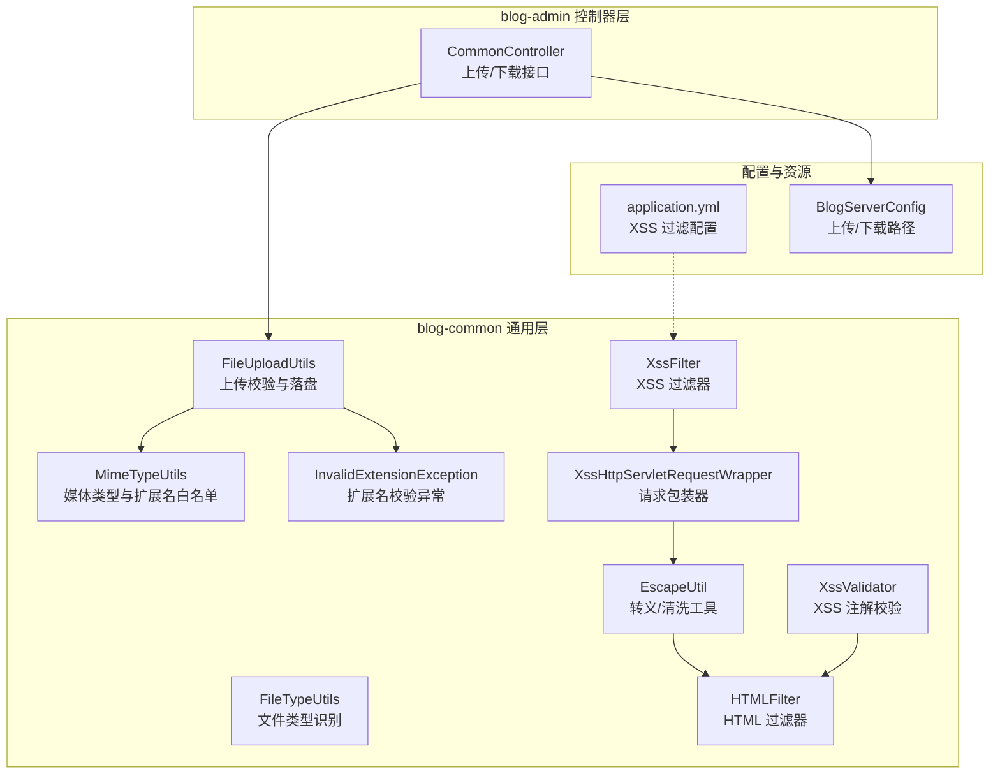
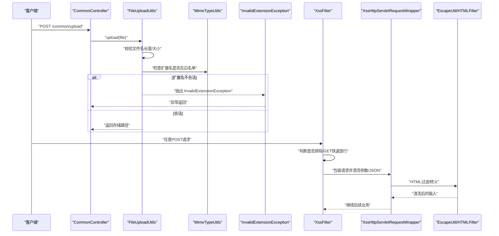
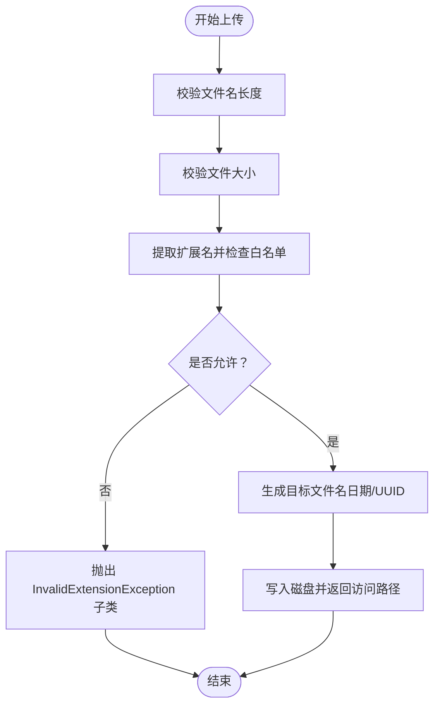
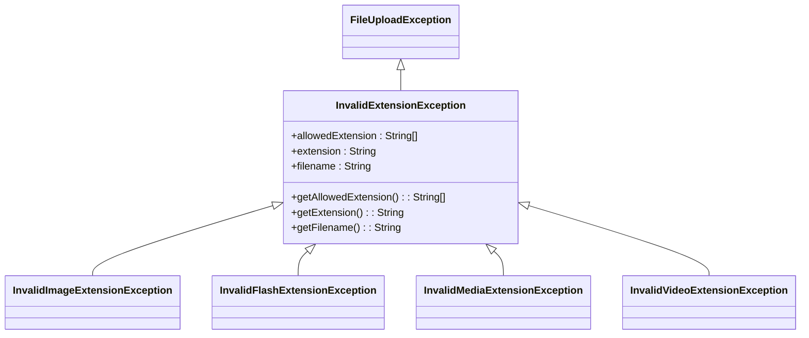
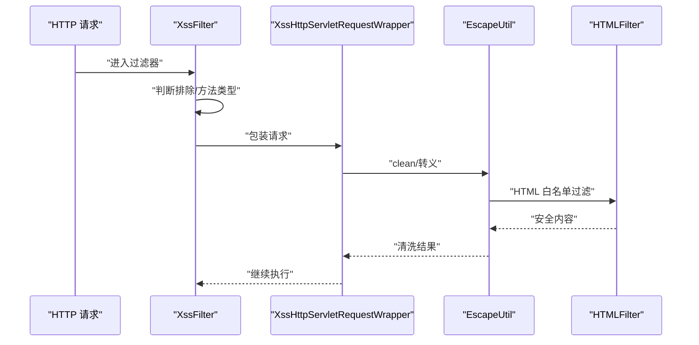
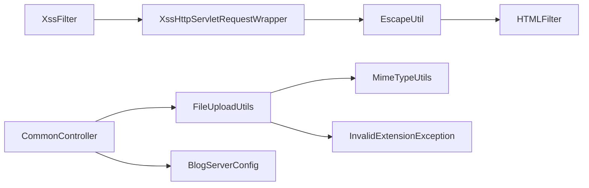

# 恶意文件检测

<cite>
**本文引用的文件**
- [InvalidExtensionException.java](file://blog-common/src/main/java/blog/common/exception/file/InvalidExtensionException.java)
- [FileUploadException.java](file://blog-common/src/main/java/blog/common/exception/file/FileUploadException.java)
- [FileUploadUtils.java](file://blog-common/src/main/java/blog/common/utils/file/FileUploadUtils.java)
- [MimeTypeUtils.java](file://blog-common/src/main/java/blog/common/utils/file/MimeTypeUtils.java)
- [FileTypeUtils.java](file://blog-common/src/main/java/blog/common/utils/file/FileTypeUtils.java)
- [XssFilter.java](file://blog-common/src/main/java/blog/common/filter/XssFilter.java)
- [XssHttpServletRequestWrapper.java](file://blog-common/src/main/java/blog/common/filter/XssHttpServletRequestWrapper.java)
- [Xss.java](file://blog-common/src/main/java/blog/common/xss/Xss.java)
- [XssValidator.java](file://blog-common/src/main/java/blog/common/xss/XssValidator.java)
- [EscapeUtil.java](file://blog-common/src/main/java/blog/common/utils/html/EscapeUtil.java)
- [HTMLFilter.java](file://blog-common/src/main/java/blog/common/utils/html/HTMLFilter.java)
- [CommonController.java](file://blog-admin/src/main/java/blog/web/controller/common/CommonController.java)
- [application.yml](file://blog-admin/src/main/resources/application.yml)
- [BlogServerConfig.java](file://blog-common/src/main/java/blog/common/config/BlogServerConfig.java)
</cite>

## 目录
1. [简介](#简介)
2. [项目结构](#项目结构)
3. [核心组件](#核心组件)
4. [架构总览](#架构总览)
5. [详细组件分析](#详细组件分析)
6. [依赖分析](#依赖分析)
7. [性能考虑](#性能考虑)
8. [故障排查指南](#故障排查指南)
9. [结论](#结论)
10. [附录](#附录)

## 简介
本技术文档围绕“恶意文件检测”主题，系统梳理并解释本项目的文件上传与下载安全控制机制，涵盖以下方面：
- 文件内容与扩展名校验：通过扩展名白名单、大小限制、内容类型推断等手段，阻止非法或高风险文件进入系统。
- XSS 攻击防护：基于过滤器与输入清洗的多层防护，覆盖参数、JSON 请求体与输出编码。
- 异常处理机制：InvalidExtensionException 及其子类在不同文件类型场景下的抛出与定位。
- 集成方案：与第三方扫描工具的集成思路、实时检测与黑名单管理的可扩展性。
- 最佳实践与安全加固建议。

## 项目结构
本项目采用多模块分层设计，恶意文件检测相关能力主要分布在以下模块与包中：
- blog-common：通用工具与安全组件（文件上传工具、媒体类型、XSS 过滤、异常体系）
- blog-admin：控制器层，提供通用上传/下载接口
- blog-framework：安全与配置层（未直接参与恶意文件检测，但为整体安全提供支撑）

图示来源
- [CommonController.java:67-116](file://blog-admin/src/main/java/blog/web/controller/common/CommonController.java#L67-L116)
- [FileUploadUtils.java:92-126](file://blog-common/src/main/java/blog/common/utils/file/FileUploadUtils.java#L92-L126)
- [MimeTypeUtils.java:28-38](file://blog-common/src/main/java/blog/common/utils/file/MimeTypeUtils.java#L28-L38)
- [XssFilter.java:40-50](file://blog-common/src/main/java/blog/common/filter/XssFilter.java#L40-L50)
- [XssHttpServletRequestWrapper.java:30-87](file://blog-common/src/main/java/blog/common/filter/XssHttpServletRequestWrapper.java#L30-L87)
- [XssValidator.java:15-24](file://blog-common/src/main/java/blog/common/xss/XssValidator.java#L15-L24)
- [HTMLFilter.java:102-133](file://blog-common/src/main/java/blog/common/utils/html/HTMLFilter.java#L102-L133)
- [EscapeUtil.java:54-56](file://blog-common/src/main/java/blog/common/utils/html/EscapeUtil.java#L54-L56)
- [application.yml:146-153](file://blog-admin/src/main/resources/application.yml#L146-L153)
- [BlogServerConfig.java:116-118](file://blog-common/src/main/java/blog/common/config/BlogServerConfig.java#L116-L118)

章节来源
- [CommonController.java:67-116](file://blog-admin/src/main/java/blog/web/controller/common/CommonController.java#L67-L116)
- [application.yml:146-153](file://blog-admin/src/main/resources/application.yml#L146-L153)

## 核心组件
- 文件上传工具与校验
  - FileUploadUtils：负责文件名长度限制、大小限制、扩展名校验、命名策略（日期目录+序列/UUID）、落盘与路径生成。
  - MimeTypeUtils：定义图片、Flash、音视频、默认允许扩展名白名单等。
  - FileTypeUtils：基于文件名与文件头字节识别文件类型，辅助扩展名校验。
- 异常体系
  - FileUploadException：文件上传异常基类。
  - InvalidExtensionException：扩展名不合法异常；包含多种类型专用子类（图片、Flash、音视频等），便于精细化提示与处理。
- XSS 防护
  - XssFilter：过滤器入口，支持排除 URL、GET/DELETE 快速放行、对非 GET 的请求包装清洗。
  - XssHttpServletRequestWrapper：重写参数与 JSON 输入流，调用 EscapeUtil 清洗。
  - EscapeUtil + HTMLFilter：提供 HTML 过滤与转义能力。
  - XssValidator + Xss 注解：对字段/参数进行 HTML 内容校验。
- 控制器与配置
  - CommonController：提供通用上传/下载接口，内部调用文件工具与配置。
  - application.yml：开启 XSS 过滤、配置排除 URL 与匹配范围。
  - BlogServerConfig：统一管理上传/下载路径。

章节来源
- [FileUploadUtils.java:92-126](file://blog-common/src/main/java/blog/common/utils/file/FileUploadUtils.java#L92-L126)
- [MimeTypeUtils.java:28-38](file://blog-common/src/main/java/blog/common/utils/file/MimeTypeUtils.java#L28-L38)
- [FileTypeUtils.java:36-42](file://blog-common/src/main/java/blog/common/utils/file/FileTypeUtils.java#L36-L42)
- [FileUploadException.java:11-28](file://blog-common/src/main/java/blog/common/exception/file/FileUploadException.java#L11-L28)
- [InvalidExtensionException.java:10-22](file://blog-common/src/main/java/blog/common/exception/file/InvalidExtensionException.java#L10-L22)
- [XssFilter.java:40-60](file://blog-common/src/main/java/blog/common/filter/XssFilter.java#L40-L60)
- [XssHttpServletRequestWrapper.java:30-97](file://blog-common/src/main/java/blog/common/filter/XssHttpServletRequestWrapper.java#L30-L97)
- [EscapeUtil.java:54-56](file://blog-common/src/main/java/blog/common/utils/html/EscapeUtil.java#L54-L56)
- [HTMLFilter.java:102-133](file://blog-common/src/main/java/blog/common/utils/html/HTMLFilter.java#L102-L133)
- [XssValidator.java:15-24](file://blog-common/src/main/java/blog/common/xss/XssValidator.java#L15-L24)
- [Xss.java:16-27](file://blog-common/src/main/java/blog/common/xss/Xss.java#L16-L27)
- [CommonController.java:67-116](file://blog-admin/src/main/java/blog/web/controller/common/CommonController.java#L67-L116)
- [application.yml:146-153](file://blog-admin/src/main/resources/application.yml#L146-L153)
- [BlogServerConfig.java:116-118](file://blog-common/src/main/java/blog/common/config/BlogServerConfig.java#L116-L118)

## 架构总览
下图展示从客户端到服务端的关键交互路径，以及恶意文件检测与 XSS 防护在各环节的落点。

图示来源
- [CommonController.java:67-84](file://blog-admin/src/main/java/blog/web/controller/common/CommonController.java#L67-L84)
- [FileUploadUtils.java:92-126](file://blog-common/src/main/java/blog/common/utils/file/FileUploadUtils.java#L92-L126)
- [MimeTypeUtils.java:28-38](file://blog-common/src/main/java/blog/common/utils/file/MimeTypeUtils.java#L28-L38)
- [InvalidExtensionException.java:10-22](file://blog-common/src/main/java/blog/common/exception/file/InvalidExtensionException.java#L10-L22)
- [XssFilter.java:40-60](file://blog-common/src/main/java/blog/common/filter/XssFilter.java#L40-L60)
- [XssHttpServletRequestWrapper.java:30-97](file://blog-common/src/main/java/blog/common/filter/XssHttpServletRequestWrapper.java#L30-L97)
- [EscapeUtil.java:54-56](file://blog-common/src/main/java/blog/common/utils/html/EscapeUtil.java#L54-L56)

## 详细组件分析

### 文件上传与扩展名校验
- 校验流程
  - 文件名长度限制与大小限制先行。
  - 通过扩展名白名单校验，若不匹配则抛出对应类型的 InvalidExtensionException 子类。
  - 支持自定义命名策略（日期目录+序列或 UUID），并生成对外访问路径。
- 关键点
  - 默认白名单覆盖图片、办公文档、压缩包、视频、PDF 等常用类型。
  - 当扩展名为空时，回退至 MIME Content-Type 推断，提升准确性。
  - 路径生成遵循配置的 profile，确保上传/下载目录可控。

图示来源
- [FileUploadUtils.java:114-126](file://blog-common/src/main/java/blog/common/utils/file/FileUploadUtils.java#L114-L126)
- [FileUploadUtils.java:167-193](file://blog-common/src/main/java/blog/common/utils/file/FileUploadUtils.java#L167-L193)
- [MimeTypeUtils.java:28-38](file://blog-common/src/main/java/blog/common/utils/file/MimeTypeUtils.java#L28-L38)
- [BlogServerConfig.java:116-118](file://blog-common/src/main/java/blog/common/config/BlogServerConfig.java#L116-L118)

章节来源
- [FileUploadUtils.java:92-126](file://blog-common/src/main/java/blog/common/utils/file/FileUploadUtils.java#L92-L126)
- [MimeTypeUtils.java:28-38](file://blog-common/src/main/java/blog/common/utils/file/MimeTypeUtils.java#L28-L38)
- [BlogServerConfig.java:116-118](file://blog-common/src/main/java/blog/common/config/BlogServerConfig.java#L116-L118)

### InvalidExtensionException 异常处理机制
- 异常分类
  - 提供图片、Flash、音视频、通用扩展名不合法等专用子类，便于前端/日志区分与精准提示。
- 抛出时机
  - 在扩展名不在允许集合时抛出，结合具体 allowedExtension 与实际 extension 输出明确提示。
- 处理建议
  - 前端根据 allowedExtension 展示可接受的文件类型列表。
  - 后端记录 filename、extension、allowedExtension 以便审计与复现。

图示来源
- [FileUploadException.java:11-28](file://blog-common/src/main/java/blog/common/exception/file/FileUploadException.java#L11-L28)
- [InvalidExtensionException.java:10-66](file://blog-common/src/main/java/blog/common/exception/file/InvalidExtensionException.java#L10-L66)

章节来源
- [InvalidExtensionException.java:10-66](file://blog-common/src/main/java/blog/common/exception/file/InvalidExtensionException.java#L10-L66)

### XSS 防护机制
- 过滤器与包装器
  - XssFilter：初始化时读取排除 URL 列表；对非 GET/DELETE 请求进行包装。
  - XssHttpServletRequestWrapper：重写 getParameterValues 与 getInputStream，调用 EscapeUtil.clean 清洗。
- 输入过滤与输出编码
  - EscapeUtil.clean 使用 HTMLFilter 对输入进行白名单过滤与协议清理。
  - HTMLFilter 定义允许标签、属性、协议与实体，确保输出安全。
- 注解级校验
  - Xss 注解 + XssValidator：对字段进行 HTML 内容校验，避免持久化危险内容。

图示来源
- [XssFilter.java:40-60](file://blog-common/src/main/java/blog/common/filter/XssFilter.java#L40-L60)
- [XssHttpServletRequestWrapper.java:30-97](file://blog-common/src/main/java/blog/common/filter/XssHttpServletRequestWrapper.java#L30-L97)
- [EscapeUtil.java:54-56](file://blog-common/src/main/java/blog/common/utils/html/EscapeUtil.java#L54-L56)
- [HTMLFilter.java:102-133](file://blog-common/src/main/java/blog/common/utils/html/HTMLFilter.java#L102-L133)
- [XssValidator.java:15-24](file://blog-common/src/main/java/blog/common/xss/XssValidator.java#L15-L24)
- [Xss.java:16-27](file://blog-common/src/main/java/blog/common/xss/Xss.java#L16-L27)

章节来源
- [XssFilter.java:40-60](file://blog-common/src/main/java/blog/common/filter/XssFilter.java#L40-L60)
- [XssHttpServletRequestWrapper.java:30-97](file://blog-common/src/main/java/blog/common/filter/XssHttpServletRequestWrapper.java#L30-L97)
- [EscapeUtil.java:54-56](file://blog-common/src/main/java/blog/common/utils/html/EscapeUtil.java#L54-L56)
- [HTMLFilter.java:102-133](file://blog-common/src/main/java/blog/common/utils/html/HTMLFilter.java#L102-L133)
- [XssValidator.java:15-24](file://blog-common/src/main/java/blog/common/xss/XssValidator.java#L15-L24)
- [Xss.java:16-27](file://blog-common/src/main/java/blog/common/xss/Xss.java#L16-L27)

### 下载与路径管理
- 下载前校验
  - CommonController 在下载前调用工具校验文件名合法性，防止路径穿越与非法文件名。
- 路径配置
  - BlogServerConfig 统一提供上传/下载/头像/导入等路径，application.yml 中配置 profile。

章节来源
- [CommonController.java:44-62](file://blog-admin/src/main/java/blog/web/controller/common/CommonController.java#L44-L62)
- [BlogServerConfig.java:108-118](file://blog-common/src/main/java/blog/common/config/BlogServerConfig.java#L108-L118)
- [application.yml:2-10](file://blog-admin/src/main/resources/application.yml#L2-L10)

## 依赖分析
- 组件耦合
  - FileUploadUtils 依赖 MimeTypeUtils 与异常体系，耦合度低、职责清晰。
  - XSS 过滤链路由 XssFilter → XssHttpServletRequestWrapper → EscapeUtil/HTMLFilter 组成，层次分明。
- 外部依赖
  - Spring MVC（MultipartFile、过滤器链）、Apache Commons IO（文件名处理）、Spring Web（HTTP 头与媒体类型）。

图示来源
- [FileUploadUtils.java:92-126](file://blog-common/src/main/java/blog/common/utils/file/FileUploadUtils.java#L92-L126)
- [MimeTypeUtils.java:28-38](file://blog-common/src/main/java/blog/common/utils/file/MimeTypeUtils.java#L28-L38)
- [InvalidExtensionException.java:10-22](file://blog-common/src/main/java/blog/common/exception/file/InvalidExtensionException.java#L10-L22)
- [XssFilter.java:40-60](file://blog-common/src/main/java/blog/common/filter/XssFilter.java#L40-L60)
- [XssHttpServletRequestWrapper.java:30-97](file://blog-common/src/main/java/blog/common/filter/XssHttpServletRequestWrapper.java#L30-L97)
- [EscapeUtil.java:54-56](file://blog-common/src/main/java/blog/common/utils/html/EscapeUtil.java#L54-L56)
- [HTMLFilter.java:102-133](file://blog-common/src/main/java/blog/common/utils/html/HTMLFilter.java#L102-L133)
- [CommonController.java:67-116](file://blog-admin/src/main/java/blog/web/controller/common/CommonController.java#L67-L116)
- [BlogServerConfig.java:116-118](file://blog-common/src/main/java/blog/common/config/BlogServerConfig.java#L116-L118)

## 性能考虑
- 上传性能
  - 使用 transferTo 写入磁盘，避免内存驻留大文件。
  - 默认最大文件大小与文件名长度限制可按业务调整，避免拒绝服务。
- XSS 过滤
  - 仅对非 GET/DELETE 请求进行包装与清洗，减少对只读请求的影响。
  - JSON 请求体清洗按需进行，避免对非 JSON 类型造成额外开销。
- 建议
  - 对热点上传路径启用异步落盘与对象存储（如 MinIO）分流。
  - 对频繁的白名单匹配可引入缓存或预编译正则，降低 CPU 开销。

## 故障排查指南
- 扩展名不合法
  - 现象：上传报错，提示允许的扩展名列表。
  - 排查：确认 allowedExtension 与实际扩展名大小写、是否为空扩展名导致回退 MIME。
  - 参考：[FileUploadUtils.java:167-193](file://blog-common/src/main/java/blog/common/utils/file/FileUploadUtils.java#L167-L193)、[MimeTypeUtils.java:28-38](file://blog-common/src/main/java/blog/common/utils/file/MimeTypeUtils.java#L28-L38)
- 下载失败或路径异常
  - 现象：下载报非法文件名。
  - 排查：确认下载前校验逻辑与路径配置，检查 profile 与下载路径拼接。
  - 参考：[CommonController.java:44-62](file://blog-admin/src/main/java/blog/web/controller/common/CommonController.java#L44-L62)、[BlogServerConfig.java:108-118](file://blog-common/src/main/java/blog/common/config/BlogServerConfig.java#L108-L118)
- XSS 过滤误伤
  - 现象：富文本编辑器内容被过滤。
  - 排查：检查排除 URL 列表、是否为 GET/DELETE 方法、JSON 清洗策略。
  - 参考：[application.yml:146-153](file://blog-admin/src/main/resources/application.yml#L146-L153)、[XssFilter.java:40-60](file://blog-common/src/main/java/blog/common/filter/XssFilter.java#L40-L60)、[XssHttpServletRequestWrapper.java:30-97](file://blog-common/src/main/java/blog/common/filter/XssHttpServletRequestWrapper.java#L30-L97)

章节来源
- [FileUploadUtils.java:167-193](file://blog-common/src/main/java/blog/common/utils/file/FileUploadUtils.java#L167-L193)
- [MimeTypeUtils.java:28-38](file://blog-common/src/main/java/blog/common/utils/file/MimeTypeUtils.java#L28-L38)
- [CommonController.java:44-62](file://blog-admin/src/main/java/blog/web/controller/common/CommonController.java#L44-L62)
- [BlogServerConfig.java:108-118](file://blog-common/src/main/java/blog/common/config/BlogServerConfig.java#L108-L118)
- [application.yml:146-153](file://blog-admin/src/main/resources/application.yml#L146-L153)
- [XssFilter.java:40-60](file://blog-common/src/main/java/blog/common/filter/XssFilter.java#L40-L60)
- [XssHttpServletRequestWrapper.java:30-97](file://blog-common/src/main/java/blog/common/filter/XssHttpServletRequestWrapper.java#L30-L97)

## 结论
本项目通过“白名单扩展名 + 大小/长度限制 + 输入清洗 + 输出过滤”的组合拳，构建了较为完善的恶意文件检测与 XSS 防护体系。InvalidExtensionException 的细粒度分类提升了问题定位与用户体验；XssFilter 与 HTMLFilter 的协同确保了输入与输出的安全性。建议在生产环境中结合对象存储、第三方病毒扫描与黑名单策略进一步强化安全防线。

## 附录

### 集成方案与最佳实践
- 第三方扫描工具集成
  - 方案：在 FileUploadUtils 成功落盘后，触发异步扫描任务，对接第三方引擎（如 ClamAV、VirusTotal API 或本地引擎）。
  - 关键点：扫描结果与上传结果解耦，失败不影响用户提交体验；扫描失败应记录并告警。
- 实时检测机制
  - 建议：对图片/文档/压缩包等高风险类型启用实时扫描；对视频/音频可采用抽样或二次扫描策略。
- 黑名单管理
  - 建议：维护扩展名与 MIME 的黑名单，结合 IP/UA/行为特征进行动态封禁；定期更新规则并审计命中情况。
- 安全加固建议
  - 上传目录权限最小化、禁止执行权限；对上传文件进行二次校验（如文件头字节）。
  - 输出侧统一进行 HTML/JS/CSS 编码，避免反射型 XSS。
  - 严格区分富文本与纯文本场景，富文本仅允许白名单标签与属性。
  - 记录上传/下载与扫描日志，保留证据链。