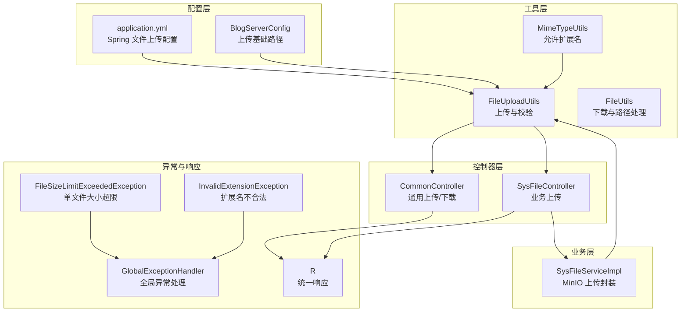
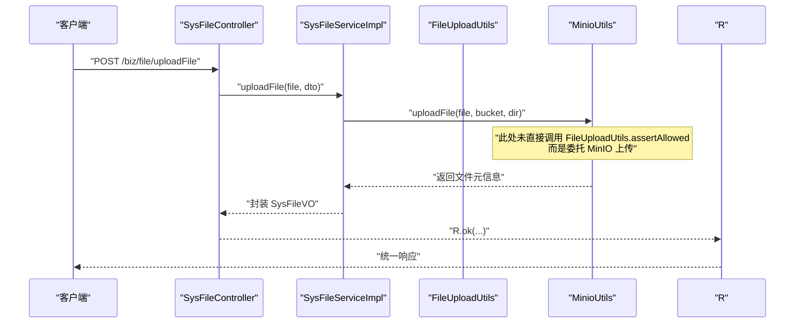
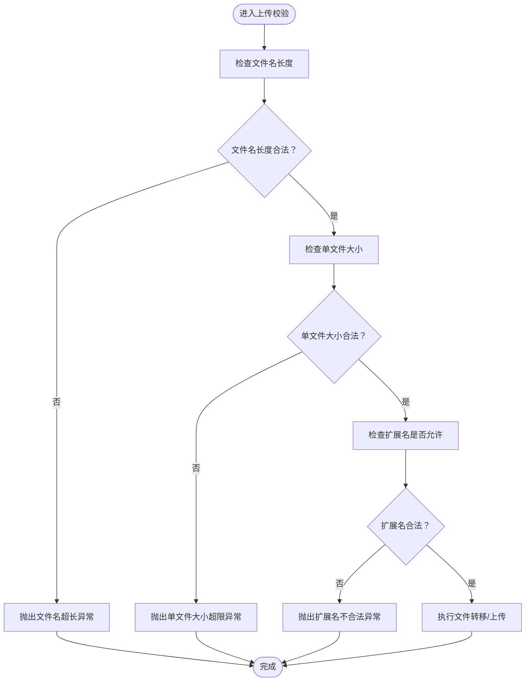
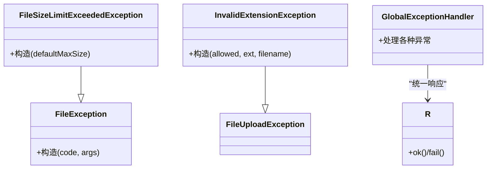
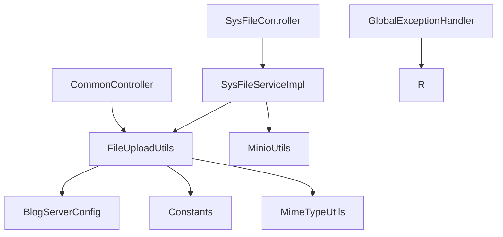

# 文件大小限制

<cite>
**本文引用的文件**
- [FileSizeLimitExceededException.java](file://blog-common/src/main/java/blog/common/exception/file/FileSizeLimitExceededException.java)
- [FileUploadUtils.java](file://blog-common/src/main/java/blog/common/utils/file/FileUploadUtils.java)
- [FileUtils.java](file://blog-common/src/main/java/blog/common/utils/file/FileUtils.java)
- [BlogServerConfig.java](file://blog-common/src/main/java/blog/common/config/BlogServerConfig.java)
- [application.yml](file://blog-admin/src/main/resources/application.yml)
- [Constants.java](file://blog-common/src/main/java/blog/common/constant/Constants.java)
- [MimeTypeUtils.java](file://blog-common/src/main/java/blog/common/utils/file/MimeTypeUtils.java)
- [InvalidExtensionException.java](file://blog-common/src/main/java/blog/common/exception/file/InvalidExtensionException.java)
- [SysFileController.java](file://blog-admin/src/main/java/blog/web/controller/common/SysFileController.java)
- [SysFileServiceImpl.java](file://blog-biz/src/main/java/blog/biz/service/impl/SysFileServiceImpl.java)
- [CommonController.java](file://blog-admin/src/main/java/blog/web/controller/common/CommonController.java)
- [GlobalExceptionHandler.java](file://blog-framework/src/main/java/blog/framework/web/exception/GlobalExceptionHandler.java)
- [R.java](file://blog-common/src/main/java/blog/common/base/resp/R.java)
</cite>

## 目录
1. [简介](#简介)
2. [项目结构](#项目结构)
3. [核心组件](#核心组件)
4. [架构总览](#架构总览)
5. [详细组件分析](#详细组件分析)
6. [依赖分析](#依赖分析)
7. [性能考量](#性能考量)
8. [故障排查指南](#故障排查指南)
9. [结论](#结论)
10. [附录](#附录)

## 简介
本文件围绕“文件大小限制”主题，系统梳理了后端在上传流程中的大小限制实现机制与异常处理策略。重点覆盖以下方面：
- 配置参数与阈值管理：默认单文件大小限制、文件名长度限制、总上传大小限制（由框架层控制）。
- 动态检查机制：在上传工具类中对单文件大小、文件类型扩展名进行即时校验。
- 异常体系：FileSizeLimitExceededException 的触发条件、参数含义与处理策略。
- 配置方法：全局配置、按文件类型配置、按业务场景配置。
- 上传流程应用：前端验证建议、后端验证、分片上传支持现状与建议。
- 最佳实践与性能考虑。

## 项目结构
与文件大小限制直接相关的模块与文件如下：
- 配置层：application.yml 中的 Spring Boot 文件上传配置；BlogServerConfig 提供上传基础路径。
- 工具层：FileUploadUtils 提供上传与校验逻辑；FileUtils 提供下载与路径处理；MimeTypeUtils 定义允许的扩展名集合。
- 控制器层：CommonController 与 SysFileController 提供通用上传与业务上传接口。
- 业务层：SysFileServiceImpl 将上传委托给 MinioUtils 并封装返回值。
- 异常与响应：FileSizeLimitExceededException、InvalidExtensionException、GlobalExceptionHandler、R 统一响应包装。

图表来源
- [application.yml:52-58](file://blog-admin/src/main/resources/application.yml#L52-L58)
- [BlogServerConfig.java:68-118](file://blog-common/src/main/java/blog/common/config/BlogServerConfig.java#L68-L118)
- [FileUploadUtils.java:25-193](file://blog-common/src/main/java/blog/common/utils/file/FileUploadUtils.java#L25-L193)
- [MimeTypeUtils.java:8-38](file://blog-common/src/main/java/blog/common/utils/file/MimeTypeUtils.java#L8-L38)
- [CommonController.java:67-116](file://blog-admin/src/main/java/blog/web/controller/common/CommonController.java#L67-L116)
- [SysFileController.java:111-121](file://blog-admin/src/main/java/blog/web/controller/common/SysFileController.java#L111-L121)
- [SysFileServiceImpl.java:151-167](file://blog-biz/src/main/java/blog/biz/service/impl/SysFileServiceImpl.java#L151-L167)
- [GlobalExceptionHandler.java:27-134](file://blog-framework/src/main/java/blog/framework/web/exception/GlobalExceptionHandler.java#L27-L134)
- [R.java:12-73](file://blog-common/src/main/java/blog/common/base/resp/R.java#L12-L73)

章节来源
- [application.yml:52-58](file://blog-admin/src/main/resources/application.yml#L52-L58)
- [BlogServerConfig.java:68-118](file://blog-common/src/main/java/blog/common/config/BlogServerConfig.java#L68-L118)
- [FileUploadUtils.java:25-193](file://blog-common/src/main/java/blog/common/utils/file/FileUploadUtils.java#L25-L193)
- [MimeTypeUtils.java:8-38](file://blog-common/src/main/java/blog/common/utils/file/MimeTypeUtils.java#L8-L38)
- [CommonController.java:67-116](file://blog-admin/src/main/java/blog/web/controller/common/CommonController.java#L67-L116)
- [SysFileController.java:111-121](file://blog-admin/src/main/java/blog/web/controller/common/SysFileController.java#L111-L121)
- [SysFileServiceImpl.java:151-167](file://blog-biz/src/main/java/blog/biz/service/impl/SysFileServiceImpl.java#L151-L167)
- [GlobalExceptionHandler.java:27-134](file://blog-framework/src/main/java/blog/framework/web/exception/GlobalExceptionHandler.java#L27-L134)
- [R.java:12-73](file://blog-common/src/main/java/blog/common/base/resp/R.java#L12-L73)

## 核心组件
- 默认单文件大小限制：在工具类中以常量形式定义默认最大值，并在校验阶段进行比较。
- 文件名长度限制：对原始文件名长度进行上限校验。
- 总上传大小限制：通过 Spring Boot 的 multipart 配置项控制，用于限制一次请求的总大小。
- 扩展名校验：根据允许的扩展名集合进行合法性检查，避免不被允许的类型。
- 异常抛出与处理：FileSizeLimitExceededException 与 InvalidExtensionException 在工具类中抛出；全局异常处理器统一捕获并返回标准响应。

章节来源
- [FileUploadUtils.java:25-193](file://blog-common/src/main/java/blog/common/utils/file/FileUploadUtils.java#L25-L193)
- [application.yml:52-58](file://blog-admin/src/main/resources/application.yml#L52-L58)
- [MimeTypeUtils.java:8-38](file://blog-common/src/main/java/blog/common/utils/file/MimeTypeUtils.java#L8-L38)
- [FileSizeLimitExceededException.java:8-14](file://blog-common/src/main/java/blog/common/exception/file/FileSizeLimitExceededException.java#L8-L14)
- [InvalidExtensionException.java:10-67](file://blog-common/src/main/java/blog/common/exception/file/InvalidExtensionException.java#L10-L67)
- [GlobalExceptionHandler.java:27-134](file://blog-framework/src/main/java/blog/framework/web/exception/GlobalExceptionHandler.java#L27-L134)
- [R.java:12-73](file://blog-common/src/main/java/blog/common/base/resp/R.java#L12-L73)

## 架构总览
下图展示了从控制器到业务与存储的上传路径，以及大小限制在各层的应用点。

图表来源
- [SysFileController.java:111-121](file://blog-admin/src/main/java/blog/web/controller/common/SysFileController.java#L111-L121)
- [SysFileServiceImpl.java:151-167](file://blog-biz/src/main/java/blog/biz/service/impl/SysFileServiceImpl.java#L151-L167)

章节来源
- [SysFileController.java:111-121](file://blog-admin/src/main/java/blog/web/controller/common/SysFileController.java#L111-L121)
- [SysFileServiceImpl.java:151-167](file://blog-biz/src/main/java/blog/biz/service/impl/SysFileServiceImpl.java#L151-L167)

## 详细组件分析

### 文件大小限制实现机制
- 默认单文件大小限制：工具类中存在默认最大值常量，在校验方法中与文件大小比较，超过即抛出异常。
- 文件名长度限制：对原始文件名长度进行上限校验，防止过长文件名导致路径或存储问题。
- 扩展名校验：根据允许的扩展名集合进行匹配，不匹配则抛出扩展名异常。
- 总上传大小限制：由 Spring Boot 的 multipart 配置项控制，用于限制一次请求的总大小，避免内存溢出或拒绝服务。

图表来源
- [FileUploadUtils.java:114-193](file://blog-common/src/main/java/blog/common/utils/file/FileUploadUtils.java#L114-L193)

章节来源
- [FileUploadUtils.java:25-193](file://blog-common/src/main/java/blog/common/utils/file/FileUploadUtils.java#L25-L193)
- [application.yml:52-58](file://blog-admin/src/main/resources/application.yml#L52-L58)
- [MimeTypeUtils.java:8-38](file://blog-common/src/main/java/blog/common/utils/file/MimeTypeUtils.java#L8-L38)

### 异常触发条件与处理策略
- FileSizeLimitExceededException
  - 触发条件：单文件大小超过默认阈值。
  - 参数含义：构造函数接收默认最大大小（以 MB 为单位）。
  - 处理策略：全局异常处理器捕获并返回统一响应，前端据此提示用户调整文件大小。
- InvalidExtensionException
  - 触发条件：文件扩展名不在允许集合内。
  - 处理策略：根据允许的扩展名集合类型，抛出对应的子类异常，便于前端区分提示。
- 全局异常处理
  - 全局异常处理器对各类异常进行统一包装，结合 R 统一响应模型返回。

图表来源
- [FileSizeLimitExceededException.java:8-14](file://blog-common/src/main/java/blog/common/exception/file/FileSizeLimitExceededException.java#L8-L14)
- [InvalidExtensionException.java:10-67](file://blog-common/src/main/java/blog/common/exception/file/InvalidExtensionException.java#L10-L67)
- [GlobalExceptionHandler.java:27-134](file://blog-framework/src/main/java/blog/framework/web/exception/GlobalExceptionHandler.java#L27-L134)
- [R.java:12-73](file://blog-common/src/main/java/blog/common/base/resp/R.java#L12-L73)

章节来源
- [FileSizeLimitExceededException.java:8-14](file://blog-common/src/main/java/blog/common/exception/file/FileSizeLimitExceededException.java#L8-L14)
- [InvalidExtensionException.java:10-67](file://blog-common/src/main/java/blog/common/exception/file/InvalidExtensionException.java#L10-L67)
- [GlobalExceptionHandler.java:27-134](file://blog-framework/src/main/java/blog/framework/web/exception/GlobalExceptionHandler.java#L27-L134)
- [R.java:12-73](file://blog-common/src/main/java/blog/common/base/resp/R.java#L12-L73)

### 配置方法与策略
- 全局配置
  - 单文件大小：通过 Spring Boot 配置项设置。
  - 总上传大小：通过 Spring Boot 配置项设置。
  - 上传基础路径：通过配置类提供，用于生成最终访问 URL。
- 按文件类型配置
  - 使用工具类提供的扩展名集合，针对图片、视频、媒体等类型传入不同的允许集合，从而实现差异化限制。
- 按业务场景配置
  - 控制器层可按业务类型选择不同的允许扩展名集合，或在业务服务层根据业务 ID/类型动态决定阈值与集合。
- 按用户角色配置
  - 可在控制器或服务层增加鉴权与阈值判断逻辑，例如管理员与普通用户的阈值不同。

章节来源
- [application.yml:52-58](file://blog-admin/src/main/resources/application.yml#L52-L58)
- [BlogServerConfig.java:68-118](file://blog-common/src/main/java/blog/common/config/BlogServerConfig.java#L68-L118)
- [FileUploadUtils.java:92-126](file://blog-common/src/main/java/blog/common/utils/file/FileUploadUtils.java#L92-L126)
- [MimeTypeUtils.java:8-38](file://blog-common/src/main/java/blog/common/utils/file/MimeTypeUtils.java#L8-L38)

### 上传流程中的应用
- 前端验证建议
  - 在前端对文件大小与扩展名进行预校验，减少无效请求。
  - 对于大文件，建议采用分片上传并在前端展示进度。
- 后端验证
  - 通用上传接口与业务上传接口均会调用工具类进行大小与扩展名校验。
  - 若使用 MinIO 存储，当前业务层直接委托 MinIO 上传，未显式调用工具类校验，可在业务层补充校验。
- 分片上传支持
  - 当前代码未体现分片上传逻辑，若需支持，应在控制器层引入分片参数与合并策略，并在工具层或业务层补充累计大小校验。

章节来源
- [CommonController.java:67-116](file://blog-admin/src/main/java/blog/web/controller/common/CommonController.java#L67-L116)
- [SysFileController.java:111-121](file://blog-admin/src/main/java/blog/web/controller/common/SysFileController.java#L111-L121)
- [SysFileServiceImpl.java:151-167](file://blog-biz/src/main/java/blog/biz/service/impl/SysFileServiceImpl.java#L151-L167)
- [FileUploadUtils.java:167-193](file://blog-common/src/main/java/blog/common/utils/file/FileUploadUtils.java#L167-L193)

## 依赖分析
- 组件耦合
  - FileUploadUtils 依赖配置类与常量类，负责上传与校验。
  - 控制器层依赖服务层，服务层依赖 MinIO 工具与上传工具。
  - 全局异常处理器与统一响应模型贯穿整个流程。
- 外部依赖
  - Spring Boot 的 multipart 配置项用于限制总上传大小。
  - MinIO 客户端用于对象存储上传。

图表来源
- [FileUploadUtils.java:25-193](file://blog-common/src/main/java/blog/common/utils/file/FileUploadUtils.java#L25-L193)
- [BlogServerConfig.java:68-118](file://blog-common/src/main/java/blog/common/config/BlogServerConfig.java#L68-L118)
- [Constants.java:140-141](file://blog-common/src/main/java/blog/common/constant/Constants.java#L140-L141)
- [MimeTypeUtils.java:8-38](file://blog-common/src/main/java/blog/common/utils/file/MimeTypeUtils.java#L8-L38)
- [CommonController.java:67-116](file://blog-admin/src/main/java/blog/web/controller/common/CommonController.java#L67-L116)
- [SysFileController.java:111-121](file://blog-admin/src/main/java/blog/web/controller/common/SysFileController.java#L111-L121)
- [SysFileServiceImpl.java:151-167](file://blog-biz/src/main/java/blog/biz/service/impl/SysFileServiceImpl.java#L151-L167)
- [GlobalExceptionHandler.java:27-134](file://blog-framework/src/main/java/blog/framework/web/exception/GlobalExceptionHandler.java#L27-L134)
- [R.java:12-73](file://blog-common/src/main/java/blog/common/base/resp/R.java#L12-L73)

章节来源
- [FileUploadUtils.java:25-193](file://blog-common/src/main/java/blog/common/utils/file/FileUploadUtils.java#L25-L193)
- [CommonController.java:67-116](file://blog-admin/src/main/java/blog/web/controller/common/CommonController.java#L67-L116)
- [SysFileController.java:111-121](file://blog-admin/src/main/java/blog/web/controller/common/SysFileController.java#L111-L121)
- [SysFileServiceImpl.java:151-167](file://blog-biz/src/main/java/blog/biz/service/impl/SysFileServiceImpl.java#L151-L167)
- [GlobalExceptionHandler.java:27-134](file://blog-framework/src/main/java/blog/framework/web/exception/GlobalExceptionHandler.java#L27-L134)
- [R.java:12-73](file://blog-common/src/main/java/blog/common/base/resp/R.java#L12-L73)

## 性能考量
- 单文件大小限制
  - 默认阈值较大，适合大多数场景；对于高并发或内存受限环境，建议结合业务需求下调阈值。
- 总上传大小限制
  - 通过框架层限制一次请求的总大小，避免内存压力过大。
- 扩展名校验
  - 在进入磁盘写入前完成，减少无效写入开销。
- 分片上传
  - 对于超大文件，建议采用分片上传以降低峰值内存占用与网络波动影响。
- 存储层优化
  - 使用对象存储（如 MinIO）可减轻应用服务器压力，但需关注网络延迟与带宽。

## 故障排查指南
- 常见问题
  - 单文件过大：触发单文件大小超限异常，检查默认阈值与前端限制。
  - 总上传过大：触发框架层限制，检查总上传大小配置。
  - 扩展名不合法：检查允许扩展名集合与文件实际后缀。
- 排查步骤
  - 查看全局异常处理器的日志输出，定位异常类型与消息。
  - 结合统一响应模型，确认前端收到的错误码与提示信息。
  - 在业务层补充必要的日志记录，便于定位具体业务场景。

章节来源
- [GlobalExceptionHandler.java:27-134](file://blog-framework/src/main/java/blog/framework/web/exception/GlobalExceptionHandler.java#L27-L134)
- [R.java:12-73](file://blog-common/src/main/java/blog/common/base/resp/R.java#L12-L73)
- [FileUploadUtils.java:167-193](file://blog-common/src/main/java/blog/common/utils/file/FileUploadUtils.java#L167-L193)

## 结论
- 文件大小限制在工具层集中实现，具备明确的阈值与异常语义。
- Spring Boot 的 multipart 配置提供了总上传大小的硬性限制，与工具层的单文件限制形成互补。
- 当前业务层上传流程直接委托 MinIO，未显式复用工具层校验，建议在业务层补充校验以确保一致性。
- 建议在前端与后端均实施分片上传与进度反馈，提升用户体验与系统稳定性。

## 附录
- 关键配置项
  - 单文件大小：application.yml 中的 multipart.max-file-size
  - 总上传大小：application.yml 中的 multipart.max-request-size
  - 上传基础路径：BlogServerConfig.getUploadPath()

章节来源
- [application.yml:52-58](file://blog-admin/src/main/resources/application.yml#L52-L58)
- [BlogServerConfig.java:116-118](file://blog-common/src/main/java/blog/common/config/BlogServerConfig.java#L116-L118)