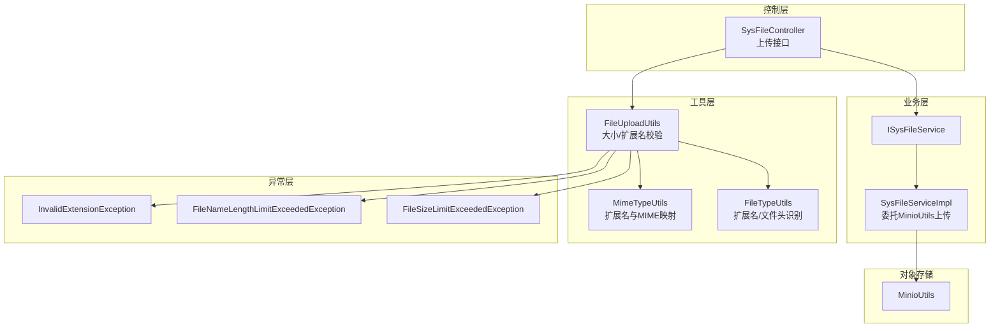
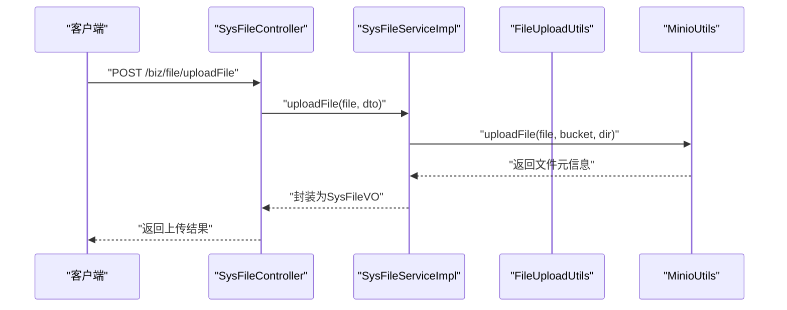
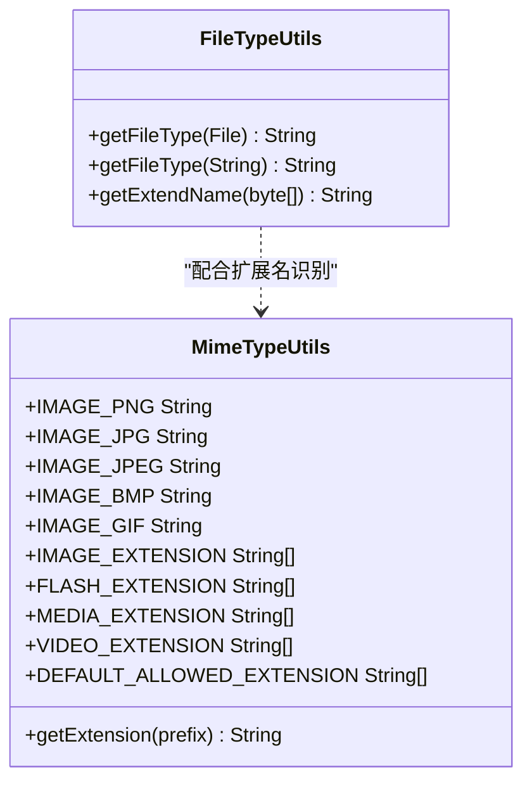
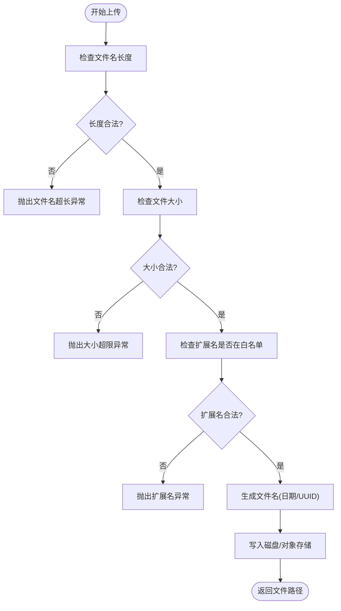
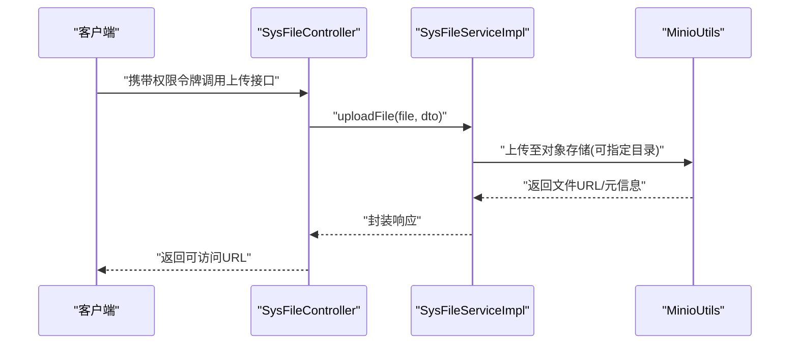
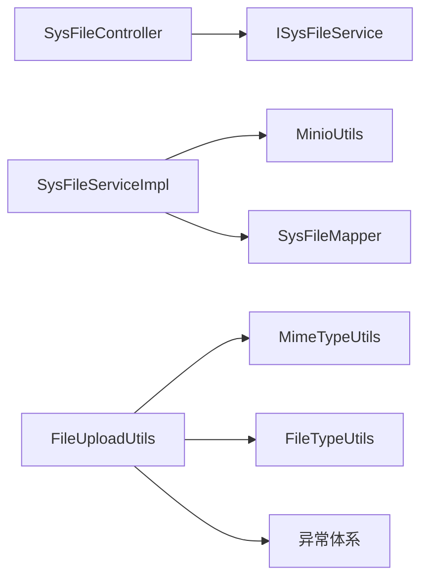

# 文件安全控制

<cite>
**本文引用的文件**
- [FileTypeUtils.java](file://blog-common/src/main/java/blog/common/utils/file/FileTypeUtils.java)
- [MimeTypeUtils.java](file://blog-common/src/main/java/blog/common/utils/file/MimeTypeUtils.java)
- [FileUploadUtils.java](file://blog-common/src/main/java/blog/common/utils/file/FileUploadUtils.java)
- [SysFileController.java](file://blog-admin/src/main/java/blog/web/controller/common/SysFileController.java)
- [ISysFileService.java](file://blog-biz/src/main/java/blog/biz/service/ISysFileService.java)
- [SysFileServiceImpl.java](file://blog-biz/src/main/java/blog/biz/service/impl/SysFileServiceImpl.java)
- [InvalidExtensionException.java](file://blog-common/src/main/java/blog/common/exception/file/InvalidExtensionException.java)
- [FileNameLengthLimitExceededException.java](file://blog-common/src/main/java/blog/common/exception/file/FileNameLengthLimitExceededException.java)
- [FileSizeLimitExceededException.java](file://blog-common/src/main/java/blog/common/exception/file/FileSizeLimitExceededException.java)
- [MinioUtils.java](file://blog-common/src/main/java/blog/common/utils/minio/MinioUtils.java)
- [MinioConfig.java](file://blog-common/src/main/java/blog/common/config/minio/MinioConfig.java)
- [MinioProperties.java](file://blog-common/src/main/java/blog/common/config/minio/MinioProperties.java)
</cite>

## 目录
1. [简介](#简介)
2. [项目结构](#项目结构)
3. [核心组件](#核心组件)
4. [架构总览](#架构总览)
5. [详细组件分析](#详细组件分析)
6. [依赖分析](#依赖分析)
7. [性能考虑](#性能考虑)
8. [故障排查指南](#故障排查指南)
9. [结论](#结论)
10. [附录](#附录)

## 简介
本文件围绕“文件安全控制”主题，系统梳理并解析项目中的文件安全实现机制，涵盖文件类型验证、文件大小限制、扩展名与MIME类型匹配、文件头识别、上传流程与异常处理、以及基于对象存储的访问控制与权限策略。重点解读 FileTypeUtils 与 MimeTypeUtils 的实现原理，并结合 FileUploadUtils 的上传校验逻辑，说明如何在服务端完成基础的安全防护。

## 项目结构
文件安全相关能力主要分布在以下模块：
- 控制层：SysFileController 提供文件上传接口，负责接收请求并调用业务层。
- 业务层：ISysFileService 与 SysFileServiceImpl 实现上传流程，委托 MinioUtils 完成对象存储上传。
- 工具层：FileTypeUtils 负责文件类型提取；MimeTypeUtils 维护媒体类型与扩展名映射；FileUploadUtils 提供上传校验与命名策略。
- 异常层：统一的文件异常体系，覆盖大小限制、扩展名不合法、文件名过长等场景。

图表来源
- [SysFileController.java:111-121](file://blog-admin/src/main/java/blog/web/controller/common/SysFileController.java#L111-L121)
- [ISysFileService.java:73-74](file://blog-biz/src/main/java/blog/biz/service/ISysFileService.java#L73-L74)
- [SysFileServiceImpl.java:151-167](file://blog-biz/src/main/java/blog/biz/service/impl/SysFileServiceImpl.java#L151-L167)
- [FileUploadUtils.java:92-126](file://blog-common/src/main/java/blog/common/utils/file/FileUploadUtils.java#L92-L126)
- [MimeTypeUtils.java:28-55](file://blog-common/src/main/java/blog/common/utils/file/MimeTypeUtils.java#L28-L55)
- [FileTypeUtils.java:36-63](file://blog-common/src/main/java/blog/common/utils/file/FileTypeUtils.java#L36-L63)
- [MinioUtils.java](file://blog-common/src/main/java/blog/common/utils/minio/MinioUtils.java)

章节来源
- [SysFileController.java:111-121](file://blog-admin/src/main/java/blog/web/controller/common/SysFileController.java#L111-L121)
- [ISysFileService.java:73-74](file://blog-biz/src/main/java/blog/biz/service/ISysFileService.java#L73-L74)
- [SysFileServiceImpl.java:151-167](file://blog-biz/src/main/java/blog/biz/service/impl/SysFileServiceImpl.java#L151-L167)
- [FileUploadUtils.java:92-126](file://blog-common/src/main/java/blog/common/utils/file/FileUploadUtils.java#L92-L126)
- [MimeTypeUtils.java:28-55](file://blog-common/src/main/java/blog/common/utils/file/MimeTypeUtils.java#L28-L55)
- [FileTypeUtils.java:36-63](file://blog-common/src/main/java/blog/common/utils/file/FileTypeUtils.java#L36-L63)

## 核心组件
- FileTypeUtils：提供文件扩展名提取与常见图片文件头识别（如 GIF/JPG/PNG/BMP），用于辅助识别文件真实类型。
- MimeTypeUtils：维护常用媒体类型与扩展名映射，定义默认允许的扩展名集合，支持从 MIME 前缀推导扩展名。
- FileUploadUtils：上传入口与校验器，包含默认最大文件大小、默认文件名长度限制、扩展名白名单校验、文件名生成策略（日期目录+序列或UUID）等。
- SysFileController：对外暴露上传接口，接收 MultipartFile 并封装为 UploadFileDTO 后交由业务层处理。
- ISysFileService/SysFileServiceImpl：定义上传契约并实现，通过 MinioUtils 将文件上传至对象存储，返回元数据。
- 异常体系：InvalidExtensionException、FileNameLengthLimitExceededException、FileSizeLimitExceededException 统一抛出与捕获。

章节来源
- [FileTypeUtils.java:12-63](file://blog-common/src/main/java/blog/common/utils/file/FileTypeUtils.java#L12-L63)
- [MimeTypeUtils.java:8-56](file://blog-common/src/main/java/blog/common/utils/file/MimeTypeUtils.java#L8-L56)
- [FileUploadUtils.java:25-224](file://blog-common/src/main/java/blog/common/utils/file/FileUploadUtils.java#L25-L224)
- [SysFileController.java:111-121](file://blog-admin/src/main/java/blog/web/controller/common/SysFileController.java#L111-L121)
- [ISysFileService.java:73-74](file://blog-biz/src/main/java/blog/biz/service/ISysFileService.java#L73-L74)
- [SysFileServiceImpl.java:151-167](file://blog-biz/src/main/java/blog/biz/service/impl/SysFileServiceImpl.java#L151-L167)
- [InvalidExtensionException.java:10-67](file://blog-common/src/main/java/blog/common/exception/file/InvalidExtensionException.java#L10-L67)
- [FileNameLengthLimitExceededException.java:8-14](file://blog-common/src/main/java/blog/common/exception/file/FileNameLengthLimitExceededException.java#L8-L14)
- [FileSizeLimitExceededException.java:8-14](file://blog-common/src/main/java/blog/common/exception/file/FileSizeLimitExceededException.java#L8-L14)

## 架构总览
下图展示一次典型文件上传的安全控制流程：客户端提交文件 → 控制层接收 → 业务层调用对象存储上传 → 上传工具执行大小/扩展名/文件名长度校验 → 异常统一处理 → 返回结果。

图表来源
- [SysFileController.java:111-121](file://blog-admin/src/main/java/blog/web/controller/common/SysFileController.java#L111-L121)
- [SysFileServiceImpl.java:151-167](file://blog-biz/src/main/java/blog/biz/service/impl/SysFileServiceImpl.java#L151-L167)
- [MinioUtils.java](file://blog-common/src/main/java/blog/common/utils/minio/MinioUtils.java)

## 详细组件分析

### 文件类型与扩展名识别（FileTypeUtils 与 MimeTypeUtils）
- 扩展名提取：支持从文件名与字节数组两路提取扩展名，字节数组方式可识别常见图片文件头，作为扩展名识别的补充手段。
- MIME 映射：提供常用媒体类型常量与扩展名数组，以及从 MIME 前缀反查扩展名的方法，便于与上传白名单联动。
- 使用场景：FileUploadUtils 在未显式传入 allowedExtension 时，默认使用 MimeTypeUtils 中的默认允许扩展名集合；同时在扩展名缺失时，回退到根据 MIME 内容类型推断扩展名。

图表来源
- [FileTypeUtils.java:12-63](file://blog-common/src/main/java/blog/common/utils/file/FileTypeUtils.java#L12-L63)
- [MimeTypeUtils.java:8-56](file://blog-common/src/main/java/blog/common/utils/file/MimeTypeUtils.java#L8-L56)

章节来源
- [FileTypeUtils.java:21-63](file://blog-common/src/main/java/blog/common/utils/file/FileTypeUtils.java#L21-L63)
- [MimeTypeUtils.java:8-56](file://blog-common/src/main/java/blog/common/utils/file/MimeTypeUtils.java#L8-L56)

### 文件大小限制与动态检查（FileUploadUtils）
- 配置参数：默认最大文件大小与默认文件名最大长度均为常量，可通过工具类方法在运行期调整基础目录。
- 动态检查：
  - 文件名长度检查：若超过阈值，抛出文件名长度超限异常。
  - 大小限制检查：若超过默认阈值，抛出大小超限异常。
  - 扩展名白名单检查：若扩展名不在允许集合内，按类别抛出不同类型的扩展名异常。
- 命名策略：支持两种命名方式——日期目录+原文件名+序列号+扩展名，或日期目录+UUID+扩展名，避免冲突与暴露原始文件名。
- 路径生成：根据基础目录与资源前缀生成对外可访问的相对路径。

图表来源
- [FileUploadUtils.java:114-126](file://blog-common/src/main/java/blog/common/utils/file/FileUploadUtils.java#L114-L126)
- [FileUploadUtils.java:167-193](file://blog-common/src/main/java/blog/common/utils/file/FileUploadUtils.java#L167-L193)
- [FileUploadUtils.java:217-223](file://blog-common/src/main/java/blog/common/utils/file/FileUploadUtils.java#L217-L223)

章节来源
- [FileUploadUtils.java:25-47](file://blog-common/src/main/java/blog/common/utils/file/FileUploadUtils.java#L25-L47)
- [FileUploadUtils.java:92-126](file://blog-common/src/main/java/blog/common/utils/file/FileUploadUtils.java#L92-L126)
- [FileUploadUtils.java:167-193](file://blog-common/src/main/java/blog/common/utils/file/FileUploadUtils.java#L167-L193)
- [FileUploadUtils.java:217-223](file://blog-common/src/main/java/blog/common/utils/file/FileUploadUtils.java#L217-L223)

### 恶意文件检测与安全策略
- 当前实现现状：仓库中未发现直接集成病毒扫描引擎或深度内容分析的代码。现有安全控制集中在扩展名白名单、大小与文件名长度限制。
- 建议增强方案：
  - 引入第三方病毒扫描服务（如 ClamAV 或云厂商扫描接口），在上传完成后异步扫描。
  - 对可疑文件（如脚本、可执行文件）实施二次隔离与人工审核。
  - 结合业务策略对特定类型文件（如可执行文件、压缩包）实施更严格的白名单与内容特征检测。
  - 记录上传行为日志，便于审计与追踪。

章节来源
- [FileUploadUtils.java:167-193](file://blog-common/src/main/java/blog/common/utils/file/FileUploadUtils.java#L167-L193)

### 文件访问权限控制与临时URL
- 权限控制：控制层使用注解鉴权，确保只有具备相应权限的用户才能访问上传接口。
- 临时URL：业务层通过 MinioUtils 上传文件并返回可访问的URL，具体有效期与权限策略由对象存储配置决定。
- 最佳实践：
  - 为上传目录设置只读或受限访问。
  - 生成带过期时间的预签名URL，缩短暴露窗口。
  - 对敏感业务文件采用私有桶+预签名URL策略。

图表来源
- [SysFileController.java:111-121](file://blog-admin/src/main/java/blog/web/controller/common/SysFileController.java#L111-L121)
- [SysFileServiceImpl.java:151-167](file://blog-biz/src/main/java/blog/biz/service/impl/SysFileServiceImpl.java#L151-L167)
- [MinioUtils.java](file://blog-common/src/main/java/blog/common/utils/minio/MinioUtils.java)

章节来源
- [SysFileController.java:46-49](file://blog-admin/src/main/java/blog/web/controller/common/SysFileController.java#L46-L49)
- [SysFileController.java:111-121](file://blog-admin/src/main/java/blog/web/controller/common/SysFileController.java#L111-L121)
- [SysFileServiceImpl.java:151-167](file://blog-biz/src/main/java/blog/biz/service/impl/SysFileServiceImpl.java#L151-L167)

### 文件安全相关异常处理
- InvalidExtensionException：扩展名不在允许集合时抛出，支持按类别细分（图片、Flash、媒体、视频）。
- FileNameLengthLimitExceededException：文件名长度超过阈值时抛出。
- FileSizeLimitExceededException：文件大小超过阈值时抛出。
- 处理策略：上层控制器与业务层捕获并转换为统一响应；异常消息包含允许的扩展名集合与实际扩展名，便于前端提示。

章节来源
- [InvalidExtensionException.java:10-67](file://blog-common/src/main/java/blog/common/exception/file/InvalidExtensionException.java#L10-L67)
- [FileNameLengthLimitExceededException.java:8-14](file://blog-common/src/main/java/blog/common/exception/file/FileNameLengthLimitExceededException.java#L8-L14)
- [FileSizeLimitExceededException.java:8-14](file://blog-common/src/main/java/blog/common/exception/file/FileSizeLimitExceededException.java#L8-L14)
- [FileUploadUtils.java:167-193](file://blog-common/src/main/java/blog/common/utils/file/FileUploadUtils.java#L167-L193)

## 依赖分析
- 控制层依赖业务层接口，业务层依赖对象存储工具与Mapper。
- 上传工具依赖配置中心与异常体系，同时与工具层的类型识别协作。
- 异常体系独立于业务，向上游提供统一错误语义。

图表来源
- [SysFileController.java:111-121](file://blog-admin/src/main/java/blog/web/controller/common/SysFileController.java#L111-L121)
- [ISysFileService.java:73-74](file://blog-biz/src/main/java/blog/biz/service/ISysFileService.java#L73-L74)
- [SysFileServiceImpl.java:151-167](file://blog-biz/src/main/java/blog/biz/service/impl/SysFileServiceImpl.java#L151-L167)
- [FileUploadUtils.java:92-126](file://blog-common/src/main/java/blog/common/utils/file/FileUploadUtils.java#L92-L126)
- [MimeTypeUtils.java:28-55](file://blog-common/src/main/java/blog/common/utils/file/MimeTypeUtils.java#L28-L55)
- [FileTypeUtils.java:36-63](file://blog-common/src/main/java/blog/common/utils/file/FileTypeUtils.java#L36-L63)

章节来源
- [SysFileController.java:111-121](file://blog-admin/src/main/java/blog/web/controller/common/SysFileController.java#L111-L121)
- [ISysFileService.java:73-74](file://blog-biz/src/main/java/blog/biz/service/ISysFileService.java#L73-L74)
- [SysFileServiceImpl.java:151-167](file://blog-biz/src/main/java/blog/biz/service/impl/SysFileServiceImpl.java#L151-L167)
- [FileUploadUtils.java:92-126](file://blog-common/src/main/java/blog/common/utils/file/FileUploadUtils.java#L92-L126)
- [MimeTypeUtils.java:28-55](file://blog-common/src/main/java/blog/common/utils/file/MimeTypeUtils.java#L28-L55)
- [FileTypeUtils.java:36-63](file://blog-common/src/main/java/blog/common/utils/file/FileTypeUtils.java#L36-L63)

## 性能考虑
- 上传路径：FileUploadUtils 支持自定义基础目录与资源前缀，合理规划目录层级可降低单目录文件数量，提升IO性能。
- 命名策略：使用UUID命名可避免重复与冲突，减少重命名开销。
- 异步扫描：建议将病毒扫描与内容分析异步化，避免阻塞上传主流程。
- 缓存与并发：对频繁访问的静态资源启用CDN与缓存，控制并发上传速率，防止IO抖动。

## 故障排查指南
- 扩展名异常：确认文件扩展名是否在允许集合内；若使用MIME推断，检查浏览器/客户端是否正确传递Content-Type。
- 文件名过长：缩短文件名或启用UUID命名策略。
- 文件过大：调整上传阈值或拆分传输。
- 无法访问URL：检查对象存储桶策略、预签名URL有效期与权限配置。
- 日志与审计：开启上传日志记录，定位失败原因并复现问题。

章节来源
- [InvalidExtensionException.java:10-67](file://blog-common/src/main/java/blog/common/exception/file/InvalidExtensionException.java#L10-L67)
- [FileNameLengthLimitExceededException.java:8-14](file://blog-common/src/main/java/blog/common/exception/file/FileNameLengthLimitExceededException.java#L8-L14)
- [FileSizeLimitExceededException.java:8-14](file://blog-common/src/main/java/blog/common/exception/file/FileSizeLimitExceededException.java#L8-L14)
- [SysFileServiceImpl.java:151-167](file://blog-biz/src/main/java/blog/biz/service/impl/SysFileServiceImpl.java#L151-L167)

## 结论
当前项目在服务端实现了基础而有效的文件安全控制：通过扩展名白名单、大小与文件名长度限制，结合对象存储的URL访问控制，形成多层防护。FileTypeUtils 与 MimeTypeUtils 提供了可靠的扩展名识别与映射能力。建议后续引入病毒扫描与内容分析机制，完善安全策略，并通过异步化与CDN优化提升整体性能与安全性。

## 附录
- 配置参考
  - 对象存储配置：MinioConfig 与 MinioProperties 提供桶、端点、凭证等配置项。
  - 上传参数：默认最大文件大小、默认文件名长度、默认基础目录等可通过工具类方法调整。
- 最佳实践
  - 严格白名单：仅允许受信任的扩展名与MIME类型。
  - 临时URL：为敏感文件生成带过期时间的预签名URL。
  - 审计日志：记录上传行为、失败原因与访问轨迹。
  - 异步扫描：对上传文件进行二次安全扫描，保障线上环境安全。

章节来源
- [MinioConfig.java](file://blog-common/src/main/java/blog/common/config/minio/MinioConfig.java)
- [MinioProperties.java](file://blog-common/src/main/java/blog/common/config/minio/MinioProperties.java)
- [FileUploadUtils.java:25-47](file://blog-common/src/main/java/blog/common/utils/file/FileUploadUtils.java#L25-L47)