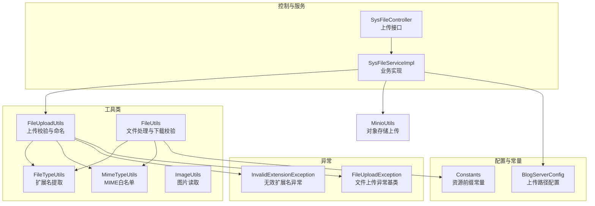
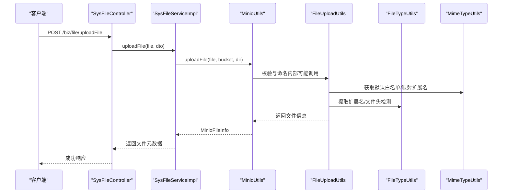
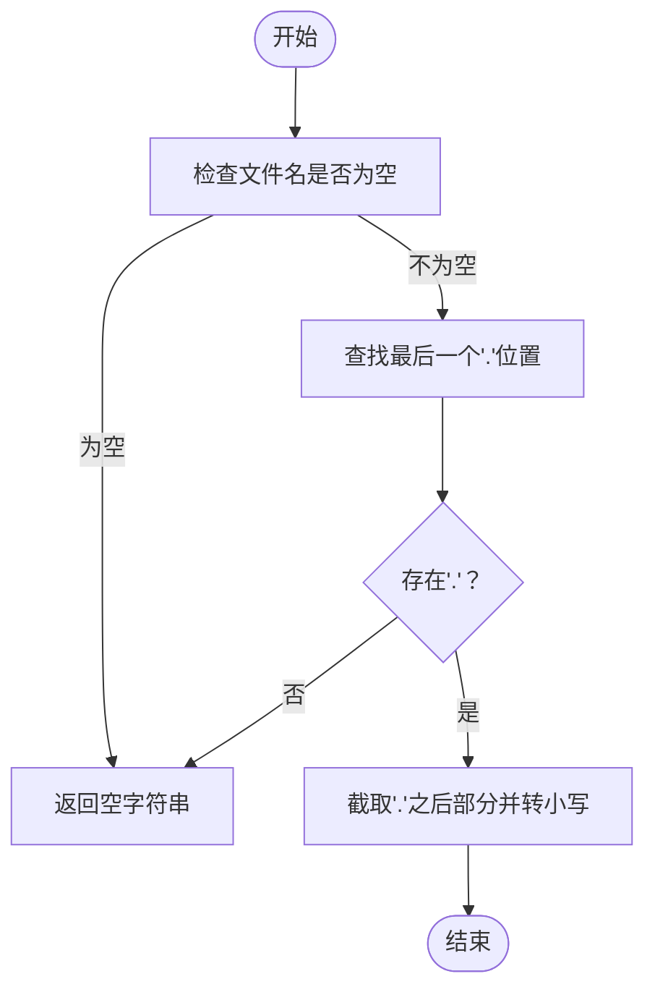
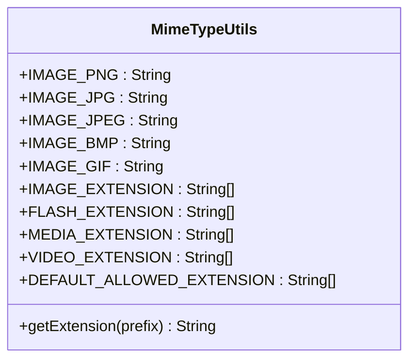
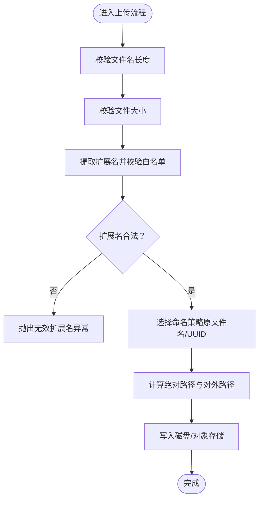
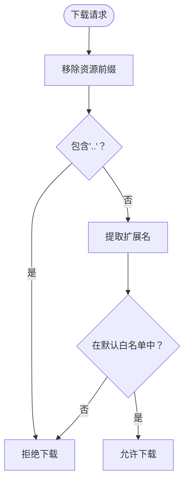
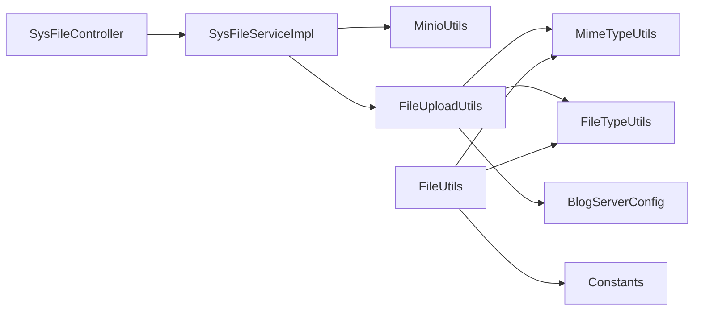

# 文件类型验证

<cite>
**本文引用的文件**
- [FileTypeUtils.java](file://blog-common/src/main/java/blog/common/utils/file/FileTypeUtils.java)
- [MimeTypeUtils.java](file://blog-common/src/main/java/blog/common/utils/file/MimeTypeUtils.java)
- [FileUploadUtils.java](file://blog-common/src/main/java/blog/common/utils/file/FileUploadUtils.java)
- [FileUtils.java](file://blog-common/src/main/java/blog/common/utils/file/FileUtils.java)
- [ImageUtils.java](file://blog-common/src/main/java/blog/common/utils/file/ImageUtils.java)
- [InvalidExtensionException.java](file://blog-common/src/main/java/blog/common/exception/file/InvalidExtensionException.java)
- [FileUploadException.java](file://blog-common/src/main/java/blog/common/exception/file/FileUploadException.java)
- [BlogServerConfig.java](file://blog-common/src/main/java/blog/common/config/BlogServerConfig.java)
- [Constants.java](file://blog-common/src/main/java/blog/common/constant/Constants.java)
- [SysFileController.java](file://blog-admin/src/main/java/blog/web/controller/common/SysFileController.java)
- [SysFileServiceImpl.java](file://blog-biz/src/main/java/blog/biz/service/impl/SysFileServiceImpl.java)
- [MinioUtils.java](file://blog-common/src/main/java/blog/common/utils/minio/MinioUtils.java)
</cite>

## 目录
1. [简介](#简介)
2. [项目结构](#项目结构)
3. [核心组件](#核心组件)
4. [架构总览](#架构总览)
5. [详细组件分析](#详细组件分析)
6. [依赖分析](#依赖分析)
7. [性能考虑](#性能考虑)
8. [故障排查指南](#故障排查指南)
9. [结论](#结论)
10. [附录](#附录)

## 简介
本技术文档围绕文件类型验证展开，系统性解析 FileTypeUtils 与 MimeTypeUtils 的实现原理，涵盖文件扩展名提取、MIME 类型识别、文件头检测等核心技术；详述基于扩展名与文件头的验证算法、白名单机制与动态验证规则、异常处理策略，并结合图片上传、文档处理、多媒体文件等典型场景给出最佳实践与性能优化建议。

## 项目结构
文件类型验证相关能力主要分布在以下模块：
- 工具类：文件类型工具、MIME 类型工具、文件上传工具、文件处理工具、图片工具
- 异常体系：文件上传异常、无效扩展名异常
- 控制器与服务：文件上传接口与业务实现
- 配置与常量：服务器配置、资源前缀常量

图表来源
- [SysFileController.java:111-121](file://blog-admin/src/main/java/blog/web/controller/common/SysFileController.java#L111-L121)
- [SysFileServiceImpl.java:151-167](file://blog-biz/src/main/java/blog/biz/service/impl/SysFileServiceImpl.java#L151-L167)
- [FileUploadUtils.java:92-126](file://blog-common/src/main/java/blog/common/utils/file/FileUploadUtils.java#L92-L126)
- [FileUtils.java:136-146](file://blog-common/src/main/java/blog/common/utils/file/FileUtils.java#L136-L146)
- [BlogServerConfig.java:68-118](file://blog-common/src/main/java/blog/common/config/BlogServerConfig.java#L68-L118)
- [Constants.java:140-141](file://blog-common/src/main/java/blog/common/constant/Constants.java#L140-L141)

章节来源
- [SysFileController.java:111-121](file://blog-admin/src/main/java/blog/web/controller/common/SysFileController.java#L111-L121)
- [SysFileServiceImpl.java:151-167](file://blog-biz/src/main/java/blog/biz/service/impl/SysFileServiceImpl.java#L151-L167)
- [FileUploadUtils.java:92-126](file://blog-common/src/main/java/blog/common/utils/file/FileUploadUtils.java#L92-L126)
- [FileUtils.java:136-146](file://blog-common/src/main/java/blog/common/utils/file/FileUtils.java#L136-L146)
- [BlogServerConfig.java:68-118](file://blog-common/src/main/java/blog/common/config/BlogServerConfig.java#L68-L118)
- [Constants.java:140-141](file://blog-common/src/main/java/blog/common/constant/Constants.java#L140-L141)

## 核心组件
- FileTypeUtils：负责从文件名或字节数组中提取扩展名，支持基于扩展名的快速识别与基于文件头的图像类型推断。
- MimeTypeUtils：维护各类文件类型的白名单（图片、Flash、媒体、视频、默认允许），并提供 MIME 前缀到扩展名的映射。
- FileUploadUtils：统一的文件上传入口，执行大小限制、文件名长度限制、扩展名白名单校验、命名策略（日期+序号或UUID）与落盘路径计算。
- FileUtils：文件下载校验、文件名合法性校验、文件读写、浏览器下载头设置、基于字节数组的图像类型推断。
- ImageUtils：图片读取工具，支持本地与网络路径，统一返回字节数据。
- 异常体系：InvalidExtensionException 提供按白名单分类的异常类型，便于前端提示与日志区分。

章节来源
- [FileTypeUtils.java:21-63](file://blog-common/src/main/java/blog/common/utils/file/FileTypeUtils.java#L21-L63)
- [MimeTypeUtils.java:8-56](file://blog-common/src/main/java/blog/common/utils/file/MimeTypeUtils.java#L8-L56)
- [FileUploadUtils.java:25-224](file://blog-common/src/main/java/blog/common/utils/file/FileUploadUtils.java#L25-L224)
- [FileUtils.java:29-257](file://blog-common/src/main/java/blog/common/utils/file/FileUtils.java#L29-L257)
- [ImageUtils.java:22-79](file://blog-common/src/main/java/blog/common/utils/file/ImageUtils.java#L22-L79)
- [InvalidExtensionException.java:10-67](file://blog-common/src/main/java/blog/common/exception/file/InvalidExtensionException.java#L10-L67)

## 架构总览
文件类型验证贯穿“请求接入—业务处理—存储上传—结果返回”的链路，核心验证点包括：
- 扩展名校验：优先使用原始文件名扩展名，若缺失则回退至 Content-Type 映射。
- 大小与长度限制：统一的默认阈值保障系统稳定性。
- 白名单策略：按场景切换不同白名单（图片/Flash/媒体/视频/默认）。
- 文件头检测：在需要时通过字节数组前缀判断真实类型（尤其图片）。
- 下载校验：仅允许白名单内的扩展名被下载。

图表来源
- [SysFileController.java:111-121](file://blog-admin/src/main/java/blog/web/controller/common/SysFileController.java#L111-L121)
- [SysFileServiceImpl.java:151-167](file://blog-biz/src/main/java/blog/biz/service/impl/SysFileServiceImpl.java#L151-L167)
- [MinioUtils.java:85-111](file://blog-common/src/main/java/blog/common/utils/minio/MinioUtils.java#L85-L111)
- [FileUploadUtils.java:92-126](file://blog-common/src/main/java/blog/common/utils/file/FileUploadUtils.java#L92-L126)
- [FileTypeUtils.java:21-63](file://blog-common/src/main/java/blog/common/utils/file/FileTypeUtils.java#L21-L63)
- [MimeTypeUtils.java:8-56](file://blog-common/src/main/java/blog/common/utils/file/MimeTypeUtils.java#L8-L56)

## 详细组件分析

### FileTypeUtils 组件分析
- 功能要点
  - 从文件名提取扩展名（不含点号，小写化）
  - 从字节数组推断图像类型（GIF/JPG/PNG/BMP）
- 设计模式
  - 工具类（静态方法），无状态设计，线程安全
- 复杂度
  - 扩展名提取 O(n)，文件头检测 O(1)（固定长度前缀）
- 错误处理
  - 输入为 null 或无扩展名时返回空字符串，避免异常传播
- 性能影响
  - 文件头检测仅在需要时调用，避免不必要的 CPU 开销

图表来源
- [FileTypeUtils.java:36-42](file://blog-common/src/main/java/blog/common/utils/file/FileTypeUtils.java#L36-L42)

章节来源
- [FileTypeUtils.java:21-63](file://blog-common/src/main/java/blog/common/utils/file/FileTypeUtils.java#L21-L63)

### MimeTypeUtils 组件分析
- 功能要点
  - 定义图片、Flash、媒体、视频、默认允许的扩展名白名单
  - 提供 MIME 前缀到扩展名的映射（如 image/png -> png）
- 设计模式
  - 常量类 + 工具方法，集中管理允许类型
- 复杂度
  - 映射与白名单均为静态常量，查询 O(1)/O(n)（线性遍历白名单）

图表来源
- [MimeTypeUtils.java:8-56](file://blog-common/src/main/java/blog/common/utils/file/MimeTypeUtils.java#L8-L56)

章节来源
- [MimeTypeUtils.java:8-56](file://blog-common/src/main/java/blog/common/utils/file/MimeTypeUtils.java#L8-L56)

### FileUploadUtils 组件分析
- 功能要点
  - 默认大小限制、默认文件名长度限制
  - 校验扩展名是否在允许白名单内
  - 命名策略：日期目录 + 原文件名 + 序列值 + 后缀；或日期目录 + UUID + 后缀
  - 计算绝对路径与对外访问路径
  - 从原始文件名或 Content-Type 推断扩展名
- 核心算法
  - 扩展名校验：线性遍历白名单
  - 扩展名推断：先取原始文件名后缀，若为空则用 MIME 映射
- 异常处理
  - 超出大小限制抛出特定异常
  - 扩展名不在白名单抛出 InvalidExtensionException（按白名单类型细分）

图表来源
- [FileUploadUtils.java:92-126](file://blog-common/src/main/java/blog/common/utils/file/FileUploadUtils.java#L92-L126)
- [FileUploadUtils.java:167-193](file://blog-common/src/main/java/blog/common/utils/file/FileUploadUtils.java#L167-L193)
- [FileUploadUtils.java:217-223](file://blog-common/src/main/java/blog/common/utils/file/FileUploadUtils.java#L217-L223)

章节来源
- [FileUploadUtils.java:25-224](file://blog-common/src/main/java/blog/common/utils/file/FileUploadUtils.java#L25-L224)

### FileUtils 组件分析
- 功能要点
  - 下载校验：仅允许白名单扩展名被下载
  - 文件名合法性校验（正则）
  - 浏览器下载头设置（兼容 IE/Firefox/Chrome）
  - 基于字节数组的图像类型推断（与 FileTypeUtils 的图像检测一致）
- 与验证的关系
  - 下载校验依赖 FileTypeUtils 的扩展名提取与 MimeTypeUtils 的默认白名单

图表来源
- [FileUtils.java:136-146](file://blog-common/src/main/java/blog/common/utils/file/FileUtils.java#L136-L146)
- [Constants.java:140-141](file://blog-common/src/main/java/blog/common/constant/Constants.java#L140-L141)

章节来源
- [FileUtils.java:120-146](file://blog-common/src/main/java/blog/common/utils/file/FileUtils.java#L120-L146)
- [Constants.java:140-141](file://blog-common/src/main/java/blog/common/constant/Constants.java#L140-L141)

### ImageUtils 组件分析
- 功能要点
  - 支持本地与网络图片读取，统一返回字节数据
  - 设置连接超时与读取超时，避免阻塞
- 与验证的关系
  - 作为图片读取工具，为上层业务提供数据基础

章节来源
- [ImageUtils.java:22-79](file://blog-common/src/main/java/blog/common/utils/file/ImageUtils.java#L22-L79)

### 异常体系
- InvalidExtensionException：无效扩展名异常，按白名单类型细分为图片/Flash/媒体/视频等
- FileUploadException：文件上传异常基类，支持打印堆栈与原因传递

章节来源
- [InvalidExtensionException.java:10-67](file://blog-common/src/main/java/blog/common/exception/file/InvalidExtensionException.java#L10-L67)
- [FileUploadException.java:11-52](file://blog-common/src/main/java/blog/common/exception/file/FileUploadException.java#L11-L52)

## 依赖分析
- 控制器与服务
  - SysFileController 提供上传接口，调用 SysFileServiceImpl
  - SysFileServiceImpl 使用 MinioUtils 完成对象存储上传
- 上传工具链
  - FileUploadUtils 依赖 MimeTypeUtils（白名单）、FileTypeUtils（扩展名/文件头）
  - FileUtils 依赖 FileTypeUtils 与 MimeTypeUtils（下载校验）
- 配置与常量
  - BlogServerConfig 提供上传根路径
  - Constants 提供资源前缀常量

图表来源
- [SysFileController.java:111-121](file://blog-admin/src/main/java/blog/web/controller/common/SysFileController.java#L111-L121)
- [SysFileServiceImpl.java:151-167](file://blog-biz/src/main/java/blog/biz/service/impl/SysFileServiceImpl.java#L151-L167)
- [FileUploadUtils.java:92-126](file://blog-common/src/main/java/blog/common/utils/file/FileUploadUtils.java#L92-L126)
- [FileUtils.java:136-146](file://blog-common/src/main/java/blog/common/utils/file/FileUtils.java#L136-L146)
- [BlogServerConfig.java:68-118](file://blog-common/src/main/java/blog/common/config/BlogServerConfig.java#L68-L118)
- [Constants.java:140-141](file://blog-common/src/main/java/blog/common/constant/Constants.java#L140-L141)

章节来源
- [SysFileController.java:111-121](file://blog-admin/src/main/java/blog/web/controller/common/SysFileController.java#L111-L121)
- [SysFileServiceImpl.java:151-167](file://blog-biz/src/main/java/blog/biz/service/impl/SysFileServiceImpl.java#L151-L167)
- [FileUploadUtils.java:92-126](file://blog-common/src/main/java/blog/common/utils/file/FileUploadUtils.java#L92-L126)
- [FileUtils.java:136-146](file://blog-common/src/main/java/blog/common/utils/file/FileUtils.java#L136-L146)
- [BlogServerConfig.java:68-118](file://blog-common/src/main/java/blog/common/config/BlogServerConfig.java#L68-L118)
- [Constants.java:140-141](file://blog-common/src/main/java/blog/common/constant/Constants.java#L140-L141)

## 性能考虑
- 扩展名提取与白名单校验
  - 原始文件名扩展名提取为 O(n)，白名单线性遍历为 O(k)，k 通常较小
  - 建议：在高并发场景下，尽量保证原始文件名包含扩展名，减少回退到 MIME 映射的成本
- 文件头检测
  - FileTypeUtils 的文件头检测为固定长度前缀比较，O(1)
  - 建议：仅在需要严格校验真实类型时启用，避免对所有文件都进行字节检测
- 命名策略
  - 原文件名策略会引入序列号，增加少量字符串拼接成本
  - UUID 策略更利于去重与安全性，但需注意路径层级
- I/O 与存储
  - MinioUtils 直接流式上传，避免内存峰值
  - 建议：对大文件采用分块上传或断点续传（如需），并设置合理的超时与重试

## 故障排查指南
- 上传报错“文件后缀不正确”
  - 检查请求中是否携带了正确的 Content-Type 或原始文件名扩展名
  - 确认使用的白名单是否覆盖该扩展名（图片/Flash/媒体/视频/默认）
  - 若扩展名为空，确认 Content-Type 是否正确
- 下载被拒绝
  - 检查文件路径是否包含“..”等非法字符
  - 确认扩展名是否在默认白名单中
- 图片读取异常
  - 检查网络可达性与超时设置
  - 确认图片内容是否符合预期（文件头检测逻辑依赖字节前缀）

章节来源
- [InvalidExtensionException.java:17-22](file://blog-common/src/main/java/blog/common/exception/file/InvalidExtensionException.java#L17-L22)
- [FileUploadUtils.java:167-193](file://blog-common/src/main/java/blog/common/utils/file/FileUploadUtils.java#L167-L193)
- [FileUtils.java:136-146](file://blog-common/src/main/java/blog/common/utils/file/FileUtils.java#L136-L146)
- [ImageUtils.java:54-78](file://blog-common/src/main/java/blog/common/utils/file/ImageUtils.java#L54-L78)

## 结论
本项目通过 FileTypeUtils 与 MimeTypeUtils 实现了多维度的文件类型验证：基于扩展名的快速识别、基于 MIME 的回退映射、基于文件头的真实类型检测；配合 FileUploadUtils 的白名单校验与命名策略，以及 FileUtils 的下载校验，构建了完整、可扩展的文件类型安全体系。在实际应用中，建议根据场景灵活选择验证强度与性能开销，并结合对象存储实现高效稳定的文件服务。

## 附录
- 典型应用场景
  - 图片上传：使用图片白名单与文件头检测，确保真实图像类型
  - 文档处理：使用默认白名单，限制常见办公文档与压缩包
  - 多媒体文件：使用媒体/视频白名单，避免恶意脚本与不可控格式
- 最佳实践
  - 优先保留原始文件名扩展名，减少 MIME 回退
  - 在高并发场景下，谨慎启用文件头检测
  - 对外暴露的下载接口必须经过白名单校验
  - 使用 UUID 命名策略提升安全性与去重能力
  - 设置合理的大小与长度限制，防止资源滥用