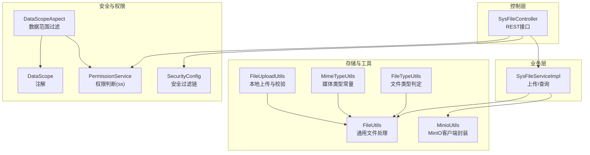
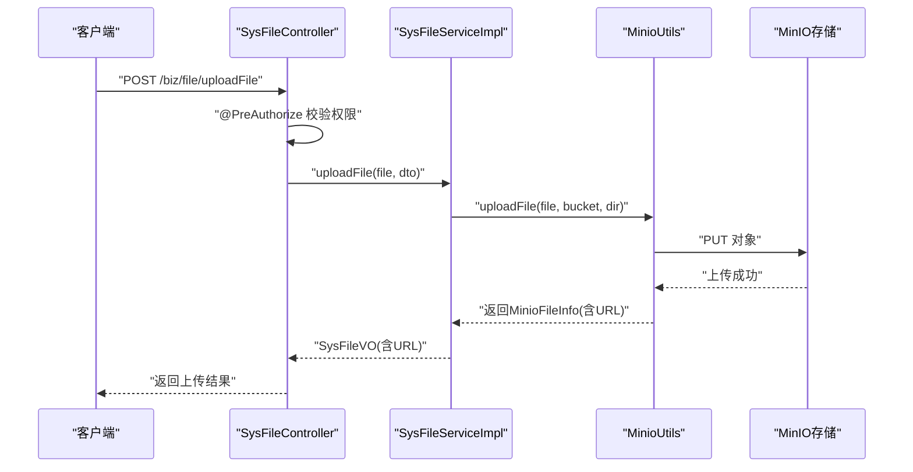
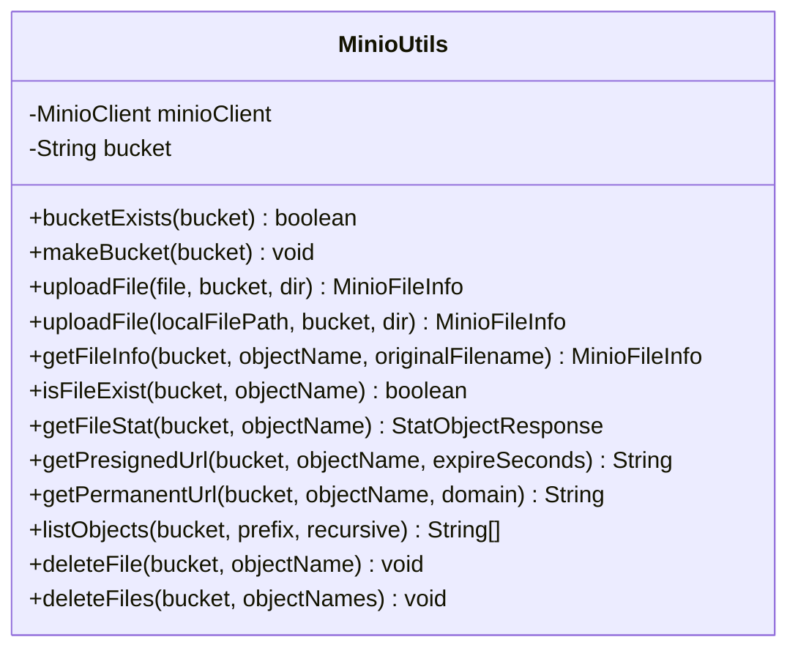
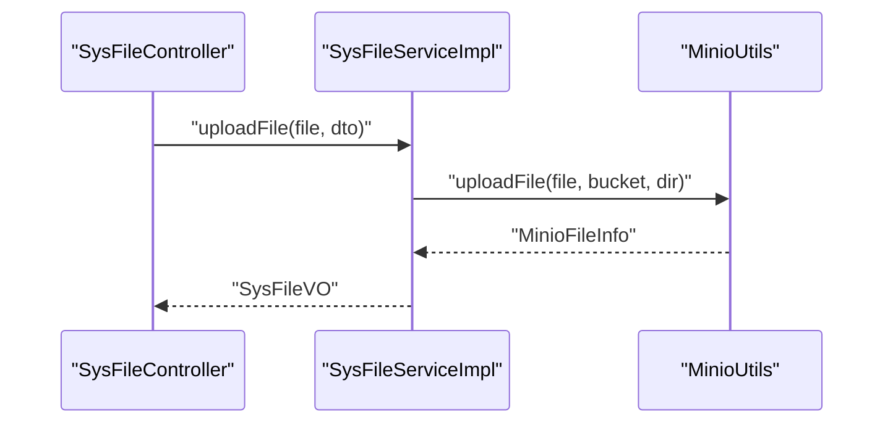
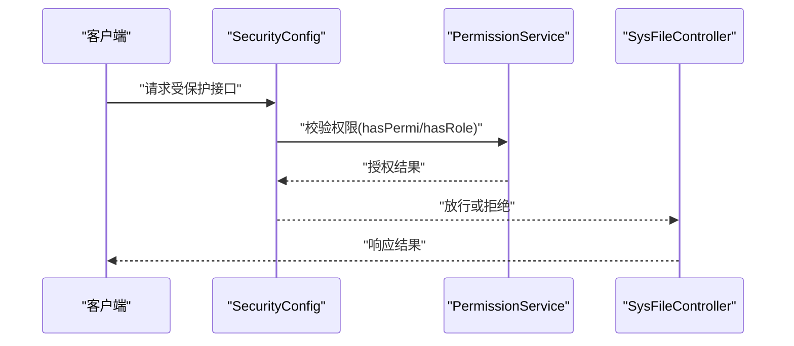
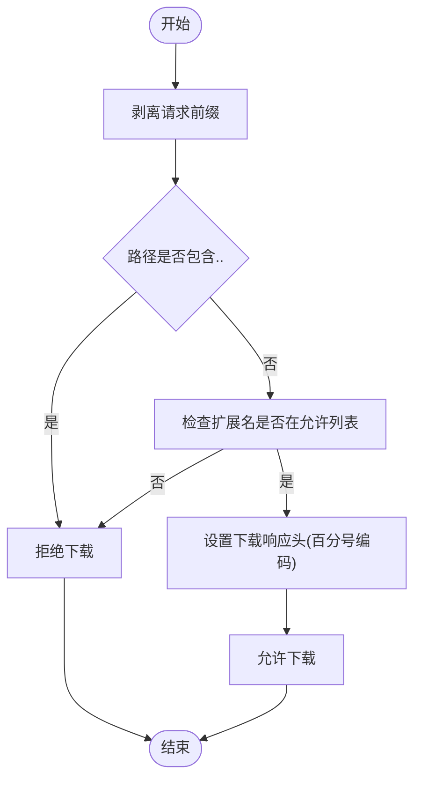
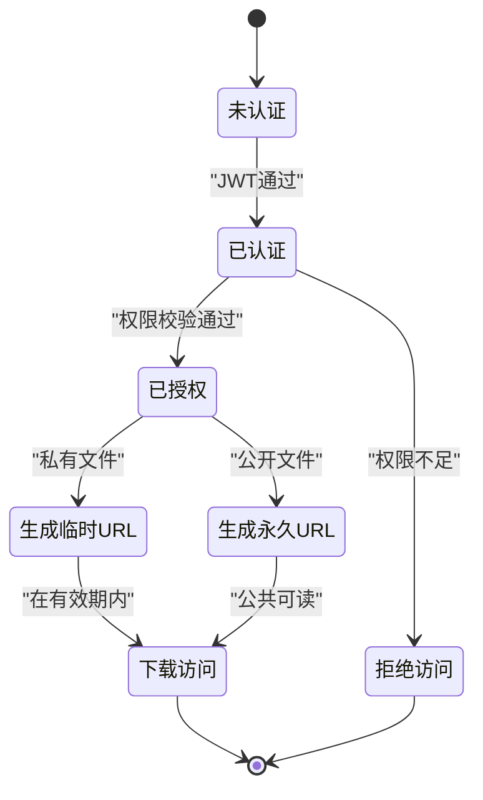
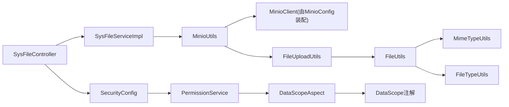

# 文件访问控制

<cite>
**本文引用的文件**
- [FileUtils.java](file://blog-common/src/main/java/blog/common/utils/file/FileUtils.java)
- [MinioUtils.java](file://blog-common/src/main/java/blog/common/utils/minio/MinioUtils.java)
- [SysFile.java](file://blog-biz/src/main/java/blog/biz/domain/SysFile.java)
- [SysFileServiceImpl.java](file://blog-biz/src/main/java/blog/biz/service/impl/SysFileServiceImpl.java)
- [SysFileController.java](file://blog-admin/src/main/java/blog/web/controller/common/SysFileController.java)
- [MinioConfig.java](file://blog-common/src/main/java/blog/common/config/minio/MinioConfig.java)
- [MinioProperties.java](file://blog-common/src/main/java/blog/common/config/minio/MinioProperties.java)
- [FileUploadUtils.java](file://blog-common/src/main/java/blog/common/utils/file/FileUploadUtils.java)
- [MimeTypeUtils.java](file://blog-common/src/main/java/blog/common/utils/file/MimeTypeUtils.java)
- [FileTypeUtils.java](file://blog-common/src/main/java/blog/common/utils/file/FileTypeUtils.java)
- [SecurityConfig.java](file://blog-framework/src/main/java/blog/framework/config/SecurityConfig.java)
- [PermissionService.java](file://blog-framework/src/main/java/blog/framework/web/service/PermissionService.java)
- [DataScopeAspect.java](file://blog-framework/src/main/java/blog/framework/aspectj/DataScopeAspect.java)
- [DataScope.java](file://blog-common/src/main/java/blog/common/annotation/DataScope.java)
</cite>

## 目录
1. [简介](#简介)
2. [项目结构](#项目结构)
3. [核心组件](#核心组件)
4. [架构总览](#架构总览)
5. [详细组件分析](#详细组件分析)
6. [依赖分析](#依赖分析)
7. [性能考虑](#性能考虑)
8. [故障排查指南](#故障排查指南)
9. [结论](#结论)
10. [附录](#附录)

## 简介
本技术文档围绕“文件访问控制”主题，系统梳理了本项目的文件上传、存储、访问授权与安全控制机制。重点覆盖以下方面：
- 基于用户的访问控制：通过统一鉴权框架与权限服务，结合角色与数据范围控制，确保文件访问的最小权限原则。
- 临时URL生成与限时访问：利用MinIO SDK生成带过期时间的预签名URL，实现安全可控的临时访问。
- 权限验证与策略：公开/私有/限时访问策略的落地方式，以及与用户权限系统的集成。
- 工具类职责：FileUtils与MinioUtils在文件路径管理、访问权限验证、URL签名生成等方面的作用与边界。

## 项目结构
从文件访问控制视角，项目的关键模块与职责如下：
- 控制层：SysFileController 提供文件上传与查询接口，并通过注解进行权限拦截。
- 业务层：SysFileServiceImpl 封装上传流程，调用MinioUtils完成对象存储操作，并返回文件元信息。
- 存储与工具：MinioUtils 负责与MinIO交互；FileUtils 负责通用文件处理；FileUploadUtils 负责本地上传与校验；MimeTypeUtils/FileTypeUtils 负责扩展名与类型判定。
- 安全与权限：SecurityConfig 统一配置鉴权链路；PermissionService 提供权限判断能力；DataScopeAspect 结合注解实现数据范围过滤。

图表来源
- [SysFileController.java:35-123](file://blog-admin/src/main/java/blog/web/controller/common/SysFileController.java#L35-L123)
- [SysFileServiceImpl.java:35-169](file://blog-biz/src/main/java/blog/biz/service/impl/SysFileServiceImpl.java#L35-L169)
- [MinioUtils.java:25-325](file://blog-common/src/main/java/blog/common/utils/minio/MinioUtils.java#L25-L325)
- [FileUtils.java:29-258](file://blog-common/src/main/java/blog/common/utils/file/FileUtils.java#L29-L258)
- [FileUploadUtils.java:25-225](file://blog-common/src/main/java/blog/common/utils/file/FileUploadUtils.java#L25-L225)
- [MimeTypeUtils.java:8-57](file://blog-common/src/main/java/blog/common/utils/file/MimeTypeUtils.java#L8-L57)
- [FileTypeUtils.java:12-64](file://blog-common/src/main/java/blog/common/utils/file/FileTypeUtils.java#L12-L64)
- [SecurityConfig.java:31-137](file://blog-framework/src/main/java/blog/framework/config/SecurityConfig.java#L31-L137)
- [PermissionService.java:19-139](file://blog-framework/src/main/java/blog/framework/web/service/PermissionService.java#L19-L139)
- [DataScopeAspect.java:26-154](file://blog-framework/src/main/java/blog/framework/aspectj/DataScopeAspect.java#L26-L154)
- [DataScope.java:14-32](file://blog-common/src/main/java/blog/common/annotation/DataScope.java#L14-L32)

章节来源
- [SysFileController.java:35-123](file://blog-admin/src/main/java/blog/web/controller/common/SysFileController.java#L35-L123)
- [SysFileServiceImpl.java:35-169](file://blog-biz/src/main/java/blog/biz/service/impl/SysFileServiceImpl.java#L35-L169)
- [MinioUtils.java:25-325](file://blog-common/src/main/java/blog/common/utils/minio/MinioUtils.java#L25-L325)
- [FileUtils.java:29-258](file://blog-common/src/main/java/blog/common/utils/file/FileUtils.java#L29-L258)
- [FileUploadUtils.java:25-225](file://blog-common/src/main/java/blog/common/utils/file/FileUploadUtils.java#L25-L225)
- [MimeTypeUtils.java:8-57](file://blog-common/src/main/java/blog/common/utils/file/MimeTypeUtils.java#L8-L57)
- [FileTypeUtils.java:12-64](file://blog-common/src/main/java/blog/common/utils/file/FileTypeUtils.java#L12-L64)
- [SecurityConfig.java:31-137](file://blog-framework/src/main/java/blog/framework/config/SecurityConfig.java#L31-L137)
- [PermissionService.java:19-139](file://blog-framework/src/main/java/blog/framework/web/service/PermissionService.java#L19-L139)
- [DataScopeAspect.java:26-154](file://blog-framework/src/main/java/blog/framework/aspectj/DataScopeAspect.java#L26-L154)
- [DataScope.java:14-32](file://blog-common/src/main/java/blog/common/annotation/DataScope.java#L14-L32)

## 核心组件
- MinioUtils：封装MinIO客户端，提供桶管理、文件上传、信息查询、临时URL生成、永久URL生成、文件列表与删除等能力。其中临时URL默认有效期为24小时，可通过接口按需调整。
- SysFileServiceImpl：业务层实现，负责接收上传请求，调用MinioUtils完成上传并返回文件元信息（含URL），同时支持文件查询与分页。
- SysFileController：对外暴露REST接口，包含文件列表、详情、新增、编辑、删除与上传等操作，并通过@PreAuthorize进行权限拦截。
- FileUtils：提供通用文件处理能力，如下载响应头设置、百分号编码、文件名合法性校验、下载白名单检查等。
- FileUploadUtils：负责本地上传路径计算、文件名校验、扩展名提取、大小限制与异常抛出等。
- MimeTypeUtils/FileTypeUtils：提供媒体类型与扩展名常量、默认允许扩展名集合、文件类型判定等。
- SecurityConfig/PermissionService：统一配置基于JWT的安全过滤链，提供权限判断能力（hasPermi、hasRole等），并与控制器注解配合实现细粒度权限控制。
- DataScopeAspect/DataScope：通过注解与切面实现数据范围过滤，结合用户角色与部门层级，限定查询可见范围。

章节来源
- [MinioUtils.java:25-325](file://blog-common/src/main/java/blog/common/utils/minio/MinioUtils.java#L25-L325)
- [SysFileServiceImpl.java:35-169](file://blog-biz/src/main/java/blog/biz/service/impl/SysFileServiceImpl.java#L35-L169)
- [SysFileController.java:35-123](file://blog-admin/src/main/java/blog/web/controller/common/SysFileController.java#L35-L123)
- [FileUtils.java:29-258](file://blog-common/src/main/java/blog/common/utils/file/FileUtils.java#L29-L258)
- [FileUploadUtils.java:25-225](file://blog-common/src/main/java/blog/common/utils/file/FileUploadUtils.java#L25-L225)
- [MimeTypeUtils.java:8-57](file://blog-common/src/main/java/blog/common/utils/file/MimeTypeUtils.java#L8-L57)
- [FileTypeUtils.java:12-64](file://blog-common/src/main/java/blog/common/utils/file/FileTypeUtils.java#L12-L64)
- [SecurityConfig.java:31-137](file://blog-framework/src/main/java/blog/framework/config/SecurityConfig.java#L31-L137)
- [PermissionService.java:19-139](file://blog-framework/src/main/java/blog/framework/web/service/PermissionService.java#L19-L139)
- [DataScopeAspect.java:26-154](file://blog-framework/src/main/java/blog/framework/aspectj/DataScopeAspect.java#L26-L154)
- [DataScope.java:14-32](file://blog-common/src/main/java/blog/common/annotation/DataScope.java#L14-L32)

## 架构总览
文件访问控制的整体流程如下：
- 客户端发起上传/访问请求至SysFileController。
- 控制器通过@PreAuthorize进行权限校验，未通过则直接拒绝。
- 业务层SysFileServiceImpl调用MinioUtils完成上传或查询，并返回文件元信息（含URL）。
- 若为私有文件，返回的是带过期时间的临时URL；若为公开文件，可在满足MinIO公共读的前提下生成永久URL。
- 下载时，前端可直接访问该URL，服务端无需再次鉴权（临时URL由MinIO侧验证签名与有效期）。

图表来源
- [SysFileController.java:111-121](file://blog-admin/src/main/java/blog/web/controller/common/SysFileController.java#L111-L121)
- [SysFileServiceImpl.java:151-167](file://blog-biz/src/main/java/blog/biz/service/impl/SysFileServiceImpl.java#L151-L167)
- [MinioUtils.java:85-111](file://blog-common/src/main/java/blog/common/utils/minio/MinioUtils.java#L85-L111)

章节来源
- [SysFileController.java:111-121](file://blog-admin/src/main/java/blog/web/controller/common/SysFileController.java#L111-L121)
- [SysFileServiceImpl.java:151-167](file://blog-biz/src/main/java/blog/biz/service/impl/SysFileServiceImpl.java#L151-L167)
- [MinioUtils.java:85-111](file://blog-common/src/main/java/blog/common/utils/minio/MinioUtils.java#L85-L111)

## 详细组件分析

### MinioUtils 组件分析
- 职责边界
  - 桶管理：存在性检查、创建（幂等）。
  - 文件上传：支持MultipartFile与本地文件路径两种方式，自动生成对象名（UUID+后缀）。
  - 文件信息：统计对象元信息（大小、类型、上传时间），并生成临时URL（默认24小时）。
  - URL生成：提供临时URL与永久URL生成接口；永久URL依赖MinIO公共可读策略。
  - 文件列表与删除：支持目录列举与批量删除。
- 关键流程
  - 上传流程：校验桶存在性、构造对象名、上传、返回文件信息。
  - 临时URL生成：基于MinIO SDK生成带过期时间的预签名URL。
- 安全要点
  - 默认临时URL有效期为24小时，可通过getPresignedUrl按需缩短。
  - 永久URL仅在MinIO桶具备公共可读权限时有效，否则需走临时URL。

图表来源
- [MinioUtils.java:25-325](file://blog-common/src/main/java/blog/common/utils/minio/MinioUtils.java#L25-L325)

章节来源
- [MinioUtils.java:25-325](file://blog-common/src/main/java/blog/common/utils/minio/MinioUtils.java#L25-L325)

### SysFileServiceImpl 组件分析
- 职责边界
  - 文件查询与分页：基于条件构建查询包装器，支持多字段过滤。
  - 文件上传：委托MinioUtils完成上传，组装返回的文件信息为SysFileVO。
- 上传流程
  - 接收MultipartFile与业务参数（如目录dir），调用MinioUtils.uploadFile。
  - 将MinioFileInfo转换为SysFileVO返回给控制器。
- 安全与策略
  - 上传行为受控制器权限注解保护；返回的URL由MinioUtils生成，遵循MinIO策略。

图表来源
- [SysFileServiceImpl.java:151-167](file://blog-biz/src/main/java/blog/biz/service/impl/SysFileServiceImpl.java#L151-L167)
- [MinioUtils.java:85-111](file://blog-common/src/main/java/blog/common/utils/minio/MinioUtils.java#L85-L111)

章节来源
- [SysFileServiceImpl.java:35-169](file://blog-biz/src/main/java/blog/biz/service/impl/SysFileServiceImpl.java#L35-L169)

### SysFileController 组件分析
- 职责边界
  - 提供文件列表、导出、详情、新增、编辑、删除与上传等REST接口。
  - 使用@PreAuthorize进行权限控制，如“biz:file:list”、“biz:file:upload”等。
- 安全控制
  - 所有受控接口均通过Spring Security链路进行认证与授权。
  - 与PermissionService配合，实现基于权限字符串与角色的访问控制。

图表来源
- [SecurityConfig.java:94-127](file://blog-framework/src/main/java/blog/framework/config/SecurityConfig.java#L94-L127)
- [PermissionService.java:27-71](file://blog-framework/src/main/java/blog/framework/web/service/PermissionService.java#L27-L71)
- [SysFileController.java:46-121](file://blog-admin/src/main/java/blog/web/controller/common/SysFileController.java#L46-L121)

章节来源
- [SysFileController.java:35-123](file://blog-admin/src/main/java/blog/web/controller/common/SysFileController.java#L35-L123)
- [SecurityConfig.java:31-137](file://blog-framework/src/main/java/blog/framework/config/SecurityConfig.java#L31-L137)
- [PermissionService.java:19-139](file://blog-framework/src/main/java/blog/framework/web/service/PermissionService.java#L19-L139)

### FileUtils 与文件下载响应头
- 职责边界
  - 设置下载响应头、百分号编码、文件名合法性校验、下载白名单检查等。
- 与访问控制的关系
  - 通过下载白名单与路径剥离，避免目录穿越与非法扩展名下载。
  - 下载响应头设置保证跨浏览器兼容性，便于前端正确展示与下载。

图表来源
- [FileUtils.java:94-194](file://blog-common/src/main/java/blog/common/utils/file/FileUtils.java#L94-L194)
- [MimeTypeUtils.java:28-38](file://blog-common/src/main/java/blog/common/utils/file/MimeTypeUtils.java#L28-L38)

章节来源
- [FileUtils.java:94-194](file://blog-common/src/main/java/blog/common/utils/file/FileUtils.java#L94-L194)
- [MimeTypeUtils.java:28-38](file://blog-common/src/main/java/blog/common/utils/file/MimeTypeUtils.java#L28-L38)

### 文件访问策略与权限模型
- 公开访问
  - 在MinIO桶具备公共可读权限的前提下，可通过getPermanentUrl生成永久URL供任意用户访问。
- 私有访问
  - 默认采用临时URL（默认24小时），仅授权用户在有效期内访问。
- 限时访问
  - 通过getPresignedUrl传入expireSeconds参数，灵活控制URL有效期。
- 与用户权限系统集成
  - 控制器接口通过@PreAuthorize进行权限拦截；PermissionService提供hasPermi/hasRole等能力。
  - 数据范围控制通过DataScope注解与DataScopeAspect切面实现，结合用户角色与部门层级，限制查询可见范围。

图表来源
- [SecurityConfig.java:94-127](file://blog-framework/src/main/java/blog/framework/config/SecurityConfig.java#L94-L127)
- [PermissionService.java:27-71](file://blog-framework/src/main/java/blog/framework/web/service/PermissionService.java#L27-L71)
- [MinioUtils.java:300-320](file://blog-common/src/main/java/blog/common/utils/minio/MinioUtils.java#L300-L320)

章节来源
- [MinioUtils.java:300-320](file://blog-common/src/main/java/blog/common/utils/minio/MinioUtils.java#L300-L320)
- [SecurityConfig.java:94-127](file://blog-framework/src/main/java/blog/framework/config/SecurityConfig.java#L94-L127)
- [PermissionService.java:27-71](file://blog-framework/src/main/java/blog/framework/web/service/PermissionService.java#L27-L71)
- [DataScopeAspect.java:65-142](file://blog-framework/src/main/java/blog/framework/aspectj/DataScopeAspect.java#L65-L142)
- [DataScope.java:14-32](file://blog-common/src/main/java/blog/common/annotation/DataScope.java#L14-L32)

## 依赖分析
- 组件耦合
  - SysFileController 依赖 ISysFileService；SysFileServiceImpl 依赖 MinioUtils。
  - MinioUtils 依赖 MinioClient，MinioClient由MinioConfig装配。
  - FileUtils/FileUploadUtils/MimeTypeUtils/FileTypeUtils 为通用工具，被上传与下载流程复用。
  - SecurityConfig/PermissionService/DataScopeAspect 形成统一的权限与数据范围控制链。
- 外部依赖
  - MinIO SDK：用于桶与对象操作、URL签名生成。
  - Spring Security：用于认证与授权过滤链。

图表来源
- [SysFileController.java:35-123](file://blog-admin/src/main/java/blog/web/controller/common/SysFileController.java#L35-L123)
- [SysFileServiceImpl.java:35-169](file://blog-biz/src/main/java/blog/biz/service/impl/SysFileServiceImpl.java#L35-L169)
- [MinioUtils.java:25-325](file://blog-common/src/main/java/blog/common/utils/minio/MinioUtils.java#L25-L325)
- [MinioConfig.java:12-34](file://blog-common/src/main/java/blog/common/config/minio/MinioConfig.java#L12-L34)
- [FileUploadUtils.java:25-225](file://blog-common/src/main/java/blog/common/utils/file/FileUploadUtils.java#L25-L225)
- [FileUtils.java:29-258](file://blog-common/src/main/java/blog/common/utils/file/FileUtils.java#L29-L258)
- [MimeTypeUtils.java:8-57](file://blog-common/src/main/java/blog/common/utils/file/MimeTypeUtils.java#L8-L57)
- [FileTypeUtils.java:12-64](file://blog-common/src/main/java/blog/common/utils/file/FileTypeUtils.java#L12-L64)
- [SecurityConfig.java:31-137](file://blog-framework/src/main/java/blog/framework/config/SecurityConfig.java#L31-L137)
- [PermissionService.java:19-139](file://blog-framework/src/main/java/blog/framework/web/service/PermissionService.java#L19-L139)
- [DataScopeAspect.java:26-154](file://blog-framework/src/main/java/blog/framework/aspectj/DataScopeAspect.java#L26-L154)
- [DataScope.java:14-32](file://blog-common/src/main/java/blog/common/annotation/DataScope.java#L14-L32)

章节来源
- [SysFileController.java:35-123](file://blog-admin/src/main/java/blog/web/controller/common/SysFileController.java#L35-L123)
- [SysFileServiceImpl.java:35-169](file://blog-biz/src/main/java/blog/biz/service/impl/SysFileServiceImpl.java#L35-L169)
- [MinioUtils.java:25-325](file://blog-common/src/main/java/blog/common/utils/minio/MinioUtils.java#L25-L325)
- [MinioConfig.java:12-34](file://blog-common/src/main/java/blog/common/config/minio/MinioConfig.java#L12-L34)
- [FileUploadUtils.java:25-225](file://blog-common/src/main/java/blog/common/utils/file/FileUploadUtils.java#L25-L225)
- [FileUtils.java:29-258](file://blog-common/src/main/java/blog/common/utils/file/FileUtils.java#L29-L258)
- [MimeTypeUtils.java:8-57](file://blog-common/src/main/java/blog/common/utils/file/MimeTypeUtils.java#L8-L57)
- [FileTypeUtils.java:12-64](file://blog-common/src/main/java/blog/common/utils/file/FileTypeUtils.java#L12-L64)
- [SecurityConfig.java:31-137](file://blog-framework/src/main/java/blog/framework/config/SecurityConfig.java#L31-L137)
- [PermissionService.java:19-139](file://blog-framework/src/main/java/blog/framework/web/service/PermissionService.java#L19-L139)
- [DataScopeAspect.java:26-154](file://blog-framework/src/main/java/blog/framework/aspectj/DataScopeAspect.java#L26-L154)
- [DataScope.java:14-32](file://blog-common/src/main/java/blog/common/annotation/DataScope.java#L14-L32)

## 性能考虑
- 上传性能
  - MinIO上传采用流式写入，适合大文件传输；建议根据网络环境合理设置超时与重试策略。
- URL生成成本
  - 临时URL生成为客户端侧签名，服务端开销低；但需注意频繁生成可能带来的并发压力。
- 下载性能
  - 私有文件通过MinIO预签名URL直连存储，减少应用服务器带宽占用。
- 缓存与CDN
  - 对热点文件可结合CDN加速；对于临时URL，建议在应用层做短时缓存以降低重复签名开销。

## 故障排查指南
- 上传失败
  - 检查文件大小与扩展名是否超过限制；确认MinIO桶存在且具备写权限。
- 下载失败
  - 检查临时URL是否过期；确认MinIO桶公共可读策略与对象ACL。
- 权限不足
  - 确认控制器接口权限注解与用户实际权限是否匹配；检查角色与数据范围过滤是否正确生效。
- MinIO连接问题
  - 检查MinioConfig中endpoint、accessKey、secretKey配置；通过日志确认连接验证是否通过。

章节来源
- [FileUploadUtils.java:167-193](file://blog-common/src/main/java/blog/common/utils/file/FileUploadUtils.java#L167-L193)
- [MinioConfig.java:17-31](file://blog-common/src/main/java/blog/common/config/minio/MinioConfig.java#L17-L31)
- [SecurityConfig.java:94-127](file://blog-framework/src/main/java/blog/framework/config/SecurityConfig.java#L94-L127)
- [PermissionService.java:27-71](file://blog-framework/src/main/java/blog/framework/web/service/PermissionService.java#L27-L71)
- [DataScopeAspect.java:65-142](file://blog-framework/src/main/java/blog/framework/aspectj/DataScopeAspect.java#L65-L142)

## 结论
本项目通过“控制器权限拦截 + 业务层上传封装 + MinIO临时/永久URL”的组合，实现了安全可控的文件访问控制。结合角色权限与数据范围过滤，能够满足公开、私有与限时访问等多种场景需求。建议在生产环境中进一步完善日志审计、CDN加速与URL缓存策略，以提升安全性与性能。

## 附录
- 最佳实践
  - 明确区分公开与私有文件，私有文件一律使用临时URL。
  - 严格限制上传文件类型与大小，避免恶意文件上传。
  - 对热点文件启用CDN，降低应用服务器负载。
  - 定期轮换MinIO访问密钥，缩短临时URL有效期。
- 安全配置建议
  - MinIO桶默认关闭公共读，仅在必要时开启；通过IAM策略精细化授权。
  - 启用HTTPS与强密码策略，定期审查权限与数据范围配置。
  - 对敏感文件增加额外访问控制（如二次鉴权或水印）。