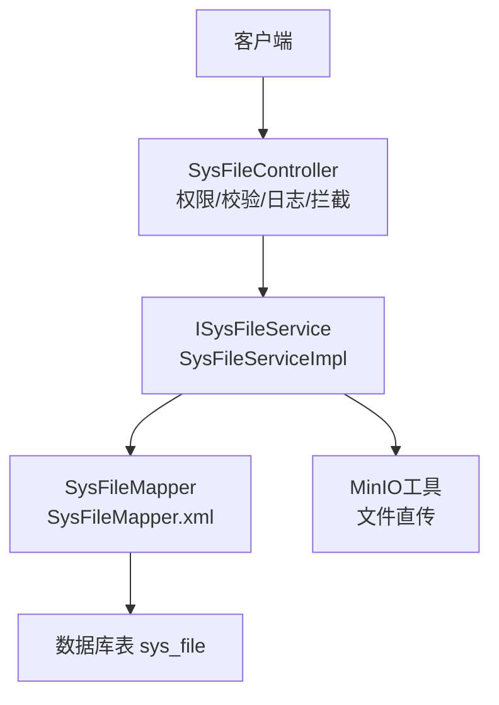
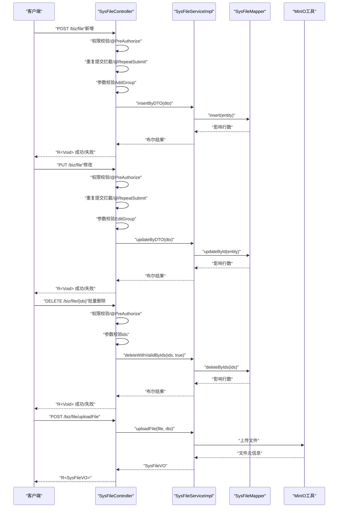
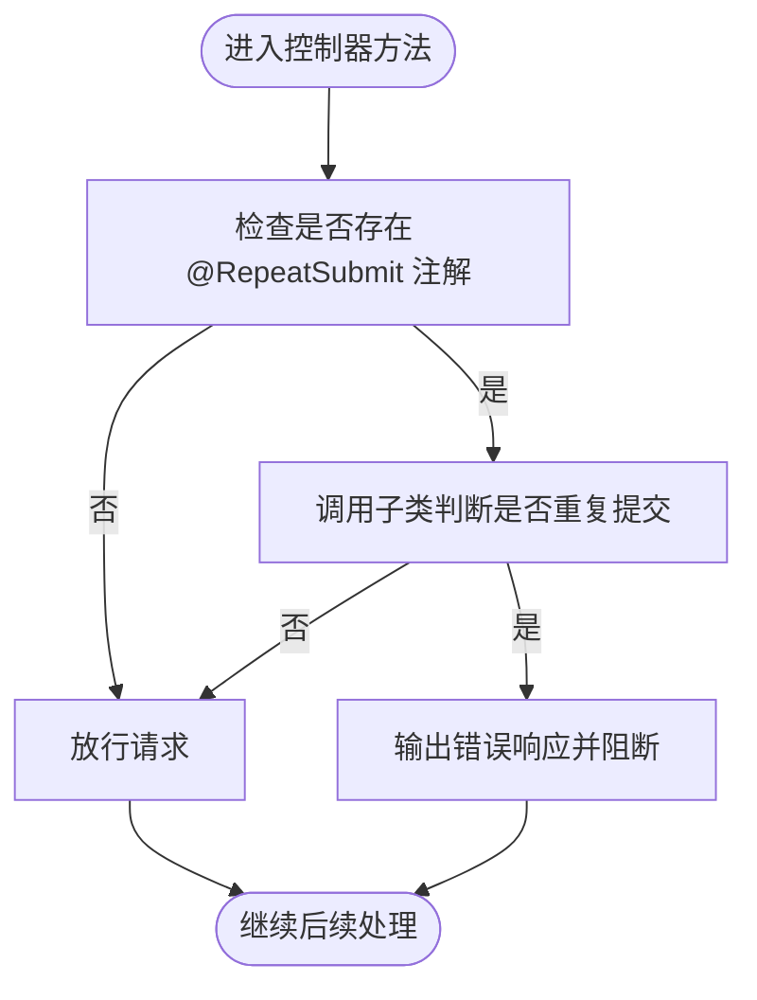
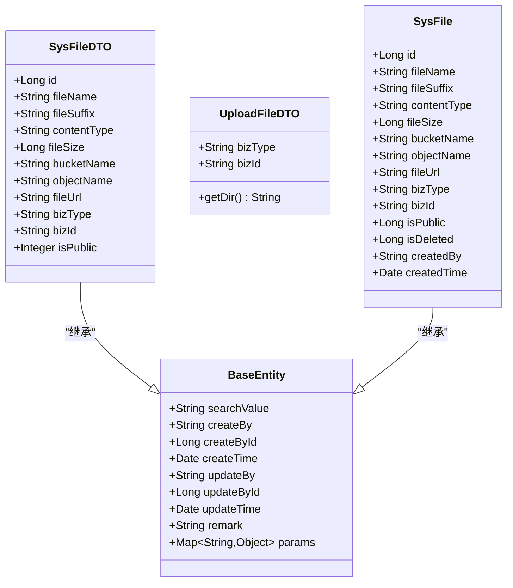
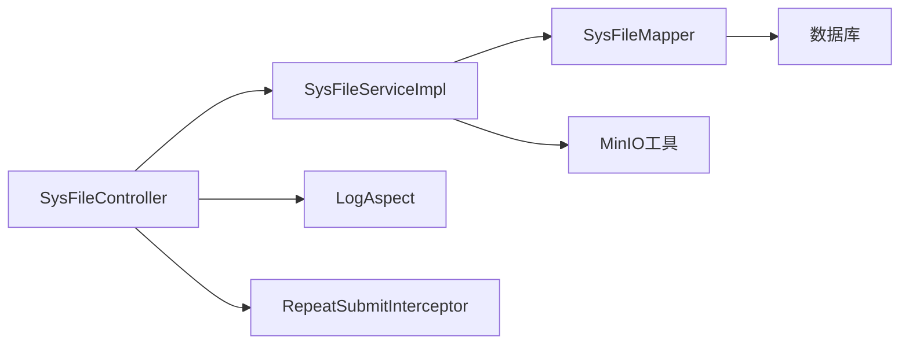

# 文件CRUD接口

<cite>
**本文引用的文件**
- [SysFileController.java](file://blog-admin/src/main/java/blog/web/controller/common/SysFileController.java)
- [SysFileDTO.java](file://blog-biz/src/main/java/blog/biz/domain/dto/SysFileDTO.java)
- [UploadFileDTO.java](file://blog-biz/src/main/java/blog/biz/domain/dto/UploadFileDTO.java)
- [SysFile.java](file://blog-biz/src/main/java/blog/biz/domain/SysFile.java)
- [ISysFileService.java](file://blog-biz/src/main/java/blog/biz/service/ISysFileService.java)
- [SysFileServiceImpl.java](file://blog-biz/src/main/java/blog/biz/service/impl/SysFileServiceImpl.java)
- [SysFileMapper.java](file://blog-biz/src/main/java/blog/biz/mapper/SysFileMapper.java)
- [SysFileMapper.xml](file://blog-biz/src/main/resources/mapper/SysFileMapper.xml)
- [BaseEntity.java](file://blog-common/src/main/java/blog/common/base/entity/BaseEntity.java)
- [AddGroup.java](file://blog-common/src/main/java/blog/common/validate/AddGroup.java)
- [EditGroup.java](file://blog-common/src/main/java/blog/common/validate/EditGroup.java)
- [RepeatSubmit.java](file://blog-common/src/main/java/blog/common/annotation/RepeatSubmit.java)
- [Log.java](file://blog-common/src/main/java/blog/common/annotation/Log.java)
- [BusinessType.java](file://blog-common/src/main/java/blog/common/enums/BusinessType.java)
- [OperatorType.java](file://blog-common/src/main/java/blog/common/enums/OperatorType.java)
- [LogAspect.java](file://blog-framework/src/main/java/blog/framework/aspectj/LogAspect.java)
- [RepeatSubmitInterceptor.java](file://blog-framework/src/main/java/blog/framework/interceptor/RepeatSubmitInterceptor.java)
</cite>

## 目录
1. [简介](#简介)
2. [项目结构](#项目结构)
3. [核心组件](#核心组件)
4. [架构总览](#架构总览)
5. [详细组件分析](#详细组件分析)
6. [依赖分析](#依赖分析)
7. [性能考量](#性能考量)
8. [故障排查指南](#故障排查指南)
9. [结论](#结论)
10. [附录：完整CRUD示例与规范](#附录完整crud示例与规范)

## 简介
本文件面向“文件CRUD接口”的API设计与实现，覆盖以下能力：
- 新增文件：POST /biz/file（支持重复提交防护与业务日志）
- 修改文件：PUT /biz/file（支持重复提交防护与业务日志）
- 删除文件：DELETE /biz/file/{ids}（支持批量删除，软删除策略见下文）
- 文件上传：POST /biz/file/uploadFile（基于MinIO的直传封装）
- 数据模型：SysFileDTO（含新增/编辑校验组）
- 安全与审计：权限控制（@PreAuthorize）、重复提交防护（@RepeatSubmit）、操作日志（@Log）

## 项目结构
围绕文件CRUD，涉及三层：
- 控制层：SysFileController 负责HTTP路由、参数校验、权限控制、日志与重复提交拦截
- 业务层：ISysFileService 及其实现 SysFileServiceImpl 负责领域逻辑、调用持久层与外部存储
- 数据层：SysFileMapper + XML 映射 + 实体类 SysFile 完成数据库读写

图表来源
- [SysFileController.java:35-123](file://blog-admin/src/main/java/blog/web/controller/common/SysFileController.java#L35-L123)
- [ISysFileService.java:15-75](file://blog-biz/src/main/java/blog/biz/service/ISysFileService.java#L15-L75)
- [SysFileServiceImpl.java:29-169](file://blog-biz/src/main/java/blog/biz/service/impl/SysFileServiceImpl.java#L29-L169)
- [SysFileMapper.java:13](file://blog-biz/src/main/java/blog/biz/mapper/SysFileMapper.java#L13)
- [SysFileMapper.xml:7-24](file://blog-biz/src/main/resources/mapper/SysFileMapper.xml#L7-L24)

章节来源
- [SysFileController.java:35-123](file://blog-admin/src/main/java/blog/web/controller/common/SysFileController.java#L35-L123)
- [SysFileServiceImpl.java:29-169](file://blog-biz/src/main/java/blog/biz/service/impl/SysFileServiceImpl.java#L29-L169)
- [SysFileMapper.xml:7-24](file://blog-biz/src/main/resources/mapper/SysFileMapper.xml#L7-L24)

## 核心组件
- 控制器：SysFileController
  - 路由：/biz/file
  - 权限：基于表达式 @PreAuthorize 控制 CRUD 四项权限
  - 日志：@Log 注解记录业务类型与请求/响应参数
  - 重复提交：@RepeatSubmit 注解配合拦截器进行间隔校验
- 服务层：ISysFileService 与 SysFileServiceImpl
  - 提供分页查询、列表导出、新增、修改、批量删除、文件上传等能力
  - 新增/修改前将DTO映射为实体并执行保存前校验
  - 批量删除默认走数据库删除（软删除策略见下文）
- 数据层：SysFileMapper + XML
  - 提供分页查询、列表查询、按ID删除等基础能力
- 数据模型：SysFileDTO、UploadFileDTO、SysFile
  - SysFileDTO：新增/编辑校验组 AddGroup、EditGroup
  - UploadFileDTO：封装业务类型与业务ID，计算目录结构
  - SysFile：实体类，包含 isDeleted 字段用于软删除标识

章节来源
- [SysFileController.java:35-123](file://blog-admin/src/main/java/blog/web/controller/common/SysFileController.java#L35-L123)
- [ISysFileService.java:15-75](file://blog-biz/src/main/java/blog/biz/service/ISysFileService.java#L15-L75)
- [SysFileServiceImpl.java:29-169](file://blog-biz/src/main/java/blog/biz/service/impl/SysFileServiceImpl.java#L29-L169)
- [SysFileDTO.java:19-83](file://blog-biz/src/main/java/blog/biz/domain/dto/SysFileDTO.java#L19-L83)
- [UploadFileDTO.java:15-36](file://blog-biz/src/main/java/blog/biz/domain/dto/UploadFileDTO.java#L15-L36)
- [SysFile.java:20-95](file://blog-biz/src/main/java/blog/biz/domain/SysFile.java#L20-L95)

## 架构总览
文件CRUD的典型调用链如下：

图表来源
- [SysFileController.java:76-121](file://blog-admin/src/main/java/blog/web/controller/common/SysFileController.java#L76-L121)
- [SysFileServiceImpl.java:105-167](file://blog-biz/src/main/java/blog/biz/service/impl/SysFileServiceImpl.java#L105-L167)
- [SysFileMapper.java:13](file://blog-biz/src/main/java/blog/biz/mapper/SysFileMapper.java#L13)

## 详细组件分析

### 控制器：SysFileController
- 新增接口（POST /biz/file）
  - 权限：@PreAuthorize("@ss.hasPermi('biz:file:add')")
  - 日志：@Log(title = "文件信息", businessType = BusinessType.INSERT)
  - 重复提交：@RepeatSubmit()
  - 校验组：@Validated(AddGroup.class)
  - 返回：R<Void>
- 修改接口（PUT /biz/file）
  - 权限：@PreAuthorize("@ss.hasPermi('biz:file:edit')")
  - 日志：@Log(title = "文件信息", businessType = BusinessType.UPDATE)
  - 重复提交：@RepeatSubmit()
  - 校验组：@Validated(EditGroup.class)
  - 返回：R<Void>
- 删除接口（DELETE /biz/file/{ids}）
  - 权限：@PreAuthorize("@ss.hasPermi('biz:file:remove')")
  - 日志：@Log(title = "文件信息", businessType = BusinessType.DELETE)
  - 参数：@NotEmpty @PathVariable Long[] ids
  - 业务：调用服务层 deleteWithValidByIds(ids, true)
  - 返回：R<Void>
- 文件上传（POST /biz/file/uploadFile）
  - 日志：@Log(title = "上传文件", businessType = BusinessType.INSERT)
  - 参数：MultipartFile file、bizType、bizId
  - 返回：R<SysFileVO>

章节来源
- [SysFileController.java:76-121](file://blog-admin/src/main/java/blog/web/controller/common/SysFileController.java#L76-L121)

### 服务层：ISysFileService 与 SysFileServiceImpl
- 查询与分页
  - queryById：根据ID查询VO
  - queryPageList：构建查询条件并分页返回
  - queryList：返回列表
- 新增与修改
  - insertByDTO：DTO -> 实体 -> 保存 -> 返回主键
  - updateByDTO：DTO -> 实体 -> 更新
  - validEntityBeforeSave：预留保存前校验扩展点
- 删除
  - deleteWithValidByIds：可选是否进行业务校验，最终执行批量删除
- 上传
  - uploadFile：委托 MinIO 工具上传，组装返回VO

章节来源
- [ISysFileService.java:21-75](file://blog-biz/src/main/java/blog/biz/service/ISysFileService.java#L21-L75)
- [SysFileServiceImpl.java:49-167](file://blog-biz/src/main/java/blog/biz/service/impl/SysFileServiceImpl.java#L49-L167)

### 数据模型与校验组
- SysFileDTO
  - 关键字段：fileName、bucketName、objectName 等
  - 校验规则：在 AddGroup 和 EditGroup 组合下必填
  - 继承 BaseEntity：自动填充创建/更新信息
- UploadFileDTO
  - 业务类型 bizType、业务ID bizId
  - 目录计算：getDir() 将 bizType 与 bizId 组合为目录层级
- AddGroup / EditGroup
  - 校验分组接口，分别用于新增与编辑场景
- BaseEntity
  - 统一的创建/更新字段填充（字段填充由MyBatis-Plus完成）

章节来源
- [SysFileDTO.java:19-83](file://blog-biz/src/main/java/blog/biz/domain/dto/SysFileDTO.java#L19-L83)
- [UploadFileDTO.java:15-36](file://blog-biz/src/main/java/blog/biz/domain/dto/UploadFileDTO.java#L15-L36)
- [AddGroup.java:8](file://blog-common/src/main/java/blog/common/validate/AddGroup.java#L8)
- [EditGroup.java:8](file://blog-common/src/main/java/blog/common/validate/EditGroup.java#L8)
- [BaseEntity.java:22-85](file://blog-common/src/main/java/blog/common/base/entity/BaseEntity.java#L22-L85)

### 重复提交防护机制（@RepeatSubmit）
- 注解定义
  - 支持配置间隔时间（毫秒，默认3000ms）与提示消息
- 拦截器
  - RepeatSubmitInterceptor 在 preHandle 中读取方法上的 @RepeatSubmit 注解
  - 若判定重复提交，直接输出错误响应并阻断请求
- 工作流程

图表来源
- [RepeatSubmit.java:15-30](file://blog-common/src/main/java/blog/common/annotation/RepeatSubmit.java#L15-L30)
- [RepeatSubmitInterceptor.java:22-49](file://blog-framework/src/main/java/blog/framework/interceptor/RepeatSubmitInterceptor.java#L22-L49)

章节来源
- [RepeatSubmit.java:15-30](file://blog-common/src/main/java/blog/common/annotation/RepeatSubmit.java#L15-L30)
- [RepeatSubmitInterceptor.java:22-49](file://blog-framework/src/main/java/blog/framework/interceptor/RepeatSubmitInterceptor.java#L22-L49)

### 操作日志与审计（@Log）
- 注解能力
  - title：模块标题
  - businessType：业务类型（新增/修改/删除/导出等）
  - operatorType：操作人类别（后台用户/移动端用户等）
  - isSaveRequestData/isSaveResponseData：是否记录请求/响应参数
  - excludeParamNames：排除敏感参数
- 切面实现
  - LogAspect 在前置通知开始计时，在返回或异常后统一收集IP、URL、方法、请求方式、耗时、参数与结果，并异步落库
- 审计要点
  - 登录用户信息、部门信息、错误信息、JSON结果等均纳入审计范围

章节来源
- [Log.java:20-50](file://blog-common/src/main/java/blog/common/annotation/Log.java#L20-L50)
- [LogAspect.java:86-134](file://blog-framework/src/main/java/blog/framework/aspectj/LogAspect.java#L86-L134)
- [BusinessType.java:8-59](file://blog-common/src/main/java/blog/common/enums/BusinessType.java#L8-L59)
- [OperatorType.java:8-24](file://blog-common/src/main/java/blog/common/enums/OperatorType.java#L8-L24)

### 删除策略：软删除与物理删除
- 当前实现
  - 控制器调用服务层 deleteWithValidByIds(ids, true)，服务层直接执行批量删除
- 软删除建议
  - 在实体 SysFile 中存在 isDeleted 字段，可在服务层改为更新 isDeleted=1 并保留记录，以满足合规与审计需求
  - 如需软删除，可在 SysFileServiceImpl 的 deleteWithValidByIds 中增加 isDeleted 更新逻辑，并在查询时默认过滤 isDeleted=0
- 物理删除
  - 当前即为物理删除（deleteByIds），若采用软删除，物理删除可通过专门接口实现

章节来源
- [SysFile.java:80-81](file://blog-biz/src/main/java/blog/biz/domain/SysFile.java#L80-L81)
- [SysFileServiceImpl.java:144-149](file://blog-biz/src/main/java/blog/biz/service/impl/SysFileServiceImpl.java#L144-L149)

### 数据模型类图

图表来源
- [BaseEntity.java:22-85](file://blog-common/src/main/java/blog/common/base/entity/BaseEntity.java#L22-L85)
- [SysFileDTO.java:19-83](file://blog-biz/src/main/java/blog/biz/domain/dto/SysFileDTO.java#L19-L83)
- [SysFile.java:20-95](file://blog-biz/src/main/java/blog/biz/domain/SysFile.java#L20-L95)
- [UploadFileDTO.java:15-36](file://blog-biz/src/main/java/blog/biz/domain/dto/UploadFileDTO.java#L15-L36)

## 依赖分析
- 控制器依赖
  - 权限：@PreAuthorize（Spring Security 表达式）
  - 日志：@Log（切面 LogAspect）
  - 重复提交：@RepeatSubmit（拦截器 RepeatSubmitInterceptor）
  - 校验：Jakarta Bean Validation（AddGroup/EditGroup）
- 服务层依赖
  - MyBatis-Plus：分页、条件构造器、字段填充
  - MinIO 工具：文件直传
- 数据层依赖
  - Mapper 接口 + XML 映射
  - 实体类 SysFile（包含 isDeleted 字段）

图表来源
- [SysFileController.java:35-123](file://blog-admin/src/main/java/blog/web/controller/common/SysFileController.java#L35-L123)
- [SysFileServiceImpl.java:29-169](file://blog-biz/src/main/java/blog/biz/service/impl/SysFileServiceImpl.java#L29-L169)
- [SysFileMapper.java:13](file://blog-biz/src/main/java/blog/biz/mapper/SysFileMapper.java#L13)
- [LogAspect.java:42-134](file://blog-framework/src/main/java/blog/framework/aspectj/LogAspect.java#L42-L134)
- [RepeatSubmitInterceptor.java:21-49](file://blog-framework/src/main/java/blog/framework/interceptor/RepeatSubmitInterceptor.java#L21-L49)

章节来源
- [SysFileController.java:35-123](file://blog-admin/src/main/java/blog/web/controller/common/SysFileController.java#L35-L123)
- [SysFileServiceImpl.java:29-169](file://blog-biz/src/main/java/blog/biz/service/impl/SysFileServiceImpl.java#L29-L169)
- [SysFileMapper.xml:7-24](file://blog-biz/src/main/resources/mapper/SysFileMapper.xml#L7-L24)

## 性能考量
- 分页查询
  - 使用 MyBatis-Plus 分页器与条件构造器，避免一次性加载大量数据
- 日志异步化
  - 操作日志通过异步任务队列记录，降低同步IO对主线程的影响
- 重复提交拦截
  - 建议结合缓存（如Redis）实现更细粒度的去重与限流
- 文件上传
  - 直传MinIO，建议限制文件大小与类型，结合CDN与鉴权策略

## 故障排查指南
- 重复提交
  - 现象：短时间内重复提交被拦截并返回错误
  - 排查：确认 @RepeatSubmit 配置的间隔时间是否合理；检查拦截器是否生效
- 参数校验失败
  - 现象：新增/编辑接口返回校验错误
  - 排查：确认请求体字段是否符合 AddGroup/EditGroup 规则；检查必填字段是否缺失
- 权限不足
  - 现象：返回无权限
  - 排查：确认用户角色是否具备 biz:file:add/edit/remove 权限
- 删除无效
  - 现象：批量删除未生效
  - 排查：确认 ids 是否为空；检查服务层 deleteWithValidByIds 是否正确执行

章节来源
- [RepeatSubmitInterceptor.java:22-49](file://blog-framework/src/main/java/blog/framework/interceptor/RepeatSubmitInterceptor.java#L22-L49)
- [SysFileController.java:76-121](file://blog-admin/src/main/java/blog/web/controller/common/SysFileController.java#L76-L121)
- [SysFileServiceImpl.java:144-149](file://blog-biz/src/main/java/blog/biz/service/impl/SysFileServiceImpl.java#L144-L149)

## 结论
- 文件CRUD接口已完整覆盖新增、修改、删除与上传能力
- 通过权限、校验、日志与重复提交拦截形成多层保障
- 删除策略目前为物理删除，建议引入软删除以满足合规与审计要求
- 建议在生产环境进一步完善文件类型/大小限制、鉴权与缓存策略

## 附录：完整CRUD示例与规范

### 新增文件（POST /biz/file）
- 权限：biz:file:add
- 请求体（SysFileDTO）
  - 必填字段：fileName、bucketName、objectName
  - 其他字段：fileSuffix、contentType、fileSize、fileUrl、bizType、bizId、isPublic
- 返回
  - R<Void>，成功/失败
- 示例
  - 请求体字段与含义参考 SysFileDTO 字段定义
  - 校验组：AddGroup

章节来源
- [SysFileController.java:76-85](file://blog-admin/src/main/java/blog/web/controller/common/SysFileController.java#L76-L85)
- [SysFileDTO.java:31-59](file://blog-biz/src/main/java/blog/biz/domain/dto/SysFileDTO.java#L31-L59)

### 修改文件（PUT /biz/file）
- 权限：biz:file:edit
- 请求体（SysFileDTO）
  - 至少包含主键 id 与待更新字段
  - 校验组：EditGroup
- 返回
  - R<Void>，成功/失败

章节来源
- [SysFileController.java:87-96](file://blog-admin/src/main/java/blog/web/controller/common/SysFileController.java#L87-L96)
- [SysFileDTO.java:31-59](file://blog-biz/src/main/java/blog/biz/domain/dto/SysFileDTO.java#L31-L59)

### 删除文件（DELETE /biz/file/{ids}）
- 权限：biz:file:remove
- 路径参数：ids（Long数组）
- 行为：批量删除（当前为物理删除）
- 返回
  - R<Void>，成功/失败

章节来源
- [SysFileController.java:98-109](file://blog-admin/src/main/java/blog/web/controller/common/SysFileController.java#L98-L109)

### 文件上传（POST /biz/file/uploadFile）
- 权限：biz:file:add（上传即新增记录）
- 请求参数
  - file：MultipartFile
  - bizType：业务类型（如 USER_AVATAR、BLOG_IMAGE）
  - bizId：业务ID（如用户ID、文章ID）
- 返回
  - R<SysFileVO>，包含文件元信息（原始名、类型、大小、桶名、对象名、URL、上传时间等）

章节来源
- [SysFileController.java:111-121](file://blog-admin/src/main/java/blog/web/controller/common/SysFileController.java#L111-L121)
- [UploadFileDTO.java:15-36](file://blog-biz/src/main/java/blog/biz/domain/dto/UploadFileDTO.java#L15-L36)
- [SysFileServiceImpl.java:151-167](file://blog-biz/src/main/java/blog/biz/service/impl/SysFileServiceImpl.java#L151-L167)

### 数据验证规则
- 新增（AddGroup）
  - fileName、bucketName、objectName 必填
- 编辑（EditGroup）
  - fileName、bucketName、objectName 必填
- 其他通用
  - bizType、bizId 由上传接口参数校验

章节来源
- [SysFileDTO.java:31-59](file://blog-biz/src/main/java/blog/biz/domain/dto/SysFileDTO.java#L31-L59)
- [AddGroup.java:8](file://blog-common/src/main/java/blog/common/validate/AddGroup.java#L8)
- [EditGroup.java:8](file://blog-common/src/main/java/blog/common/validate/EditGroup.java#L8)

### 权限控制与安全
- 权限表达式
  - 新增：biz:file:add
  - 修改：biz:file:edit
  - 删除：biz:file:remove
  - 查询/导出：biz:file:query、biz:file:export
- 安全建议
  - 上传接口限制文件类型与大小
  - 对外暴露URL建议鉴权或签名访问
  - 审计日志保留关键字段与异常信息

章节来源
- [SysFileController.java:46-62](file://blog-admin/src/main/java/blog/web/controller/common/SysFileController.java#L46-L62)
- [SysFileController.java:76-121](file://blog-admin/src/main/java/blog/web/controller/common/SysFileController.java#L76-L121)

### 软删除策略建议
- 引入 isDeleted 字段（实体已具备）
- 修改服务层删除逻辑：更新 isDeleted=1 并保留记录
- 查询默认过滤 isDeleted=0
- 提供“清空回收站”等物理删除接口

章节来源
- [SysFile.java:80-81](file://blog-biz/src/main/java/blog/biz/domain/SysFile.java#L80-L81)
- [SysFileServiceImpl.java:144-149](file://blog-biz/src/main/java/blog/biz/service/impl/SysFileServiceImpl.java#L144-L149)