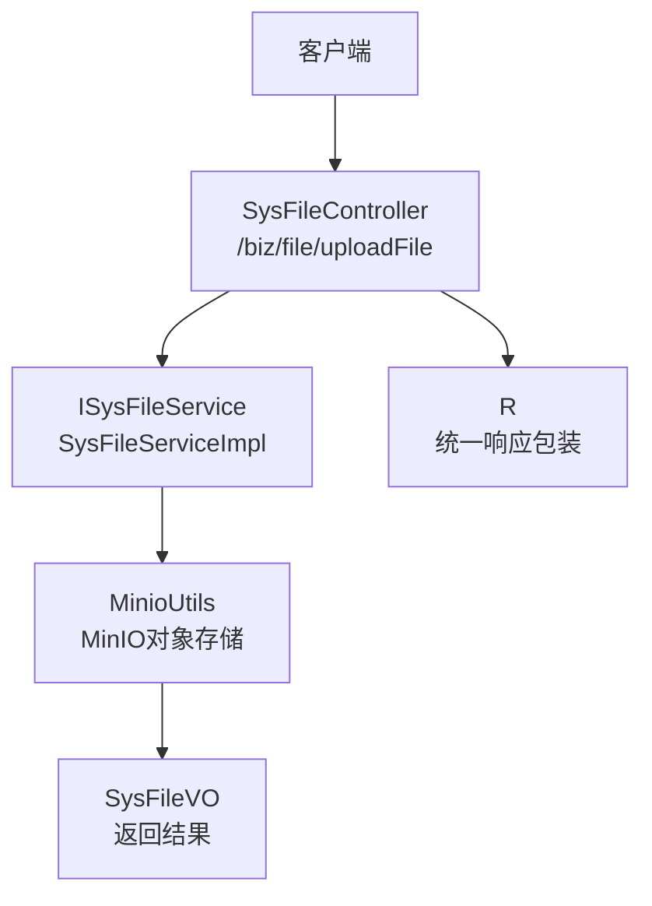
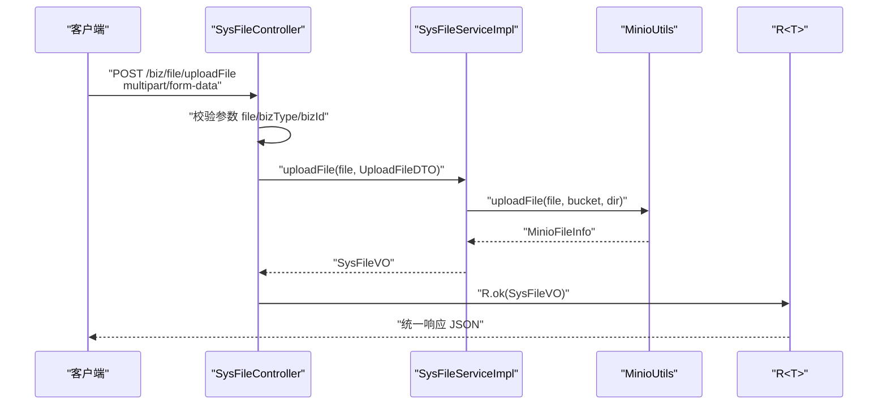
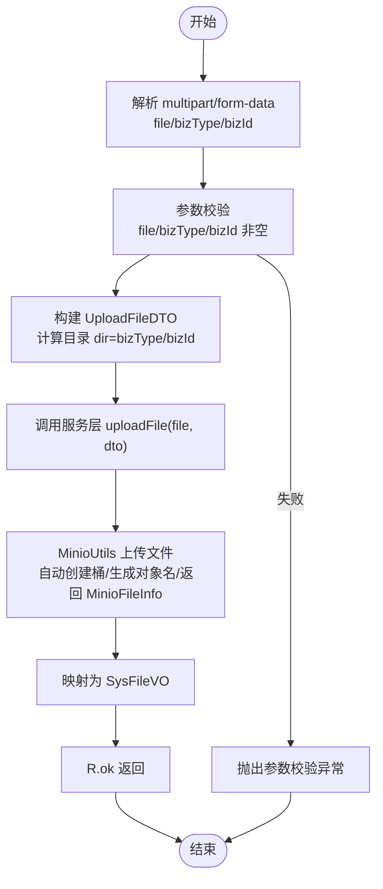
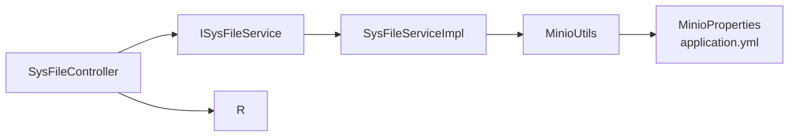

# 文件上传接口

<cite>
**本文引用的文件**
- [SysFileController.java](file://blog-admin/src/main/java/blog/web/controller/common/SysFileController.java)
- [UploadFileDTO.java](file://blog-biz/src/main/java/blog/biz/domain/dto/UploadFileDTO.java)
- [SysFileVO.java](file://blog-biz/src/main/java/blog/biz/domain/vo/SysFileVO.java)
- [ISysFileService.java](file://blog-biz/src/main/java/blog/biz/service/ISysFileService.java)
- [SysFileServiceImpl.java](file://blog-biz/src/main/java/blog/biz/service/impl/SysFileServiceImpl.java)
- [MinioUtils.java](file://blog-common/src/main/java/blog/common/utils/minio/MinioUtils.java)
- [application.yml](file://blog-admin/src/main/resources/application.yml)
- [MinioProperties.java](file://blog-common/src/main/java/blog/common/config/minio/MinioProperties.java)
- [FileUploadUtils.java](file://blog-common/src/main/java/blog/common/utils/file/FileUploadUtils.java)
- [R.java](file://blog-common/src/main/java/blog/common/base/resp/R.java)
- [InvalidExtensionException.java](file://blog-common/src/main/java/blog/common/exception/file/InvalidExtensionException.java)
- [FileSizeLimitExceededException.java](file://blog-common/src/main/java/blog/common/exception/file/FileSizeLimitExceededException.java)
</cite>

## 目录
1. [简介](#简介)
2. [项目结构](#项目结构)
3. [核心组件](#核心组件)
4. [架构概览](#架构概览)
5. [详细组件分析](#详细组件分析)
6. [依赖分析](#依赖分析)
7. [性能考虑](#性能考虑)
8. [故障排查指南](#故障排查指南)
9. [结论](#结论)
10. [附录](#附录)

## 简介
本文档面向开发者与测试人员，系统性说明 /biz/file/uploadFile 文件上传接口的实现与使用方法。该接口采用 POST 请求与 multipart/form-data 格式上传文件，支持业务类型与业务 ID 的绑定，最终通过 MinIO 完成对象存储，并返回包含文件元信息的 SysFileVO 视图对象。文档涵盖请求参数、数据传输对象 UploadFileDTO、业务逻辑（类型与大小校验、存储路径生成）、调用示例（curl 与前端 JavaScript）、返回结构说明以及常见错误与排查建议。

## 项目结构
与文件上传接口直接相关的模块与文件如下：
- 控制器层：SysFileController 提供 /biz/file/uploadFile 接口
- 业务层：ISysFileService 与 SysFileServiceImpl 实现上传逻辑
- 工具层：MinioUtils 封装 MinIO 对象存储操作
- 配置层：application.yml 与 MinioProperties 提供 MinIO 连接与桶配置
- 数据模型：UploadFileDTO（请求参数载体）、SysFileVO（返回结果）
- 响应封装：R<T> 统一响应结构
- 校验与异常：FileUploadUtils、InvalidExtensionException、FileSizeLimitExceededException

图表来源
- [SysFileController.java:111-121](file://blog-admin/src/main/java/blog/web/controller/common/SysFileController.java#L111-L121)
- [SysFileServiceImpl.java:151-167](file://blog-biz/src/main/java/blog/biz/service/impl/SysFileServiceImpl.java#L151-L167)
- [MinioUtils.java:85-111](file://blog-common/src/main/java/blog/common/utils/minio/MinioUtils.java#L85-L111)
- [R.java:31-73](file://blog-common/src/main/java/blog/common/base/resp/R.java#L31-L73)

章节来源
- [SysFileController.java:111-121](file://blog-admin/src/main/java/blog/web/controller/common/SysFileController.java#L111-L121)
- [application.yml:155-161](file://blog-admin/src/main/resources/application.yml#L155-L161)

## 核心组件
- 接口路径与方法
  - 方法：POST
  - 路径：/biz/file/uploadFile
  - 功能：上传文件并返回文件元信息
- 请求参数
  - file：必填，multipart/form-data 中的文件字段
  - bizType：必填，业务类型字符串，用于生成存储目录
  - bizId：必填，业务 ID 字符串，用于生成存储目录
- 数据传输对象 UploadFileDTO
  - 字段：bizType、bizId
  - 计算属性：getDir() 返回目录路径 bizType/bizId
- 返回对象 SysFileVO
  - 字段：fileName、fileSuffix、contentType、fileSize、bucketName、objectName、fileUrl、bizType、bizId、isPublic、isDeleted、createdBy、createdTime
- 统一响应 R<T>
  - 结构：code、msg、data
  - 成功状态码：SUCCESS（由常量定义）

章节来源
- [SysFileController.java:111-121](file://blog-admin/src/main/java/blog/web/controller/common/SysFileController.java#L111-L121)
- [UploadFileDTO.java:19-34](file://blog-biz/src/main/java/blog/biz/domain/dto/UploadFileDTO.java#L19-L34)
- [SysFileVO.java:33-111](file://blog-biz/src/main/java/blog/biz/domain/vo/SysFileVO.java#L33-L111)
- [R.java:18-73](file://blog-common/src/main/java/blog/common/base/resp/R.java#L18-L73)

## 架构概览
文件上传的整体流程如下：
- 控制器接收 multipart/form-data 请求，解析 file、bizType、bizId
- 将 bizType、bizId 组装为 UploadFileDTO，并调用服务层上传方法
- 服务层委托 MinioUtils 完成文件上传，生成对象路径与访问 URL
- 返回 SysFileVO 封装到 R<T> 统一响应中

图表来源
- [SysFileController.java:111-121](file://blog-admin/src/main/java/blog/web/controller/common/SysFileController.java#L111-L121)
- [SysFileServiceImpl.java:151-167](file://blog-biz/src/main/java/blog/biz/service/impl/SysFileServiceImpl.java#L151-L167)
- [MinioUtils.java:85-111](file://blog-common/src/main/java/blog/common/utils/minio/MinioUtils.java#L85-L111)
- [R.java:31-73](file://blog-common/src/main/java/blog/common/base/resp/R.java#L31-L73)

## 详细组件分析

### 控制器层：SysFileController
- 责任
  - 接收 multipart/form-data 请求
  - 参数校验（@NotNull/@NotBlank）
  - 组装 UploadFileDTO 并调用服务层
  - 记录日志与重复提交注解
- 关键点
  - 使用 @RequestParam 接收 file、bizType、bizId
  - 通过 UploadFileDTO.builder() 构建目录参数
  - 返回 R.ok(...) 包裹 SysFileVO

章节来源
- [SysFileController.java:111-121](file://blog-admin/src/main/java/blog/web/controller/common/SysFileController.java#L111-L121)

### 业务层：ISysFileService 与 SysFileServiceImpl
- ISysFileService
  - 声明 uploadFile(MultipartFile, UploadFileDTO) 方法
- SysFileServiceImpl
  - 调用 MinioUtils.uploadFile(file, bucket, dir)
  - 将 MinioFileInfo 映射为 SysFileVO 返回
  - 异常向上抛出（由全局异常处理捕获）

章节来源
- [ISysFileService.java:73](file://blog-biz/src/main/java/blog/biz/service/ISysFileService.java#L73)
- [SysFileServiceImpl.java:151-167](file://blog-biz/src/main/java/blog/biz/service/impl/SysFileServiceImpl.java#L151-L167)

### MinIO 工具：MinioUtils
- 功能
  - 自动创建桶（若不存在）
  - 生成对象名：dir/UUID.后缀
  - 上传文件并返回 MinioFileInfo
  - 生成带过期时间的预签名 URL
- 关键行为
  - 未显式传入 bucket 时使用配置的默认桶
  - 对象名拼接目录与随机 UUID，保留原文件后缀
  - 返回的 URL 为临时访问地址（默认 24 小时）

章节来源
- [MinioUtils.java:85-111](file://blog-common/src/main/java/blog/common/utils/minio/MinioUtils.java#L85-L111)
- [MinioUtils.java:159-182](file://blog-common/src/main/java/blog/common/utils/minio/MinioUtils.java#L159-L182)
- [application.yml:155-161](file://blog-admin/src/main/resources/application.yml#L155-L161)
- [MinioProperties.java:14-21](file://blog-common/src/main/java/blog/common/config/minio/MinioProperties.java#L14-L21)

### 数据模型与响应
- UploadFileDTO
  - bizType、bizId 必填
  - getDir() 返回目录路径 bizType/bizId
- SysFileVO
  - 文件基础信息：fileName、fileSuffix、contentType、fileSize
  - 存储位置：bucketName、objectName
  - 访问地址：fileUrl
  - 业务关联：bizType、bizId
  - 状态与创建信息：isPublic、isDeleted、createdBy、createdTime
- R<T>
  - 统一返回 code、msg、data

章节来源
- [UploadFileDTO.java:19-34](file://blog-biz/src/main/java/blog/biz/domain/dto/UploadFileDTO.java#L19-L34)
- [SysFileVO.java:33-111](file://blog-biz/src/main/java/blog/biz/domain/vo/SysFileVO.java#L33-L111)
- [R.java:18-73](file://blog-common/src/main/java/blog/common/base/resp/R.java#L18-L73)

### 业务逻辑流程（含校验与存储）

图表来源
- [SysFileController.java:111-121](file://blog-admin/src/main/java/blog/web/controller/common/SysFileController.java#L111-L121)
- [SysFileServiceImpl.java:151-167](file://blog-biz/src/main/java/blog/biz/service/impl/SysFileServiceImpl.java#L151-L167)
- [MinioUtils.java:85-111](file://blog-common/src/main/java/blog/common/utils/minio/MinioUtils.java#L85-L111)

## 依赖分析
- 控制器依赖服务层接口
- 服务层依赖 MinioUtils
- MinioUtils 依赖 MinIO 客户端与配置（endpoint、accessKey、secretKey、bucketName）
- 统一响应 R<T> 作为返回封装

图表来源
- [SysFileController.java:111-121](file://blog-admin/src/main/java/blog/web/controller/common/SysFileController.java#L111-L121)
- [SysFileServiceImpl.java:151-167](file://blog-biz/src/main/java/blog/biz/service/impl/SysFileServiceImpl.java#L151-L167)
- [MinioUtils.java:33-35](file://blog-common/src/main/java/blog/common/utils/minio/MinioUtils.java#L33-L35)
- [application.yml:155-161](file://blog-admin/src/main/resources/application.yml#L155-L161)
- [MinioProperties.java:14-21](file://blog-common/src/main/java/blog/common/config/minio/MinioProperties.java#L14-L21)
- [R.java:31-73](file://blog-common/src/main/java/blog/common/base/resp/R.java#L31-L73)

## 性能考虑
- 上传大小限制
  - Spring 配置：max-file-size=10MB，max-request-size=20MB
  - 若需调整，请在 application.yml 中修改对应项
- MinIO 上传
  - 使用流式上传，避免大文件内存占用过高
  - 临时 URL 默认 24 小时，避免频繁签名
- 目录组织
  - 通过 bizType/bizId 组织目录，便于后续按业务维度管理与清理

章节来源
- [application.yml:52-58](file://blog-admin/src/main/resources/application.yml#L52-L58)
- [MinioUtils.java:85-111](file://blog-common/src/main/java/blog/common/utils/minio/MinioUtils.java#L85-L111)

## 故障排查指南
- 常见参数校验错误
  - file 为空：控制器参数校验失败
  - bizType 或 bizId 为空：@NotBlank 校验失败
- MinIO 连接问题
  - 确认 endpoint、accessKey、secretKey、bucketName 配置正确
  - 确认 MinIO 服务可达且桶存在（工具类会自动创建）
- 文件类型与大小限制
  - 当前实现未强制限制文件类型与大小，如需限制可在服务层扩展
  - 如需参考传统文件上传校验，可参考 FileUploadUtils（非当前实现路径）
- 异常处理
  - 上传过程异常会被服务层捕获并抛出运行时异常
  - 建议结合全局异常处理器输出统一错误信息

章节来源
- [SysFileController.java:113-115](file://blog-admin/src/main/java/blog/web/controller/common/SysFileController.java#L113-L115)
- [application.yml:155-161](file://blog-admin/src/main/resources/application.yml#L155-L161)
- [MinioUtils.java:85-111](file://blog-common/src/main/java/blog/common/utils/minio/MinioUtils.java#L85-L111)
- [InvalidExtensionException.java:17-22](file://blog-common/src/main/java/blog/common/exception/file/InvalidExtensionException.java#L17-L22)
- [FileSizeLimitExceededException.java:11-13](file://blog-common/src/main/java/blog/common/exception/file/FileSizeLimitExceededException.java#L11-L13)

## 结论
/uploadFile 接口通过清晰的参数校验、简洁的 DTO 组织与稳定的 MinIO 存储链路，实现了可靠的文件上传能力。返回的 SysFileVO 提供了文件元信息与访问 URL，便于前端直接展示与引用。如需增强安全性与合规性，可在服务层增加类型与大小限制，并完善权限控制与审计日志。

## 附录

### API 定义
- 方法：POST
- 路径：/biz/file/uploadFile
- 内容类型：multipart/form-data
- 请求参数
  - file：二进制文件（必填）
  - bizType：业务类型字符串（必填）
  - bizId：业务 ID 字符串（必填）
- 响应
  - R<SysFileVO>，其中 data 为 SysFileVO

章节来源
- [SysFileController.java:111-121](file://blog-admin/src/main/java/blog/web/controller/common/SysFileController.java#L111-L121)
- [R.java:18-73](file://blog-common/src/main/java/blog/common/base/resp/R.java#L18-L73)

### 返回对象 SysFileVO 字段说明
- fileName：原始文件名
- fileSuffix：文件后缀
- contentType：MIME 类型
- fileSize：文件大小（字节）
- bucketName：MinIO 桶名
- objectName：对象路径
- fileUrl：访问 URL（临时）
- bizType：业务类型
- bizId：业务 ID
- isPublic：是否公开
- isDeleted：是否删除
- createdBy：上传人
- createdTime：创建时间

章节来源
- [SysFileVO.java:33-111](file://blog-biz/src/main/java/blog/biz/domain/vo/SysFileVO.java#L33-L111)

### 调用示例

- curl 示例
  - 上传文件并指定业务类型与业务 ID
  - 注意替换实际服务器地址与文件路径

章节来源
- [SysFileController.java:111-121](file://blog-admin/src/main/java/blog/web/controller/common/SysFileController.java#L111-L121)

- 前端 JavaScript fetch 示例
  - 使用 FormData 上传文件
  - 指定 bizType 与 bizId
  - 解析 R<T> 响应并提取 SysFileVO

章节来源
- [SysFileController.java:111-121](file://blog-admin/src/main/java/blog/web/controller/common/SysFileController.java#L111-L121)
- [R.java:31-73](file://blog-common/src/main/java/blog/common/base/resp/R.java#L31-L73)