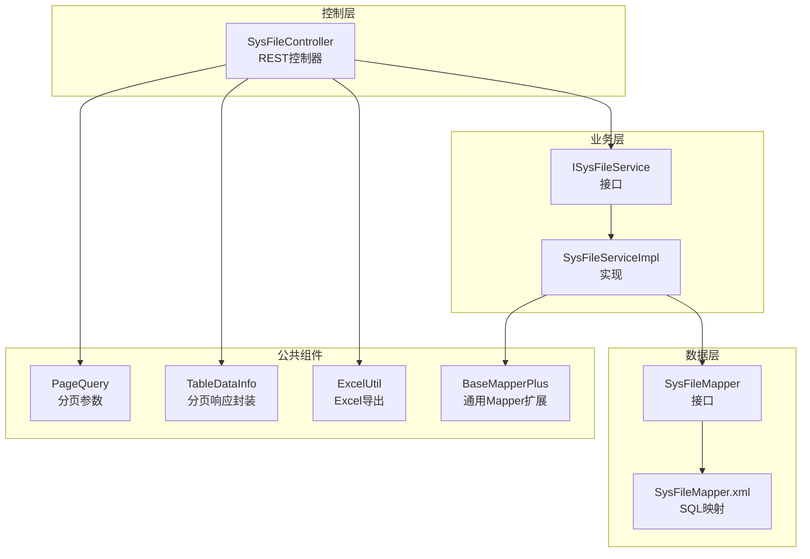
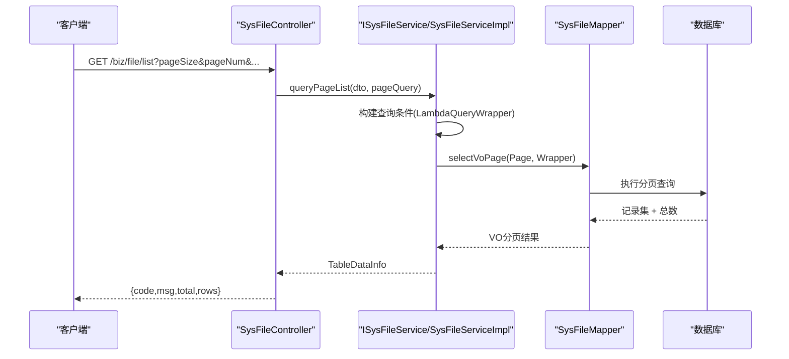
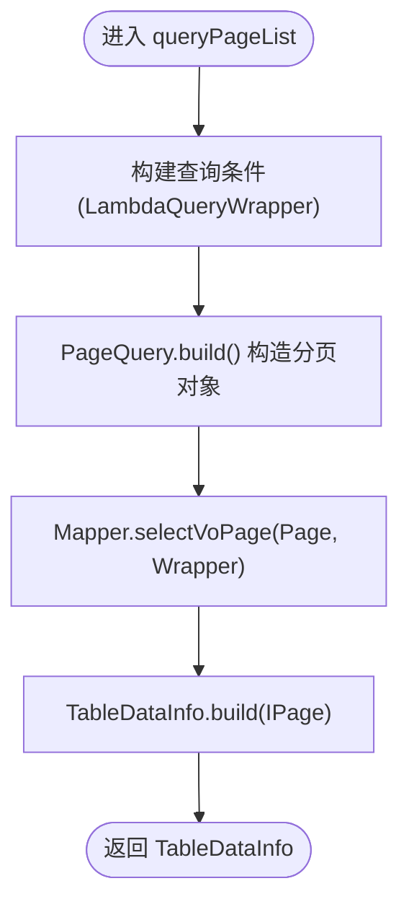
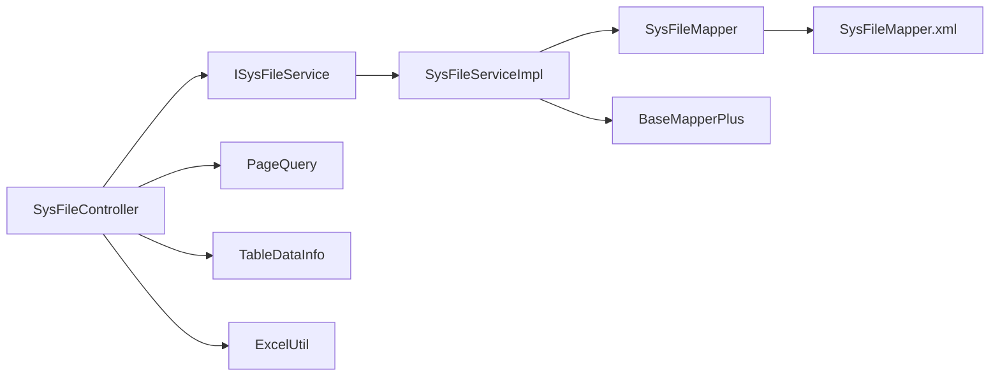
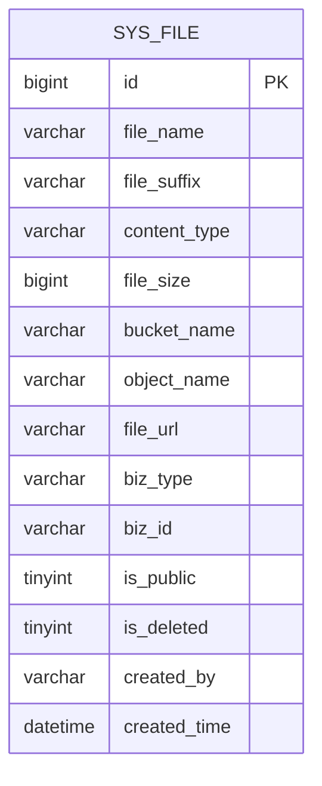

# 文件查询接口

<cite>
**本文引用的文件**
- [SysFileController.java](file://blog-admin/src/main/java/blog/web/controller/common/SysFileController.java)
- [SysFileDTO.java](file://blog-biz/src/main/java/blog/biz/domain/dto/SysFileDTO.java)
- [SysFileVO.java](file://blog-biz/src/main/java/blog/biz/domain/vo/SysFileVO.java)
- [PageQuery.java](file://blog-common/src/main/java/blog/common/base/req/PageQuery.java)
- [TableDataInfo.java](file://blog-common/src/main/java/blog/common/base/resp/TableDataInfo.java)
- [ISysFileService.java](file://blog-biz/src/main/java/blog/biz/service/ISysFileService.java)
- [SysFileServiceImpl.java](file://blog-biz/src/main/java/blog/biz/service/impl/SysFileServiceImpl.java)
- [SysFileMapper.java](file://blog-biz/src/main/java/blog/biz/mapper/SysFileMapper.java)
- [SysFileMapper.xml](file://blog-biz/src/main/resources/mapper/SysFileMapper.xml)
- [ExcelUtil.java](file://blog-common/src/main/java/blog/common/utils/poi/ExcelUtil.java)
- [BaseMapperPlus.java](file://blog-common/src/main/java/blog/common/base/mapper/BaseMapperPlus.java)
</cite>

## 目录
1. [简介](#简介)
2. [项目结构](#项目结构)
3. [核心组件](#核心组件)
4. [架构概览](#架构概览)
5. [详细组件分析](#详细组件分析)
6. [依赖分析](#依赖分析)
7. [性能考虑](#性能考虑)
8. [故障排查指南](#故障排查指南)
9. [结论](#结论)
10. [附录](#附录)

## 简介
本文件面向开发者与运维人员，系统性地梳理“文件查询接口”的设计与实现，覆盖以下能力：
- 文件列表查询接口（GET /biz/file/list）
- 文件详情查询接口（GET /biz/file/{id}）
- 条件查询与分页查询（SysFileDTO + PageQuery）
- 导出功能接口（POST /biz/file/export）的Excel导出实现
- 返回数据结构（TableDataInfo + SysFileVO）
- 查询示例与最佳实践
- 性能优化建议

## 项目结构
围绕文件查询接口的相关模块分布如下：
- 控制层：SysFileController 提供REST接口
- 业务层：ISysFileService + SysFileServiceImpl 实现查询与导出
- 数据层：SysFileMapper + SysFileMapper.xml 提供数据库访问
- 公共组件：PageQuery（分页）、TableDataInfo（响应封装）、ExcelUtil（导出）、BaseMapperPlus（通用Mapper扩展）

图表来源
- [SysFileController.java:39-123](file://blog-admin/src/main/java/blog/web/controller/common/SysFileController.java#L39-L123)
- [ISysFileService.java:21-75](file://blog-biz/src/main/java/blog/biz/service/ISysFileService.java#L21-L75)
- [SysFileServiceImpl.java:38-169](file://blog-biz/src/main/java/blog/biz/service/impl/SysFileServiceImpl.java#L38-L169)
- [SysFileMapper.java:13-16](file://blog-biz/src/main/java/blog/biz/mapper/SysFileMapper.java#L13-L16)
- [SysFileMapper.xml:1-24](file://blog-biz/src/main/resources/mapper/SysFileMapper.xml#L1-L24)
- [PageQuery.java:24-128](file://blog-common/src/main/java/blog/common/base/req/PageQuery.java#L24-L128)
- [TableDataInfo.java:14-98](file://blog-common/src/main/java/blog/common/base/resp/TableDataInfo.java#L14-L98)
- [ExcelUtil.java:483-501](file://blog-common/src/main/java/blog/common/utils/poi/ExcelUtil.java#L483-L501)
- [BaseMapperPlus.java:32-335](file://blog-common/src/main/java/blog/common/base/mapper/BaseMapperPlus.java#L32-L335)

章节来源
- [SysFileController.java:39-123](file://blog-admin/src/main/java/blog/web/controller/common/SysFileController.java#L39-L123)
- [SysFileServiceImpl.java:61-78](file://blog-biz/src/main/java/blog/biz/service/impl/SysFileServiceImpl.java#L61-L78)
- [SysFileMapper.xml:7-22](file://blog-biz/src/main/resources/mapper/SysFileMapper.xml#L7-L22)

## 核心组件
- 控制器 SysFileController
  - 提供 GET /biz/file/list（列表查询）、GET /biz/file/{id}（详情查询）、POST /biz/file/export（导出）
  - 使用权限注解与日志注解，确保安全与审计
- 业务服务 ISysFileService/SysFileServiceImpl
  - 实现分页查询、条件查询、导出、详情查询、文件上传等
- 数据访问 SysFileMapper + SysFileMapper.xml
  - 基于 MyBatis Plus 的通用Mapper扩展 BaseMapperPlus
  - 提供 selectVoPage/selectVoList/selectVoById 等查询方法
- 分页与响应封装
  - PageQuery：分页参数（pageNum/pageSize/orderByColumn/isAsc）
  - TableDataInfo：统一分页响应结构（total/rows/code/msg）
- 导出工具 ExcelUtil
  - 基于 Apache POI，支持 HttpServletResponse 直接输出Excel

章节来源
- [SysFileController.java:47-62](file://blog-admin/src/main/java/blog/web/controller/common/SysFileController.java#L47-L62)
- [ISysFileService.java:29-46](file://blog-biz/src/main/java/blog/biz/service/ISysFileService.java#L29-L46)
- [SysFileServiceImpl.java:61-78](file://blog-biz/src/main/java/blog/biz/service/impl/SysFileServiceImpl.java#L61-L78)
- [PageQuery.java:62-115](file://blog-common/src/main/java/blog/common/base/req/PageQuery.java#L62-L115)
- [TableDataInfo.java:57-64](file://blog-common/src/main/java/blog/common/base/resp/TableDataInfo.java#L57-L64)
- [ExcelUtil.java:483-501](file://blog-common/src/main/java/blog/common/utils/poi/ExcelUtil.java#L483-L501)

## 架构概览
文件查询接口遵循经典的三层架构：控制层负责请求接入与鉴权，业务层负责查询编排与导出，数据层负责ORM映射与SQL执行。

图表来源
- [SysFileController.java:47-50](file://blog-admin/src/main/java/blog/web/controller/common/SysFileController.java#L47-L50)
- [SysFileServiceImpl.java:61-66](file://blog-biz/src/main/java/blog/biz/service/impl/SysFileServiceImpl.java#L61-L66)
- [SysFileMapper.java:13-16](file://blog-biz/src/main/java/blog/biz/mapper/SysFileMapper.java#L13-L16)
- [BaseMapperPlus.java:296-320](file://blog-common/src/main/java/blog/common/base/mapper/BaseMapperPlus.java#L296-L320)

## 详细组件分析

### 接口定义与权限控制
- GET /biz/file/list
  - 参数：SysFileDTO（查询条件）+ PageQuery（分页与排序）
  - 返回：TableDataInfo<SysFileVO>
  - 权限：@PreAuthorize("@ss.hasPermi('biz:file:list')")
- GET /biz/file/{id}
  - 参数：路径变量 Long id
  - 返回：R<SysFileVO>（统一响应包装）
  - 权限：@PreAuthorize("@ss.hasPermi('biz:file:query')")

章节来源
- [SysFileController.java:47-74](file://blog-admin/src/main/java/blog/web/controller/common/SysFileController.java#L47-L74)

### SysFileDTO 查询条件参数
SysFileDTO 继承 BaseEntity，支持以下查询字段（非空校验按 Add/Edit 分组）：
- fileName：原始文件名（模糊匹配）
- fileSuffix：文件后缀
- contentType：文件类型（如 image/jpeg）
- fileSize：文件大小（字节）
- bucketName：MinIO 桶名（模糊匹配）
- objectName：MinIO 对象路径（模糊匹配）
- fileUrl：文件访问URL
- bizType：业务类型（如 USER_AVATAR、BLOG_IMAGE）
- bizId：业务ID（如用户ID、博客ID）
- isPublic：是否公开（0/1）
- createBy：创建人
- createTime：创建时间

查询构建逻辑位于 SysFileServiceImpl.buildQueryWrapper，采用 MyBatis Plus LambdaQueryWrapper，对非空字段进行 eq/like 条件拼装，并默认按 id 升序排序。

章节来源
- [SysFileDTO.java:21-82](file://blog-biz/src/main/java/blog/biz/domain/dto/SysFileDTO.java#L21-L82)
- [SysFileServiceImpl.java:80-97](file://blog-biz/src/main/java/blog/biz/service/impl/SysFileServiceImpl.java#L80-L97)

### PageQuery 分页与排序参数
- pageNum：当前页（默认 1）
- pageSize：每页记录数（默认 Integer.MAX_VALUE，即不分页）
- orderByColumn：排序字段（支持多字段，下划线命名）
- isAsc：排序方向（asc/desc 或 ascending/descending 兼容）

分页对象构建逻辑：
- PageQuery.build()：根据 pageNum/pageSize 构造 Page<T>，并调用 buildOrderItem() 生成 OrderItem 列表
- buildOrderItem()：对 orderByColumn 进行 SQL 注入防护与下划线转换，支持多字段与混合方向
- getFirstNum()：计算起始偏移量（pageNum-1)*pageSize

章节来源
- [PageQuery.java:62-120](file://blog-common/src/main/java/blog/common/base/req/PageQuery.java#L62-L120)
- [PageQuery.java:85-115](file://blog-common/src/main/java/blog/common/base/req/PageQuery.java#L85-L115)

### 分页查询实现逻辑
- 控制器：SysFileController.list 将请求参数直接透传给业务层
- 业务层：
  - 构建 LambdaQueryWrapper（buildQueryWrapper）
  - 调用 Mapper.selectVoPage(pageQuery.build(), wrapper)
  - 使用 TableDataInfo.build(IPage) 包装响应
- 数据层：BaseMapperPlus.selectVoPage 将实体分页结果映射为 VO 分页

图表来源
- [SysFileServiceImpl.java:61-66](file://blog-biz/src/main/java/blog/biz/service/impl/SysFileServiceImpl.java#L61-L66)
- [BaseMapperPlus.java:296-320](file://blog-common/src/main/java/blog/common/base/mapper/BaseMapperPlus.java#L296-L320)
- [TableDataInfo.java:57-64](file://blog-common/src/main/java/blog/common/base/resp/TableDataInfo.java#L57-L64)

### 详情查询实现
- 控制器：@PathVariable Long id，参数校验 @NotNull
- 业务层：SysFileServiceImpl.queryById 调用 Mapper.selectVoById
- 返回：R.ok(...) 包装的 SysFileVO

章节来源
- [SysFileController.java:69-74](file://blog-admin/src/main/java/blog/web/controller/common/SysFileController.java#L69-L74)
- [SysFileServiceImpl.java:49-52](file://blog-biz/src/main/java/blog/biz/service/impl/SysFileServiceImpl.java#L49-L52)

### 导出功能实现（POST /biz/file/export）
- 控制器：接收 SysFileDTO 作为查询条件，HttpServletResponse 输出Excel
- 业务层：SysFileServiceImpl.queryList(dto) 获取全部匹配记录
- 工具层：ExcelUtil<SysFileVO>.exportExcel(response, list, "文件信息")

SysFileVO 上的 @Excel 注解用于导出列名映射。

章节来源
- [SysFileController.java:55-62](file://blog-admin/src/main/java/blog/web/controller/common/SysFileController.java#L55-L62)
- [SysFileServiceImpl.java:74-78](file://blog-biz/src/main/java/blog/biz/service/impl/SysFileServiceImpl.java#L74-L78)
- [ExcelUtil.java:483-501](file://blog-common/src/main/java/blog/common/utils/poi/ExcelUtil.java#L483-L501)
- [SysFileVO.java:36-91](file://blog-biz/src/main/java/blog/biz/domain/vo/SysFileVO.java#L36-L91)

### 返回数据结构
- TableDataInfo<T>
  - total：总记录数
  - rows：列表数据
  - code：消息状态码
  - msg：消息内容
- SysFileVO
  - 字段与 @Excel 注解一一对应，便于导出与展示

章节来源
- [TableDataInfo.java:14-98](file://blog-common/src/main/java/blog/common/base/resp/TableDataInfo.java#L14-L98)
- [SysFileVO.java:28-114](file://blog-biz/src/main/java/blog/biz/domain/vo/SysFileVO.java#L28-L114)

## 依赖分析
- 控制器依赖业务服务与公共组件（权限、日志、分页、响应封装、导出）
- 业务服务依赖 Mapper 与通用 Mapper 扩展
- Mapper 依赖 MyBatis Plus 与 XML 映射
- 导出依赖 Apache POI 与 ExcelUtil

图表来源
- [SysFileController.java:39-123](file://blog-admin/src/main/java/blog/web/controller/common/SysFileController.java#L39-L123)
- [SysFileServiceImpl.java:38-169](file://blog-biz/src/main/java/blog/biz/service/impl/SysFileServiceImpl.java#L38-L169)
- [SysFileMapper.java:13-16](file://blog-biz/src/main/java/blog/biz/mapper/SysFileMapper.java#L13-L16)
- [BaseMapperPlus.java:32-335](file://blog-common/src/main/java/blog/common/base/mapper/BaseMapperPlus.java#L32-L335)

## 性能考虑
- 分页策略
  - 默认不分页（pageSize=Integer.MAX_VALUE）会一次性加载大量数据，建议在生产环境显式设置合理 pageSize
  - PageQuery.build() 会对 pageNum/pageSize 做边界校验，避免无效页
- 排序与索引
  - orderByColumn 支持多字段排序，但需确保数据库对相关列建立合适索引以避免全表扫描
  - 多字段排序可能增加排序成本，建议结合实际查询场景选择必要字段
- 查询条件
  - like 模糊匹配（fileName、bucketName、objectName）可能无法命中索引，建议配合前缀精确过滤或建立合适的复合索引
- 导出性能
  - ExcelUtil 默认使用 SXSSFWorkbook 流式写入，适合大数据量导出
  - 建议限制导出范围（结合查询条件），避免超大结果集导致内存压力

[本节为通用性能建议，不直接分析具体文件]

## 故障排查指南
- 参数校验错误
  - GET /biz/file/{id}：id 为空将触发 @NotNull 校验
  - SysFileDTO：Add/Edit 分组校验未通过会返回参数错误
- 排序参数错误
  - PageQuery.buildOrderItem() 对 isAsc 与 orderByColumn 长度不一致或非法值抛出异常
- 导出异常
  - ExcelUtil 导出过程中捕获异常并记录日志，检查响应输出流与浏览器兼容性
- 权限不足
  - 控制器使用 @PreAuthorize 注解，权限不足将被拒绝访问

章节来源
- [SysFileController.java:71-109](file://blog-admin/src/main/java/blog/web/controller/common/SysFileController.java#L71-L109)
- [PageQuery.java:85-115](file://blog-common/src/main/java/blog/common/base/req/PageQuery.java#L85-L115)
- [ExcelUtil.java:554-563](file://blog-common/src/main/java/blog/common/utils/poi/ExcelUtil.java#L554-L563)

## 结论
文件查询接口以清晰的分层设计实现了条件查询、分页排序与导出能力，具备良好的可扩展性与可维护性。建议在生产环境中：
- 显式设置合理的分页参数
- 为常用查询字段建立索引
- 控制导出范围，避免超大数据量
- 结合权限体系完善访问控制

[本节为总结性内容，不直接分析具体文件]

## 附录

### API 定义与示例

- 列表查询（GET /biz/file/list）
  - 请求参数
    - SysFileDTO：fileName、fileSuffix、contentType、fileSize、bucketName、objectName、fileUrl、bizType、bizId、isPublic、createBy、createTime
    - PageQuery：pageNum、pageSize、orderByColumn、isAsc
  - 返回
    - TableDataInfo<SysFileVO>：total、rows、code、msg
  - 示例
    - GET /biz/file/list?pageNum=1&pageSize=10&fileName=logo&orderByColumn=id&isAsc=desc
    - GET /biz/file/list?pageNum=1&pageSize=20&bizType=USER_AVATAR&isPublic=1

- 详情查询（GET /biz/file/{id}）
  - 请求参数
    - 路径变量：id（Long）
  - 返回
    - R<SysFileVO>：统一响应包装

- 导出（POST /biz/file/export）
  - 请求参数
    - SysFileDTO：同列表查询条件
  - 返回
    - 直接输出 Excel 文件（Content-Type: application/vnd.openxmlformats-officedocument.spreadsheetml.sheet）

章节来源
- [SysFileController.java:47-62](file://blog-admin/src/main/java/blog/web/controller/common/SysFileController.java#L47-L62)
- [SysFileServiceImpl.java:61-78](file://blog-biz/src/main/java/blog/biz/service/impl/SysFileServiceImpl.java#L61-L78)
- [SysFileDTO.java:21-82](file://blog-biz/src/main/java/blog/biz/domain/dto/SysFileDTO.java#L21-L82)
- [PageQuery.java:62-120](file://blog-common/src/main/java/blog/common/base/req/PageQuery.java#L62-L120)

### 数据模型关系

图表来源
- [SysFileMapper.xml:7-22](file://blog-biz/src/main/resources/mapper/SysFileMapper.xml#L7-L22)