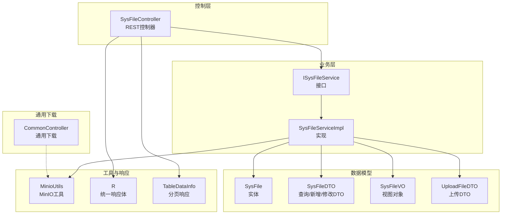
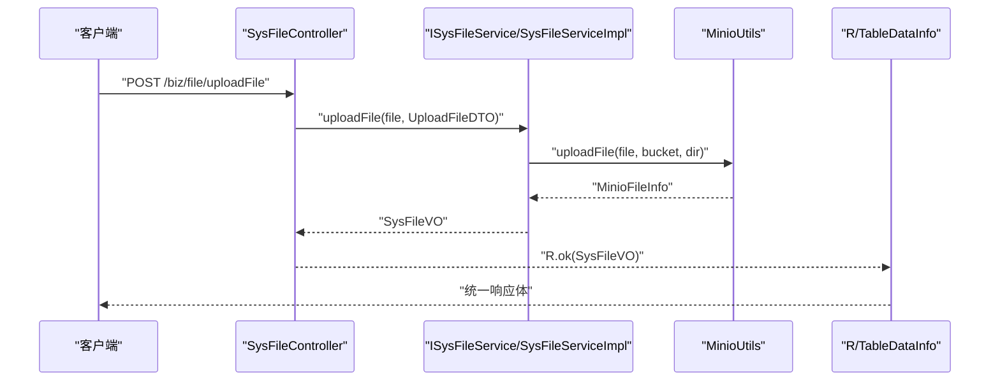
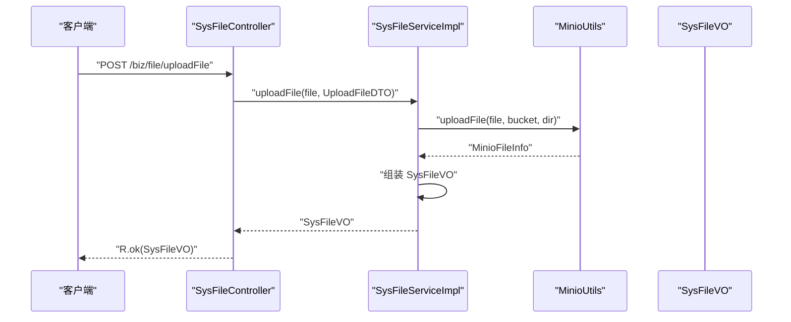
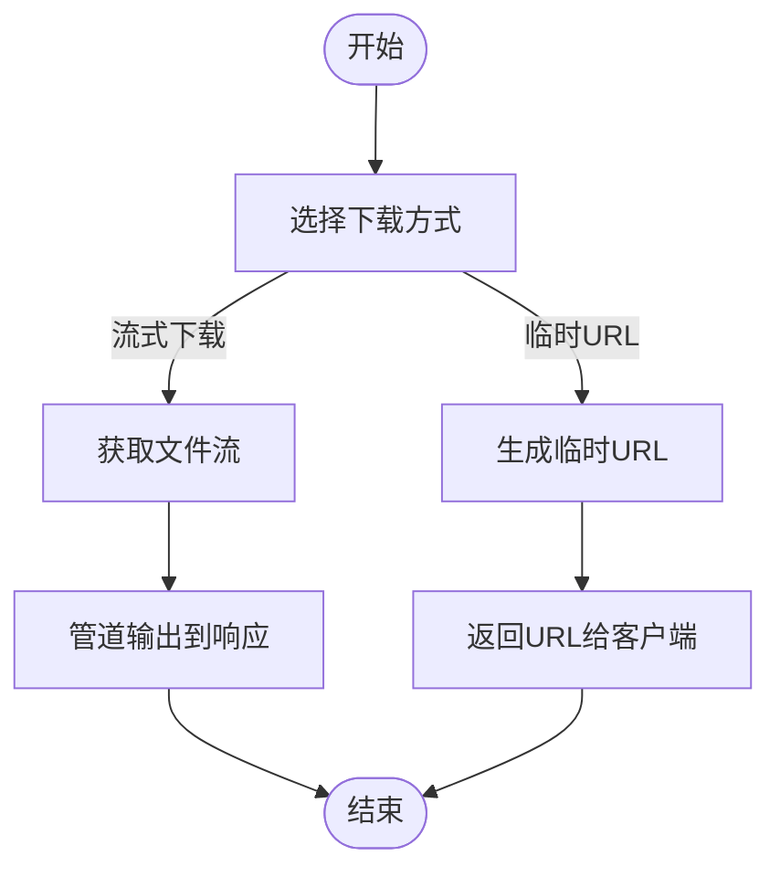
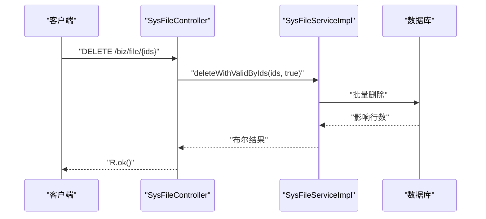
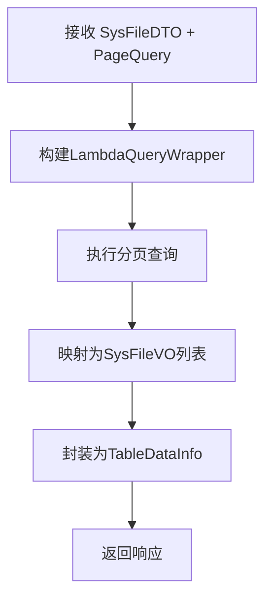
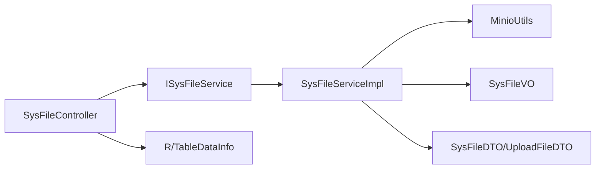

# 文件管理API

<cite>
**本文引用的文件**
- [SysFileController.java](file://blog-admin/src/main/java/blog/web/controller/common/SysFileController.java)
- [ISysFileService.java](file://blog-biz/src/main/java/blog/biz/service/ISysFileService.java)
- [SysFileServiceImpl.java](file://blog-biz/src/main/java/blog/biz/service/impl/SysFileServiceImpl.java)
- [SysFile.java](file://blog-biz/src/main/java/blog/biz/domain/SysFile.java)
- [SysFileDTO.java](file://blog-biz/src/main/java/blog/biz/domain/dto/SysFileDTO.java)
- [SysFileVO.java](file://blog-biz/src/main/java/blog/biz/domain/vo/SysFileVO.java)
- [UploadFileDTO.java](file://blog-biz/src/main/java/blog/biz/domain/dto/UploadFileDTO.java)
- [MinioUtils.java](file://blog-common/src/main/java/blog/common/utils/minio/MinioUtils.java)
- [R.java](file://blog-common/src/main/java/blog/common/base/resp/R.java)
- [TableDataInfo.java](file://blog-common/src/main/java/blog/common/base/resp/TableDataInfo.java)
- [CommonController.java](file://blog-admin/src/main/java/blog/web/controller/common/CommonController.java)
</cite>

## 目录
1. [简介](#简介)
2. [项目结构](#项目结构)
3. [核心组件](#核心组件)
4. [架构总览](#架构总览)
5. [详细组件分析](#详细组件分析)
6. [依赖分析](#依赖分析)
7. [性能考虑](#性能考虑)
8. [故障排查指南](#故障排查指南)
9. [结论](#结论)
10. [附录](#附录)

## 简介
本文件为“文件管理API”的详细技术文档，聚焦于 SysFileController 提供的RESTful接口，覆盖文件上传、下载、删除、列表查询等能力，并深入解析上传接口的多种场景设计（单文件上传、批量上传、断点续传扩展建议）。同时说明下载接口的多种方式（直接下载、临时URL获取、流式下载），以及删除与列表查询的API设计与实现要点。文档还提供完整的调用示例与错误处理说明，帮助开发者正确使用文件管理接口。

## 项目结构
围绕文件管理功能，系统采用典型的三层结构：
- 控制层：SysFileController 负责接收HTTP请求、参数校验、权限控制与响应封装。
- 业务层：ISysFileService 及其实现 SysFileServiceImpl 负责业务逻辑编排，包括调用 MinIO 工具完成文件上传、下载、删除、列表等操作。
- 数据模型：SysFile、SysFileDTO、SysFileVO、UploadFileDTO 定义了数据库实体、传输对象与视图对象。
- 基础响应：R 与 TableDataInfo 统一响应格式，便于前端统一处理。

图表来源
- [SysFileController.java:35-123](file://blog-admin/src/main/java/blog/web/controller/common/SysFileController.java#L35-L123)
- [ISysFileService.java:21-74](file://blog-biz/src/main/java/blog/biz/service/ISysFileService.java#L21-L74)
- [SysFileServiceImpl.java:38-168](file://blog-biz/src/main/java/blog/biz/service/impl/SysFileServiceImpl.java#L38-L168)
- [SysFile.java:20-94](file://blog-biz/src/main/java/blog/biz/domain/SysFile.java#L20-L94)
- [SysFileDTO.java:21-82](file://blog-biz/src/main/java/blog/biz/domain/dto/SysFileDTO.java#L21-L82)
- [SysFileVO.java:28-113](file://blog-biz/src/main/java/blog/biz/domain/vo/SysFileVO.java#L28-L113)
- [UploadFileDTO.java:15-35](file://blog-biz/src/main/java/blog/biz/domain/dto/UploadFileDTO.java#L15-L35)
- [MinioUtils.java:26-324](file://blog-common/src/main/java/blog/common/utils/minio/MinioUtils.java#L26-L324)
- [R.java:12-106](file://blog-common/src/main/java/blog/common/base/resp/R.java#L12-L106)
- [TableDataInfo.java:14-97](file://blog-common/src/main/java/blog/common/base/resp/TableDataInfo.java#L14-L97)
- [CommonController.java:30-141](file://blog-admin/src/main/java/blog/web/controller/common/CommonController.java#L30-L141)

章节来源
- [SysFileController.java:35-123](file://blog-admin/src/main/java/blog/web/controller/common/SysFileController.java#L35-L123)
- [ISysFileService.java:21-74](file://blog-biz/src/main/java/blog/biz/service/ISysFileService.java#L21-L74)
- [SysFileServiceImpl.java:38-168](file://blog-biz/src/main/java/blog/biz/service/impl/SysFileServiceImpl.java#L38-L168)
- [MinioUtils.java:26-324](file://blog-common/src/main/java/blog/common/utils/minio/MinioUtils.java#L26-L324)

## 核心组件
- SysFileController：提供文件管理的REST接口，包含列表查询、导出、详情、新增、修改、删除、单文件上传等。
- ISysFileService/SysFileServiceImpl：封装业务逻辑，负责调用 MinIO 工具完成文件上传、下载、删除、列表等操作，并将结果映射为 VO。
- MinioUtils：封装 MinIO 的上传、下载、删除、URL生成等操作，支持临时URL与永久URL。
- R/ TableDataInfo：统一响应体与分页响应，保证前后端交互一致性。
- SysFile/SysFileDTO/SysFileVO/UploadFileDTO：定义文件元数据、查询条件、返回视图与上传参数。

章节来源
- [SysFileController.java:35-123](file://blog-admin/src/main/java/blog/web/controller/common/SysFileController.java#L35-L123)
- [ISysFileService.java:21-74](file://blog-biz/src/main/java/blog/biz/service/ISysFileService.java#L21-L74)
- [SysFileServiceImpl.java:38-168](file://blog-biz/src/main/java/blog/biz/service/impl/SysFileServiceImpl.java#L38-L168)
- [MinioUtils.java:26-324](file://blog-common/src/main/java/blog/common/utils/minio/MinioUtils.java#L26-L324)
- [R.java:12-106](file://blog-common/src/main/java/blog/common/base/resp/R.java#L12-L106)
- [TableDataInfo.java:14-97](file://blog-common/src/main/java/blog/common/base/resp/TableDataInfo.java#L14-L97)

## 架构总览
文件管理API遵循“控制器-服务-工具-模型”的分层架构，请求从控制器进入，经由服务层编排，最终通过 MinIO 工具与对象存储交互，返回统一的响应体。

图表来源
- [SysFileController.java:111-121](file://blog-admin/src/main/java/blog/web/controller/common/SysFileController.java#L111-L121)
- [SysFileServiceImpl.java:151-167](file://blog-biz/src/main/java/blog/biz/service/impl/SysFileServiceImpl.java#L151-L167)
- [MinioUtils.java:85-111](file://blog-common/src/main/java/blog/common/utils/minio/MinioUtils.java#L85-L111)
- [R.java:31-73](file://blog-common/src/main/java/blog/common/base/resp/R.java#L31-L73)

## 详细组件分析

### 接口总览与权限
- 命名空间：/biz/file
- 权限注解：@PreAuthorize 使用表达式 @ss.hasPermi(...) 控制访问
- 日志注解：@Log 记录业务日志
- 防重复提交：@RepeatSubmit 防止重复提交

章节来源
- [SysFileController.java:38-123](file://blog-admin/src/main/java/blog/web/controller/common/SysFileController.java#L38-L123)

### 文件上传接口
- 接口定义
  - 方法：POST
  - 路径：/biz/file/uploadFile
  - 请求参数：
    - file：MultipartFile，必填
    - bizType：字符串，业务类型，必填
    - bizId：字符串，业务ID，必填
  - 响应：R<SysFileVO>
- 实现流程
  - 控制器接收参数并封装为 UploadFileDTO
  - 服务层调用 MinioUtils.uploadFile(file, bucket, dir)
  - MinioUtils 生成对象名并上传，返回 MinioFileInfo
  - 服务层将 MinioFileInfo 映射为 SysFileVO 返回
- 上传目录规则
  - UploadFileDTO.getDir() 返回目录路径 bizType/bizId
- 断点续传扩展建议
  - 当前实现为单文件直传；若需断点续传，可在服务层增加分片上传与合并策略，并引入上传会话管理与进度跟踪。

图表来源
- [SysFileController.java:111-121](file://blog-admin/src/main/java/blog/web/controller/common/SysFileController.java#L111-L121)
- [SysFileServiceImpl.java:151-167](file://blog-biz/src/main/java/blog/biz/service/impl/SysFileServiceImpl.java#L151-L167)
- [MinioUtils.java:85-111](file://blog-common/src/main/java/blog/common/utils/minio/MinioUtils.java#L85-L111)
- [UploadFileDTO.java:32-34](file://blog-biz/src/main/java/blog/biz/domain/dto/UploadFileDTO.java#L32-L34)

章节来源
- [SysFileController.java:111-121](file://blog-admin/src/main/java/blog/web/controller/common/SysFileController.java#L111-L121)
- [SysFileServiceImpl.java:151-167](file://blog-biz/src/main/java/blog/biz/service/impl/SysFileServiceImpl.java#L151-L167)
- [MinioUtils.java:85-111](file://blog-common/src/main/java/blog/common/utils/minio/MinioUtils.java#L85-L111)
- [UploadFileDTO.java:32-34](file://blog-biz/src/main/java/blog/biz/domain/dto/UploadFileDTO.java#L32-L34)

### 文件下载接口
- 直接下载（MinIO）
  - 通过 MinioUtils.getFileStream(bucket, objectName) 获取输入流，适合后端直传给客户端
- 临时URL获取
  - 通过 MinioUtils.getPresignedUrl(bucket, objectName, expireSeconds) 获取带过期时间的临时访问URL
  - 默认临时URL有效期在工具类中设置为24小时
- 流式下载
  - 服务层可直接返回 InputStream，由框架自动处理流式传输
- 通用下载（本地资源）
  - CommonController 提供本地资源下载接口，适用于非MinIO场景

图表来源
- [MinioUtils.java:221-223](file://blog-common/src/main/java/blog/common/utils/minio/MinioUtils.java#L221-L223)
- [MinioUtils.java:300-309](file://blog-common/src/main/java/blog/common/utils/minio/MinioUtils.java#L300-L309)
- [CommonController.java:121-140](file://blog-admin/src/main/java/blog/web/controller/common/CommonController.java#L121-L140)

章节来源
- [MinioUtils.java:159-182](file://blog-common/src/main/java/blog/common/utils/minio/MinioUtils.java#L159-L182)
- [MinioUtils.java:221-223](file://blog-common/src/main/java/blog/common/utils/minio/MinioUtils.java#L221-L223)
- [MinioUtils.java:300-309](file://blog-common/src/main/java/blog/common/utils/minio/MinioUtils.java#L300-L309)
- [CommonController.java:121-140](file://blog-admin/src/main/java/blog/web/controller/common/CommonController.java#L121-L140)

### 文件删除接口
- 接口定义
  - 方法：DELETE
  - 路径：/biz/file/{ids}
  - 路径参数：ids（Long数组），必填
  - 响应：R<Void>
- 实现要点
  - 控制器调用服务层 deleteWithValidByIds(ids, true)
  - 服务层基于主键集合执行删除，当前未做额外业务校验（预留扩展点）

图表来源
- [SysFileController.java:105-109](file://blog-admin/src/main/java/blog/web/controller/common/SysFileController.java#L105-L109)
- [SysFileServiceImpl.java:144-149](file://blog-biz/src/main/java/blog/biz/service/impl/SysFileServiceImpl.java#L144-L149)

章节来源
- [SysFileController.java:105-109](file://blog-admin/src/main/java/blog/web/controller/common/SysFileController.java#L105-L109)
- [SysFileServiceImpl.java:144-149](file://blog-biz/src/main/java/blog/biz/service/impl/SysFileServiceImpl.java#L144-L149)

### 文件列表查询接口
- 接口定义
  - 方法：GET
  - 路径：/biz/file/list
  - 查询参数：SysFileDTO（用于条件筛选）、PageQuery（分页）
  - 响应：TableDataInfo<SysFileVO>
- 查询条件
  - 支持按文件名、后缀、内容类型、大小、桶名、对象名、URL、业务类型、业务ID、公开状态、创建人、创建时间等字段进行过滤
  - 查询包装器按条件动态拼装
- 分页与排序
  - 基于 PageQuery 构建分页查询
  - 默认按主键升序排序

图表来源
- [SysFileController.java:47-50](file://blog-admin/src/main/java/blog/web/controller/common/SysFileController.java#L47-L50)
- [SysFileServiceImpl.java:62-78](file://blog-biz/src/main/java/blog/biz/service/impl/SysFileServiceImpl.java#L62-L78)
- [SysFileServiceImpl.java:80-97](file://blog-biz/src/main/java/blog/biz/service/impl/SysFileServiceImpl.java#L80-L97)
- [TableDataInfo.java:57-64](file://blog-common/src/main/java/blog/common/base/resp/TableDataInfo.java#L57-L64)

章节来源
- [SysFileController.java:47-50](file://blog-admin/src/main/java/blog/web/controller/common/SysFileController.java#L47-L50)
- [SysFileServiceImpl.java:62-78](file://blog-biz/src/main/java/blog/biz/service/impl/SysFileServiceImpl.java#L62-L78)
- [SysFileServiceImpl.java:80-97](file://blog-biz/src/main/java/blog/biz/service/impl/SysFileServiceImpl.java#L80-L97)
- [TableDataInfo.java:57-64](file://blog-common/src/main/java/blog/common/base/resp/TableDataInfo.java#L57-L64)

### 导出接口
- 接口定义
  - 方法：POST
  - 路径：/biz/file/export
  - 请求参数：SysFileDTO（条件）、HttpServletResponse（响应）
  - 响应：Excel文件（二进制流）
- 实现要点
  - 查询符合条件的 SysFileVO 列表
  - 使用 ExcelUtil 导出并写入响应

章节来源
- [SysFileController.java:55-62](file://blog-admin/src/main/java/blog/web/controller/common/SysFileController.java#L55-L62)

### 其他基础接口
- 获取详情：GET /biz/file/{id}
- 新增：POST /biz/file
- 修改：PUT /biz/file
- 上述接口均受权限控制与日志记录

章节来源
- [SysFileController.java:69-96](file://blog-admin/src/main/java/blog/web/controller/common/SysFileController.java#L69-L96)

## 依赖分析
- 控制器依赖服务接口与统一响应体
- 服务实现依赖 Mapper、MinIO 工具与 VO/DTO
- MinIO 工具依赖 MinIO 客户端与配置
- 响应体统一由 R 与 TableDataInfo 提供

图表来源
- [SysFileController.java:39-123](file://blog-admin/src/main/java/blog/web/controller/common/SysFileController.java#L39-L123)
- [ISysFileService.java:21-74](file://blog-biz/src/main/java/blog/biz/service/ISysFileService.java#L21-L74)
- [SysFileServiceImpl.java:38-168](file://blog-biz/src/main/java/blog/biz/service/impl/SysFileServiceImpl.java#L38-L168)
- [MinioUtils.java:26-324](file://blog-common/src/main/java/blog/common/utils/minio/MinioUtils.java#L26-L324)
- [R.java:12-106](file://blog-common/src/main/java/blog/common/base/resp/R.java#L12-L106)
- [TableDataInfo.java:14-97](file://blog-common/src/main/java/blog/common/base/resp/TableDataInfo.java#L14-L97)

章节来源
- [SysFileController.java:39-123](file://blog-admin/src/main/java/blog/web/controller/common/SysFileController.java#L39-L123)
- [ISysFileService.java:21-74](file://blog-biz/src/main/java/blog/biz/service/ISysFileService.java#L21-L74)
- [SysFileServiceImpl.java:38-168](file://blog-biz/src/main/java/blog/biz/service/impl/SysFileServiceImpl.java#L38-L168)
- [MinioUtils.java:26-324](file://blog-common/src/main/java/blog/common/utils/minio/MinioUtils.java#L26-L324)
- [R.java:12-106](file://blog-common/src/main/java/blog/common/base/resp/R.java#L12-L106)
- [TableDataInfo.java:14-97](file://blog-common/src/main/java/blog/common/base/resp/TableDataInfo.java#L14-L97)

## 性能考虑
- 上传性能
  - 单文件直传已通过 MinIO 流式写入，避免大文件内存占用
  - 若需批量上传，建议在客户端分批并发，服务端按批次处理，避免一次性堆积
- 下载性能
  - 临时URL适合前端直连MinIO，降低服务端带宽压力
  - 流式下载适合高并发场景，但需注意连接超时与客户端缓冲
- 查询性能
  - 建议对高频查询字段建立索引（如业务类型、业务ID、创建时间）
  - 合理使用分页，避免一次性返回大量数据
- 错误与重试
  - MinIO 操作失败时，建议在服务层捕获异常并返回统一错误码
  - 对外暴露的临时URL需控制有效期，防止泄露

## 故障排查指南
- 上传失败
  - 检查 MinIO 配置与桶是否存在
  - 确认文件大小与类型限制
  - 查看服务端异常栈与日志
- 下载失败
  - 临时URL是否过期
  - 对象路径是否正确
  - MinIO 域名与桶权限配置
- 删除失败
  - 对象是否存在
  - 桶权限与对象权限
- 列表查询无结果
  - 确认查询条件是否匹配
  - 检查分页参数与排序字段

章节来源
- [MinioUtils.java:60-73](file://blog-common/src/main/java/blog/common/utils/minio/MinioUtils.java#L60-L73)
- [MinioUtils.java:190-199](file://blog-common/src/main/java/blog/common/utils/minio/MinioUtils.java#L190-L199)
- [SysFileServiceImpl.java:164-166](file://blog-biz/src/main/java/blog/biz/service/impl/SysFileServiceImpl.java#L164-L166)

## 结论
本文件管理API以清晰的分层架构与统一响应体为基础，提供了稳定可靠的文件上传、下载、删除与查询能力。当前实现聚焦于单文件直传与基础查询，断点续传与批量上传可通过扩展服务层与引入会话机制实现。建议在生产环境中结合权限控制、日志审计与监控告警，确保系统的安全与稳定。

## 附录

### API清单与调用示例（路径+方法+参数+响应）
- 列表查询
  - 方法：GET
  - 路径：/biz/file/list
  - 参数：SysFileDTO（条件）、PageQuery（分页）
  - 响应：TableDataInfo<SysFileVO>
- 导出
  - 方法：POST
  - 路径：/biz/file/export
  - 参数：SysFileDTO（条件）、HttpServletResponse
  - 响应：Excel文件流
- 获取详情
  - 方法：GET
  - 路径：/biz/file/{id}
  - 参数：id（Long）
  - 响应：R<SysFileVO>
- 新增
  - 方法：POST
  - 路径：/biz/file
  - 参数：SysFileDTO（Body）
  - 响应：R<Void>
- 修改
  - 方法：PUT
  - 路径：/biz/file
  - 参数：SysFileDTO（Body）
  - 响应：R<Void>
- 删除
  - 方法：DELETE
  - 路径：/biz/file/{ids}
  - 参数：ids（Long[]）
  - 响应：R<Void>
- 单文件上传
  - 方法：POST
  - 路径：/biz/file/uploadFile
  - 参数：file（MultipartFile）、bizType（字符串）、bizId（字符串）
  - 响应：R<SysFileVO>

章节来源
- [SysFileController.java:47-121](file://blog-admin/src/main/java/blog/web/controller/common/SysFileController.java#L47-L121)