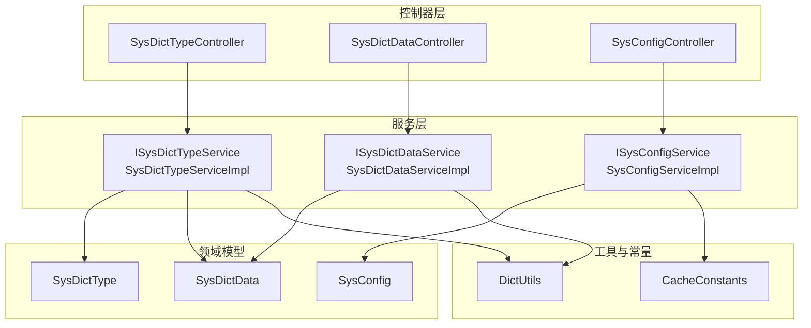
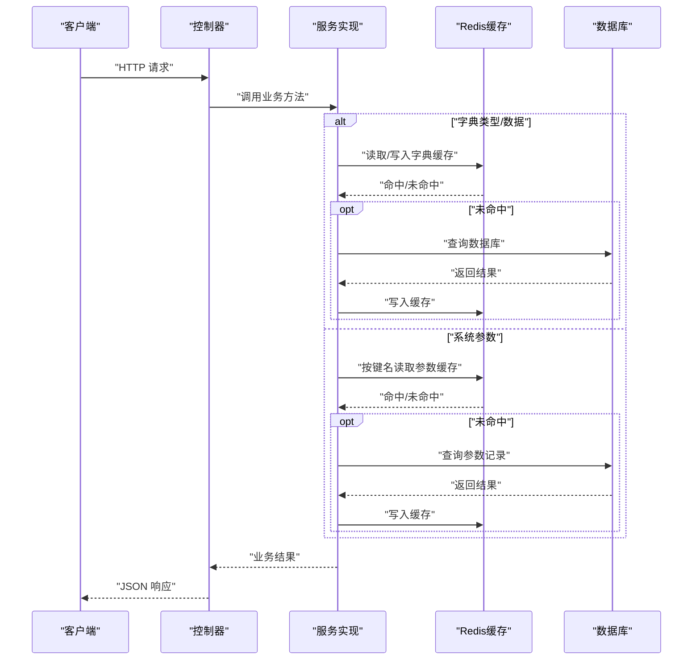
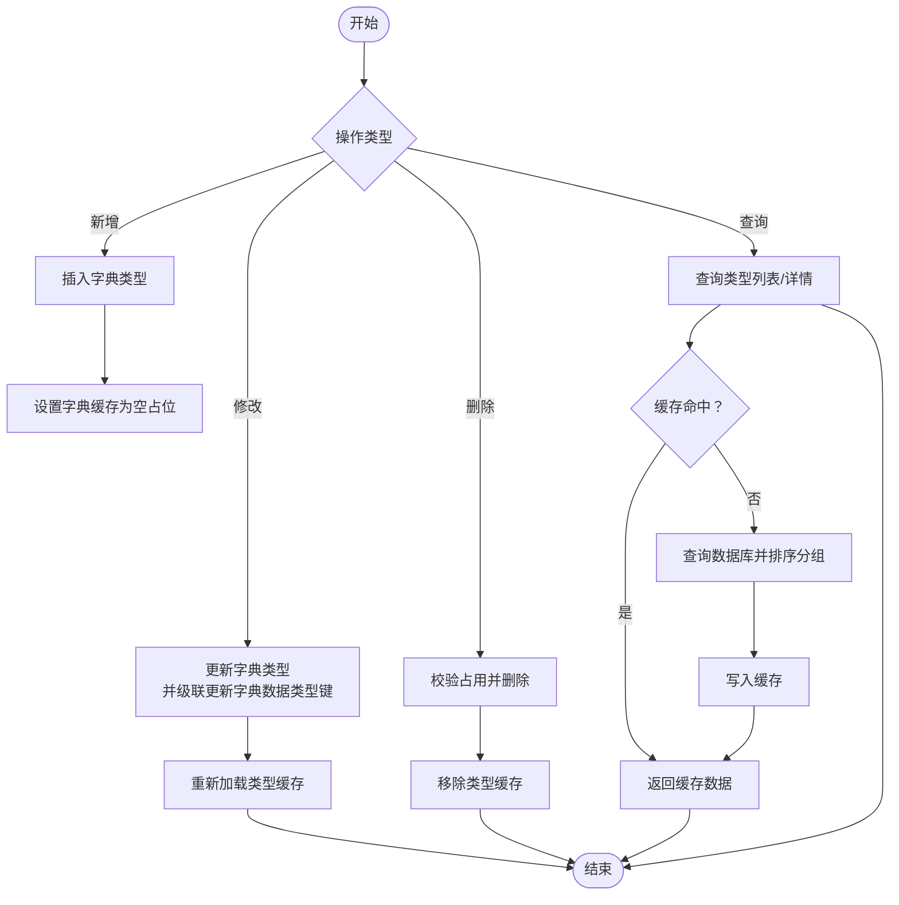
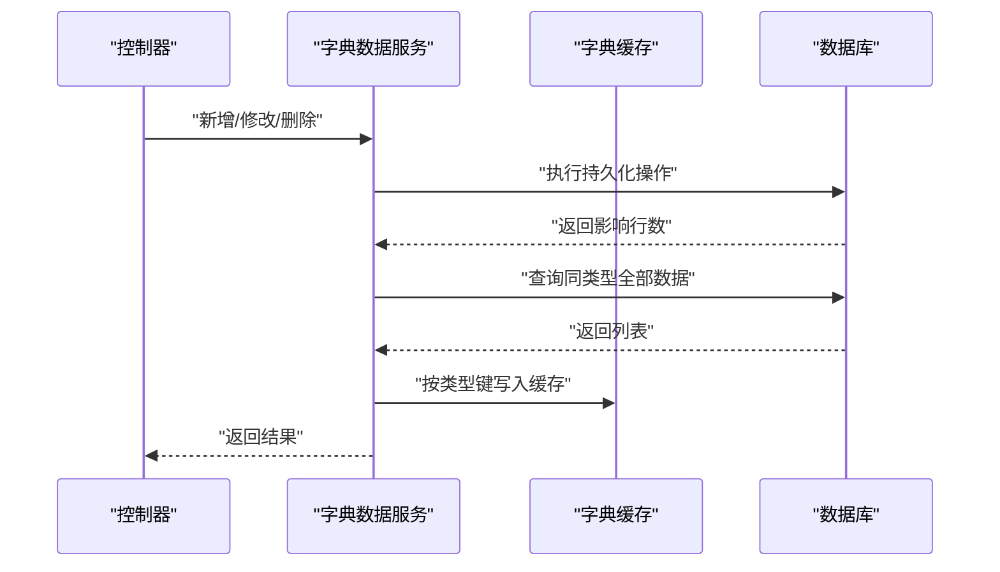
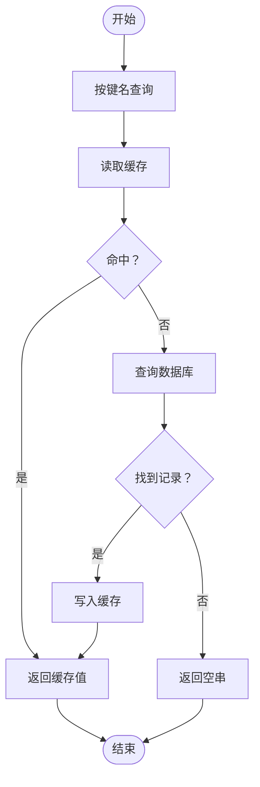
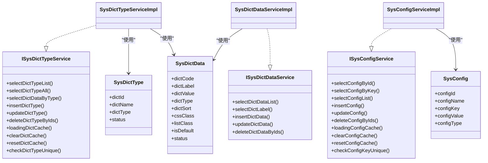

# 字典参数管理

<cite>
**本文引用的文件**
- [SysDictType.java](file://blog-common/src/main/java/blog/common/core/domain/entity/SysDictType.java)
- [SysDictData.java](file://blog-common/src/main/java/blog/common/core/domain/entity/SysDictData.java)
- [SysConfig.java](file://blog-system/src/main/java/blog/system/domain/SysConfig.java)
- [ISysDictTypeService.java](file://blog-system/src/main/java/blog/system/service/ISysDictTypeService.java)
- [ISysDictDataService.java](file://blog-system/src/main/java/blog/system/service/ISysDictDataService.java)
- [ISysConfigService.java](file://blog-system/src/main/java/blog/system/service/ISysConfigService.java)
- [SysDictTypeServiceImpl.java](file://blog-system/src/main/java/blog/system/service/impl/SysDictTypeServiceImpl.java)
- [SysDictDataServiceImpl.java](file://blog-system/src/main/java/blog/system/service/impl/SysDictDataServiceImpl.java)
- [SysConfigServiceImpl.java](file://blog-system/src/main/java/blog/system/service/impl/SysConfigServiceImpl.java)
- [SysDictTypeController.java](file://blog-admin/src/main/java/blog/web/controller/system/SysDictTypeController.java)
- [SysDictDataController.java](file://blog-admin/src/main/java/blog/web/controller/system/SysDictDataController.java)
- [SysConfigController.java](file://blog-admin/src/main/java/blog/web/controller/system/SysConfigController.java)
- [DictUtils.java](file://blog-common/src/main/java/blog/common/utils/DictUtils.java)
- [CacheConstants.java](file://blog-common/src/main/java/blog/common/constant/CacheConstants.java)
</cite>

## 目录
1. [简介](#简介)
2. [项目结构](#项目结构)
3. [核心组件](#核心组件)
4. [架构总览](#架构总览)
5. [详细组件分析](#详细组件分析)
6. [依赖分析](#依赖分析)
7. [性能考虑](#性能考虑)
8. [故障排查指南](#故障排查指南)
9. [结论](#结论)
10. [附录：配置与使用示例](#附录配置与使用示例)

## 简介
本文件系统性梳理“字典参数管理”模块的设计与实现，覆盖以下主题：
- 字典类型与字典数据的实体设计与字段语义
- 系统参数配置实体设计与字段语义
- 服务层业务逻辑：字典类型/字典数据/系统参数的查询、管理与缓存策略
- 控制器接口设计：RESTful API 能力与权限控制
- 缓存机制：动态加载、缓存更新与失效策略
- 实战示例与最佳实践：如何在项目中正确配置与使用

## 项目结构
该模块采用典型的分层架构：
- 控制器层：对外暴露 RESTful 接口，负责鉴权、参数校验与响应封装
- 服务层：定义领域业务契约与实现，包含缓存加载、更新与清理
- 领域模型：字典类型、字典数据、系统参数三类实体
- 工具与常量：字典工具类与缓存键常量

图表来源
- [SysDictTypeController.java:31-122](file://blog-admin/src/main/java/blog/web/controller/system/SysDictTypeController.java#L31-L122)
- [SysDictDataController.java:34-114](file://blog-admin/src/main/java/blog/web/controller/system/SysDictDataController.java#L34-L114)
- [SysConfigController.java:31-124](file://blog-admin/src/main/java/blog/web/controller/system/SysConfigController.java#L31-L124)
- [SysDictTypeServiceImpl.java:28-204](file://blog-system/src/main/java/blog/system/service/impl/SysDictTypeServiceImpl.java#L28-L204)
- [SysDictDataServiceImpl.java:18-104](file://blog-system/src/main/java/blog/system/service/impl/SysDictDataServiceImpl.java#L18-L104)
- [SysConfigServiceImpl.java:27-211](file://blog-system/src/main/java/blog/system/service/impl/SysConfigServiceImpl.java#L27-L211)
- [SysDictType.java:19-99](file://blog-common/src/main/java/blog/common/core/domain/entity/SysDictType.java#L19-L99)
- [SysDictData.java:19-92](file://blog-common/src/main/java/blog/common/core/domain/entity/SysDictData.java#L19-L92)
- [SysConfig.java:17-112](file://blog-system/src/main/java/blog/system/domain/SysConfig.java#L17-L112)
- [DictUtils.java:17-203](file://blog-common/src/main/java/blog/common/utils/DictUtils.java#L17-L203)
- [CacheConstants.java:8-43](file://blog-common/src/main/java/blog/common/constant/CacheConstants.java#L8-L43)

章节来源
- [SysDictTypeController.java:31-122](file://blog-admin/src/main/java/blog/web/controller/system/SysDictTypeController.java#L31-L122)
- [SysDictDataController.java:34-114](file://blog-admin/src/main/java/blog/web/controller/system/SysDictDataController.java#L34-L114)
- [SysConfigController.java:31-124](file://blog-admin/src/main/java/blog/web/controller/system/SysConfigController.java#L31-L124)

## 核心组件
本节从实体设计、服务契约与实现、控制器接口三个维度，系统说明字典参数管理的核心能力。

- 实体设计要点
  - SysDictType：字典类型标识、名称、类型键、状态等
  - SysDictData：字典项标签、键值、类型、排序、样式、默认标记、状态等
  - SysConfig：参数主键、名称、键名、键值、内置标记、备注等
- 服务层职责
  - 字典类型：分页查询、全量查询、按类型查询字典数据、新增/修改/删除、缓存加载/清空/重置、键唯一性校验
  - 字典数据：分页查询、按类型+键值查标签、新增/修改/删除、缓存同步
  - 系统参数：按ID/键名查询、列表查询、新增/修改/删除、缓存加载/清空/重置、键唯一性校验
- 控制器接口
  - 字典类型：列表、导出、详情、新增、修改、删除、刷新缓存、获取可选类型
  - 字典数据：列表、导出、详情、按类型查询、新增、修改、删除
  - 系统参数：列表、导出、详情、按键名查询、新增、修改、删除、刷新缓存

章节来源
- [SysDictType.java:19-99](file://blog-common/src/main/java/blog/common/core/domain/entity/SysDictType.java#L19-L99)
- [SysDictData.java:19-92](file://blog-common/src/main/java/blog/common/core/domain/entity/SysDictData.java#L19-L92)
- [SysConfig.java:17-112](file://blog-system/src/main/java/blog/system/domain/SysConfig.java#L17-L112)
- [ISysDictTypeService.java:14-99](file://blog-system/src/main/java/blog/system/service/ISysDictTypeService.java#L14-L99)
- [ISysDictDataService.java:13-61](file://blog-system/src/main/java/blog/system/service/ISysDictDataService.java#L13-L61)
- [ISysConfigService.java:13-90](file://blog-system/src/main/java/blog/system/service/ISysConfigService.java#L13-L90)
- [SysDictTypeController.java:31-122](file://blog-admin/src/main/java/blog/web/controller/system/SysDictTypeController.java#L31-L122)
- [SysDictDataController.java:34-114](file://blog-admin/src/main/java/blog/web/controller/system/SysDictDataController.java#L34-L114)
- [SysConfigController.java:31-124](file://blog-admin/src/main/java/blog/web/controller/system/SysConfigController.java#L31-L124)

## 架构总览
下图展示从控制器到服务、再到缓存与数据库的整体调用链路与关键决策点。

图表来源
- [SysDictTypeServiceImpl.java:71-83](file://blog-system/src/main/java/blog/system/service/impl/SysDictTypeServiceImpl.java#L71-L83)
- [SysDictDataServiceImpl.java:41-44](file://blog-system/src/main/java/blog/system/service/impl/SysDictDataServiceImpl.java#L41-L44)
- [SysConfigServiceImpl.java:63-77](file://blog-system/src/main/java/blog/system/service/impl/SysConfigServiceImpl.java#L63-L77)
- [DictUtils.java:39-45](file://blog-common/src/main/java/blog/common/utils/DictUtils.java#L39-L45)
- [CacheConstants.java:20-27](file://blog-common/src/main/java/blog/common/constant/CacheConstants.java#L20-L27)

## 详细组件分析

### 实体设计与字段语义

- SysDictType（字典类型）
  - 字段要点：主键、名称、类型键、状态；类型键具备格式约束；支持导入导出标注
  - 关键约束：名称与类型键长度限制；类型键正则约束；状态枚举化（正常/停用）
  - 典型用途：作为一组字典项的分类标识

- SysDictData（字典数据）
  - 字段要点：编码、排序、标签、键值、类型、样式类、表格样式、默认标记、状态
  - 关键约束：标签与键值非空且长度限制；类型键关联字典类型；默认标记为Y/N
  - 典型用途：承载具体可选项，支持前端渲染与业务转换

- SysConfig（系统参数）
  - 字段要点：主键、名称、键名、键值、内置标记、备注
  - 关键约束：名称、键名、键值长度限制；内置标记为Y/N
  - 典型用途：运行期配置项，如开关、阈值、第三方接入参数等

章节来源
- [SysDictType.java:23-98](file://blog-common/src/main/java/blog/common/core/domain/entity/SysDictType.java#L23-L98)
- [SysDictData.java:25-89](file://blog-common/src/main/java/blog/common/core/domain/entity/SysDictData.java#L25-L89)
- [SysConfig.java:20-95](file://blog-system/src/main/java/blog/system/domain/SysConfig.java#L20-L95)

### 字典类型服务层（ISysDictTypeService 与实现）

- 主要能力
  - 查询：分页列表、全量类型、按ID/类型键查询
  - 管理：新增、修改、批量删除
  - 缓存：加载、清空、重置
  - 校验：类型键唯一性
  - 关联：根据类型键查询对应字典数据（带缓存）

- 关键流程
  - 新增/修改后：更新对应类型的字典缓存
  - 删除前：检查是否存在字典数据占用，避免破坏引用完整性
  - 启动时：自动加载全部字典数据至缓存，按类型键分组并排序

图表来源
- [SysDictTypeServiceImpl.java:160-186](file://blog-system/src/main/java/blog/system/service/impl/SysDictTypeServiceImpl.java#L160-L186)
- [SysDictTypeServiceImpl.java:112-122](file://blog-system/src/main/java/blog/system/service/impl/SysDictTypeServiceImpl.java#L112-L122)
- [SysDictTypeServiceImpl.java:127-152](file://blog-system/src/main/java/blog/system/service/impl/SysDictTypeServiceImpl.java#L127-L152)
- [SysDictTypeServiceImpl.java:71-83](file://blog-system/src/main/java/blog/system/service/impl/SysDictTypeServiceImpl.java#L71-L83)

章节来源
- [ISysDictTypeService.java:14-99](file://blog-system/src/main/java/blog/system/service/ISysDictTypeService.java#L14-L99)
- [SysDictTypeServiceImpl.java:28-204](file://blog-system/src/main/java/blog/system/service/impl/SysDictTypeServiceImpl.java#L28-L204)

### 字典数据服务层（ISysDictDataService 与实现）

- 主要能力
  - 查询：分页列表、按ID查询、按类型+键值查询标签
  - 管理：新增、修改、批量删除
  - 缓存：按类型键刷新缓存

- 关键流程
  - 新增/修改：查询同类型全部数据并回写缓存，保证前端一致性
  - 删除：逐条删除后刷新该类型的缓存

图表来源
- [SysDictDataServiceImpl.java:77-102](file://blog-system/src/main/java/blog/system/service/impl/SysDictDataServiceImpl.java#L77-L102)
- [SysDictDataServiceImpl.java:62-70](file://blog-system/src/main/java/blog/system/service/impl/SysDictDataServiceImpl.java#L62-L70)

章节来源
- [ISysDictDataService.java:13-61](file://blog-system/src/main/java/blog/system/service/ISysDictDataService.java#L13-L61)
- [SysDictDataServiceImpl.java:18-104](file://blog-system/src/main/java/blog/system/service/impl/SysDictDataServiceImpl.java#L18-L104)

### 系统参数服务层（ISysConfigService 与实现）

- 主要能力
  - 查询：按ID、按键名、列表查询
  - 管理：新增、修改、批量删除
  - 缓存：加载、清空、重置
  - 校验：键名唯一性
  - 特殊：验证码开关读取（基于键名约定）

- 关键流程
  - 启动时：加载全部参数到缓存
  - 按键名查询：优先读缓存，未命中再查库并回填缓存
  - 修改键名：删除旧键缓存，写入新键缓存
  - 内置参数不可删除

图表来源
- [SysConfigServiceImpl.java:63-77](file://blog-system/src/main/java/blog/system/service/impl/SysConfigServiceImpl.java#L63-L77)
- [SysConfigServiceImpl.java:125-137](file://blog-system/src/main/java/blog/system/service/impl/SysConfigServiceImpl.java#L125-L137)
- [SysConfigServiceImpl.java:144-154](file://blog-system/src/main/java/blog/system/service/impl/SysConfigServiceImpl.java#L144-L154)

章节来源
- [ISysConfigService.java:13-90](file://blog-system/src/main/java/blog/system/service/ISysConfigService.java#L13-L90)
- [SysConfigServiceImpl.java:27-211](file://blog-system/src/main/java/blog/system/service/impl/SysConfigServiceImpl.java#L27-L211)

### 控制器接口设计

- 字典类型控制器
  - GET /system/dict/type/list：分页列表
  - POST /system/dict/type/export：导出
  - GET /system/dict/type/{dictId}：详情
  - POST /system/dict/type：新增（含唯一性校验）
  - PUT /system/dict/type：修改（含唯一性校验）
  - DELETE /system/dict/type/{dictIds}：删除
  - DELETE /system/dict/type/refreshCache：刷新字典缓存
  - GET /system/dict/type/optionselect：获取可选类型

- 字典数据控制器
  - GET /system/dict/data/list：分页列表
  - POST /system/dict/data/export：导出
  - GET /system/dict/data/{dictCode}：详情
  - GET /system/dict/data/type/{dictType}：按类型查询
  - POST /system/dict/data：新增
  - PUT /system/dict/data：修改
  - DELETE /system/dict/data/{dictCodes}：删除

- 系统参数控制器
  - GET /system/config/list：分页列表
  - POST /system/config/export：导出
  - GET /system/config/{configId}：详情
  - GET /system/config/configKey/{configKey}：按键名查询
  - POST /system/config：新增（含唯一性校验）
  - PUT /system/config：修改（含唯一性校验）
  - DELETE /system/config/{configIds}：删除
  - DELETE /system/config/refreshCache：刷新参数缓存

章节来源
- [SysDictTypeController.java:31-122](file://blog-admin/src/main/java/blog/web/controller/system/SysDictTypeController.java#L31-L122)
- [SysDictDataController.java:34-114](file://blog-admin/src/main/java/blog/web/controller/system/SysDictDataController.java#L34-L114)
- [SysConfigController.java:31-124](file://blog-admin/src/main/java/blog/web/controller/system/SysConfigController.java#L31-L124)

### 缓存机制与策略

- 缓存键规范
  - 字典缓存键前缀：sys_dict:
  - 参数缓存键前缀：sys_config:

- 动态加载
  - 服务实现类在启动时加载全部字典或参数到缓存，避免首次请求抖动

- 缓存更新
  - 字典：新增/修改/删除后，按类型键刷新缓存
  - 参数：新增/修改后，按键名写入缓存；修改键名时先删旧键再写新键

- 失效处理
  - 刷新缓存接口：清空并重新加载
  - 删除字典类型：移除对应类型缓存
  - 内置参数：禁止删除，防止误删系统关键配置

- 工具类支撑
  - DictUtils 提供字典缓存的读写、按类型获取标签/值、批量清理等能力

章节来源
- [CacheConstants.java:20-27](file://blog-common/src/main/java/blog/common/constant/CacheConstants.java#L20-L27)
- [SysDictTypeServiceImpl.java:127-152](file://blog-system/src/main/java/blog/system/service/impl/SysDictTypeServiceImpl.java#L127-L152)
- [SysDictDataServiceImpl.java:77-102](file://blog-system/src/main/java/blog/system/service/impl/SysDictDataServiceImpl.java#L77-L102)
- [SysConfigServiceImpl.java:159-183](file://blog-system/src/main/java/blog/system/service/impl/SysConfigServiceImpl.java#L159-L183)
- [DictUtils.java:29-45](file://blog-common/src/main/java/blog/common/utils/DictUtils.java#L29-L45)

## 依赖分析

图表来源
- [SysDictType.java:19-99](file://blog-common/src/main/java/blog/common/core/domain/entity/SysDictType.java#L19-L99)
- [SysDictData.java:19-92](file://blog-common/src/main/java/blog/common/core/domain/entity/SysDictData.java#L19-L92)
- [SysConfig.java:17-112](file://blog-system/src/main/java/blog/system/domain/SysConfig.java#L17-L112)
- [ISysDictTypeService.java:14-99](file://blog-system/src/main/java/blog/system/service/ISysDictTypeService.java#L14-L99)
- [ISysDictDataService.java:13-61](file://blog-system/src/main/java/blog/system/service/ISysDictDataService.java#L13-L61)
- [ISysConfigService.java:13-90](file://blog-system/src/main/java/blog/system/service/ISysConfigService.java#L13-L90)
- [SysDictTypeServiceImpl.java:28-204](file://blog-system/src/main/java/blog/system/service/impl/SysDictTypeServiceImpl.java#L28-L204)
- [SysDictDataServiceImpl.java:18-104](file://blog-system/src/main/java/blog/system/service/impl/SysDictDataServiceImpl.java#L18-L104)
- [SysConfigServiceImpl.java:27-211](file://blog-system/src/main/java/blog/system/service/impl/SysConfigServiceImpl.java#L27-L211)

## 性能考虑
- 缓存优先：字典与参数均采用Redis缓存，减少数据库压力
- 启动预热：服务启动时加载全量数据，降低首次访问延迟
- 批量写入：按类型键聚合更新，避免多次往返
- 精准查询：按需分页与条件过滤，避免全表扫描
- 键名规范：统一缓存键前缀，便于批量清理与运维

## 故障排查指南
- 字典类型删除失败
  - 可能原因：该类型已被字典数据引用
  - 处理建议：先删除或迁移相关字典数据，再删除类型
  - 参考实现位置：[SysDictTypeServiceImpl.java:112-122](file://blog-system/src/main/java/blog/system/service/impl/SysDictTypeServiceImpl.java#L112-L122)

- 字典标签/键值转换异常
  - 可能原因：缓存未及时更新或类型键不匹配
  - 处理建议：刷新字典缓存；确认类型键一致
  - 参考实现位置：[SysDictDataServiceImpl.java:77-102](file://blog-system/src/main/java/blog/system/service/impl/SysDictDataServiceImpl.java#L77-L102)、[SysDictTypeServiceImpl.java:127-152](file://blog-system/src/main/java/blog/system/service/impl/SysDictTypeServiceImpl.java#L127-L152)

- 系统参数读取为空
  - 可能原因：缓存未命中且数据库无记录
  - 处理建议：确认键名正确；必要时手动写入缓存或数据库
  - 参考实现位置：[SysConfigServiceImpl.java:63-77](file://blog-system/src/main/java/blog/system/service/impl/SysConfigServiceImpl.java#L63-L77)

- 内置参数被尝试删除
  - 可能原因：业务逻辑校验触发
  - 处理建议：尊重内置参数保护策略，通过修改而非删除方式调整
  - 参考实现位置：[SysConfigServiceImpl.java:144-154](file://blog-system/src/main/java/blog/system/service/impl/SysConfigServiceImpl.java#L144-L154)

章节来源
- [SysDictTypeServiceImpl.java:112-122](file://blog-system/src/main/java/blog/system/service/impl/SysDictTypeServiceImpl.java#L112-L122)
- [SysDictDataServiceImpl.java:77-102](file://blog-system/src/main/java/blog/system/service/impl/SysDictDataServiceImpl.java#L77-L102)
- [SysConfigServiceImpl.java:63-77](file://blog-system/src/main/java/blog/system/service/impl/SysConfigServiceImpl.java#L63-L77)
- [SysConfigServiceImpl.java:144-154](file://blog-system/src/main/java/blog/system/service/impl/SysConfigServiceImpl.java#L144-L154)

## 结论
本模块通过清晰的实体设计、完善的缓存策略与严格的权限控制，提供了稳定高效的字典参数管理能力。服务层围绕“缓存优先、按需更新”的原则组织，控制器层提供完备的RESTful接口，配合工具类与常量，形成可维护、可扩展的参数管理体系。

## 附录：配置与使用示例

- 新增字典类型
  - 步骤：通过控制器新增类型，服务层会写入类型键对应的空缓存占位，待后续字典数据写入后再填充
  - 参考位置：[SysDictTypeController.java:66-75](file://blog-admin/src/main/java/blog/web/controller/system/SysDictTypeController.java#L66-L75)、[SysDictTypeServiceImpl.java:160-167](file://blog-system/src/main/java/blog/system/service/impl/SysDictTypeServiceImpl.java#L160-L167)

- 新增字典数据
  - 步骤：新增后按类型键刷新缓存，前端可直接使用类型键查询
  - 参考位置：[SysDictDataController.java:82-90](file://blog-admin/src/main/java/blog/web/controller/system/SysDictDataController.java#L82-L90)、[SysDictDataServiceImpl.java:77-86](file://blog-system/src/main/java/blog/system/service/impl/SysDictDataServiceImpl.java#L77-L86)

- 读取系统参数
  - 步骤：通过键名查询，若缓存未命中则回源数据库并回填缓存
  - 参考位置：[SysConfigController.java:66-72](file://blog-admin/src/main/java/blog/web/controller/system/SysConfigController.java#L66-L72)、[SysConfigServiceImpl.java:63-77](file://blog-system/src/main/java/blog/system/service/impl/SysConfigServiceImpl.java#L63-L77)

- 刷新缓存
  - 步骤：调用刷新接口，清空并重新加载缓存
  - 参考位置：[SysDictTypeController.java:103-111](file://blog-admin/src/main/java/blog/web/controller/system/SysDictTypeController.java#L103-L111)、[SysConfigController.java:113-122](file://blog-admin/src/main/java/blog/web/controller/system/SysConfigController.java#L113-L122)

- 内置参数保护
  - 步骤：删除时若标记为内置则抛出异常，防止误删
  - 参考位置：[SysConfigServiceImpl.java:144-154](file://blog-system/src/main/java/blog/system/service/impl/SysConfigServiceImpl.java#L144-L154)