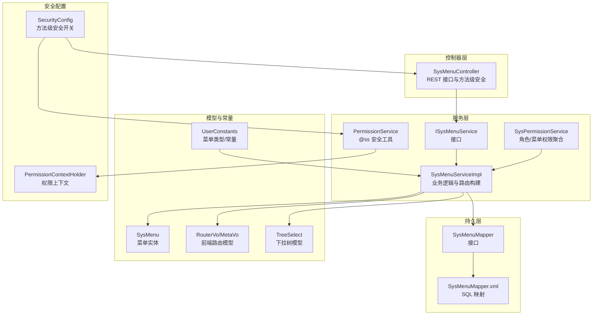
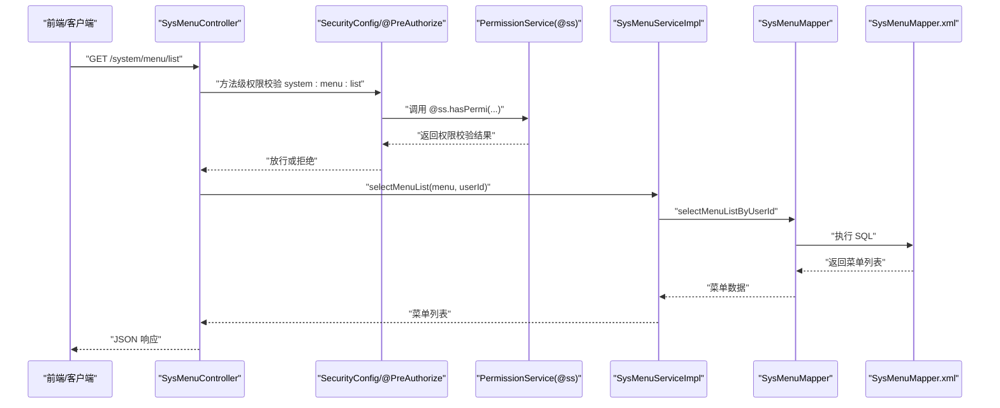
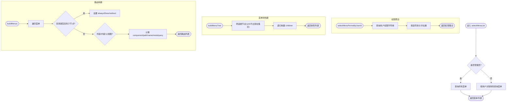
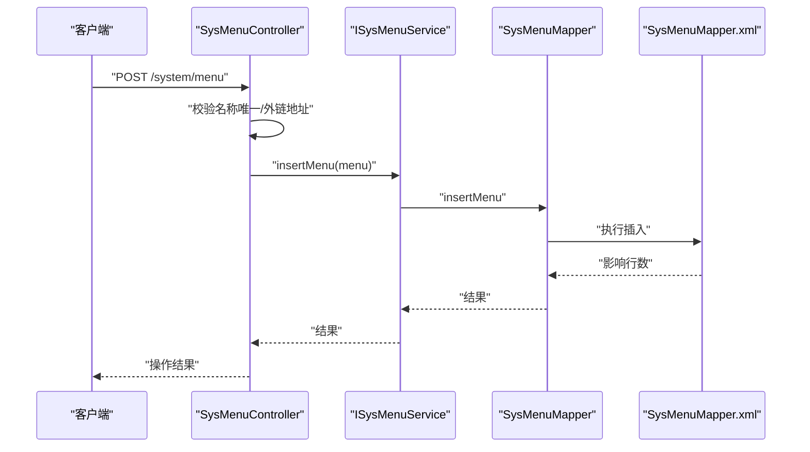
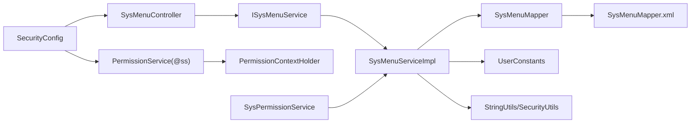

# 权限管理

<cite>
**本文引用的文件**
- [SysMenu.java](file://blog-common/src/main/java/blog/common/core/domain/entity/SysMenu.java)
- [ISysMenuService.java](file://blog-system/src/main/java/blog/system/service/ISysMenuService.java)
- [SysMenuServiceImpl.java](file://blog-system/src/main/java/blog/system/service/impl/SysMenuServiceImpl.java)
- [SysMenuMapper.java](file://blog-system/src/main/java/blog/system/mapper/SysMenuMapper.java)
- [SysMenuMapper.xml](file://blog-system/src/main/resources/mapper/system/SysMenuMapper.xml)
- [SysMenuController.java](file://blog-admin/src/main/java/blog/web/controller/system/SysMenuController.java)
- [RouterVo.java](file://blog-system/src/main/java/blog/system/domain/vo/RouterVo.java)
- [MetaVo.java](file://blog-system/src/main/java/blog/system/domain/vo/MetaVo.java)
- [TreeSelect.java](file://blog-common/src/main/java/blog/common/core/domain/TreeSelect.java)
- [UserConstants.java](file://blog-common/src/main/java/blog/common/constant/UserConstants.java)
- [SecurityConfig.java](file://blog-framework/src/main/java/blog/framework/config/SecurityConfig.java)
- [SysPermissionService.java](file://blog-framework/src/main/java/blog/framework/web/service/SysPermissionService.java)
- [PermissionService.java](file://blog-framework/src/main/java/blog/framework/web/service/PermissionService.java)
- [PermissionContextHolder.java](file://blog-framework/src/main/java/blog/framework/security/context/PermissionContextHolder.java)
</cite>

## 目录
1. [简介](#简介)
2. [项目结构](#项目结构)
3. [核心组件](#核心组件)
4. [架构总览](#架构总览)
5. [详细组件分析](#详细组件分析)
6. [依赖分析](#依赖分析)
7. [性能考虑](#性能考虑)
8. [故障排查指南](#故障排查指南)
9. [结论](#结论)
10. [附录](#附录)

## 简介
本文件系统性梳理权限管理功能，覆盖菜单权限控制、按钮权限管理、路由权限配置等。重点说明 SysMenu 实体设计、菜单服务层业务逻辑、菜单控制器接口设计、权限标识使用（@PreAuthorize、@PostAuthorize、@Secured）、菜单类型分类及细粒度权限控制实践。

## 项目结构
权限管理涉及三层：控制器层负责对外暴露 REST 接口并进行方法级安全校验；服务层负责菜单查询、树构建、权限聚合与路由转换；持久层负责菜单与权限数据的读写；框架层提供 Spring Security 方法级安全开关与权限上下文。

图表来源
- [SysMenuController.java:30-125](file://blog-admin/src/main/java/blog/web/controller/system/SysMenuController.java#L30-L125)
- [ISysMenuService.java:16-146](file://blog-system/src/main/java/blog/system/service/ISysMenuService.java#L16-L146)
- [SysMenuServiceImpl.java:35-482](file://blog-system/src/main/java/blog/system/service/impl/SysMenuServiceImpl.java#L35-L482)
- [SysMenuMapper.java:14-127](file://blog-system/src/main/java/blog/system/mapper/SysMenuMapper.java#L14-L127)
- [SysMenuMapper.xml:5-206](file://blog-system/src/main/resources/mapper/system/SysMenuMapper.xml#L5-L206)
- [SysMenu.java:20-277](file://blog-common/src/main/java/blog/common/core/domain/entity/SysMenu.java#L20-L277)
- [RouterVo.java:12-131](file://blog-system/src/main/java/blog/system/domain/vo/RouterVo.java#L12-L131)
- [MetaVo.java:10-92](file://blog-system/src/main/java/blog/system/domain/vo/MetaVo.java#L10-L92)
- [TreeSelect.java:18-91](file://blog-common/src/main/java/blog/common/core/domain/TreeSelect.java#L18-L91)
- [UserConstants.java:8-117](file://blog-common/src/main/java/blog/common/constant/UserConstants.java#L8-L117)
- [SecurityConfig.java:31-137](file://blog-framework/src/main/java/blog/framework/config/SecurityConfig.java#L31-L137)
- [SysPermissionService.java:22-76](file://blog-framework/src/main/java/blog/framework/web/service/SysPermissionService.java#L22-L76)
- [PermissionService.java:19-139](file://blog-framework/src/main/java/blog/framework/web/service/PermissionService.java#L19-L139)
- [PermissionContextHolder.java:12-25](file://blog-framework/src/main/java/blog/framework/security/context/PermissionContextHolder.java#L12-L25)

章节来源
- [SysMenuController.java:30-125](file://blog-admin/src/main/java/blog/web/controller/system/SysMenuController.java#L30-L125)
- [SecurityConfig.java:31-137](file://blog-framework/src/main/java/blog/framework/config/SecurityConfig.java#L31-L137)

## 核心组件
- SysMenu 实体：承载菜单标识、名称、父级、排序、路由地址、组件路径、权限标识、菜单类型、可见/状态等字段，并支持子菜单集合。
- ISysMenuService 接口：定义菜单查询、权限查询、菜单树构建、路由构建、菜单 CRUD、唯一性校验等能力。
- SysMenuServiceImpl：实现具体业务逻辑，含管理员特例、按用户/角色权限聚合、菜单树与路由转换、内外链/父视图/内链组件判定等。
- SysMenuMapper/SysMenuMapper.xml：提供菜单列表、树、权限、CRUD 等 SQL。
- SysMenuController：暴露 REST 接口并使用 @PreAuthorize 进行方法级权限校验。
- RouterVo/MetaVo/TreeSelect：前端路由与树形结构的数据载体。
- UserConstants：菜单类型（目录/菜单/按钮）与组件常量。
- SecurityConfig：开启方法级安全（prePostEnabled、securedEnabled），统一安全策略。
- SysPermissionService/PermissionService：角色与菜单权限聚合、权限判断工具、权限上下文。

章节来源
- [SysMenu.java:20-277](file://blog-common/src/main/java/blog/common/core/domain/entity/SysMenu.java#L20-L277)
- [ISysMenuService.java:16-146](file://blog-system/src/main/java/blog/system/service/ISysMenuService.java#L16-L146)
- [SysMenuServiceImpl.java:35-482](file://blog-system/src/main/java/blog/system/service/impl/SysMenuServiceImpl.java#L35-L482)
- [SysMenuMapper.java:14-127](file://blog-system/src/main/java/blog/system/mapper/SysMenuMapper.java#L14-L127)
- [SysMenuMapper.xml:5-206](file://blog-system/src/main/resources/mapper/system/SysMenuMapper.xml#L5-L206)
- [SysMenuController.java:30-125](file://blog-admin/src/main/java/blog/web/controller/system/SysMenuController.java#L30-L125)
- [RouterVo.java:12-131](file://blog-system/src/main/java/blog/system/domain/vo/RouterVo.java#L12-L131)
- [MetaVo.java:10-92](file://blog-system/src/main/java/blog/system/domain/vo/MetaVo.java#L10-L92)
- [TreeSelect.java:18-91](file://blog-common/src/main/java/blog/common/core/domain/TreeSelect.java#L18-L91)
- [UserConstants.java:8-117](file://blog-common/src/main/java/blog/common/constant/UserConstants.java#L8-L117)
- [SecurityConfig.java:31-137](file://blog-framework/src/main/java/blog/framework/config/SecurityConfig.java#L31-L137)
- [SysPermissionService.java:22-76](file://blog-framework/src/main/java/blog/framework/web/service/SysPermissionService.java#L22-L76)
- [PermissionService.java:19-139](file://blog-framework/src/main/java/blog/framework/web/service/PermissionService.java#L19-L139)
- [PermissionContextHolder.java:12-25](file://blog-framework/src/main/java/blog/framework/security/context/PermissionContextHolder.java#L12-L25)

## 架构总览
权限管理采用“控制器-服务-持久层”分层，结合 Spring Security 方法级安全与自定义权限工具，实现菜单权限与路由权限的统一管控。

图表来源
- [SysMenuController.java:39-44](file://blog-admin/src/main/java/blog/web/controller/system/SysMenuController.java#L39-L44)
- [SecurityConfig.java:31-137](file://blog-framework/src/main/java/blog/framework/config/SecurityConfig.java#L31-L137)
- [PermissionService.java:27-37](file://blog-framework/src/main/java/blog/framework/web/service/PermissionService.java#L27-L37)
- [SysMenuServiceImpl.java:65-76](file://blog-system/src/main/java/blog/system/service/impl/SysMenuServiceImpl.java#L65-L76)
- [SysMenuMapper.java:36-36](file://blog-system/src/main/java/blog/system/mapper/SysMenuMapper.java#L36-L36)
- [SysMenuMapper.xml:58-75](file://blog-system/src/main/resources/mapper/system/SysMenuMapper.xml#L58-L75)

## 详细组件分析

### SysMenu 实体设计
- 字段要点
  - 菜单标识：menuId
  - 菜单名称：menuName
  - 父级菜单：parentId、parentName
  - 显示顺序：orderNum
  - 路由地址：path
  - 组件路径：component
  - 路由参数：query
  - 路由名称：routeName
  - 是否外链/isFrame：isFrame
  - 是否缓存/isCache：isCache
  - 菜单类型：menuType（目录 M、菜单 C、按钮 F）
  - 显示状态：visible（0 显示/1 隐藏）
  - 菜单状态：status（0 正常/1 停用）
  - 权限标识：perms（多个权限以逗号分隔）
  - 图标：icon
  - 子菜单：children（用于树形结构）
- 设计特点
  - 继承 BaseEntity，具备通用审计字段
  - 使用 JSR-303 注解进行输入校验
  - 支持 ToString 输出，便于日志与调试

章节来源
- [SysMenu.java:20-277](file://blog-common/src/main/java/blog/common/core/domain/entity/SysMenu.java#L20-L277)

### 菜单服务层业务逻辑
- 菜单查询
  - 管理员：直接查询所有菜单
  - 普通用户：按用户维度关联角色菜单过滤
- 权限聚合
  - 按用户/角色查询权限字符串集合，拆分并去重
- 菜单树构建
  - 识别根节点（父 ID 不在节点集合中）
  - 递归构建 children
- 路由构建
  - 根据菜单类型与外链/内链规则生成 RouterVo
  - 目录类型：alwaysShow、redirect
  - 外链：内链组件/父视图组件适配
  - 内链：路径替换与组件映射
- 菜单状态管理
  - 可见/隐藏、启用/停用、唯一性校验、父子关系检查、角色占用检查

图表来源
- [SysMenuServiceImpl.java:65-76](file://blog-system/src/main/java/blog/system/service/impl/SysMenuServiceImpl.java#L65-L76)
- [SysMenuServiceImpl.java:84-112](file://blog-system/src/main/java/blog/system/service/impl/SysMenuServiceImpl.java#L84-L112)
- [SysMenuServiceImpl.java:200-216](file://blog-system/src/main/java/blog/system/service/impl/SysMenuServiceImpl.java#L200-L216)
- [SysMenuServiceImpl.java:149-192](file://blog-system/src/main/java/blog/system/service/impl/SysMenuServiceImpl.java#L149-L192)

章节来源
- [SysMenuServiceImpl.java:35-482](file://blog-system/src/main/java/blog/system/service/impl/SysMenuServiceImpl.java#L35-L482)

### 菜单控制器接口设计
- 菜单列表查询
  - GET /system/menu/list
  - 方法级权限：system:menu:list
- 菜单详情获取
  - GET /system/menu/{menuId}
  - 方法级权限：system:menu:query
- 菜单树形结构获取
  - GET /system/menu/treeselect
- 角色菜单树加载
  - GET /system/menu/roleMenuTreeselect/{roleId}
- 菜单新增
  - POST /system/menu
  - 方法级权限：system:menu:add
  - 校验名称唯一、外链地址合法性
- 菜单修改
  - PUT /system/menu
  - 方法级权限：system:menu:edit
  - 校验名称唯一、外链地址合法性、禁止上级菜单选择自己
- 菜单删除
  - DELETE /system/menu/{menuId}
  - 方法级权限：system:menu:remove
  - 校验是否存在子节点、是否已被角色使用

图表来源
- [SysMenuController.java:78-90](file://blog-admin/src/main/java/blog/web/controller/system/SysMenuController.java#L78-L90)
- [SysMenuMapper.xml:160-200](file://blog-system/src/main/resources/mapper/system/SysMenuMapper.xml#L160-L200)

章节来源
- [SysMenuController.java:30-125](file://blog-admin/src/main/java/blog/web/controller/system/SysMenuController.java#L30-L125)

### 权限标识与安全注解
- 方法级安全开关
  - SecurityConfig 启用 prePostEnabled 与 securedEnabled
- 权限工具
  - PermissionService 提供 @ss.hasPermi、@ss.hasAnyPermi、@ss.hasRole 等便捷方法
  - PermissionContextHolder 在请求上下文中记录当前权限
- 控制器注解
  - @PreAuthorize("@ss.hasPermi('system:menu:list')") 等
  - @PostAuthorize、@Secured 在 SecurityConfig 中启用，可在方法上使用

章节来源
- [SecurityConfig.java:31-137](file://blog-framework/src/main/java/blog/framework/config/SecurityConfig.java#L31-L137)
- [PermissionService.java:19-139](file://blog-framework/src/main/java/blog/framework/web/service/PermissionService.java#L19-L139)
- [PermissionContextHolder.java:12-25](file://blog-framework/src/main/java/blog/framework/security/context/PermissionContextHolder.java#L12-L25)
- [SysMenuController.java:39-124](file://blog-admin/src/main/java/blog/web/controller/system/SysMenuController.java#L39-L124)

### 菜单类型与权限控制机制
- 菜单类型
  - 目录（M）：用于组织菜单，可能生成嵌套路由
  - 菜单（C）：实际路由页面
  - 按钮（F）：操作级权限，通常映射到 perms
- 权限控制
  - 菜单路由：通过 perms 与角色/用户权限集合匹配决定是否渲染
  - 按钮权限：通过 perms 精细化控制按钮显隐与行为
  - 路由构建：根据 isFrame、isCache、visible 等字段生成 RouterVo/MetaVo

章节来源
- [UserConstants.java:70-82](file://blog-common/src/main/java/blog/common/constant/UserConstants.java#L70-L82)
- [SysMenuServiceImpl.java:149-192](file://blog-system/src/main/java/blog/system/service/impl/SysMenuServiceImpl.java#L149-L192)
- [RouterVo.java:12-131](file://blog-system/src/main/java/blog/system/domain/vo/RouterVo.java#L12-L131)
- [MetaVo.java:10-92](file://blog-system/src/main/java/blog/system/domain/vo/MetaVo.java#L10-L92)

## 依赖分析
- 控制器依赖服务接口，服务实现依赖 Mapper 接口与 XML 映射
- 服务层依赖 UserConstants 常量与工具类（StringUtils、SecurityUtils）
- 权限聚合依赖 SysPermissionService 与 PermissionService
- 安全配置统一开启方法级安全，控制器通过 @PreAuthorize 使用权限工具

图表来源
- [SysMenuController.java:30-125](file://blog-admin/src/main/java/blog/web/controller/system/SysMenuController.java#L30-L125)
- [ISysMenuService.java:16-146](file://blog-system/src/main/java/blog/system/service/ISysMenuService.java#L16-L146)
- [SysMenuServiceImpl.java:35-482](file://blog-system/src/main/java/blog/system/service/impl/SysMenuServiceImpl.java#L35-L482)
- [SysMenuMapper.java:14-127](file://blog-system/src/main/java/blog/system/mapper/SysMenuMapper.java#L14-L127)
- [SysMenuMapper.xml:5-206](file://blog-system/src/main/resources/mapper/system/SysMenuMapper.xml#L5-L206)
- [UserConstants.java:8-117](file://blog-common/src/main/java/blog/common/constant/UserConstants.java#L8-L117)
- [SecurityConfig.java:31-137](file://blog-framework/src/main/java/blog/framework/config/SecurityConfig.java#L31-L137)
- [SysPermissionService.java:22-76](file://blog-framework/src/main/java/blog/framework/web/service/SysPermissionService.java#L22-L76)
- [PermissionService.java:19-139](file://blog-framework/src/main/java/blog/framework/web/service/PermissionService.java#L19-L139)
- [PermissionContextHolder.java:12-25](file://blog-framework/src/main/java/blog/framework/security/context/PermissionContextHolder.java#L12-L25)

章节来源
- [SysMenuServiceImpl.java:35-482](file://blog-system/src/main/java/blog/system/service/impl/SysMenuServiceImpl.java#L35-L482)
- [SysMenuMapper.xml:5-206](file://blog-system/src/main/resources/mapper/system/SysMenuMapper.xml#L5-L206)

## 性能考虑
- 菜单查询
  - 按用户查询使用关联查询，建议在 sys_user_role、sys_role_menu、sys_menu 上建立合适索引
  - 菜单树构建为 O(n) 递归，建议控制菜单规模或分页
- 权限聚合
  - 权限字符串按逗号拆分后去重，建议权限字符串规范化与长度控制
- 路由构建
  - 仅对当前用户有效菜单进行构建，避免不必要的全量计算

## 故障排查指南
- 方法级权限不生效
  - 确认 SecurityConfig 已启用 prePostEnabled 或 securedEnabled
  - 确认控制器注解使用的是 @PreAuthorize/@Secured，且权限字符串正确
- 菜单未显示
  - 检查菜单状态 status 与可见 visible
  - 检查用户角色状态与菜单权限 perms 是否匹配
- 路由异常
  - 检查 isFrame 与外链地址格式
  - 检查目录/菜单/按钮类型与组件映射
- 删除失败
  - 存在子菜单或已被角色使用时会拦截删除

章节来源
- [SecurityConfig.java:31-137](file://blog-framework/src/main/java/blog/framework/config/SecurityConfig.java#L31-L137)
- [SysMenuController.java:113-124](file://blog-admin/src/main/java/blog/web/controller/system/SysMenuController.java#L113-L124)
- [SysMenuServiceImpl.java:388-411](file://blog-system/src/main/java/blog/system/service/impl/SysMenuServiceImpl.java#L388-L411)

## 结论
本权限管理体系通过清晰的分层设计与方法级安全注解，实现了菜单权限、按钮权限与路由权限的统一管控。SysMenu 实体与服务层逻辑完整覆盖了权限聚合、树构建与路由转换，配合控制器 REST 接口与安全配置，能够支撑细粒度的权限控制需求。

## 附录

### 权限配置示例与使用指南
- 菜单权限字符串配置
  - 在菜单表 perms 字段配置如 “system:user:list”、“system:menu:add” 等
  - 多个权限以逗号分隔
- 控制器方法级权限
  - 使用 @PreAuthorize("@ss.hasPermi('system:menu:list')") 校验
  - 使用 @Secured 或 @PostAuthorize（需在 SecurityConfig 开启）
- 路由与按钮权限
  - 目录/菜单：通过 perms 与角色权限匹配决定是否渲染
  - 按钮：通过 perms 控制按钮显隐与事件触发
- 菜单类型与组件映射
  - 目录：生成嵌套路由，组件通常为布局组件
  - 菜单：指向具体页面组件
  - 按钮：无路由组件，仅作为权限标识

章节来源
- [SysMenuController.java:39-124](file://blog-admin/src/main/java/blog/web/controller/system/SysMenuController.java#L39-L124)
- [SysMenuServiceImpl.java:149-192](file://blog-system/src/main/java/blog/system/service/impl/SysMenuServiceImpl.java#L149-L192)
- [UserConstants.java:70-98](file://blog-common/src/main/java/blog/common/constant/UserConstants.java#L70-L98)