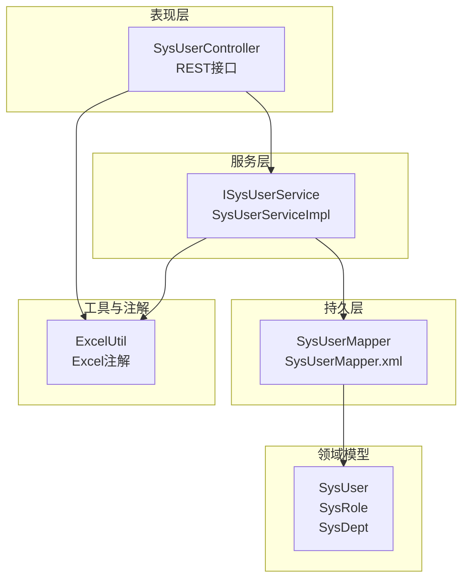
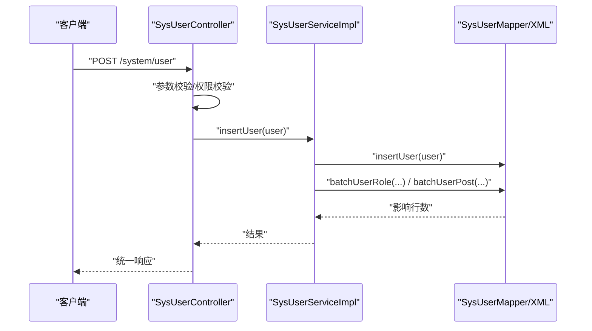
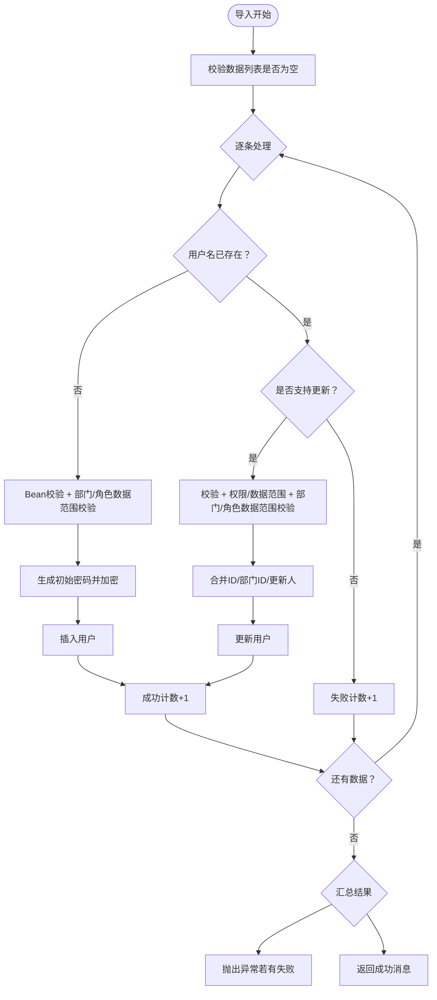
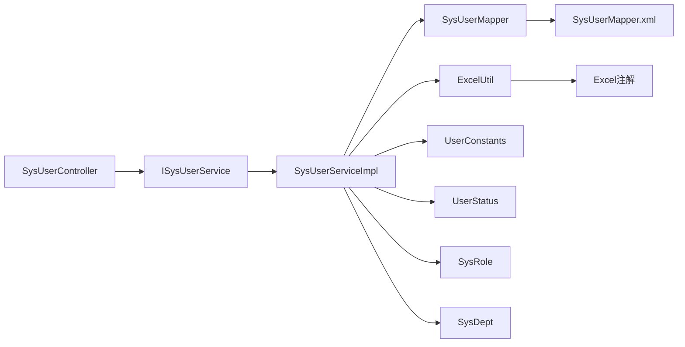

# 用户管理

<cite>
**本文引用的文件**
- [SysUser.java](file://blog-common/src/main/java/blog/common/core/domain/entity/SysUser.java)
- [ISysUserService.java](file://blog-system/src/main/java/blog/system/service/ISysUserService.java)
- [SysUserServiceImpl.java](file://blog-system/src/main/java/blog/system/service/impl/SysUserServiceImpl.java)
- [SysUserController.java](file://blog-admin/src/main/java/blog/web/controller/system/SysUserController.java)
- [SysUserMapper.java](file://blog-system/src/main/java/blog/system/mapper/SysUserMapper.java)
- [SysUserMapper.xml](file://blog-system/src/main/resources/mapper/system/SysUserMapper.xml)
- [ExcelUtil.java](file://blog-common/src/main/java/blog/common/utils/poi/ExcelUtil.java)
- [Excel.java](file://blog-common/src/main/java/blog/common/annotation/Excel.java)
- [UserConstants.java](file://blog-common/src/main/java/blog/common/constant/UserConstants.java)
- [UserStatus.java](file://blog-common/src/main/java/blog/common/enums/UserStatus.java)
- [SysRole.java](file://blog-common/src/main/java/blog/common/core/domain/entity/SysRole.java)
- [SysDept.java](file://blog-common/src/main/java/blog/common/core/domain/entity/SysDept.java)
</cite>

## 目录
1. [简介](#简介)
2. [项目结构](#项目结构)
3. [核心组件](#核心组件)
4. [架构总览](#架构总览)
5. [详细组件分析](#详细组件分析)
6. [依赖分析](#依赖分析)
7. [性能考虑](#性能考虑)
8. [故障排查指南](#故障排查指南)
9. [结论](#结论)
10. [附录](#附录)

## 简介
本文件系统化梳理用户管理模块的功能与实现，覆盖用户CRUD、查询、状态管理、权限与唯一性校验、登录信息更新、Excel导入导出等完整能力。文档面向开发者与维护者，既提供代码级细节，也给出可视化图示与最佳实践建议。

## 项目结构
用户管理模块由“控制器-服务-持久层-实体模型-工具与注解”组成，采用分层清晰的架构：
- 控制器层：提供REST接口，负责鉴权、参数校验、调用服务层并返回结果
- 服务层：封装业务逻辑，包括唯一性校验、数据权限校验、角色/岗位关联、导入导出、登录信息更新等
- 持久层：MyBatis映射XML定义SQL，Mapper接口声明方法
- 实体模型：SysUser、SysRole、SysDept等，承载业务数据与注解驱动的Excel导出配置
- 工具与注解：ExcelUtil与Excel注解，支撑Excel导入导出与字段映射

图表来源
- [SysUserController.java:1-233](file://blog-admin/src/main/java/blog/web/controller/system/SysUserController.java#L1-L233)
- [ISysUserService.java:1-219](file://blog-system/src/main/java/blog/system/service/ISysUserService.java#L1-L219)
- [SysUserServiceImpl.java:1-513](file://blog-system/src/main/java/blog/system/service/impl/SysUserServiceImpl.java#L1-L513)
- [SysUserMapper.java:1-149](file://blog-system/src/main/java/blog/system/mapper/SysUserMapper.java#L1-L149)
- [SysUserMapper.xml:1-232](file://blog-system/src/main/resources/mapper/system/SysUserMapper.xml#L1-L232)
- [SysUser.java:1-339](file://blog-common/src/main/java/blog/common/core/domain/entity/SysUser.java#L1-L339)
- [SysRole.java:1-240](file://blog-common/src/main/java/blog/common/core/domain/entity/SysRole.java#L1-L240)
- [SysDept.java:1-95](file://blog-common/src/main/java/blog/common/core/domain/entity/SysDept.java#L1-L95)
- [ExcelUtil.java:1-800](file://blog-common/src/main/java/blog/common/utils/poi/ExcelUtil.java#L1-L800)
- [Excel.java:1-191](file://blog-common/src/main/java/blog/common/annotation/Excel.java#L1-L191)

章节来源
- [SysUserController.java:1-233](file://blog-admin/src/main/java/blog/web/controller/system/SysUserController.java#L1-L233)
- [SysUserServiceImpl.java:1-513](file://blog-system/src/main/java/blog/system/service/impl/SysUserServiceImpl.java#L1-L513)
- [SysUserMapper.xml:1-232](file://blog-system/src/main/resources/mapper/system/SysUserMapper.xml#L1-L232)

## 核心组件
- SysUser 实体：定义用户基础字段、状态、登录信息、部门与角色关联等，配合Excel注解实现导出/导入字段映射
- ISysUserService 接口：定义用户查询、唯一性校验、新增/修改、授权角色、状态变更、导入导出、登录信息更新等业务契约
- SysUserServiceImpl 实现：具体业务逻辑，含事务控制、数据权限校验、Bean校验、密码加密、角色/岗位关联维护
- SysUserController 控制器：REST接口入口，鉴权注解、参数校验、调用服务层并返回统一响应
- SysUserMapper + XML：SQL映射，涵盖分页查询、唯一性校验、CRUD、登录信息更新、批量删除等
- ExcelUtil + Excel注解：Excel导入导出工具与注解，支持字段映射、字典转换、日期解析、图片处理等

章节来源
- [SysUser.java:1-339](file://blog-common/src/main/java/blog/common/core/domain/entity/SysUser.java#L1-L339)
- [ISysUserService.java:1-219](file://blog-system/src/main/java/blog/system/service/ISysUserService.java#L1-L219)
- [SysUserServiceImpl.java:1-513](file://blog-system/src/main/java/blog/system/service/impl/SysUserServiceImpl.java#L1-L513)
- [SysUserController.java:1-233](file://blog-admin/src/main/java/blog/web/controller/system/SysUserController.java#L1-L233)
- [SysUserMapper.java:1-149](file://blog-system/src/main/java/blog/system/mapper/SysUserMapper.java#L1-L149)
- [SysUserMapper.xml:1-232](file://blog-system/src/main/resources/mapper/system/SysUserMapper.xml#L1-L232)
- [ExcelUtil.java:1-800](file://blog-common/src/main/java/blog/common/utils/poi/ExcelUtil.java#L1-L800)
- [Excel.java:1-191](file://blog-common/src/main/java/blog/common/annotation/Excel.java#L1-L191)

## 架构总览
用户管理遵循经典的三层架构，控制器负责请求编排，服务层封装业务规则，持久层执行数据库操作。服务层通过注解实现数据范围过滤与权限校验，确保跨部门/跨角色的安全边界。

图表来源
- [SysUserController.java:117-133](file://blog-admin/src/main/java/blog/web/controller/system/SysUserController.java#L117-L133)
- [SysUserServiceImpl.java:241-251](file://blog-system/src/main/java/blog/system/service/impl/SysUserServiceImpl.java#L241-L251)
- [SysUserMapper.xml:151-183](file://blog-system/src/main/resources/mapper/system/SysUserMapper.xml#L151-L183)

## 详细组件分析

### SysUser 实体设计
- 字段与约束
  - 用户ID、部门ID、登录账号、昵称、邮箱、手机号、性别、头像、密码、状态、删除标记、最后登录IP/时间、密码更新时间等
  - 使用注解进行XSS防护、长度与格式校验、Excel导出/导入映射
- 关联关系
  - 一对一：部门对象
  - 一对多：角色列表
  - 角色/岗位ID数组用于授权与岗位绑定
- 管理员判定
  - 提供isAdmin静态与实例方法，限定超级管理员不可被普通用户操作

章节来源
- [SysUser.java:18-339](file://blog-common/src/main/java/blog/common/core/domain/entity/SysUser.java#L18-L339)

### 用户服务层业务逻辑
- 查询与分页
  - 支持按用户ID、账号、状态、手机号、时间范围、部门等条件查询
  - 使用数据范围注解进行权限过滤
- 唯一性校验
  - 用户名、手机号、邮箱唯一性校验，忽略自身ID
- 权限与数据范围
  - 不允许操作超级管理员
  - 校验目标用户是否在当前用户的数据范围内
- 新增/修改
  - 新增：插入用户、批量写入角色/岗位关联
  - 修改：先清理旧关联，再写入新角色/岗位关联
- 授权与状态
  - 授权角色：删除旧关联后批量写入
  - 修改状态：直接更新状态与更新时间
- 基本信息与头像
  - 更新基本信息与头像
- 登录信息更新
  - 更新最后登录IP与时间
- 密码重置
  - 支持按用户或按ID重置密码
- 删除
  - 支持单个与批量删除，清理角色/岗位关联
- 导入
  - 支持新增导入与更新导入，Bean校验、部门/角色数据范围校验、密码加密、异常聚合提示

图表来源
- [SysUserServiceImpl.java:460-511](file://blog-system/src/main/java/blog/system/service/impl/SysUserServiceImpl.java#L460-L511)

章节来源
- [ISysUserService.java:1-219](file://blog-system/src/main/java/blog/system/service/ISysUserService.java#L1-L219)
- [SysUserServiceImpl.java:1-513](file://blog-system/src/main/java/blog/system/service/impl/SysUserServiceImpl.java#L1-L513)

### 用户控制器接口设计
- 用户列表查询
  - GET /system/user/list：分页查询，支持多条件过滤
- 用户详情获取
  - GET /system/user 或 /system/user/{userId}：返回用户、岗位ID、角色ID列表，以及可选角色/岗位集合
- 新增用户
  - POST /system/user：校验唯一性、部门/角色数据范围、密码加密后新增
- 修改用户
  - PUT /system/user：权限/数据范围校验、唯一性校验、密码可选加密后更新
- 删除用户
  - DELETE /system/user/{userIds}：禁止删除自身，清理关联后删除
- 重置密码
  - PUT /system/user/resetPwd：权限/数据范围校验、密码加密后重置
- 状态变更
  - PUT /system/user/changeStatus：权限/数据范围校验后更新状态
- 授权角色
  - GET /system/user/authRole/{userId}：返回用户与可授权角色
  - PUT /system/user/authRole：校验数据范围与角色数据范围后授权
- 导出/导入
  - POST /system/user/export：导出用户列表
  - POST /system/user/importData：导入Excel，支持更新模式
  - POST /system/user/importTemplate：下载导入模板
- 部门树
  - GET /system/user/deptTree：返回部门树

章节来源
- [SysUserController.java:1-233](file://blog-admin/src/main/java/blog/web/controller/system/SysUserController.java#L1-L233)

### Excel导入导出实现
- 导出
  - 基于实体上的Excel注解，自动映射字段与样式，支持标题合并、字典转换、日期格式化、统计行等
- 导入
  - 读取Excel首行作为字段映射，按注解解析类型、字典/枚举反向转换、日期解析、图片处理等
  - 支持模板导出，便于用户按模板填写后导入

章节来源
- [ExcelUtil.java:294-449](file://blog-common/src/main/java/blog/common/utils/poi/ExcelUtil.java#L294-L449)
- [ExcelUtil.java:483-501](file://blog-common/src/main/java/blog/common/utils/poi/ExcelUtil.java#L483-L501)
- [ExcelUtil.java:520-547](file://blog-common/src/main/java/blog/common/utils/poi/ExcelUtil.java#L520-L547)
- [Excel.java:1-191](file://blog-common/src/main/java/blog/common/annotation/Excel.java#L1-L191)
- [SysUserController.java:68-92](file://blog-admin/src/main/java/blog/web/controller/system/SysUserController.java#L68-L92)

## 依赖分析
- 控制器依赖服务层接口，服务层依赖Mapper与配置/部门/角色服务，Mapper依赖实体模型
- 导入导出依赖Excel注解与工具类
- 权限与数据范围通过注解与工具类协同实现

图表来源
- [SysUserController.java:1-233](file://blog-admin/src/main/java/blog/web/controller/system/SysUserController.java#L1-L233)
- [ISysUserService.java:1-219](file://blog-system/src/main/java/blog/system/service/ISysUserService.java#L1-L219)
- [SysUserServiceImpl.java:1-513](file://blog-system/src/main/java/blog/system/service/impl/SysUserServiceImpl.java#L1-L513)
- [SysUserMapper.java:1-149](file://blog-system/src/main/java/blog/system/mapper/SysUserMapper.java#L1-L149)
- [SysUserMapper.xml:1-232](file://blog-system/src/main/resources/mapper/system/SysUserMapper.xml#L1-L232)
- [ExcelUtil.java:1-800](file://blog-common/src/main/java/blog/common/utils/poi/ExcelUtil.java#L1-L800)
- [Excel.java:1-191](file://blog-common/src/main/java/blog/common/annotation/Excel.java#L1-L191)
- [UserConstants.java:1-117](file://blog-common/src/main/java/blog/common/constant/UserConstants.java#L1-L117)
- [UserStatus.java:1-27](file://blog-common/src/main/java/blog/common/enums/UserStatus.java#L1-L27)
- [SysRole.java:1-240](file://blog-common/src/main/java/blog/common/core/domain/entity/SysRole.java#L1-L240)
- [SysDept.java:1-95](file://blog-common/src/main/java/blog/common/core/domain/entity/SysDept.java#L1-L95)

## 性能考虑
- 分页查询与条件过滤：合理使用索引字段（如用户ID、账号、状态、手机号、创建时间），避免全表扫描
- 数据范围过滤：通过注解注入SQL片段，减少不必要的数据传输
- 批量操作：角色/岗位关联采用批量插入，降低网络往返与事务开销
- 导入导出：大文件建议分批处理，注意内存与IO压力，必要时采用流式读取
- 缓存策略：对字典/常量类数据可引入缓存，减少重复查询

## 故障排查指南
- 导入失败
  - 检查Excel列名与实体注解是否一致，确认日期格式、字典值映射
  - 查看失败计数与异常消息，定位具体行与原因
- 唯一性冲突
  - 核对用户名/手机号/邮箱是否重复，忽略自身ID的逻辑是否生效
- 权限/数据范围异常
  - 确认当前用户是否具备目标用户的数据范围权限，避免越权操作
- 密码问题
  - 确保密码加密流程正确，重置密码时更新时间同步更新
- 删除失败
  - 检查是否尝试删除自身，以及角色/岗位关联是否清理完成

章节来源
- [SysUserServiceImpl.java:460-511](file://blog-system/src/main/java/blog/system/service/impl/SysUserServiceImpl.java#L460-L511)
- [SysUserController.java:163-168](file://blog-admin/src/main/java/blog/web/controller/system/SysUserController.java#L163-L168)

## 结论
该用户管理模块以清晰的分层与完善的注解体系实现了用户CRUD、查询、状态管理、权限与唯一性校验、登录信息更新以及Excel导入导出等核心能力。通过服务层的事务与校验机制，保证了业务一致性与安全性；通过注解驱动的Excel工具，提升了数据治理效率。建议在生产环境中结合索引优化、批量处理与缓存策略进一步提升性能与稳定性。

## 附录

### API接口清单（路径与用途）
- GET /system/user/list：用户列表查询（分页、多条件）
- POST /system/user/export：导出用户列表
- POST /system/user/importData：导入用户（支持更新）
- POST /system/user/importTemplate：下载导入模板
- GET /system/user/{userId}：获取用户详情（含岗位/角色信息）
- POST /system/user：新增用户
- PUT /system/user：修改用户
- DELETE /system/user/{userIds}：删除用户
- PUT /system/user/resetPwd：重置密码
- PUT /system/user/changeStatus：修改状态
- GET /system/user/authRole/{userId}：获取可授权角色
- PUT /system/user/authRole：授权角色
- GET /system/user/deptTree：部门树

章节来源
- [SysUserController.java:58-232](file://blog-admin/src/main/java/blog/web/controller/system/SysUserController.java#L58-L232)