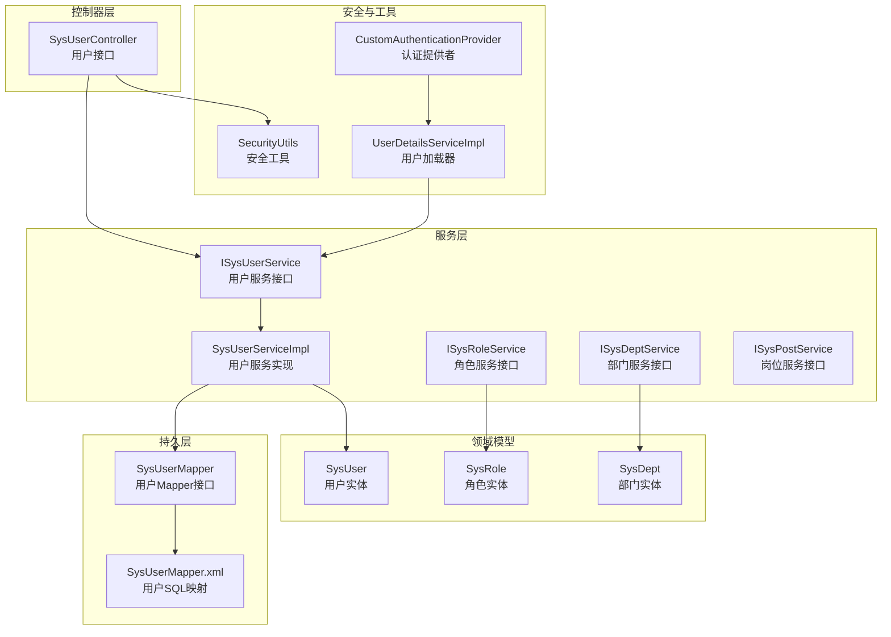
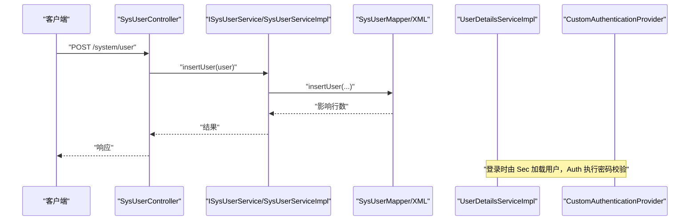
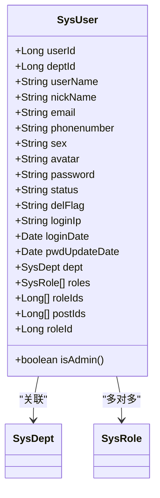
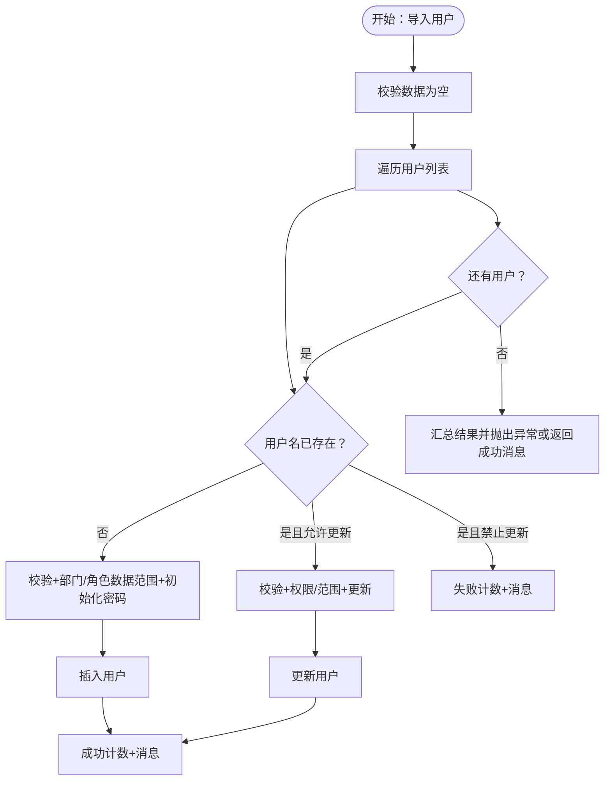
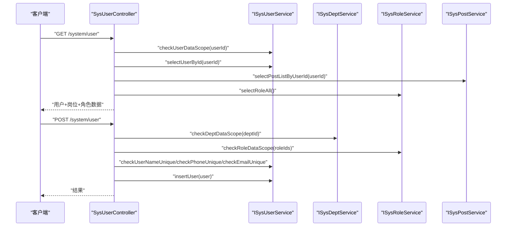
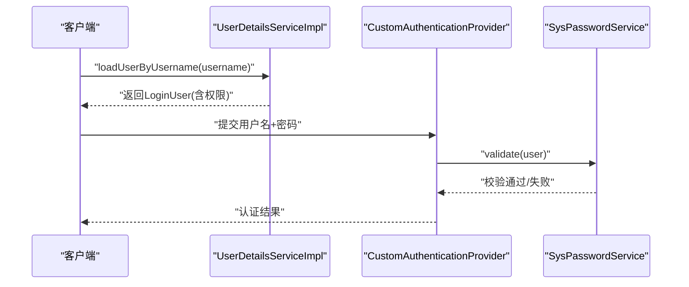
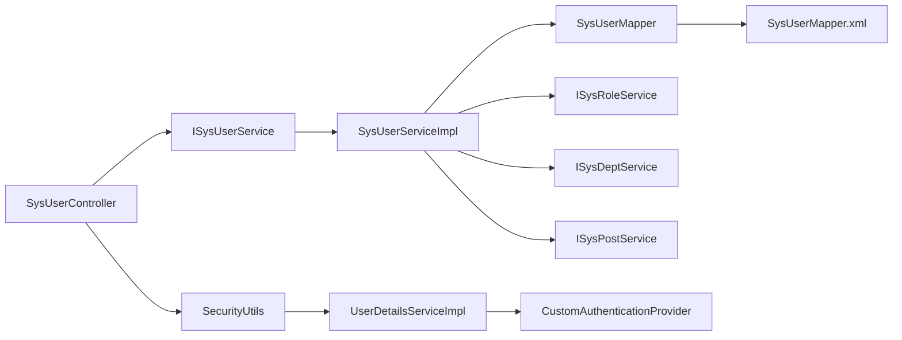

# 用户系统管理

<cite>
**本文引用的文件**
- [SysUser.java](file://blog-common/src/main/java/blog/common/core/domain/entity/SysUser.java)
- [SysRole.java](file://blog-common/src/main/java/blog/common/core/domain/entity/SysRole.java)
- [SysDept.java](file://blog-common/src/main/java/blog/common/core/domain/entity/SysDept.java)
- [ISysUserService.java](file://blog-system/src/main/java/blog/system/service/ISysUserService.java)
- [SysUserServiceImpl.java](file://blog-system/src/main/java/blog/system/service/impl/SysUserServiceImpl.java)
- [SysUserMapper.java](file://blog-system/src/main/java/blog/system/mapper/SysUserMapper.java)
- [SysUserMapper.xml](file://blog-system/src/main/resources/mapper/system/SysUserMapper.xml)
- [SysUserController.java](file://blog-admin/src/main/java/blog/web/controller/system/SysUserController.java)
- [ISysRoleService.java](file://blog-system/src/main/java/blog/system/service/ISysRoleService.java)
- [ISysDeptService.java](file://blog-system/src/main/java/blog/system/service/ISysDeptService.java)
- [ISysPostService.java](file://blog-system/src/main/java/blog/system/service/ISysPostService.java)
- [SecurityUtils.java](file://blog-common/src/main/java/blog/common/utils/SecurityUtils.java)
- [UserConstants.java](file://blog-common/src/main/java/blog/common/constant/UserConstants.java)
- [UserDetailsServiceImpl.java](file://blog-framework/src/main/java/blog/framework/web/service/UserDetailsServiceImpl.java)
- [CustomAuthenticationProvider.java](file://blog-framework/src/main/java/blog/framework/security/provider/CustomAuthenticationProvider.java)
</cite>

## 目录
1. [简介](#简介)
2. [项目结构](#项目结构)
3. [核心组件](#核心组件)
4. [架构总览](#架构总览)
5. [详细组件分析](#详细组件分析)
6. [依赖分析](#依赖分析)
7. [性能考虑](#性能考虑)
8. [故障排查指南](#故障排查指南)
9. [结论](#结论)
10. [附录：API 接口文档](#附录api-接口文档)

## 简介
本文件面向开发者与运维人员，系统化梳理博客系统的用户系统管理能力，覆盖用户注册、登录、信息修改、状态管理、角色权限、部门组织、数据范围控制、导入导出等完整闭环。文档以代码为依据，结合实体模型、服务层业务逻辑、控制器接口与安全认证流程，提供可操作的集成与扩展指南。

## 项目结构
用户系统管理涉及三层：控制器层（HTTP 接口）、服务层（业务逻辑）、持久层（MyBatis 映射）。配合通用领域模型（用户、角色、部门）与安全工具类，形成统一的用户管理体系。

图示来源
- [SysUserController.java:1-233](file://blog-admin/src/main/java/blog/web/controller/system/SysUserController.java#L1-L233)
- [ISysUserService.java:1-219](file://blog-system/src/main/java/blog/system/service/ISysUserService.java#L1-L219)
- [SysUserServiceImpl.java:1-513](file://blog-system/src/main/java/blog/system/service/impl/SysUserServiceImpl.java#L1-L513)
- [SysUserMapper.java:1-149](file://blog-system/src/main/java/blog/system/mapper/SysUserMapper.java#L1-L149)
- [SysUserMapper.xml:1-232](file://blog-system/src/main/resources/mapper/system/SysUserMapper.xml#L1-L232)
- [SysUser.java:1-339](file://blog-common/src/main/java/blog/common/core/domain/entity/SysUser.java#L1-L339)
- [SysRole.java:1-240](file://blog-common/src/main/java/blog/common/core/domain/entity/SysRole.java#L1-L240)
- [SysDept.java:1-95](file://blog-common/src/main/java/blog/common/core/domain/entity/SysDept.java#L1-L95)
- [UserDetailsServiceImpl.java:1-57](file://blog-framework/src/main/java/blog/framework/web/service/UserDetailsServiceImpl.java#L1-L57)
- [CustomAuthenticationProvider.java:1-60](file://blog-framework/src/main/java/blog/framework/security/provider/CustomAuthenticationProvider.java#L1-L60)
- [SecurityUtils.java:1-159](file://blog-common/src/main/java/blog/common/utils/SecurityUtils.java#L1-L159)

章节来源
- [SysUserController.java:1-233](file://blog-admin/src/main/java/blog/web/controller/system/SysUserController.java#L1-L233)
- [SysUserServiceImpl.java:1-513](file://blog-system/src/main/java/blog/system/service/impl/SysUserServiceImpl.java#L1-L513)

## 核心组件
- 用户实体 SysUser：承载用户基本信息、账户状态、登录信息、关联部门与角色、岗位组等字段，提供校验注解与导出标注。
- 角色实体 SysRole：定义角色名称、权限键、数据范围、菜单/部门勾选策略、状态等，支撑权限与数据范围控制。
- 部门实体 SysDept：描述部门层级、祖先链、排序、负责人与联系方式，支撑组织树构建与数据范围继承。
- 用户服务 ISysUserService/SysUserServiceImpl：实现用户 CRUD、导入导出、角色/岗位授权、状态变更、密码重置、登录信息更新、数据范围校验等。
- 控制器 SysUserController：暴露 REST 接口，完成鉴权、参数校验、Excel 导入导出、角色授权、部门树查询等。
- 安全工具 SecurityUtils：提供加密、匹配、权限/角色判断、当前用户上下文获取等。
- 认证链路：UserDetailsServiceImpl 加载用户并装配权限；CustomAuthenticationProvider 进行额外密码校验与失败次数检查。

章节来源
- [SysUser.java:1-339](file://blog-common/src/main/java/blog/common/core/domain/entity/SysUser.java#L1-L339)
- [SysRole.java:1-240](file://blog-common/src/main/java/blog/common/core/domain/entity/SysRole.java#L1-L240)
- [SysDept.java:1-95](file://blog-common/src/main/java/blog/common/core/domain/entity/SysDept.java#L1-L95)
- [ISysUserService.java:1-219](file://blog-system/src/main/java/blog/system/service/ISysUserService.java#L1-L219)
- [SysUserServiceImpl.java:1-513](file://blog-system/src/main/java/blog/system/service/impl/SysUserServiceImpl.java#L1-L513)
- [SysUserController.java:1-233](file://blog-admin/src/main/java/blog/web/controller/system/SysUserController.java#L1-L233)
- [SecurityUtils.java:1-159](file://blog-common/src/main/java/blog/common/utils/SecurityUtils.java#L1-L159)
- [UserDetailsServiceImpl.java:1-57](file://blog-framework/src/main/java/blog/framework/web/service/UserDetailsServiceImpl.java#L1-L57)
- [CustomAuthenticationProvider.java:1-60](file://blog-framework/src/main/java/blog/framework/security/provider/CustomAuthenticationProvider.java#L1-L60)

## 架构总览
用户系统采用“控制器-服务-持久层”分层，结合 MyBatis Plus 与 XML 映射，实现用户主数据与关联关系（角色、岗位）的统一管理。安全认证通过 Spring Security 与自定义 Provider 实现，密码加密采用 BCrypt。

图示来源
- [SysUserController.java:117-133](file://blog-admin/src/main/java/blog/web/controller/system/SysUserController.java#L117-L133)
- [SysUserServiceImpl.java:241-251](file://blog-system/src/main/java/blog/system/service/impl/SysUserServiceImpl.java#L241-L251)
- [SysUserMapper.xml:151-183](file://blog-system/src/main/resources/mapper/system/SysUserMapper.xml#L151-L183)
- [UserDetailsServiceImpl.java:33-55](file://blog-framework/src/main/java/blog/framework/web/service/UserDetailsServiceImpl.java#L33-L55)
- [CustomAuthenticationProvider.java:51-57](file://blog-framework/src/main/java/blog/framework/security/provider/CustomAuthenticationProvider.java#L51-L57)

## 详细组件分析

### 用户实体 SysUser 设计
- 关键字段
  - 基本信息：用户ID、部门ID、账号、昵称、邮箱、手机、性别、头像、密码
  - 状态与审计：状态、删除标志、最后登录IP/时间、密码更新时间、创建/更新信息
  - 关联对象：部门（一对多）、角色列表（多对多）、岗位组（多对多）
- 校验与导出
  - 使用注解进行长度、必填、邮箱格式等校验
  - 使用 Excel/Excels 注解支持导入导出与列映射
- 辅助方法
  - 管理员判定、字段 getter/setter、ToString 输出

图示来源
- [SysUser.java:24-339](file://blog-common/src/main/java/blog/common/core/domain/entity/SysUser.java#L24-L339)

章节来源
- [SysUser.java:1-339](file://blog-common/src/main/java/blog/common/core/domain/entity/SysUser.java#L1-L339)

### 角色实体 SysRole 设计
- 关键字段
  - 角色ID、角色名称、角色权限键、排序、数据范围、菜单/部门勾选严格性、状态、删除标志
  - 权限集合、菜单/部门ID数组、用户是否存在此角色标识
- 数据范围
  - 支持“全部/自定义/本部门/本部门及以下/仅本人”等范围策略，用于后续数据权限过滤

章节来源
- [SysRole.java:1-240](file://blog-common/src/main/java/blog/common/core/domain/entity/SysRole.java#L1-L240)

### 部门实体 SysDept 设计
- 关键字段
  - 部门ID、父ID、祖先链、部门名称、排序、负责人、电话、邮箱、状态、删除标志
  - 子部门集合，便于树形结构展示与递归查询

章节来源
- [SysDept.java:1-95](file://blog-common/src/main/java/blog/common/core/domain/entity/SysDept.java#L1-L95)

### 用户服务层业务逻辑（ISysUserService/SysUserServiceImpl）
- 用户查询与分页
  - 支持按条件分页查询、已分配/未分配角色用户查询
  - 使用数据范围注解进行权限过滤
- 用户校验
  - 用户名/手机号/邮箱唯一性校验
  - 管理员禁止操作校验、数据范围校验
- 用户增删改
  - 新增：插入用户、批量写入用户-角色、用户-岗位
  - 修改：先清理旧关联，再写入新关联
  - 删除：级联删除角色/岗位关联，软删除用户
- 密码与登录信息
  - 密码重置、登录信息更新（IP/时间）
- 导入导出
  - Excel 导入：支持新增或更新，校验部门/角色数据范围、初始化密码、记录操作人
  - 导出：按模板导出用户列表

图示来源
- [SysUserServiceImpl.java:460-511](file://blog-system/src/main/java/blog/system/service/impl/SysUserServiceImpl.java#L460-L511)
- [SysUserMapper.xml:139-149](file://blog-system/src/main/resources/mapper/system/SysUserMapper.xml#L139-L149)

章节来源
- [ISysUserService.java:1-219](file://blog-system/src/main/java/blog/system/service/ISysUserService.java#L1-L219)
- [SysUserServiceImpl.java:1-513](file://blog-system/src/main/java/blog/system/service/impl/SysUserServiceImpl.java#L1-L513)
- [SysUserMapper.java:1-149](file://blog-system/src/main/java/blog/system/mapper/SysUserMapper.java#L1-L149)
- [SysUserMapper.xml:1-232](file://blog-system/src/main/resources/mapper/system/SysUserMapper.xml#L1-L232)

### 用户控制器接口（SysUserController）
- 用户列表与导出
  - GET /system/user/list：分页查询用户
  - POST /system/user/export：导出用户为 Excel
- 导入模板与数据
  - POST /system/user/importData：从 Excel 导入用户
  - GET /system/user/importTemplate：下载导入模板
- 用户详情与授权
  - GET /system/user 或 /system/user/{userId}：获取用户详情、岗位与角色列表
  - GET /system/user/authRole/{userId}：获取用户可授权角色
  - PUT /system/user/authRole：给用户授权角色
- 用户 CRUD
  - POST /system/user：新增用户（校验唯一性、加密密码、写入创建人）
  - PUT /system/user：修改用户（校验唯一性、权限/范围、写入更新人）
  - DELETE /system/user/{userIds}：删除用户（禁止删除自己）
  - PUT /system/user/resetPwd：重置密码（加密后写入）
  - PUT /system/user/changeStatus：修改状态
- 部门树
  - GET /system/user/deptTree：获取部门树列表

图示来源
- [SysUserController.java:57-112](file://blog-admin/src/main/java/blog/web/controller/system/SysUserController.java#L57-L112)
- [SysUserController.java:114-155](file://blog-admin/src/main/java/blog/web/controller/system/SysUserController.java#L114-L155)

章节来源
- [SysUserController.java:1-233](file://blog-admin/src/main/java/blog/web/controller/system/SysUserController.java#L1-L233)

### 登录与权限校验（安全链路）
- 用户加载
  - UserDetailsServiceImpl 根据用户名加载用户，校验删除/停用状态，装配权限
- 密码校验
  - CustomAuthenticationProvider 在认证过程中调用密码服务进行校验与失败次数检查
- 权限与角色判断
  - SecurityUtils 提供权限/角色匹配、管理员判断、当前用户上下文获取

图示来源
- [UserDetailsServiceImpl.java:33-55](file://blog-framework/src/main/java/blog/framework/web/service/UserDetailsServiceImpl.java#L33-L55)
- [CustomAuthenticationProvider.java:51-57](file://blog-framework/src/main/java/blog/framework/security/provider/CustomAuthenticationProvider.java#L51-L57)

章节来源
- [UserDetailsServiceImpl.java:1-57](file://blog-framework/src/main/java/blog/framework/web/service/UserDetailsServiceImpl.java#L1-L57)
- [CustomAuthenticationProvider.java:1-60](file://blog-framework/src/main/java/blog/framework/security/provider/CustomAuthenticationProvider.java#L1-L60)
- [SecurityUtils.java:1-159](file://blog-common/src/main/java/blog/common/utils/SecurityUtils.java#L1-L159)

## 依赖分析
- 控制器依赖服务接口，服务实现依赖 Mapper 与配置/部门/岗位服务，以及安全工具
- 实体之间通过关联关系（用户-部门、用户-角色、用户-岗位）形成闭环
- 数据范围通过注解与 SQL 片段（${params.dataScope}）在查询阶段生效

图示来源
- [SysUserController.java:1-233](file://blog-admin/src/main/java/blog/web/controller/system/SysUserController.java#L1-L233)
- [SysUserServiceImpl.java:1-513](file://blog-system/src/main/java/blog/system/service/impl/SysUserServiceImpl.java#L1-L513)
- [SysUserMapper.java:1-149](file://blog-system/src/main/java/blog/system/mapper/SysUserMapper.java#L1-L149)
- [SysUserMapper.xml:1-232](file://blog-system/src/main/resources/mapper/system/SysUserMapper.xml#L1-L232)
- [SecurityUtils.java:1-159](file://blog-common/src/main/java/blog/common/utils/SecurityUtils.java#L1-L159)
- [UserDetailsServiceImpl.java:1-57](file://blog-framework/src/main/java/blog/framework/web/service/UserDetailsServiceImpl.java#L1-L57)
- [CustomAuthenticationProvider.java:1-60](file://blog-framework/src/main/java/blog/framework/security/provider/CustomAuthenticationProvider.java#L1-L60)

章节来源
- [SysUserController.java:1-233](file://blog-admin/src/main/java/blog/web/controller/system/SysUserController.java#L1-L233)
- [SysUserServiceImpl.java:1-513](file://blog-system/src/main/java/blog/system/service/impl/SysUserServiceImpl.java#L1-L513)

## 性能考虑
- 分页查询与数据范围过滤：确保在高并发场景下，SQL 中的数据范围片段与索引列（如创建时间、部门ID）得到合理利用
- 批量写入：导入/授权时使用批量插入与清理，减少事务开销
- 密码加密：采用 BCrypt，避免明文存储与重复计算
- 缓存与会话：建议结合 Redis 缓存用户权限与登录态，降低数据库压力

## 故障排查指南
- 导入失败
  - 检查 Excel 模板与字段映射是否一致
  - 关注唯一性校验（用户名/手机号/邮箱）与部门/角色数据范围校验
  - 查看服务端日志中的异常堆栈与失败消息
- 权限不足
  - 确认当前用户是否具备对应权限（如 system:user:*）
  - 检查数据范围校验是否拒绝访问目标用户
- 登录失败
  - 核对密码是否匹配（BCrypt 匹配），确认用户未被停用或删除
  - 检查认证提供者的额外校验逻辑

章节来源
- [SysUserServiceImpl.java:497-511](file://blog-system/src/main/java/blog/system/service/impl/SysUserServiceImpl.java#L497-L511)
- [UserDetailsServiceImpl.java:36-45](file://blog-framework/src/main/java/blog/framework/web/service/UserDetailsServiceImpl.java#L36-L45)
- [CustomAuthenticationProvider.java:51-57](file://blog-framework/src/main/java/blog/framework/security/provider/CustomAuthenticationProvider.java#L51-L57)

## 结论
该用户系统以清晰的分层与实体模型为基础，结合安全认证与数据范围控制，提供了完善的用户管理能力。通过控制器暴露标准接口，服务层封装复杂业务，持久层提供灵活的 SQL 映射，能够满足日常用户注册、登录、信息维护、角色授权与批量导入导出等需求。建议在生产环境中进一步完善缓存、监控与审计能力，持续优化查询与导入性能。

## 附录：API 接口文档

- 获取用户列表
  - 方法：GET
  - 路径：/system/user/list
  - 权限：system:user:list
  - 参数：SysUser（支持分页与筛选）
  - 返回：TableDataInfo

- 导出用户
  - 方法：POST
  - 路径：/system/user/export
  - 权限：system:user:export
  - 参数：SysUser
  - 返回：Excel 文件流

- 导入用户
  - 方法：POST
  - 路径：/system/user/importData
  - 权限：system:user:import
  - 参数：multipartFile（Excel）、updateSupport（是否更新）
  - 返回：Result（汇总消息）

- 下载导入模板
  - 方法：GET
  - 路径：/system/user/importTemplate
  - 返回：Excel 模板文件流

- 获取用户详情
  - 方法：GET
  - 路径：/system/user 或 /system/user/{userId}
  - 权限：system:user:query
  - 返回：Result（包含用户、岗位ID列表、角色列表）

- 新增用户
  - 方法：POST
  - 路径：/system/user
  - 权限：system:user:add
  - 参数：SysUser（含部门ID、角色ID数组、岗位ID数组、密码等）
  - 返回：Result

- 修改用户
  - 方法：PUT
  - 路径：/system/user
  - 权限：system:user:edit
  - 参数：SysUser
  - 返回：Result

- 删除用户
  - 方法：DELETE
  - 路径：/system/user/{userIds}
  - 权限：system:user:remove
  - 返回：Result

- 重置密码
  - 方法：PUT
  - 路径：/system/user/resetPwd
  - 权限：system:user:resetPwd
  - 参数：SysUser（含新密码）
  - 返回：Result

- 修改状态
  - 方法：PUT
  - 路径：/system/user/changeStatus
  - 权限：system:user:edit
  - 参数：SysUser（含状态）
  - 返回：Result

- 获取用户可授权角色
  - 方法：GET
  - 路径：/system/user/authRole/{userId}
  - 权限：system:user:query
  - 返回：Result（用户与可授权角色）

- 授权用户角色
  - 方法：PUT
  - 路径：/system/user/authRole
  - 权限：system:user:edit
  - 参数：userId、roleIds
  - 返回：Result

- 获取部门树
  - 方法：GET
  - 路径：/system/user/deptTree
  - 权限：system:user:list
  - 参数：SysDept
  - 返回：Result（部门树）

章节来源
- [SysUserController.java:57-232](file://blog-admin/src/main/java/blog/web/controller/system/SysUserController.java#L57-L232)