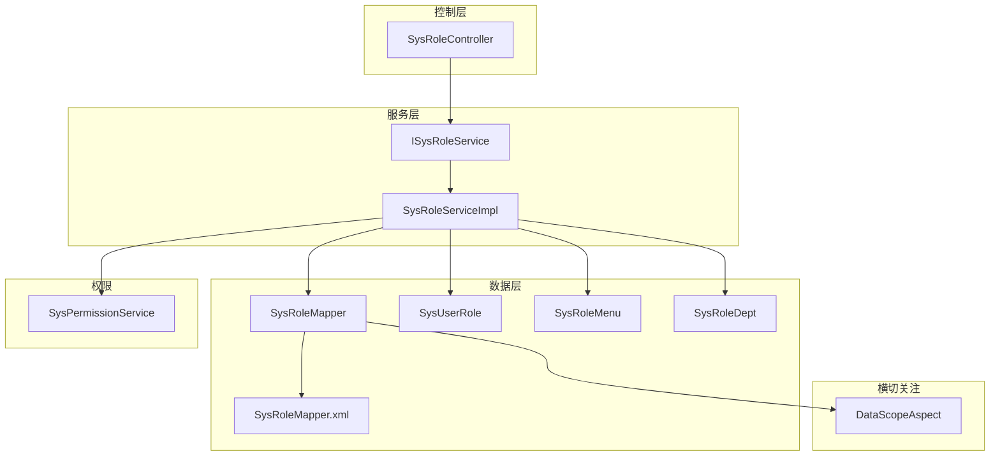
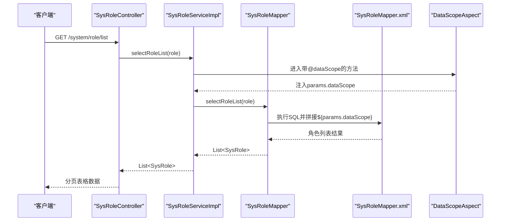
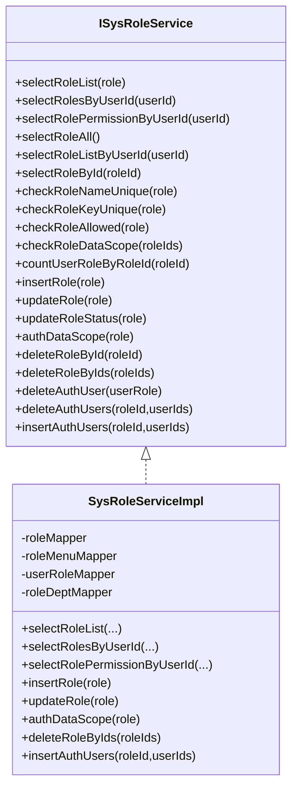
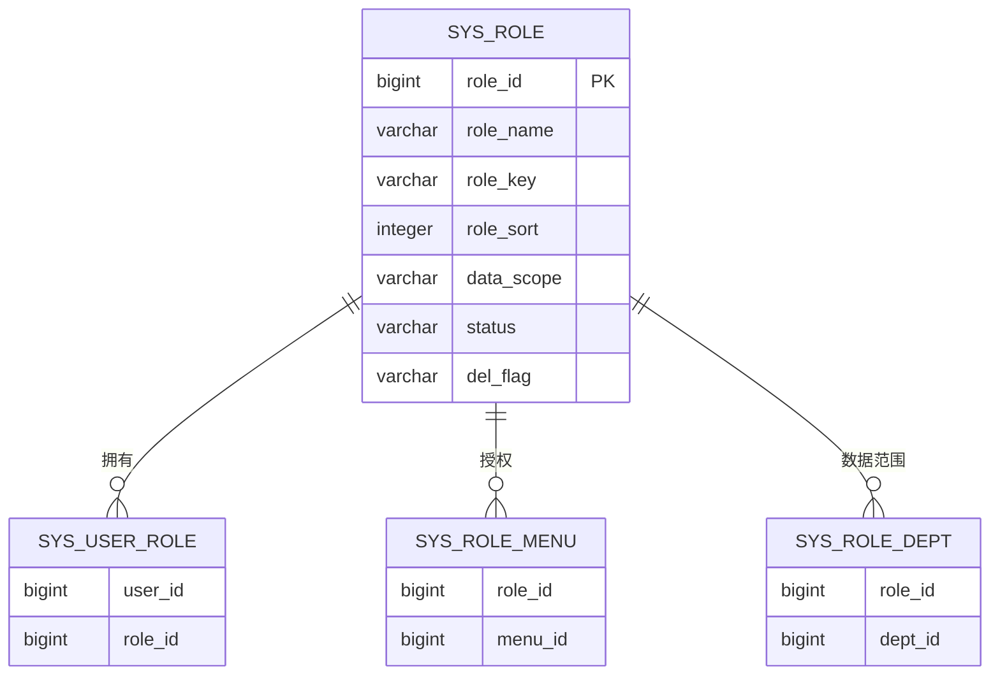
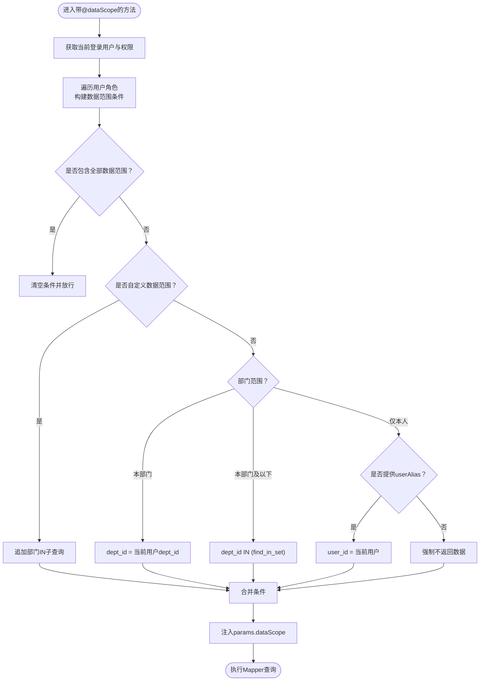
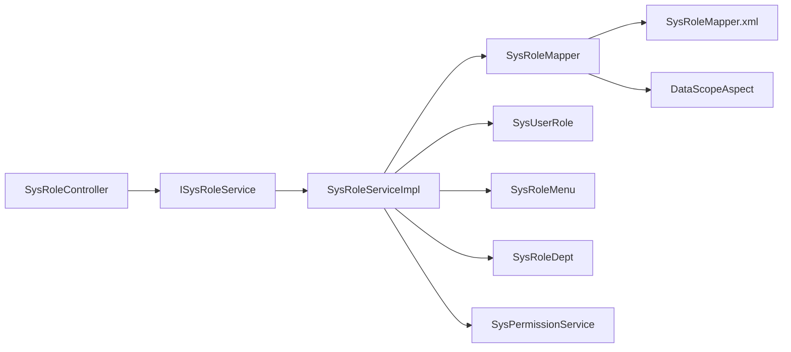

# 角色管理

<cite>
**本文引用的文件**
- [SysRole.java](file://blog-common/src/main/java/blog/common/core/domain/entity/SysRole.java)
- [ISysRoleService.java](file://blog-system/src/main/java/blog/system/service/ISysRoleService.java)
- [SysRoleServiceImpl.java](file://blog-system/src/main/java/blog/system/service/impl/SysRoleServiceImpl.java)
- [SysRoleController.java](file://blog-admin/src/main/java/blog/web/controller/system/SysRoleController.java)
- [SysRoleMapper.java](file://blog-system/src/main/java/blog/system/mapper/SysRoleMapper.java)
- [SysRoleMapper.xml](file://blog-system/src/main/resources/mapper/system/SysRoleMapper.xml)
- [SysUserRole.java](file://blog-system/src/main/java/blog/system/domain/SysUserRole.java)
- [SysRoleMenu.java](file://blog-system/src/main/java/blog/system/domain/SysRoleMenu.java)
- [SysRoleDept.java](file://blog-system/src/main/java/blog/system/domain/SysRoleDept.java)
- [DataScopeAspect.java](file://blog-framework/src/main/java/blog/framework/aspectj/DataScopeAspect.java)
- [SysPermissionService.java](file://blog-framework/src/main/java/blog/framework/web/service/SysPermissionService.java)
- [UserConstants.java](file://blog-common/src/main/java/blog/common/constant/UserConstants.java)
- [SecurityUtils.java](file://blog-common/src/main/java/blog/common/utils/SecurityUtils.java)
</cite>

## 目录
1. [简介](#简介)
2. [项目结构](#项目结构)
3. [核心组件](#核心组件)
4. [架构总览](#架构总览)
5. [详细组件分析](#详细组件分析)
6. [依赖关系分析](#依赖关系分析)
7. [性能考量](#性能考量)
8. [故障排查指南](#故障排查指南)
9. [结论](#结论)
10. [附录](#附录)

## 简介
本文件系统性梳理角色管理功能，覆盖角色定义、角色分配、角色权限与数据范围控制等关键能力。重点说明 SysRole 实体设计、服务层业务逻辑、控制器接口设计、角色与用户的关联关系、以及基于注解的数据范围控制机制。同时提供完整的 API 接口清单与使用示例，帮助开发者快速理解与扩展。

## 项目结构
角色管理涉及三层与横切关注点：
- 控制层：SysRoleController 提供 RESTful 接口
- 服务层：ISysRoleService 及其实现 SysRoleServiceImpl
- 数据层：SysRoleMapper + XML 映射 + 关联实体（SysUserRole、SysRoleMenu、SysRoleDept）
- 横切：DataScopeAspect 基于注解进行数据范围过滤
- 权限：SysPermissionService 组合角色与菜单权限

图表来源
- [SysRoleController.java:40-240](file://blog-admin/src/main/java/blog/web/controller/system/SysRoleController.java#L40-L240)
- [ISysRoleService.java:15-175](file://blog-system/src/main/java/blog/system/service/ISysRoleService.java#L15-L175)
- [SysRoleServiceImpl.java:35-389](file://blog-system/src/main/java/blog/system/service/impl/SysRoleServiceImpl.java#L35-L389)
- [SysRoleMapper.java:13-109](file://blog-system/src/main/java/blog/system/mapper/SysRoleMapper.java#L13-L109)
- [SysRoleMapper.xml:1-152](file://blog-system/src/main/resources/mapper/system/SysRoleMapper.xml#L1-L152)
- [SysUserRole.java:11-46](file://blog-system/src/main/java/blog/system/domain/SysUserRole.java#L11-L46)
- [SysRoleMenu.java:11-46](file://blog-system/src/main/java/blog/system/domain/SysRoleMenu.java#L11-L46)
- [SysRoleDept.java:11-46](file://blog-system/src/main/java/blog/system/domain/SysRoleDept.java#L11-L46)
- [DataScopeAspect.java:26-154](file://blog-framework/src/main/java/blog/framework/aspectj/DataScopeAspect.java#L26-L154)
- [SysPermissionService.java:22-76](file://blog-framework/src/main/java/blog/framework/web/service/SysPermissionService.java#L22-L76)

章节来源
- [SysRoleController.java:40-240](file://blog-admin/src/main/java/blog/web/controller/system/SysRoleController.java#L40-L240)
- [SysRoleServiceImpl.java:35-389](file://blog-system/src/main/java/blog/system/service/impl/SysRoleServiceImpl.java#L35-L389)
- [SysRoleMapper.xml:1-152](file://blog-system/src/main/resources/mapper/system/SysRoleMapper.xml#L1-L152)

## 核心组件
- SysRole 实体：描述角色基本信息、排序、数据范围、状态、菜单/部门勾选项、权限集合等
- ISysRoleService 接口：定义角色查询、校验、授权、状态变更、数据范围授权、删除等业务契约
- SysRoleServiceImpl：实现具体业务逻辑，含事务、数据范围校验、角色菜单/部门授权
- SysRoleController：暴露 RESTful 接口，负责鉴权注解、导出、分页、授权用户等
- 关联实体：SysUserRole（用户-角色）、SysRoleMenu（角色-菜单）、SysRoleDept（角色-部门）
- DataScopeAspect：基于注解自动注入数据范围 SQL 片段，实现“全部/自定义/本部门/本部门及以下/仅本人”等控制
- SysPermissionService：聚合角色权限与菜单权限，支持管理员与普通用户场景

章节来源
- [SysRole.java:15-240](file://blog-common/src/main/java/blog/common/core/domain/entity/SysRole.java#L15-L240)
- [ISysRoleService.java:15-175](file://blog-system/src/main/java/blog/system/service/ISysRoleService.java#L15-L175)
- [SysRoleServiceImpl.java:35-389](file://blog-system/src/main/java/blog/system/service/impl/SysRoleServiceImpl.java#L35-L389)
- [SysRoleController.java:40-240](file://blog-admin/src/main/java/blog/web/controller/system/SysRoleController.java#L40-L240)
- [SysUserRole.java:11-46](file://blog-system/src/main/java/blog/system/domain/SysUserRole.java#L11-L46)
- [SysRoleMenu.java:11-46](file://blog-system/src/main/java/blog/system/domain/SysRoleMenu.java#L11-L46)
- [SysRoleDept.java:11-46](file://blog-system/src/main/java/blog/system/domain/SysRoleDept.java#L11-L46)
- [DataScopeAspect.java:26-154](file://blog-framework/src/main/java/blog/framework/aspectj/DataScopeAspect.java#L26-L154)
- [SysPermissionService.java:22-76](file://blog-framework/src/main/java/blog/framework/web/service/SysPermissionService.java#L22-L76)

## 架构总览
角色管理采用经典的分层架构，结合注解驱动的数据范围过滤与权限聚合服务，形成“控制器-服务-数据访问-横切”的完整闭环。

图表来源
- [SysRoleController.java:58-64](file://blog-admin/src/main/java/blog/web/controller/system/SysRoleController.java#L58-L64)
- [SysRoleServiceImpl.java:55-59](file://blog-system/src/main/java/blog/system/service/impl/SysRoleServiceImpl.java#L55-L59)
- [SysRoleMapper.xml:33-57](file://blog-system/src/main/resources/mapper/system/SysRoleMapper.xml#L33-L57)
- [DataScopeAspect.java:59-76](file://blog-framework/src/main/java/blog/framework/aspectj/DataScopeAspect.java#L59-L76)

## 详细组件分析

### SysRole 实体设计
- 字段要点
  - 角色标识：roleId
  - 角色名称：roleName（非空、长度约束）
  - 角色键值：roleKey（权限字符、非空、长度约束）
  - 角色排序：roleSort（非空）
  - 数据范围：dataScope（1=全部；2=自定义；3=本部门；4=本部门及以下；5=仅本人）
  - 菜单/部门勾选策略：menuCheckStrictly、deptCheckStrictly
  - 状态：status（0=正常；1=停用）
  - 删除标志：delFlag（0=存在；2=删除）
  - 辅助字段：flag（用于前端勾选）、menuIds、deptIds、permissions（角色权限集合）

- 设计意图
  - 通过 dataScope 与 SysRoleDept 关联实现灵活的数据范围控制
  - 通过 permissions 与菜单权限打通，配合 SysPermissionService 实现权限聚合
  - 通过 roleSort 支持角色排序展示

章节来源
- [SysRole.java:24-238](file://blog-common/src/main/java/blog/common/core/domain/entity/SysRole.java#L24-L238)

### 服务层业务逻辑
- 角色查询
  - selectRoleList：支持分页与条件过滤，并通过 @DataScope 注解触发数据范围过滤
  - selectRolesByUserId：返回所有角色并标注当前用户已拥有
  - selectRolePermissionByUserId：按用户聚合角色权限（逗号拆分 roleKey）
  - selectRoleAll、selectRoleListByUserId、selectRoleById：基础查询

- 角色校验
  - checkRoleNameUnique、checkRoleKeyUnique：唯一性校验
  - checkRoleAllowed：禁止操作超级管理员角色
  - checkRoleDataScope：校验当前用户是否有权限访问目标角色数据

- 角色维护
  - insertRole/updateRole：新增/修改角色并重建角色-菜单关联
  - updateRoleStatus：修改状态
  - authDataScope：修改数据范围并重建角色-部门关联
  - deleteRoleById/deleteRoleByIds：软删除并清理关联

- 用户授权
  - insertAuthUsers/deleteAuthUsers/deleteAuthUser：批量/单个授权/取消授权

- 事务与一致性
  - 新增/修改/授权/删除均在事务中执行，确保角色-菜单/角色-部门/用户-角色三类关联一致

图表来源
- [ISysRoleService.java:15-175](file://blog-system/src/main/java/blog/system/service/ISysRoleService.java#L15-L175)
- [SysRoleServiceImpl.java:35-389](file://blog-system/src/main/java/blog/system/service/impl/SysRoleServiceImpl.java#L35-L389)

章节来源
- [SysRoleServiceImpl.java:55-387](file://blog-system/src/main/java/blog/system/service/impl/SysRoleServiceImpl.java#L55-L387)

### 控制器接口设计
- 角色列表与导出
  - GET /system/role/list：分页查询角色列表
  - POST /system/role/export：导出角色数据为 Excel

- 角色详情与状态
  - GET /system/role/{roleId}：按角色 ID 获取详情（含数据范围校验）
  - PUT /system/role/changeStatus：修改角色状态

- 角色新增/修改/删除
  - POST /system/role：新增角色（名称与权限字符唯一性校验）
  - PUT /system/role：修改角色（名称与权限字符唯一性校验）
  - DELETE /system/role/{roleIds}：批量删除角色

- 角色授权与数据范围
  - PUT /system/role/dataScope：修改角色数据范围
  - GET /system/role/optionselect：获取可选角色列表
  - GET /system/role/deptTree/{roleId}：获取角色可用部门树与已选部门

- 授权用户
  - GET /system/role/authUser/allocatedList：已分配用户列表
  - GET /system/role/authUser/unallocatedList：未分配用户列表
  - PUT /system/role/authUser/cancel：取消单个用户授权
  - PUT /system/role/authUser/cancelAll：批量取消授权
  - PUT /system/role/authUser/selectAll：批量选择授权

- 权限控制
  - 使用 @PreAuthorize 对每个接口进行权限位校验（如 system:role:list、system:role:add 等）

章节来源
- [SysRoleController.java:58-238](file://blog-admin/src/main/java/blog/web/controller/system/SysRoleController.java#L58-L238)

### 角色与用户的关联关系
- 关联模型
  - SysUserRole：用户与角色的多对多中间表
  - SysRoleMenu：角色与菜单的多对多中间表
  - SysRoleDept：角色与部门的多对多中间表（用于数据范围）

- 关联维护
  - 新增角色：写入角色-菜单
  - 修改角色：先删后增，保证一致性
  - 授权用户：批量写入或删除用户-角色
  - 数据范围：先删后增角色-部门

图表来源
- [SysUserRole.java:11-46](file://blog-system/src/main/java/blog/system/domain/SysUserRole.java#L11-L46)
- [SysRoleMenu.java:11-46](file://blog-system/src/main/java/blog/system/domain/SysRoleMenu.java#L11-L46)
- [SysRoleDept.java:11-46](file://blog-system/src/main/java/blog/system/domain/SysRoleDept.java#L11-L46)
- [SysRoleMapper.xml:1-152](file://blog-system/src/main/resources/mapper/system/SysRoleMapper.xml#L1-L152)

章节来源
- [SysRoleServiceImpl.java:269-304](file://blog-system/src/main/java/blog/system/service/impl/SysRoleServiceImpl.java#L269-L304)
- [SysRoleMapper.xml:96-150](file://blog-system/src/main/resources/mapper/system/SysRoleMapper.xml#L96-L150)

### 数据范围控制机制
- 数据范围枚举
  - 1=全部；2=自定义；3=本部门；4=本部门及以下；5=仅本人
- 控制方式
  - 通过 @DataScope 注解在服务层方法上声明数据范围过滤
  - DataScopeAspect 在进入方法前解析当前登录用户的角色与权限，拼接 SQL 片段并注入到 params.dataScope
  - Mapper XML 中以 ${params.dataScope} 形式接收并拼接到查询条件

图表来源
- [DataScopeAspect.java:65-142](file://blog-framework/src/main/java/blog/framework/aspectj/DataScopeAspect.java#L65-L142)
- [SysRoleMapper.xml:54-55](file://blog-system/src/main/resources/mapper/system/SysRoleMapper.xml#L54-L55)

章节来源
- [DataScopeAspect.java:26-154](file://blog-framework/src/main/java/blog/framework/aspectj/DataScopeAspect.java#L26-L154)
- [SysRoleMapper.xml:24-57](file://blog-system/src/main/resources/mapper/system/SysRoleMapper.xml#L24-L57)

### 权限聚合与校验
- 角色权限
  - SysPermissionService.getRolePermission：管理员拥有 admin，否则聚合用户角色权限（逗号拆分 roleKey）
- 菜单权限
  - SysPermissionService.getMenuPermission：管理员拥有 *:*:*，否则根据角色权限集合取菜单权限
- 控制器侧
  - 修改角色时，若非管理员用户，会刷新其权限并回写 Token

章节来源
- [SysPermissionService.java:36-74](file://blog-framework/src/main/java/blog/framework/web/service/SysPermissionService.java#L36-L74)
- [SysRoleController.java:118-126](file://blog-admin/src/main/java/blog/web/controller/system/SysRoleController.java#L118-L126)

## 依赖关系分析
- 控制器依赖服务接口，服务实现依赖 Mapper 与关联实体
- 服务层通过注解与工具类协作完成数据范围过滤与权限校验
- Mapper XML 通过 ${params.dataScope} 接收动态 SQL 片段

图表来源
- [SysRoleController.java:40-240](file://blog-admin/src/main/java/blog/web/controller/system/SysRoleController.java#L40-L240)
- [SysRoleServiceImpl.java:35-389](file://blog-system/src/main/java/blog/system/service/impl/SysRoleServiceImpl.java#L35-L389)
- [SysRoleMapper.java:13-109](file://blog-system/src/main/java/blog/system/mapper/SysRoleMapper.java#L13-L109)
- [SysRoleMapper.xml:1-152](file://blog-system/src/main/resources/mapper/system/SysRoleMapper.xml#L1-L152)
- [DataScopeAspect.java:26-154](file://blog-framework/src/main/java/blog/framework/aspectj/DataScopeAspect.java#L26-L154)
- [SysPermissionService.java:22-76](file://blog-framework/src/main/java/blog/framework/web/service/SysPermissionService.java#L22-L76)

章节来源
- [SysRoleServiceImpl.java:35-389](file://blog-system/src/main/java/blog/system/service/impl/SysRoleServiceImpl.java#L35-L389)
- [SysRoleMapper.xml:33-57](file://blog-system/src/main/resources/mapper/system/SysRoleMapper.xml#L33-L57)

## 性能考量
- 数据范围过滤
  - 自定义数据范围支持多角色 IN 子查询合并，减少重复拼接
  - 仅本人且无 userAlias 时直接构造不返回数据的条件，避免误查
- 查询优化
  - 角色列表查询使用 distinct 与多表连接，建议在相关列建立索引（如 role_id、user_id、dept_id）
- 缓存与权限刷新
  - 修改角色后主动刷新当前用户权限与 Token，避免脏读

## 故障排查指南
- 角色删除失败
  - 若角色已被用户使用，会抛出“已分配,不能删除”类错误
  - 排查：确认 countUserRoleByRoleId 返回值
- 无法查看/编辑角色
  - checkRoleDataScope 未通过会提示“没有权限访问角色数据”
  - 排查：确认当前用户角色是否具备目标角色的数据范围权限
- 修改角色权限后无效
  - 非管理员用户修改角色后需刷新权限并回写 Token
  - 排查：确认控制器中权限刷新与 Token 写入逻辑是否执行
- 数据范围查询为空
  - 仅本人且未提供 userAlias 时会强制不返回数据
  - 排查：确认调用方是否传入正确的 userAlias 或调整数据范围

章节来源
- [SysRoleServiceImpl.java:335-338](file://blog-system/src/main/java/blog/system/service/impl/SysRoleServiceImpl.java#L335-L338)
- [SysRoleServiceImpl.java:182-193](file://blog-system/src/main/java/blog/system/service/impl/SysRoleServiceImpl.java#L182-L193)
- [SysRoleController.java:118-126](file://blog-admin/src/main/java/blog/web/controller/system/SysRoleController.java#L118-L126)
- [DataScopeAspect.java:121-127](file://blog-framework/src/main/java/blog/framework/aspectj/DataScopeAspect.java#L121-L127)

## 结论
该角色管理模块以清晰的分层与注解化设计实现了角色定义、分配与权限控制，结合数据范围过滤与权限聚合服务，满足多场景下的权限需求。通过统一的控制器接口与服务契约，便于扩展与维护。

## 附录

### API 接口清单与使用示例
- 角色列表
  - 方法：GET
  - 路径：/system/role/list
  - 权限位：system:role:list
  - 示例：curl -H "Authorization: Bearer <token>" https://host/system/role/list
- 导出角色
  - 方法：POST
  - 路径：/system/role/export
  - 权限位：system:role:export
  - 示例：curl -X POST -H "Authorization: Bearer <token>" -H "Content-Type: application/json" -d '{}' https://host/system/role/export
- 获取角色详情
  - 方法：GET
  - 路径：/system/role/{roleId}
  - 权限位：system:role:query
  - 示例：curl -H "Authorization: Bearer <token>" https://host/system/role/1
- 新增角色
  - 方法：POST
  - 路径：/system/role
  - 权限位：system:role:add
  - 请求体：SysRole（roleName、roleKey、roleSort、dataScope、status 等）
  - 示例：{"roleName":"测试角色","roleKey":"test-role","roleSort":1,"dataScope":"1","status":"0"}
- 修改角色
  - 方法：PUT
  - 路径：/system/role
  - 权限位：system:role:edit
  - 请求体：SysRole（含 roleId）
- 修改角色状态
  - 方法：PUT
  - 路径：/system/role/changeStatus
  - 权限位：system:role:edit
  - 请求体：SysRole（含 roleId、status）
- 删除角色
  - 方法：DELETE
  - 路径：/system/role/{roleIds}
  - 权限位：system:role:remove
  - 示例：curl -X DELETE -H "Authorization: Bearer <token>" https://host/system/role/1,2
- 修改数据范围
  - 方法：PUT
  - 路径：/system/role/dataScope
  - 权限位：system:role:edit
  - 请求体：SysRole（含 roleId、dataScope、deptIds）
- 获取可选角色列表
  - 方法：GET
  - 路径：/system/role/optionselect
  - 权限位：system:role:query
- 已分配用户列表
  - 方法：GET
  - 路径：/system/role/authUser/allocatedList
  - 权限位：system:role:list
- 未分配用户列表
  - 方法：GET
  - 路径：/system/role/authUser/unallocatedList
  - 权限位：system:role:list
- 取消单个用户授权
  - 方法：PUT
  - 路径：/system/role/authUser/cancel
  - 权限位：system:role:edit
  - 请求体：SysUserRole（userId、roleId）
- 批量取消授权
  - 方法：PUT
  - 路径：/system/role/authUser/cancelAll
  - 权限位：system:role:edit
  - 参数：roleId、userIds（数组）
- 批量选择授权
  - 方法：PUT
  - 路径：/system/role/authUser/selectAll
  - 权限位：system:role:edit
  - 参数：roleId、userIds（数组）
- 获取角色部门树
  - 方法：GET
  - 路径：/system/role/deptTree/{roleId}
  - 权限位：system:role:query

章节来源
- [SysRoleController.java:58-238](file://blog-admin/src/main/java/blog/web/controller/system/SysRoleController.java#L58-L238)