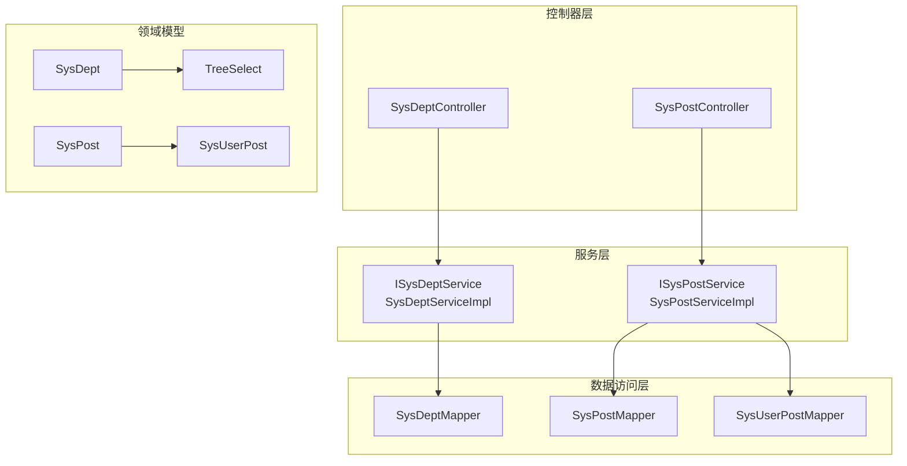
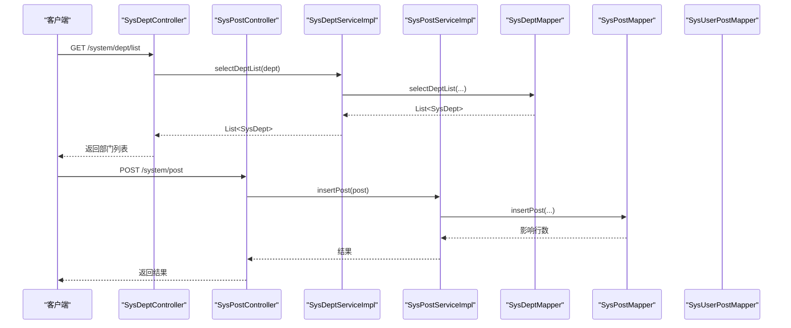
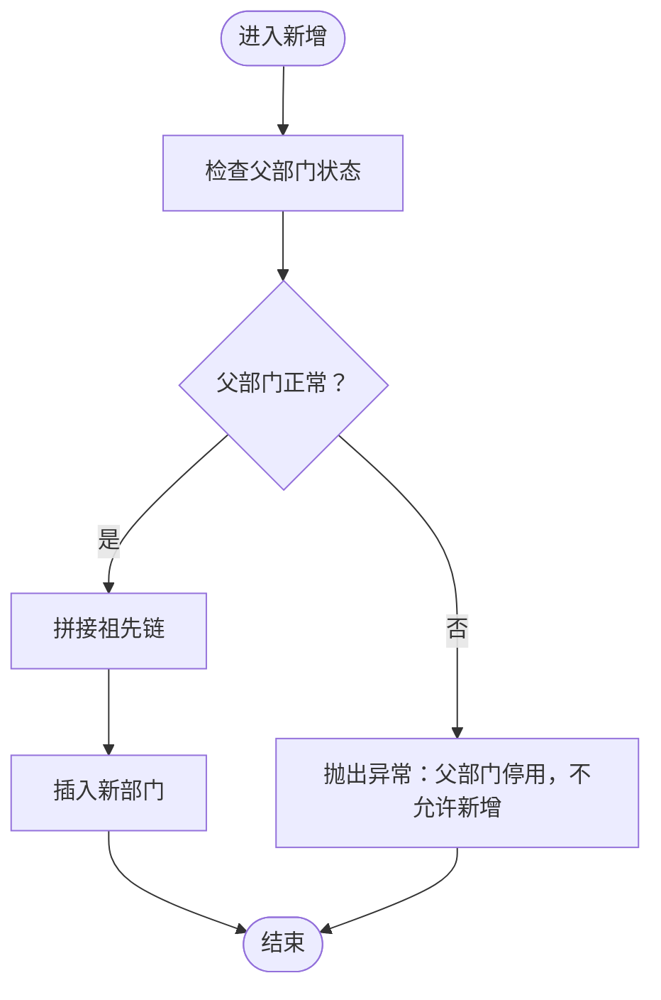
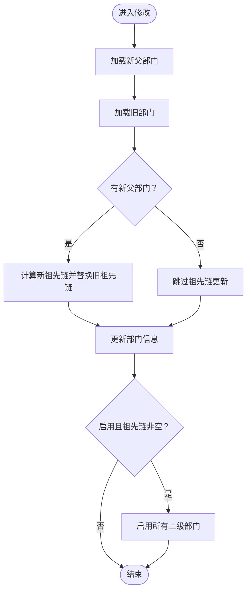
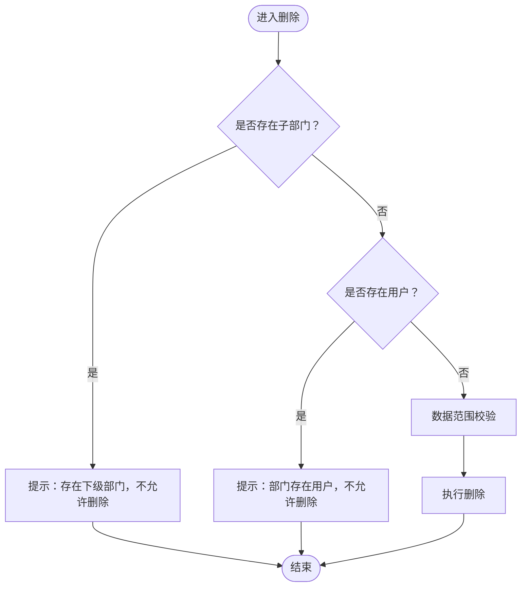
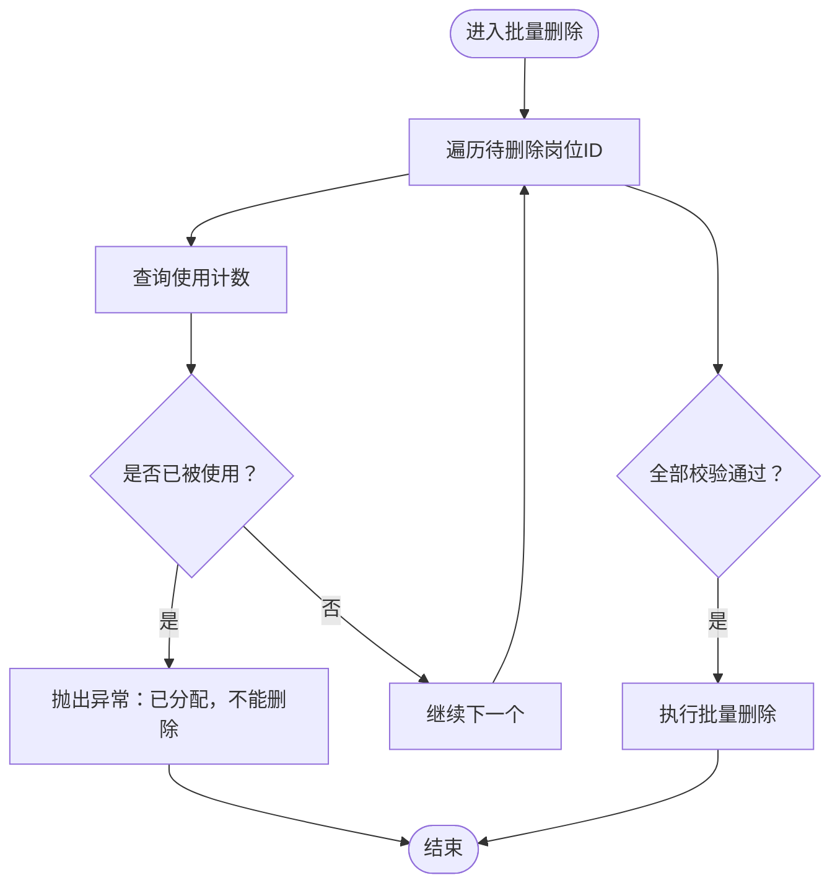
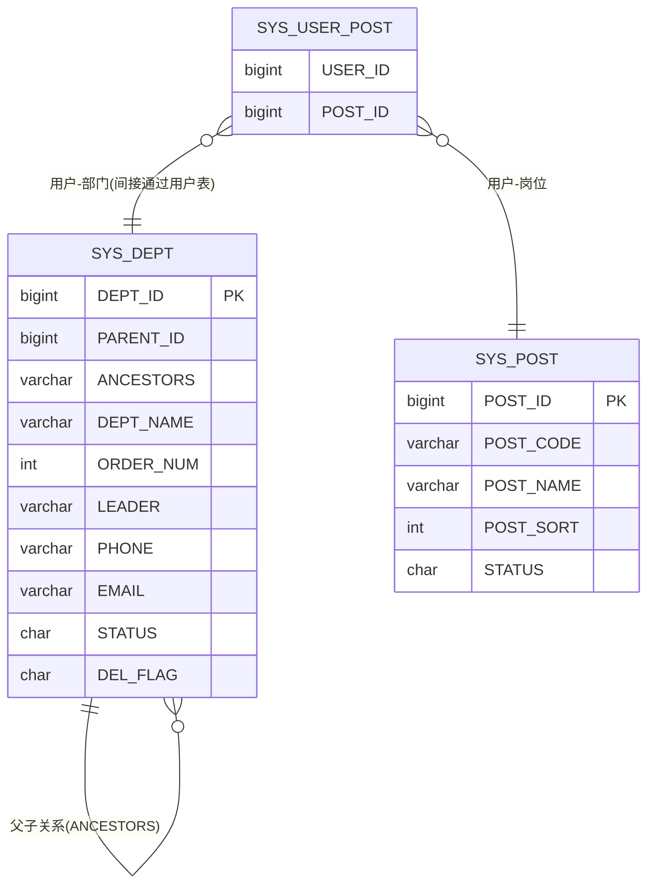
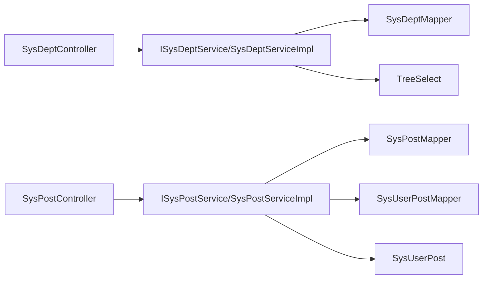

# 部门岗位管理

<cite>
**本文引用的文件**
- [SysDept.java](file://blog-common/src/main/java/blog/common/core/domain/entity/SysDept.java)
- [SysPost.java](file://blog-system/src/main/java/blog/system/domain/SysPost.java)
- [ISysDeptService.java](file://blog-system/src/main/java/blog/system/service/ISysDeptService.java)
- [ISysPostService.java](file://blog-system/src/main/java/blog/system/service/ISysPostService.java)
- [SysDeptServiceImpl.java](file://blog-system/src/main/java/blog/system/service/impl/SysDeptServiceImpl.java)
- [SysPostServiceImpl.java](file://blog-system/src/main/java/blog/system/service/impl/SysPostServiceImpl.java)
- [SysDeptMapper.java](file://blog-system/src/main/java/blog/system/mapper/SysDeptMapper.java)
- [SysPostMapper.java](file://blog-system/src/main/java/blog/system/mapper/SysPostMapper.java)
- [SysUserPost.java](file://blog-system/src/main/java/blog/system/domain/SysUserPost.java)
- [SysUserPostMapper.java](file://blog-system/src/main/java/blog/system/mapper/SysUserPostMapper.java)
- [TreeSelect.java](file://blog-common/src/main/java/blog/common/core/domain/TreeSelect.java)
- [SysDeptController.java](file://blog-admin/src/main/java/blog/web/controller/system/SysDeptController.java)
- [SysPostController.java](file://blog-admin/src/main/java/blog/web/controller/system/SysPostController.java)
</cite>

## 目录
1. [简介](#简介)
2. [项目结构](#项目结构)
3. [核心组件](#核心组件)
4. [架构总览](#架构总览)
5. [详细组件分析](#详细组件分析)
6. [依赖分析](#依赖分析)
7. [性能考虑](#性能考虑)
8. [故障排查指南](#故障排查指南)
9. [结论](#结论)
10. [附录：组织架构配置示例与使用指南](#附录组织架构配置示例与使用指南)

## 简介
本文件面向“部门岗位管理”功能，系统性阐述组织架构管理、人员岗位分配与权限范围控制的实现方式。重点覆盖以下方面：
- 实体设计：SysDept（部门）与SysPost（岗位）字段定义与约束
- 服务层逻辑：部门树构建、层级管理、人员统计、状态控制；岗位查询、分配、统计、状态管理
- 控制器接口：部门列表、树形结构、岗位列表、导出与分配管理等RESTful API
- 权限与数据范围：基于部门树的数据权限校验与范围控制
- 关系模型：用户-部门-岗位的关联与权限继承机制

## 项目结构
围绕部门岗位管理的关键模块分布如下：
- 控制器层：负责对外暴露REST API，进行参数校验与权限控制
- 服务层：封装业务逻辑，包括树形结构构建、数据范围校验、状态联动更新等
- 数据访问层：MyBatis Mapper接口，提供基础CRUD与组合查询
- 领域模型：SysDept、SysPost、TreeSelect、SysUserPost等
- 公共工具：权限注解、分页、响应封装等

图表来源
- [SysDeptController.java:1-119](file://blog-admin/src/main/java/blog/web/controller/system/SysDeptController.java#L1-L119)
- [SysPostController.java:1-117](file://blog-admin/src/main/java/blog/web/controller/system/SysPostController.java#L1-L117)
- [SysDeptServiceImpl.java:1-306](file://blog-system/src/main/java/blog/system/service/impl/SysDeptServiceImpl.java#L1-L306)
- [SysPostServiceImpl.java:1-165](file://blog-system/src/main/java/blog/system/service/impl/SysPostServiceImpl.java#L1-L165)
- [SysDeptMapper.java:1-120](file://blog-system/src/main/java/blog/system/mapper/SysDeptMapper.java#L1-L120)
- [SysPostMapper.java:1-101](file://blog-system/src/main/java/blog/system/mapper/SysPostMapper.java#L1-L101)
- [SysUserPostMapper.java:1-45](file://blog-system/src/main/java/blog/system/mapper/SysUserPostMapper.java#L1-L45)
- [SysDept.java:1-95](file://blog-common/src/main/java/blog/common/core/domain/entity/SysDept.java#L1-L95)
- [SysPost.java:1-126](file://blog-system/src/main/java/blog/system/domain/SysPost.java#L1-L126)
- [TreeSelect.java:1-91](file://blog-common/src/main/java/blog/common/core/domain/TreeSelect.java#L1-L91)

章节来源
- [SysDeptController.java:1-119](file://blog-admin/src/main/java/blog/web/controller/system/SysDeptController.java#L1-L119)
- [SysPostController.java:1-117](file://blog-admin/src/main/java/blog/web/controller/system/SysPostController.java#L1-L117)
- [SysDeptServiceImpl.java:1-306](file://blog-system/src/main/java/blog/system/service/impl/SysDeptServiceImpl.java#L1-L306)
- [SysPostServiceImpl.java:1-165](file://blog-system/src/main/java/blog/system/service/impl/SysPostServiceImpl.java#L1-L165)
- [SysDeptMapper.java:1-120](file://blog-system/src/main/java/blog/system/mapper/SysDeptMapper.java#L1-L120)
- [SysPostMapper.java:1-101](file://blog-system/src/main/java/blog/system/mapper/SysPostMapper.java#L1-L101)
- [SysUserPostMapper.java:1-45](file://blog-system/src/main/java/blog/system/mapper/SysUserPostMapper.java#L1-L45)
- [SysDept.java:1-95](file://blog-common/src/main/java/blog/common/core/domain/entity/SysDept.java#L1-L95)
- [SysPost.java:1-126](file://blog-system/src/main/java/blog/system/domain/SysPost.java#L1-L126)
- [TreeSelect.java:1-91](file://blog-common/src/main/java/blog/common/core/domain/TreeSelect.java#L1-L91)

## 核心组件
- 实体模型
  - SysDept：部门实体，包含部门标识、父级部门、祖先链、名称、显示顺序、负责人、电话、邮箱、状态、删除标记、父名称、子部门等字段
  - SysPost：岗位实体，包含岗位标识、岗位编码、岗位名称、排序、状态、标志位等字段
  - TreeSelect：树形选择结构，用于前端渲染部门/菜单树
  - SysUserPost：用户与岗位的多对多关联表
- 服务接口
  - ISysDeptService：部门查询、树构建、角色绑定、数据范围校验、新增/修改/删除
  - ISysPostService：岗位查询、全量列表、按用户筛选、唯一性校验、使用计数、新增/修改/删除
- 控制器接口
  - SysDeptController：部门列表、排除节点列表、详情、新增、修改、删除
  - SysPostController：岗位列表、导出、详情、新增、修改、批量删除、岗位选择框

章节来源
- [SysDept.java:1-95](file://blog-common/src/main/java/blog/common/core/domain/entity/SysDept.java#L1-L95)
- [SysPost.java:1-126](file://blog-system/src/main/java/blog/system/domain/SysPost.java#L1-L126)
- [TreeSelect.java:1-91](file://blog-common/src/main/java/blog/common/core/domain/TreeSelect.java#L1-L91)
- [SysUserPost.java:1-46](file://blog-system/src/main/java/blog/system/domain/SysUserPost.java#L1-L46)
- [ISysDeptService.java:1-126](file://blog-system/src/main/java/blog/system/service/ISysDeptService.java#L1-L126)
- [ISysPostService.java:1-101](file://blog-system/src/main/java/blog/system/service/ISysPostService.java#L1-L101)
- [SysDeptController.java:1-119](file://blog-admin/src/main/java/blog/web/controller/system/SysDeptController.java#L1-L119)
- [SysPostController.java:1-117](file://blog-admin/src/main/java/blog/web/controller/system/SysPostController.java#L1-L117)

## 架构总览
部门岗位管理遵循经典的分层架构：控制器负责请求接入与鉴权，服务层承载业务规则，数据访问层负责持久化，领域模型承载数据结构。

图表来源
- [SysDeptController.java:38-80](file://blog-admin/src/main/java/blog/web/controller/system/SysDeptController.java#L38-L80)
- [SysPostController.java:67-80](file://blog-admin/src/main/java/blog/web/controller/system/SysPostController.java#L67-L80)
- [SysDeptServiceImpl.java:45-49](file://blog-system/src/main/java/blog/system/service/impl/SysDeptServiceImpl.java#L45-L49)
- [SysPostServiceImpl.java:149-152](file://blog-system/src/main/java/blog/system/service/impl/SysPostServiceImpl.java#L149-L152)
- [SysDeptMapper.java:21](file://blog-system/src/main/java/blog/system/mapper/SysDeptMapper.java#L21)
- [SysPostMapper.java:83](file://blog-system/src/main/java/blog/system/mapper/SysPostMapper.java#L83)

## 详细组件分析

### 实体设计与字段说明

#### SysDept（部门实体）
- 字段要点
  - 部门标识：主键
  - 父部门标识：用于树形结构父子关系
  - 祖先链：逗号分隔的祖先ID序列，支持快速判断上下级关系
  - 名称与显示顺序：用于展示与排序
  - 负责人、电话、邮箱：联系信息
  - 状态：正常/停用
  - 删除标记：软删除标识
  - 父名称：用于前端展示
  - 子部门：树形结构的子节点集合
- 约束与校验
  - 名称非空且长度限制
  - 显示顺序非空
  - 电话长度限制
  - 邮箱格式校验

章节来源
- [SysDept.java:27-87](file://blog-common/src/main/java/blog/common/core/domain/entity/SysDept.java#L27-L87)

#### SysPost（岗位实体）
- 字段要点
  - 岗位标识：主键
  - 岗位编码：全局唯一性校验
  - 岗位名称：唯一性校验
  - 排序：用于展示顺序
  - 状态：正常/停用
  - 标志位：用于前端交互标记
- 约束与校验
  - 编码与名称非空且长度限制
  - 排序非空

章节来源
- [SysPost.java:21-100](file://blog-system/src/main/java/blog/system/domain/SysPost.java#L21-L100)

#### TreeSelect（树形选择）
- 作用：将SysDept转换为前端treeselect所需的{id,label,disabled,children}结构
- 关键点：禁用态由部门状态决定；子节点递归映射

章节来源
- [TreeSelect.java:46-51](file://blog-common/src/main/java/blog/common/core/domain/TreeSelect.java#L46-L51)

#### SysUserPost（用户-岗位关联）
- 作用：记录用户与岗位的多对多关系
- 字段：用户ID、岗位ID

章节来源
- [SysUserPost.java:11-20](file://blog-system/src/main/java/blog/system/domain/SysUserPost.java#L11-L20)

### 服务层业务逻辑

#### 部门服务层（ISysDeptService 与 SysDeptServiceImpl）
- 核心能力
  - 部门列表查询：支持数据范围注解，自动过滤可见范围
  - 部门树构建：从扁平列表生成树形结构，支持下拉树Select
  - 角色绑定：根据角色ID与严格模式返回可选部门集合
  - 数据范围校验：非管理员需满足可访问的部门范围
  - 新增/修改/删除：新增时校验父部门状态并维护祖先链；修改时联动更新子部门祖先链与状态；删除前校验是否存在子部门与用户
  - 统计与校验：统计正常子部门数量、是否存在用户、名称唯一性、数据范围可用性
- 处理流程（新增部门）

图表来源
- [SysDeptServiceImpl.java:196-204](file://blog-system/src/main/java/blog/system/service/impl/SysDeptServiceImpl.java#L196-L204)

- 处理流程（修改部门）

图表来源
- [SysDeptServiceImpl.java:213-229](file://blog-system/src/main/java/blog/system/service/impl/SysDeptServiceImpl.java#L213-L229)
- [SysDeptServiceImpl.java:249-257](file://blog-system/src/main/java/blog/system/service/impl/SysDeptServiceImpl.java#L249-L257)
- [SysDeptServiceImpl.java:236-240](file://blog-system/src/main/java/blog/system/service/impl/SysDeptServiceImpl.java#L236-L240)

- 处理流程（删除部门）

图表来源
- [SysDeptServiceImpl.java:265-268](file://blog-system/src/main/java/blog/system/service/impl/SysDeptServiceImpl.java#L265-L268)
- [SysDeptController.java:108-117](file://blog-admin/src/main/java/blog/web/controller/system/SysDeptController.java#L108-L117)

章节来源
- [ISysDeptService.java:14-125](file://blog-system/src/main/java/blog/system/service/ISysDeptService.java#L14-L125)
- [SysDeptServiceImpl.java:45-306](file://blog-system/src/main/java/blog/system/service/impl/SysDeptServiceImpl.java#L45-L306)
- [SysDeptController.java:38-117](file://blog-admin/src/main/java/blog/web/controller/system/SysDeptController.java#L38-L117)

#### 岗位服务层（ISysPostService 与 SysPostServiceImpl）
- 核心能力
  - 岗位查询：支持条件查询、全量查询、按用户筛选
  - 唯一性校验：名称与编码唯一性
  - 使用计数：统计某岗位被用户使用的次数
  - 批量删除：删除前校验是否已被使用
  - 新增/修改：写入创建/更新人信息
- 处理流程（批量删除岗位）

图表来源
- [SysPostServiceImpl.java:132-141](file://blog-system/src/main/java/blog/system/service/impl/SysPostServiceImpl.java#L132-L141)

章节来源
- [ISysPostService.java:13-100](file://blog-system/src/main/java/blog/system/service/ISysPostService.java#L13-L100)
- [SysPostServiceImpl.java:35-165](file://blog-system/src/main/java/blog/system/service/impl/SysPostServiceImpl.java#L35-L165)
- [SysPostController.java:101-106](file://blog-admin/src/main/java/blog/web/controller/system/SysPostController.java#L101-L106)

### 控制器接口设计

#### 部门控制器（SysDeptController）
- 主要接口
  - GET /system/dept/list：部门列表（支持数据范围过滤）
  - GET /system/dept/list/exclude/{deptId}：排除自身与子孙的部门列表
  - GET /system/dept/{deptId}：部门详情（数据范围校验）
  - POST /system/dept：新增部门（名称唯一性校验）
  - PUT /system/dept：修改部门（名称唯一性、自引用、停用约束、数据范围校验）
  - DELETE /system/dept/{deptId}：删除部门（子部门/用户存在性校验、数据范围校验）
- 权限注解
  - 使用@PreAuthorize配合权限表达式，确保操作粒度控制

章节来源
- [SysDeptController.java:38-117](file://blog-admin/src/main/java/blog/web/controller/system/SysDeptController.java#L38-L117)

#### 岗位控制器（SysPostController）
- 主要接口
  - GET /system/post/list：岗位列表（分页）
  - POST /system/post/export：导出岗位数据
  - GET /system/post/{postId}：岗位详情
  - POST /system/post：新增岗位（名称/编码唯一性校验）
  - PUT /system/post：修改岗位（名称/编码唯一性校验）
  - DELETE /system/post/{postIds}：批量删除岗位
  - GET /system/post/optionselect：岗位选择框列表
- 导出能力
  - 使用ExcelUtil导出岗位数据

章节来源
- [SysPostController.java:38-116](file://blog-admin/src/main/java/blog/web/controller/system/SysPostController.java#L38-L116)

### 数据模型与关系图

图表来源
- [SysDept.java:30-82](file://blog-common/src/main/java/blog/common/core/domain/entity/SysDept.java#L30-L82)
- [SysPost.java:24-50](file://blog-system/src/main/java/blog/system/domain/SysPost.java#L24-L50)
- [SysUserPost.java:14-20](file://blog-system/src/main/java/blog/system/domain/SysUserPost.java#L14-L20)

## 依赖分析
- 控制器依赖服务接口，服务实现依赖Mapper与工具类
- 部门服务通过数据范围注解与工具类实现权限过滤
- 岗位服务通过用户-岗位Mapper实现使用计数与批量删除前置校验
- TreeSelect作为视图模型，将SysDept转换为前端树形结构

图表来源
- [SysDeptController.java:34-35](file://blog-admin/src/main/java/blog/web/controller/system/SysDeptController.java#L34-L35)
- [SysPostController.java:35-36](file://blog-admin/src/main/java/blog/web/controller/system/SysPostController.java#L35-L36)
- [SysDeptServiceImpl.java:33-37](file://blog-system/src/main/java/blog/system/service/impl/SysDeptServiceImpl.java#L33-L37)
- [SysPostServiceImpl.java:23-27](file://blog-system/src/main/java/blog/system/service/impl/SysPostServiceImpl.java#L23-L27)
- [TreeSelect.java:46-51](file://blog-common/src/main/java/blog/common/core/domain/TreeSelect.java#L46-L51)
- [SysUserPost.java:14-20](file://blog-system/src/main/java/blog/system/domain/SysUserPost.java#L14-L20)

章节来源
- [SysDeptController.java:34-35](file://blog-admin/src/main/java/blog/web/controller/system/SysDeptController.java#L34-L35)
- [SysPostController.java:35-36](file://blog-admin/src/main/java/blog/web/controller/system/SysPostController.java#L35-L36)
- [SysDeptServiceImpl.java:33-37](file://blog-system/src/main/java/blog/system/service/impl/SysDeptServiceImpl.java#L33-L37)
- [SysPostServiceImpl.java:23-27](file://blog-system/src/main/java/blog/system/service/impl/SysPostServiceImpl.java#L23-L27)
- [TreeSelect.java:46-51](file://blog-common/src/main/java/blog/common/core/domain/TreeSelect.java#L46-L51)
- [SysUserPost.java:14-20](file://blog-system/src/main/java/blog/system/domain/SysUserPost.java#L14-L20)

## 性能考虑
- 树形构建
  - 采用一次查询后在内存中构建树，避免N+1查询；注意数据量较大时的内存占用
- 数据范围过滤
  - 通过注解与Mapper条件过滤，减少不必要的数据传输
- 批量操作
  - 批量删除岗位时逐条校验使用计数，建议在数据库层面优化或分批处理
- 祖先链维护
  - 修改父级时批量更新子部门祖先链，注意事务与锁竞争

## 故障排查指南
- 新增部门失败
  - 检查父部门状态是否为“正常”
  - 检查部门名称是否重复
- 修改部门失败
  - 检查是否将上级部门设为自己
  - 检查停用状态是否影响了仍存在的子部门
- 删除部门失败
  - 检查是否存在下级部门或用户
  - 检查当前登录用户是否具备数据范围权限
- 批量删除岗位失败
  - 检查岗位是否已被用户使用
- 导出岗位失败
  - 检查ExcelUtil与响应头设置

章节来源
- [SysDeptController.java:74-117](file://blog-admin/src/main/java/blog/web/controller/system/SysDeptController.java#L74-L117)
- [SysPostController.java:67-106](file://blog-admin/src/main/java/blog/web/controller/system/SysPostController.java#L67-L106)
- [SysPostServiceImpl.java:132-141](file://blog-system/src/main/java/blog/system/service/impl/SysPostServiceImpl.java#L132-L141)

## 结论
本方案以清晰的分层架构实现了灵活的组织管理能力：部门树形结构、层级状态联动、数据范围控制与岗位分配统计。通过严格的唯一性校验与删除前置检查，保障了数据一致性与业务合规性。结合控制器的权限注解与服务层的数据范围过滤，形成了完善的权限边界。

## 附录：组织架构配置示例与使用指南

- 配置步骤
  - 新增根部门：调用POST /system/dept，父部门ID留空或为0
  - 新增子部门：调用POST /system/dept，设置父部门ID
  - 调整部门层级：PUT /system/dept，修改parentId并观察祖先链变化
  - 岗位配置：POST /system/post新增岗位，使用编码与名称唯一性校验
  - 用户岗位分配：通过用户管理模块为用户绑定岗位（涉及SysUserPost）
  - 数据范围控制：非管理员仅能访问其可授权范围内的部门数据

- 常见场景
  - 停用部门：将部门状态置为停用，系统会阻止新增子节点；若需恢复，需先启用上级部门
  - 删除岗位：若岗位已被用户使用，需先解除用户绑定再删除
  - 导出岗位：使用POST /system/post/export导出当前筛选条件下的岗位数据

- 注意事项
  - 祖先链维护：修改父部门后，子部门的祖先链会批量更新，确保树结构一致
  - 数据范围：非管理员用户只能看到其可访问的部门树，避免越权访问
  - 唯一性：部门名称在同一父级下唯一；岗位名称与编码均需唯一

章节来源
- [SysDeptController.java:38-117](file://blog-admin/src/main/java/blog/web/controller/system/SysDeptController.java#L38-L117)
- [SysPostController.java:38-116](file://blog-admin/src/main/java/blog/web/controller/system/SysPostController.java#L38-L116)
- [SysDeptServiceImpl.java:196-229](file://blog-system/src/main/java/blog/system/service/impl/SysDeptServiceImpl.java#L196-L229)
- [SysPostServiceImpl.java:132-141](file://blog-system/src/main/java/blog/system/service/impl/SysPostServiceImpl.java#L132-L141)