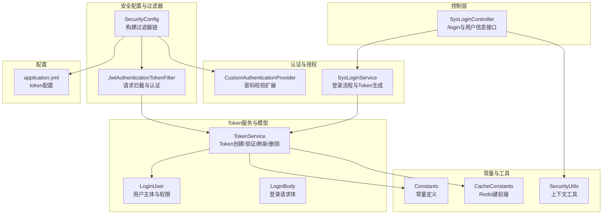
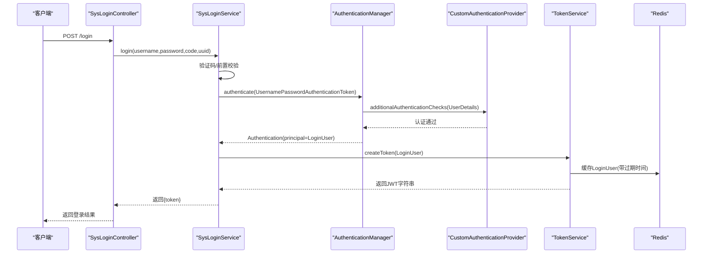
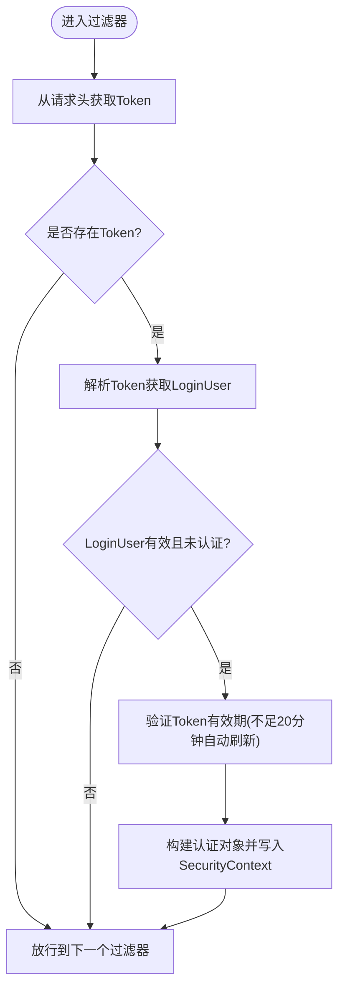
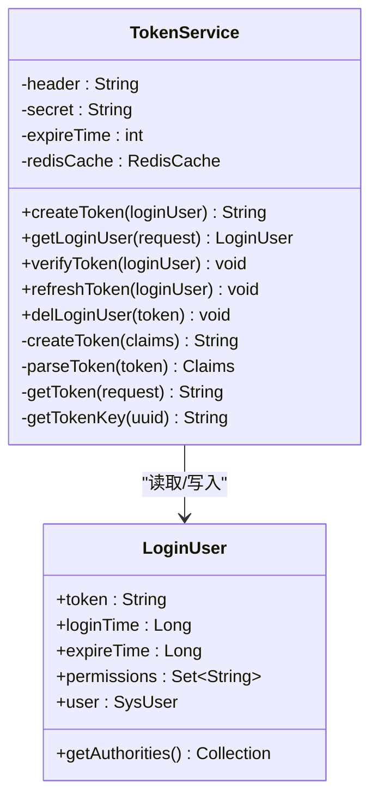
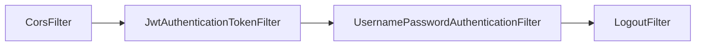
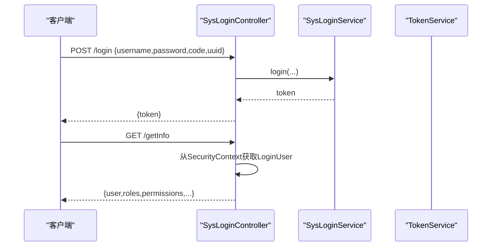
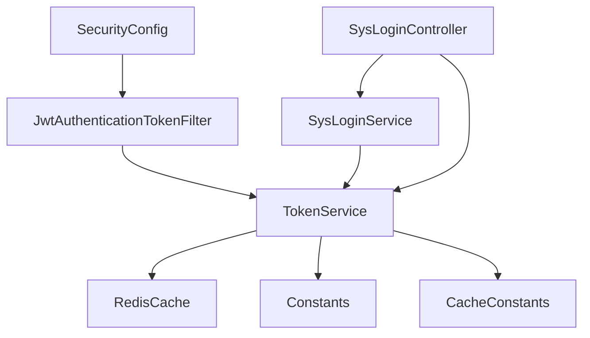

# JWT认证机制

<cite>
**本文引用的文件**
- [JwtAuthenticationTokenFilter.java](file://blog-framework/src/main/java/blog/framework/security/filter/JwtAuthenticationTokenFilter.java)
- [TokenService.java](file://blog-framework/src/main/java/blog/framework/web/service/TokenService.java)
- [SecurityConfig.java](file://blog-framework/src/main/java/blog/framework/config/SecurityConfig.java)
- [SysLoginController.java](file://blog-admin/src/main/java/blog/web/controller/system/SysLoginController.java)
- [SysLoginService.java](file://blog-framework/src/main/java/blog/framework/web/service/SysLoginService.java)
- [CustomAuthenticationProvider.java](file://blog-framework/src/main/java/blog/framework/security/provider/CustomAuthenticationProvider.java)
- [LoginUser.java](file://blog-common/src/main/java/blog/common/core/domain/model/LoginUser.java)
- [LoginBody.java](file://blog-common/src/main/java/blog/common/core/domain/model/LoginBody.java)
- [Constants.java](file://blog-common/src/main/java/blog/common/constant/Constants.java)
- [CacheConstants.java](file://blog-common/src/main/java/blog/common/constant/CacheConstants.java)
- [SecurityUtils.java](file://blog-common/src/main/java/blog/common/utils/SecurityUtils.java)
- [application.yml](file://blog-admin/src/main/resources/application.yml)
</cite>

## 目录
1. [简介](#简介)
2. [项目结构](#项目结构)
3. [核心组件](#核心组件)
4. [架构总览](#架构总览)
5. [详细组件分析](#详细组件分析)
6. [依赖分析](#依赖分析)
7. [性能考虑](#性能考虑)
8. [故障排查指南](#故障排查指南)
9. [结论](#结论)
10. [附录](#附录)

## 简介
本文件系统性阐述本项目的JWT认证机制，覆盖以下要点：
- JWT工作原理与结构组成（头部、载荷、签名）
- 从身份验证成功到Token签发的完整流程
- Token验证机制（签名验证、过期检查、负载解析）
- JwtAuthenticationTokenFilter的实现原理与请求拦截流程
- TokenService的服务方法与Redis存储策略
- 在Spring Security中的集成方式与过滤器链顺序
- 安全最佳实践（过期时间、刷新策略、存储方式）

## 项目结构
围绕JWT认证的关键模块分布如下：
- 安全配置与过滤器链：SecurityConfig、JwtAuthenticationTokenFilter
- 认证与授权：CustomAuthenticationProvider、SysLoginService
- Token服务与模型：TokenService、LoginUser、LoginBody
- 常量与工具：Constants、CacheConstants、SecurityUtils
- 控制层入口：SysLoginController
- 配置文件：application.yml

图表来源
- [SecurityConfig.java:94-126](file://blog-framework/src/main/java/blog/framework/config/SecurityConfig.java#L94-L126)
- [JwtAuthenticationTokenFilter.java:27-49](file://blog-framework/src/main/java/blog/framework/security/filter/JwtAuthenticationTokenFilter.java#L27-L49)
- [SysLoginService.java:62-98](file://blog-framework/src/main/java/blog/framework/web/service/SysLoginService.java#L62-L98)
- [TokenService.java:105-142](file://blog-framework/src/main/java/blog/framework/web/service/TokenService.java#L105-L142)
- [SysLoginController.java:56-64](file://blog-admin/src/main/java/blog/web/controller/system/SysLoginController.java#L56-L64)
- [Constants.java:104-121](file://blog-common/src/main/java/blog/common/constant/Constants.java#L104-L121)
- [CacheConstants.java:12](file://blog-common/src/main/java/blog/common/constant/CacheConstants.java#L12)
- [SecurityUtils.java:60-73](file://blog-common/src/main/java/blog/common/utils/SecurityUtils.java#L60-L73)
- [application.yml:90-98](file://blog-admin/src/main/resources/application.yml#L90-L98)

章节来源
- [SecurityConfig.java:94-126](file://blog-framework/src/main/java/blog/framework/config/SecurityConfig.java#L94-L126)
- [JwtAuthenticationTokenFilter.java:27-49](file://blog-framework/src/main/java/blog/framework/security/filter/JwtAuthenticationTokenFilter.java#L27-L49)
- [SysLoginService.java:62-98](file://blog-framework/src/main/java/blog/framework/web/service/SysLoginService.java#L62-L98)
- [TokenService.java:105-142](file://blog-framework/src/main/java/blog/framework/web/service/TokenService.java#L105-L142)
- [SysLoginController.java:56-64](file://blog-admin/src/main/java/blog/web/controller/system/SysLoginController.java#L56-L64)
- [Constants.java:104-121](file://blog-common/src/main/java/blog/common/constant/Constants.java#L104-L121)
- [CacheConstants.java:12](file://blog-common/src/main/java/blog/common/constant/CacheConstants.java#L12)
- [SecurityUtils.java:60-73](file://blog-common/src/main/java/blog/common/utils/SecurityUtils.java#L60-L73)
- [application.yml:90-98](file://blog-admin/src/main/resources/application.yml#L90-L98)

## 核心组件
- JwtAuthenticationTokenFilter：在请求进入时从请求头提取Token，解析并验证，将认证信息写入SecurityContext，供后续业务使用。
- TokenService：负责Token的创建、解析、签名验证、过期检查与自动刷新、用户信息缓存（Redis）。
- SecurityConfig：定义过滤器链顺序、匿名放行URL、基于Token的无状态会话策略、异常处理与登出处理。
- SysLoginService：整合验证码校验、前置校验、Spring Security认证流程、记录登录日志与生成Token。
- SysLoginController：对外暴露登录接口与用户信息查询接口，返回Token与用户基础信息。
- LoginUser：承载用户主体、权限、登录设备信息与Token生命周期。
- Constants/CacheConstants：统一管理Token相关常量与Redis键前缀。
- SecurityUtils：从SecurityContext中便捷获取当前登录用户信息。

章节来源
- [JwtAuthenticationTokenFilter.java:27-49](file://blog-framework/src/main/java/blog/framework/security/filter/JwtAuthenticationTokenFilter.java#L27-L49)
- [TokenService.java:105-142](file://blog-framework/src/main/java/blog/framework/web/service/TokenService.java#L105-L142)
- [SecurityConfig.java:94-126](file://blog-framework/src/main/java/blog/framework/config/SecurityConfig.java#L94-L126)
- [SysLoginService.java:62-98](file://blog-framework/src/main/java/blog/framework/web/service/SysLoginService.java#L62-L98)
- [SysLoginController.java:56-64](file://blog-admin/src/main/java/blog/web/controller/system/SysLoginController.java#L56-L64)
- [LoginUser.java:16-235](file://blog-common/src/main/java/blog/common/core/domain/model/LoginUser.java#L16-L235)
- [Constants.java:104-121](file://blog-common/src/main/java/blog/common/constant/Constants.java#L104-L121)
- [CacheConstants.java:12](file://blog-common/src/main/java/blog/common/constant/CacheConstants.java#L12)
- [SecurityUtils.java:60-73](file://blog-common/src/main/java/blog/common/utils/SecurityUtils.java#L60-L73)

## 架构总览
JWT认证在本项目中的整体流程：
- 登录阶段：SysLoginController接收登录请求，SysLoginService完成验证码与前置校验后触发Spring Security认证；认证成功后由TokenService生成JWT并写入Redis缓存。
- 请求阶段：JwtAuthenticationTokenFilter在每个请求到达时提取请求头中的Token，解析并验证，若即将过期则刷新缓存，最后将认证信息写入SecurityContext，供后续业务与权限注解使用。

图表来源
- [SysLoginController.java:56-64](file://blog-admin/src/main/java/blog/web/controller/system/SysLoginController.java#L56-L64)
- [SysLoginService.java:62-98](file://blog-framework/src/main/java/blog/framework/web/service/SysLoginService.java#L62-L98)
- [CustomAuthenticationProvider.java:51-57](file://blog-framework/src/main/java/blog/framework/security/provider/CustomAuthenticationProvider.java#L51-L57)
- [TokenService.java:105-115](file://blog-framework/src/main/java/blog/framework/web/service/TokenService.java#L105-L115)
- [CacheConstants.java:12](file://blog-common/src/main/java/blog/common/constant/CacheConstants.java#L12)

## 详细组件分析

### JwtAuthenticationTokenFilter 分析
职责与流程：
- 从请求头读取Token（支持前缀替换）
- 调用TokenService解析并获取LoginUser
- 若尚未认证且LoginUser有效，调用TokenService验证有效期（不足20分钟自动刷新）
- 构造UsernamePasswordAuthenticationToken并写入SecurityContext

图表来源
- [JwtAuthenticationTokenFilter.java:38-49](file://blog-framework/src/main/java/blog/framework/security/filter/JwtAuthenticationTokenFilter.java#L38-L49)
- [TokenService.java:62-78](file://blog-framework/src/main/java/blog/framework/web/service/TokenService.java#L62-L78)
- [TokenService.java:123-129](file://blog-framework/src/main/java/blog/framework/web/service/TokenService.java#L123-L129)

章节来源
- [JwtAuthenticationTokenFilter.java:27-49](file://blog-framework/src/main/java/blog/framework/security/filter/JwtAuthenticationTokenFilter.java#L27-L49)
- [TokenService.java:62-78](file://blog-framework/src/main/java/blog/framework/web/service/TokenService.java#L62-L78)
- [TokenService.java:123-129](file://blog-framework/src/main/java/blog/framework/web/service/TokenService.java#L123-L129)

### TokenService 分析
核心能力：
- 创建Token：生成UUID作为token标识，填充用户代理信息，写入Redis缓存，构造JWT载荷并签名。
- 解析与验证：从请求头提取Token，解析Claims，根据login_user_key从Redis获取LoginUser，验证签名与有效期。
- 刷新策略：当距离过期时间小于20分钟时自动刷新Redis缓存。
- 删除：按token删除Redis中的用户缓存。

图表来源
- [TokenService.java:32-212](file://blog-framework/src/main/java/blog/framework/web/service/TokenService.java#L32-L212)
- [LoginUser.java:16-235](file://blog-common/src/main/java/blog/common/core/domain/model/LoginUser.java#L16-L235)

章节来源
- [TokenService.java:105-142](file://blog-framework/src/main/java/blog/framework/web/service/TokenService.java#L105-L142)
- [TokenService.java:164-182](file://blog-framework/src/main/java/blog/framework/web/service/TokenService.java#L164-L182)
- [TokenService.java:201-207](file://blog-framework/src/main/java/blog/framework/web/service/TokenService.java#L201-L207)
- [CacheConstants.java:12](file://blog-common/src/main/java/blog/common/constant/CacheConstants.java#L12)

### SecurityConfig 与过滤器链
- 禁用CSRF与HSTS等头部
- 无状态会话（STATELESS）
- 允许匿名访问的URL列表
- 过滤器顺序：CorsFilter → JwtAuthenticationTokenFilter → UsernamePasswordAuthenticationFilter → LogoutFilter
- 异常处理与登出处理器

图表来源
- [SecurityConfig.java:94-126](file://blog-framework/src/main/java/blog/framework/config/SecurityConfig.java#L94-L126)

章节来源
- [SecurityConfig.java:94-126](file://blog-framework/src/main/java/blog/framework/config/SecurityConfig.java#L94-L126)

### 登录流程与控制器
- SysLoginController暴露POST /login，返回token
- SysLoginController提供GET /getInfo，返回用户信息、角色与权限
- SysLoginService完成验证码校验、前置校验、Spring Security认证与Token生成

图表来源
- [SysLoginController.java:56-64](file://blog-admin/src/main/java/blog/web/controller/system/SysLoginController.java#L56-L64)
- [SysLoginController.java:71-90](file://blog-admin/src/main/java/blog/web/controller/system/SysLoginController.java#L71-L90)
- [SysLoginService.java:62-98](file://blog-framework/src/main/java/blog/framework/web/service/SysLoginService.java#L62-L98)

章节来源
- [SysLoginController.java:56-64](file://blog-admin/src/main/java/blog/web/controller/system/SysLoginController.java#L56-L64)
- [SysLoginController.java:71-90](file://blog-admin/src/main/java/blog/web/controller/system/SysLoginController.java#L71-L90)
- [SysLoginService.java:62-98](file://blog-framework/src/main/java/blog/framework/web/service/SysLoginService.java#L62-L98)

### 认证提供者扩展
- CustomAuthenticationProvider继承DaoAuthenticationProvider，重写additionalAuthenticationChecks以接入密码服务与登录失败次数检查

章节来源
- [CustomAuthenticationProvider.java:51-57](file://blog-framework/src/main/java/blog/framework/security/provider/CustomAuthenticationProvider.java#L51-L57)

## 依赖分析
- JwtAuthenticationTokenFilter依赖TokenService进行Token解析与验证
- SysLoginService依赖AuthenticationManager与TokenService完成认证与Token生成
- TokenService依赖RedisCache与Constants/CacheConstants进行缓存与键管理
- SysLoginController依赖SysLoginService与TokenService提供REST接口
- SecurityConfig装配JwtAuthenticationTokenFilter并定义过滤器链顺序

图表来源
- [JwtAuthenticationTokenFilter.java:29](file://blog-framework/src/main/java/blog/framework/security/filter/JwtAuthenticationTokenFilter.java#L29)
- [TokenService.java:55](file://blog-framework/src/main/java/blog/framework/web/service/TokenService.java#L55)
- [SysLoginService.java:39](file://blog-framework/src/main/java/blog/framework/web/service/SysLoginService.java#L39)
- [SysLoginController.java:45](file://blog-admin/src/main/java/blog/web/controller/system/SysLoginController.java#L45)
- [SecurityConfig.java:50](file://blog-framework/src/main/java/blog/framework/config/SecurityConfig.java#L50)

章节来源
- [JwtAuthenticationTokenFilter.java:29](file://blog-framework/src/main/java/blog/framework/security/filter/JwtAuthenticationTokenFilter.java#L29)
- [TokenService.java:55](file://blog-framework/src/main/java/blog/framework/web/service/TokenService.java#L55)
- [SysLoginService.java:39](file://blog-framework/src/main/java/blog/framework/web/service/SysLoginService.java#L39)
- [SysLoginController.java:45](file://blog-admin/src/main/java/blog/web/controller/system/SysLoginController.java#L45)
- [SecurityConfig.java:50](file://blog-framework/src/main/java/blog/framework/config/SecurityConfig.java#L50)

## 性能考虑
- Token解析与Redis访问：TokenService在每次请求都会解析JWT并访问Redis获取LoginUser，建议合理设置Redis连接池与超时时间，避免热点Key抖动。
- 过期刷新策略：当剩余有效期小于20分钟时自动刷新，减少频繁过期导致的重认证开销。
- 无状态会话：禁用Session，降低服务器内存占用，提升横向扩展能力。
- 过滤器链顺序：将JwtAuthenticationTokenFilter置于UsernamePasswordAuthenticationFilter之前，确保在认证前完成Token解析与上下文注入。

## 故障排查指南
- Token无效或解析异常：检查application.yml中的token.secret与token.header配置，确认请求头是否正确携带Token及前缀。
- 未认证或SecurityContext为空：确认JwtAuthenticationTokenFilter是否被正确装配到SecurityConfig的过滤器链中。
- Redis连接问题：检查Redis连接参数与密码，确认缓存键前缀与过期时间配置一致。
- 登录失败：查看SysLoginService的异常分支与日志记录，定位验证码、前置校验或密码校验环节的问题。

章节来源
- [application.yml:90-98](file://blog-admin/src/main/resources/application.yml#L90-L98)
- [SecurityConfig.java:121-126](file://blog-framework/src/main/java/blog/framework/config/SecurityConfig.java#L121-L126)
- [TokenService.java:62-78](file://blog-framework/src/main/java/blog/framework/web/service/TokenService.java#L62-L78)
- [SysLoginService.java:79-89](file://blog-framework/src/main/java/blog/framework/web/service/SysLoginService.java#L79-L89)

## 结论
本项目采用Spring Security + JWT + Redis的认证方案，通过JwtAuthenticationTokenFilter在请求阶段自动解析与验证Token，并将认证信息写入SecurityContext，配合基于注解的权限控制实现细粒度的安全策略。TokenService承担了JWT的生成、解析、签名验证与Redis缓存管理，结合合理的过期刷新策略与无状态会话设计，兼顾了安全性与性能。

## 附录

### JWT结构与生成流程
- 结构组成：头部（Header）、载荷（Payload）、签名（Signature）
- 生成流程：登录成功后，服务端生成UUID作为token标识，填充用户代理信息，将LoginUser写入Redis并设置过期时间，随后构造JWT载荷（包含login_user_key与用户名），使用HS512算法与密钥签名生成JWT字符串返回给客户端。

章节来源
- [TokenService.java:105-115](file://blog-framework/src/main/java/blog/framework/web/service/TokenService.java#L105-L115)
- [TokenService.java:164-169](file://blog-framework/src/main/java/blog/framework/web/service/TokenService.java#L164-L169)
- [CacheConstants.java:12](file://blog-common/src/main/java/blog/common/constant/CacheConstants.java#L12)

### Token验证机制
- 签名验证：使用配置的secret与HS512算法解析JWT并验证签名
- 过期检查：比较当前时间与LoginUser.expireTime，不足20分钟自动刷新
- 载荷解析：从Claims中提取login_user_key，拼接Redis键获取LoginUser

章节来源
- [TokenService.java:177-182](file://blog-framework/src/main/java/blog/framework/web/service/TokenService.java#L177-L182)
- [TokenService.java:123-129](file://blog-framework/src/main/java/blog/framework/web/service/TokenService.java#L123-L129)
- [TokenService.java:69-71](file://blog-framework/src/main/java/blog/framework/web/service/TokenService.java#L69-L71)

### Spring Security集成要点
- 过滤器链顺序：CorsFilter → JwtAuthenticationTokenFilter → UsernamePasswordAuthenticationFilter → LogoutFilter
- 无状态会话：SessionCreationPolicy.STATELESS
- 异常处理：AuthenticationEntryPointImpl
- 登出处理：LogoutSuccessHandlerImpl

章节来源
- [SecurityConfig.java:94-126](file://blog-framework/src/main/java/blog/framework/config/SecurityConfig.java#L94-L126)

### 配置项参考
- token.header：请求头名称（默认Authorization）
- token.secret：JWT签名密钥
- token.expireTime：Token有效期（分钟，默认较大值）

章节来源
- [application.yml:90-98](file://blog-admin/src/main/resources/application.yml#L90-L98)