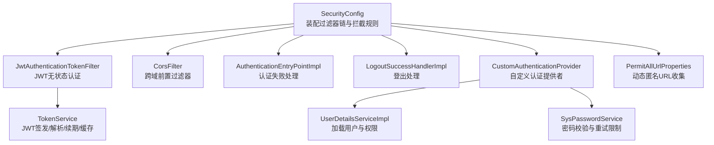
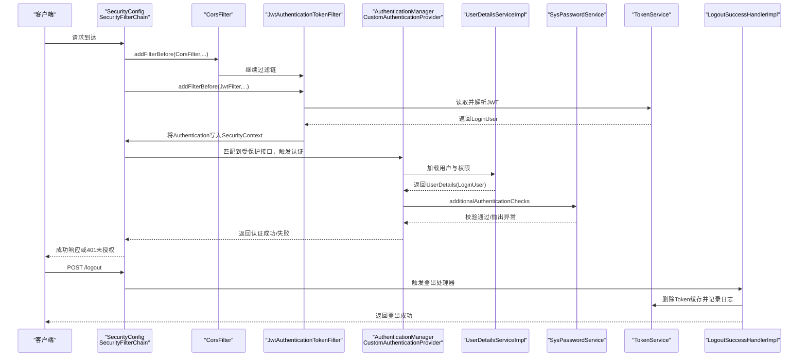
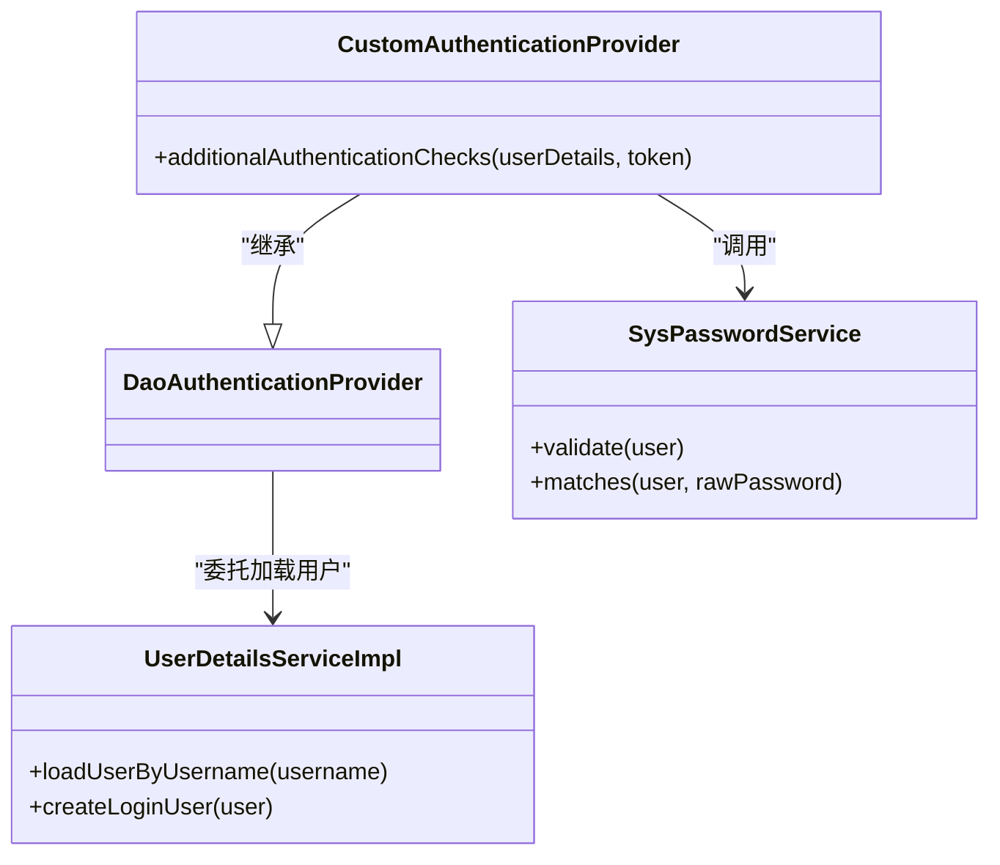
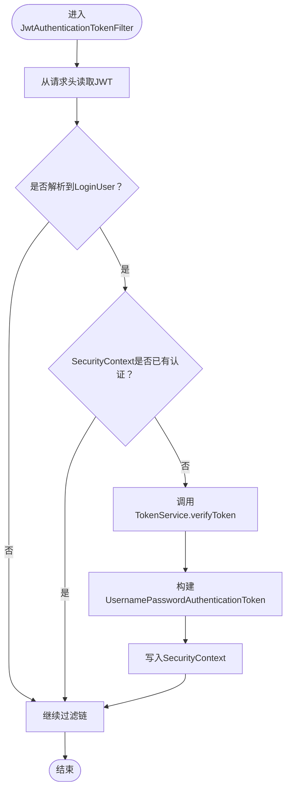
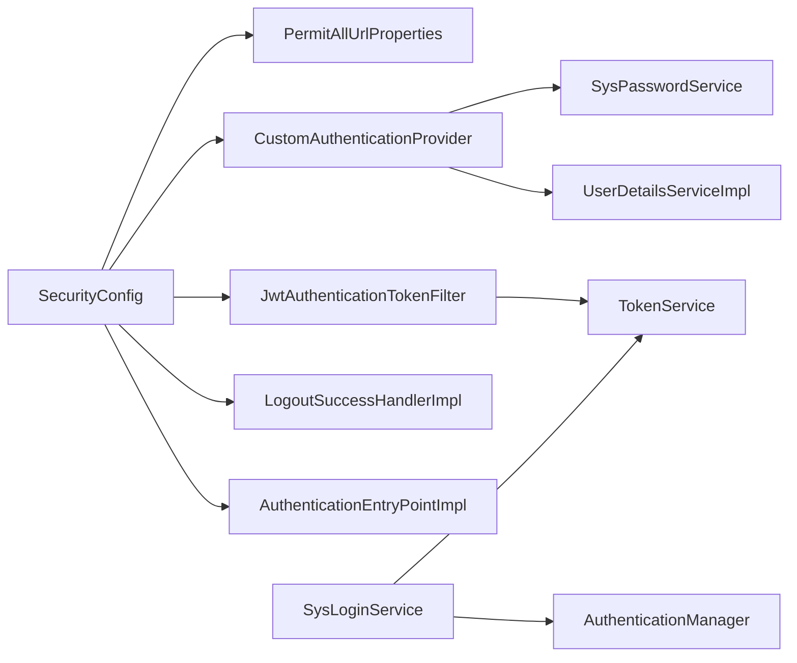

# Spring Security配置

<cite>
**本文引用的文件**
- [SecurityConfig.java](file://blog-framework/src/main/java/blog/framework/config/SecurityConfig.java)
- [CustomAuthenticationProvider.java](file://blog-framework/src/main/java/blog/framework/security/provider/CustomAuthenticationProvider.java)
- [AuthenticationEntryPointImpl.java](file://blog-framework/src/main/java/blog/framework/security/handle/AuthenticationEntryPointImpl.java)
- [LogoutSuccessHandlerImpl.java](file://blog-framework/src/main/java/blog/framework/security/handle/LogoutSuccessHandlerImpl.java)
- [JwtAuthenticationTokenFilter.java](file://blog-framework/src/main/java/blog/framework/security/filter/JwtAuthenticationTokenFilter.java)
- [PermitAllUrlProperties.java](file://blog-framework/src/main/java/blog/framework/config/properties/PermitAllUrlProperties.java)
- [TokenService.java](file://blog-framework/src/main/java/blog/framework/web/service/TokenService.java)
- [SysPasswordService.java](file://blog-framework/src/main/java/blog/framework/web/service/SysPasswordService.java)
- [UserDetailsServiceImpl.java](file://blog-framework/src/main/java/blog/framework/web/service/UserDetailsServiceImpl.java)
- [SysLoginService.java](file://blog-framework/src/main/java/blog/framework/web/service/SysLoginService.java)
- [Anonymous.java](file://blog-common/src/main/java/blog/common/annotation/Anonymous.java)
- [application.yml](file://blog-admin/src/main/resources/application.yml)
</cite>

## 目录
1. [简介](#简介)
2. [项目结构](#项目结构)
3. [核心组件](#核心组件)
4. [架构总览](#架构总览)
5. [详细组件分析](#详细组件分析)
6. [依赖关系分析](#依赖关系分析)
7. [性能与安全考量](#性能与安全考量)
8. [故障排查指南](#故障排查指南)
9. [结论](#结论)
10. [附录：配置示例与最佳实践](#附录配置示例与最佳实践)

## 简介
本文件面向开发者，系统性解析本项目的Spring Security安全配置，重点覆盖：
- SecurityConfig的过滤器链构建与执行顺序
- CSRF禁用原因与无状态Session策略
- 权限拦截规则（匿名访问、静态资源放行、接口权限）
- 自定义认证提供者CustomAuthenticationProvider的职责与配置
- 异常处理AuthenticationEntryPointImpl与登出LogoutSuccessHandlerImpl
- JWT过滤器JwtAuthenticationTokenFilter的工作机制
- 配置示例与扩展建议

## 项目结构
围绕安全配置的关键模块分布如下：
- 配置层：SecurityConfig负责WebSecurity装配、过滤器链与拦截规则
- 认证层：CustomAuthenticationProvider扩展DaoAuthenticationProvider，加入密码校验与登录失败次数控制
- 过滤器层：JwtAuthenticationTokenFilter基于JWT进行无状态认证；CorsFilter在Security链前执行
- 处理层：AuthenticationEntryPointImpl统一认证失败返回；LogoutSuccessHandlerImpl统一登出返回
- 工具层：TokenService负责JWT签发、解析、续期与Redis缓存；PermitAllUrlProperties动态收集匿名接口
- 服务层：SysLoginService触发认证流程；UserDetailsServiceImpl加载用户与权限；SysPasswordService校验密码与重试限制

图表来源
- [SecurityConfig.java:94-127](file://blog-framework/src/main/java/blog/framework/config/SecurityConfig.java#L94-L127)
- [JwtAuthenticationTokenFilter.java:26-51](file://blog-framework/src/main/java/blog/framework/security/filter/JwtAuthenticationTokenFilter.java#L26-L51)
- [CustomAuthenticationProvider.java:24-60](file://blog-framework/src/main/java/blog/framework/security/provider/CustomAuthenticationProvider.java#L24-L60)
- [AuthenticationEntryPointImpl.java:22-34](file://blog-framework/src/main/java/blog/framework/security/handle/AuthenticationEntryPointImpl.java#L22-L34)
- [LogoutSuccessHandlerImpl.java:28-52](file://blog-framework/src/main/java/blog/framework/security/handle/LogoutSuccessHandlerImpl.java#L28-L52)
- [TokenService.java:32-213](file://blog-framework/src/main/java/blog/framework/web/service/TokenService.java#L32-L213)
- [PermitAllUrlProperties.java:27-77](file://blog-framework/src/main/java/blog/framework/config/properties/PermitAllUrlProperties.java#L27-L77)

章节来源
- [SecurityConfig.java:94-127](file://blog-framework/src/main/java/blog/framework/config/SecurityConfig.java#L94-L127)

## 核心组件
- SecurityConfig：定义无状态JWT认证、匿名URL放行、静态资源放行、接口权限控制、异常与登出处理、过滤器链顺序与Provider注册
- CustomAuthenticationProvider：在Dao默认认证基础上增加密码校验与登录失败次数检查
- JwtAuthenticationTokenFilter：从请求头提取JWT，校验并写入SecurityContext
- AuthenticationEntryPointImpl：统一返回未授权响应
- LogoutSuccessHandlerImpl：清理Token缓存并记录登出日志
- TokenService：JWT签发、解析、续期与Redis缓存
- PermitAllUrlProperties：扫描带Anonymous注解的接口，动态生成匿名URL集合
- SysLoginService：触发认证流程，整合验证码、前置校验与日志
- SysPasswordService：密码匹配与重试限制
- UserDetailsServiceImpl：加载用户实体与权限

章节来源
- [SecurityConfig.java:31-137](file://blog-framework/src/main/java/blog/framework/config/SecurityConfig.java#L31-L137)
- [CustomAuthenticationProvider.java:24-60](file://blog-framework/src/main/java/blog/framework/security/provider/CustomAuthenticationProvider.java#L24-L60)
- [JwtAuthenticationTokenFilter.java:26-51](file://blog-framework/src/main/java/blog/framework/security/filter/JwtAuthenticationTokenFilter.java#L26-L51)
- [AuthenticationEntryPointImpl.java:22-34](file://blog-framework/src/main/java/blog/framework/security/handle/AuthenticationEntryPointImpl.java#L22-L34)
- [LogoutSuccessHandlerImpl.java:28-52](file://blog-framework/src/main/java/blog/framework/security/handle/LogoutSuccessHandlerImpl.java#L28-L52)
- [TokenService.java:32-213](file://blog-framework/src/main/java/blog/framework/web/service/TokenService.java#L32-L213)
- [PermitAllUrlProperties.java:27-77](file://blog-framework/src/main/java/blog/framework/config/properties/PermitAllUrlProperties.java#L27-L77)
- [SysLoginService.java:36-166](file://blog-framework/src/main/java/blog/framework/web/service/SysLoginService.java#L36-L166)
- [SysPasswordService.java:22-78](file://blog-framework/src/main/java/blog/framework/web/service/SysPasswordService.java#L22-L78)
- [UserDetailsServiceImpl.java:23-57](file://blog-framework/src/main/java/blog/framework/web/service/UserDetailsServiceImpl.java#L23-L57)

## 架构总览
下图展示从客户端到服务端的完整认证与授权流程，以及过滤器链的执行顺序。

图表来源
- [SecurityConfig.java:94-127](file://blog-framework/src/main/java/blog/framework/config/SecurityConfig.java#L94-L127)
- [JwtAuthenticationTokenFilter.java:38-50](file://blog-framework/src/main/java/blog/framework/security/filter/JwtAuthenticationTokenFilter.java#L38-L50)
- [CustomAuthenticationProvider.java:51-57](file://blog-framework/src/main/java/blog/framework/security/provider/CustomAuthenticationProvider.java#L51-L57)
- [UserDetailsServiceImpl.java:33-55](file://blog-framework/src/main/java/blog/framework/web/service/UserDetailsServiceImpl.java#L33-L55)
- [SysPasswordService.java:34-56](file://blog-framework/src/main/java/blog/framework/web/service/SysPasswordService.java#L34-L56)
- [TokenService.java:62-78](file://blog-framework/src/main/java/blog/framework/web/service/TokenService.java#L62-L78)
- [LogoutSuccessHandlerImpl.java:38-50](file://blog-framework/src/main/java/blog/framework/security/handle/LogoutSuccessHandlerImpl.java#L38-L50)

## 详细组件分析

### SecurityConfig：过滤器链与拦截规则
- CSRF禁用：采用JWT无状态认证，无需CSRF保护
- Session策略：STATELESS，避免服务端Session占用
- 异常处理：未认证请求交由AuthenticationEntryPointImpl统一返回
- 登出处理：POST /logout交由LogoutSuccessHandlerImpl处理
- 过滤器顺序：
  - CorsFilter → JwtAuthenticationTokenFilter → UsernamePasswordAuthenticationFilter → ...
- 拦截规则：
  - 动态匿名URL：PermitAllUrlProperties扫描带Anonymous注解的接口
  - 显式匿名URL：/login、/register、/captchaImage
  - 静态资源：GET根路径、HTML/CSS/JS与/profile/**，以及Swagger与Druid
  - 其他请求：均需认证

章节来源
- [SecurityConfig.java:94-127](file://blog-framework/src/main/java/blog/framework/config/SecurityConfig.java#L94-L127)
- [PermitAllUrlProperties.java:37-62](file://blog-framework/src/main/java/blog/framework/config/properties/PermitAllUrlProperties.java#L37-L62)

### 自定义认证提供者：CustomAuthenticationProvider
- 继承DaoAuthenticationProvider，通过构造函数注入UserDetailsService与PasswordEncoder
- 重写additionalAuthenticationChecks，在此处调用SysPasswordService.validate进行密码校验与失败次数检查
- 与UserDetailsServiceImpl配合完成用户加载与权限装配

图表来源
- [CustomAuthenticationProvider.java:24-60](file://blog-framework/src/main/java/blog/framework/security/provider/CustomAuthenticationProvider.java#L24-L60)
- [SysPasswordService.java:22-78](file://blog-framework/src/main/java/blog/framework/web/service/SysPasswordService.java#L22-L78)
- [UserDetailsServiceImpl.java:23-57](file://blog-framework/src/main/java/blog/framework/web/service/UserDetailsServiceImpl.java#L23-L57)

章节来源
- [CustomAuthenticationProvider.java:24-60](file://blog-framework/src/main/java/blog/framework/security/provider/CustomAuthenticationProvider.java#L24-L60)
- [SysPasswordService.java:34-56](file://blog-framework/src/main/java/blog/framework/web/service/SysPasswordService.java#L34-L56)
- [UserDetailsServiceImpl.java:33-55](file://blog-framework/src/main/java/blog/framework/web/service/UserDetailsServiceImpl.java#L33-L55)

### JWT过滤器：JwtAuthenticationTokenFilter
- 从请求头读取Authorization头，解析JWT得到LoginUser
- 若SecurityContext中尚未存在认证信息，则调用TokenService.verifyToken进行续期判断，并将Authentication写入SecurityContext
- 保证后续接口拦截器能正确识别已认证用户

图表来源
- [JwtAuthenticationTokenFilter.java:38-50](file://blog-framework/src/main/java/blog/framework/security/filter/JwtAuthenticationTokenFilter.java#L38-L50)
- [TokenService.java:123-129](file://blog-framework/src/main/java/blog/framework/web/service/TokenService.java#L123-L129)

章节来源
- [JwtAuthenticationTokenFilter.java:26-51](file://blog-framework/src/main/java/blog/framework/security/filter/JwtAuthenticationTokenFilter.java#L26-L51)
- [TokenService.java:62-78](file://blog-framework/src/main/java/blog/framework/web/service/TokenService.java#L62-L78)

### 异常处理：AuthenticationEntryPointImpl
- 未认证访问受保护资源时，统一返回JSON格式的未授权响应，包含状态码与提示信息

章节来源
- [AuthenticationEntryPointImpl.java:22-34](file://blog-framework/src/main/java/blog/framework/security/handle/AuthenticationEntryPointImpl.java#L22-L34)

### 登出处理：LogoutSuccessHandlerImpl
- 从TokenService解析当前用户，删除Redis中的登录缓存，异步记录登出日志，返回成功响应

章节来源
- [LogoutSuccessHandlerImpl.java:28-52](file://blog-framework/src/main/java/blog/framework/security/handle/LogoutSuccessHandlerImpl.java#L28-L52)

### 匿名访问与静态资源放行：PermitAllUrlProperties
- 在容器启动后扫描@RequestMapping方法与类上的Anonymous注解，将路径模式中的占位符替换为“*”，形成匿名URL集合
- SecurityConfig在authorizeHttpRequests阶段逐一放行这些URL

章节来源
- [PermitAllUrlProperties.java:27-77](file://blog-framework/src/main/java/blog/framework/config/properties/PermitAllUrlProperties.java#L27-L77)
- [SecurityConfig.java:108-117](file://blog-framework/src/main/java/blog/framework/config/SecurityConfig.java#L108-L117)
- [Anonymous.java:14-19](file://blog-common/src/main/java/blog/common/annotation/Anonymous.java#L14-L19)

### 认证流程与密码校验：SysLoginService与SysPasswordService
- SysLoginService.login组装UsernamePasswordAuthenticationToken，调用AuthenticationManager.authenticate触发认证链
- 认证链委托UserDetailsServiceImpl加载用户，CustomAuthenticationProvider在additionalAuthenticationChecks中调用SysPasswordService.validate
- SysPasswordService对密码进行匹配与重试次数控制，超过阈值则抛出相应异常

章节来源
- [SysLoginService.java:62-98](file://blog-framework/src/main/java/blog/framework/web/service/SysLoginService.java#L62-L98)
- [CustomAuthenticationProvider.java:51-57](file://blog-framework/src/main/java/blog/framework/security/provider/CustomAuthenticationProvider.java#L51-L57)
- [SysPasswordService.java:34-56](file://blog-framework/src/main/java/blog/framework/web/service/SysPasswordService.java#L34-L56)

## 依赖关系分析
- SecurityConfig依赖：
  - AuthenticationEntryPointImpl：未认证返回
  - LogoutSuccessHandlerImpl：登出返回
  - JwtAuthenticationTokenFilter：JWT认证
  - CorsFilter：跨域
  - PermitAllUrlProperties：匿名URL
  - CustomAuthenticationProvider：认证提供者
- CustomAuthenticationProvider依赖：
  - UserDetailsServiceImpl：加载用户
  - SysPasswordService：密码校验
- JwtAuthenticationTokenFilter依赖：
  - TokenService：JWT解析与续期
- SysLoginService依赖：
  - TokenService：签发JWT
  - AuthenticationManager：触发认证
  - RedisCache：验证码与登录记录缓存

图表来源
- [SecurityConfig.java:31-137](file://blog-framework/src/main/java/blog/framework/config/SecurityConfig.java#L31-L137)
- [CustomAuthenticationProvider.java:24-60](file://blog-framework/src/main/java/blog/framework/security/provider/CustomAuthenticationProvider.java#L24-L60)
- [JwtAuthenticationTokenFilter.java:26-51](file://blog-framework/src/main/java/blog/framework/security/filter/JwtAuthenticationTokenFilter.java#L26-L51)
- [TokenService.java:32-213](file://blog-framework/src/main/java/blog/framework/web/service/TokenService.java#L32-L213)
- [SysLoginService.java:36-166](file://blog-framework/src/main/java/blog/framework/web/service/SysLoginService.java#L36-L166)

## 性能与安全考量
- 无状态Session策略
  - 使用STATELESS避免服务端Session存储，降低内存与分布式共享压力
  - JWT在客户端持有，服务端仅做签名验证与必要续期
- CSRF禁用
  - 由于使用JWT且无Session，CSRF攻击面极低，禁用CSRF可减少不必要的开销
- 过滤器链顺序
  - CorsFilter置于最前，确保CORS预检与跨域头正确设置
  - JwtAuthenticationTokenFilter在UsernamePasswordAuthenticationFilter之前，优先完成无状态认证
- 密码与重试限制
  - SysPasswordService对失败次数与锁定时间进行限制，结合Redis缓存实现高效计数
- Token续期
  - TokenService在即将过期（小于20分钟）时自动刷新缓存，提升用户体验

章节来源
- [SecurityConfig.java:97-106](file://blog-framework/src/main/java/blog/framework/config/SecurityConfig.java#L97-L106)
- [SysPasswordService.java:27-31](file://blog-framework/src/main/java/blog/framework/web/service/SysPasswordService.java#L27-L31)
- [TokenService.java:123-129](file://blog-framework/src/main/java/blog/framework/web/service/TokenService.java#L123-L129)

## 故障排查指南
- 401未授权
  - 检查请求头Authorization是否携带有效JWT，确认TokenService解析与verifyToken逻辑
  - 确认JwtAuthenticationTokenFilter是否正确写入SecurityContext
  - 参考：[AuthenticationEntryPointImpl.java:26-32](file://blog-framework/src/main/java/blog/framework/security/handle/AuthenticationEntryPointImpl.java#L26-L32)
- 登录失败/密码错误
  - 检查SysPasswordService.validate与matches逻辑，确认Redis中的重试计数与锁定时间
  - 参考：[SysPasswordService.java:34-56](file://blog-framework/src/main/java/blog/framework/web/service/SysPasswordService.java#L34-L56)
- 登出无效
  - 检查LogoutSuccessHandlerImpl是否正确解析当前用户并删除Token缓存
  - 参考：[LogoutSuccessHandlerImpl.java:38-50](file://blog-framework/src/main/java/blog/framework/security/handle/LogoutSuccessHandlerImpl.java#L38-L50)
- 匿名接口仍需认证
  - 检查PermitAllUrlProperties是否正确扫描Anonymous注解，确认SecurityConfig的authorizeHttpRequests放行
  - 参考：[PermitAllUrlProperties.java:49-61](file://blog-framework/src/main/java/blog/framework/config/properties/PermitAllUrlProperties.java#L49-L61)，[SecurityConfig.java:108-117](file://blog-framework/src/main/java/blog/framework/config/SecurityConfig.java#L108-L117)
- 静态资源访问异常
  - 确认静态资源路径匹配规则与GET方法放行
  - 参考：[SecurityConfig.java:112-114](file://blog-framework/src/main/java/blog/framework/config/SecurityConfig.java#L112-L114)

## 结论
本项目采用JWT无状态认证，通过SecurityConfig统一装配过滤器链与拦截规则，结合自定义认证提供者与工具服务，实现了灵活、可扩展且安全的认证授权体系。匿名访问、静态资源放行与接口权限控制清晰分离，便于维护与扩展。

## 附录：配置示例与最佳实践
- 启用匿名访问
  - 在控制器或方法上添加Anonymous注解，PermitAllUrlProperties会在启动时扫描并加入匿名URL集合
  - 参考：[Anonymous.java:14-19](file://blog-common/src/main/java/blog/common/annotation/Anonymous.java#L14-L19)，[PermitAllUrlProperties.java:49-61](file://blog-framework/src/main/java/blog/framework/config/properties/PermitAllUrlProperties.java#L49-L61)
- 放行静态资源
  - 在SecurityConfig中保持对常见静态资源与Swagger/Druid的放行规则
  - 参考：[SecurityConfig.java:112-114](file://blog-framework/src/main/java/blog/framework/config/SecurityConfig.java#L112-L114)
- 登录流程
  - SysLoginService.login负责验证码校验、前置校验、触发认证与签发JWT
  - 参考：[SysLoginService.java:62-98](file://blog-framework/src/main/java/blog/framework/web/service/SysLoginService.java#L62-L98)
- 密码策略
  - 使用BCryptPasswordEncoder进行密码加密存储；登录时由SysPasswordService进行匹配与重试限制
  - 参考：[SecurityConfig.java:132-135](file://blog-framework/src/main/java/blog/framework/config/SecurityConfig.java#L132-L135)，[SysPasswordService.java:58-60](file://blog-framework/src/main/java/blog/framework/web/service/SysPasswordService.java#L58-L60)
- JWT配置
  - 在application.yml中设置token.header、token.secret与token.expireTime
  - 参考：[application.yml:90-98](file://blog-admin/src/main/resources/application.yml#L90-L98)
- 过滤器顺序
  - 保持CorsFilter在JwtAuthenticationTokenFilter之前，确保跨域头正确设置
  - 参考：[SecurityConfig.java:123-125](file://blog-framework/src/main/java/blog/framework/config/SecurityConfig.java#L123-L125)