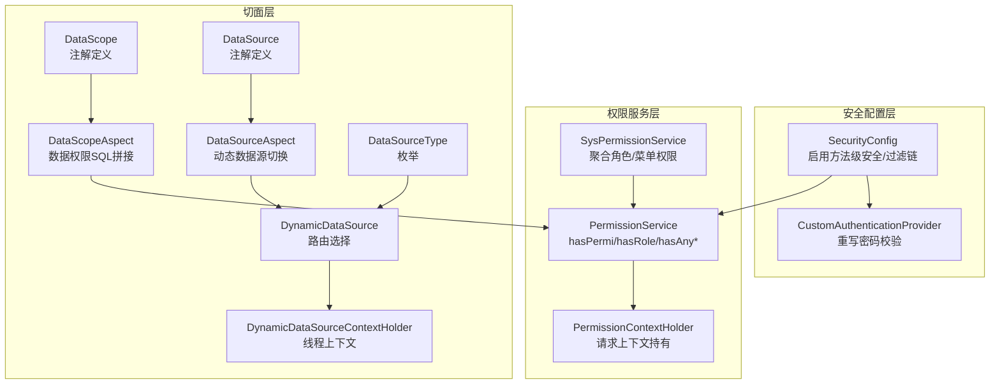
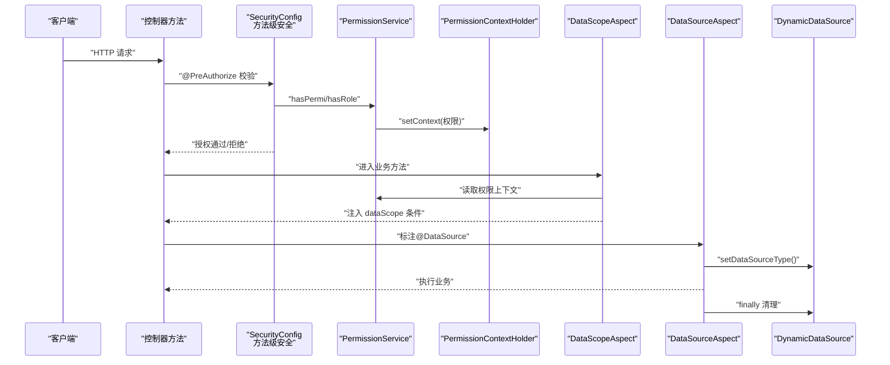
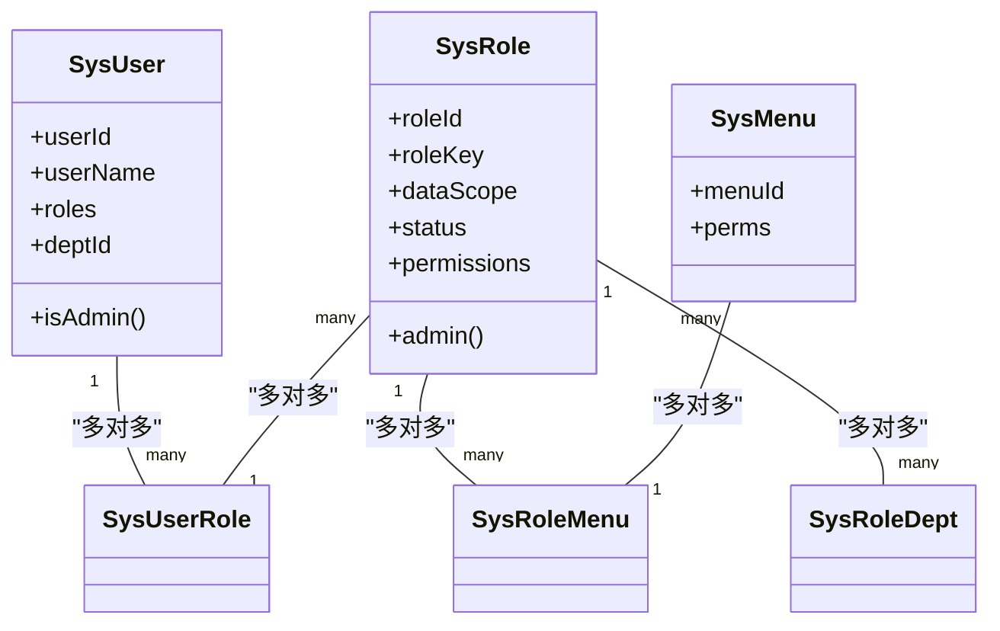
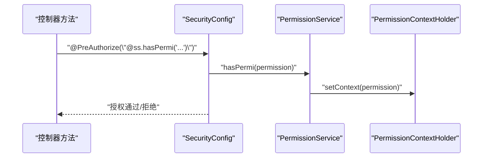
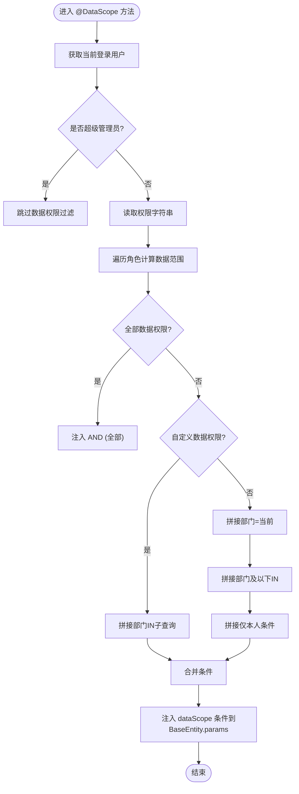
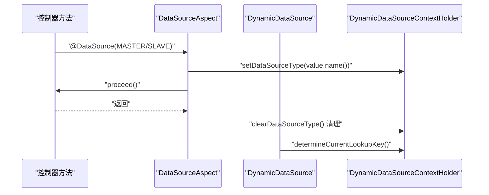
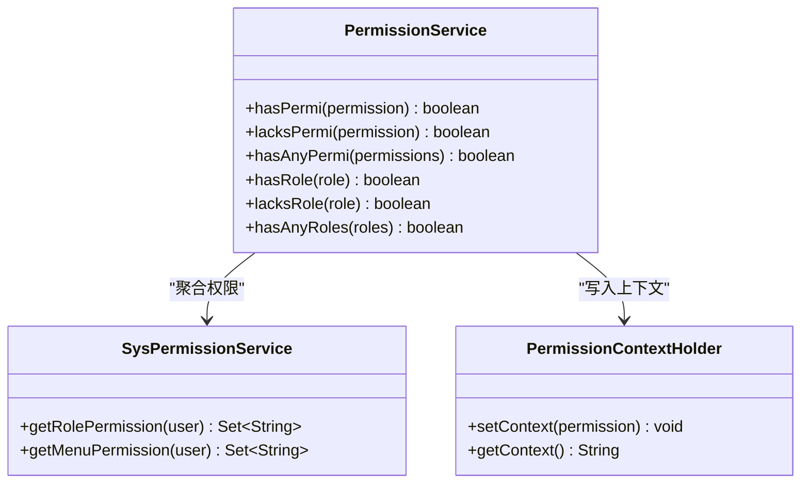
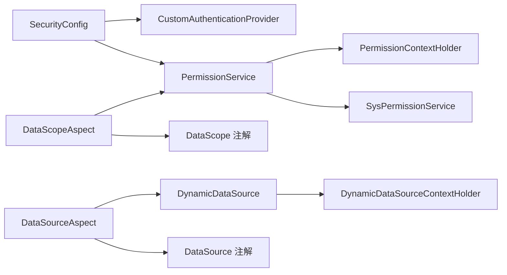

# 权限控制策略

<cite>
**本文引用的文件**
- [SecurityConfig.java](file://blog-framework/src/main/java/blog/framework/config/SecurityConfig.java)
- [CustomAuthenticationProvider.java](file://blog-framework/src/main/java/blog/framework/security/provider/CustomAuthenticationProvider.java)
- [PermissionService.java](file://blog-framework/src/main/java/blog/framework/web/service/PermissionService.java)
- [SysPermissionService.java](file://blog-framework/src/main/java/blog/framework/web/service/SysPermissionService.java)
- [PermissionContextHolder.java](file://blog-framework/src/main/java/blog/framework/security/context/PermissionContextHolder.java)
- [DataScopeAspect.java](file://blog-framework/src/main/java/blog/framework/aspectj/DataScopeAspect.java)
- [DataScope.java](file://blog-common/src/main/java/blog/common/annotation/DataScope.java)
- [DataSourceAspect.java](file://blog-framework/src/main/java/blog/framework/aspectj/DataSourceAspect.java)
- [DataSource.java](file://blog-common/src/main/java/blog/common/annotation/DataSource.java)
- [DynamicDataSource.java](file://blog-framework/src/main/java/blog/framework/datasource/DynamicDataSource.java)
- [DynamicDataSourceContextHolder.java](file://blog-framework/src/main/java/blog/framework/datasource/DynamicDataSourceContextHolder.java)
- [DataSourceType.java](file://blog-common/src/main/java/blog/common/enums/DataSourceType.java)
- [SysUserController.java](file://blog-admin/src/main/java/blog/web/controller/system/SysUserController.java)
- [CacheController.java](file://blog-admin/src/main/java/blog/web/controller/monitor/CacheController.java)
</cite>

## 目录
1. [引言](#引言)
2. [项目结构](#项目结构)
3. [核心组件](#核心组件)
4. [架构总览](#架构总览)
5. [详细组件分析](#详细组件分析)
6. [依赖分析](#依赖分析)
7. [性能考虑](#性能考虑)
8. [故障排查指南](#故障排查指南)
9. [结论](#结论)
10. [附录](#附录)

## 引言
本文件系统性梳理本项目的权限控制策略，重点围绕基于角色的访问控制（RBAC）模型、接口权限控制（@PreAuthorize/@PostAuthorize）、数据权限控制（DataScopeAspect）、动态数据源切换（DataSourceAspect）以及权限服务实现（权限获取、验证、上下文传递）。文档同时提供权限配置示例与最佳实践，帮助开发者快速理解并正确应用权限体系。

## 项目结构
权限控制涉及三层：
- 安全配置层：启用方法级安全、配置过滤链、注册认证提供者
- 权限服务层：负责权限/角色校验、菜单权限聚合、上下文持有
- 切面层：数据权限过滤、动态数据源切换

图表来源
- [SecurityConfig.java:31-127](file://blog-framework/src/main/java/blog/framework/config/SecurityConfig.java#L31-L127)
- [CustomAuthenticationProvider.java:25-57](file://blog-framework/src/main/java/blog/framework/security/provider/CustomAuthenticationProvider.java#L25-L57)
- [PermissionService.java:19-138](file://blog-framework/src/main/java/blog/framework/web/service/PermissionService.java#L19-L138)
- [SysPermissionService.java:22-75](file://blog-framework/src/main/java/blog/framework/web/service/SysPermissionService.java#L22-L75)
- [PermissionContextHolder.java:12-24](file://blog-framework/src/main/java/blog/framework/security/context/PermissionContextHolder.java#L12-L24)
- [DataScopeAspect.java:26-153](file://blog-framework/src/main/java/blog/framework/aspectj/DataScopeAspect.java#L26-L153)
- [DataScope.java:14-32](file://blog-common/src/main/java/blog/common/annotation/DataScope.java#L14-L32)
- [DataSourceAspect.java:24-64](file://blog-framework/src/main/java/blog/framework/aspectj/DataSourceAspect.java#L24-L64)
- [DataSource.java:19-28](file://blog-common/src/main/java/blog/common/annotation/DataSource.java#L19-L28)
- [DynamicDataSource.java:13-24](file://blog-framework/src/main/java/blog/framework/datasource/DynamicDataSource.java#L13-L24)
- [DynamicDataSourceContextHolder.java:11-41](file://blog-framework/src/main/java/blog/framework/datasource/DynamicDataSourceContextHolder.java#L11-L41)
- [DataSourceType.java:8-18](file://blog-common/src/main/java/blog/common/enums/DataSourceType.java#L8-L18)

章节来源
- [SecurityConfig.java:31-127](file://blog-framework/src/main/java/blog/framework/config/SecurityConfig.java#L31-L127)

## 核心组件
- 方法级安全与过滤链：启用 prePostEnabled，配置匿名放行URL、JWT过滤器、跨域过滤器、登出处理器等。
- 自定义认证提供者：扩展DaoAuthenticationProvider，重写密码校验逻辑，结合密码服务进行登录校验。
- 权限服务：统一对外提供hasPermi/hasRole/hasAny*等能力；支持“超级管理员”豁免；将权限上下文放入请求作用域。
- 菜单与角色权限聚合：管理员拥有全部权限；普通用户按角色聚合菜单权限，支持多角色合并。
- 数据权限切面：解析@PreAuthorize传入的权限串或从上下文读取，按角色数据范围生成SQL条件，注入BaseEntity.params。
- 动态数据源切面：解析@DataSource注解，切换主/从库，确保finally清理上下文。

章节来源
- [SecurityConfig.java:31-127](file://blog-framework/src/main/java/blog/framework/config/SecurityConfig.java#L31-L127)
- [CustomAuthenticationProvider.java:25-57](file://blog-framework/src/main/java/blog/framework/security/provider/CustomAuthenticationProvider.java#L25-L57)
- [PermissionService.java:19-138](file://blog-framework/src/main/java/blog/framework/web/service/PermissionService.java#L19-L138)
- [SysPermissionService.java:22-75](file://blog-framework/src/main/java/blog/framework/web/service/SysPermissionService.java#L22-L75)
- [DataScopeAspect.java:26-153](file://blog-framework/src/main/java/blog/framework/aspectj/DataScopeAspect.java#L26-L153)
- [DataSourceAspect.java:24-64](file://blog-framework/src/main/java/blog/framework/aspectj/DataSourceAspect.java#L24-L64)

## 架构总览
下图展示了从请求进入Web层，到方法级权限校验、数据权限过滤、动态数据源切换的完整流程。

图表来源
- [SecurityConfig.java:31-127](file://blog-framework/src/main/java/blog/framework/config/SecurityConfig.java#L31-L127)
- [PermissionService.java:19-138](file://blog-framework/src/main/java/blog/framework/web/service/PermissionService.java#L19-L138)
- [PermissionContextHolder.java:12-24](file://blog-framework/src/main/java/blog/framework/security/context/PermissionContextHolder.java#L12-L24)
- [DataScopeAspect.java:26-153](file://blog-framework/src/main/java/blog/framework/aspectj/DataScopeAspect.java#L26-L153)
- [DataSourceAspect.java:24-64](file://blog-framework/src/main/java/blog/framework/aspectj/DataSourceAspect.java#L24-L64)
- [DynamicDataSource.java:13-24](file://blog-framework/src/main/java/blog/framework/datasource/DynamicDataSource.java#L13-L24)

## 详细组件分析

### RBAC 权限模型与实现
- 用户-角色-权限关系
  - 用户与角色：多对多映射（SysUserRole）
  - 角色与菜单：多对多映射（SysRoleMenu），菜单权限决定接口可见性与操作权限
  - 角色与部门：多对多映射（SysRoleDept），用于数据权限范围
- 权限聚合
  - 管理员拥有全部菜单权限与角色标识
  - 普通用户按角色聚合菜单权限，支持多角色合并
- 上下文传递
  - @PreAuthorize触发时，将权限字符串写入请求上下文，供数据权限切面读取

图表来源
- [SysPermissionService.java:22-75](file://blog-framework/src/main/java/blog/framework/web/service/SysPermissionService.java#L22-L75)

章节来源
- [SysPermissionService.java:22-75](file://blog-framework/src/main/java/blog/framework/web/service/SysPermissionService.java#L22-L75)
- [PermissionContextHolder.java:12-24](file://blog-framework/src/main/java/blog/framework/security/context/PermissionContextHolder.java#L12-L24)

### 接口权限控制（@PreAuthorize/@PostAuthorize）
- 启用方式：SecurityConfig中开启@EnableMethodSecurity(prePostEnabled = true, securedEnabled = true)
- 使用场景
  - 控制器方法上使用@PreAuthorize("@ss.hasPermi('...')")进行前置校验
  - 可结合@PostAuthorize在返回后二次校验（如数据脱敏）
- 校验流程
  - @PreAuthorize触发时，调用PermissionService.hasPermi/hasRole
  - 将权限字符串写入PermissionContextHolder，供后续数据权限切面读取

图表来源
- [SecurityConfig.java:31-127](file://blog-framework/src/main/java/blog/framework/config/SecurityConfig.java#L31-L127)
- [PermissionService.java:19-138](file://blog-framework/src/main/java/blog/framework/web/service/PermissionService.java#L19-L138)
- [PermissionContextHolder.java:12-24](file://blog-framework/src/main/java/blog/framework/security/context/PermissionContextHolder.java#L12-L24)

章节来源
- [SecurityConfig.java:31-127](file://blog-framework/src/main/java/blog/framework/config/SecurityConfig.java#L31-L127)
- [SysUserController.java:117-125](file://blog-admin/src/main/java/blog/web/controller/system/SysUserController.java#L117-L125)
- [CacheController.java:50-115](file://blog-admin/src/main/java/blog/web/controller/monitor/CacheController.java#L50-L115)

### 数据权限控制（DataScopeAspect）
- 注解与切点
  - @DataScope用于方法，声明部门表别名、用户表别名、权限字符
  - 切面在方法执行前清理并注入dataScope条件
- 过滤规则
  - 全部数据权限：直接放行
  - 自定义数据权限：基于sys_role_dept关联查询部门集合
  - 部门数据权限：仅限当前部门
  - 部门及以下：递归祖先树匹配
  - 仅本人：按用户ID过滤
- 关键点
  - 超级管理员跳过过滤
  - 多角色同属自定义范围时合并IN查询
  - 未匹配到权限字符时注入“不查询任何数据”的兜底条件
  - 通过BaseEntity.params.put("dataScope", "...")向SQL注入条件

图表来源
- [DataScopeAspect.java:26-153](file://blog-framework/src/main/java/blog/framework/aspectj/DataScopeAspect.java#L26-L153)
- [DataScope.java:14-32](file://blog-common/src/main/java/blog/common/annotation/DataScope.java#L14-L32)

章节来源
- [DataScopeAspect.java:26-153](file://blog-framework/src/main/java/blog/framework/aspectj/DataScopeAspect.java#L26-L153)
- [DataScope.java:14-32](file://blog-common/src/main/java/blog/common/annotation/DataScope.java#L14-L32)

### 动态数据源切换（DataSourceAspect）
- 注解与优先级
  - @DataSource用于方法或类级别，值为MASTER/SLAVE
  - 方法优先于类级别
- 切面逻辑
  - Around环绕：执行前设置数据源类型，执行后清理
  - 通过DynamicDataSourceContextHolder在线程上下文中保存数据源类型
  - DynamicDataSource根据lookupKey路由到对应数据源

图表来源
- [DataSourceAspect.java:24-64](file://blog-framework/src/main/java/blog/framework/aspectj/DataSourceAspect.java#L24-L64)
- [DynamicDataSource.java:13-24](file://blog-framework/src/main/java/blog/framework/datasource/DynamicDataSource.java#L13-L24)
- [DynamicDataSourceContextHolder.java:11-41](file://blog-framework/src/main/java/blog/framework/datasource/DynamicDataSourceContextHolder.java#L11-L41)
- [DataSource.java:19-28](file://blog-common/src/main/java/blog/common/annotation/DataSource.java#L19-L28)
- [DataSourceType.java:8-18](file://blog-common/src/main/java/blog/common/enums/DataSourceType.java#L8-L18)

章节来源
- [DataSourceAspect.java:24-64](file://blog-framework/src/main/java/blog/framework/aspectj/DataSourceAspect.java#L24-L64)
- [DynamicDataSource.java:13-24](file://blog-framework/src/main/java/blog/framework/datasource/DynamicDataSource.java#L13-L24)
- [DynamicDataSourceContextHolder.java:11-41](file://blog-framework/src/main/java/blog/framework/datasource/DynamicDataSourceContextHolder.java#L11-L41)
- [DataSource.java:19-28](file://blog-common/src/main/java/blog/common/annotation/DataSource.java#L19-L28)
- [DataSourceType.java:8-18](file://blog-common/src/main/java/blog/common/enums/DataSourceType.java#L8-L18)

### 权限服务实现（获取/验证/上下文）
- 权限获取
  - 通过SecurityUtils获取当前登录用户
  - 菜单权限由SysPermissionService聚合，角色权限来自ISysRoleService
- 权限验证
  - hasPermi/lacksPermi：精确匹配
  - hasAnyPermi：支持逗号分隔的任一匹配
  - hasRole/lacksRole/hasAnyRoles：角色匹配，超级管理员豁免
- 上下文传递
  - PermissionContextHolder将权限字符串写入请求作用域，供数据权限切面读取

图表来源
- [PermissionService.java:19-138](file://blog-framework/src/main/java/blog/framework/web/service/PermissionService.java#L19-L138)
- [SysPermissionService.java:22-75](file://blog-framework/src/main/java/blog/framework/web/service/SysPermissionService.java#L22-L75)
- [PermissionContextHolder.java:12-24](file://blog-framework/src/main/java/blog/framework/security/context/PermissionContextHolder.java#L12-L24)

章节来源
- [PermissionService.java:19-138](file://blog-framework/src/main/java/blog/framework/web/service/PermissionService.java#L19-L138)
- [SysPermissionService.java:22-75](file://blog-framework/src/main/java/blog/framework/web/service/SysPermissionService.java#L22-L75)
- [PermissionContextHolder.java:12-24](file://blog-framework/src/main/java/blog/framework/security/context/PermissionContextHolder.java#L12-L24)

## 依赖分析
- 组件耦合
  - SecurityConfig依赖Jwt过滤器、认证提供者、匿名URL配置
  - PermissionService依赖SecurityUtils与PermissionContextHolder
  - SysPermissionService依赖角色/菜单服务
  - DataScopeAspect依赖注解、工具类、上下文与BaseEntity
  - DataSourceAspect依赖注解与DynamicDataSourceContextHolder
- 外部依赖
  - Spring Security方法级安全
  - Spring AOP切面
  - MyBatis Plus（通过BaseEntity.params注入SQL片段）

图表来源
- [SecurityConfig.java:31-127](file://blog-framework/src/main/java/blog/framework/config/SecurityConfig.java#L31-L127)
- [CustomAuthenticationProvider.java:25-57](file://blog-framework/src/main/java/blog/framework/security/provider/CustomAuthenticationProvider.java#L25-L57)
- [PermissionService.java:19-138](file://blog-framework/src/main/java/blog/framework/web/service/PermissionService.java#L19-L138)
- [SysPermissionService.java:22-75](file://blog-framework/src/main/java/blog/framework/web/service/SysPermissionService.java#L22-L75)
- [DataScopeAspect.java:26-153](file://blog-framework/src/main/java/blog/framework/aspectj/DataScopeAspect.java#L26-L153)
- [DataScope.java:14-32](file://blog-common/src/main/java/blog/common/annotation/DataScope.java#L14-L32)
- [DataSourceAspect.java:24-64](file://blog-framework/src/main/java/blog/framework/aspectj/DataSourceAspect.java#L24-L64)
- [DynamicDataSource.java:13-24](file://blog-framework/src/main/java/blog/framework/datasource/DynamicDataSource.java#L13-L24)
- [DynamicDataSourceContextHolder.java:11-41](file://blog-framework/src/main/java/blog/framework/datasource/DynamicDataSourceContextHolder.java#L11-L41)
- [DataSource.java:19-28](file://blog-common/src/main/java/blog/common/annotation/DataSource.java#L19-L28)

## 性能考虑
- 权限上下文复用：通过PermissionContextHolder减少重复解析，降低字符串处理开销
- 数据权限SQL合并：自定义数据权限多角色合并IN查询，避免多次拼接
- 切面执行顺序：确保@PreAuthorize在DAO前执行，避免不必要的数据库访问
- 动态数据源：仅在必要方法上标注@DataSource，避免频繁切换造成连接池抖动

## 故障排查指南
- 方法级权限不生效
  - 确认SecurityConfig已启用@EnableMethodSecurity(prePostEnabled = true)
  - 检查控制器方法是否使用@PreAuthorize并正确引用“@ss.hasPermi(...)”
- 数据权限未生效
  - 确认方法上标注@PreAuthorize并传入权限字符串，或依赖上下文
  - 检查BaseEntity.params中是否注入了dataScope条件
  - 核对角色数据范围与状态（启用/禁用）与权限字符匹配
- 动态数据源切换异常
  - 确认@DataSource注解使用位置（方法/类）与优先级
  - 检查finally是否清理了线程上下文
  - 核对DynamicDataSource配置的目标数据源映射

章节来源
- [SecurityConfig.java:31-127](file://blog-framework/src/main/java/blog/framework/config/SecurityConfig.java#L31-L127)
- [DataScopeAspect.java:26-153](file://blog-framework/src/main/java/blog/framework/aspectj/DataScopeAspect.java#L26-L153)
- [DataSourceAspect.java:24-64](file://blog-framework/src/main/java/blog/framework/aspectj/DataSourceAspect.java#L24-L64)

## 结论
本项目采用“方法级安全 + RBAC + 切面增强”的权限体系：以Spring Security实现接口级授权，以PermissionService与SysPermissionService实现权限聚合与校验，以DataScopeAspect实现灵活的数据权限过滤，并通过DataSourceAspect实现主从库动态切换。整体设计清晰、职责分离明确，便于扩展与维护。

## 附录

### 权限配置示例
- 接口权限
  - 新增用户：@PreAuthorize("@ss.hasPermi('system:user:add')")，见 [SysUserController.java:117-125](file://blog-admin/src/main/java/blog/web/controller/system/SysUserController.java#L117-L125)
  - 缓存监控：@PreAuthorize("@ss.hasPermi('monitor:cache:list')")，见 [CacheController.java:50-115](file://blog-admin/src/main/java/blog/web/controller/monitor/CacheController.java#L50-L115)
- 数据权限
  - 方法标注@PreAuthorize并配合@ss上下文，或显式@PreAuthorize("@ss.hasPermi('...')")，由DataScopeAspect读取
  - 示例注解：@DataScope(deptAlias = "d", userAlias = "u", permission = "system:user:list")
- 动态数据源
  - 方法标注@DataSource(DataSourceType.SLAVE)，由DataSourceAspect切换至从库

章节来源
- [SysUserController.java:117-125](file://blog-admin/src/main/java/blog/web/controller/system/SysUserController.java#L117-L125)
- [CacheController.java:50-115](file://blog-admin/src/main/java/blog/web/controller/monitor/CacheController.java#L50-L115)
- [DataScope.java:14-32](file://blog-common/src/main/java/blog/common/annotation/DataScope.java#L14-L32)
- [DataSource.java:19-28](file://blog-common/src/main/java/blog/common/annotation/DataSource.java#L19-L28)