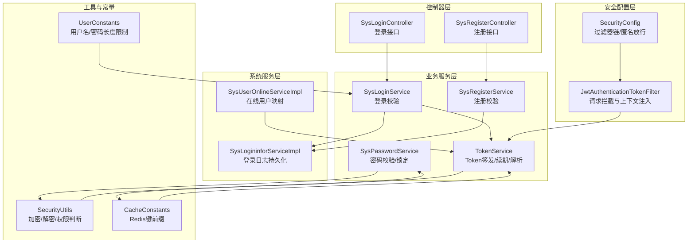
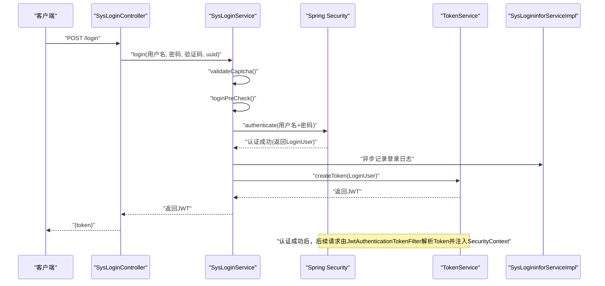
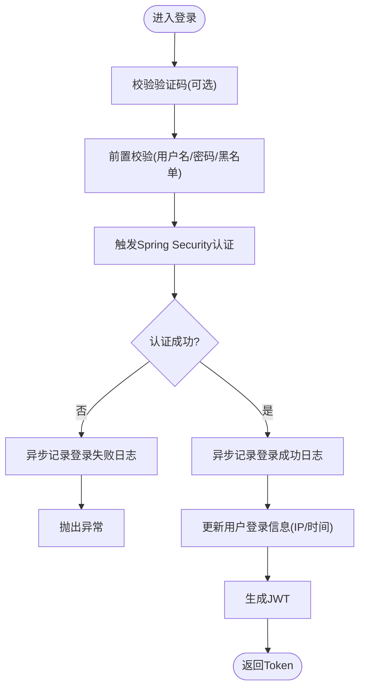
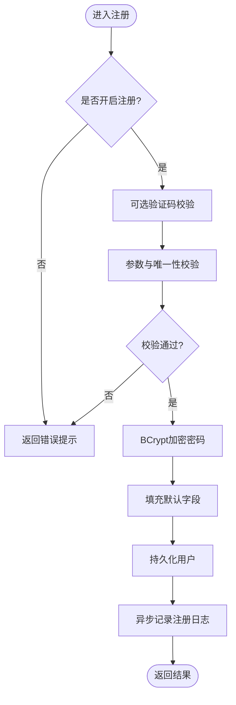
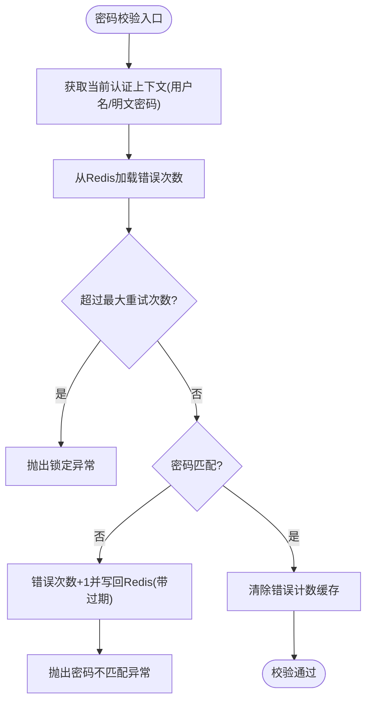
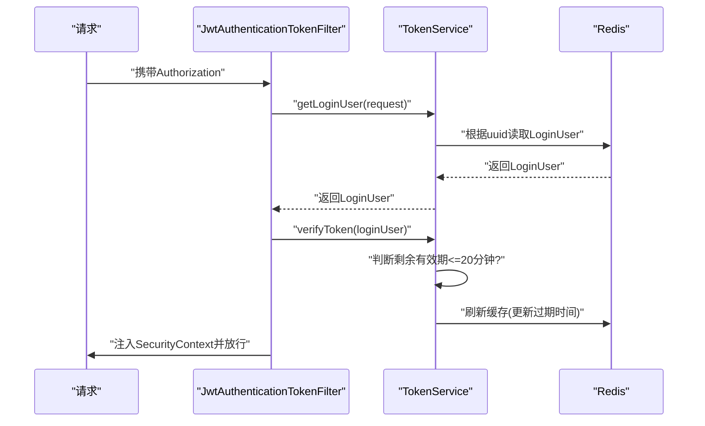
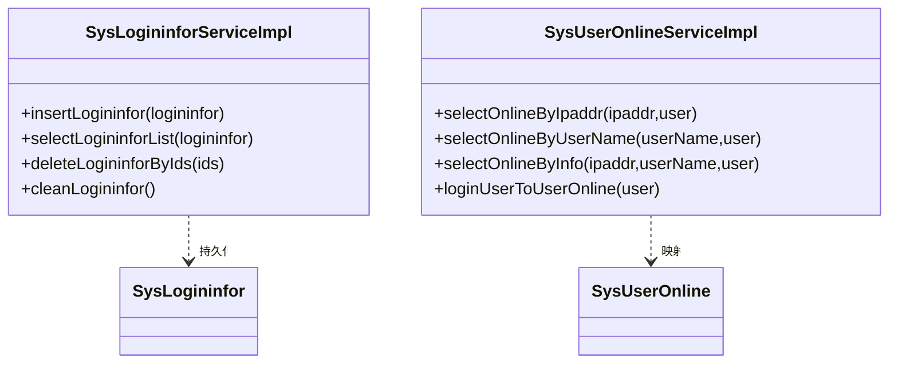
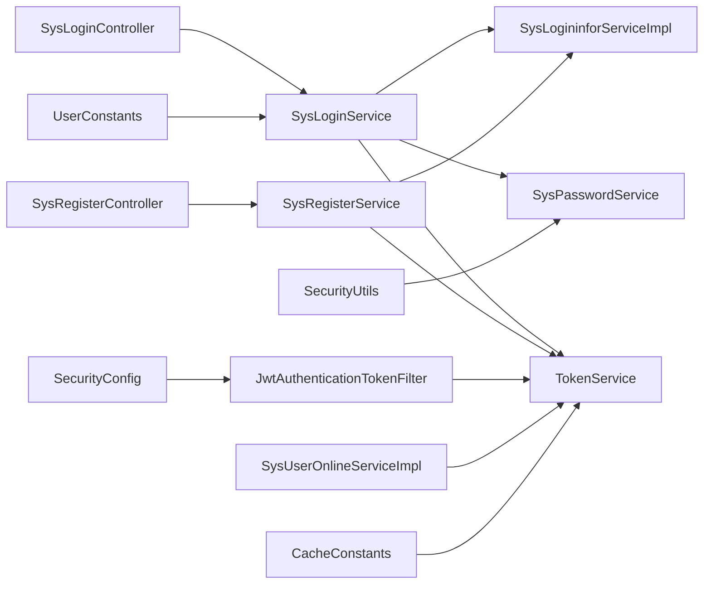

# 用户会话管理

<cite>
**本文引用的文件**
- [SysLoginController.java](file://blog-admin/src/main/java/blog/web/controller/system/SysLoginController.java)
- [SysRegisterController.java](file://blog-admin/src/main/java/blog/web/controller/system/SysRegisterController.java)
- [SysLoginService.java](file://blog-framework/src/main/java/blog/framework/web/service/SysLoginService.java)
- [SysRegisterService.java](file://blog-framework/src/main/java/blog/framework/web/service/SysRegisterService.java)
- [SysPasswordService.java](file://blog-framework/src/main/java/blog/framework/web/service/SysPasswordService.java)
- [TokenService.java](file://blog-framework/src/main/java/blog/framework/web/service/TokenService.java)
- [JwtAuthenticationTokenFilter.java](file://blog-framework/src/main/java/blog/framework/security/filter/JwtAuthenticationTokenFilter.java)
- [SecurityConfig.java](file://blog-framework/src/main/java/blog/framework/config/SecurityConfig.java)
- [SysUserOnlineServiceImpl.java](file://blog-system/src/main/java/blog/system/service/impl/SysUserOnlineServiceImpl.java)
- [SysLogininforServiceImpl.java](file://blog-system/src/main/java/blog/system/service/impl/SysLogininforServiceImpl.java)
- [SecurityUtils.java](file://blog-common/src/main/java/blog/common/utils/SecurityUtils.java)
- [UserConstants.java](file://blog-common/src/main/java/blog/common/constant/UserConstants.java)
- [CacheConstants.java](file://blog-common/src/main/java/blog/common/constant/CacheConstants.java)
</cite>

## 目录
1. [简介](#简介)
2. [项目结构](#项目结构)
3. [核心组件](#核心组件)
4. [架构总览](#架构总览)
5. [详细组件分析](#详细组件分析)
6. [依赖分析](#依赖分析)
7. [性能考虑](#性能考虑)
8. [故障排查指南](#故障排查指南)
9. [结论](#结论)
10. [附录](#附录)

## 简介
本文件围绕用户会话管理进行系统化说明，覆盖登录与注册流程、密码管理机制、会话生命周期与Token续期策略、登录信息服务（日志、统计、异常检测）以及安全最佳实践与性能优化建议。文档以实际源码为依据，配合图示帮助读者快速理解并落地实现。

## 项目结构
会话管理相关代码主要分布在以下模块：
- 控制器层：负责对外接口与请求封装
- 业务服务层：负责登录/注册/密码/Token等核心逻辑
- 安全配置层：负责Spring Security与过滤器链配置
- 系统服务层：负责在线用户与登录日志持久化
- 工具与常量：负责加密、常量与Redis键命名规范

图表来源
- [SysLoginController.java:56-64](file://blog-admin/src/main/java/blog/web/controller/system/SysLoginController.java#L56-L64)
- [SysRegisterController.java:27-34](file://blog-admin/src/main/java/blog/web/controller/system/SysRegisterController.java#L27-L34)
- [SysLoginService.java:62-98](file://blog-framework/src/main/java/blog/framework/web/service/SysLoginService.java#L62-L98)
- [SysRegisterService.java:41-76](file://blog-framework/src/main/java/blog/framework/web/service/SysRegisterService.java#L41-L76)
- [SysPasswordService.java:34-56](file://blog-framework/src/main/java/blog/framework/web/service/SysPasswordService.java#L34-L56)
- [TokenService.java:105-142](file://blog-framework/src/main/java/blog/framework/web/service/TokenService.java#L105-L142)
- [JwtAuthenticationTokenFilter.java:41-47](file://blog-framework/src/main/java/blog/framework/security/filter/JwtAuthenticationTokenFilter.java#L41-L47)
- [SecurityConfig.java:95-126](file://blog-framework/src/main/java/blog/framework/config/SecurityConfig.java#L95-L126)
- [SysUserOnlineServiceImpl.java:69-85](file://blog-system/src/main/java/blog/system/service/impl/SysUserOnlineServiceImpl.java#L69-L85)
- [SysLogininforServiceImpl.java:29-31](file://blog-system/src/main/java/blog/system/service/impl/SysLogininforServiceImpl.java#L29-L31)
- [SecurityUtils.java:81-96](file://blog-common/src/main/java/blog/common/utils/SecurityUtils.java#L81-L96)
- [UserConstants.java:107-116](file://blog-common/src/main/java/blog/common/constant/UserConstants.java#L107-L116)
- [CacheConstants.java:11-43](file://blog-common/src/main/java/blog/common/constant/CacheConstants.java#L11-L43)

章节来源
- [SysLoginController.java:56-64](file://blog-admin/src/main/java/blog/web/controller/system/SysLoginController.java#L56-L64)
- [SysRegisterController.java:27-34](file://blog-admin/src/main/java/blog/web/controller/system/SysRegisterController.java#L27-L34)
- [SysLoginService.java:62-98](file://blog-framework/src/main/java/blog/framework/web/service/SysLoginService.java#L62-L98)
- [SysRegisterService.java:41-76](file://blog-framework/src/main/java/blog/framework/web/service/SysRegisterService.java#L41-L76)
- [SysPasswordService.java:34-56](file://blog-framework/src/main/java/blog/framework/web/service/SysPasswordService.java#L34-L56)
- [TokenService.java:105-142](file://blog-framework/src/main/java/blog/framework/web/service/TokenService.java#L105-L142)
- [JwtAuthenticationTokenFilter.java:41-47](file://blog-framework/src/main/java/blog/framework/security/filter/JwtAuthenticationTokenFilter.java#L41-L47)
- [SecurityConfig.java:95-126](file://blog-framework/src/main/java/blog/framework/config/SecurityConfig.java#L95-L126)
- [SysUserOnlineServiceImpl.java:69-85](file://blog-system/src/main/java/blog/system/service/impl/SysUserOnlineServiceImpl.java#L69-L85)
- [SysLogininforServiceImpl.java:29-31](file://blog-system/src/main/java/blog/system/service/impl/SysLogininforServiceImpl.java#L29-L31)
- [SecurityUtils.java:81-96](file://blog-common/src/main/java/blog/common/utils/SecurityUtils.java#L81-L96)
- [UserConstants.java:107-116](file://blog-common/src/main/java/blog/common/constant/UserConstants.java#L107-L116)
- [CacheConstants.java:11-43](file://blog-common/src/main/java/blog/common/constant/CacheConstants.java#L11-L43)

## 核心组件
- 登录控制器：接收登录请求，调用登录服务生成Token并返回
- 注册控制器：校验注册开关与参数，调用注册服务完成用户创建
- 登录服务：验证码校验、前置参数校验、触发Spring Security认证、记录登录信息、生成Token
- 注册服务：验证码校验、参数校验、密码加密、默认字段填充、持久化
- 密码服务：密码匹配校验、失败次数缓存与锁定、清理缓存
- Token服务：解析请求中的Token、签发/刷新Token、用户代理与位置信息写入、Redis缓存
- 安全配置：过滤器链、匿名放行URL、基于无状态Session的认证策略
- 在线用户服务：将登录用户映射为在线用户视图
- 登录日志服务：新增/查询/批量删除/清空登录日志
- 安全工具：BCrypt密码加密/匹配、权限/角色判断、当前用户信息获取
- 常量与缓存键：用户名/密码长度限制、Redis键前缀（登录Token、验证码、密码错误计数）

章节来源
- [SysLoginController.java:56-64](file://blog-admin/src/main/java/blog/web/controller/system/SysLoginController.java#L56-L64)
- [SysRegisterController.java:27-34](file://blog-admin/src/main/java/blog/web/controller/system/SysRegisterController.java#L27-L34)
- [SysLoginService.java:62-98](file://blog-framework/src/main/java/blog/framework/web/service/SysLoginService.java#L62-L98)
- [SysRegisterService.java:41-76](file://blog-framework/src/main/java/blog/framework/web/service/SysRegisterService.java#L41-L76)
- [SysPasswordService.java:34-56](file://blog-framework/src/main/java/blog/framework/web/service/SysPasswordService.java#L34-L56)
- [TokenService.java:105-142](file://blog-framework/src/main/java/blog/framework/web/service/TokenService.java#L105-L142)
- [JwtAuthenticationTokenFilter.java:41-47](file://blog-framework/src/main/java/blog/framework/security/filter/JwtAuthenticationTokenFilter.java#L41-L47)
- [SecurityConfig.java:95-126](file://blog-framework/src/main/java/blog/framework/config/SecurityConfig.java#L95-L126)
- [SysUserOnlineServiceImpl.java:69-85](file://blog-system/src/main/java/blog/system/service/impl/SysUserOnlineServiceImpl.java#L69-L85)
- [SysLogininforServiceImpl.java:29-31](file://blog-system/src/main/java/blog/system/service/impl/SysLogininforServiceImpl.java#L29-L31)
- [SecurityUtils.java:81-96](file://blog-common/src/main/java/blog/common/utils/SecurityUtils.java#L81-L96)
- [UserConstants.java:107-116](file://blog-common/src/main/java/blog/common/constant/UserConstants.java#L107-L116)
- [CacheConstants.java:11-43](file://blog-common/src/main/java/blog/common/constant/CacheConstants.java#L11-L43)

## 架构总览
整体采用“无状态会话”设计：客户端每次请求携带JWT，服务器端通过过滤器解析并注入认证上下文；用户信息与Token有效期缓存于Redis，实现跨节点共享与续期。

图表来源
- [SysLoginController.java:56-64](file://blog-admin/src/main/java/blog/web/controller/system/SysLoginController.java#L56-L64)
- [SysLoginService.java:62-98](file://blog-framework/src/main/java/blog/framework/web/service/SysLoginService.java#L62-L98)
- [TokenService.java:105-115](file://blog-framework/src/main/java/blog/framework/web/service/TokenService.java#L105-L115)
- [JwtAuthenticationTokenFilter.java:41-47](file://blog-framework/src/main/java/blog/framework/security/filter/JwtAuthenticationTokenFilter.java#L41-L47)
- [SysLogininforServiceImpl.java:29-31](file://blog-system/src/main/java/blog/system/service/impl/SysLogininforServiceImpl.java#L29-L31)

## 详细组件分析

### 登录流程（用户名密码验证、账户状态检查、登录成功处理）
- 请求入口：控制器接收LoginBody，调用登录服务
- 验证码校验：根据配置开关从Redis读取并校验验证码，过期或不匹配抛出对应异常
- 登录前置校验：用户名/密码长度校验、黑名单IP校验
- Spring Security认证：构造UsernamePasswordAuthenticationToken，交由AuthenticationManager处理
- 成功处理：异步记录登录日志、更新用户最近登录信息、生成Token并返回
- 失败处理：区分凭据错误与其它异常，统一记录失败日志并抛出业务异常

图表来源
- [SysLoginService.java:62-98](file://blog-framework/src/main/java/blog/framework/web/service/SysLoginService.java#L62-L98)
- [SysLogininforServiceImpl.java:29-31](file://blog-system/src/main/java/blog/system/service/impl/SysLogininforServiceImpl.java#L29-L31)
- [TokenService.java:105-115](file://blog-framework/src/main/java/blog/framework/web/service/TokenService.java#L105-L115)

章节来源
- [SysLoginController.java:56-64](file://blog-admin/src/main/java/blog/web/controller/system/SysLoginController.java#L56-L64)
- [SysLoginService.java:62-98](file://blog-framework/src/main/java/blog/framework/web/service/SysLoginService.java#L62-L98)
- [SysLogininforServiceImpl.java:29-31](file://blog-system/src/main/java/blog/system/service/impl/SysLogininforServiceImpl.java#L29-L31)
- [TokenService.java:105-115](file://blog-framework/src/main/java/blog/framework/web/service/TokenService.java#L105-L115)

### 注册流程（参数验证、密码加密、默认角色/字段）
- 注册开关校验：仅当系统允许注册时才处理
- 验证码校验：按配置决定是否启用
- 参数校验：用户名/密码长度校验、唯一性校验
- 密码加密：使用BCrypt加密存储
- 默认字段：昵称、密码更新日期等
- 持久化：调用用户服务完成注册，并异步记录注册日志

图表来源
- [SysRegisterController.java:27-34](file://blog-admin/src/main/java/blog/web/controller/system/SysRegisterController.java#L27-L34)
- [SysRegisterService.java:41-76](file://blog-framework/src/main/java/blog/framework/web/service/SysRegisterService.java#L41-L76)
- [SysLogininforServiceImpl.java:29-31](file://blog-system/src/main/java/blog/system/service/impl/SysLogininforServiceImpl.java#L29-L31)
- [SecurityUtils.java:81-96](file://blog-common/src/main/java/blog/common/utils/SecurityUtils.java#L81-L96)

章节来源
- [SysRegisterController.java:27-34](file://blog-admin/src/main/java/blog/web/controller/system/SysRegisterController.java#L27-L34)
- [SysRegisterService.java:41-76](file://blog-framework/src/main/java/blog/framework/web/service/SysRegisterService.java#L41-L76)
- [SecurityUtils.java:81-96](file://blog-common/src/main/java/blog/common/utils/SecurityUtils.java#L81-L96)
- [SysLogininforServiceImpl.java:29-31](file://blog-system/src/main/java/blog/system/service/impl/SysLogininforServiceImpl.java#L29-L31)

### 密码管理机制（加密存储、匹配、重试限制与锁定）
- 存储加密：注册/修改密码均使用BCrypt进行不可逆加密
- 匹配校验：登录时对原始密码与存储密码进行匹配
- 失败重试：基于Redis记录用户名下的错误次数，超过阈值进行锁定
- 锁定策略：达到最大重试次数后抛出异常，锁定时长由配置控制
- 缓存清理：登录成功清除错误计数缓存

图表来源
- [SysPasswordService.java:34-56](file://blog-framework/src/main/java/blog/framework/web/service/SysPasswordService.java#L34-L56)
- [CacheConstants.java:40-43](file://blog-common/src/main/java/blog/common/constant/CacheConstants.java#L40-L43)
- [SecurityUtils.java:93-96](file://blog-common/src/main/java/blog/common/utils/SecurityUtils.java#L93-L96)

章节来源
- [SysPasswordService.java:34-56](file://blog-framework/src/main/java/blog/framework/web/service/SysPasswordService.java#L34-L56)
- [CacheConstants.java:40-43](file://blog-common/src/main/java/blog/common/constant/CacheConstants.java#L40-L43)
- [SecurityUtils.java:93-96](file://blog-common/src/main/java/blog/common/utils/SecurityUtils.java#L93-L96)

### 会话生命周期管理（Token过期处理、自动续期、强制下线）
- Token签发：生成UUID作为Token标识，写入LoginUser并缓存至Redis
- 续期策略：距离过期不足20分钟时自动刷新Redis缓存与过期时间
- 过滤器解析：请求到达时从Header解析Token，解析用户信息并注入SecurityContext
- 强制下线：提供删除缓存键的方法，使该Token失效（需结合登出流程）

图表来源
- [JwtAuthenticationTokenFilter.java:41-47](file://blog-framework/src/main/java/blog/framework/security/filter/JwtAuthenticationTokenFilter.java#L41-L47)
- [TokenService.java:62-78](file://blog-framework/src/main/java/blog/framework/web/service/TokenService.java#L62-L78)
- [TokenService.java:123-129](file://blog-framework/src/main/java/blog/framework/web/service/TokenService.java#L123-L129)
- [TokenService.java:136-142](file://blog-framework/src/main/java/blog/framework/web/service/TokenService.java#L136-L142)

章节来源
- [TokenService.java:62-78](file://blog-framework/src/main/java/blog/framework/web/service/TokenService.java#L62-L78)
- [TokenService.java:123-129](file://blog-framework/src/main/java/blog/framework/web/service/TokenService.java#L123-L129)
- [TokenService.java:136-142](file://blog-framework/src/main/java/blog/framework/web/service/TokenService.java#L136-L142)
- [JwtAuthenticationTokenFilter.java:41-47](file://blog-framework/src/main/java/blog/framework/security/filter/JwtAuthenticationTokenFilter.java#L41-L47)

### 登录信息服务（登录日志、统计、异常检测）
- 登录日志：登录成功/失败、注册等事件异步写入数据库
- 在线用户：将LoginUser映射为在线用户视图，便于前端展示
- 异常检测：验证码过期/错误、黑名单IP、密码错误次数超限等均记录日志

图表来源
- [SysLogininforServiceImpl.java:29-31](file://blog-system/src/main/java/blog/system/service/impl/SysLogininforServiceImpl.java#L29-L31)
- [SysUserOnlineServiceImpl.java:69-85](file://blog-system/src/main/java/blog/system/service/impl/SysUserOnlineServiceImpl.java#L69-L85)

章节来源
- [SysLogininforServiceImpl.java:29-31](file://blog-system/src/main/java/blog/system/service/impl/SysLogininforServiceImpl.java#L29-L31)
- [SysUserOnlineServiceImpl.java:69-85](file://blog-system/src/main/java/blog/system/service/impl/SysUserOnlineServiceImpl.java#L69-L85)

### 会话安全最佳实践
- 使用BCrypt进行密码加密存储，避免明文或弱加密
- 启用验证码与失败次数限制，降低暴力破解风险
- 无状态Session策略，结合Redis缓存用户会话，支持水平扩展
- 严格控制匿名放行URL，确保敏感接口受保护
- 定期清理过期Token与登录日志，降低存储压力

章节来源
- [SecurityUtils.java:81-96](file://blog-common/src/main/java/blog/common/utils/SecurityUtils.java#L81-L96)
- [SysPasswordService.java:34-56](file://blog-framework/src/main/java/blog/framework/web/service/SysPasswordService.java#L34-L56)
- [SecurityConfig.java:95-126](file://blog-framework/src/main/java/blog/framework/config/SecurityConfig.java#L95-L126)
- [CacheConstants.java:11-43](file://blog-common/src/main/java/blog/common/constant/CacheConstants.java#L11-L43)

## 依赖分析
- 控制器依赖业务服务：登录/注册控制器分别依赖SysLoginService/SysRegisterService
- 业务服务依赖工具与配置：登录/注册/密码服务依赖SecurityUtils、UserConstants、CacheConstants
- 过滤器依赖Token服务：JwtAuthenticationTokenFilter依赖TokenService解析与续期
- 安全配置定义过滤器链与匿名放行规则
- 在线用户与登录日志服务依赖实体模型进行数据持久化

图表来源
- [SysLoginController.java:56-64](file://blog-admin/src/main/java/blog/web/controller/system/SysLoginController.java#L56-L64)
- [SysRegisterController.java:27-34](file://blog-admin/src/main/java/blog/web/controller/system/SysRegisterController.java#L27-L34)
- [SysLoginService.java:62-98](file://blog-framework/src/main/java/blog/framework/web/service/SysLoginService.java#L62-L98)
- [SysRegisterService.java:41-76](file://blog-framework/src/main/java/blog/framework/web/service/SysRegisterService.java#L41-L76)
- [SysPasswordService.java:34-56](file://blog-framework/src/main/java/blog/framework/web/service/SysPasswordService.java#L34-L56)
- [TokenService.java:105-142](file://blog-framework/src/main/java/blog/framework/web/service/TokenService.java#L105-L142)
- [JwtAuthenticationTokenFilter.java:41-47](file://blog-framework/src/main/java/blog/framework/security/filter/JwtAuthenticationTokenFilter.java#L41-L47)
- [SecurityConfig.java:95-126](file://blog-framework/src/main/java/blog/framework/config/SecurityConfig.java#L95-L126)
- [SysLogininforServiceImpl.java:29-31](file://blog-system/src/main/java/blog/system/service/impl/SysLogininforServiceImpl.java#L29-L31)
- [SysUserOnlineServiceImpl.java:69-85](file://blog-system/src/main/java/blog/system/service/impl/SysUserOnlineServiceImpl.java#L69-L85)
- [SecurityUtils.java:81-96](file://blog-common/src/main/java/blog/common/utils/SecurityUtils.java#L81-L96)
- [UserConstants.java:107-116](file://blog-common/src/main/java/blog/common/constant/UserConstants.java#L107-L116)
- [CacheConstants.java:11-43](file://blog-common/src/main/java/blog/common/constant/CacheConstants.java#L11-L43)

章节来源
- [SysLoginController.java:56-64](file://blog-admin/src/main/java/blog/web/controller/system/SysLoginController.java#L56-L64)
- [SysRegisterController.java:27-34](file://blog-admin/src/main/java/blog/web/controller/system/SysRegisterController.java#L27-L34)
- [SysLoginService.java:62-98](file://blog-framework/src/main/java/blog/framework/web/service/SysLoginService.java#L62-L98)
- [SysRegisterService.java:41-76](file://blog-framework/src/main/java/blog/framework/web/service/SysRegisterService.java#L41-L76)
- [SysPasswordService.java:34-56](file://blog-framework/src/main/java/blog/framework/web/service/SysPasswordService.java#L34-L56)
- [TokenService.java:105-142](file://blog-framework/src/main/java/blog/framework/web/service/TokenService.java#L105-L142)
- [JwtAuthenticationTokenFilter.java:41-47](file://blog-framework/src/main/java/blog/framework/security/filter/JwtAuthenticationTokenFilter.java#L41-L47)
- [SecurityConfig.java:95-126](file://blog-framework/src/main/java/blog/framework/config/SecurityConfig.java#L95-L126)
- [SysLogininforServiceImpl.java:29-31](file://blog-system/src/main/java/blog/system/service/impl/SysLogininforServiceImpl.java#L29-L31)
- [SysUserOnlineServiceImpl.java:69-85](file://blog-system/src/main/java/blog/system/service/impl/SysUserOnlineServiceImpl.java#L69-L85)
- [SecurityUtils.java:81-96](file://blog-common/src/main/java/blog/common/utils/SecurityUtils.java#L81-L96)
- [UserConstants.java:107-116](file://blog-common/src/main/java/blog/common/constant/UserConstants.java#L107-L116)
- [CacheConstants.java:11-43](file://blog-common/src/main/java/blog/common/constant/CacheConstants.java#L11-L43)

## 性能考虑
- Token与用户信息缓存：使用Redis缓存LoginUser与Token，减少数据库访问
- 异步日志：登录/注册事件异步写入，避免阻塞主流程
- 续期策略：临近过期自动刷新，降低频繁重建成本
- 密码错误计数：基于Redis原子操作，避免热点竞争
- 过滤器链优化：无状态Session与合理的过滤器顺序，提升请求吞吐

章节来源
- [TokenService.java:136-142](file://blog-framework/src/main/java/blog/framework/web/service/TokenService.java#L136-L142)
- [SysLoginService.java:90-91](file://blog-framework/src/main/java/blog/framework/web/service/SysLoginService.java#L90-L91)
- [SysRegisterService.java:72-73](file://blog-framework/src/main/java/blog/framework/web/service/SysRegisterService.java#L72-L73)
- [SysPasswordService.java:49-51](file://blog-framework/src/main/java/blog/framework/web/service/SysPasswordService.java#L49-L51)

## 故障排查指南
- 验证码相关
  - 验证码过期：检查Redis中验证码键是否存在与过期时间
  - 验证码不匹配：确认大小写与输入格式
- 登录失败
  - 用户名或密码为空：检查请求体参数
  - 密码长度不符：核对UserConstants中的长度限制
  - 黑名单IP：检查配置项sys.login.blackIPList
  - 凭据错误：查看失败日志与密码错误计数缓存
- Token问题
  - 解析异常：确认Header中携带的Token与签名密钥一致
  - 续期无效：检查剩余有效期与Redis缓存刷新逻辑
- 注册失败
  - 未开启注册：检查配置项sys.account.registerUser
  - 用户名重复：检查唯一性校验逻辑
  - 密码加密失败：确认BCrypt编码流程

章节来源
- [SysLoginService.java:108-123](file://blog-framework/src/main/java/blog/framework/web/service/SysLoginService.java#L108-L123)
- [SysLoginService.java:131-155](file://blog-framework/src/main/java/blog/framework/web/service/SysLoginService.java#L131-L155)
- [SysRegisterService.java:86-96](file://blog-framework/src/main/java/blog/framework/web/service/SysRegisterService.java#L86-L96)
- [TokenService.java:62-78](file://blog-framework/src/main/java/blog/framework/web/service/TokenService.java#L62-L78)
- [TokenService.java:123-129](file://blog-framework/src/main/java/blog/framework/web/service/TokenService.java#L123-L129)
- [SysRegisterController.java:29-31](file://blog-admin/src/main/java/blog/web/controller/system/SysRegisterController.java#L29-L31)
- [UserConstants.java:107-116](file://blog-common/src/main/java/blog/common/constant/UserConstants.java#L107-L116)
- [CacheConstants.java:11-43](file://blog-common/src/main/java/blog/common/constant/CacheConstants.java#L11-L43)

## 结论
本系统采用无状态会话与JWT相结合的设计，配合Redis缓存与异步日志，实现了高可用、可扩展的用户会话管理。通过严格的参数校验、密码加密与失败锁定策略，有效提升了安全性。建议在生产环境中结合监控与告警，持续优化Token过期与续期策略，保障用户体验与系统稳定。

## 附录
- 关键配置项
  - token.header：请求头中携带Token的键名
  - token.secret：JWT签名密钥
  - token.expireTime：Token有效期（分钟）
  - user.password.maxRetryCount：密码错误最大重试次数
  - user.password.lockTime：密码错误锁定时长（分钟）
  - sys.account.registerUser：是否开启注册
  - sys.account.initPasswordModify：初始密码是否强制修改
  - sys.account.passwordValidateDays：密码有效期天数
  - sys.login.blackIPList：黑名单IP配置
- 常用Redis键前缀
  - login_tokens：登录Token缓存
  - captcha_codes：验证码缓存
  - pwd_err_cnt：密码错误计数缓存

章节来源
- [TokenService.java:37-46](file://blog-framework/src/main/java/blog/framework/web/service/TokenService.java#L37-L46)
- [SysPasswordService.java:27-31](file://blog-framework/src/main/java/blog/framework/web/service/SysPasswordService.java#L27-L31)
- [SysRegisterController.java:29-31](file://blog-admin/src/main/java/blog/web/controller/system/SysRegisterController.java#L29-L31)
- [SysLoginController.java:105-122](file://blog-admin/src/main/java/blog/web/controller/system/SysLoginController.java#L105-L122)
- [CacheConstants.java:11-43](file://blog-common/src/main/java/blog/common/constant/CacheConstants.java#L11-L43)