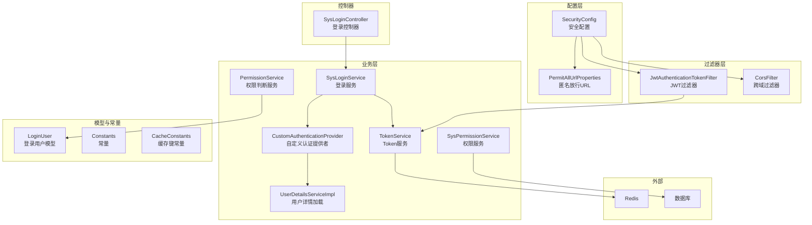
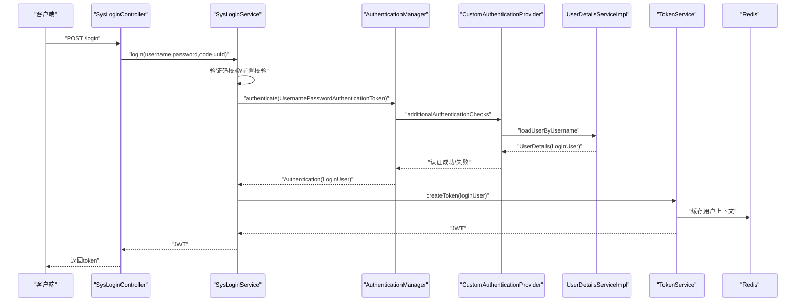
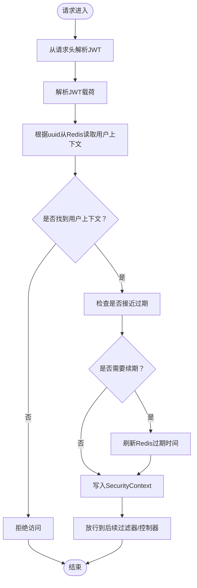
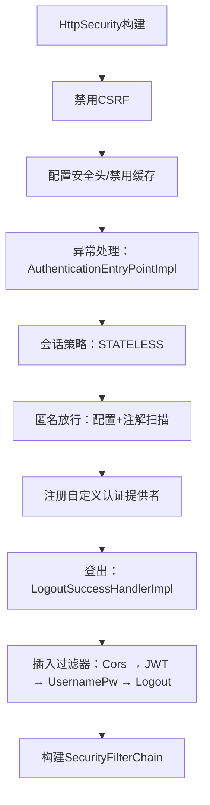
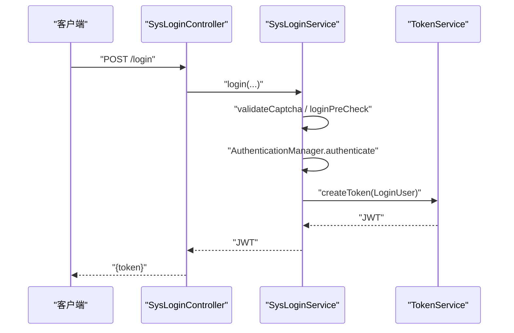
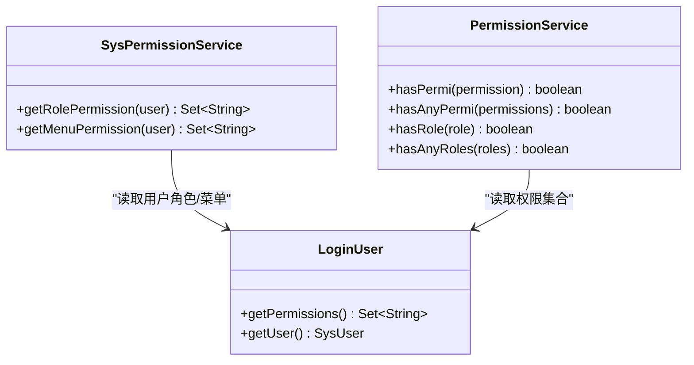
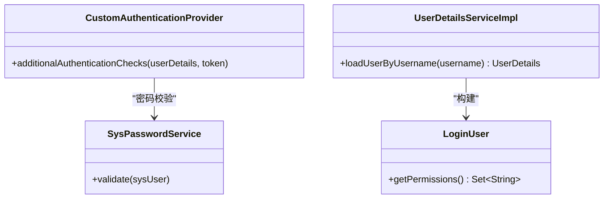
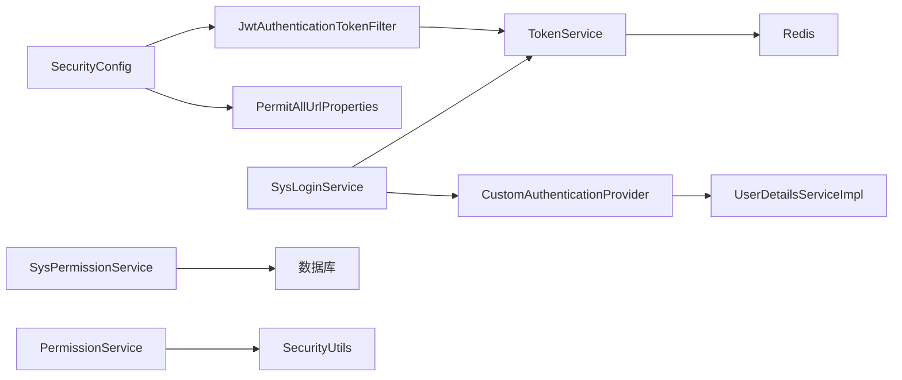

# 用户认证与权限管理

<cite>
**本文引用的文件**
- [SecurityConfig.java](file://blog-framework/src/main/java/blog/framework/config/SecurityConfig.java)
- [JwtAuthenticationTokenFilter.java](file://blog-framework/src/main/java/blog/framework/security/filter/JwtAuthenticationTokenFilter.java)
- [TokenService.java](file://blog-framework/src/main/java/blog/framework/web/service/TokenService.java)
- [UserDetailsServiceImpl.java](file://blog-framework/src/main/java/blog/framework/web/service/UserDetailsServiceImpl.java)
- [CustomAuthenticationProvider.java](file://blog-framework/src/main/java/blog/framework/security/provider/CustomAuthenticationProvider.java)
- [SysLoginService.java](file://blog-framework/src/main/java/blog/framework/web/service/SysLoginService.java)
- [SysPermissionService.java](file://blog-framework/src/main/java/blog/framework/web/service/SysPermissionService.java)
- [PermissionService.java](file://blog-framework/src/main/java/blog/framework/web/service/PermissionService.java)
- [LoginUser.java](file://blog-common/src/main/java/blog/common/core/domain/model/LoginUser.java)
- [PermitAllUrlProperties.java](file://blog-framework/src/main/java/blog/framework/config/properties/PermitAllUrlProperties.java)
- [SysLoginController.java](file://blog-admin/src/main/java/blog/web/controller/system/SysLoginController.java)
- [Constants.java](file://blog-common/src/main/java/blog/common/constant/Constants.java)
- [CacheConstants.java](file://blog-common/src/main/java/blog/common/constant/CacheConstants.java)
- [application.yml](file://blog-admin/src/main/resources/application.yml)
- [AuthenticationContextHolder.java](file://blog-framework/src/main/java/blog/framework/security/context/AuthenticationContextHolder.java)
- [PermissionContextHolder.java](file://blog-framework/src/main/java/blog/framework/security/context/PermissionContextHolder.java)
</cite>

## 目录
1. [简介](#简介)
2. [项目结构](#项目结构)
3. [核心组件](#核心组件)
4. [架构总览](#架构总览)
5. [组件详解](#组件详解)
6. [依赖关系分析](#依赖关系分析)
7. [性能考量](#性能考量)
8. [故障排查指南](#故障排查指南)
9. [结论](#结论)
10. [附录](#附录)

## 简介
本文件面向开发者与运维人员，系统性阐述本博客系统的用户认证与权限管理体系，覆盖以下主题：
- JWT（JSON Web Token）认证机制：Token生成、验证、续期与过期处理
- Spring Security 安全配置：过滤器链、匿名放行、会话策略、异常处理与登出
- 用户登录流程：从用户名密码校验到Token发放的完整链路
- 权限控制策略：基于角色的访问控制（RBAC）、接口权限与数据权限
- 会话与Token管理：Redis存储、过期与续期、跨域与安全头
- 最佳实践与常见问题解决方案

## 项目结构
围绕认证与权限的关键模块分布如下：
- 配置层：Spring Security 安全配置、匿名放行URL收集、BCrypt密码编码器
- 过滤器层：JWT请求拦截与解析、跨域过滤器
- 业务层：登录服务、用户详情加载、权限服务、密码服务
- 模型与常量：登录用户模型、JWT与缓存键常量
- 控制器：登录、获取用户信息、路由树等

图表来源
- [SecurityConfig.java:94-127](file://blog-framework/src/main/java/blog/framework/config/SecurityConfig.java#L94-L127)
- [JwtAuthenticationTokenFilter.java:26-51](file://blog-framework/src/main/java/blog/framework/security/filter/JwtAuthenticationTokenFilter.java#L26-L51)
- [TokenService.java:32-213](file://blog-framework/src/main/java/blog/framework/web/service/TokenService.java#L32-L213)
- [UserDetailsServiceImpl.java:23-57](file://blog-framework/src/main/java/blog/framework/web/service/UserDetailsServiceImpl.java#L23-L57)
- [CustomAuthenticationProvider.java:24-60](file://blog-framework/src/main/java/blog/framework/security/provider/CustomAuthenticationProvider.java#L24-L60)
- [SysLoginService.java:36-166](file://blog-framework/src/main/java/blog/framework/web/service/SysLoginService.java#L36-L166)
- [SysPermissionService.java:22-76](file://blog-framework/src/main/java/blog/framework/web/service/SysPermissionService.java#L22-L76)
- [PermissionService.java:19-139](file://blog-framework/src/main/java/blog/framework/web/service/PermissionService.java#L19-L139)
- [LoginUser.java:16-235](file://blog-common/src/main/java/blog/common/core/domain/model/LoginUser.java#L16-L235)
- [PermitAllUrlProperties.java:27-77](file://blog-framework/src/main/java/blog/framework/config/properties/PermitAllUrlProperties.java#L27-L77)
- [SysLoginController.java:33-124](file://blog-admin/src/main/java/blog/web/controller/system/SysLoginController.java#L33-L124)
- [CacheConstants.java:8-44](file://blog-common/src/main/java/blog/common/constant/CacheConstants.java#L8-L44)
- [Constants.java:12-235](file://blog-common/src/main/java/blog/common/constant/Constants.java#L12-L235)

章节来源
- [SecurityConfig.java:94-127](file://blog-framework/src/main/java/blog/framework/config/SecurityConfig.java#L94-L127)
- [PermitAllUrlProperties.java:27-77](file://blog-framework/src/main/java/blog/framework/config/properties/PermitAllUrlProperties.java#L27-L77)

## 核心组件
- 安全配置与过滤器链
  - 禁用CSRF，启用方法级安全注解，配置无状态会话策略
  - 放行匿名访问路径（含配置项与注解扫描）
  - 注入JWT过滤器与跨域过滤器，确保在用户名密码过滤器之前执行
- JWT与Token服务
  - 使用HS512签名算法生成与解析JWT
  - 令牌有效期与“最后20分钟内自动续期”策略
  - Redis存储登录用户上下文，键前缀统一管理
- 用户认证与权限
  - 自定义认证提供者：在认证流程中执行密码校验与失败次数限制
  - 用户详情加载：按用户名查询用户并构建登录用户模型
  - 权限服务：基于角色与菜单生成权限集合，支持管理员全权限
  - 权限判断服务：对外提供hasPermi/hasRole等便捷方法
- 登录控制器
  - 提供登录接口，返回JWT令牌
  - 提供获取用户信息与路由树接口

章节来源
- [SecurityConfig.java:94-127](file://blog-framework/src/main/java/blog/framework/config/SecurityConfig.java#L94-L127)
- [TokenService.java:32-213](file://blog-framework/src/main/java/blog/framework/web/service/TokenService.java#L32-L213)
- [UserDetailsServiceImpl.java:23-57](file://blog-framework/src/main/java/blog/framework/web/service/UserDetailsServiceImpl.java#L23-L57)
- [CustomAuthenticationProvider.java:24-60](file://blog-framework/src/main/java/blog/framework/security/provider/CustomAuthenticationProvider.java#L24-L60)
- [SysPermissionService.java:22-76](file://blog-framework/src/main/java/blog/framework/web/service/SysPermissionService.java#L22-L76)
- [PermissionService.java:19-139](file://blog-framework/src/main/java/blog/framework/web/service/PermissionService.java#L19-L139)
- [SysLoginController.java:33-124](file://blog-admin/src/main/java/blog/web/controller/system/SysLoginController.java#L33-L124)

## 架构总览
下图展示从客户端到后端的认证与权限控制整体流程。

图表来源
- [SysLoginController.java:56-64](file://blog-admin/src/main/java/blog/web/controller/system/SysLoginController.java#L56-L64)
- [SysLoginService.java:62-98](file://blog-framework/src/main/java/blog/framework/web/service/SysLoginService.java#L62-L98)
- [CustomAuthenticationProvider.java:51-57](file://blog-framework/src/main/java/blog/framework/security/provider/CustomAuthenticationProvider.java#L51-L57)
- [UserDetailsServiceImpl.java:33-51](file://blog-framework/src/main/java/blog/framework/web/service/UserDetailsServiceImpl.java#L33-L51)
- [TokenService.java:105-115](file://blog-framework/src/main/java/blog/framework/web/service/TokenService.java#L105-L115)

## 组件详解

### JWT认证机制与Token服务
- 令牌生成
  - 生成随机UUID作为令牌标识，填充UA/IP/位置/浏览器/操作系统等信息
  - 构造JWT载荷，包含用户标识与用户名，使用HS512签名
  - 将登录用户上下文写入Redis，键前缀与过期时间来自配置
- 令牌验证与续期
  - 请求到达时从请求头解析Bearer令牌
  - 解析JWT获取用户标识，从Redis读取登录用户上下文
  - 若距离过期不足20分钟则刷新Redis过期时间
  - 将认证信息写入SecurityContext，供后续权限判断使用
- 配置要点
  - 令牌头名、密钥、有效期均来自配置文件
  - Redis用于存放用户上下文，避免服务端存储状态

图表来源
- [JwtAuthenticationTokenFilter.java:38-49](file://blog-framework/src/main/java/blog/framework/security/filter/JwtAuthenticationTokenFilter.java#L38-L49)
- [TokenService.java:62-78](file://blog-framework/src/main/java/blog/framework/web/service/TokenService.java#L62-L78)
- [TokenService.java:123-129](file://blog-framework/src/main/java/blog/framework/web/service/TokenService.java#L123-L129)
- [TokenService.java:136-142](file://blog-framework/src/main/java/blog/framework/web/service/TokenService.java#L136-L142)

章节来源
- [TokenService.java:32-213](file://blog-framework/src/main/java/blog/framework/web/service/TokenService.java#L32-L213)
- [JwtAuthenticationTokenFilter.java:26-51](file://blog-framework/src/main/java/blog/framework/security/filter/JwtAuthenticationTokenFilter.java#L26-L51)
- [application.yml:90-98](file://blog-admin/src/main/resources/application.yml#L90-L98)
- [CacheConstants.java:8-44](file://blog-common/src/main/java/blog/common/constant/CacheConstants.java#L8-L44)

### Spring Security安全配置
- 关键点
  - 禁用CSRF，开启方法级安全注解（@PreAuthorize等）
  - 无状态会话策略（STATELESS），避免Session
  - 匿名放行：配置文件静态资源与特定路径，同时扫描带@Anonymous注解的接口
  - 过滤器链：CorsFilter → JwtAuthenticationTokenFilter → UsernamePasswordAuthenticationFilter → LogoutFilter
  - 登出：自定义登出处理器
  - 认证提供者：注册自定义Provider，密码编码器采用BCrypt

图表来源
- [SecurityConfig.java:94-127](file://blog-framework/src/main/java/blog/framework/config/SecurityConfig.java#L94-L127)
- [PermitAllUrlProperties.java:37-62](file://blog-framework/src/main/java/blog/framework/config/properties/PermitAllUrlProperties.java#L37-L62)

章节来源
- [SecurityConfig.java:94-127](file://blog-framework/src/main/java/blog/framework/config/SecurityConfig.java#L94-L127)
- [PermitAllUrlProperties.java:27-77](file://blog-framework/src/main/java/blog/framework/config/properties/PermitAllUrlProperties.java#L27-L77)

### 登录流程与控制器
- 登录接口
  - 接收用户名、密码、验证码与唯一标识
  - 校验验证码与前置条件
  - 触发认证流程，认证成功后生成JWT并记录登录信息
- 用户信息与路由
  - 获取用户信息：角色、权限集合、是否首次修改密码、密码是否过期
  - 获取路由树：按用户ID查询菜单树并构建前端路由

图表来源
- [SysLoginController.java:56-64](file://blog-admin/src/main/java/blog/web/controller/system/SysLoginController.java#L56-L64)
- [SysLoginService.java:62-98](file://blog-framework/src/main/java/blog/framework/web/service/SysLoginService.java#L62-L98)
- [TokenService.java:105-115](file://blog-framework/src/main/java/blog/framework/web/service/TokenService.java#L105-L115)

章节来源
- [SysLoginController.java:33-124](file://blog-admin/src/main/java/blog/web/controller/system/SysLoginController.java#L33-L124)
- [SysLoginService.java:36-166](file://blog-framework/src/main/java/blog/framework/web/service/SysLoginService.java#L36-L166)

### 权限控制策略
- RBAC模型
  - 角色权限：管理员拥有所有角色；普通用户按角色查询权限
  - 菜单权限：管理员拥有所有菜单；普通用户按角色或直接查询菜单权限
- 接口权限
  - 方法级注解：@PreAuthorize、@Secured等由@EnableMethodSecurity启用
  - 接口匿名放行：通过配置与@Anonymous注解动态收集
- 数据权限
  - 通过权限集合与业务规则结合，实现数据级过滤（例如部门/岗位维度）

图表来源
- [SysPermissionService.java:22-76](file://blog-framework/src/main/java/blog/framework/web/service/SysPermissionService.java#L22-L76)
- [PermissionService.java:19-139](file://blog-framework/src/main/java/blog/framework/web/service/PermissionService.java#L19-L139)
- [LoginUser.java:16-235](file://blog-common/src/main/java/blog/common/core/domain/model/LoginUser.java#L16-L235)

章节来源
- [SysPermissionService.java:22-76](file://blog-framework/src/main/java/blog/framework/web/service/SysPermissionService.java#L22-L76)
- [PermissionService.java:19-139](file://blog-framework/src/main/java/blog/framework/web/service/PermissionService.java#L19-L139)
- [SecurityConfig.java:31](file://blog-framework/src/main/java/blog/framework/config/SecurityConfig.java#L31)

### 用户认证提供者与密码校验
- 自定义认证提供者
  - 继承DaoAuthenticationProvider，重写密码校验逻辑
  - 在认证流程中调用密码服务执行校验与失败次数限制
- 用户详情加载
  - 按用户名查询用户，校验状态，构建LoginUser并注入菜单权限

图表来源
- [CustomAuthenticationProvider.java:24-60](file://blog-framework/src/main/java/blog/framework/security/provider/CustomAuthenticationProvider.java#L24-L60)
- [UserDetailsServiceImpl.java:23-57](file://blog-framework/src/main/java/blog/framework/web/service/UserDetailsServiceImpl.java#L23-L57)
- [LoginUser.java:16-235](file://blog-common/src/main/java/blog/common/core/domain/model/LoginUser.java#L16-L235)

章节来源
- [CustomAuthenticationProvider.java:24-60](file://blog-framework/src/main/java/blog/framework/security/provider/CustomAuthenticationProvider.java#L24-L60)
- [UserDetailsServiceImpl.java:23-57](file://blog-framework/src/main/java/blog/framework/web/service/UserDetailsServiceImpl.java#L23-L57)

## 依赖关系分析
- 组件耦合
  - SecurityConfig集中装配过滤器与匿名放行策略，耦合度低但影响面广
  - TokenService与Redis强耦合，负责用户上下文持久化与续期
  - SysLoginService串联认证与Token生成，承担登录入口职责
  - PermissionService依赖SecurityUtils与上下文，提供便捷权限判断
- 外部依赖
  - Redis：用户上下文缓存
  - 数据库：用户、角色、菜单、权限数据
  - 配置文件：JWT头名、密钥、有效期、验证码开关等

图表来源
- [SecurityConfig.java:94-127](file://blog-framework/src/main/java/blog/framework/config/SecurityConfig.java#L94-L127)
- [JwtAuthenticationTokenFilter.java:26-51](file://blog-framework/src/main/java/blog/framework/security/filter/JwtAuthenticationTokenFilter.java#L26-L51)
- [TokenService.java:32-213](file://blog-framework/src/main/java/blog/framework/web/service/TokenService.java#L32-L213)
- [SysLoginService.java:36-166](file://blog-framework/src/main/java/blog/framework/web/service/SysLoginService.java#L36-L166)
- [CustomAuthenticationProvider.java:24-60](file://blog-framework/src/main/java/blog/framework/security/provider/CustomAuthenticationProvider.java#L24-L60)
- [UserDetailsServiceImpl.java:23-57](file://blog-framework/src/main/java/blog/framework/web/service/UserDetailsServiceImpl.java#L23-L57)
- [SysPermissionService.java:22-76](file://blog-framework/src/main/java/blog/framework/web/service/SysPermissionService.java#L22-L76)
- [PermissionService.java:19-139](file://blog-framework/src/main/java/blog/framework/web/service/PermissionService.java#L19-L139)

章节来源
- [SecurityConfig.java:94-127](file://blog-framework/src/main/java/blog/framework/config/SecurityConfig.java#L94-L127)
- [TokenService.java:32-213](file://blog-framework/src/main/java/blog/framework/web/service/TokenService.java#L32-L213)
- [SysLoginService.java:36-166](file://blog-framework/src/main/java/blog/framework/web/service/SysLoginService.java#L36-L166)

## 性能考量
- 无状态设计
  - 基于JWT与Redis的组合，避免Session占用，适合水平扩展
- Redis热点
  - 用户上下文频繁读取，建议合理设置过期时间与内存优化
- 过期续期
  - “最后20分钟内自动续期”减少频繁重建上下文的开销
- 过滤器顺序
  - 将JWT过滤器置于用户名密码过滤器之前，避免重复认证

[本节为通用指导，无需列出具体文件来源]

## 故障排查指南
- 登录失败
  - 验证码错误/过期：检查验证码开关与Redis键值
  - 用户名或密码不合法：检查前置校验与长度限制
  - 密码错误次数过多：检查密码服务与锁定策略
- 认证失败
  - JWT无效或过期：确认签名密钥、头部名与有效期
  - Redis中无用户上下文：确认TokenService是否正确写入
- 权限不足
  - 方法级注解未生效：确认@EnableMethodSecurity已启用
  - 权限集合为空：确认UserDetails构建时注入了菜单权限
- 跨域问题
  - CORS过滤器顺序：确保CorsFilter在JWT与LogoutFilter之间

章节来源
- [SysLoginService.java:108-155](file://blog-framework/src/main/java/blog/framework/web/service/SysLoginService.java#L108-L155)
- [TokenService.java:62-78](file://blog-framework/src/main/java/blog/framework/web/service/TokenService.java#L62-L78)
- [SecurityConfig.java:31](file://blog-framework/src/main/java/blog/framework/config/SecurityConfig.java#L31)
- [PermitAllUrlProperties.java:37-62](file://blog-framework/src/main/java/blog/framework/config/properties/PermitAllUrlProperties.java#L37-L62)

## 结论
本系统采用“无状态+JWT+Redis”的认证方案，配合Spring Security的过滤器链与方法级权限注解，实现了清晰、可扩展的认证与权限控制体系。通过合理的配置与组件分工，既保证了安全性，也兼顾了性能与可维护性。建议在生产环境中进一步完善安全基线（如HTTPS、速率限制、审计日志）与监控告警。

[本节为总结性内容，无需列出具体文件来源]

## 附录

### 配置项参考
- JWT相关
  - 令牌头名：Authorization
  - 密钥：abcdefghijklmnopqrstuvwxyz
  - 有效期：分钟
- Redis与验证码
  - Redis地址、端口、密码、数据库
  - 验证码有效期与开关

章节来源
- [application.yml:90-98](file://blog-admin/src/main/resources/application.yml#L90-L98)
- [application.yml:65-89](file://blog-admin/src/main/resources/application.yml#L65-L89)

### 常用常量
- 令牌前缀：Bearer
- 登录用户键：login_tokens: + uuid
- 验证码键：captcha_codes: + uuid
- 管理员角色：admin
- 全部权限：*:*:*

章节来源
- [Constants.java:104-127](file://blog-common/src/main/java/blog/common/constant/Constants.java#L104-L127)
- [CacheConstants.java:10-17](file://blog-common/src/main/java/blog/common/constant/CacheConstants.java#L10-L17)