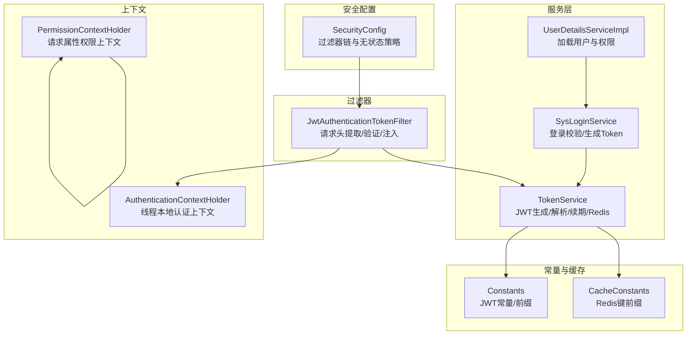
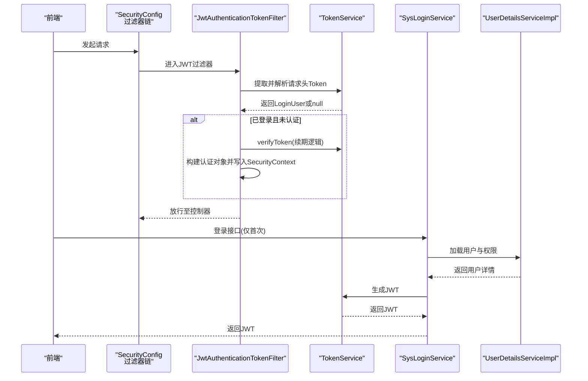
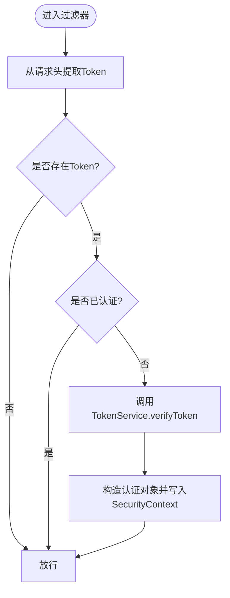
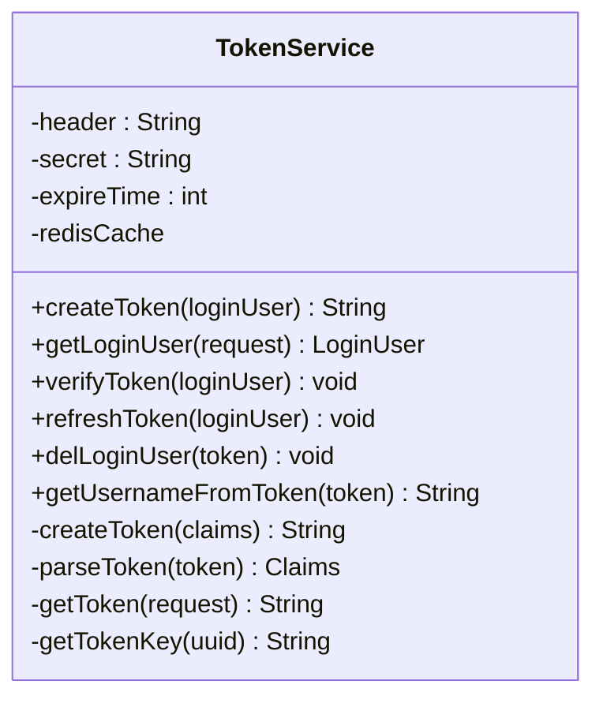
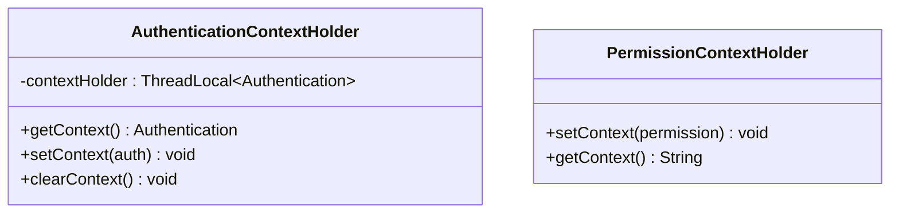
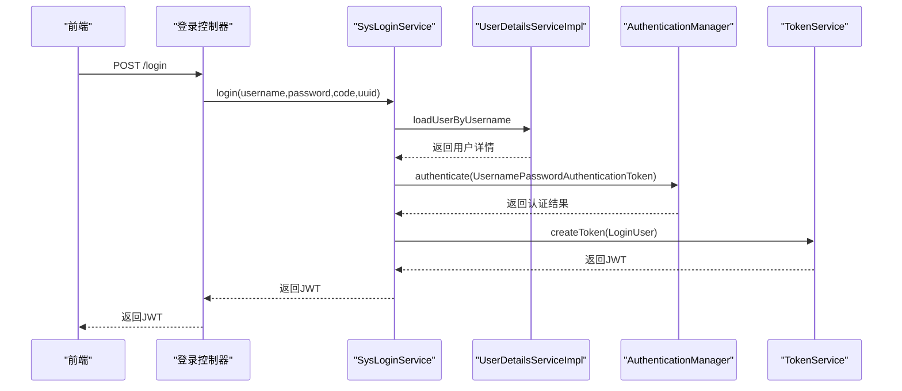
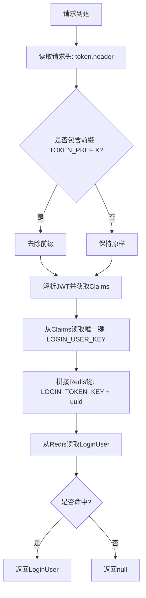
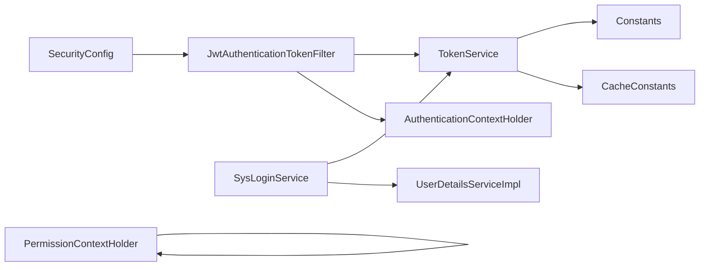

# JWT认证机制

<cite>
**本文引用的文件**
- [JwtAuthenticationTokenFilter.java](file://blog-framework/src/main/java/blog/framework/security/filter/JwtAuthenticationTokenFilter.java)
- [TokenService.java](file://blog-framework/src/main/java/blog/framework/web/service/TokenService.java)
- [SecurityConfig.java](file://blog-framework/src/main/java/blog/framework/config/SecurityConfig.java)
- [SysLoginService.java](file://blog-framework/src/main/java/blog/framework/web/service/SysLoginService.java)
- [UserDetailsServiceImpl.java](file://blog-framework/src/main/java/blog/framework/web/service/UserDetailsServiceImpl.java)
- [AuthenticationContextHolder.java](file://blog-framework/src/main/java/blog/framework/security/context/AuthenticationContextHolder.java)
- [PermissionContextHolder.java](file://blog-framework/src/main/java/blog/framework/security/context/PermissionContextHolder.java)
- [Constants.java](file://blog-common/src/main/java/blog/common/constant/Constants.java)
- [CacheConstants.java](file://blog-common/src/main/java/blog/common/constant/CacheConstants.java)
- [application.yml](file://blog-admin/src/main/resources/application.yml)
- [session-ses_2bcc.md](file://session-ses_2bcc.md)
</cite>

## 目录
1. [简介](#简介)
2. [项目结构](#项目结构)
3. [核心组件](#核心组件)
4. [架构总览](#架构总览)
5. [详细组件分析](#详细组件分析)
6. [依赖分析](#依赖分析)
7. [性能考量](#性能考量)
8. [故障排查指南](#故障排查指南)
9. [结论](#结论)
10. [附录](#附录)

## 简介
本文件系统性阐述Leejie博客系统的JWT认证机制，覆盖以下要点：
- JWT工作原理与在本项目中的落地：生成、签名、验证、解析
- JwtAuthenticationTokenFilter的实现与请求拦截逻辑
- TokenService的服务能力：创建、刷新、失效处理、从请求头提取与解析
- 认证上下文管理：AuthenticationContextHolder与PermissionContextHolder
- 安全最佳实践：密钥管理、过期时间、传输安全
- 完整认证流程图与时序图，配合代码片段路径定位

## 项目结构
围绕JWT认证的关键模块分布如下：
- 安全配置层：SecurityConfig定义过滤器链、无状态策略、匿名放行规则
- 过滤器层：JwtAuthenticationTokenFilter负责从请求头提取并验证Token，注入SecurityContext
- 业务服务层：TokenService封装JWT生成/解析、Redis存储、Token续期；SysLoginService完成登录校验并生成Token
- 用户详情服务：UserDetailsServiceImpl加载用户与权限
- 上下文工具：AuthenticationContextHolder与PermissionContextHolder分别管理认证上下文与权限上下文
- 常量与缓存键：Constants与CacheConstants统一约定JWT相关常量与Redis键前缀

图表来源
- [SecurityConfig.java:94-126](file://blog-framework/src/main/java/blog/framework/config/SecurityConfig.java#L94-L126)
- [JwtAuthenticationTokenFilter.java:27-49](file://blog-framework/src/main/java/blog/framework/security/filter/JwtAuthenticationTokenFilter.java#L27-L49)
- [TokenService.java:32-212](file://blog-framework/src/main/java/blog/framework/web/service/TokenService.java#L32-L212)
- [SysLoginService.java:36-98](file://blog-framework/src/main/java/blog/framework/web/service/SysLoginService.java#L36-L98)
- [UserDetailsServiceImpl.java:23-55](file://blog-framework/src/main/java/blog/framework/web/service/UserDetailsServiceImpl.java#L23-L55)
- [AuthenticationContextHolder.java:10-23](file://blog-framework/src/main/java/blog/framework/security/context/AuthenticationContextHolder.java#L10-L23)
- [PermissionContextHolder.java:12-23](file://blog-framework/src/main/java/blog/framework/security/context/PermissionContextHolder.java#L12-L23)
- [Constants.java:104-121](file://blog-common/src/main/java/blog/common/constant/Constants.java#L104-L121)
- [CacheConstants.java:12](file://blog-common/src/main/java/blog/common/constant/CacheConstants.java#L12)

章节来源
- [SecurityConfig.java:94-126](file://blog-framework/src/main/java/blog/framework/config/SecurityConfig.java#L94-L126)
- [JwtAuthenticationTokenFilter.java:27-49](file://blog-framework/src/main/java/blog/framework/security/filter/JwtAuthenticationTokenFilter.java#L27-L49)
- [TokenService.java:32-212](file://blog-framework/src/main/java/blog/framework/web/service/TokenService.java#L32-L212)
- [SysLoginService.java:36-98](file://blog-framework/src/main/java/blog/framework/web/service/SysLoginService.java#L36-L98)
- [UserDetailsServiceImpl.java:23-55](file://blog-framework/src/main/java/blog/framework/web/service/UserDetailsServiceImpl.java#L23-L55)
- [AuthenticationContextHolder.java:10-23](file://blog-framework/src/main/java/blog/framework/security/context/AuthenticationContextHolder.java#L10-L23)
- [PermissionContextHolder.java:12-23](file://blog-framework/src/main/java/blog/framework/security/context/PermissionContextHolder.java#L12-L23)
- [Constants.java:104-121](file://blog-common/src/main/java/blog/common/constant/Constants.java#L104-L121)
- [CacheConstants.java:12](file://blog-common/src/main/java/blog/common/constant/CacheConstants.java#L12)

## 核心组件
- JwtAuthenticationTokenFilter：每请求一次，从请求头提取Token，若未认证则验证并解析，构建认证对象写入SecurityContext
- TokenService：负责JWT生成/解析、从请求头提取Token、Redis存储与续期、用户UA/IP等环境信息记录
- SecurityConfig：禁用CSRF、无状态Session、配置匿名放行URL、注册JWT过滤器与CORS过滤器
- SysLoginService：登录校验（验证码、前置检查）、触发认证流程、生成JWT并返回
- UserDetailsServiceImpl：按用户名加载用户、校验状态、装配权限
- AuthenticationContextHolder/PermissionContextHolder：分别提供线程本地认证上下文与请求属性权限上下文

章节来源
- [JwtAuthenticationTokenFilter.java:27-49](file://blog-framework/src/main/java/blog/framework/security/filter/JwtAuthenticationTokenFilter.java#L27-L49)
- [TokenService.java:32-212](file://blog-framework/src/main/java/blog/framework/web/service/TokenService.java#L32-L212)
- [SecurityConfig.java:94-126](file://blog-framework/src/main/java/blog/framework/config/SecurityConfig.java#L94-L126)
- [SysLoginService.java:62-98](file://blog-framework/src/main/java/blog/framework/web/service/SysLoginService.java#L62-L98)
- [UserDetailsServiceImpl.java:33-55](file://blog-framework/src/main/java/blog/framework/web/service/UserDetailsServiceImpl.java#L33-L55)
- [AuthenticationContextHolder.java:10-23](file://blog-framework/src/main/java/blog/framework/security/context/AuthenticationContextHolder.java#L10-L23)
- [PermissionContextHolder.java:12-23](file://blog-framework/src/main/java/blog/framework/security/context/PermissionContextHolder.java#L12-L23)

## 架构总览
JWT认证在本项目采用“无状态+前后端分离”的模式：
- 前端登录成功后获得JWT，后续请求在请求头携带该Token
- 后端过滤器链在进入业务控制器前，先由JwtAuthenticationTokenFilter解析并验证Token，注入认证上下文
- 业务层通过SecurityContext获取当前用户身份，结合权限上下文进行授权控制

图表来源
- [SecurityConfig.java:94-126](file://blog-framework/src/main/java/blog/framework/config/SecurityConfig.java#L94-L126)
- [JwtAuthenticationTokenFilter.java:38-49](file://blog-framework/src/main/java/blog/framework/security/filter/JwtAuthenticationTokenFilter.java#L38-L49)
- [TokenService.java:62-78](file://blog-framework/src/main/java/blog/framework/web/service/TokenService.java#L62-L78)
- [SysLoginService.java:62-98](file://blog-framework/src/main/java/blog/framework/web/service/SysLoginService.java#L62-L98)
- [UserDetailsServiceImpl.java:33-55](file://blog-framework/src/main/java/blog/framework/web/service/UserDetailsServiceImpl.java#L33-L55)

## 详细组件分析

### JwtAuthenticationTokenFilter 实现机制
职责与流程：
- 从请求头读取Token（支持前缀剥离）
- 若存在且尚未认证，调用TokenService验证并解析
- 构造UsernamePasswordAuthenticationToken并写入SecurityContext
- 放行至后续过滤器与控制器

图表来源
- [JwtAuthenticationTokenFilter.java:38-49](file://blog-framework/src/main/java/blog/framework/security/filter/JwtAuthenticationTokenFilter.java#L38-L49)
- [TokenService.java:123-129](file://blog-framework/src/main/java/blog/framework/web/service/TokenService.java#L123-L129)

章节来源
- [JwtAuthenticationTokenFilter.java:27-49](file://blog-framework/src/main/java/blog/framework/security/filter/JwtAuthenticationTokenFilter.java#L27-L49)
- [TokenService.java:62-78](file://blog-framework/src/main/java/blog/framework/web/service/TokenService.java#L62-L78)

### TokenService 服务实现
核心能力：
- 令牌创建：生成UUID作为token标识，填充UA/IP/OS等信息，写入Redis并生成JWT
- 令牌解析：从请求头提取并解析JWT，根据payload中的唯一键从Redis恢复LoginUser
- 令牌续期：当剩余有效期小于阈值（20分钟）自动刷新Redis过期时间
- 令牌失效：提供删除Redis中用户缓存的方法
- 从JWT提取用户名：基于Claims.subject

图表来源
- [TokenService.java:32-212](file://blog-framework/src/main/java/blog/framework/web/service/TokenService.java#L32-L212)

章节来源
- [TokenService.java:32-212](file://blog-framework/src/main/java/blog/framework/web/service/TokenService.java#L32-L212)
- [Constants.java:104-121](file://blog-common/src/main/java/blog/common/constant/Constants.java#L104-L121)
- [CacheConstants.java:12](file://blog-common/src/main/java/blog/common/constant/CacheConstants.java#L12)

### 认证上下文管理机制
- AuthenticationContextHolder：以ThreadLocal保存当前线程的Authentication，便于业务层随时获取当前用户
- PermissionContextHolder：以RequestAttributes保存权限字符串，适合在请求范围内传递权限上下文

图表来源
- [AuthenticationContextHolder.java:10-23](file://blog-framework/src/main/java/blog/framework/security/context/AuthenticationContextHolder.java#L10-L23)
- [PermissionContextHolder.java:12-23](file://blog-framework/src/main/java/blog/framework/security/context/PermissionContextHolder.java#L12-L23)

章节来源
- [AuthenticationContextHolder.java:10-23](file://blog-framework/src/main/java/blog/framework/security/context/AuthenticationContextHolder.java#L10-L23)
- [PermissionContextHolder.java:12-23](file://blog-framework/src/main/java/blog/framework/security/context/PermissionContextHolder.java#L12-L23)

### 登录与认证流程（时序）

图表来源
- [SysLoginService.java:62-98](file://blog-framework/src/main/java/blog/framework/web/service/SysLoginService.java#L62-L98)
- [UserDetailsServiceImpl.java:33-55](file://blog-framework/src/main/java/blog/framework/web/service/UserDetailsServiceImpl.java#L33-L55)
- [TokenService.java:105-115](file://blog-framework/src/main/java/blog/framework/web/service/TokenService.java#L105-L115)

章节来源
- [SysLoginService.java:62-98](file://blog-framework/src/main/java/blog/framework/web/service/SysLoginService.java#L62-L98)
- [UserDetailsServiceImpl.java:33-55](file://blog-framework/src/main/java/blog/framework/web/service/UserDetailsServiceImpl.java#L33-L55)
- [TokenService.java:105-115](file://blog-framework/src/main/java/blog/framework/web/service/TokenService.java#L105-L115)

### 请求头提取与解析流程（算法）

图表来源
- [TokenService.java:62-78](file://blog-framework/src/main/java/blog/framework/web/service/TokenService.java#L62-L78)
- [Constants.java:104-121](file://blog-common/src/main/java/blog/common/constant/Constants.java#L104-L121)
- [CacheConstants.java:12](file://blog-common/src/main/java/blog/common/constant/CacheConstants.java#L12)

章节来源
- [TokenService.java:62-78](file://blog-framework/src/main/java/blog/framework/web/service/TokenService.java#L62-L78)
- [Constants.java:104-121](file://blog-common/src/main/java/blog/common/constant/Constants.java#L104-L121)
- [CacheConstants.java:12](file://blog-common/src/main/java/blog/common/constant/CacheConstants.java#L12)

## 依赖分析
- 过滤器链依赖：SecurityConfig注册JwtAuthenticationTokenFilter与CORS过滤器，确保JWT在用户名密码过滤器之前执行
- 服务依赖：JwtAuthenticationTokenFilter依赖TokenService；SysLoginService依赖TokenService与UserDetailsServiceImpl
- 常量依赖：TokenService依赖Constants与CacheConstants进行JWT与Redis键的统一管理
- 上下文依赖：业务层通过SecurityContext与自定义上下文工具获取认证与权限信息

图表来源
- [SecurityConfig.java:94-126](file://blog-framework/src/main/java/blog/framework/config/SecurityConfig.java#L94-L126)
- [JwtAuthenticationTokenFilter.java:27-49](file://blog-framework/src/main/java/blog/framework/security/filter/JwtAuthenticationTokenFilter.java#L27-L49)
- [TokenService.java:32-212](file://blog-framework/src/main/java/blog/framework/web/service/TokenService.java#L32-L212)
- [SysLoginService.java:36-98](file://blog-framework/src/main/java/blog/framework/web/service/SysLoginService.java#L36-L98)
- [UserDetailsServiceImpl.java:23-55](file://blog-framework/src/main/java/blog/framework/web/service/UserDetailsServiceImpl.java#L23-L55)
- [Constants.java:104-121](file://blog-common/src/main/java/blog/common/constant/Constants.java#L104-L121)
- [CacheConstants.java:12](file://blog-common/src/main/java/blog/common/constant/CacheConstants.java#L12)

章节来源
- [SecurityConfig.java:94-126](file://blog-framework/src/main/java/blog/framework/config/SecurityConfig.java#L94-L126)
- [JwtAuthenticationTokenFilter.java:27-49](file://blog-framework/src/main/java/blog/framework/security/filter/JwtAuthenticationTokenFilter.java#L27-L49)
- [TokenService.java:32-212](file://blog-framework/src/main/java/blog/framework/web/service/TokenService.java#L32-L212)
- [SysLoginService.java:36-98](file://blog-framework/src/main/java/blog/framework/web/service/SysLoginService.java#L36-L98)
- [UserDetailsServiceImpl.java:23-55](file://blog-framework/src/main/java/blog/framework/web/service/UserDetailsServiceImpl.java#L23-L55)
- [Constants.java:104-121](file://blog-common/src/main/java/blog/common/constant/Constants.java#L104-L121)
- [CacheConstants.java:12](file://blog-common/src/main/java/blog/common/constant/CacheConstants.java#L12)

## 性能考量
- 无状态设计：基于JWT无需服务端会话存储，降低服务器内存压力
- Redis热点：LoginUser在Redis中按UUID键缓存，建议合理设置过期时间与容量，避免热键
- 续期策略：临近过期（20分钟）自动续期，减少频繁登录带来的用户体验问题
- 过滤器链优化：CORS与JWT过滤器顺序合理，避免重复解析与认证

## 故障排查指南
常见问题与定位思路：
- Token无效或解析异常：检查请求头是否正确携带、前缀是否一致、密钥是否匹配
- 无法获取用户信息：确认Redis中是否存在对应键、是否过期、是否被清理
- 未认证放行：确认JwtAuthenticationTokenFilter是否在UsernamePasswordAuthenticationFilter之前执行
- 登录失败：检查SysLoginService的登录前置校验、验证码校验、用户状态与密码校验

章节来源
- [JwtAuthenticationTokenFilter.java:38-49](file://blog-framework/src/main/java/blog/framework/security/filter/JwtAuthenticationTokenFilter.java#L38-L49)
- [TokenService.java:62-78](file://blog-framework/src/main/java/blog/framework/web/service/TokenService.java#L62-L78)
- [SysLoginService.java:62-98](file://blog-framework/src/main/java/blog/framework/web/service/SysLoginService.java#L62-L98)
- [SecurityConfig.java:94-126](file://blog-framework/src/main/java/blog/framework/config/SecurityConfig.java#L94-L126)

## 结论
本项目的JWT认证机制通过“无状态+前后端分离”实现高可用与易扩展。核心在于：
- 明确的过滤器链与上下文注入
- TokenService对JWT生成、解析、续期与Redis存储的完整封装
- 登录流程与权限加载的清晰边界
- 常量与缓存键的统一约定，提升可维护性

## 附录

### JWT配置最佳实践
- 密钥管理
  - 使用强随机密钥，定期轮换
  - 部署在安全位置，避免硬编码在代码中
- 过期时间
  - 建议短有效期（如30分钟），结合20分钟阈值自动续期
- 安全传输
  - 仅通过HTTPS传输，防止中间人攻击
  - 前端避免将Token持久化在localStorage（可选方案：HttpOnly Cookie）
- 请求头规范
  - 使用标准化前缀（如Bearer），并在后端统一剥离
- Redis安全
  - 限制访问来源、启用密码认证、网络隔离
- 日志与监控
  - 记录认证事件与异常，建立告警机制

章节来源
- [application.yml:390-403](file://blog-admin/src/main/resources/application.yml#L390-L403)
- [TokenService.java:40-46](file://blog-framework/src/main/java/blog/framework/web/service/TokenService.java#L40-L46)
- [Constants.java:104-106](file://blog-common/src/main/java/blog/common/constant/Constants.java#L104-L106)