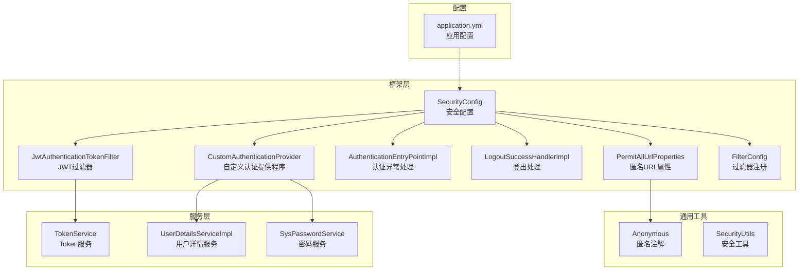
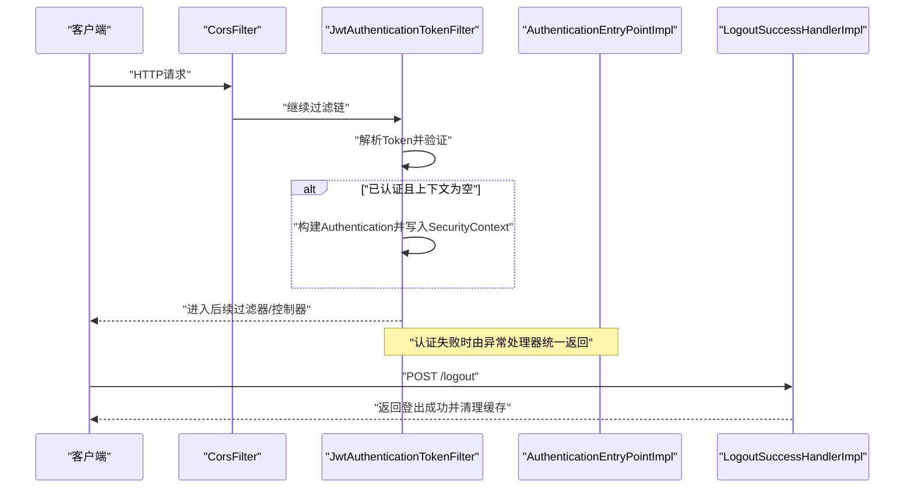
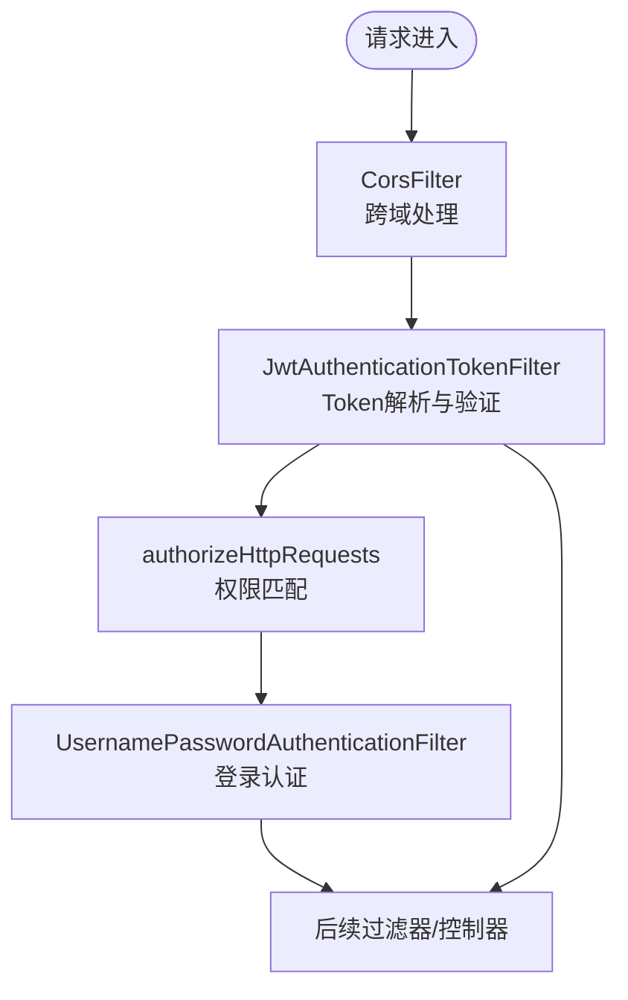
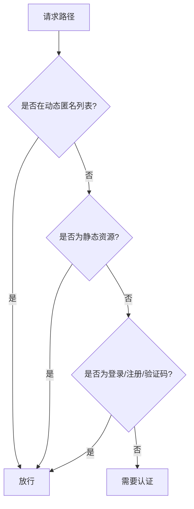
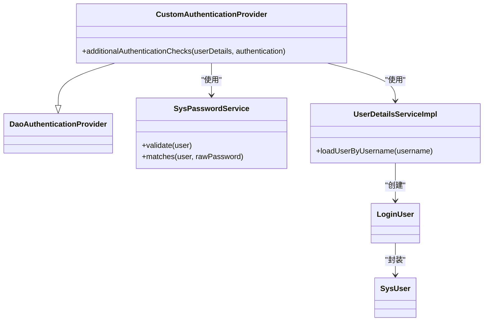
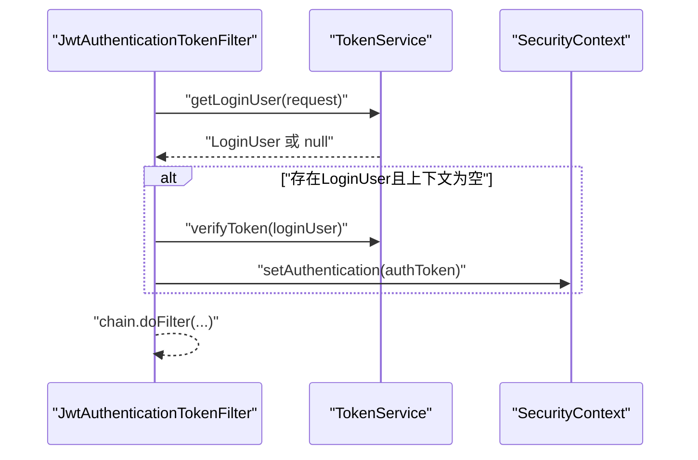
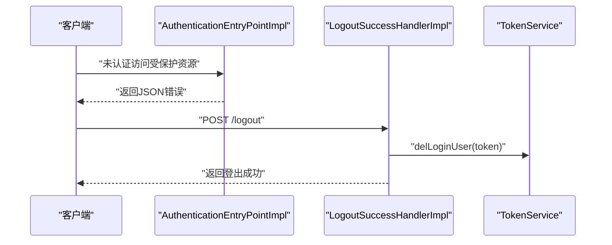
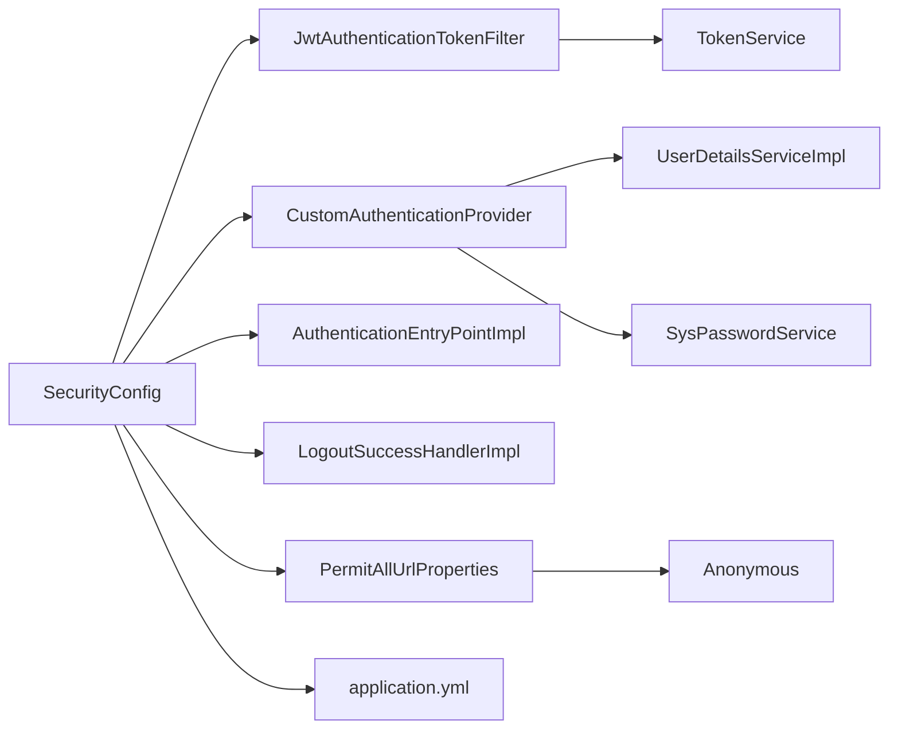

# Spring Security配置

<cite>
**本文引用的文件**
- [SecurityConfig.java](file://blog-framework/src/main/java/blog/framework/config/SecurityConfig.java)
- [JwtAuthenticationTokenFilter.java](file://blog-framework/src/main/java/blog/framework/security/filter/JwtAuthenticationTokenFilter.java)
- [CustomAuthenticationProvider.java](file://blog-framework/src/main/java/blog/framework/security/provider/CustomAuthenticationProvider.java)
- [AuthenticationEntryPointImpl.java](file://blog-framework/src/main/java/blog/framework/security/handle/AuthenticationEntryPointImpl.java)
- [LogoutSuccessHandlerImpl.java](file://blog-framework/src/main/java/blog/framework/security/handle/LogoutSuccessHandlerImpl.java)
- [PermitAllUrlProperties.java](file://blog-framework/src/main/java/blog/framework/config/properties/PermitAllUrlProperties.java)
- [FilterConfig.java](file://blog-framework/src/main/java/blog/framework/config/FilterConfig.java)
- [UserDetailsServiceImpl.java](file://blog-framework/src/main/java/blog/framework/web/service/UserDetailsServiceImpl.java)
- [TokenService.java](file://blog-framework/src/main/java/blog/framework/web/service/TokenService.java)
- [SysPasswordService.java](file://blog-framework/src/main/java/blog/framework/web/service/SysPasswordService.java)
- [Anonymous.java](file://blog-common/src/main/java/blog/common/annotation/Anonymous.java)
- [SecurityUtils.java](file://blog-common/src/main/java/blog/common/utils/SecurityUtils.java)
- [application.yml](file://blog-admin/src/main/resources/application.yml)
</cite>

## 目录
1. [简介](#简介)
2. [项目结构](#项目结构)
3. [核心组件](#核心组件)
4. [架构总览](#架构总览)
5. [详细组件分析](#详细组件分析)
6. [依赖分析](#依赖分析)
7. [性能考虑](#性能考虑)
8. [故障排查指南](#故障排查指南)
9. [结论](#结论)
10. [附录](#附录)

## 简介
本文件面向Leejie博客系统的Spring Security配置，围绕SecurityConfig类展开，系统性阐述以下主题：
- 整体配置思路：CSRF禁用、Session管理、异常处理与基于Token的无状态认证
- 过滤器链设计：CorsFilter、JwtAuthenticationTokenFilter、UsernamePasswordAuthenticationFilter的执行顺序与职责
- 权限控制策略：匿名访问URL配置、静态资源放行、动态权限验证
- 自定义认证提供程序：CustomAuthenticationProvider的集成与扩展点
- 安全配置调试与常见问题：跨域、权限验证失败、密码校验等

## 项目结构
与Spring Security相关的核心代码分布在如下模块与包中：
- blog-framework/config：安全配置与过滤器注册
- blog-framework/security/filter：JWT过滤器
- blog-framework/security/provider：自定义认证提供程序
- blog-framework/security/handle：认证异常与登出处理器
- blog-framework/web/service：用户详情、Token服务、密码服务
- blog-common/annotation：匿名访问注解
- blog-common/utils：安全工具类
- blog-admin/resources：应用配置（含token与跨域相关）

图表来源
- [SecurityConfig.java:1-137](file://blog-framework/src/main/java/blog/framework/config/SecurityConfig.java#L1-L137)
- [JwtAuthenticationTokenFilter.java:1-51](file://blog-framework/src/main/java/blog/framework/security/filter/JwtAuthenticationTokenFilter.java#L1-L51)
- [CustomAuthenticationProvider.java:1-60](file://blog-framework/src/main/java/blog/framework/security/provider/CustomAuthenticationProvider.java#L1-L60)
- [AuthenticationEntryPointImpl.java:1-34](file://blog-framework/src/main/java/blog/framework/security/handle/AuthenticationEntryPointImpl.java#L1-L34)
- [LogoutSuccessHandlerImpl.java:1-52](file://blog-framework/src/main/java/blog/framework/security/handle/LogoutSuccessHandlerImpl.java#L1-L52)
- [PermitAllUrlProperties.java:1-77](file://blog-framework/src/main/java/blog/framework/config/properties/PermitAllUrlProperties.java#L1-L77)
- [FilterConfig.java:1-78](file://blog-framework/src/main/java/blog/framework/config/FilterConfig.java#L1-L78)
- [UserDetailsServiceImpl.java:1-57](file://blog-framework/src/main/java/blog/framework/web/service/UserDetailsServiceImpl.java#L1-L57)
- [TokenService.java:1-213](file://blog-framework/src/main/java/blog/framework/web/service/TokenService.java#L1-L213)
- [SysPasswordService.java:1-78](file://blog-framework/src/main/java/blog/framework/web/service/SysPasswordService.java#L1-L78)
- [Anonymous.java:1-19](file://blog-common/src/main/java/blog/common/annotation/Anonymous.java#L1-L19)
- [SecurityUtils.java:1-159](file://blog-common/src/main/java/blog/common/utils/SecurityUtils.java#L1-L159)
- [application.yml:1-161](file://blog-admin/src/main/resources/application.yml#L1-L161)

章节来源
- [SecurityConfig.java:1-137](file://blog-framework/src/main/java/blog/framework/config/SecurityConfig.java#L1-L137)
- [application.yml:1-161](file://blog-admin/src/main/resources/application.yml#L1-L161)

## 核心组件
本节聚焦SecurityConfig类的配置要点与职责边界。

- CSRF禁用：系统采用JWT无状态认证，无需CSRF保护，因此显式禁用
- Session管理：设置为STATELESS，避免服务端会话开销
- 异常处理：统一认证失败返回JSON格式错误
- 过滤器链：CorsFilter在前，JWT过滤器在登录过滤器之前，确保请求到达业务层前完成鉴权
- 认证提供程序：注入自定义DaoAuthenticationProvider以扩展密码校验逻辑
- 匿名访问：结合PermitAllUrlProperties与硬编码规则，支持注解与静态资源放行
- 登出处理：自定义登出处理器，清理Token缓存并记录日志

章节来源
- [SecurityConfig.java:94-127](file://blog-framework/src/main/java/blog/framework/config/SecurityConfig.java#L94-L127)
- [SecurityConfig.java:108-118](file://blog-framework/src/main/java/blog/framework/config/SecurityConfig.java#L108-L118)
- [SecurityConfig.java:121-125](file://blog-framework/src/main/java/blog/framework/config/SecurityConfig.java#L121-L125)

## 架构总览
下图展示安全配置在请求生命周期中的作用位置与交互关系：

图表来源
- [SecurityConfig.java:121-125](file://blog-framework/src/main/java/blog/framework/config/SecurityConfig.java#L121-L125)
- [JwtAuthenticationTokenFilter.java:38-49](file://blog-framework/src/main/java/blog/framework/security/filter/JwtAuthenticationTokenFilter.java#L38-L49)
- [AuthenticationEntryPointImpl.java:26-32](file://blog-framework/src/main/java/blog/framework/security/handle/AuthenticationEntryPointImpl.java#L26-L32)
- [LogoutSuccessHandlerImpl.java:38-50](file://blog-framework/src/main/java/blog/framework/security/handle/LogoutSuccessHandlerImpl.java#L38-L50)

## 详细组件分析

### 过滤器链设计与执行顺序
- 执行顺序
  - CorsFilter → JwtAuthenticationTokenFilter → UsernamePasswordAuthenticationFilter → …
- 各过滤器职责
  - CorsFilter：处理跨域请求，需置于最前
  - JwtAuthenticationTokenFilter：从请求头提取Token，验证有效性，解析用户信息并写入SecurityContext
  - UsernamePasswordAuthenticationFilter：处理登录认证（基于表单）
- 关键配置
  - 在SecurityConfig中通过addFilterBefore进行插入，确保JWT在登录过滤器之前执行

图表来源
- [SecurityConfig.java:121-125](file://blog-framework/src/main/java/blog/framework/config/SecurityConfig.java#L121-L125)
- [JwtAuthenticationTokenFilter.java:38-49](file://blog-framework/src/main/java/blog/framework/security/filter/JwtAuthenticationTokenFilter.java#L38-L49)

章节来源
- [SecurityConfig.java:91-93](file://blog-framework/src/main/java/blog/framework/config/SecurityConfig.java#L91-L93)
- [SecurityConfig.java:121-125](file://blog-framework/src/main/java/blog/framework/config/SecurityConfig.java#L121-L125)

### 权限控制策略
- 匿名访问URL
  - 通过PermitAllUrlProperties扫描带Anonymous注解的接口，动态收集可匿名访问的路径
  - 同时硬编码放行登录、注册、验证码、静态资源与文档相关路径
- 静态资源处理
  - GET方法的根路径、HTML、CSS、JS与特定目录可匿名访问
- 动态权限验证
  - 除上述之外的所有请求均需认证
  - 控制器层可配合@EnableMethodSecurity与注解进行细粒度权限控制

图表来源
- [PermitAllUrlProperties.java:37-62](file://blog-framework/src/main/java/blog/framework/config/properties/PermitAllUrlProperties.java#L37-L62)
- [SecurityConfig.java:108-117](file://blog-framework/src/main/java/blog/framework/config/SecurityConfig.java#L108-L117)

章节来源
- [PermitAllUrlProperties.java:27-77](file://blog-framework/src/main/java/blog/framework/config/properties/PermitAllUrlProperties.java#L27-L77)
- [Anonymous.java:1-19](file://blog-common/src/main/java/blog/common/annotation/Anonymous.java#L1-L19)
- [SecurityConfig.java:108-117](file://blog-framework/src/main/java/blog/framework/config/SecurityConfig.java#L108-L117)

### 自定义认证提供程序集成
- 继承DaoAuthenticationProvider，重写additionalAuthenticationChecks以接入SysPasswordService
- 通过构造函数注入UserDetailsService、PasswordEncoder与SysPasswordService，符合Spring Security 6.x推荐
- 认证流程
  - 用户详情加载：UserDetailsServiceImpl.loadUserByUsername
  - 密码校验：SysPasswordService.validate（包含失败次数与锁定逻辑）
  - 成功后返回LoginUser并进入后续过滤链

图表来源
- [CustomAuthenticationProvider.java:24-60](file://blog-framework/src/main/java/blog/framework/security/provider/CustomAuthenticationProvider.java#L24-L60)
- [UserDetailsServiceImpl.java:24-57](file://blog-framework/src/main/java/blog/framework/web/service/UserDetailsServiceImpl.java#L24-L57)
- [SysPasswordService.java:22-78](file://blog-framework/src/main/java/blog/framework/web/service/SysPasswordService.java#L22-L78)

章节来源
- [CustomAuthenticationProvider.java:24-60](file://blog-framework/src/main/java/blog/framework/security/provider/CustomAuthenticationProvider.java#L24-L60)
- [UserDetailsServiceImpl.java:33-55](file://blog-framework/src/main/java/blog/framework/web/service/UserDetailsServiceImpl.java#L33-L55)
- [SysPasswordService.java:34-60](file://blog-framework/src/main/java/blog/framework/web/service/SysPasswordService.java#L34-L60)

### JWT过滤器工作流
- 从请求头读取Token
- 通过TokenService解析并校验，获取LoginUser
- 若SecurityContext中尚未存在认证信息，则构建UsernamePasswordAuthenticationToken并写入
- 放行至后续过滤器或控制器

图表来源
- [JwtAuthenticationTokenFilter.java:38-49](file://blog-framework/src/main/java/blog/framework/security/filter/JwtAuthenticationTokenFilter.java#L38-L49)
- [TokenService.java:62-78](file://blog-framework/src/main/java/blog/framework/web/service/TokenService.java#L62-L78)
- [TokenService.java:123-129](file://blog-framework/src/main/java/blog/framework/web/service/TokenService.java#L123-L129)

章节来源
- [JwtAuthenticationTokenFilter.java:38-49](file://blog-framework/src/main/java/blog/framework/security/filter/JwtAuthenticationTokenFilter.java#L38-L49)
- [TokenService.java:62-78](file://blog-framework/src/main/java/blog/framework/web/service/TokenService.java#L62-L78)

### 异常处理与登出流程
- 认证异常：AuthenticationEntryPointImpl统一返回JSON错误
- 登出处理：LogoutSuccessHandlerImpl清理Token缓存并记录日志，返回成功响应

图表来源
- [AuthenticationEntryPointImpl.java:26-32](file://blog-framework/src/main/java/blog/framework/security/handle/AuthenticationEntryPointImpl.java#L26-L32)
- [LogoutSuccessHandlerImpl.java:38-50](file://blog-framework/src/main/java/blog/framework/security/handle/LogoutSuccessHandlerImpl.java#L38-L50)
- [TokenService.java:92-97](file://blog-framework/src/main/java/blog/framework/web/service/TokenService.java#L92-L97)

章节来源
- [AuthenticationEntryPointImpl.java:23-34](file://blog-framework/src/main/java/blog/framework/security/handle/AuthenticationEntryPointImpl.java#L23-L34)
- [LogoutSuccessHandlerImpl.java:28-52](file://blog-framework/src/main/java/blog/framework/security/handle/LogoutSuccessHandlerImpl.java#L28-L52)

## 依赖分析
- 组件耦合
  - SecurityConfig依赖过滤器、异常处理器、登出处理器、匿名URL属性与自定义认证提供程序
  - JwtAuthenticationTokenFilter依赖TokenService
  - CustomAuthenticationProvider依赖UserDetailsServiceImpl、SysPasswordService与PasswordEncoder
  - PermitAllUrlProperties依赖RequestMappingHandlerMapping扫描注解
- 外部依赖
  - application.yml提供token.header、token.secret、token.expireTime等配置项

图表来源
- [SecurityConfig.java:31-66](file://blog-framework/src/main/java/blog/framework/config/SecurityConfig.java#L31-L66)
- [JwtAuthenticationTokenFilter.java:27-29](file://blog-framework/src/main/java/blog/framework/security/filter/JwtAuthenticationTokenFilter.java#L27-L29)
- [CustomAuthenticationProvider.java:24-42](file://blog-framework/src/main/java/blog/framework/security/provider/CustomAuthenticationProvider.java#L24-L42)
- [PermitAllUrlProperties.java:27-62](file://blog-framework/src/main/java/blog/framework/config/properties/PermitAllUrlProperties.java#L27-L62)
- [application.yml:90-98](file://blog-admin/src/main/resources/application.yml#L90-L98)

章节来源
- [SecurityConfig.java:31-66](file://blog-framework/src/main/java/blog/framework/config/SecurityConfig.java#L31-L66)
- [application.yml:90-98](file://blog-admin/src/main/resources/application.yml#L90-L98)

## 性能考虑
- 无状态认证：基于JWT，避免服务端会话存储，降低内存占用
- Token续期：TokenService在即将过期时自动刷新缓存，减少频繁重建
- 密码校验：SysPasswordService对失败次数进行缓存与锁定，降低数据库压力
- 过滤器顺序：将CorsFilter前置，避免不必要的后续处理开销

## 故障排查指南
- 跨域问题
  - 确认CorsFilter已在过滤器链最前端执行
  - 检查application.yml中的CORS相关配置（如允许的源、头、方法）
- 权限验证失败
  - 认证异常会被AuthenticationEntryPointImpl统一拦截并返回JSON错误
  - 检查请求头Authorization是否正确传递，以及token.secret与token.header配置
- 登录失败次数过多
  - SysPasswordService根据maxRetryCount与lockTime进行限制
  - 可通过Redis缓存键清除或调整配置解决
- 匿名访问未生效
  - 确认控制器或方法上是否添加Anonymous注解
  - 检查PermitAllUrlProperties是否正确扫描到对应路径

章节来源
- [AuthenticationEntryPointImpl.java:26-32](file://blog-framework/src/main/java/blog/framework/security/handle/AuthenticationEntryPointImpl.java#L26-L32)
- [SysPasswordService.java:34-56](file://blog-framework/src/main/java/blog/framework/web/service/SysPasswordService.java#L34-L56)
- [PermitAllUrlProperties.java:46-62](file://blog-framework/src/main/java/blog/framework/config/properties/PermitAllUrlProperties.java#L46-L62)
- [application.yml:90-98](file://blog-admin/src/main/resources/application.yml#L90-L98)

## 结论
该安全配置以JWT无状态认证为核心，通过明确的过滤器链顺序与细粒度的权限控制策略，实现了对匿名访问、静态资源与受保护资源的差异化处理。自定义认证提供程序与密码服务的集成，进一步增强了登录流程的安全性与可维护性。配合统一的异常与登出处理，整体安全体系具备良好的扩展性与可观测性。

## 附录
- 关键配置项参考
  - token.header：请求头中携带Token的字段名
  - token.secret：签名密钥
  - token.expireTime：Token有效期（分钟）
  - user.password.maxRetryCount：密码最大错误次数
  - user.password.lockTime：密码锁定时间（分钟）

章节来源
- [application.yml:90-98](file://blog-admin/src/main/resources/application.yml#L90-L98)
- [application.yml:36-42](file://blog-admin/src/main/resources/application.yml#L36-L42)