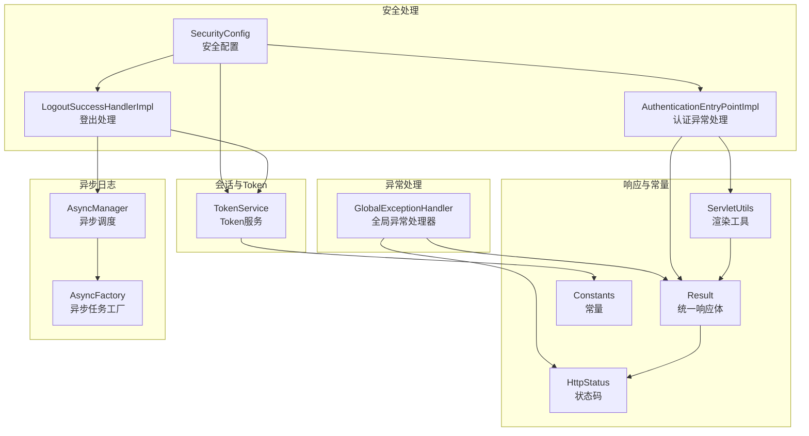
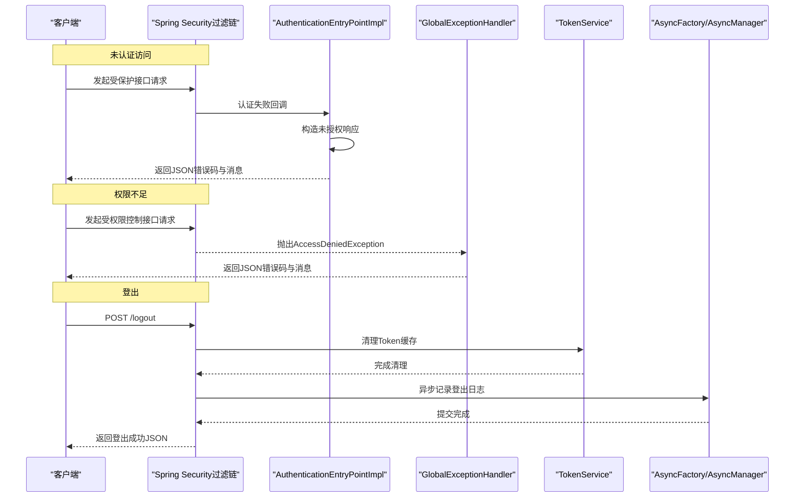
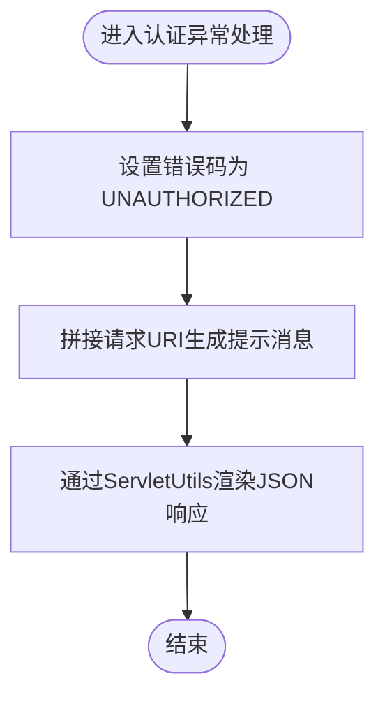
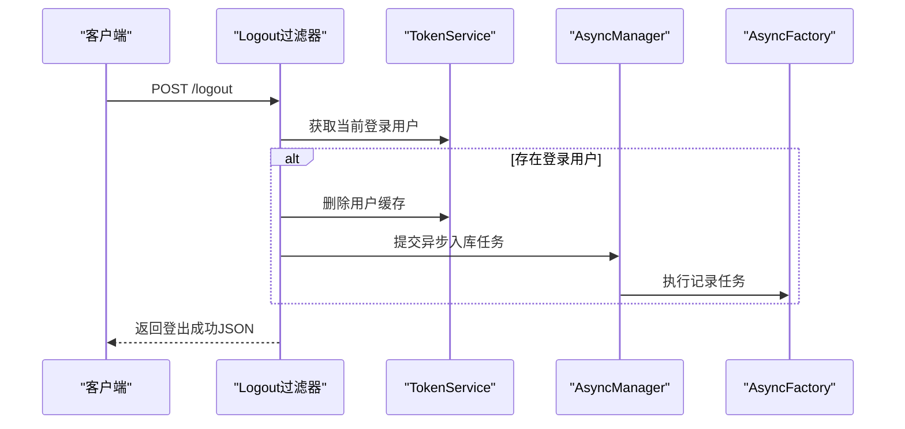
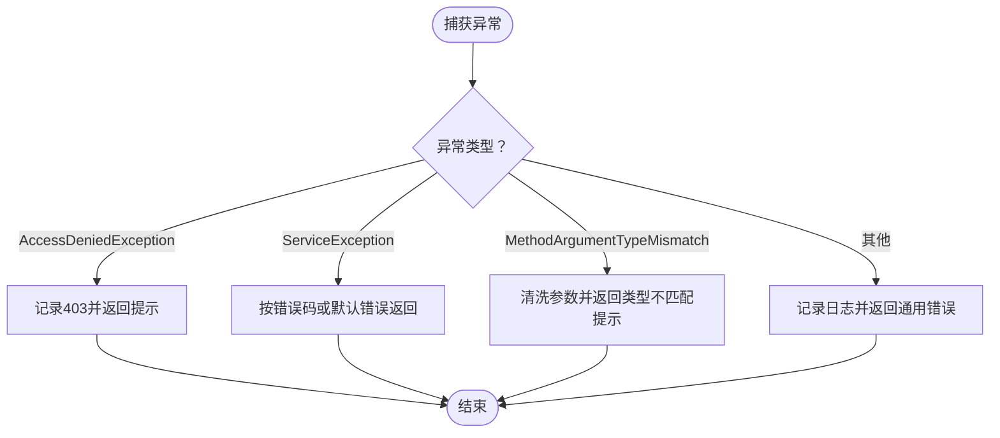
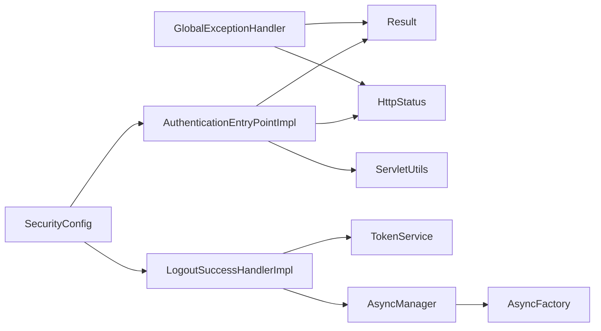

# 安全异常处理

<cite>
**本文引用的文件**
- [AuthenticationEntryPointImpl.java](file://blog-framework/src/main/java/blog/framework/security/handle/AuthenticationEntryPointImpl.java)
- [LogoutSuccessHandlerImpl.java](file://blog-framework/src/main/java/blog/framework/security/handle/LogoutSuccessHandlerImpl.java)
- [GlobalExceptionHandler.java](file://blog-framework/src/main/java/blog/framework/web/exception/GlobalExceptionHandler.java)
- [SecurityConfig.java](file://blog-framework/src/main/java/blog/framework/config/SecurityConfig.java)
- [TokenService.java](file://blog-framework/src/main/java/blog/framework/web/service/TokenService.java)
- [HttpStatus.java](file://blog-common/src/main/java/blog/common/constant/HttpStatus.java)
- [Result.java](file://blog-common/src/main/java/blog/common/base/resp/Result.java)
- [Constants.java](file://blog-common/src/main/java/blog/common/constant/Constants.java)
- [ServletUtils.java](file://blog-common/src/main/java/blog/common/utils/ServletUtils.java)
- [AsyncManager.java](file://blog-framework/src/main/java/blog/framework/manager/AsyncManager.java)
- [AsyncFactory.java](file://blog-framework/src/main/java/blog/framework/manager/factory/AsyncFactory.java)
- [messages.properties](file://blog-admin/src/main/resources/i18n/messages.properties)
</cite>

## 目录
1. [简介](#简介)
2. [项目结构](#项目结构)
3. [核心组件](#核心组件)
4. [架构总览](#架构总览)
5. [详细组件分析](#详细组件分析)
6. [依赖分析](#依赖分析)
7. [性能考虑](#性能考虑)
8. [故障排查指南](#故障排查指南)
9. [结论](#结论)
10. [附录](#附录)

## 简介
本文件聚焦于 Leejie 博客系统的安全异常处理机制，围绕以下目标展开：
- 深入解释 AuthenticationEntryPointImpl 的认证异常处理策略，覆盖未认证访问、Token 无效、权限不足等场景。
- 详述 LogoutSuccessHandlerImpl 的登出流程与清理工作，包括 Token 清理与异步入库记录。
- 全局异常处理器对安全相关异常的捕获与统一响应，包括 AccessDeniedException、ServiceException 等。
- 统一错误码与错误信息格式，提供客户端友好的提示。
- 总结最佳实践：异常分类、日志记录、用户体验优化。
- 提供常见安全异常场景的处理示例与故障排查建议。

## 项目结构
安全异常处理涉及框架层的安全配置、异常处理、工具类与服务层的 Token 管理。关键文件分布如下：
- 安全入口与登出处理：AuthenticationEntryPointImpl、LogoutSuccessHandlerImpl、SecurityConfig
- 全局异常处理：GlobalExceptionHandler
- 响应与状态码：Result、HttpStatus
- 工具与常量：ServletUtils、Constants
- 登录会话与 Token：TokenService
- 异步日志：AsyncManager、AsyncFactory
- 国际化消息：messages.properties

图表来源
- [SecurityConfig.java:94-127](file://blog-framework/src/main/java/blog/framework/config/SecurityConfig.java#L94-L127)
- [AuthenticationEntryPointImpl.java:22-34](file://blog-framework/src/main/java/blog/framework/security/handle/AuthenticationEntryPointImpl.java#L22-L34)
- [LogoutSuccessHandlerImpl.java:28-52](file://blog-framework/src/main/java/blog/framework/security/handle/LogoutSuccessHandlerImpl.java#L28-L52)
- [GlobalExceptionHandler.java:27-134](file://blog-framework/src/main/java/blog/framework/web/exception/GlobalExceptionHandler.java#L27-L134)
- [Result.java:14-205](file://blog-common/src/main/java/blog/common/base/resp/Result.java#L14-L205)
- [HttpStatus.java:8-94](file://blog-common/src/main/java/blog/common/constant/HttpStatus.java#L8-L94)
- [Constants.java:12-235](file://blog-common/src/main/java/blog/common/constant/Constants.java#L12-L235)
- [ServletUtils.java:127-136](file://blog-common/src/main/java/blog/common/utils/ServletUtils.java#L127-L136)
- [TokenService.java:32-213](file://blog-framework/src/main/java/blog/framework/web/service/TokenService.java#L32-L213)
- [AsyncManager.java:15-54](file://blog-framework/src/main/java/blog/framework/manager/AsyncManager.java#L15-L54)
- [AsyncFactory.java:25-93](file://blog-framework/src/main/java/blog/framework/manager/factory/AsyncFactory.java#L25-L93)

章节来源
- [SecurityConfig.java:94-127](file://blog-framework/src/main/java/blog/framework/config/SecurityConfig.java#L94-L127)

## 核心组件
- 认证异常处理：AuthenticationEntryPointImpl 在 Spring Security 认证失败时触发，统一返回未授权状态与友好提示。
- 登出处理：LogoutSuccessHandlerImpl 在用户登出时清理 Token 并异步记录日志。
- 全局异常处理：GlobalExceptionHandler 捕获权限不足、业务异常、参数异常等，统一输出 Result 格式。
- 统一响应：Result 提供 success/error/warn 三类静态方法，结合 HttpStatus 状态码。
- 工具与常量：ServletUtils 负责 JSON 渲染；Constants 定义 Token 前缀、登录状态等；TokenService 负责 Token 的提取、解析与清理。

章节来源
- [AuthenticationEntryPointImpl.java:22-34](file://blog-framework/src/main/java/blog/framework/security/handle/AuthenticationEntryPointImpl.java#L22-L34)
- [LogoutSuccessHandlerImpl.java:28-52](file://blog-framework/src/main/java/blog/framework/security/handle/LogoutSuccessHandlerImpl.java#L28-L52)
- [GlobalExceptionHandler.java:27-134](file://blog-framework/src/main/java/blog/framework/web/exception/GlobalExceptionHandler.java#L27-L134)
- [Result.java:14-205](file://blog-common/src/main/java/blog/common/base/resp/Result.java#L14-L205)
- [HttpStatus.java:8-94](file://blog-common/src/main/java/blog/common/constant/HttpStatus.java#L8-L94)
- [ServletUtils.java:127-136](file://blog-common/src/main/java/blog/common/utils/ServletUtils.java#L127-L136)
- [Constants.java:12-235](file://blog-common/src/main/java/blog/common/constant/Constants.java#L12-L235)
- [TokenService.java:32-213](file://blog-framework/src/main/java/blog/framework/web/service/TokenService.java#L32-L213)

## 架构总览
Spring Security 在过滤链中拦截未认证或权限不足的请求，分别委托 AuthenticationEntryPointImpl 与 AccessDeniedException 处理。登出时由 LogoutSuccessHandlerImpl 清理 Token 并记录日志。全局异常处理器统一捕获各类异常，输出标准 Result 响应。

图表来源
- [SecurityConfig.java:104-121](file://blog-framework/src/main/java/blog/framework/config/SecurityConfig.java#L104-L121)
- [AuthenticationEntryPointImpl.java:26-32](file://blog-framework/src/main/java/blog/framework/security/handle/AuthenticationEntryPointImpl.java#L26-L32)
- [GlobalExceptionHandler.java:34-39](file://blog-framework/src/main/java/blog/framework/web/exception/GlobalExceptionHandler.java#L34-L39)
- [LogoutSuccessHandlerImpl.java:38-50](file://blog-framework/src/main/java/blog/framework/security/handle/LogoutSuccessHandlerImpl.java#L38-L50)
- [TokenService.java:92-97](file://blog-framework/src/main/java/blog/framework/web/service/TokenService.java#L92-L97)
- [AsyncFactory.java:37-74](file://blog-framework/src/main/java/blog/framework/manager/factory/AsyncFactory.java#L37-L74)

## 详细组件分析

### 认证异常处理：AuthenticationEntryPointImpl
- 触发时机：Spring Security 认证过程中抛出 AuthenticationException。
- 处理策略：
  - 使用 HttpStatus.UNAUTHORIZED 作为错误码。
  - 动态拼接当前请求 URI，形成“认证失败，无法访问系统资源”的提示。
  - 通过 ServletUtils 将 Result(JSON) 写入响应。
- 适用场景：
  - 未携带有效 Token 或 Token 已过期。
  - Token 解析异常或用户信息缺失。
- 响应格式：Result.error(UNAUTHORIZED, "请求访问：{uri}，认证失败，无法访问系统资源")

图表来源
- [AuthenticationEntryPointImpl.java:26-32](file://blog-framework/src/main/java/blog/framework/security/handle/AuthenticationEntryPointImpl.java#L26-L32)
- [HttpStatus.java:50-52](file://blog-common/src/main/java/blog/common/constant/HttpStatus.java#L50-L52)
- [ServletUtils.java:127-136](file://blog-common/src/main/java/blog/common/utils/ServletUtils.java#L127-L136)
- [Result.java:150-163](file://blog-common/src/main/java/blog/common/base/resp/Result.java#L150-L163)

章节来源
- [AuthenticationEntryPointImpl.java:22-34](file://blog-framework/src/main/java/blog/framework/security/handle/AuthenticationEntryPointImpl.java#L22-L34)
- [HttpStatus.java:8-94](file://blog-common/src/main/java/blog/common/constant/HttpStatus.java#L8-L94)
- [Result.java:14-205](file://blog-common/src/main/java/blog/common/base/resp/Result.java#L14-L205)
- [ServletUtils.java:127-136](file://blog-common/src/main/java/blog/common/utils/ServletUtils.java#L127-L136)

### 登出处理：LogoutSuccessHandlerImpl
- 触发时机：POST /logout。
- 处理流程：
  - 从请求中解析当前登录用户（TokenService.getLoginUser）。
  - 若存在登录用户，删除其 Redis 缓存（TokenService.delLoginUser）。
  - 异步记录登出日志（AsyncManager + AsyncFactory），写入系统日志与数据库。
  - 返回 Result.success(“退出成功”)。
- 关键点：
  - 登出成功后，前端需清除本地 Token，避免复用。
  - 异步记录降低同步阻塞，提升吞吐。

图表来源
- [LogoutSuccessHandlerImpl.java:38-50](file://blog-framework/src/main/java/blog/framework/security/handle/LogoutSuccessHandlerImpl.java#L38-L50)
- [TokenService.java:62-97](file://blog-framework/src/main/java/blog/framework/web/service/TokenService.java#L62-L97)
- [AsyncManager.java:43-45](file://blog-framework/src/main/java/blog/framework/manager/AsyncManager.java#L43-L45)
- [AsyncFactory.java:37-74](file://blog-framework/src/main/java/blog/framework/manager/factory/AsyncFactory.java#L37-L74)
- [messages.properties:13](file://blog-admin/src/main/resources/i18n/messages.properties#L13)

章节来源
- [LogoutSuccessHandlerImpl.java:28-52](file://blog-framework/src/main/java/blog/framework/security/handle/LogoutSuccessHandlerImpl.java#L28-L52)
- [TokenService.java:32-213](file://blog-framework/src/main/java/blog/framework/web/service/TokenService.java#L32-L213)
- [AsyncManager.java:15-54](file://blog-framework/src/main/java/blog/framework/manager/AsyncManager.java#L15-L54)
- [AsyncFactory.java:25-93](file://blog-framework/src/main/java/blog/framework/manager/factory/AsyncFactory.java#L25-L93)
- [messages.properties:13](file://blog-admin/src/main/resources/i18n/messages.properties#L13)

### 全局异常处理：GlobalExceptionHandler
- 权限不足（AccessDeniedException）：记录请求地址与异常信息，返回 403 与提示“没有权限，请联系管理员授权”。
- 业务异常（ServiceException）：若携带自定义错误码则返回该码，否则返回系统错误码。
- 请求方式不支持（HttpRequestMethodNotSupportedException）：返回提示“不支持的请求方法”。
- 参数类型不匹配（MethodArgumentTypeMismatchException）：清洗输入后返回具体字段与期望类型的提示。
- 其他异常：统一记录日志并返回通用错误提示。

图表来源
- [GlobalExceptionHandler.java:34-132](file://blog-framework/src/main/java/blog/framework/web/exception/GlobalExceptionHandler.java#L34-L132)

章节来源
- [GlobalExceptionHandler.java:27-134](file://blog-framework/src/main/java/blog/framework/web/exception/GlobalExceptionHandler.java#L27-L134)

### 统一响应与错误码
- Result：提供 success/error/warn 三类静态方法，默认使用 HttpStatus 中的状态码。
- HttpStatus：集中定义了 SUCCESS、UNAUTHORIZED、FORBIDDEN、ERROR 等常用状态码。
- ServletUtils：renderString 将 Result 序列化为 JSON 并设置响应头。

章节来源
- [Result.java:14-205](file://blog-common/src/main/java/blog/common/base/resp/Result.java#L14-L205)
- [HttpStatus.java:8-94](file://blog-common/src/main/java/blog/common/constant/HttpStatus.java#L8-L94)
- [ServletUtils.java:127-136](file://blog-common/src/main/java/blog/common/utils/ServletUtils.java#L127-L136)

### Token 与会话清理
- TokenService：负责从请求头提取 Token、解析用户信息、刷新过期时间、删除缓存等。
- Constants：定义 TOKEN_PREFIX、LOGIN_USER_KEY 等常量，确保前后端一致。

章节来源
- [TokenService.java:32-213](file://blog-framework/src/main/java/blog/framework/web/service/TokenService.java#L32-L213)
- [Constants.java:12-235](file://blog-common/src/main/java/blog/common/constant/Constants.java#L12-L235)

## 依赖分析
- SecurityConfig 将 AuthenticationEntryPointImpl 与 LogoutSuccessHandlerImpl 注入到 Spring Security 过滤链。
- AuthenticationEntryPointImpl 依赖 Result、HttpStatus、ServletUtils。
- LogoutSuccessHandlerImpl 依赖 TokenService、AsyncManager、AsyncFactory、Constants、MessageUtils。
- GlobalExceptionHandler 依赖 Result、HttpStatus、日志框架与多种 Spring 异常类型。

图表来源
- [SecurityConfig.java:37-44](file://blog-framework/src/main/java/blog/framework/config/SecurityConfig.java#L37-L44)
- [AuthenticationEntryPointImpl.java:11-15](file://blog-framework/src/main/java/blog/framework/security/handle/AuthenticationEntryPointImpl.java#L11-L15)
- [LogoutSuccessHandlerImpl.java:18-21](file://blog-framework/src/main/java/blog/framework/security/handle/LogoutSuccessHandlerImpl.java#L18-L21)
- [GlobalExceptionHandler.java:14-21](file://blog-framework/src/main/java/blog/framework/web/exception/GlobalExceptionHandler.java#L14-L21)

章节来源
- [SecurityConfig.java:94-127](file://blog-framework/src/main/java/blog/framework/config/SecurityConfig.java#L94-L127)

## 性能考虑
- 登出采用异步记录日志，避免阻塞主请求线程。
- Token 清理在内存缓存层进行，复杂度低。
- 全局异常处理器仅做轻量日志与格式化，不进行重型计算。
- 建议：对频繁触发的异常（如权限不足）可在网关层做限流与熔断，防止雪崩。

## 故障排查指南
- 未认证访问
  - 现象：返回 401 且提示“认证失败，无法访问系统资源”。
  - 排查：确认请求头是否携带正确的 Bearer Token；检查 Token 是否过期；核对 SecurityConfig 的 permitAll 白名单。
  - 参考
    - [AuthenticationEntryPointImpl.java:26-32](file://blog-framework/src/main/java/blog/framework/security/handle/AuthenticationEntryPointImpl.java#L26-L32)
    - [SecurityConfig.java:104-117](file://blog-framework/src/main/java/blog/framework/config/SecurityConfig.java#L104-L117)
- 权限不足
  - 现象：返回 403 且提示“没有权限，请联系管理员授权”。
  - 排查：确认用户角色/权限是否满足接口要求；检查方法级注解（如 @PreAuthorize）。
  - 参考
    - [GlobalExceptionHandler.java:34-39](file://blog-framework/src/main/java/blog/framework/web/exception/GlobalExceptionHandler.java#L34-L39)
- 登出失败或 Token 未清理
  - 现象：登出后仍可访问受保护资源。
  - 排查：确认 /logout 是否命中 LogoutSuccessHandlerImpl；检查 TokenService.delLoginUser 是否执行；核对 Redis 缓存键前缀。
  - 参考
    - [LogoutSuccessHandlerImpl.java:38-50](file://blog-framework/src/main/java/blog/framework/security/handle/LogoutSuccessHandlerImpl.java#L38-L50)
    - [TokenService.java:92-97](file://blog-framework/src/main/java/blog/framework/web/service/TokenService.java#L92-L97)
    - [Constants.java:104-111](file://blog-common/src/main/java/blog/common/constant/Constants.java#L104-L111)
- 参数类型不匹配
  - 现象：返回具体字段与期望类型的提示。
  - 排查：检查请求参数类型与控制器签名；确认前端传参格式。
  - 参考
    - [GlobalExceptionHandler.java:75-84](file://blog-framework/src/main/java/blog/framework/web/exception/GlobalExceptionHandler.java#L75-L84)
- 国际化提示
  - 登出成功提示来自国际化资源文件，确保 locale 正确。
  - 参考
    - [messages.properties:13](file://blog-admin/src/main/resources/i18n/messages.properties#L13)

## 结论
该系统通过 Spring Security 的异常入口与全局异常处理器实现了统一、可扩展的安全异常处理机制。认证失败、权限不足与登出流程均有明确的处理策略与响应格式，配合异步日志与统一 Result 输出，既保证了用户体验，也便于运维监控与问题定位。

## 附录

### 错误码与提示规范
- 未授权：401，提示“认证失败，无法访问系统资源”
- 权限不足：403，提示“没有权限，请联系管理员授权”
- 业务异常：优先使用 ServiceException.code，否则使用系统默认错误码
- 参数类型不匹配：返回包含字段名、期望类型与实际值的提示

章节来源
- [HttpStatus.java:50-57](file://blog-common/src/main/java/blog/common/constant/HttpStatus.java#L50-L57)
- [GlobalExceptionHandler.java:34-84](file://blog-framework/src/main/java/blog/framework/web/exception/GlobalExceptionHandler.java#L34-L84)
- [Result.java:150-163](file://blog-common/src/main/java/blog/common/base/resp/Result.java#L150-L163)