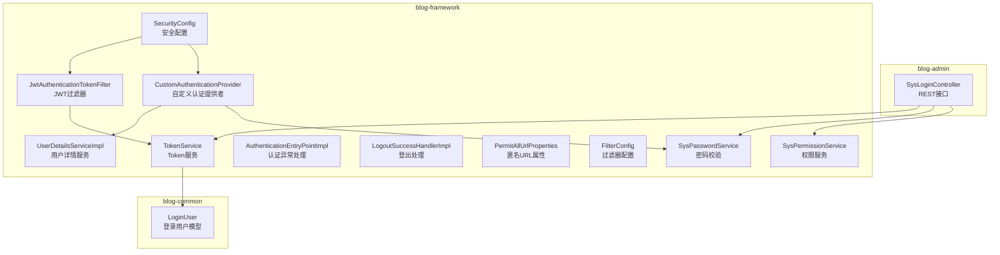
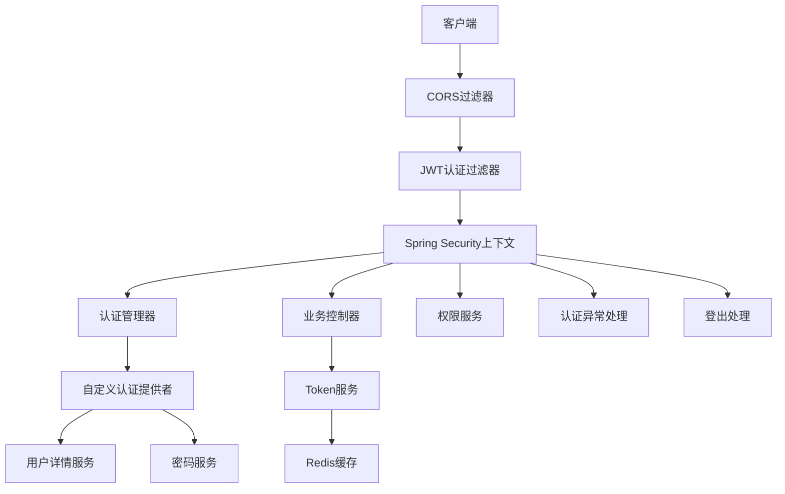
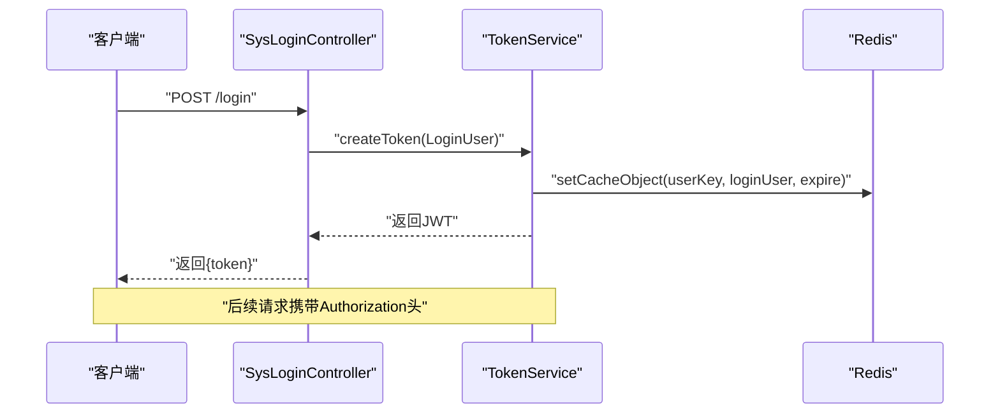
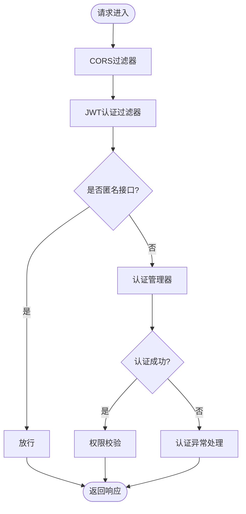
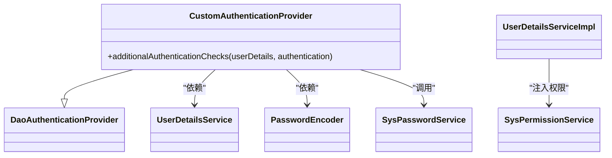
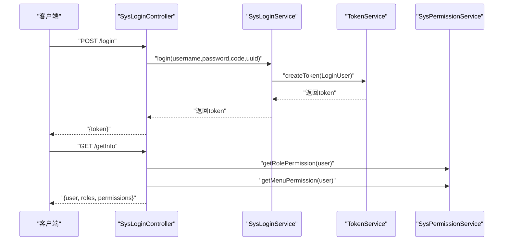
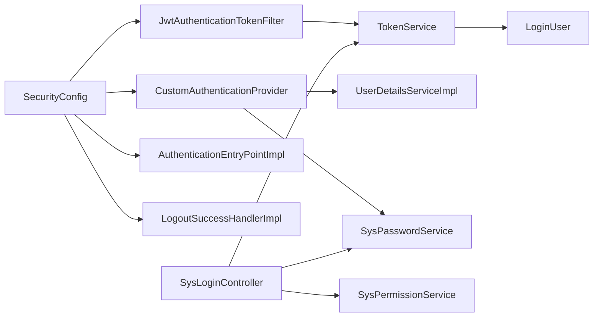

# 安全架构设计

<cite>
**本文引用的文件**
- [SecurityConfig.java](file://blog-framework/src/main/java/blog/framework/config/SecurityConfig.java)
- [JwtAuthenticationTokenFilter.java](file://blog-framework/src/main/java/blog/framework/security/filter/JwtAuthenticationTokenFilter.java)
- [TokenService.java](file://blog-framework/src/main/java/blog/framework/web/service/TokenService.java)
- [UserDetailsServiceImpl.java](file://blog-framework/src/main/java/blog/framework/web/service/UserDetailsServiceImpl.java)
- [CustomAuthenticationProvider.java](file://blog-framework/src/main/java/blog/framework/security/provider/CustomAuthenticationProvider.java)
- [AuthenticationEntryPointImpl.java](file://blog-framework/src/main/java/blog/framework/security/handle/AuthenticationEntryPointImpl.java)
- [LogoutSuccessHandlerImpl.java](file://blog-framework/src/main/java/blog/framework/security/handle/LogoutSuccessHandlerImpl.java)
- [PermitAllUrlProperties.java](file://blog-framework/src/main/java/blog/framework/config/properties/PermitAllUrlProperties.java)
- [FilterConfig.java](file://blog-framework/src/main/java/blog/framework/config/FilterConfig.java)
- [SysLoginController.java](file://blog-admin/src/main/java/blog/web/controller/system/SysLoginController.java)
- [application.yml](file://blog-admin/src/main/resources/application.yml)
- [SysPasswordService.java](file://blog-framework/src/main/java/blog/framework/web/service/SysPasswordService.java)
- [SysPermissionService.java](file://blog-framework/src/main/java/blog/framework/web/service/SysPermissionService.java)
- [LoginUser.java](file://blog-common/src/main/java/blog/common/core/domain/model/LoginUser.java)
</cite>

## 目录
1. [简介](#简介)
2. [项目结构](#项目结构)
3. [核心组件](#核心组件)
4. [架构总览](#架构总览)
5. [详细组件分析](#详细组件分析)
6. [依赖关系分析](#依赖关系分析)
7. [性能与安全特性](#性能与安全特性)
8. [故障排查指南](#故障排查指南)
9. [结论](#结论)
10. [附录](#附录)

## 简介
本文件面向Leejie博客系统的安全架构设计，围绕基于JWT的无状态认证机制展开，系统性阐述以下内容：
- JWT Token的生成、验证与刷新流程
- Spring Security安全配置（过滤器链、权限控制、异常处理）
- 自定义认证提供程序的实现原理与用户身份验证、权限授权流程
- 跨域请求处理、CSRF防护、会话管理等安全措施
- 提供安全架构图与认证流程图，帮助读者快速理解从用户登录到权限验证的完整过程
- 总结最佳实践与常见问题解决方案

## 项目结构
本项目采用多模块分层组织，安全相关能力主要集中在blog-framework模块，业务入口位于blog-admin模块，通用模型与工具位于blog-common模块。

图表来源
- [SecurityConfig.java:94-127](file://blog-framework/src/main/java/blog/framework/config/SecurityConfig.java#L94-L127)
- [JwtAuthenticationTokenFilter.java:27-50](file://blog-framework/src/main/java/blog/framework/security/filter/JwtAuthenticationTokenFilter.java#L27-L50)
- [TokenService.java:32-213](file://blog-framework/src/main/java/blog/framework/web/service/TokenService.java#L32-L213)
- [UserDetailsServiceImpl.java:24-57](file://blog-framework/src/main/java/blog/framework/web/service/UserDetailsServiceImpl.java#L24-L57)
- [CustomAuthenticationProvider.java:24-60](file://blog-framework/src/main/java/blog/framework/security/provider/CustomAuthenticationProvider.java#L24-L60)
- [AuthenticationEntryPointImpl.java:22-34](file://blog-framework/src/main/java/blog/framework/security/handle/AuthenticationEntryPointImpl.java#L22-L34)
- [LogoutSuccessHandlerImpl.java:28-52](file://blog-framework/src/main/java/blog/framework/security/handle/LogoutSuccessHandlerImpl.java#L28-L52)
- [PermitAllUrlProperties.java:27-77](file://blog-framework/src/main/java/blog/framework/config/properties/PermitAllUrlProperties.java#L27-L77)
- [FilterConfig.java:23-78](file://blog-framework/src/main/java/blog/framework/config/FilterConfig.java#L23-L78)
- [SysLoginController.java:33-124](file://blog-admin/src/main/java/blog/web/controller/system/SysLoginController.java#L33-L124)
- [LoginUser.java:16-235](file://blog-common/src/main/java/blog/common/core/domain/model/LoginUser.java#L16-L235)

章节来源
- [SecurityConfig.java:94-127](file://blog-framework/src/main/java/blog/framework/config/SecurityConfig.java#L94-L127)
- [application.yml:90-98](file://blog-admin/src/main/resources/application.yml#L90-L98)

## 核心组件
- 安全配置与过滤器链：通过@EnableMethodSecurity启用方法级权限控制，配置CSRF禁用、Session无状态、异常处理、登出处理，并按顺序注册CORS、JWT过滤器与自定义认证提供者。
- JWT过滤器：从请求头解析令牌，验证有效性，解析用户信息，填充SecurityContext，使后续授权与方法级注解生效。
- 自定义认证提供者：继承DaoAuthenticationProvider，重写密码校验逻辑，结合密码服务完成登录失败次数限制与密码匹配校验。
- 用户详情服务：加载用户信息、校验状态、构建LoginUser并注入权限集合。
- Token服务：负责JWT签发、解析、刷新与Redis缓存交互，支持过期前自动续期。
- 权限服务：根据用户角色与菜单生成权限集合，管理员拥有全量权限。
- 密码服务：基于Redis对登录失败次数与锁定时间进行限制，避免暴力破解。
- 异常与登出处理：统一返回未授权错误，登出时清理缓存并记录日志。

章节来源
- [SecurityConfig.java:31-137](file://blog-framework/src/main/java/blog/framework/config/SecurityConfig.java#L31-L137)
- [JwtAuthenticationTokenFilter.java:27-50](file://blog-framework/src/main/java/blog/framework/security/filter/JwtAuthenticationTokenFilter.java#L27-L50)
- [CustomAuthenticationProvider.java:24-60](file://blog-framework/src/main/java/blog/framework/security/provider/CustomAuthenticationProvider.java#L24-L60)
- [UserDetailsServiceImpl.java:24-57](file://blog-framework/src/main/java/blog/framework/web/service/UserDetailsServiceImpl.java#L24-L57)
- [TokenService.java:32-213](file://blog-framework/src/main/java/blog/framework/web/service/TokenService.java#L32-L213)
- [SysPermissionService.java:22-76](file://blog-framework/src/main/java/blog/framework/web/service/SysPermissionService.java#L22-L76)
- [SysPasswordService.java:22-78](file://blog-framework/src/main/java/blog/framework/web/service/SysPasswordService.java#L22-L78)
- [AuthenticationEntryPointImpl.java:22-34](file://blog-framework/src/main/java/blog/framework/security/handle/AuthenticationEntryPointImpl.java#L22-L34)
- [LogoutSuccessHandlerImpl.java:28-52](file://blog-framework/src/main/java/blog/framework/security/handle/LogoutSuccessHandlerImpl.java#L28-L52)

## 架构总览
下图展示了从客户端发起请求到服务端完成认证与授权的整体流程，以及各组件之间的交互关系。

图表来源
- [SecurityConfig.java:94-127](file://blog-framework/src/main/java/blog/framework/config/SecurityConfig.java#L94-L127)
- [JwtAuthenticationTokenFilter.java:27-50](file://blog-framework/src/main/java/blog/framework/security/filter/JwtAuthenticationTokenFilter.java#L27-L50)
- [CustomAuthenticationProvider.java:24-60](file://blog-framework/src/main/java/blog/framework/security/provider/CustomAuthenticationProvider.java#L24-L60)
- [UserDetailsServiceImpl.java:24-57](file://blog-framework/src/main/java/blog/framework/web/service/UserDetailsServiceImpl.java#L24-L57)
- [SysPasswordService.java:22-78](file://blog-framework/src/main/java/blog/framework/web/service/SysPasswordService.java#L22-L78)
- [TokenService.java:32-213](file://blog-framework/src/main/java/blog/framework/web/service/TokenService.java#L32-L213)
- [SysPermissionService.java:22-76](file://blog-framework/src/main/java/blog/framework/web/service/SysPermissionService.java#L22-L76)
- [AuthenticationEntryPointImpl.java:22-34](file://blog-framework/src/main/java/blog/framework/security/handle/AuthenticationEntryPointImpl.java#L22-L34)
- [LogoutSuccessHandlerImpl.java:28-52](file://blog-framework/src/main/java/blog/framework/security/handle/LogoutSuccessHandlerImpl.java#L28-L52)

## 详细组件分析

### JWT无状态认证机制
- 令牌生成：登录成功后，服务端调用TokenService创建JWT并写入Redis，随后返回令牌给客户端。
- 令牌验证：JWT过滤器从请求头提取令牌，解析Claims，从Redis获取LoginUser，校验有效性并在SecurityContext中建立认证。
- 令牌刷新：当距离过期时间小于阈值时，自动刷新Redis中的用户缓存，延长有效期。
- 会话管理：配置为STATELESS，不使用Session，完全依赖JWT实现无状态认证。

图表来源
- [SysLoginController.java:56-64](file://blog-admin/src/main/java/blog/web/controller/system/SysLoginController.java#L56-L64)
- [TokenService.java:105-115](file://blog-framework/src/main/java/blog/framework/web/service/TokenService.java#L105-L115)
- [TokenService.java:136-142](file://blog-framework/src/main/java/blog/framework/web/service/TokenService.java#L136-L142)

章节来源
- [TokenService.java:62-78](file://blog-framework/src/main/java/blog/framework/web/service/TokenService.java#L62-L78)
- [TokenService.java:123-129](file://blog-framework/src/main/java/blog/framework/web/service/TokenService.java#L123-L129)
- [TokenService.java:136-142](file://blog-framework/src/main/java/blog/framework/web/service/TokenService.java#L136-L142)
- [JwtAuthenticationTokenFilter.java:38-49](file://blog-framework/src/main/java/blog/framework/security/filter/JwtAuthenticationTokenFilter.java#L38-L49)

### Spring Security安全配置
- 过滤器链顺序：CORS过滤器 → JWT认证过滤器 → UsernamePasswordAuthenticationFilter → LogoutFilter
- 权限控制策略：通过注解开启方法级权限控制，静态资源与匿名接口放行，其余请求均需认证
- CSRF禁用：由于使用JWT无状态认证，禁用CSRF以避免不必要的开销
- Session策略：设置为STATELESS，确保无状态
- 异常处理：认证失败统一返回未授权错误
- 登出处理：清理Redis中的用户缓存并记录日志

图表来源
- [SecurityConfig.java:94-127](file://blog-framework/src/main/java/blog/framework/config/SecurityConfig.java#L94-L127)
- [PermitAllUrlProperties.java:37-62](file://blog-framework/src/main/java/blog/framework/config/properties/PermitAllUrlProperties.java#L37-L62)
- [AuthenticationEntryPointImpl.java:26-32](file://blog-framework/src/main/java/blog/framework/security/handle/AuthenticationEntryPointImpl.java#L26-L32)
- [LogoutSuccessHandlerImpl.java:38-50](file://blog-framework/src/main/java/blog/framework/security/handle/LogoutSuccessHandlerImpl.java#L38-L50)

章节来源
- [SecurityConfig.java:94-127](file://blog-framework/src/main/java/blog/framework/config/SecurityConfig.java#L94-L127)
- [PermitAllUrlProperties.java:27-77](file://blog-framework/src/main/java/blog/framework/config/properties/PermitAllUrlProperties.java#L27-L77)

### 自定义认证提供程序
- 继承DaoAuthenticationProvider，通过构造函数注入UserDetailsService与PasswordEncoder
- 重写additionalAuthenticationChecks，在此处调用SysPasswordService.validate完成密码校验与失败次数限制
- 用户详情由UserDetailsServiceImpl加载，SysPermissionService注入权限集合

图表来源
- [CustomAuthenticationProvider.java:24-60](file://blog-framework/src/main/java/blog/framework/security/provider/CustomAuthenticationProvider.java#L24-L60)
- [UserDetailsServiceImpl.java:24-57](file://blog-framework/src/main/java/blog/framework/web/service/UserDetailsServiceImpl.java#L24-L57)
- [SysPasswordService.java:22-78](file://blog-framework/src/main/java/blog/framework/web/service/SysPasswordService.java#L22-L78)
- [SysPermissionService.java:22-76](file://blog-framework/src/main/java/blog/framework/web/service/SysPermissionService.java#L22-L76)

章节来源
- [CustomAuthenticationProvider.java:24-60](file://blog-framework/src/main/java/blog/framework/security/provider/CustomAuthenticationProvider.java#L24-L60)
- [UserDetailsServiceImpl.java:33-55](file://blog-framework/src/main/java/blog/framework/web/service/UserDetailsServiceImpl.java#L33-L55)
- [SysPasswordService.java:34-56](file://blog-framework/src/main/java/blog/framework/web/service/SysPasswordService.java#L34-L56)

### 跨域请求处理、CSRF防护与会话管理
- 跨域：通过FilterConfig注册CORS过滤器，置于JWT过滤器之前，确保预检请求正确处理
- CSRF：在无状态JWT场景下禁用CSRF，降低复杂度与性能开销
- 会话：配置为STATELESS，不使用Session，避免会话固定与粘滞问题

章节来源
- [SecurityConfig.java:97-106](file://blog-framework/src/main/java/blog/framework/config/SecurityConfig.java#L97-L106)
- [FilterConfig.java:34-77](file://blog-framework/src/main/java/blog/framework/config/FilterConfig.java#L34-L77)

### 登录与权限获取流程
- 登录：SysLoginController接收用户名/密码，调用登录服务生成Token并返回
- 获取用户信息：从SecurityContext获取LoginUser，结合SysPermissionService生成角色与权限集合
- 路由信息：根据用户ID查询菜单树并构建前端路由

图表来源
- [SysLoginController.java:56-90](file://blog-admin/src/main/java/blog/web/controller/system/SysLoginController.java#L56-L90)
- [TokenService.java:105-115](file://blog-framework/src/main/java/blog/framework/web/service/TokenService.java#L105-L115)
- [SysPermissionService.java:36-74](file://blog-framework/src/main/java/blog/framework/web/service/SysPermissionService.java#L36-L74)

## 依赖关系分析
- 组件耦合：SecurityConfig集中装配过滤器与异常处理；JwtAuthenticationTokenFilter依赖TokenService；CustomAuthenticationProvider依赖UserDetailsServiceImpl与SysPasswordService；TokenService依赖RedisCache与配置项；SysLoginController依赖TokenService与权限服务。
- 外部依赖：Spring Security、Spring MVC、Redis、JWT库、FastJSON2。

图表来源
- [SecurityConfig.java:94-127](file://blog-framework/src/main/java/blog/framework/config/SecurityConfig.java#L94-L127)
- [JwtAuthenticationTokenFilter.java:27-50](file://blog-framework/src/main/java/blog/framework/security/filter/JwtAuthenticationTokenFilter.java#L27-L50)
- [CustomAuthenticationProvider.java:24-60](file://blog-framework/src/main/java/blog/framework/security/provider/CustomAuthenticationProvider.java#L24-L60)
- [UserDetailsServiceImpl.java:24-57](file://blog-framework/src/main/java/blog/framework/web/service/UserDetailsServiceImpl.java#L24-L57)
- [SysPasswordService.java:22-78](file://blog-framework/src/main/java/blog/framework/web/service/SysPasswordService.java#L22-L78)
- [TokenService.java:32-213](file://blog-framework/src/main/java/blog/framework/web/service/TokenService.java#L32-L213)
- [SysLoginController.java:33-124](file://blog-admin/src/main/java/blog/web/controller/system/SysLoginController.java#L33-L124)
- [SysPermissionService.java:22-76](file://blog-framework/src/main/java/blog/framework/web/service/SysPermissionService.java#L22-L76)
- [LoginUser.java:16-235](file://blog-common/src/main/java/blog/common/core/domain/model/LoginUser.java#L16-L235)

## 性能与安全特性
- 无状态与高并发：STATELESS策略减少会话存储与序列化成本，适合高并发场景
- Token续期：临近过期自动刷新Redis缓存，降低频繁登录带来的压力
- 密码保护：登录失败次数与锁定时间限制，配合强散列加密，有效抵御暴力破解
- XSS与防盗链：通过FilterConfig注册XssFilter与RefererFilter，提升Web层安全
- 配置项：令牌密钥、有效期、密码重试上限、锁定时长等均通过配置文件集中管理，便于运维调整

章节来源
- [SecurityConfig.java:132-135](file://blog-framework/src/main/java/blog/framework/config/SecurityConfig.java#L132-L135)
- [SysPasswordService.java:27-31](file://blog-framework/src/main/java/blog/framework/web/service/SysPasswordService.java#L27-L31)
- [FilterConfig.java:34-77](file://blog-framework/src/main/java/blog/framework/config/FilterConfig.java#L34-L77)
- [application.yml:90-98](file://blog-admin/src/main/resources/application.yml#L90-L98)

## 故障排查指南
- 认证失败返回未授权：检查请求头Authorization是否携带正确令牌，确认令牌未过期或被提前注销
- 403权限不足：确认用户权限集合是否包含所需权限，管理员角色拥有全量权限
- 登录频繁报错：检查密码重试上限与锁定时间配置，确认Redis中是否存在错误计数缓存
- 跨域问题：确认CORS过滤器已注册且优先级高于JWT过滤器，预检请求正常放行
- 登出无效：确认登出处理器已触发并清理Redis缓存，检查日志记录是否成功

章节来源
- [AuthenticationEntryPointImpl.java:26-32](file://blog-framework/src/main/java/blog/framework/security/handle/AuthenticationEntryPointImpl.java#L26-L32)
- [SysPasswordService.java:45-56](file://blog-framework/src/main/java/blog/framework/web/service/SysPasswordService.java#L45-L56)
- [LogoutSuccessHandlerImpl.java:38-50](file://blog-framework/src/main/java/blog/framework/security/handle/LogoutSuccessHandlerImpl.java#L38-L50)
- [FilterConfig.java:34-77](file://blog-framework/src/main/java/blog/framework/config/FilterConfig.java#L34-L77)

## 结论
本安全架构以JWT为核心，结合Spring Security的无状态过滤器链、自定义认证提供者与Redis缓存，实现了高效、可扩展的认证与授权体系。通过明确的异常处理、登出流程与安全配置，系统在保证安全性的同时兼顾了性能与可维护性。建议在生产环境中进一步强化令牌传输安全（如HTTPS）、密钥轮换与审计日志，持续优化权限模型与限流策略。

## 附录
- 最佳实践
  - 使用HTTPS传输令牌，避免中间人攻击
  - 定期轮换令牌密钥，缩短令牌有效期
  - 启用并合理配置XSS与Referer过滤器
  - 对高频接口增加限流与防刷策略
  - 完善审计日志，记录登录、登出与敏感操作
- 常见问题
  - 令牌过期：前端应捕获未授权错误并引导重新登录
  - 权限变更：登录后动态刷新权限集合并更新Redis缓存
  - 并发登录：根据业务需求决定是否允许多端登录与踢出策略