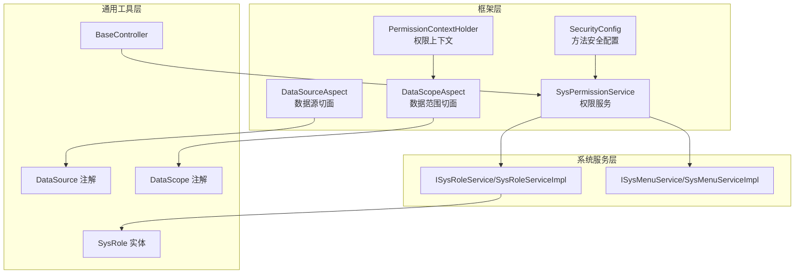
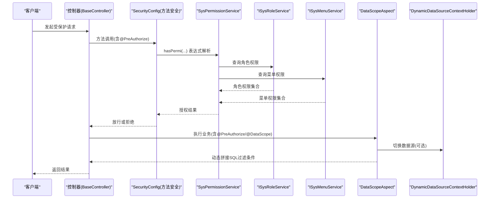
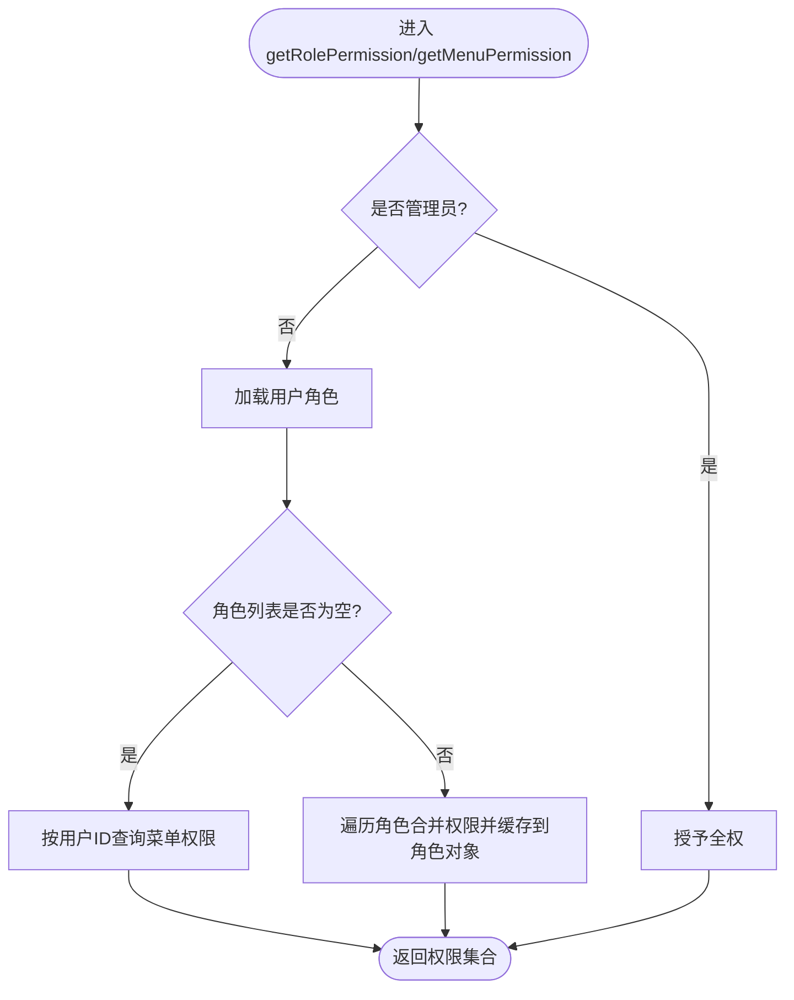
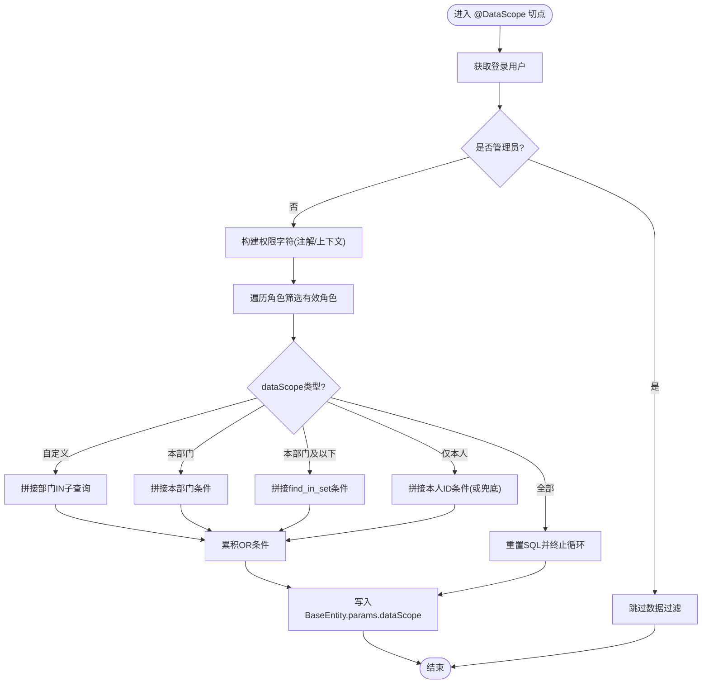
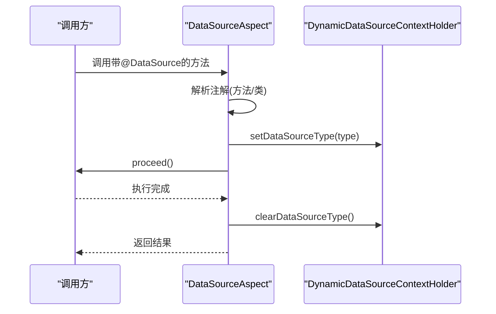
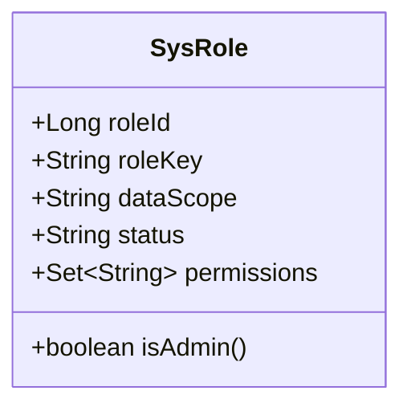
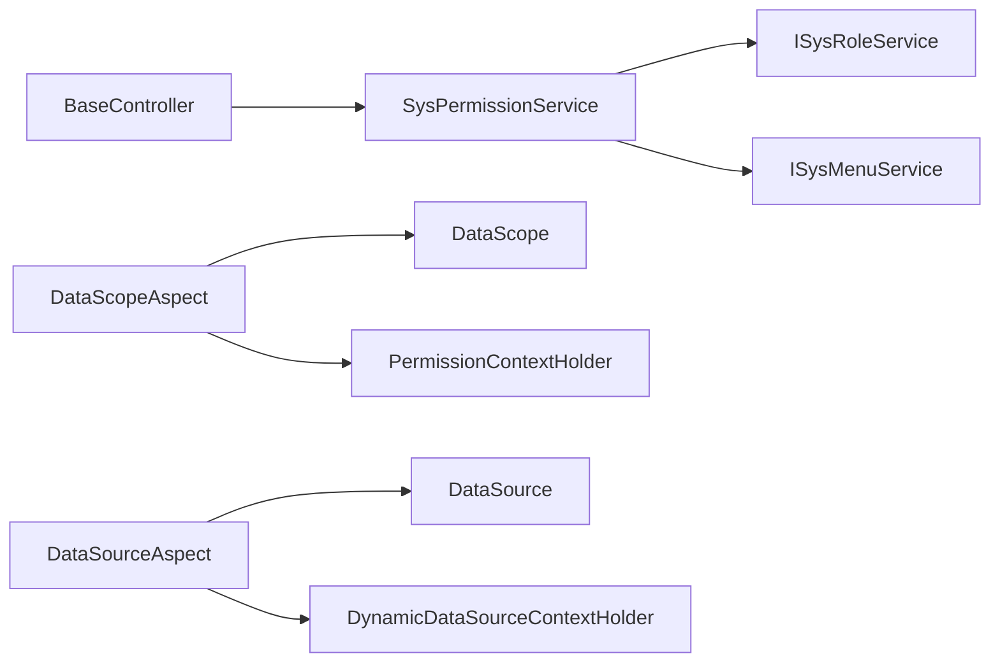

# 权限控制系统

<cite>
**本文引用的文件**
- [SysPermissionService.java](file://blog-framework/src/main/java/blog/framework/web/service/SysPermissionService.java)
- [DataScopeAspect.java](file://blog-framework/src/main/java/blog/framework/aspectj/DataScopeAspect.java)
- [DataSourceAspect.java](file://blog-framework/src/main/java/blog/framework/aspectj/DataSourceAspect.java)
- [DataScope.java](file://blog-common/src/main/java/blog/common/annotation/DataScope.java)
- [DataSource.java](file://blog-common/src/main/java/blog/common/annotation/DataSource.java)
- [PermissionContextHolder.java](file://blog-framework/src/main/java/blog/framework/security/context/PermissionContextHolder.java)
- [DynamicDataSourceContextHolder.java](file://blog-framework/src/main/java/blog/framework/datasource/DynamicDataSourceContextHolder.java)
- [ISysRoleService.java](file://blog-system/src/main/java/blog/system/service/ISysRoleService.java)
- [ISysMenuService.java](file://blog-system/src/main/java/blog/system/service/ISysMenuService.java)
- [SysRole.java](file://blog-common/src/main/java/blog/common/core/domain/entity/SysRole.java)
- [SecurityConfig.java](file://blog-framework/src/main/java/blog/framework/config/SecurityConfig.java)
- [BaseController.java](file://blog-common/src/main/java/blog/common/base/controller/BaseController.java)
- [SysRoleServiceImpl.java](file://blog-system/src/main/java/blog/system/service/impl/SysRoleServiceImpl.java)
- [SysMenuServiceImpl.java](file://blog-system/src/main/java/blog/system/service/impl/SysMenuServiceImpl.java)
</cite>

## 目录
1. [简介](#简介)
2. [项目结构](#项目结构)
3. [核心组件](#核心组件)
4. [架构总览](#架构总览)
5. [详细组件分析](#详细组件分析)
6. [依赖分析](#依赖分析)
7. [性能考虑](#性能考虑)
8. [故障排查指南](#故障排查指南)
9. [结论](#结论)
10. [附录](#附录)

## 简介
本文件面向Leejie博客系统的权限控制系统，围绕基于角色的权限控制（RBAC）展开，系统性阐述用户角色分配、权限矩阵定义、权限继承与授权判断机制；详解SysPermissionService的权限验证逻辑；深入解析数据权限控制的实现原理，包括DataScopeAspect的数据范围限制与DataSourceAspect的数据源切换；说明方法级权限注解的使用场景与最佳实践，并提供完整的权限控制流程图与实际应用示例。

## 项目结构
权限控制涉及三层关键模块：
- 框架层（blog-framework）：Spring Security配置、权限上下文、切面拦截（数据权限、数据源切换）、Web服务（权限服务）
- 系统服务层（blog-system）：角色、菜单、用户等RBAC实体与服务接口/实现
- 通用工具层（blog-common）：权限注解、实体模型、基础控制器与工具类

图表来源
- [SecurityConfig.java:1-137](file://blog-framework/src/main/java/blog/framework/config/SecurityConfig.java#L1-L137)
- [PermissionContextHolder.java:1-25](file://blog-framework/src/main/java/blog/framework/security/context/PermissionContextHolder.java#L1-L25)
- [DataScopeAspect.java:1-154](file://blog-framework/src/main/java/blog/framework/aspectj/DataScopeAspect.java#L1-L154)
- [DataSourceAspect.java:1-65](file://blog-framework/src/main/java/blog/framework/aspectj/DataSourceAspect.java#L1-L65)
- [SysPermissionService.java:1-76](file://blog-framework/src/main/java/blog/framework/web/service/SysPermissionService.java#L1-L76)
- [ISysRoleService.java:1-175](file://blog-system/src/main/java/blog/system/service/ISysRoleService.java#L1-L175)
- [ISysMenuService.java:1-146](file://blog-system/src/main/java/blog/system/service/ISysMenuService.java#L1-L146)
- [SysRole.java:1-240](file://blog-common/src/main/java/blog/common/core/domain/entity/SysRole.java#L1-L240)
- [BaseController.java:1-182](file://blog-common/src/main/java/blog/common/base/controller/BaseController.java#L1-L182)

章节来源
- [SecurityConfig.java:1-137](file://blog-framework/src/main/java/blog/framework/config/SecurityConfig.java#L1-L137)
- [SysPermissionService.java:1-76](file://blog-framework/src/main/java/blog/framework/web/service/SysPermissionService.java#L1-L76)
- [DataScopeAspect.java:1-154](file://blog-framework/src/main/java/blog/framework/aspectj/DataScopeAspect.java#L1-L154)
- [DataSourceAspect.java:1-65](file://blog-framework/src/main/java/blog/framework/aspectj/DataSourceAspect.java#L1-L65)
- [ISysRoleService.java:1-175](file://blog-system/src/main/java/blog/system/service/ISysRoleService.java#L1-L175)
- [ISysMenuService.java:1-146](file://blog-system/src/main/java/blog/system/service/ISysMenuService.java#L1-L146)
- [SysRole.java:1-240](file://blog-common/src/main/java/blog/common/core/domain/entity/SysRole.java#L1-L240)
- [BaseController.java:1-182](file://blog-common/src/main/java/blog/common/base/controller/BaseController.java#L1-L182)

## 核心组件
- RBAC权限服务：SysPermissionService负责聚合用户的角色权限与菜单权限，支持管理员全权放行与普通用户的逐角色累加。
- 方法级权限注解：SecurityConfig启用方法安全（prePostEnabled=true），结合@PreAuthorize/@PostAuthorize进行表达式授权。
- 数据权限切面：DataScopeAspect基于注解与用户角色数据范围动态拼接SQL过滤条件，写入BaseEntity.params中的dataScope键。
- 数据源切面：DataSourceAspect基于@DataSource注解在方法执行前后切换动态数据源。
- 上下文持有：PermissionContextHolder在请求作用域中传递权限上下文；DynamicDataSourceContextHolder在线程本地存储中切换数据源。

章节来源
- [SysPermissionService.java:1-76](file://blog-framework/src/main/java/blog/framework/web/service/SysPermissionService.java#L1-L76)
- [SecurityConfig.java:31-32](file://blog-framework/src/main/java/blog/framework/config/SecurityConfig.java#L31-L32)
- [DataScopeAspect.java:1-154](file://blog-framework/src/main/java/blog/framework/aspectj/DataScopeAspect.java#L1-L154)
- [DataSourceAspect.java:1-65](file://blog-framework/src/main/java/blog/framework/aspectj/DataSourceAspect.java#L1-L65)
- [PermissionContextHolder.java:1-25](file://blog-framework/src/main/java/blog/framework/security/context/PermissionContextHolder.java#L1-L25)
- [DynamicDataSourceContextHolder.java:1-42](file://blog-framework/src/main/java/blog/framework/datasource/DynamicDataSourceContextHolder.java#L1-L42)

## 架构总览
下图展示从请求到授权与数据过滤的关键交互：

图表来源
- [SecurityConfig.java:31-32](file://blog-framework/src/main/java/blog/framework/config/SecurityConfig.java#L31-L32)
- [SysPermissionService.java:36-74](file://blog-framework/src/main/java/blog/framework/web/service/SysPermissionService.java#L36-L74)
- [ISysRoleService.java:38](file://blog-system/src/main/java/blog/system/service/ISysRoleService.java#L38)
- [ISysMenuService.java:40](file://blog-system/src/main/java/blog/system/service/ISysMenuService.java#L40)
- [DataScopeAspect.java:59-76](file://blog-framework/src/main/java/blog/framework/aspectj/DataScopeAspect.java#L59-L76)
- [DynamicDataSourceContextHolder.java:23-40](file://blog-framework/src/main/java/blog/framework/datasource/DynamicDataSourceContextHolder.java#L23-L40)

## 详细组件分析

### RBAC权限服务：SysPermissionService
- 角色权限：管理员直接授予“admin”角色；普通用户通过ISysRoleService按用户ID查询角色权限集合。
- 菜单权限：管理员授予“*:*:*”通配权限；普通用户若无角色则回退到按用户ID查询菜单权限；若有角色则将各角色的权限集合合并，并在角色对象上缓存permissions便于后续数据权限匹配。

图表来源
- [SysPermissionService.java:36-74](file://blog-framework/src/main/java/blog/framework/web/service/SysPermissionService.java#L36-L74)
- [ISysRoleService.java:38](file://blog-system/src/main/java/blog/system/service/ISysRoleService.java#L38)
- [ISysMenuService.java:40](file://blog-system/src/main/java/blog/system/service/ISysMenuService.java#L40)

章节来源
- [SysPermissionService.java:1-76](file://blog-framework/src/main/java/blog/framework/web/service/SysPermissionService.java#L1-L76)
- [ISysRoleService.java:1-175](file://blog-system/src/main/java/blog/system/service/ISysRoleService.java#L1-L175)
- [ISysMenuService.java:1-146](file://blog-system/src/main/java/blog/system/service/ISysMenuService.java#L1-L146)

### 数据权限控制：DataScopeAspect
- 注解驱动：@DataScope标注在方法上，声明部门别名、用户别名与权限字符。
- 运行时策略：
  - 超级管理员跳过过滤；
  - 遍历用户角色，筛选具备目标权限字符且状态正常的角色；
  - 根据dataScope类型拼接SQL条件（全部、自定义、本部门、本部门及以下、仅本人）；
  - 将最终过滤条件写入BaseEntity.params的dataScope键，供MyBatis参数使用。
- 安全性：在拼接前清空params.dataScope，避免历史残留导致的SQL注入风险。

图表来源
- [DataScopeAspect.java:59-154](file://blog-framework/src/main/java/blog/framework/aspectj/DataScopeAspect.java#L59-L154)
- [DataScope.java:17-32](file://blog-common/src/main/java/blog/common/annotation/DataScope.java#L17-L32)
- [PermissionContextHolder.java:12-24](file://blog-framework/src/main/java/blog/framework/security/context/PermissionContextHolder.java#L12-L24)

章节来源
- [DataScopeAspect.java:1-154](file://blog-framework/src/main/java/blog/framework/aspectj/DataScopeAspect.java#L1-L154)
- [DataScope.java:1-33](file://blog-common/src/main/java/blog/common/annotation/DataScope.java#L1-L33)
- [PermissionContextHolder.java:1-25](file://blog-framework/src/main/java/blog/framework/security/context/PermissionContextHolder.java#L1-L25)

### 数据源切换：DataSourceAspect
- 注解优先级：方法级别优先于类级别；若未找到注解则不切换。
- 生命周期：Around环绕，在方法执行前后设置/清理数据源上下文，确保线程隔离与资源释放。

图表来源
- [DataSourceAspect.java:30-65](file://blog-framework/src/main/java/blog/framework/aspectj/DataSourceAspect.java#L30-L65)
- [DataSource.java:19-28](file://blog-common/src/main/java/blog/common/annotation/DataSource.java#L19-L28)
- [DynamicDataSourceContextHolder.java:23-40](file://blog-framework/src/main/java/blog/framework/datasource/DynamicDataSourceContextHolder.java#L23-L40)

章节来源
- [DataSourceAspect.java:1-65](file://blog-framework/src/main/java/blog/framework/aspectj/DataSourceAspect.java#L1-L65)
- [DataSource.java:1-29](file://blog-common/src/main/java/blog/common/annotation/DataSource.java#L1-L29)
- [DynamicDataSourceContextHolder.java:1-42](file://blog-framework/src/main/java/blog/framework/datasource/DynamicDataSourceContextHolder.java#L1-L42)

### 方法级权限注解与表达式授权
- 启用方式：SecurityConfig开启@EnableMethodSecurity(prePostEnabled=true, securedEnabled=true)，支持@PreAuthorize/@PostAuthorize/@Secured等。
- 控制器示例：业务控制器广泛使用@PreAuthorize("@ss.hasPermi('模块:资源:操作')")进行细粒度授权。
- 最佳实践：
  - 将权限表达式集中在权限服务统一入口，便于集中审计与变更；
  - 对高频权限判断可结合缓存策略减少重复计算；
  - 严格区分“资源权限”与“数据权限”，前者由@PreAuthorize控制，后者由@dataScope控制。

章节来源
- [SecurityConfig.java:31-32](file://blog-framework/src/main/java/blog/framework/config/SecurityConfig.java#L31-L32)
- [BaseController.java:157-180](file://blog-common/src/main/java/blog/common/base/controller/BaseController.java#L157-L180)

### 角色与数据范围模型
- SysRole实体包含角色ID、角色键（权限字符）、数据范围（全部/自定义/本部门/本部门及以下/仅本人）等字段，支持在数据权限过滤时作为决策依据。

图表来源
- [SysRole.java:21-240](file://blog-common/src/main/java/blog/common/core/domain/entity/SysRole.java#L21-L240)

章节来源
- [SysRole.java:1-240](file://blog-common/src/main/java/blog/common/core/domain/entity/SysRole.java#L1-L240)

### 服务实现要点
- 角色服务：SysRoleServiceImpl对selectRoleList使用@dataScope注解，确保列表查询时自动应用数据范围过滤；checkRoleDataScope校验当前用户对目标角色数据的可见性。
- 菜单服务：SysMenuServiceImpl按用户ID或角色ID查询权限集合，支持通配符与逗号分隔的多权限合并。

章节来源
- [SysRoleServiceImpl.java:55-59](file://blog-system/src/main/java/blog/system/service/impl/SysRoleServiceImpl.java#L55-L59)
- [SysRoleServiceImpl.java:182-193](file://blog-system/src/main/java/blog/system/service/impl/SysRoleServiceImpl.java#L182-L193)
- [SysMenuServiceImpl.java:84-112](file://blog-system/src/main/java/blog/system/service/impl/SysMenuServiceImpl.java#L84-L112)

## 依赖分析
- 权限服务依赖角色与菜单服务接口，形成清晰的领域边界；
- 切面依赖注解与上下文工具，贯穿请求生命周期；
- 控制器依赖权限服务与基础控制器，统一输出与分页处理。

图表来源
- [SysPermissionService.java:14-28](file://blog-framework/src/main/java/blog/framework/web/service/SysPermissionService.java#L14-L28)
- [DataScopeAspect.java:10-19](file://blog-framework/src/main/java/blog/framework/aspectj/DataScopeAspect.java#L10-L19)
- [DataSourceAspect.java:15-17](file://blog-framework/src/main/java/blog/framework/aspectj/DataSourceAspect.java#L15-L17)
- [BaseController.java:157-180](file://blog-common/src/main/java/blog/common/base/controller/BaseController.java#L157-L180)

章节来源
- [SysPermissionService.java:1-76](file://blog-framework/src/main/java/blog/framework/web/service/SysPermissionService.java#L1-L76)
- [DataScopeAspect.java:1-154](file://blog-framework/src/main/java/blog/framework/aspectj/DataScopeAspect.java#L1-L154)
- [DataSourceAspect.java:1-65](file://blog-framework/src/main/java/blog/framework/aspectj/DataSourceAspect.java#L1-L65)
- [BaseController.java:1-182](file://blog-common/src/main/java/blog/common/base/controller/BaseController.java#L1-L182)

## 性能考虑
- 权限缓存策略建议：
  - 将用户角色与菜单权限集合缓存于会话或Redis，结合TTL与失效策略降低数据库压力；
  - 对高频权限表达式结果进行短期缓存，避免重复计算。
- SQL过滤优化：
  - DataScopeAspect在拼接IN子句时尽量合并相同条件，减少SQL片段数量；
  - 对“仅本人”等简单条件采用短路逻辑，避免冗余拼接。
- 数据源切换：
  - 使用ThreadLocal隔离数据源上下文，避免跨线程污染；
  - 在finally块中清理数据源类型，确保异常场景也能正确回收。

## 故障排查指南
- 无权限访问：
  - 检查控制器是否正确使用@PreAuthorize表达式；
  - 确认SysPermissionService返回的权限集合是否包含目标权限字符。
- 数据范围异常：
  - 核对@dataScope注解的deptAlias/userAlias与SQL映射一致；
  - 查看DataScopeAspect是否正确清空与写入params.dataScope。
- 数据源切换失败：
  - 确认@DataSource注解位置（方法/类）与期望一致；
  - 检查DynamicDataSourceContextHolder是否在finally中清理。

章节来源
- [SysPermissionService.java:36-74](file://blog-framework/src/main/java/blog/framework/web/service/SysPermissionService.java#L36-L74)
- [DataScopeAspect.java:147-154](file://blog-framework/src/main/java/blog/framework/aspectj/DataScopeAspect.java#L147-L154)
- [DataSourceAspect.java:44-49](file://blog-framework/src/main/java/blog/framework/aspectj/DataSourceAspect.java#L44-L49)

## 结论
本权限体系以RBAC为核心，结合方法级注解与AOP切面实现了“资源权限+数据权限”的双重控制。SysPermissionService承担授权判断中枢，DataScopeAspect与DataSourceAspect分别解决数据范围与数据源切换问题。通过规范的注解使用与上下文传递，系统在保证安全性的同时兼顾了扩展性与可维护性。

## 附录
- 实际应用场景示例（以控制器注解为例）：
  - 文章管理：@PreAuthorize("@ss.hasPermi('system:article:list')")、@PreAuthorize("@ss.hasPermi('system:article:export')")、@PreAuthorize("@ss.hasPermi('system:article:query')")、@PreAuthorize("@ss.hasPermi('system:article:add')")、@PreAuthorize("@ss.hasPermi('system:article:edit')")、@PreAuthorize("@ss.hasPermi('system:article:remove')")。
  - 分类管理：@PreAuthorize("@ss.hasPermi('biz:category:list')")、@PreAuthorize("@ss.hasPermi('biz:category:export')")、@PreAuthorize("@ss.hasPermi('biz:category:query')")、@PreAuthorize("@ss.hasPermi('biz:category:add')")、@PreAuthorize("@ss.hasPermi('biz:category:edit')")、@PreAuthorize("@ss.hasPermi('biz:category:remove')")。
  - 文件管理：@PreAuthorize("@ss.hasPermi('biz:file:list')")、@PreAuthorize("@ss.hasPermi('biz:file:export')")、@PreAuthorize("@ss.hasPermi('biz:file:query')")、@PreAuthorize("@ss.hasPermi('biz:file:add')")、@PreAuthorize("@ss.hasPermi('biz:file:edit')")、@PreAuthorize("@ss.hasPermi('biz:file:remove')")。

章节来源
- [SysRoleServiceImpl.java:55-59](file://blog-system/src/main/java/blog/system/service/impl/SysRoleServiceImpl.java#L55-L59)
- [SysMenuServiceImpl.java:84-112](file://blog-system/src/main/java/blog/system/service/impl/SysMenuServiceImpl.java#L84-L112)