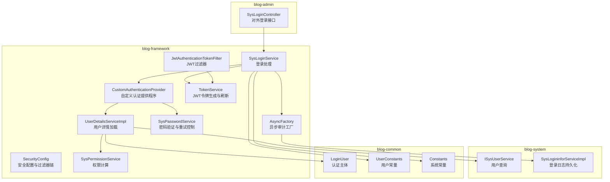
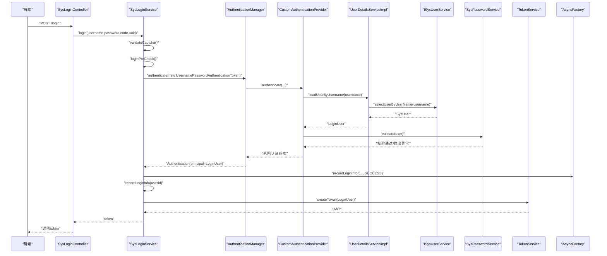
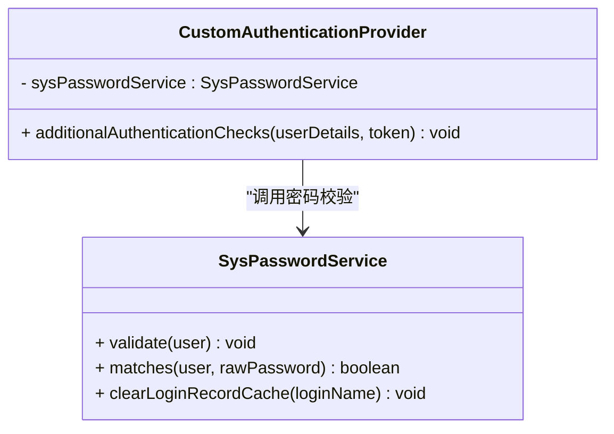
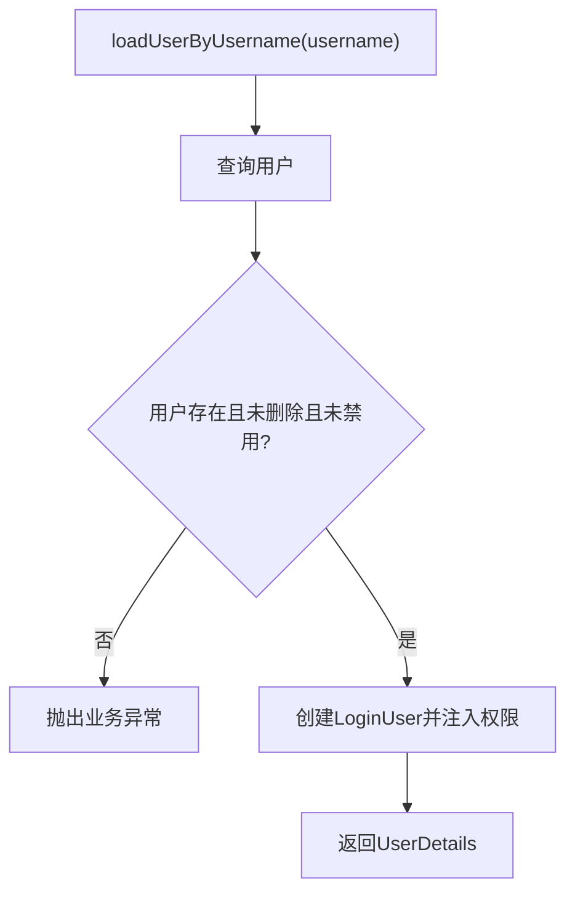
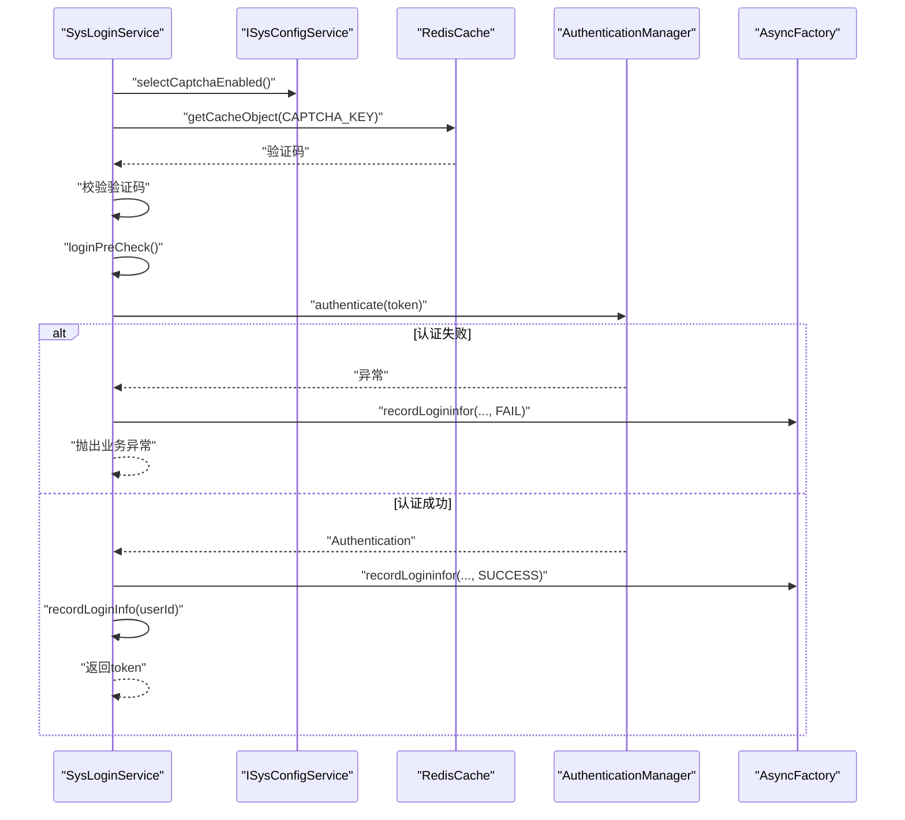
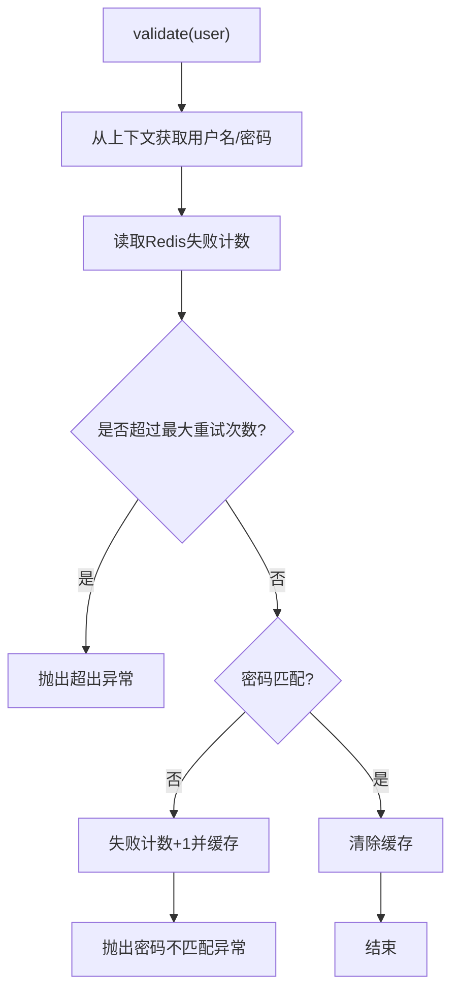
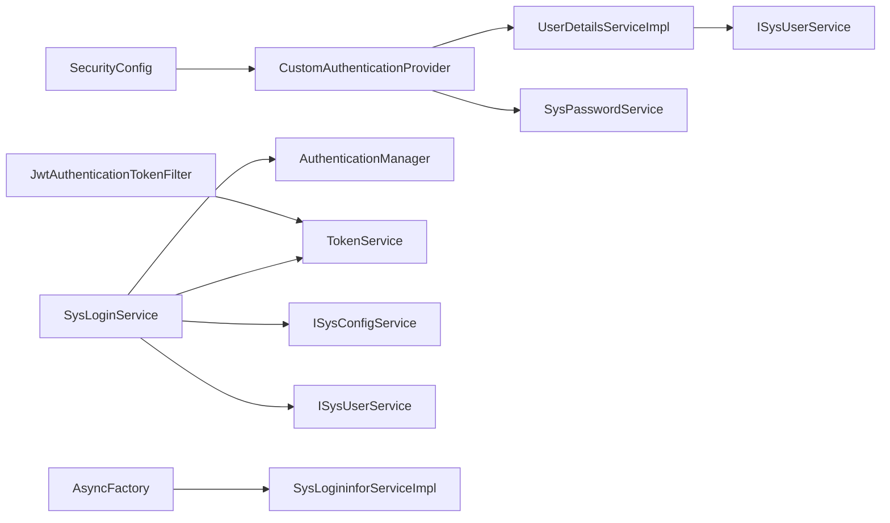

# 自定义认证提供程序

<cite>
**本文引用的文件**
- [CustomAuthenticationProvider.java](file://blog-framework/src/main/java/blog/framework/security/provider/CustomAuthenticationProvider.java)
- [UserDetailsServiceImpl.java](file://blog-framework/src/main/java/blog/framework/web/service/UserDetailsServiceImpl.java)
- [SysLoginService.java](file://blog-framework/src/main/java/blog/framework/web/service/SysLoginService.java)
- [SecurityConfig.java](file://blog-framework/src/main/java/blog/framework/config/SecurityConfig.java)
- [LoginUser.java](file://blog-common/src/main/java/blog/common/core/domain/model/LoginUser.java)
- [SysPasswordService.java](file://blog-framework/src/main/java/blog/framework/web/service/SysPasswordService.java)
- [SysPermissionService.java](file://blog-framework/src/main/java/blog/framework/web/service/SysPermissionService.java)
- [ISysUserService.java](file://blog-system/src/main/java/blog/system/service/ISysUserService.java)
- [TokenService.java](file://blog-framework/src/main/java/blog/framework/web/service/TokenService.java)
- [SysLoginController.java](file://blog-admin/src/main/java/blog/web/controller/system/SysLoginController.java)
- [JwtAuthenticationTokenFilter.java](file://blog-framework/src/main/java/blog/framework/security/filter/JwtAuthenticationTokenFilter.java)
- [AsyncFactory.java](file://blog-framework/src/main/java/blog/framework/manager/factory/AsyncFactory.java)
- [SysLogininforServiceImpl.java](file://blog-system/src/main/java/blog/system/service/impl/SysLogininforServiceImpl.java)
- [UserConstants.java](file://blog-common/src/main/java/blog/common/constant/UserConstants.java)
- [Constants.java](file://blog-common/src/main/java/blog/common/constant/Constants.java)
</cite>

## 目录
1. [简介](#简介)
2. [项目结构](#项目结构)
3. [核心组件](#核心组件)
4. [架构总览](#架构总览)
5. [详细组件分析](#详细组件分析)
6. [依赖分析](#依赖分析)
7. [性能考虑](#性能考虑)
8. [故障排查指南](#故障排查指南)
9. [结论](#结论)
10. [附录](#附录)

## 简介
本文件面向Leejie博客系统的自定义认证提供程序，围绕CustomAuthenticationProvider展开，系统性阐述认证流程、用户信息加载、密码验证、登录处理与安全审计等关键环节。文档同时解释认证提供程序与Spring Security的集成方式，包括AuthenticationProvider接口实现、Authentication对象创建、过滤器链协作等，并提供完整的认证时序图与错误处理策略。

## 项目结构
认证相关代码主要分布在以下模块：
- blog-framework：安全配置、认证提供程序、用户细节服务、登录服务、Token服务、JWT过滤器、异步审计工厂
- blog-system：用户、菜单、角色、登录日志等服务与Mapper
- blog-common：领域模型、常量、工具类
- blog-admin：登录控制器对外暴露登录接口

图表来源
- [SecurityConfig.java:94-127](file://blog-framework/src/main/java/blog/framework/config/SecurityConfig.java#L94-L127)
- [CustomAuthenticationProvider.java:25-57](file://blog-framework/src/main/java/blog/framework/security/provider/CustomAuthenticationProvider.java#L25-L57)
- [UserDetailsServiceImpl.java:24-55](file://blog-framework/src/main/java/blog/framework/web/service/UserDetailsServiceImpl.java#L24-L55)
- [SysLoginService.java:36-98](file://blog-framework/src/main/java/blog/framework/web/service/SysLoginService.java#L36-L98)
- [SysPasswordService.java:23-56](file://blog-framework/src/main/java/blog/framework/web/service/SysPasswordService.java#L23-L56)
- [SysPermissionService.java:22-75](file://blog-framework/src/main/java/blog/framework/web/service/SysPermissionService.java#L22-L75)
- [TokenService.java:32-142](file://blog-framework/src/main/java/blog/framework/web/service/TokenService.java#L32-L142)
- [JwtAuthenticationTokenFilter.java:27-49](file://blog-framework/src/main/java/blog/framework/security/filter/JwtAuthenticationTokenFilter.java#L27-L49)
- [AsyncFactory.java:25-74](file://blog-framework/src/main/java/blog/framework/manager/factory/AsyncFactory.java#L25-L74)
- [SysLogininforServiceImpl.java:17-31](file://blog-system/src/main/java/blog/system/service/impl/SysLogininforServiceImpl.java#L17-L31)
- [LoginUser.java:16-234](file://blog-common/src/main/java/blog/common/core/domain/model/LoginUser.java#L16-L234)
- [UserConstants.java:8-116](file://blog-common/src/main/java/blog/common/constant/UserConstants.java#L8-L116)
- [Constants.java:12-235](file://blog-common/src/main/java/blog/common/constant/Constants.java#L12-L235)

章节来源
- [SecurityConfig.java:94-127](file://blog-framework/src/main/java/blog/framework/config/SecurityConfig.java#L94-L127)
- [SysLoginController.java:33-64](file://blog-admin/src/main/java/blog/web/controller/system/SysLoginController.java#L33-L64)

## 核心组件
- 自定义认证提供程序：扩展DaoAuthenticationProvider，重写additionalAuthenticationChecks以接入业务密码校验与登录失败次数控制
- 用户详情服务：根据用户名查询用户、状态校验、构建LoginUser并注入权限
- 登录服务：验证码校验、前置校验、触发Spring Security认证、记录登录日志、更新登录信息、生成JWT
- 权限服务：基于用户角色与菜单计算权限集合
- 密码服务：密码匹配、失败次数统计与锁定、缓存清理
- JWT过滤器：从请求头解析令牌、校验有效性、刷新令牌并写入SecurityContext
- 异步审计：统一记录登录日志到数据库与日志文件

章节来源
- [CustomAuthenticationProvider.java:25-57](file://blog-framework/src/main/java/blog/framework/security/provider/CustomAuthenticationProvider.java#L25-L57)
- [UserDetailsServiceImpl.java:24-55](file://blog-framework/src/main/java/blog/framework/web/service/UserDetailsServiceImpl.java#L24-L55)
- [SysLoginService.java:36-98](file://blog-framework/src/main/java/blog/framework/web/service/SysLoginService.java#L36-L98)
- [SysPermissionService.java:22-75](file://blog-framework/src/main/java/blog/framework/web/service/SysPermissionService.java#L22-L75)
- [SysPasswordService.java:23-56](file://blog-framework/src/main/java/blog/framework/web/service/SysPasswordService.java#L23-L56)
- [JwtAuthenticationTokenFilter.java:27-49](file://blog-framework/src/main/java/blog/framework/security/filter/JwtAuthenticationTokenFilter.java#L27-L49)
- [AsyncFactory.java:25-74](file://blog-framework/src/main/java/blog/framework/manager/factory/AsyncFactory.java#L25-L74)

## 架构总览
系统采用“无状态+JWT”的认证模式：
- 前端提交用户名/密码/验证码
- 后端进行验证码与前置校验
- 通过AuthenticationManager触发自定义Provider完成用户加载与密码校验
- 成功后生成JWT并记录登录信息
- 请求后续携带JWT，过滤器解析并写入SecurityContext供授权使用

图表来源
- [SysLoginController.java:56-64](file://blog-admin/src/main/java/blog/web/controller/system/SysLoginController.java#L56-L64)
- [SysLoginService.java:62-98](file://blog-framework/src/main/java/blog/framework/web/service/SysLoginService.java#L62-L98)
- [CustomAuthenticationProvider.java:51-57](file://blog-framework/src/main/java/blog/framework/security/provider/CustomAuthenticationProvider.java#L51-L57)
- [UserDetailsServiceImpl.java:34-51](file://blog-framework/src/main/java/blog/framework/web/service/UserDetailsServiceImpl.java#L34-L51)
- [SysPasswordService.java:34-56](file://blog-framework/src/main/java/blog/framework/web/service/SysPasswordService.java#L34-L56)
- [TokenService.java:105-115](file://blog-framework/src/main/java/blog/framework/web/service/TokenService.java#L105-L115)
- [AsyncFactory.java:37-72](file://blog-framework/src/main/java/blog/framework/manager/factory/AsyncFactory.java#L37-L72)

## 详细组件分析

### 自定义认证提供程序（CustomAuthenticationProvider）
- 继承DaoAuthenticationProvider并通过构造函数注入UserDetailsService与PasswordEncoder
- 重写additionalAuthenticationChecks：从Authentication上下文获取用户名与明文密码，委托SysPasswordService进行密码校验与失败次数控制
- 优点：将密码策略与业务规则解耦，便于扩展与维护

图表来源
- [CustomAuthenticationProvider.java:25-57](file://blog-framework/src/main/java/blog/framework/security/provider/CustomAuthenticationProvider.java#L25-L57)
- [SysPasswordService.java:23-77](file://blog-framework/src/main/java/blog/framework/web/service/SysPasswordService.java#L23-L77)

章节来源
- [CustomAuthenticationProvider.java:25-57](file://blog-framework/src/main/java/blog/framework/security/provider/CustomAuthenticationProvider.java#L25-L57)

### 用户详情服务（UserDetailsServiceImpl）
- 根据用户名查询SysUser，进行存在性、删除标记、禁用状态校验
- 构建LoginUser并注入菜单权限集合
- 将密码校验逻辑移至CustomAuthenticationProvider，避免重复校验

图表来源
- [UserDetailsServiceImpl.java:34-55](file://blog-framework/src/main/java/blog/framework/web/service/UserDetailsServiceImpl.java#L34-L55)
- [SysPermissionService.java:53-74](file://blog-framework/src/main/java/blog/framework/web/service/SysPermissionService.java#L53-L74)

章节来源
- [UserDetailsServiceImpl.java:24-55](file://blog-framework/src/main/java/blog/framework/web/service/UserDetailsServiceImpl.java#L24-L55)
- [SysPermissionService.java:22-75](file://blog-framework/src/main/java/blog/framework/web/service/SysPermissionService.java#L22-L75)

### 登录处理服务（SysLoginService）
- 验证码校验：从Redis读取并删除验证码，校验失败记录登录失败日志
- 登录前置校验：用户名/密码长度校验、黑名单IP校验
- 触发认证：封装UsernamePasswordAuthenticationToken，交由AuthenticationManager
- 成功处理：记录登录成功日志、更新登录信息、生成JWT
- 失败处理：捕获BadCredentialsException与其它异常，分别记录不同消息并抛出对应业务异常

图表来源
- [SysLoginService.java:62-98](file://blog-framework/src/main/java/blog/framework/web/service/SysLoginService.java#L62-L98)
- [AsyncFactory.java:37-72](file://blog-framework/src/main/java/blog/framework/manager/factory/AsyncFactory.java#L37-L72)

章节来源
- [SysLoginService.java:36-98](file://blog-framework/src/main/java/blog/framework/web/service/SysLoginService.java#L36-L98)

### 密码验证与重试控制（SysPasswordService）
- 从Authentication上下文获取用户名与明文密码
- 从Redis读取失败次数，超过阈值抛出“超出最大重试次数”异常
- 密码不匹配则递增失败次数并按lockTime分钟缓存；匹配则清除缓存
- 使用SecurityUtils进行密码匹配

图表来源
- [SysPasswordService.java:34-56](file://blog-framework/src/main/java/blog/framework/web/service/SysPasswordService.java#L34-L56)

章节来源
- [SysPasswordService.java:23-77](file://blog-framework/src/main/java/blog/framework/web/service/SysPasswordService.java#L23-L77)

### 权限计算（SysPermissionService）
- 角色权限：管理员拥有所有角色；普通用户通过角色服务查询
- 菜单权限：管理员拥有通配权限；普通用户优先使用角色权限，否则回退到按用户查询

章节来源
- [SysPermissionService.java:22-75](file://blog-framework/src/main/java/blog/framework/web/service/SysPermissionService.java#L22-L75)

### JWT令牌生成与刷新（TokenService）
- 生成唯一token并写入LoginUser
- 解析User-Agent填充浏览器与操作系统信息
- 令牌有效期到期前20分钟自动刷新缓存

章节来源
- [TokenService.java:32-142](file://blog-framework/src/main/java/blog/framework/web/service/TokenService.java#L32-L142)

### JWT过滤器（JwtAuthenticationTokenFilter）
- 从请求头提取JWT，解析并校验有效性
- 若SecurityContext中无认证信息则写入UserDetails
- 对即将过期的令牌进行刷新

章节来源
- [JwtAuthenticationTokenFilter.java:27-49](file://blog-framework/src/main/java/blog/framework/security/filter/JwtAuthenticationTokenFilter.java#L27-L49)

### 登录审计（AsyncFactory 与 SysLogininforServiceImpl）
- AsyncFactory异步记录登录日志到sys-user日志文件与数据库
- SysLogininforServiceImpl负责持久化

章节来源
- [AsyncFactory.java:25-74](file://blog-framework/src/main/java/blog/framework/manager/factory/AsyncFactory.java#L25-L74)
- [SysLogininforServiceImpl.java:17-31](file://blog-system/src/main/java/blog/system/service/impl/SysLogininforServiceImpl.java#L17-L31)

## 依赖分析
- SecurityConfig装配自定义Provider并配置过滤器链，启用无状态会话策略
- SysLoginService依赖AuthenticationManager、RedisCache、ISysUserService、ISysConfigService、TokenService
- CustomAuthenticationProvider依赖UserDetailsService、PasswordEncoder、SysPasswordService
- UserDetailsServiceImpl依赖ISysUserService与SysPermissionService
- SysLoginController对外提供登录接口，内部依赖SysLoginService、TokenService、SysPermissionService

图表来源
- [SecurityConfig.java:64-74](file://blog-framework/src/main/java/blog/framework/config/SecurityConfig.java#L64-L74)
- [CustomAuthenticationProvider.java:32-42](file://blog-framework/src/main/java/blog/framework/security/provider/CustomAuthenticationProvider.java#L32-L42)
- [UserDetailsServiceImpl.java:27-31](file://blog-framework/src/main/java/blog/framework/web/service/UserDetailsServiceImpl.java#L27-L31)
- [SysLoginService.java:38-51](file://blog-framework/src/main/java/blog/framework/web/service/SysLoginService.java#L38-L51)
- [JwtAuthenticationTokenFilter.java:28-29](file://blog-framework/src/main/java/blog/framework/security/filter/JwtAuthenticationTokenFilter.java#L28-L29)
- [AsyncFactory.java:16-17](file://blog-framework/src/main/java/blog/framework/manager/factory/AsyncFactory.java#L16-L17)

章节来源
- [SecurityConfig.java:64-74](file://blog-framework/src/main/java/blog/framework/config/SecurityConfig.java#L64-L74)
- [SysLoginService.java:38-51](file://blog-framework/src/main/java/blog/framework/web/service/SysLoginService.java#L38-L51)

## 性能考虑
- 密码校验与失败次数控制通过Redis缓存实现，避免频繁数据库访问
- 登录日志采用异步记录，降低同步IO对主线程的影响
- JWT令牌有效期与自动刷新策略减少重复签发开销
- 建议：合理设置密码重试阈值与锁定时长，避免误伤正常用户；监控Redis命中率与延迟

## 故障排查指南
- 认证失败（用户名或密码错误）：SysLoginService捕获BadCredentialsException并记录登录失败日志，抛出用户密码不匹配异常
- 验证码失效/错误：SysLoginService在验证码校验阶段抛出相应异常并记录失败日志
- 用户不存在/已删除/已停用：UserDetailsServiceImpl在加载用户时抛出业务异常
- 密码重试超限：SysPasswordService在失败次数超过阈值时抛出超出异常
- 登录成功但权限不正确：确认SysPermissionService权限计算逻辑与用户角色/菜单配置一致

章节来源
- [SysLoginService.java:79-89](file://blog-framework/src/main/java/blog/framework/web/service/SysLoginService.java#L79-L89)
- [UserDetailsServiceImpl.java:36-45](file://blog-framework/src/main/java/blog/framework/web/service/UserDetailsServiceImpl.java#L36-L45)
- [SysPasswordService.java:45-47](file://blog-framework/src/main/java/blog/framework/web/service/SysPasswordService.java#L45-L47)
- [AsyncFactory.java:37-72](file://blog-framework/src/main/java/blog/framework/manager/factory/AsyncFactory.java#L37-L72)

## 结论
该认证体系通过自定义Provider将密码策略与Spring Security解耦，结合Redis缓存与异步审计，实现了高可用、可观测的登录流程。JWT无状态设计提升了横向扩展能力，配合权限服务与过滤器链确保了请求级的安全控制。

## 附录
- 关键常量与配置项参考：
  - 用户名/密码长度限制：[UserConstants.java:108-115](file://blog-common/src/main/java/blog/common/constant/UserConstants.java#L108-L115)
  - 登录状态与令牌常量：[Constants.java:54-121](file://blog-common/src/main/java/blog/common/constant/Constants.java#L54-L121)