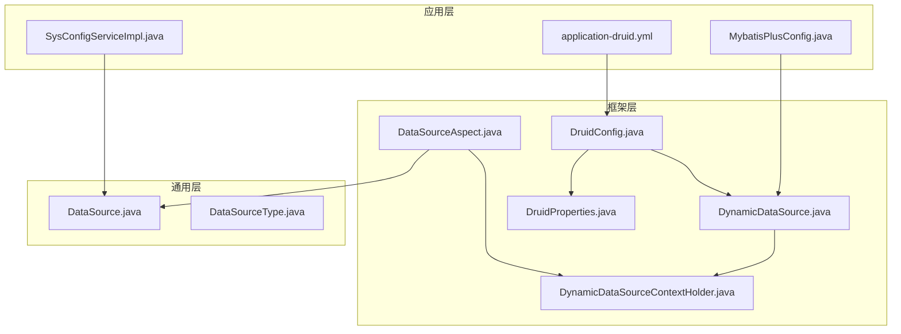
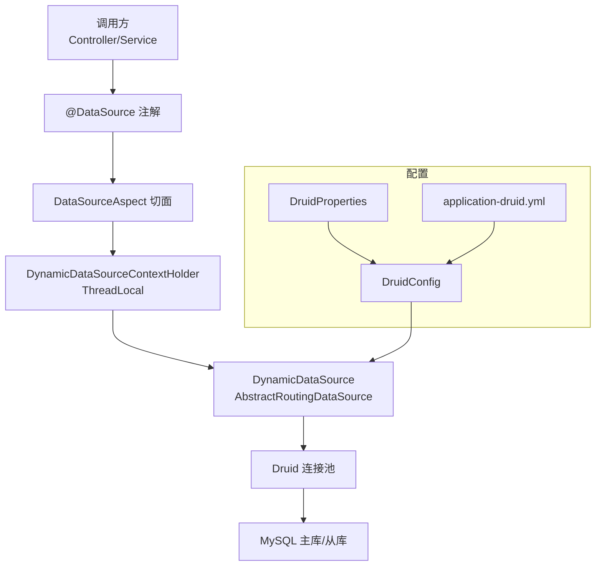
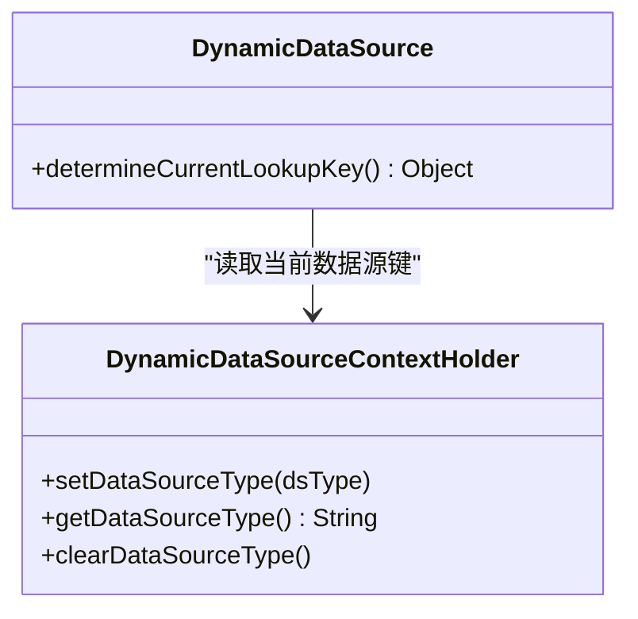
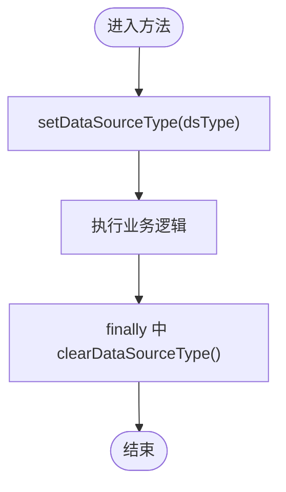
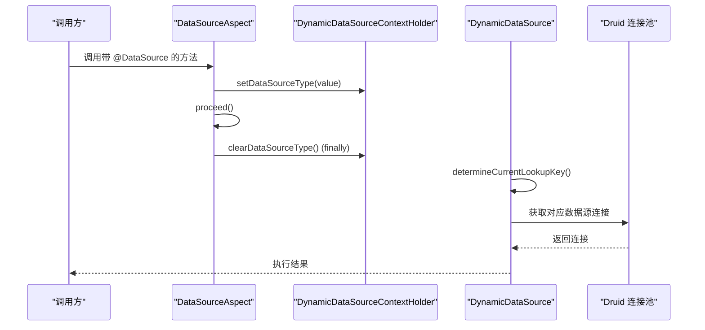
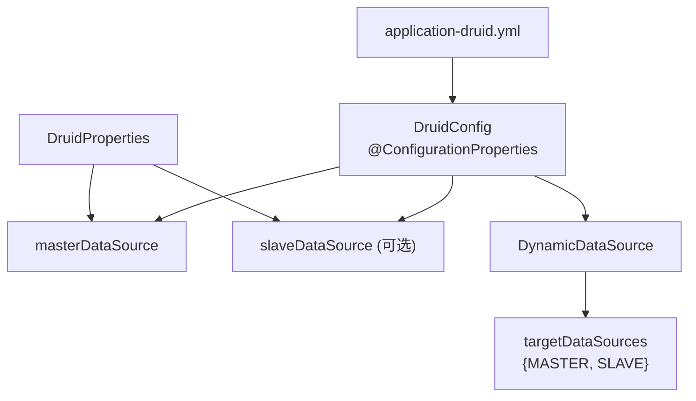
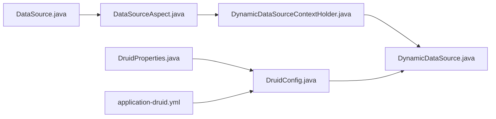

# 动态数据源路由

<cite>
**本文引用的文件**
- [DynamicDataSource.java](file://blog-framework/src/main/java/blog/framework/datasource/DynamicDataSource.java)
- [DynamicDataSourceContextHolder.java](file://blog-framework/src/main/java/blog/framework/datasource/DynamicDataSourceContextHolder.java)
- [DataSourceAspect.java](file://blog-framework/src/main/java/blog/framework/aspectj/DataSourceAspect.java)
- [DataSource.java](file://blog-common/src/main/java/blog/common/annotation/DataSource.java)
- [DataSourceType.java](file://blog-common/src/main/java/blog/common/enums/DataSourceType.java)
- [DruidConfig.java](file://blog-framework/src/main/java/blog/framework/config/DruidConfig.java)
- [DruidProperties.java](file://blog-framework/src/main/java/blog/framework/config/properties/DruidProperties.java)
- [application-druid.yml](file://blog-admin/src/main/resources/application-druid.yml)
- [SysConfigServiceImpl.java](file://blog-system/src/main/java/blog/system/service/impl/SysConfigServiceImpl.java)
- [MybatisPlusConfig.java](file://blog-framework/src/main/java/blog/framework/config/MybatisPlusConfig.java)
</cite>

## 目录
1. [简介](#简介)
2. [项目结构](#项目结构)
3. [核心组件](#核心组件)
4. [架构总览](#架构总览)
5. [组件详解](#组件详解)
6. [依赖关系分析](#依赖关系分析)
7. [性能考量](#性能考量)
8. [故障排查指南](#故障排查指南)
9. [结论](#结论)
10. [附录](#附录)

## 简介
本技术文档围绕 Leejie 博客系统的动态数据源路由机制展开，重点阐述以下内容：
- DynamicDataSource 的实现原理与数据源切换逻辑
- DynamicDataSourceContextHolder 上下文持有者的线程安全机制
- 多数据源场景下的路由策略（读写分离、主从切换）
- 数据源配置管理、连接池管理与事务处理机制
- 数据源路由架构图与切换流程图
- 多数据源配置示例、性能优化建议与故障排查指南

## 项目结构
本项目采用模块化组织，动态数据源相关能力集中在 framework 模块，通用注解与枚举位于 common 模块，系统服务模块用于演示注解使用。

**图表来源**
- [DynamicDataSource.java:1-24](file://blog-framework/src/main/java/blog/framework/datasource/DynamicDataSource.java#L1-L24)
- [DynamicDataSourceContextHolder.java:1-42](file://blog-framework/src/main/java/blog/framework/datasource/DynamicDataSourceContextHolder.java#L1-L42)
- [DataSourceAspect.java:1-65](file://blog-framework/src/main/java/blog/framework/aspectj/DataSourceAspect.java#L1-L65)
- [DataSource.java:1-29](file://blog-common/src/main/java/blog/common/annotation/DataSource.java#L1-L29)
- [DataSourceType.java:1-19](file://blog-common/src/main/java/blog/common/enums/DataSourceType.java#L1-L19)
- [DruidConfig.java:1-93](file://blog-framework/src/main/java/blog/framework/config/DruidConfig.java#L1-L93)
- [DruidProperties.java:1-87](file://blog-framework/src/main/java/blog/framework/config/properties/DruidProperties.java#L1-L87)
- [application-druid.yml:1-61](file://blog-admin/src/main/resources/application-druid.yml#L1-L61)
- [SysConfigServiceImpl.java:40-211](file://blog-system/src/main/java/blog/system/service/impl/SysConfigServiceImpl.java#L40-L211)
- [MybatisPlusConfig.java:1-56](file://blog-framework/src/main/java/blog/framework/config/MybatisPlusConfig.java#L1-L56)

**章节来源**
- [DynamicDataSource.java:1-24](file://blog-framework/src/main/java/blog/framework/datasource/DynamicDataSource.java#L1-L24)
- [DynamicDataSourceContextHolder.java:1-42](file://blog-framework/src/main/java/blog/framework/datasource/DynamicDataSourceContextHolder.java#L1-L42)
- [DataSourceAspect.java:1-65](file://blog-framework/src/main/java/blog/framework/aspectj/DataSourceAspect.java#L1-L65)
- [DataSource.java:1-29](file://blog-common/src/main/java/blog/common/annotation/DataSource.java#L1-L29)
- [DataSourceType.java:1-19](file://blog-common/src/main/java/blog/common/enums/DataSourceType.java#L1-L19)
- [DruidConfig.java:1-93](file://blog-framework/src/main/java/blog/framework/config/DruidConfig.java#L1-L93)
- [DruidProperties.java:1-87](file://blog-framework/src/main/java/blog/framework/config/properties/DruidProperties.java#L1-L87)
- [application-druid.yml:1-61](file://blog-admin/src/main/resources/application-druid.yml#L1-L61)
- [SysConfigServiceImpl.java:40-211](file://blog-system/src/main/java/blog/system/service/impl/SysConfigServiceImpl.java#L40-L211)
- [MybatisPlusConfig.java:1-56](file://blog-framework/src/main/java/blog/framework/config/MybatisPlusConfig.java#L1-L56)

## 核心组件
- 动态数据源路由核心
  - DynamicDataSource：继承 Spring 的 AbstractRoutingDataSource，通过 determineCurrentLookupKey() 从上下文持有者获取当前数据源键，实现运行时动态切换。
  - DynamicDataSourceContextHolder：基于 ThreadLocal 的上下文持有者，确保每个线程拥有独立的数据源标识，避免并发污染。
- 切换控制与声明
  - DataSource 注解：用于在方法或类级别声明目标数据源类型，默认 MASTER。
  - DataSourceAspect：基于 AOP 的环绕通知，在方法执行前后设置/清理上下文，实现“按需切换”。
  - DataSourceType 枚举：定义 MASTER/SLAVE 两种数据源类型。
- 连接池与配置
  - DruidConfig：装配主库与可选从库，构建 DynamicDataSource 并注册为 @Primary。
  - DruidProperties：集中配置连接池参数，统一注入到 DruidDataSource。
  - application-druid.yml：提供主库与从库的 JDBC 地址、账号密码及连接池参数等配置项。
- 使用示例
  - SysConfigServiceImpl：在关键读取方法上使用 @DataSource(DataSourceType.MASTER)，确保强一致读取。

**章节来源**
- [DynamicDataSource.java:13-24](file://blog-framework/src/main/java/blog/framework/datasource/DynamicDataSource.java#L13-L24)
- [DynamicDataSourceContextHolder.java:11-41](file://blog-framework/src/main/java/blog/framework/datasource/DynamicDataSourceContextHolder.java#L11-L41)
- [DataSource.java:19-28](file://blog-common/src/main/java/blog/common/annotation/DataSource.java#L19-L28)
- [DataSourceAspect.java:24-65](file://blog-framework/src/main/java/blog/framework/aspectj/DataSourceAspect.java#L24-L65)
- [DataSourceType.java:8-18](file://blog-common/src/main/java/blog/common/enums/DataSourceType.java#L8-L18)
- [DruidConfig.java:33-72](file://blog-framework/src/main/java/blog/framework/config/DruidConfig.java#L33-L72)
- [DruidProperties.java:12-87](file://blog-framework/src/main/java/blog/framework/config/properties/DruidProperties.java#L12-L87)
- [application-druid.yml:1-61](file://blog-admin/src/main/resources/application-druid.yml#L1-L61)
- [SysConfigServiceImpl.java:49-55](file://blog-system/src/main/java/blog/system/service/impl/SysConfigServiceImpl.java#L49-L55)

## 架构总览
动态数据源路由的整体架构由“注解声明 + AOP 切面 + 上下文持有 + 路由数据源 + 连接池配置”构成，形成“声明式切换 + 运行时解析 + 线程隔离”的闭环。

**图表来源**
- [DataSourceAspect.java:30-50](file://blog-framework/src/main/java/blog/framework/aspectj/DataSourceAspect.java#L30-L50)
- [DynamicDataSourceContextHolder.java:23-40](file://blog-framework/src/main/java/blog/framework/datasource/DynamicDataSourceContextHolder.java#L23-L40)
- [DynamicDataSource.java:20-23](file://blog-framework/src/main/java/blog/framework/datasource/DynamicDataSource.java#L20-L23)
- [DruidConfig.java:35-57](file://blog-framework/src/main/java/blog/framework/config/DruidConfig.java#L35-L57)
- [DruidProperties.java:53-86](file://blog-framework/src/main/java/blog/framework/config/properties/DruidProperties.java#L53-L86)
- [application-druid.yml:6-18](file://blog-admin/src/main/resources/application-druid.yml#L6-L18)

## 组件详解

### DynamicDataSource 实现原理
- 继承 AbstractRoutingDataSource，构造时传入默认数据源与目标数据源映射。
- determineCurrentLookupKey() 返回当前线程上下文中的数据源键，Spring 根据此键从 targetDataSources 中选择具体数据源。
- 该设计使得“切换点”与“执行点”解耦，只需在调用前设置上下文即可生效。

**图表来源**
- [DynamicDataSource.java:13-24](file://blog-framework/src/main/java/blog/framework/datasource/DynamicDataSource.java#L13-L24)
- [DynamicDataSourceContextHolder.java:11-41](file://blog-framework/src/main/java/blog/framework/datasource/DynamicDataSourceContextHolder.java#L11-L41)

**章节来源**
- [DynamicDataSource.java:13-24](file://blog-framework/src/main/java/blog/framework/datasource/DynamicDataSource.java#L13-L24)

### DynamicDataSourceContextHolder 上下文持有者
- 使用 ThreadLocal 存储数据源类型字符串，确保线程隔离。
- 提供 set/get/clear 方法，分别用于切换、读取与清理，避免线程复用导致的脏读。
- 日志输出便于问题定位。

**图表来源**
- [DynamicDataSourceContextHolder.java:23-40](file://blog-framework/src/main/java/blog/framework/datasource/DynamicDataSourceContextHolder.java#L23-L40)
- [DataSourceAspect.java:36-50](file://blog-framework/src/main/java/blog/framework/aspectj/DataSourceAspect.java#L36-L50)

**章节来源**
- [DynamicDataSourceContextHolder.java:11-41](file://blog-framework/src/main/java/blog/framework/datasource/DynamicDataSourceContextHolder.java#L11-L41)
- [DataSourceAspect.java:36-50](file://blog-framework/src/main/java/blog/framework/aspectj/DataSourceAspect.java#L36-L50)

### 切换控制与声明：注解与切面
- DataSource 注解支持方法与类级别，优先级为“方法覆盖类级别”。
- DataSourceAspect 通过 AOP 在方法执行前设置上下文，在 finally 中清理，保证无论正常返回还是异常抛出都能恢复。
- 切换策略：读操作可按需指定 SLAVE；写操作或强一致读取应显式指定 MASTER。

**图表来源**
- [DataSourceAspect.java:36-50](file://blog-framework/src/main/java/blog/framework/aspectj/DataSourceAspect.java#L36-L50)
- [DynamicDataSource.java:20-23](file://blog-framework/src/main/java/blog/framework/datasource/DynamicDataSource.java#L20-L23)
- [DynamicDataSourceContextHolder.java:23-40](file://blog-framework/src/main/java/blog/framework/datasource/DynamicDataSourceContextHolder.java#L23-L40)

**章节来源**
- [DataSource.java:19-28](file://blog-common/src/main/java/blog/common/annotation/DataSource.java#L19-L28)
- [DataSourceAspect.java:24-65](file://blog-framework/src/main/java/blog/framework/aspectj/DataSourceAspect.java#L24-L65)

### 多数据源路由策略
- 读写分离
  - 写操作：在涉及新增/修改/删除的方法上使用 @DataSource(MASTER)，确保写入主库。
  - 读操作：在纯查询方法上使用 @DataSource(SLAVE)，将读流量分散至从库，减轻主库压力。
- 主从切换
  - 当从库启用时，DynamicDataSource 将根据上下文键从 targetDataSources 中选择从库；当从库禁用时，回退到默认主库。
- 负载均衡
  - 本实现未内置多从库轮询策略，可通过扩展 targetDataSources 的键值与选择逻辑实现更细粒度的路由（例如按请求特征选择不同 SLAVE）。

**章节来源**
- [DruidConfig.java:42-57](file://blog-framework/src/main/java/blog/framework/config/DruidConfig.java#L42-L57)
- [application-druid.yml:12-18](file://blog-admin/src/main/resources/application-druid.yml#L12-L18)
- [SysConfigServiceImpl.java:49-55](file://blog-system/src/main/java/blog/system/service/impl/SysConfigServiceImpl.java#L49-L55)

### 数据源配置管理与连接池管理
- DruidConfig
  - 定义 masterDataSource 与可选 slaveDataSource Bean。
  - 构建 DynamicDataSource，将 MASTER 映射到主库，SLAVE 映射到从库（若启用）。
  - setDataSource 方法通过 SpringUtils 从容器获取从库 Bean 并加入 targetDataSources。
- DruidProperties
  - 将 application.yml 中的连接池参数注入到 DruidDataSource，统一配置与校验。
- application-druid.yml
  - 提供主库与从库的 JDBC 连接信息、账号密码、连接池参数、慢 SQL 记录与控制台访问配置。

**图表来源**
- [DruidConfig.java:35-72](file://blog-framework/src/main/java/blog/framework/config/DruidConfig.java#L35-L72)
- [DruidProperties.java:53-86](file://blog-framework/src/main/java/blog/framework/config/properties/DruidProperties.java#L53-L86)
- [application-druid.yml:6-18](file://blog-admin/src/main/resources/application-druid.yml#L6-L18)

**章节来源**
- [DruidConfig.java:33-72](file://blog-framework/src/main/java/blog/framework/config/DruidConfig.java#L33-L72)
- [DruidProperties.java:12-87](file://blog-framework/src/main/java/blog/framework/config/properties/DruidProperties.java#L12-L87)
- [application-druid.yml:1-61](file://blog-admin/src/main/resources/application-druid.yml#L1-L61)

### 事务处理机制
- 事务边界由业务层注解或编程式事务控制，动态数据源切换在事务内保持一致。
- 建议：在同一个事务中，若涉及写后再读，应显式使用 MASTER，避免读到旧值。
- MybatisPlusConfig 提供分页与元对象填充等通用能力，与动态数据源协同工作。

**章节来源**
- [MybatisPlusConfig.java:16-55](file://blog-framework/src/main/java/blog/framework/config/MybatisPlusConfig.java#L16-L55)

## 依赖关系分析
- 组件耦合
  - DataSourceAspect 依赖 DataSource 注解与 DynamicDataSourceContextHolder。
  - DynamicDataSource 依赖 DynamicDataSourceContextHolder 提供的 lookup key。
  - DruidConfig 依赖 DruidProperties 与 application-druid.yml，负责装配与注册 DynamicDataSource。
- 外部依赖
  - Spring JDBC RoutingDataSource、MyBatis/MyBatis-Plus、Alibaba Druid。
- 潜在风险
  - 忘记清理上下文可能导致线程复用引发的脏读。
  - 从库未启用时，SLAVE 将无法命中，需确保配置正确。

**图表来源**
- [DataSource.java:19-28](file://blog-common/src/main/java/blog/common/annotation/DataSource.java#L19-L28)
- [DataSourceAspect.java:24-65](file://blog-framework/src/main/java/blog/framework/aspectj/DataSourceAspect.java#L24-L65)
- [DynamicDataSourceContextHolder.java:11-41](file://blog-framework/src/main/java/blog/framework/datasource/DynamicDataSourceContextHolder.java#L11-L41)
- [DynamicDataSource.java:13-24](file://blog-framework/src/main/java/blog/framework/datasource/DynamicDataSource.java#L13-L24)
- [DruidConfig.java:33-72](file://blog-framework/src/main/java/blog/framework/config/DruidConfig.java#L33-L72)
- [DruidProperties.java:12-87](file://blog-framework/src/main/java/blog/framework/config/properties/DruidProperties.java#L12-L87)
- [application-druid.yml:1-61](file://blog-admin/src/main/resources/application-druid.yml#L1-L61)

**章节来源**
- [DataSourceAspect.java:24-65](file://blog-framework/src/main/java/blog/framework/aspectj/DataSourceAspect.java#L24-L65)
- [DynamicDataSource.java:13-24](file://blog-framework/src/main/java/blog/framework/datasource/DynamicDataSource.java#L13-L24)
- [DruidConfig.java:33-72](file://blog-framework/src/main/java/blog/framework/config/DruidConfig.java#L33-L72)

## 性能考量
- 连接池参数优化
  - 合理设置初始连接数、最小/最大空闲连接、最大活跃连接与等待超时，避免频繁创建销毁与排队。
  - 开启空闲连接检测与有效性校验，减少僵尸连接。
- 读写分离收益
  - 将只读查询分流至从库，显著降低主库压力；对强一致读取显式使用 MASTER。
- AOP 切面开销
  - 切面仅在方法执行前后少量操作，通常可忽略；注意避免在高频微小方法上滥用注解。
- 监控与告警
  - 启用 Druid 慢 SQL 记录与控制台访问，结合日志观察切换频率与耗时。

[本节为通用指导，无需列出章节来源]

## 故障排查指南
- 症状：读到旧数据或从库未生效
  - 排查：确认方法是否使用 @DataSource(MASTER) 或 @DataSource(SLAVE) 正确标注；检查 finally 是否被异常吞掉导致未清理。
  - 参考：[DataSourceAspect.java:36-50](file://blog-framework/src/main/java/blog/framework/aspectj/DataSourceAspect.java#L36-L50)
- 症状：从库连接失败
  - 排查：检查 application-druid.yml 中 slave.enabled 是否为 true，JDBC 地址、账号密码是否正确。
  - 参考：[application-druid.yml:12-18](file://blog-admin/src/main/resources/application-druid.yml#L12-L18)
- 症状：连接池参数无效
  - 排查：确认 DruidProperties 是否正确注入到 master/slave 数据源；检查配置项拼写与类型。
  - 参考：[DruidProperties.java:53-86](file://blog-framework/src/main/java/blog/framework/config/properties/DruidProperties.java#L53-L86)
- 症状：事务内读写不一致
  - 排查：在同一事务中，写后再读应显式使用 MASTER；避免跨方法的隐式切换。
  - 参考：[SysConfigServiceImpl.java:49-55](file://blog-system/src/main/java/blog/system/service/impl/SysConfigServiceImpl.java#L49-L55)

**章节来源**
- [DataSourceAspect.java:36-50](file://blog-framework/src/main/java/blog/framework/aspectj/DataSourceAspect.java#L36-L50)
- [application-druid.yml:12-18](file://blog-admin/src/main/resources/application-druid.yml#L12-L18)
- [DruidProperties.java:53-86](file://blog-framework/src/main/java/blog/framework/config/properties/DruidProperties.java#L53-L86)
- [SysConfigServiceImpl.java:49-55](file://blog-system/src/main/java/blog/system/service/impl/SysConfigServiceImpl.java#L49-L55)

## 结论
本方案通过“注解声明 + AOP 切面 + ThreadLocal 上下文 + Spring 路由数据源 + Druid 连接池”的组合，实现了简洁可靠的动态数据源路由。在读写分离与主从切换方面具备良好扩展性；配合合理的连接池参数与监控手段，可在保证一致性的同时提升整体吞吐与稳定性。

[本节为总结性内容，无需列出章节来源]

## 附录

### 多数据源配置示例（要点）
- application-druid.yml
  - 主库：spring.datasource.druid.master.url/username/password
  - 从库：spring.datasource.druid.slave.enabled=true/false；url/username/password
  - 连接池：initialSize/minIdle/maxActive/maxWait/connectTimeout/socketTimeout/validationQuery 等
  - 参考：[application-druid.yml:6-18](file://blog-admin/src/main/resources/application-druid.yml#L6-L18)
- DruidConfig
  - 定义 masterDataSource 与 slaveDataSource Bean，并构建 DynamicDataSource 注册为 @Primary
  - 参考：[DruidConfig.java:35-57](file://blog-framework/src/main/java/blog/framework/config/DruidConfig.java#L35-L57)
- DruidProperties
  - 将配置项注入到 DruidDataSource，统一设置初始化大小、等待时间、超时与校验策略
  - 参考：[DruidProperties.java:53-86](file://blog-framework/src/main/java/blog/framework/config/properties/DruidProperties.java#L53-L86)

**章节来源**
- [application-druid.yml:6-18](file://blog-admin/src/main/resources/application-druid.yml#L6-L18)
- [DruidConfig.java:35-57](file://blog-framework/src/main/java/blog/framework/config/DruidConfig.java#L35-L57)
- [DruidProperties.java:53-86](file://blog-framework/src/main/java/blog/framework/config/properties/DruidProperties.java#L53-L86)