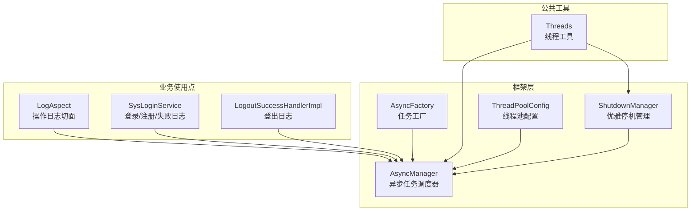
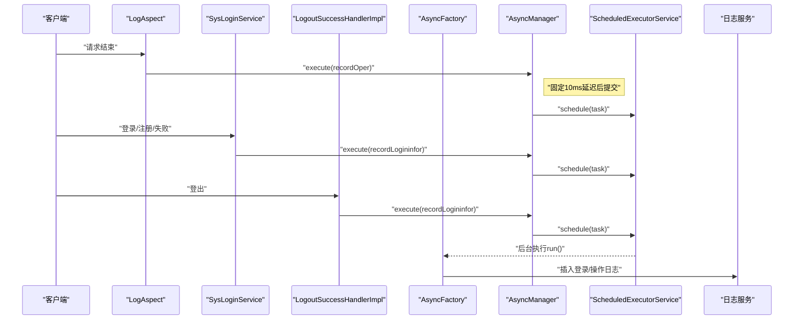
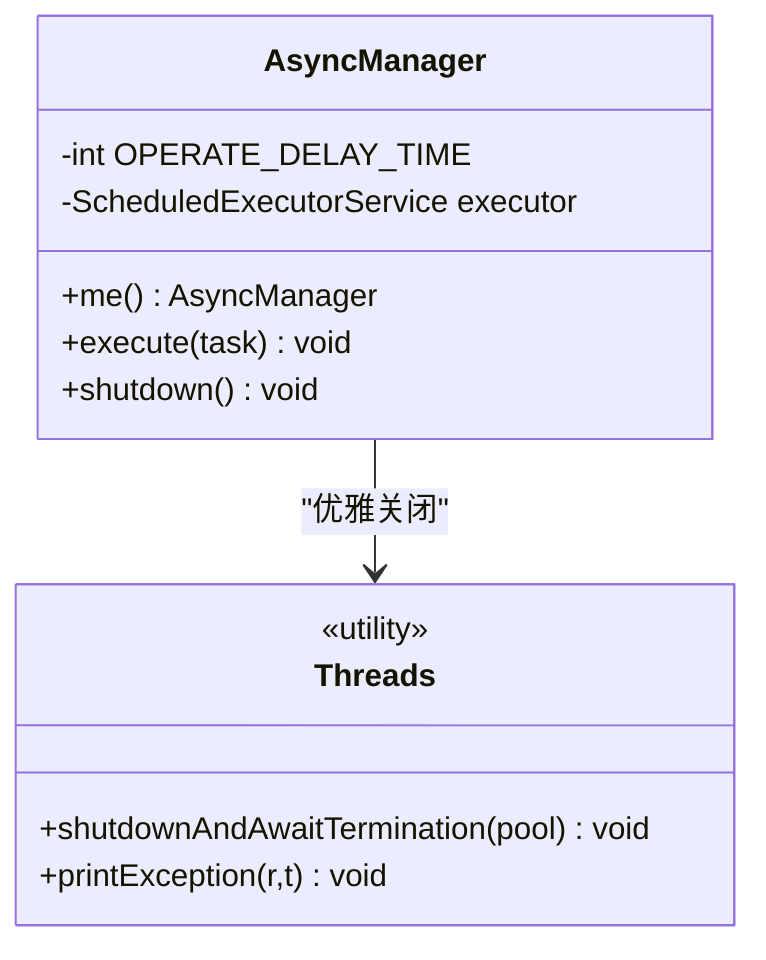
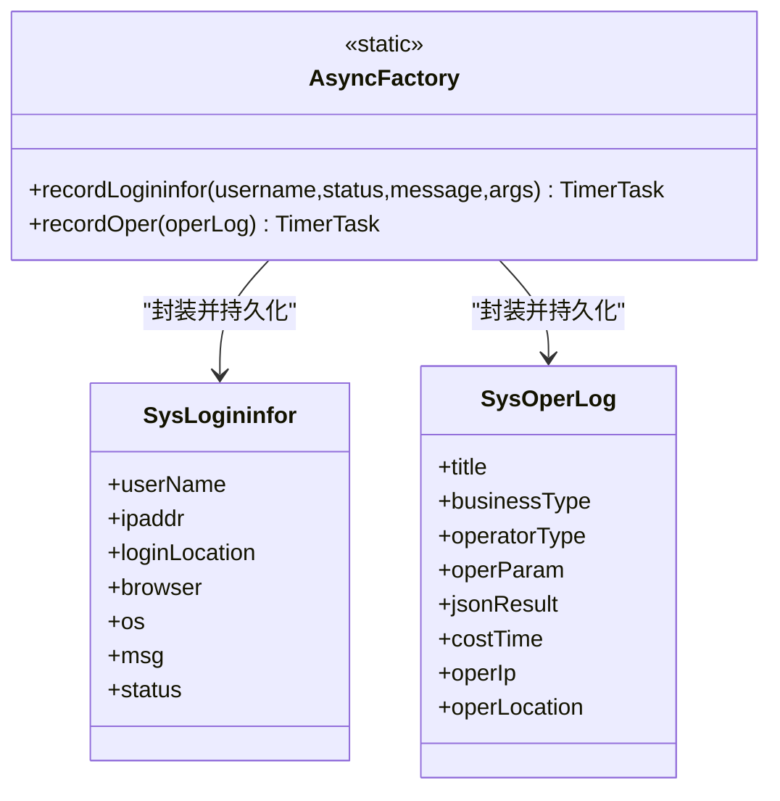
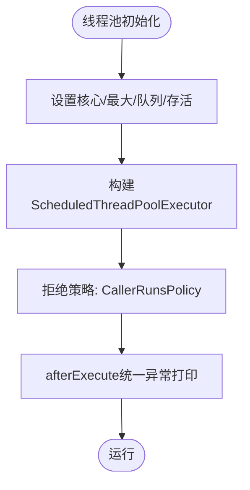
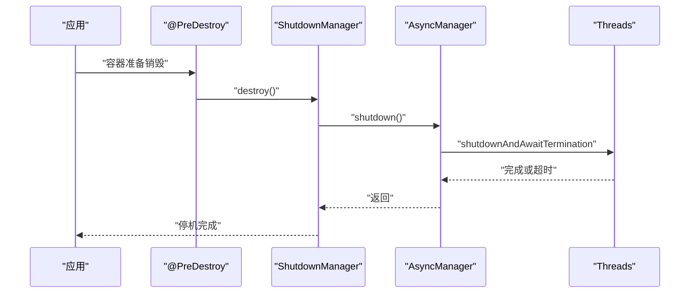
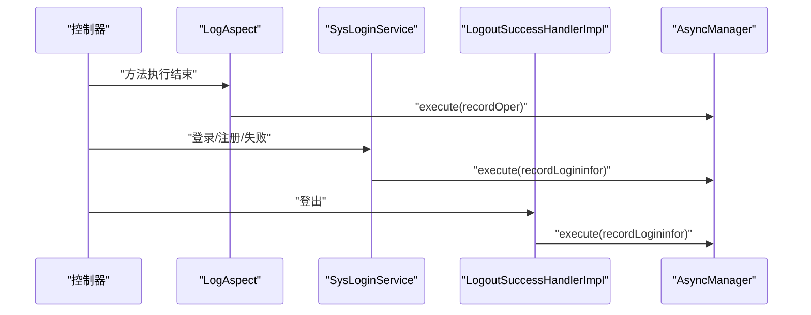
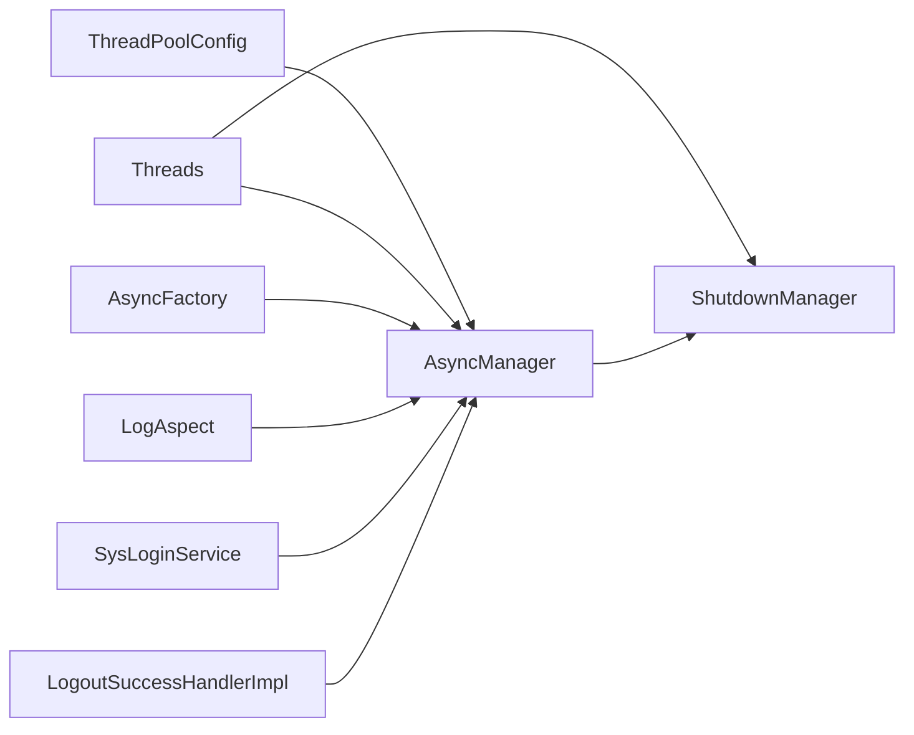

# 异步处理机制

<cite>
**本文引用的文件**
- [AsyncManager.java](file://blog-framework/src/main/java/blog/framework/manager/AsyncManager.java)
- [AsyncFactory.java](file://blog-framework/src/main/java/blog/framework/manager/factory/AsyncFactory.java)
- [ShutdownManager.java](file://blog-framework/src/main/java/blog/framework/manager/ShutdownManager.java)
- [ThreadPoolConfig.java](file://blog-framework/src/main/java/blog/framework/config/ThreadPoolConfig.java)
- [Threads.java](file://blog-common/src/main/java/blog/common/utils/Threads.java)
- [LogAspect.java](file://blog-framework/src/main/java/blog/framework/aspectj/L.java)
- [SysLoginService.java](file://blog-framework/src/main/java/blog/framework/web/service/SysLoginService.java)
- [LogoutSuccessHandlerImpl.java](file://blog-framework/src/main/java/blog/framework/security/handle/LogoutSuccessHandlerImpl.java)
- [Constants.java](file://blog-common/src/main/java/blog/common/constant/Constants.java)
- [ScheduleConstants.java](file://blog-common/src/main/java/blog/common/constant/ScheduleConstants.java)
</cite>

## 目录
1. [简介](#简介)
2. [项目结构](#项目结构)
3. [核心组件](#核心组件)
4. [架构总览](#架构总览)
5. [详细组件分析](#详细组件分析)
6. [依赖分析](#依赖分析)
7. [性能考虑](#性能考虑)
8. [故障排查指南](#故障排查指南)
9. [结论](#结论)
10. [附录](#附录)

## 简介
本文件面向Leejie博客系统的异步处理机制，聚焦于后台非关键路径日志与统计等任务的调度与执行。系统采用基于ScheduledExecutorService的轻量异步任务模型，通过AsyncManager统一调度，AsyncFactory负责任务封装，ThreadPoolConfig提供线程池配置，ShutdownManager确保优雅停机。本文将从架构、组件职责、数据流、生命周期与错误处理等方面进行深入剖析，并给出性能调优与故障诊断建议。

## 项目结构
围绕异步处理的相关模块分布如下：
- framework层：异步管理与线程池配置
  - manager：AsyncManager、ShutdownManager
  - manager.factory：AsyncFactory
  - config：ThreadPoolConfig
- common层：Threads工具类
- 使用点：LogAspect（操作日志）、SysLoginService（登录/注册/失败日志）、LogoutSuccessHandlerImpl（登出日志）

图表来源
- [AsyncManager.java:15-53](file://blog-framework/src/main/java/blog/framework/manager/AsyncManager.java#L15-L53)
- [AsyncFactory.java:25-92](file://blog-framework/src/main/java/blog/framework/manager/factory/AsyncFactory.java#L25-L92)
- [ShutdownManager.java:14-33](file://blog-framework/src/main/java/blog/framework/manager/ShutdownManager.java#L14-L33)
- [ThreadPoolConfig.java:19-58](file://blog-framework/src/main/java/blog/framework/config/ThreadPoolConfig.java#L19-L58)
- [Threads.java:37-74](file://blog-common/src/main/java/blog/common/utils/Threads.java#L37-L74)
- [LogAspect.java:120-134](file://blog-framework/src/main/java/blog/framework/aspectj/LogAspect.java#L120-L134)
- [SysLoginService.java:75-98](file://blog-framework/src/main/java/blog/framework/web/service/SysLoginService.java#L75-L98)
- [LogoutSuccessHandlerImpl.java:40-52](file://blog-framework/src/main/java/blog/framework/security/handle/LogoutSuccessHandlerImpl.java#L40-L52)

章节来源
- [AsyncManager.java:15-53](file://blog-framework/src/main/java/blog/framework/manager/AsyncManager.java#L15-L53)
- [ThreadPoolConfig.java:19-58](file://blog-framework/src/main/java/blog/framework/config/ThreadPoolConfig.java#L19-L58)

## 核心组件
- AsyncManager：单例的异步任务调度器，负责将TimerTask提交至Spring容器中的ScheduledExecutorService，带固定短延迟以缓解瞬时峰值。
- AsyncFactory：静态工厂，封装具体业务任务（如登录日志、操作日志）为TimerTask，屏蔽业务细节与外部依赖（IP归属、UA解析、持久化）。
- ThreadPoolConfig：定义线程池参数（核心/最大/队列容量/存活时间），并提供“schedule-pool”命名的守护型ScheduledExecutorService，拒绝策略采用调用者运行策略，同时在afterExecute中统一打印异常。
- ShutdownManager：应用销毁阶段通过@PreDestroy触发，调用AsyncManager.shutdown，借助Threads工具进行有序关闭。
- Threads：提供sleep、优雅关闭（shutdownAndAwaitTermination）与异常打印（printException）等通用能力。

章节来源
- [AsyncManager.java:15-53](file://blog-framework/src/main/java/blog/framework/manager/AsyncManager.java#L15-L53)
- [AsyncFactory.java:25-92](file://blog-framework/src/main/java/blog/framework/manager/factory/AsyncFactory.java#L25-L92)
- [ThreadPoolConfig.java:19-58](file://blog-framework/src/main/java/blog/framework/config/ThreadPoolConfig.java#L19-L58)
- [ShutdownManager.java:14-33](file://blog-framework/src/main/java/blog/framework/manager/ShutdownManager.java#L14-L33)
- [Threads.java:37-74](file://blog-common/src/main/java/blog/common/utils/Threads.java#L37-L74)

## 架构总览
异步处理的整体流程：
- 业务/切面在关键事件发生时，通过AsyncFactory创建TimerTask。
- AsyncManager将任务按固定延迟提交到ScheduledExecutorService。
- 任务在后台线程中执行，完成日志落库或地理位置解析等操作。
- 应用关闭时，ShutdownManager触发AsyncManager关闭，确保未执行任务得到处理。

图表来源
- [LogAspect.java:120-134](file://blog-framework/src/main/java/blog/framework/aspectj/LogAspect.java#L120-L134)
- [SysLoginService.java:75-98](file://blog-framework/src/main/java/blog/framework/web/service/SysLoginService.java#L75-L98)
- [LogoutSuccessHandlerImpl.java:40-52](file://blog-framework/src/main/java/blog/framework/security/handle/LogoutSuccessHandlerImpl.java#L40-L52)
- [AsyncFactory.java:25-92](file://blog-framework/src/main/java/blog/framework/manager/factory/AsyncFactory.java#L25-L92)
- [AsyncManager.java:43-45](file://blog-framework/src/main/java/blog/framework/manager/AsyncManager.java#L43-L45)
- [ThreadPoolConfig.java:47-58](file://blog-framework/src/main/java/blog/framework/config/ThreadPoolConfig.java#L47-L58)

## 详细组件分析

### AsyncManager：任务调度与生命周期
- 单例持有ScheduledExecutorService（从Spring上下文按名称注入）。
- execute方法对TimerTask增加固定10ms延迟，降低瞬时并发压力。
- shutdown通过Threads工具进行优雅关闭，避免资源泄漏。

图表来源
- [AsyncManager.java:15-53](file://blog-framework/src/main/java/blog/framework/manager/AsyncManager.java#L15-L53)
- [Threads.java:37-74](file://blog-common/src/main/java/blog/common/utils/Threads.java#L37-L74)

章节来源
- [AsyncManager.java:15-53](file://blog-framework/src/main/java/blog/framework/manager/AsyncManager.java#L15-L53)
- [Threads.java:37-74](file://blog-common/src/main/java/blog/common/utils/Threads.java#L37-L74)

### AsyncFactory：任务封装与业务隔离
- 提供recordLogininfor与recordOper两个静态工厂方法，分别封装登录/登出/注册与操作日志的异步任务。
- 任务内部完成IP归属地查询、UA解析、状态映射、持久化等逻辑，对外只暴露TimerTask。
- 通过SpringUtils获取服务，保证在异步线程中也能正确访问Spring上下文。

图表来源
- [AsyncFactory.java:25-92](file://blog-framework/src/main/java/blog/framework/manager/factory/AsyncFactory.java#L25-L92)

章节来源
- [AsyncFactory.java:25-92](file://blog-framework/src/main/java/blog/framework/manager/factory/AsyncFactory.java#L25-L92)

### ThreadPoolConfig：线程池与拒绝策略
- 定义核心池大小、最大池大小、队列容量与存活时间。
- ScheduledExecutorService采用守护线程与CallerRunsPolicy，确保在高负载下仍能处理任务，避免丢弃。
- afterExecute中统一打印异常，便于问题定位。

图表来源
- [ThreadPoolConfig.java:19-58](file://blog-framework/src/main/java/blog/framework/config/ThreadPoolConfig.java#L19-L58)

章节来源
- [ThreadPoolConfig.java:19-58](file://blog-framework/src/main/java/blog/framework/config/ThreadPoolConfig.java#L19-L58)

### ShutdownManager：优雅停机
- 在应用销毁前调用AsyncManager.shutdown，确保后台任务得到妥善处理。
- 通过日志记录停机过程，便于运维监控。

图表来源
- [ShutdownManager.java:14-33](file://blog-framework/src/main/java/blog/framework/manager/ShutdownManager.java#L14-L33)
- [AsyncManager.java:47-52](file://blog-framework/src/main/java/blog/framework/manager/AsyncManager.java#L47-L52)
- [Threads.java:37-52](file://blog-common/src/main/java/blog/common/utils/Threads.java#L37-L52)

章节来源
- [ShutdownManager.java:14-33](file://blog-framework/src/main/java/blog/framework/manager/ShutdownManager.java#L14-L33)
- [AsyncManager.java:47-52](file://blog-framework/src/main/java/blog/framework/manager/AsyncManager.java#L47-L52)
- [Threads.java:37-52](file://blog-common/src/main/java/blog/common/utils/Threads.java#L37-L52)

### 使用点：日志异步化
- LogAspect：在控制器方法执行完成后，异步记录操作日志。
- SysLoginService：在登录成功/失败、验证码过期/错误、参数校验失败等场景异步记录登录日志。
- LogoutSuccessHandlerImpl：用户登出后异步记录登出日志。

图表来源
- [LogAspect.java:120-134](file://blog-framework/src/main/java/blog/framework/aspectj/LogAspect.java#L120-L134)
- [SysLoginService.java:75-98](file://blog-framework/src/main/java/blog/framework/web/service/SysLoginService.java#L75-L98)
- [LogoutSuccessHandlerImpl.java:40-52](file://blog-framework/src/main/java/blog/framework/security/handle/LogoutSuccessHandlerImpl.java#L40-L52)

章节来源
- [LogAspect.java:120-134](file://blog-framework/src/main/java/blog/framework/aspectj/LogAspect.java#L120-L134)
- [SysLoginService.java:75-98](file://blog-framework/src/main/java/blog/framework/web/service/SysLoginService.java#L75-L98)
- [LogoutSuccessHandlerImpl.java:40-52](file://blog-framework/src/main/java/blog/framework/security/handle/LogoutSuccessHandlerImpl.java#L40-L52)

## 依赖分析
- AsyncManager依赖Spring上下文中的“scheduledExecutorService”，并通过Threads进行优雅关闭。
- AsyncFactory依赖Servlet上下文（请求头、IP）、日志工具、IP归属解析、UA解析以及Spring服务接口，最终通过SpringUtils注入具体实现。
- ThreadPoolConfig提供线程池Bean，供AsyncManager使用。
- ShutdownManager依赖AsyncManager，形成完整的生命周期闭环。

图表来源
- [ThreadPoolConfig.java:19-58](file://blog-framework/src/main/java/blog/framework/config/ThreadPoolConfig.java#L19-L58)
- [AsyncManager.java:15-53](file://blog-framework/src/main/java/blog/framework/manager/AsyncManager.java#L15-L53)
- [AsyncFactory.java:25-92](file://blog-framework/src/main/java/blog/framework/manager/factory/AsyncFactory.java#L25-L92)
- [ShutdownManager.java:14-33](file://blog-framework/src/main/java/blog/framework/manager/ShutdownManager.java#L14-L33)
- [LogAspect.java:120-134](file://blog-framework/src/main/java/blog/framework/aspectj/LogAspect.java#L120-L134)
- [SysLoginService.java:75-98](file://blog-framework/src/main/java/blog/framework/web/service/SysLoginService.java#L75-L98)
- [LogoutSuccessHandlerImpl.java:40-52](file://blog-framework/src/main/java/blog/framework/security/handle/LogoutSuccessHandlerImpl.java#L40-L52)

章节来源
- [AsyncManager.java:15-53](file://blog-framework/src/main/java/blog/framework/manager/AsyncManager.java#L15-L53)
- [ThreadPoolConfig.java:19-58](file://blog-framework/src/main/java/blog/framework/config/ThreadPoolConfig.java#L19-L58)
- [AsyncFactory.java:25-92](file://blog-framework/src/main/java/blog/framework/manager/factory/AsyncFactory.java#L25-L92)
- [ShutdownManager.java:14-33](file://blog-framework/src/main/java/blog/framework/manager/ShutdownManager.java#L14-L33)
- [LogAspect.java:120-134](file://blog-framework/src/main/java/blog/framework/aspectj/LogAspect.java#L120-L134)
- [SysLoginService.java:75-98](file://blog-framework/src/main/java/blog/framework/web/service/SysLoginService.java#L75-L98)
- [LogoutSuccessHandlerImpl.java:40-52](file://blog-framework/src/main/java/blog/framework/security/handle/LogoutSuccessHandlerImpl.java#L40-L52)

## 性能考虑
- 线程池参数建议
  - 核心/最大线程数与队列容量需结合业务QPS与IO瓶颈评估。当前配置为较大并发承载能力，适合后台日志写入场景。
  - keepAliveSeconds较长，有利于减少频繁启停带来的开销。
- 延迟策略
  - AsyncManager对任务增加10ms延迟，有助于削峰填谷，避免瞬时高峰导致数据库抖动。
- 拒绝策略
  - CallerRunsPolicy在极端高负载时由调用线程执行任务，可防止丢任务，但会占用请求线程资源，需配合限流与降级。
- 异常处理
  - afterExecute统一打印异常，便于快速定位问题；建议结合监控系统采集日志级别。
- 任务粒度
  - AsyncFactory封装的任务应尽量保持幂等与轻量，避免在异步线程中执行耗时长或阻塞操作。
- 资源清理
  - 应用停机前务必确保AsyncManager关闭，避免任务悬挂或连接泄露。

[本节为通用性能建议，不直接分析具体文件]

## 故障排查指南
- 任务未执行或丢失
  - 检查ScheduledExecutorService是否正确注入与初始化。
  - 确认线程池是否因拒绝策略被饱和，必要时调整队列容量或核心线程数。
- 异步日志缺失
  - 核对AsyncFactory中状态映射与日志服务实现是否正常。
  - 检查IP归属解析与UA解析是否抛出异常被吞掉（afterExecute会统一打印）。
- 应用停机卡顿
  - 检查ShutdownManager是否触发，确认AsyncManager.shutdown是否执行。
  - Threads的awaitTermination超时阈值是否合理，必要时延长。
- 常量与状态
  - 登录/登出/注册/失败状态常量定义清晰，便于排查日志状态字段。

章节来源
- [ThreadPoolConfig.java:47-58](file://blog-framework/src/main/java/blog/framework/config/ThreadPoolConfig.java#L47-L58)
- [AsyncManager.java:47-52](file://blog-framework/src/main/java/blog/framework/manager/AsyncManager.java#L47-L52)
- [AsyncFactory.java:65-71](file://blog-framework/src/main/java/blog/framework/manager/factory/AsyncFactory.java#L65-L71)
- [Threads.java:37-52](file://blog-common/src/main/java/blog/common/utils/Threads.java#L37-L52)
- [Constants.java:46-72](file://blog-common/src/main/java/blog/common/constant/Constants.java#L46-L72)

## 结论
该异步处理机制以轻量、稳定为目标，通过AsyncManager统一调度、AsyncFactory封装任务、ThreadPoolConfig提供弹性线程池、ShutdownManager保障优雅停机，实现了对日志等非关键路径的异步化处理。整体设计简洁、边界清晰，适合博客系统后台日志与统计类任务的高并发场景。建议在生产环境中结合监控与告警，持续优化线程池参数与任务粒度，确保系统稳定性与可观测性。

[本节为总结性内容，不直接分析具体文件]

## 附录
- 关键常量参考
  - 登录/登出/注册/失败状态常量，便于日志状态映射与查询。
  - 定时任务白名单与违规关键字，用于后续扩展或限制。

章节来源
- [Constants.java:46-72](file://blog-common/src/main/java/blog/common/constant/Constants.java#L46-L72)
- [ScheduleConstants.java:8-56](file://blog-common/src/main/java/blog/common/constant/ScheduleConstants.java#L8-L56)