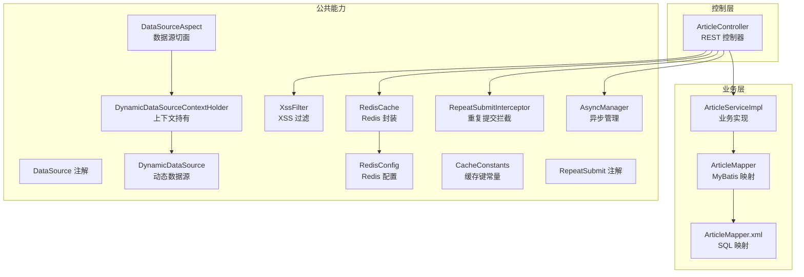
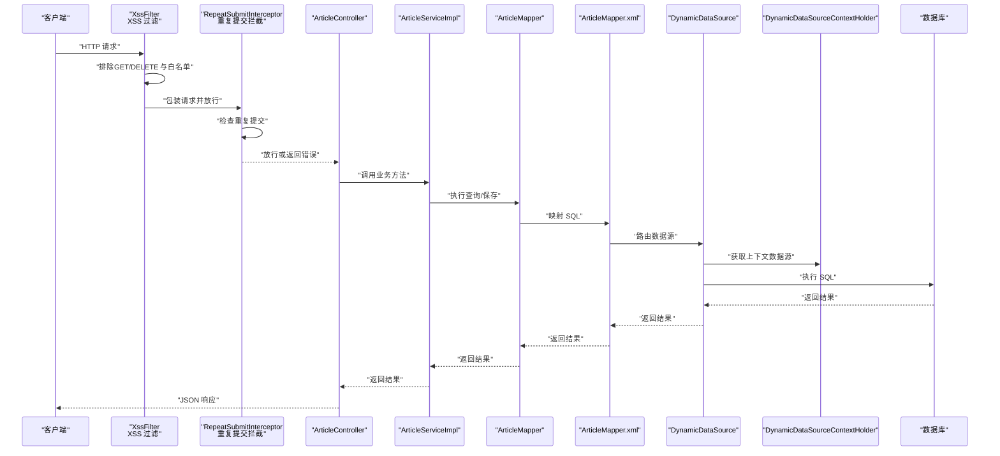
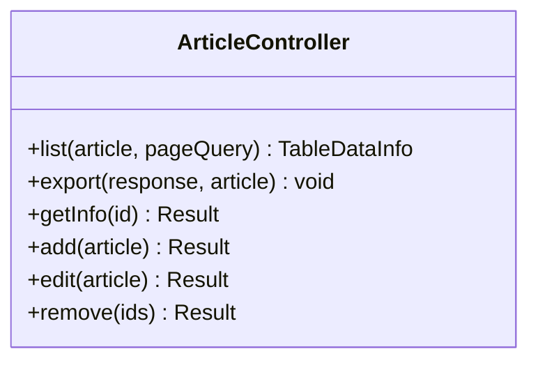
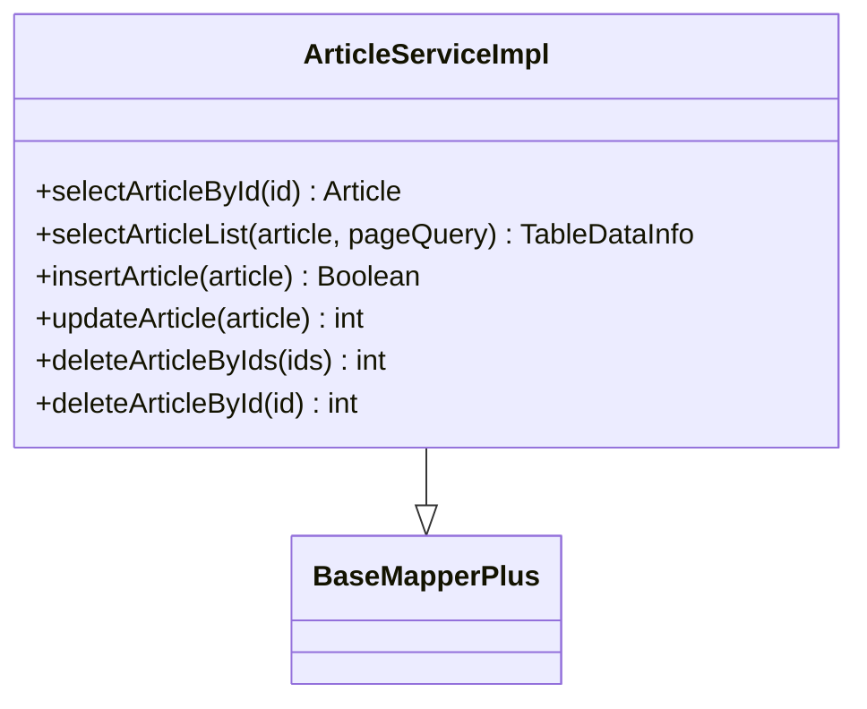
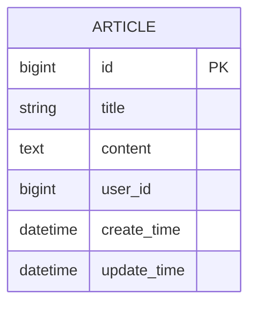
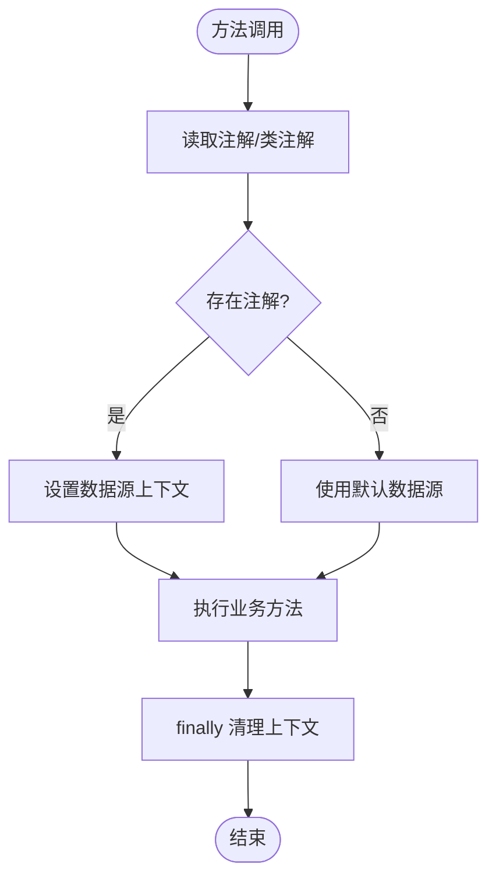
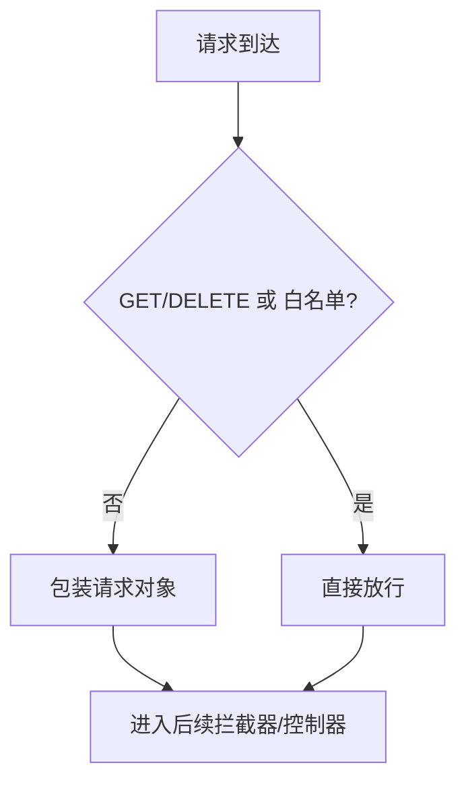
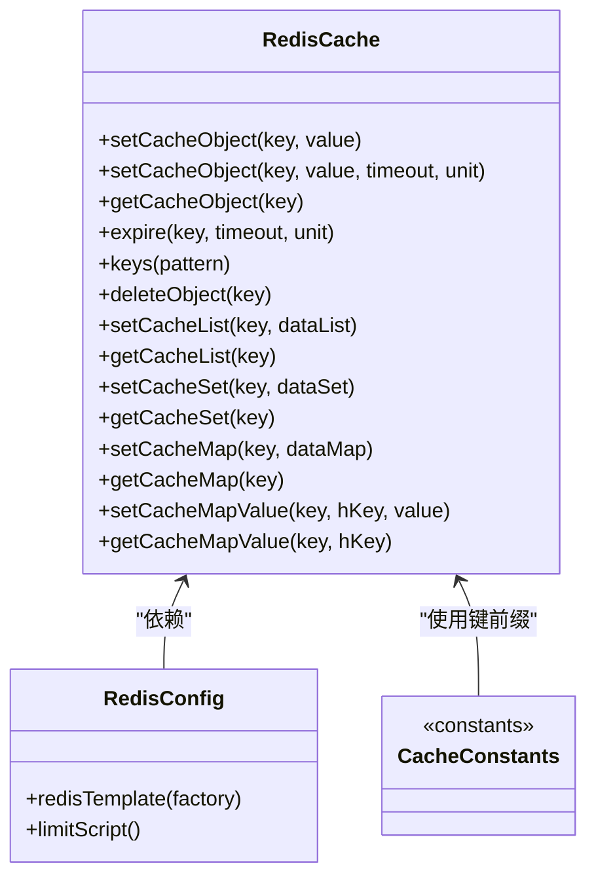
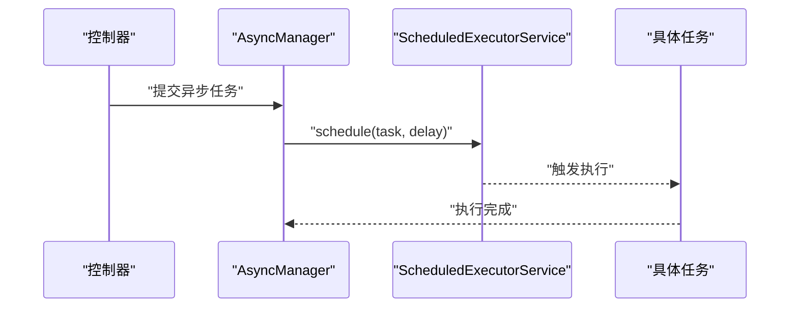
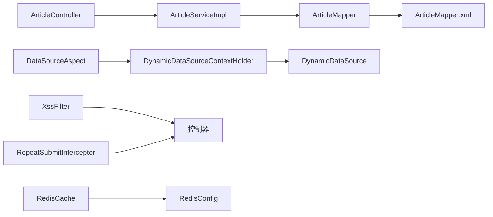

# 数据流设计

<cite>
**本文引用的文件**
- [ArticleController.java](file://blog-admin/src/main/java/blog/web/controller/business/ArticleController.java)
- [ArticleServiceImpl.java](file://blog-biz/src/main/java/blog/biz/service/impl/ArticleServiceImpl.java)
- [ArticleMapper.java](file://blog-biz/src/main/java/blog/biz/mapper/ArticleMapper.java)
- [ArticleMapper.xml](file://blog-biz/src/main/resources/mapper/ArticleMapper.xml)
- [BaseMapperPlus.java](file://blog-common/src/main/java/blog/common/base/mapper/BaseMapperPlus.java)
- [DataSource.java](file://blog-common/src/main/java/blog/common/annotation/DataSource.java)
- [DataSourceAspect.java](file://blog-framework/src/main/java/blog/framework/aspectj/DataSourceAspect.java)
- [DynamicDataSource.java](file://blog-framework/src/main/java/blog/framework/datasource/DynamicDataSource.java)
- [DynamicDataSourceContextHolder.java](file://blog-framework/src/main/java/blog/framework/datasource/DynamicDataSourceContextHolder.java)
- [XssFilter.java](file://blog-common/src/main/java/blog/common/filter/XssFilter.java)
- [XssHttpServletRequestWrapper.java](file://blog-common/src/main/java/blog/common/filter/XssHttpServletRequestWrapper.java)
- [RepeatSubmitInterceptor.java](file://blog-framework/src/main/java/blog/framework/interceptor/RepeatSubmitInterceptor.java)
- [RepeatSubmit.java](file://blog-common/src/main/java/blog/common/annotation/RepeatSubmit.java)
- [RedisCache.java](file://blog-common/src/main/java/blog/common/core/redis/RedisCache.java)
- [RedisConfig.java](file://blog-framework/src/main/java/blog/framework/config/RedisConfig.java)
- [CacheConstants.java](file://blog-common/src/main/java/blog/common/constant/CacheConstants.java)
- [AsyncManager.java](file://blog-framework/src/main/java/blog/framework/manager/AsyncManager.java)
- [AsyncFactory.java](file://blog-framework/src/main/java/blog/framework/manager/factory/AsyncFactory.java)
- [Threads.java](file://blog-common/src/main/java/blog/common/utils/Threads.java)
- [SpringUtils.java](file://blog-common/src/main/java/blog/common/utils/spring/SpringUtils.java)
- [application.yml](file://blog-admin/src/main/resources/application.yml)
- [application-druid.yml](file://blog-admin/src/main/resources/application-druid.yml)
</cite>

## 目录
1. [引言](#引言)
2. [项目结构](#项目结构)
3. [核心组件](#核心组件)
4. [架构总览](#架构总览)
5. [详细组件分析](#详细组件分析)
6. [依赖分析](#依赖分析)
7. [性能考虑](#性能考虑)
8. [故障排查指南](#故障排查指南)
9. [结论](#结论)
10. [附录](#附录)

## 引言
本设计文档围绕 Leejie 博客系统的数据流进行系统性梳理，覆盖从 HTTP 请求到数据库的完整链路，包括请求接收、参数校验、业务处理、数据持久化、异步处理、重复提交拦截、XSS 过滤、动态数据源切换与路由、缓存层读写与失效策略等。文档同时提供数据流图与时序图，帮助读者快速理解典型业务场景下的数据流转过程，并给出性能优化建议与数据一致性保障措施。

## 项目结构
系统采用分层清晰的模块化组织：
- 控制层（blog-admin）：对外暴露 REST API，负责权限控制、日志记录与导出等功能。
- 业务层（blog-biz）：封装领域模型、服务接口与实现、MyBatis 映射。
- 公共工具与基础能力（blog-common）：通用注解、响应封装、过滤器、Redis 封装、工具类等。
- 框架层（blog-framework）：动态数据源、切面、拦截器、异步管理、安全与配置等。

图表来源
- [ArticleController.java:36-101](file://blog-admin/src/main/java/blog/web/controller/business/ArticleController.java#L36-L101)
- [ArticleServiceImpl.java:21-94](file://blog-biz/src/main/java/blog/biz/service/impl/ArticleServiceImpl.java#L21-L94)
- [ArticleMapper.java](file://blog-biz/src/main/java/blog/biz/mapper/ArticleMapper.java)
- [ArticleMapper.xml](file://blog-biz/src/main/resources/mapper/ArticleMapper.xml)
- [DataSource.java:12-28](file://blog-common/src/main/java/blog/common/annotation/DataSource.java#L12-L28)
- [DataSourceAspect.java:19-64](file://blog-framework/src/main/java/blog/framework/aspectj/DataSourceAspect.java#L19-L64)
- [DynamicDataSource.java:8-24](file://blog-framework/src/main/java/blog/framework/datasource/DynamicDataSource.java#L8-L24)
- [DynamicDataSourceContextHolder.java:6-41](file://blog-framework/src/main/java/blog/framework/datasource/DynamicDataSourceContextHolder.java#L6-L41)
- [XssFilter.java:19-66](file://blog-common/src/main/java/blog/common/filter/XssFilter.java#L19-L66)
- [RedisCache.java:17-248](file://blog-common/src/main/java/blog/common/core/redis/RedisCache.java#L17-L248)
- [RedisConfig.java:12-67](file://blog-framework/src/main/java/blog/framework/config/RedisConfig.java#L12-L67)
- [CacheConstants.java:3-43](file://blog-common/src/main/java/blog/common/constant/CacheConstants.java#L3-L43)
- [RepeatSubmitInterceptor.java:15-50](file://blog-framework/src/main/java/blog/framework/interceptor/RepeatSubmitInterceptor.java#L15-L50)
- [RepeatSubmit.java:10-30](file://blog-common/src/main/java/blog/common/annotation/RepeatSubmit.java#L10-L30)
- [AsyncManager.java:10-54](file://blog-framework/src/main/java/blog/framework/manager/AsyncManager.java#L10-L54)

章节来源
- [ArticleController.java:36-101](file://blog-admin/src/main/java/blog/web/controller/business/ArticleController.java#L36-L101)
- [ArticleServiceImpl.java:21-94](file://blog-biz/src/main/java/blog/biz/service/impl/ArticleServiceImpl.java#L21-L94)
- [RedisConfig.java:18-39](file://blog-framework/src/main/java/blog/framework/config/RedisConfig.java#L18-L39)

## 核心组件
- 控制器层：统一输出响应结构，集成权限校验与日志注解，调用业务服务完成 CRUD。
- 业务服务层：封装分页查询、新增修改、批量删除等逻辑，注入 Mapper 完成持久化。
- 数据访问层：基于 MyBatis Plus 的 Mapper 与 XML 映射，支持分页与复杂查询。
- 动态数据源：通过注解 + 切面 + 上下文 + 动态数据源路由，实现方法级/类级数据源切换。
- 中间件：XSS 过滤器、重复提交拦截器、异步任务管理器。
- 缓存层：RedisTemplate 统一封装，提供多种数据结构操作与过期策略。

章节来源
- [ArticleController.java:45-100](file://blog-admin/src/main/java/blog/web/controller/business/ArticleController.java#L45-L100)
- [ArticleServiceImpl.java:44-71](file://blog-biz/src/main/java/blog/biz/service/impl/ArticleServiceImpl.java#L44-L71)
- [BaseMapperPlus.java:32-334](file://blog-common/src/main/java/blog/common/base/mapper/BaseMapperPlus.java#L32-L334)
- [DataSource.java:12-28](file://blog-common/src/main/java/blog/common/annotation/DataSource.java#L12-L28)
- [DataSourceAspect.java:36-49](file://blog-framework/src/main/java/blog/framework/aspectj/DataSourceAspect.java#L36-L49)
- [DynamicDataSourceContextHolder.java:23-40](file://blog-framework/src/main/java/blog/framework/datasource/DynamicDataSourceContextHolder.java#L23-L40)
- [XssFilter.java:40-50](file://blog-common/src/main/java/blog/common/filter/XssFilter.java#L40-L50)
- [RepeatSubmitInterceptor.java:22-38](file://blog-framework/src/main/java/blog/framework/interceptor/RepeatSubmitInterceptor.java#L22-L38)
- [RedisCache.java:34-111](file://blog-common/src/main/java/blog/common/core/redis/RedisCache.java#L34-L111)

## 架构总览
下图展示了从请求进入至数据库与缓存的整体数据流，以及关键中间件的介入点。

图表来源
- [XssFilter.java:40-50](file://blog-common/src/main/java/blog/common/filter/XssFilter.java#L40-L50)
- [RepeatSubmitInterceptor.java:22-38](file://blog-framework/src/main/java/blog/framework/interceptor/RepeatSubmitInterceptor.java#L22-L38)
- [ArticleController.java:77-80](file://blog-admin/src/main/java/blog/web/controller/business/ArticleController.java#L77-L80)
- [ArticleServiceImpl.java:55-59](file://blog-biz/src/main/java/blog/biz/service/impl/ArticleServiceImpl.java#L55-L59)
- [ArticleMapper.java](file://blog-biz/src/main/java/blog/biz/mapper/ArticleMapper.java)
- [ArticleMapper.xml](file://blog-biz/src/main/resources/mapper/ArticleMapper.xml)
- [DynamicDataSource.java:20-23](file://blog-framework/src/main/java/blog/framework/datasource/DynamicDataSource.java#L20-L23)
- [DynamicDataSourceContextHolder.java:31-33](file://blog-framework/src/main/java/blog/framework/datasource/DynamicDataSourceContextHolder.java#L31-L33)

## 详细组件分析

### 控制器层：请求入口与响应封装
- 权限控制：使用注解进行权限校验，确保仅授权用户可访问。
- 日志与导出：通过注解记录业务日志，支持导出 Excel。
- 统一响应：返回统一的响应结构，便于前端处理。

图表来源
- [ArticleController.java:45-100](file://blog-admin/src/main/java/blog/web/controller/business/ArticleController.java#L45-L100)

章节来源
- [ArticleController.java:45-100](file://blog-admin/src/main/java/blog/web/controller/business/ArticleController.java#L45-L100)

### 业务服务层：分页与持久化
- 分页查询：基于 PageQuery 构建分页对象，调用 Mapper 完成分页。
- 新增/修改：自动填充用户信息与更新时间，保证数据完整性。
- 批量删除：支持按主键数组批量删除。

图表来源
- [ArticleServiceImpl.java:21-94](file://blog-biz/src/main/java/blog/biz/service/impl/ArticleServiceImpl.java#L21-L94)
- [BaseMapperPlus.java:32-334](file://blog-common/src/main/java/blog/common/base/mapper/BaseMapperPlus.java#L32-L334)

章节来源
- [ArticleServiceImpl.java:44-71](file://blog-biz/src/main/java/blog/biz/service/impl/ArticleServiceImpl.java#L44-L71)

### 数据访问层：MyBatis Plus 与 XML 映射
- Mapper 接口：定义查询与更新方法。
- XML 映射：编写 SQL 语句，配合动态数据源路由执行。
- 分页支持：结合 PageQuery 与 MyBatis Plus 分页插件。

图表来源
- [ArticleMapper.xml](file://blog-biz/src/main/resources/mapper/ArticleMapper.xml)

章节来源
- [ArticleMapper.java](file://blog-biz/src/main/java/blog/biz/mapper/ArticleMapper.java)
- [ArticleMapper.xml](file://blog-biz/src/main/resources/mapper/ArticleMapper.xml)

### 动态数据源切换机制
- 注解驱动：在方法或类上标注数据源类型，默认 MASTER。
- 切面拦截：环绕通知在执行前后设置/清理数据源上下文。
- 路由选择：动态数据源根据上下文键选择目标数据源。

图表来源
- [DataSource.java:12-28](file://blog-common/src/main/java/blog/common/annotation/DataSource.java#L12-L28)
- [DataSourceAspect.java:36-49](file://blog-framework/src/main/java/blog/framework/aspectj/DataSourceAspect.java#L36-L49)
- [DynamicDataSourceContextHolder.java:23-40](file://blog-framework/src/main/java/blog/framework/datasource/DynamicDataSourceContextHolder.java#L23-L40)
- [DynamicDataSource.java:20-23](file://blog-framework/src/main/java/blog/framework/datasource/DynamicDataSource.java#L20-L23)

章节来源
- [DataSource.java:12-28](file://blog-common/src/main/java/blog/common/annotation/DataSource.java#L12-L28)
- [DataSourceAspect.java:36-49](file://blog-framework/src/main/java/blog/framework/aspectj/DataSourceAspect.java#L36-L49)
- [DynamicDataSourceContextHolder.java:23-40](file://blog-framework/src/main/java/blog/framework/datasource/DynamicDataSourceContextHolder.java#L23-L40)
- [DynamicDataSource.java:20-23](file://blog-framework/src/main/java/blog/framework/datasource/DynamicDataSource.java#L20-L23)

### XSS 过滤与重复提交拦截
- XSS 过滤：对非 GET/DELETE 请求与非白名单路径进行包装过滤，阻断潜在脚本注入。
- 重复提交：基于注解与拦截器判断是否在设定间隔内重复提交，避免幂等问题。

图表来源
- [XssFilter.java:40-60](file://blog-common/src/main/java/blog/common/filter/XssFilter.java#L40-L60)
- [RepeatSubmitInterceptor.java:22-38](file://blog-framework/src/main/java/blog/framework/interceptor/RepeatSubmitInterceptor.java#L22-L38)
- [RepeatSubmit.java:20-28](file://blog-common/src/main/java/blog/common/annotation/RepeatSubmit.java#L20-L28)

章节来源
- [XssFilter.java:40-60](file://blog-common/src/main/java/blog/common/filter/XssFilter.java#L40-L60)
- [RepeatSubmitInterceptor.java:22-38](file://blog-framework/src/main/java/blog/framework/interceptor/RepeatSubmitInterceptor.java#L22-L38)
- [RepeatSubmit.java:20-28](file://blog-common/src/main/java/blog/common/annotation/RepeatSubmit.java#L20-L28)

### 缓存层：读写与失效策略
- Redis 封装：提供对象、List、Set、Hash 等多种数据结构的读写与过期设置。
- 序列化：Key 使用字符串序列化，Value 使用 JSON 序列化，提升跨语言兼容性。
- 命中策略：优先从缓存读取，未命中则回源数据库，再写入缓存。
- 失效机制：设置 TTL、主动删除、批量清理。

图表来源
- [RedisCache.java:28-247](file://blog-common/src/main/java/blog/common/core/redis/RedisCache.java#L28-L247)
- [RedisConfig.java:21-47](file://blog-framework/src/main/java/blog/framework/config/RedisConfig.java#L21-L47)
- [CacheConstants.java:8-43](file://blog-common/src/main/java/blog/common/constant/CacheConstants.java#L8-L43)

章节来源
- [RedisCache.java:34-111](file://blog-common/src/main/java/blog/common/core/redis/RedisCache.java#L34-L111)
- [RedisConfig.java:21-39](file://blog-framework/src/main/java/blog/framework/config/RedisConfig.java#L21-L39)
- [CacheConstants.java:30-32](file://blog-common/src/main/java/blog/common/constant/CacheConstants.java#L30-L32)

### 异步处理机制
- 异步调度：通过定时任务调度器延时执行，降低主请求路径开销。
- 线程池管理：统一的异步管理器与线程池生命周期管理，支持优雅关闭。

图表来源
- [AsyncManager.java:43-45](file://blog-framework/src/main/java/blog/framework/manager/AsyncManager.java#L43-L45)
- [AsyncFactory.java](file://blog-framework/src/main/java/blog/framework/manager/factory/AsyncFactory.java)

章节来源
- [AsyncManager.java:43-45](file://blog-framework/src/main/java/blog/framework/manager/AsyncManager.java#L43-L45)

## 依赖分析
- 控制器依赖业务服务，业务服务依赖 Mapper 与分页工具。
- 动态数据源通过切面与上下文协作，最终路由到具体数据源。
- XSS 过滤与重复提交拦截作为前置中间件，分别在请求进入早期进行处理。
- 缓存层依赖 Redis 配置与序列化策略，提供统一读写接口。

图表来源
- [ArticleController.java:39-40](file://blog-admin/src/main/java/blog/web/controller/business/ArticleController.java#L39-L40)
- [ArticleServiceImpl.java:22-24](file://blog-biz/src/main/java/blog/biz/service/impl/ArticleServiceImpl.java#L22-L24)
- [DataSourceAspect.java:36-49](file://blog-framework/src/main/java/blog/framework/aspectj/DataSourceAspect.java#L36-L49)
- [DynamicDataSourceContextHolder.java:31-33](file://blog-framework/src/main/java/blog/framework/datasource/DynamicDataSourceContextHolder.java#L31-L33)
- [DynamicDataSource.java:20-23](file://blog-framework/src/main/java/blog/framework/datasource/DynamicDataSource.java#L20-L23)
- [XssFilter.java:40-49](file://blog-common/src/main/java/blog/common/filter/XssFilter.java#L40-L49)
- [RepeatSubmitInterceptor.java:22-38](file://blog-framework/src/main/java/blog/framework/interceptor/RepeatSubmitInterceptor.java#L22-L38)
- [RedisCache.java:25-26](file://blog-common/src/main/java/blog/common/core/redis/RedisCache.java#L25-L26)
- [RedisConfig.java:23-39](file://blog-framework/src/main/java/blog/framework/config/RedisConfig.java#L23-L39)

章节来源
- [ArticleController.java:39-40](file://blog-admin/src/main/java/blog/web/controller/business/ArticleController.java#L39-L40)
- [ArticleServiceImpl.java:22-24](file://blog-biz/src/main/java/blog/biz/service/impl/ArticleServiceImpl.java#L22-L24)
- [DataSourceAspect.java:36-49](file://blog-framework/src/main/java/blog/framework/aspectj/DataSourceAspect.java#L36-L49)
- [DynamicDataSource.java:20-23](file://blog-framework/src/main/java/blog/framework/datasource/DynamicDataSource.java#L20-L23)
- [XssFilter.java:40-49](file://blog-common/src/main/java/blog/common/filter/XssFilter.java#L40-L49)
- [RepeatSubmitInterceptor.java:22-38](file://blog-framework/src/main/java/blog/framework/interceptor/RepeatSubmitInterceptor.java#L22-L38)
- [RedisCache.java:25-26](file://blog-common/src/main/java/blog/common/core/redis/RedisCache.java#L25-L26)
- [RedisConfig.java:23-39](file://blog-framework/src/main/java/blog/framework/config/RedisConfig.java#L23-L39)

## 性能考虑
- 分页查询：合理设置分页大小，避免一次性加载过多数据；结合索引与必要字段查询，减少 IO。
- 缓存命中：热点数据设置合理 TTL，使用批量读取与批量写入降低网络往返；对频繁变更的数据采用写后失效或写后更新策略。
- 异步化：将耗时操作（如日志、统计、通知）放入异步队列，缩短主请求路径。
- 数据源路由：避免频繁切换数据源，尽量在事务边界内集中切换，减少上下文切换成本。
- XSS 与拦截：白名单路径与短间隔策略需平衡安全与性能，避免过度过滤导致延迟。
- Redis 序列化：JSON 序列化便于跨语言，但注意字段变更的兼容性；Key 使用短前缀，减少内存占用。

## 故障排查指南
- 请求被拦截
  - 检查 XSS 白名单配置与请求方法是否匹配。
  - 检查重复提交拦截的间隔与提示信息。
- 数据源切换无效
  - 确认注解是否正确标注于方法或类。
  - 检查切面是否生效，上下文是否在 finally 中清理。
- 缓存异常
  - 检查 Redis 连接与序列化配置。
  - 核对缓存键前缀与 TTL 设置。
- 异步任务未执行
  - 检查线程池状态与优雅关闭流程。
  - 确认任务提交与调度延迟配置。

章节来源
- [XssFilter.java:52-60](file://blog-common/src/main/java/blog/common/filter/XssFilter.java#L52-L60)
- [RepeatSubmitInterceptor.java:22-38](file://blog-framework/src/main/java/blog/framework/interceptor/RepeatSubmitInterceptor.java#L22-L38)
- [DataSourceAspect.java:36-49](file://blog-framework/src/main/java/blog/framework/aspectj/DataSourceAspect.java#L36-L49)
- [DynamicDataSourceContextHolder.java:38-40](file://blog-framework/src/main/java/blog/framework/datasource/DynamicDataSourceContextHolder.java#L38-L40)
- [RedisConfig.java:21-39](file://blog-framework/src/main/java/blog/framework/config/RedisConfig.java#L21-L39)
- [AsyncManager.java:50-52](file://blog-framework/src/main/java/blog/framework/manager/AsyncManager.java#L50-L52)

## 结论
本设计文档从数据流视角梳理了 Leejie 博客系统的关键环节，明确了请求在进入业务层之前的 XSS 与重复提交拦截、业务层的分页与持久化、动态数据源的切换与路由、以及缓存层的读写与失效策略。通过异步化与合理的缓存策略，系统可在保证安全性与一致性的前提下，获得更优的吞吐与延迟表现。

## 附录
- 配置参考
  - 应用配置与数据源配置位于资源目录，可据此调整连接池、缓存与安全策略。
- 关键路径
  - 控制器：[ArticleController.java:36-101](file://blog-admin/src/main/java/blog/web/controller/business/ArticleController.java#L36-L101)
  - 业务服务：[ArticleServiceImpl.java:21-94](file://blog-biz/src/main/java/blog/biz/service/impl/ArticleServiceImpl.java#L21-L94)
  - 数据源：[DataSourceAspect.java:36-49](file://blog-framework/src/main/java/blog/framework/aspectj/DataSourceAspect.java#L36-L49)、[DynamicDataSource.java:13-24](file://blog-framework/src/main/java/blog/framework/datasource/DynamicDataSource.java#L13-L24)
  - 缓存：[RedisCache.java:28-111](file://blog-common/src/main/java/blog/common/core/redis/RedisCache.java#L28-L111)、[RedisConfig.java:21-47](file://blog-framework/src/main/java/blog/framework/config/RedisConfig.java#L21-L47)
  - 安全与拦截：[XssFilter.java:40-60](file://blog-common/src/main/java/blog/common/filter/XssFilter.java#L40-L60)、[RepeatSubmitInterceptor.java:22-38](file://blog-framework/src/main/java/blog/framework/interceptor/RepeatSubmitInterceptor.java#L22-L38)