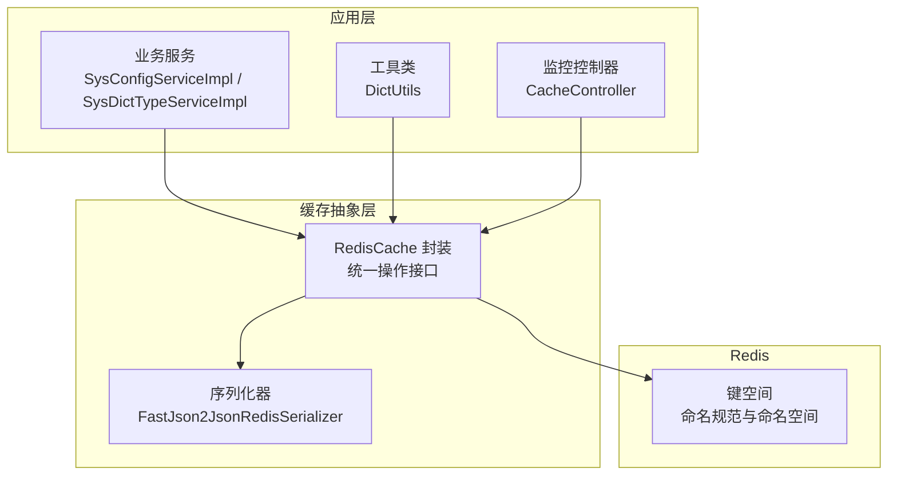
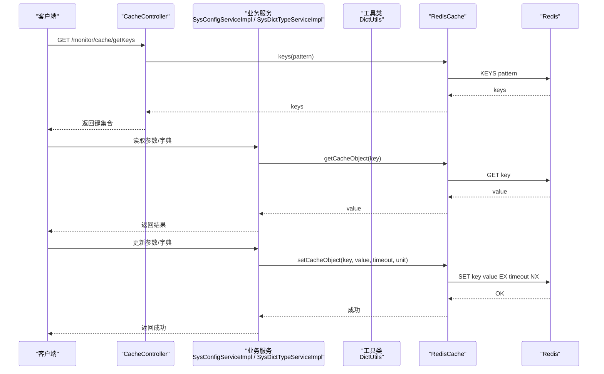
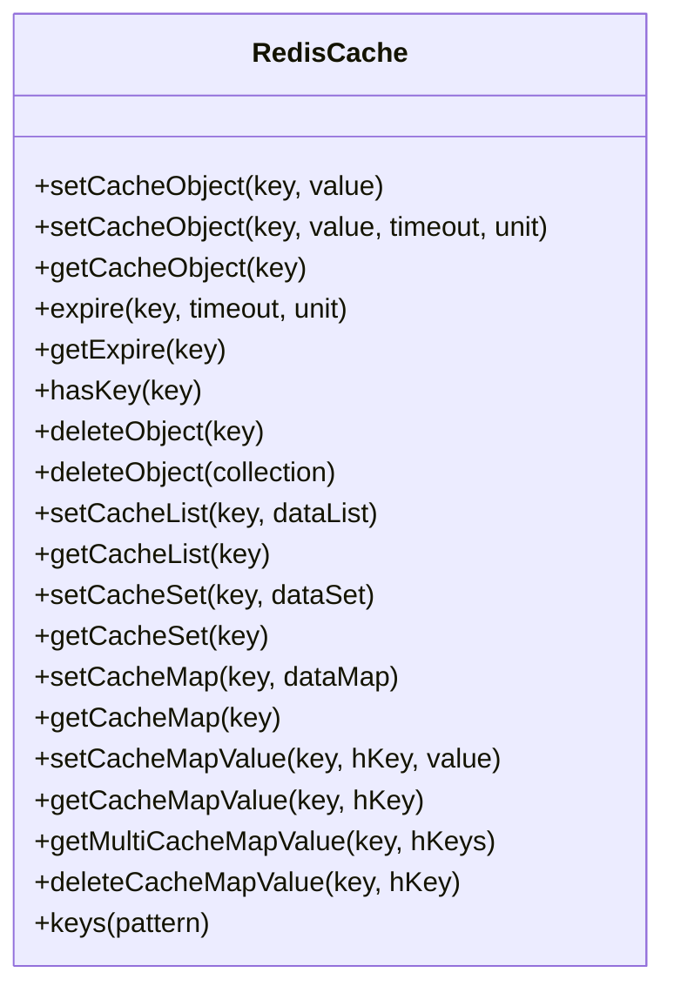
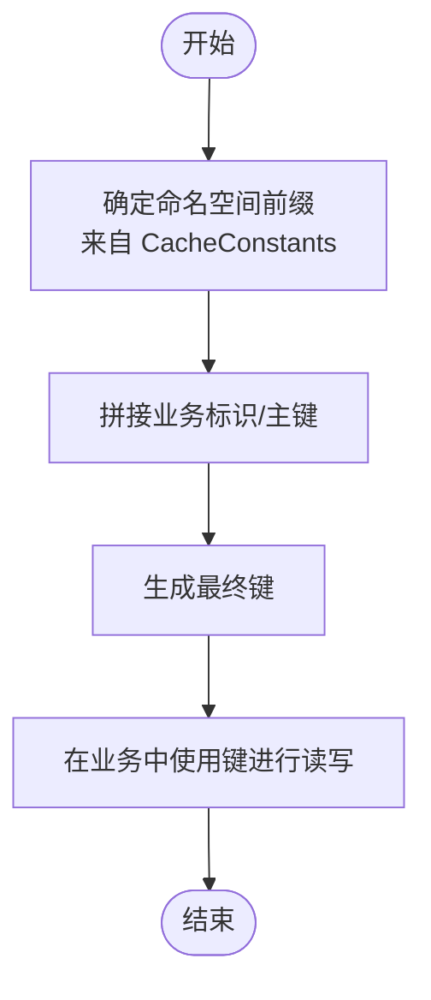
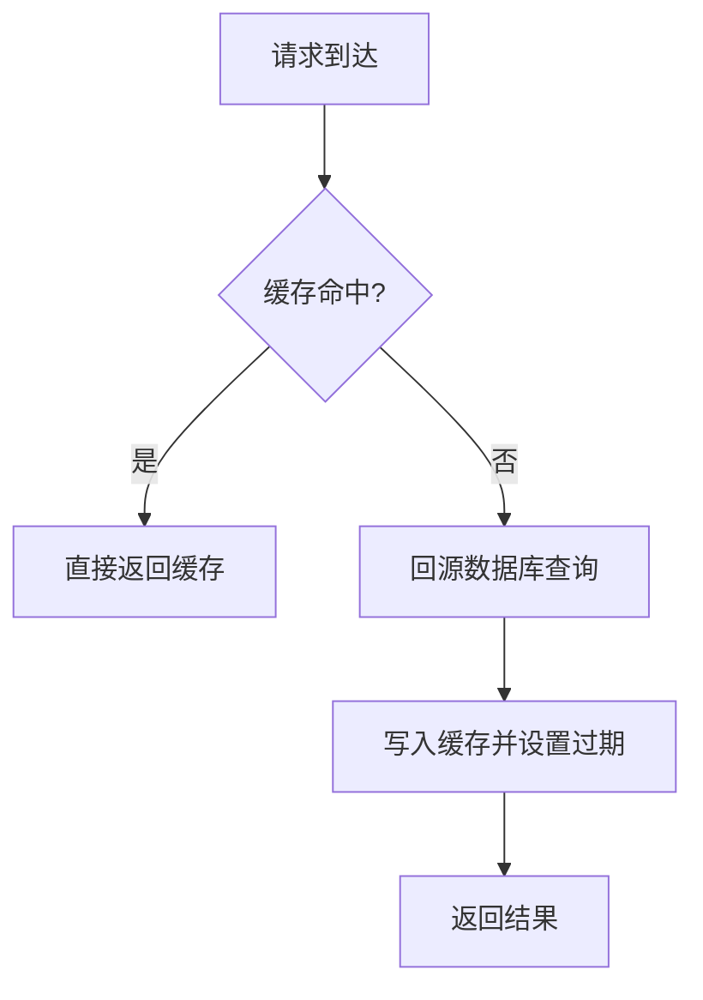
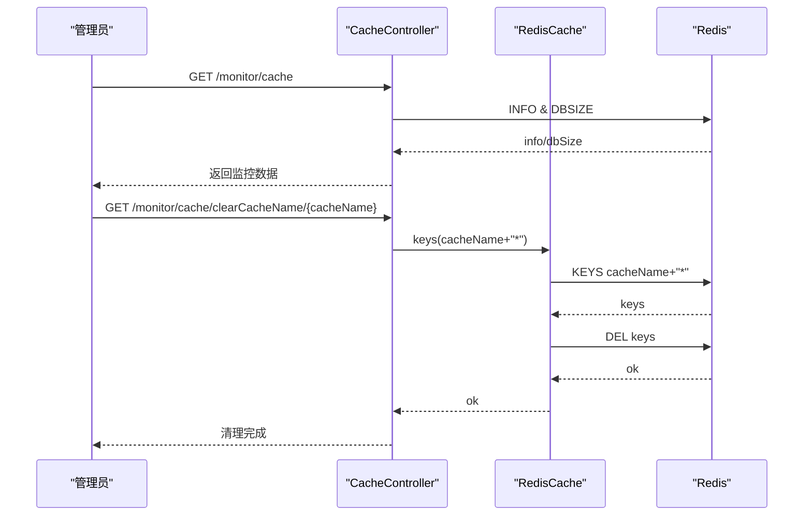
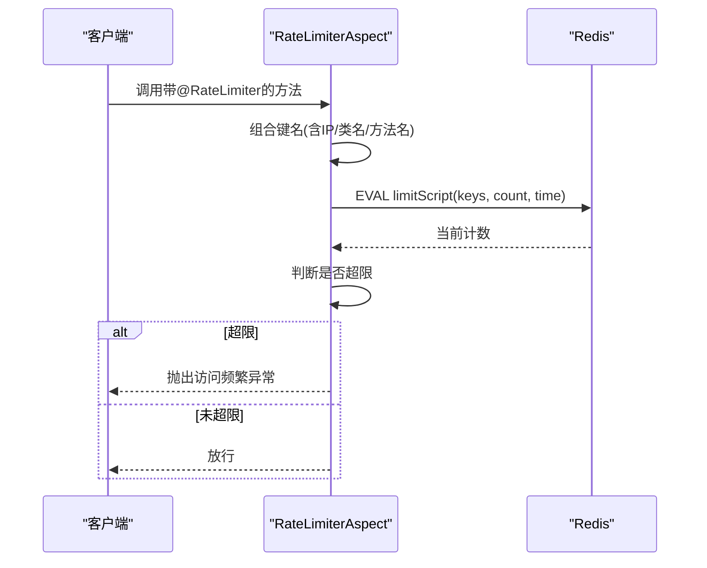
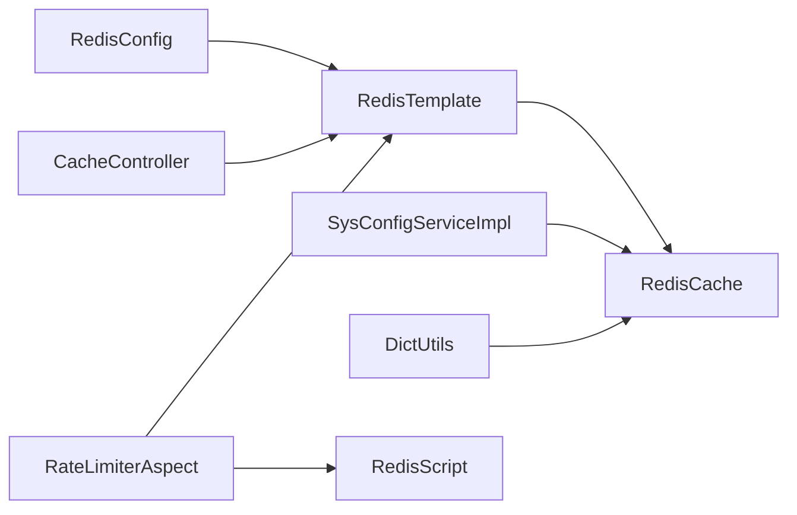

# 缓存数据流

<cite>
**本文引用的文件**
- [RedisCache.java](file://blog-common/src/main/java/blog/common/core/redis/RedisCache.java)
- [CacheConstants.java](file://blog-common/src/main/java/blog/common/constant/CacheConstants.java)
- [RedisConfig.java](file://blog-framework/src/main/java/blog/framework/config/RedisConfig.java)
- [FastJson2JsonRedisSerializer.java](file://blog-framework/src/main/java/blog/framework/config/FastJson2JsonRedisSerializer.java)
- [SysConfigServiceImpl.java](file://blog-system/src/main/java/blog/system/service/impl/SysConfigServiceImpl.java)
- [DictUtils.java](file://blog-common/src/main/java/blog/common/utils/DictUtils.java)
- [SysDictTypeServiceImpl.java](file://blog-system/src/main/java/blog/system/service/impl/SysDictTypeServiceImpl.java)
- [CacheController.java](file://blog-admin/src/main/java/blog/web/controller/monitor/CacheController.java)
- [SysCache.java](file://blog-system/src/main/java/blog/system/domain/SysCache.java)
- [RateLimiterAspect.java](file://blog-framework/src/main/java/blog/framework/aspectj/RateLimiterAspect.java)
- [application.yml](file://blog-admin/src/main/resources/application.yml)
- [Constants.java](file://blog-common/src/main/java/blog/common/constant/Constants.java)
</cite>

## 目录
1. [简介](#简介)
2. [项目结构与定位](#项目结构与定位)
3. [核心组件](#核心组件)
4. [架构总览](#架构总览)
5. [详细组件分析](#详细组件分析)
6. [依赖关系分析](#依赖关系分析)
7. [性能与容量规划](#性能与容量规划)
8. [故障排查指南](#故障排查指南)
9. [结论](#结论)

## 简介
本文件围绕 Leejie 博客系统的 Redis 缓存数据流进行深入解析，覆盖缓存读写流程、命中策略、失效与更新策略、键命名规范与命名空间管理，并对缓存穿透、击穿、雪崩等常见问题给出预防与治理方案。同时提供架构图与数据流图，帮助读者从应用层到 Redis 的完整流转过程形成清晰认知，并给出性能优化、容量规划与监控指标建议。

## 项目结构与定位
- 缓存基础设施位于公共模块，提供 Redis 操作封装与序列化配置。
- 业务模块通过工具类或服务层直接使用缓存能力，典型场景包括：系统参数缓存、数据字典缓存、登录令牌缓存、验证码缓存、重复提交与限流键等。
- 管理端提供缓存监控接口，支持查看 Redis 信息、统计命令分布、按命名空间清理缓存等。

图表来源
- [RedisCache.java:24-247](file://blog-common/src/main/java/blog/common/core/redis/RedisCache.java#L24-L247)
- [RedisConfig.java:21-39](file://blog-framework/src/main/java/blog/framework/config/RedisConfig.java#L21-L39)
- [SysConfigServiceImpl.java:38-183](file://blog-system/src/main/java/blog/system/service/impl/SysConfigServiceImpl.java#L38-L183)
- [DictUtils.java:29-45](file://blog-common/src/main/java/blog/common/utils/DictUtils.java#L29-L45)
- [CacheController.java:52-115](file://blog-admin/src/main/java/blog/web/controller/monitor/CacheController.java#L52-L115)

章节来源
- [RedisCache.java:24-247](file://blog-common/src/main/java/blog/common/core/redis/RedisCache.java#L24-L247)
- [RedisConfig.java:21-39](file://blog-framework/src/main/java/blog/framework/config/RedisConfig.java#L21-L39)
- [application.yml:64-88](file://blog-admin/src/main/resources/application.yml#L64-L88)

## 核心组件
- RedisCache：对 Spring Data Redis 的统一封装，提供对象、List、Set、Hash 等多种数据类型的缓存读写与过期控制。
- RedisConfig：配置 RedisTemplate，使用 String 序列化 Key/HashKey，使用 FastJson2 序列化 Value/HashValue，启用 Spring Cache。
- CacheConstants：集中定义各类缓存键的命名前缀（命名空间），如登录令牌、验证码、系统参数、字典、防重提交、限流、密码错误计数等。
- SysConfigServiceImpl：系统参数服务，在启动时加载参数到缓存，并提供清空与重置缓存的方法。
- DictUtils：字典工具类，负责字典缓存的设置、获取、删除与清空，内部通过 RedisCache 与 CacheConstants 组合键名。
- CacheController：缓存监控接口，提供 Redis 信息、键空间查询、值读取、按命名空间/键清理等功能。
- RateLimiterAspect：基于 Lua 脚本的限流切面，结合 RedisTemplate 执行限流逻辑，键名由注解与上下文组合生成。

章节来源
- [RedisCache.java:24-247](file://blog-common/src/main/java/blog/common/core/redis/RedisCache.java#L24-L247)
- [RedisConfig.java:21-66](file://blog-framework/src/main/java/blog/framework/config/RedisConfig.java#L21-L66)
- [CacheConstants.java:8-43](file://blog-common/src/main/java/blog/common/constant/CacheConstants.java#L8-L43)
- [SysConfigServiceImpl.java:38-209](file://blog-system/src/main/java/blog/system/service/impl/SysConfigServiceImpl.java#L38-L209)
- [DictUtils.java:29-202](file://blog-common/src/main/java/blog/common/utils/DictUtils.java#L29-L202)
- [CacheController.java:34-115](file://blog-admin/src/main/java/blog/web/controller/monitor/CacheController.java#L34-L115)
- [RateLimiterAspect.java:30-77](file://blog-framework/src/main/java/blog/framework/aspectj/RateLimiterAspect.java#L30-L77)

## 架构总览
下图展示从应用层到 Redis 的完整数据流，包括读取、写入、过期与清理等关键环节。

图表来源
- [CacheController.java:80-92](file://blog-admin/src/main/java/blog/web/controller/monitor/CacheController.java#L80-L92)
- [SysConfigServiceImpl.java:163-164](file://blog-system/src/main/java/blog/system/service/impl/SysConfigServiceImpl.java#L163-L164)
- [DictUtils.java:40-45](file://blog-common/src/main/java/blog/common/utils/DictUtils.java#L40-L45)
- [RedisCache.java:34-48](file://blog-common/src/main/java/blog/common/core/redis/RedisCache.java#L34-L48)

## 详细组件分析

### RedisCache 核心实现原理
- 统一入口：通过 RedisTemplate 提供的多种操作视图（Value、List、Set、Hash、BoundSet）实现多样化的缓存能力。
- 过期控制：提供 expire/getExpire/setExpire 等方法，支持以秒或指定时间单位设置键的有效期。
- 命中策略：优先从缓存读取，未命中则回源数据库，再写入缓存并设置合理过期时间，提升后续命中率。
- 更新策略：写入新值时可选择覆盖旧值并刷新过期时间；对于字典与参数这类“只增不改”的数据，采用“先删后写”或“全量替换”策略，确保一致性。
- 清理策略：支持按键、按模式批量删除，便于运维与灰度发布时的缓存清理。

图表来源
- [RedisCache.java:24-247](file://blog-common/src/main/java/blog/common/core/redis/RedisCache.java#L24-L247)

章节来源
- [RedisCache.java:34-246](file://blog-common/src/main/java/blog/common/core/redis/RedisCache.java#L34-L246)

### 键命名规范与命名空间管理
- 命名空间：通过 CacheConstants 统一定义各业务域的键前缀，形成清晰的命名空间，避免键冲突。
- 组合规则：业务侧通常以“命名空间前缀 + 业务标识”组合成最终键，例如“sys_config: + 参数键”、“sys_dict: + 字典类型”等。
- 命名空间示例：
  - 登录令牌：login_tokens:
  - 验证码：captcha_codes:
  - 系统参数：sys_config:
  - 数据字典：sys_dict:
  - 防重提交：repeat_submit:
  - 限流：rate_limit:
  - 密码错误次数：pwd_err_cnt:

图表来源
- [CacheConstants.java:8-43](file://blog-common/src/main/java/blog/common/constant/CacheConstants.java#L8-L43)
- [SysConfigServiceImpl.java:207-209](file://blog-system/src/main/java/blog/system/service/impl/SysConfigServiceImpl.java#L207-L209)
- [DictUtils.java:200-202](file://blog-common/src/main/java/blog/common/utils/DictUtils.java#L200-L202)

章节来源
- [CacheConstants.java:8-43](file://blog-common/src/main/java/blog/common/constant/CacheConstants.java#L8-L43)
- [SysConfigServiceImpl.java:207-209](file://blog-system/src/main/java/blog/system/service/impl/SysConfigServiceImpl.java#L207-L209)
- [DictUtils.java:200-202](file://blog-common/src/main/java/blog/common/utils/DictUtils.java#L200-L202)

### 缓存读写流程与策略
- 读流程：业务层先查缓存，命中则返回；未命中则回源数据库，再将结果写入缓存并设置过期时间。
- 写流程：更新数据库后，删除或重建对应缓存键，保证后续读取能命中最新数据。
- 过期策略：针对热点数据设置较短 TTL，非热点数据设置较长 TTL；对字典与参数这类静态数据可设置较长 TTL 或使用“懒加载+后台刷新”。

图表来源
- [SysConfigServiceImpl.java:163-164](file://blog-system/src/main/java/blog/system/service/impl/SysConfigServiceImpl.java#L163-L164)
- [DictUtils.java:39-45](file://blog-common/src/main/java/blog/common/utils/DictUtils.java#L39-L45)

章节来源
- [SysConfigServiceImpl.java:163-164](file://blog-system/src/main/java/blog/system/service/impl/SysConfigServiceImpl.java#L163-L164)
- [DictUtils.java:39-45](file://blog-common/src/main/java/blog/common/utils/DictUtils.java#L39-L45)

### 常见问题与治理方案

#### 缓存穿透（查询不存在的数据）
- 现象：大量请求查询不存在的键，导致每次都回源数据库。
- 方案：
  - 空值缓存：命中为空时也写入一个短 TTL 的空值，防止持续穿透。
  - 布隆过滤器：在进入缓存层前进行存在性校验（需额外组件）。
  - 参数校验：对输入参数进行严格校验，避免非法键进入缓存层。

章节来源
- [RedisCache.java:99-101](file://blog-common/src/main/java/blog/common/core/redis/RedisCache.java#L99-L101)

#### 缓存击穿（热点键过期）
- 现象：热点键在过期瞬间被高并发请求同时回源，造成数据库压力骤增。
- 方案：
  - 互斥锁：在过期瞬间加分布式互斥锁，仅允许一个线程回源并写入新值。
  - 预热：在过期前主动刷新热点键，维持稳定命中。
  - 不同 TTL：为不同热点设置随机抖动的 TTL，打散过期高峰。

章节来源
- [RedisCache.java:57-71](file://blog-common/src/main/java/blog/common/core/redis/RedisCache.java#L57-L71)

#### 缓存雪崩（大面积过期）
- 现象：大量键在同一时间过期，导致瞬时大量请求回源，数据库崩溃。
- 方案：
  - TTL 随机化：给缓存键增加随机偏移，避免集中过期。
  - 多级缓存：本地缓存 + Redis 缓存，降低单一节点压力。
  - 降级限流：在高峰期启用限流与降级策略，保护后端数据库。

章节来源
- [RedisConfig.java:21-39](file://blog-framework/src/main/java/blog/framework/config/RedisConfig.java#L21-L39)
- [RateLimiterAspect.java:47-65](file://blog-framework/src/main/java/blog/framework/aspectj/RateLimiterAspect.java#L47-L65)

### 缓存监控与运维
- 监控接口：CacheController 提供 Redis 信息、命令统计、键空间查询、按命名空间清理等功能。
- 命名空间清理：通过命名空间前缀批量删除键，便于灰度发布与紧急排障。
- 值读取：支持按键读取缓存值，辅助诊断与调试。

图表来源
- [CacheController.java:52-115](file://blog-admin/src/main/java/blog/web/controller/monitor/CacheController.java#L52-L115)

章节来源
- [CacheController.java:34-115](file://blog-admin/src/main/java/blog/web/controller/monitor/CacheController.java#L34-L115)
- [SysCache.java:10-77](file://blog-system/src/main/java/blog/system/domain/SysCache.java#L10-L77)

### 限流与缓存配合
- 限流键：使用 CacheConstants.RATE_LIMIT_KEY 作为限流键前缀，结合 IP、类名、方法名等维度生成唯一键。
- Lua 脚本：通过 RedisScript 执行原子计数与过期设置，避免竞态条件。
- 异常处理：超过阈值抛出业务异常，提示“访问过于频繁”。

图表来源
- [RateLimiterAspect.java:47-65](file://blog-framework/src/main/java/blog/framework/aspectj/RateLimiterAspect.java#L47-L65)
- [RedisConfig.java:42-65](file://blog-framework/src/main/java/blog/framework/config/RedisConfig.java#L42-L65)

章节来源
- [RateLimiterAspect.java:30-77](file://blog-framework/src/main/java/blog/framework/aspectj/RateLimiterAspect.java#L30-L77)
- [RedisConfig.java:42-65](file://blog-framework/src/main/java/blog/framework/config/RedisConfig.java#L42-L65)

## 依赖关系分析
- RedisCache 依赖 RedisTemplate，RedisConfig 负责配置序列化策略与脚本注册。
- 业务服务通过工具类或直接注入 RedisCache 使用缓存能力。
- CacheController 依赖 RedisTemplate 与 CacheConstants 进行监控与运维。
- 限流切面依赖 RedisTemplate 与 RedisScript 执行限流逻辑。

图表来源
- [RedisConfig.java:21-66](file://blog-framework/src/main/java/blog/framework/config/RedisConfig.java#L21-L66)
- [RedisCache.java:24-26](file://blog-common/src/main/java/blog/common/core/redis/RedisCache.java#L24-L26)
- [SysConfigServiceImpl.java:33-33](file://blog-system/src/main/java/blog/system/service/impl/SysConfigServiceImpl.java#L33-L33)
- [DictUtils.java:9-9](file://blog-common/src/main/java/blog/common/utils/DictUtils.java#L9-L9)
- [CacheController.java:35-35](file://blog-admin/src/main/java/blog/web/controller/monitor/CacheController.java#L35-L35)
- [RateLimiterAspect.java:33-44](file://blog-framework/src/main/java/blog/framework/aspectj/RateLimiterAspect.java#L33-L44)

章节来源
- [RedisConfig.java:21-66](file://blog-framework/src/main/java/blog/framework/config/RedisConfig.java#L21-L66)
- [RedisCache.java:24-26](file://blog-common/src/main/java/blog/common/core/redis/RedisCache.java#L24-L26)
- [SysConfigServiceImpl.java:33-33](file://blog-system/src/main/java/blog/system/service/impl/SysConfigServiceImpl.java#L33-L33)
- [DictUtils.java:9-9](file://blog-common/src/main/java/blog/common/utils/DictUtils.java#L9-L9)
- [CacheController.java:35-35](file://blog-admin/src/main/java/blog/web/controller/monitor/CacheController.java#L35-L35)
- [RateLimiterAspect.java:33-44](file://blog-framework/src/main/java/blog/framework/aspectj/RateLimiterAspect.java#L33-L44)

## 性能与容量规划
- 序列化优化：使用 FastJson2 序列化 Value/HashValue，减少序列化开销；Key/HashKey 使用 String 序列化，提高匹配效率。
- 连接池配置：根据并发量调整最大连接数、最大空闲连接与最大等待时间，避免阻塞。
- TTL 设计：热点数据短 TTL + 预热，非热点长 TTL；对字典与参数类数据可设置较长 TTL 并定期刷新。
- 命名空间隔离：通过命名空间前缀隔离不同业务域，便于按域清理与容量评估。
- 监控指标建议：
  - 命令统计：GET/SET/HGET/HSET/DEL 等命令调用量与耗时。
  - 键空间大小：DBSIZE 与各命名空间键数量。
  - 内存使用：used_memory、maxmemory 等。
  - 命中率：GET 命中与未命中的对比。
  - 限流命中：限流脚本执行次数与超限次数。

章节来源
- [RedisConfig.java:21-39](file://blog-framework/src/main/java/blog/framework/config/RedisConfig.java#L21-L39)
- [application.yml:79-88](file://blog-admin/src/main/resources/application.yml#L79-L88)
- [CacheController.java:52-70](file://blog-admin/src/main/java/blog/web/controller/monitor/CacheController.java#L52-L70)

## 故障排查指南
- 缓存不可用：检查 Redis 连接配置与连接池参数，确认 Redis 服务状态。
- 键冲突：核对命名空间前缀与业务标识拼接规则，避免重复键。
- 命中率低：检查 TTL 设置、预热策略与热点数据分布，必要时引入布隆过滤器。
- 限流误伤：调整限流阈值与时间窗口，或区分限流类型（默认/用户/IP）。
- 清理不当：使用命名空间清理功能按域清理，避免误删。

章节来源
- [application.yml:64-88](file://blog-admin/src/main/resources/application.yml#L64-L88)
- [CacheController.java:95-115](file://blog-admin/src/main/java/blog/web/controller/monitor/CacheController.java#L95-L115)
- [RateLimiterAspect.java:47-65](file://blog-framework/src/main/java/blog/framework/aspectj/RateLimiterAspect.java#L47-L65)

## 结论
本项目通过统一的 RedisCache 封装与清晰的命名空间设计，实现了系统参数、数据字典、登录令牌、验证码、限流等多类缓存场景的高效管理。结合监控接口与限流切面，能够有效应对缓存穿透、击穿、雪崩等常见问题。建议在生产环境中进一步完善 TTL 随机化、多级缓存与布隆过滤器等策略，并持续关注监控指标以保障系统稳定性与性能。