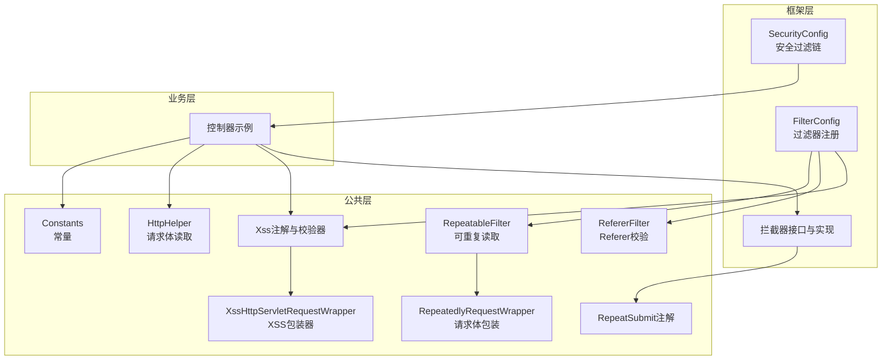
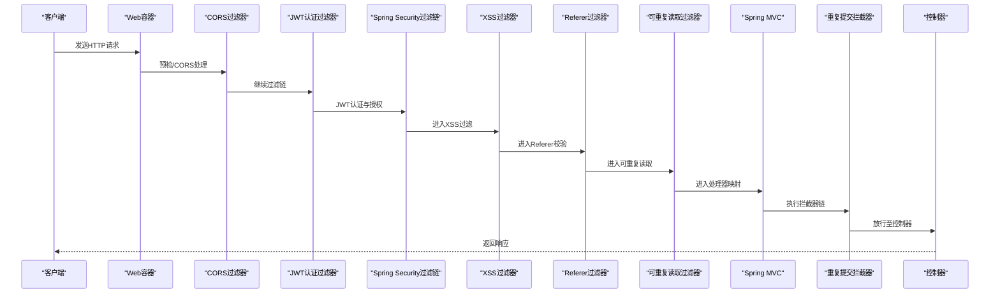
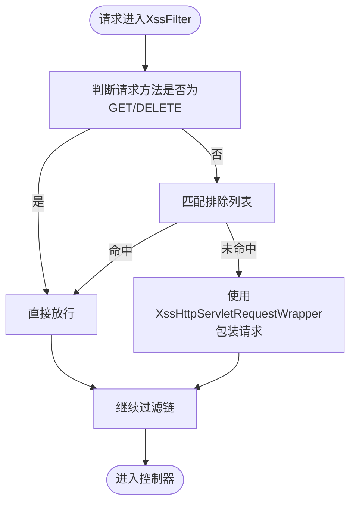
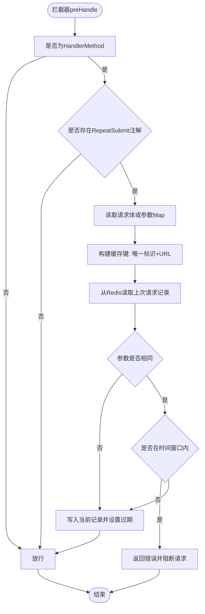
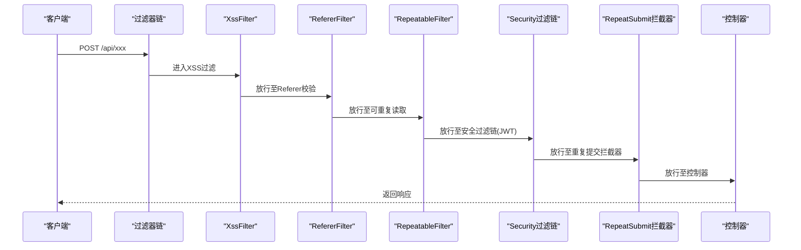
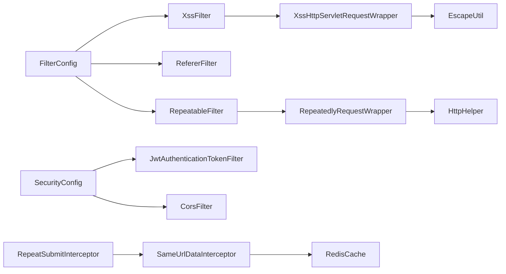

# 请求处理流程

<cite>
**本文引用的文件**
- [SecurityConfig.java](file://blog-framework/src/main/java/blog/framework/config/SecurityConfig.java)
- [FilterConfig.java](file://blog-framework/src/main/java/blog/framework/config/FilterConfig.java)
- [PermitAllUrlProperties.java](file://blog-framework/src/main/java/blog/framework/config/properties/PermitAllUrlProperties.java)
- [RepeatSubmitInterceptor.java](file://blog-framework/src/main/java/blog/framework/interceptor/RepeatSubmitInterceptor.java)
- [SameUrlDataInterceptor.java](file://blog-framework/src/main/java/blog/framework/interceptor/impl/SameUrlDataInterceptor.java)
- [XssFilter.java](file://blog-common/src/main/java/blog/common/filter/XssFilter.java)
- [XssHttpServletRequestWrapper.java](file://blog-common/src/main/java/blog/common/filter/XssHttpServletRequestWrapper.java)
- [Xss.java](file://blog-common/src/main/java/blog/common/xss/Xss.java)
- [XssValidator.java](file://blog-common/src/main/java/blog/common/xss/XssValidator.java)
- [RefererFilter.java](file://blog-common/src/main/java/blog/common/filter/RefererFilter.java)
- [RepeatableFilter.java](file://blog-common/src/main/java/blog/common/filter/RepeatableFilter.java)
- [RepeatedlyRequestWrapper.java](file://blog-common/src/main/java/blog/common/filter/RepeatedlyRequestWrapper.java)
- [HttpHelper.java](file://blog-common/src/main/java/blog/common/utils/http/HttpHelper.java)
- [Constants.java](file://blog-common/src/main/java/blog/common/constant/Constants.java)
</cite>

## 目录
1. [简介](#简介)
2. [项目结构](#项目结构)
3. [核心组件](#核心组件)
4. [架构总览](#架构总览)
5. [详细组件分析](#详细组件分析)
6. [依赖分析](#依赖分析)
7. [性能考虑](#性能考虑)
8. [故障排查指南](#故障排查指南)
9. [结论](#结论)
10. [附录](#附录)

## 简介
本文件面向Leejie博客系统的请求处理流程，系统采用Spring Boot + Spring Security + Spring MVC + MyBatis Plus技术栈，围绕“过滤器链 + 拦截器 + 控制器”的处理链路展开，重点覆盖以下方面：
- 过滤器链执行顺序与职责边界
- 拦截器对重复提交的防护机制
- XSS过滤器与参数预处理机制
- 请求头验证与Referer校验
- 典型REST API调用的时序图
- 性能优化建议与常见问题排查

## 项目结构
本项目按模块划分清晰：框架层负责安全、过滤器、拦截器、全局异常等横切能力；业务层包含控制器、服务、持久层；公共层提供工具、常量、过滤器与XSS支持。

图表来源
- [SecurityConfig.java:94-127](file://blog-framework/src/main/java/blog/framework/config/SecurityConfig.java#L94-L127)
- [FilterConfig.java:35-77](file://blog-framework/src/main/java/blog/framework/config/FilterConfig.java#L35-L77)
- [XssFilter.java:24-66](file://blog-common/src/main/java/blog/common/filter/XssFilter.java#L24-L66)
- [XssHttpServletRequestWrapper.java:22-98](file://blog-common/src/main/java/blog/common/filter/XssHttpServletRequestWrapper.java#L22-L98)
- [RefererFilter.java:21-68](file://blog-common/src/main/java/blog/common/filter/RefererFilter.java#L21-L68)
- [RepeatableFilter.java:20-46](file://blog-common/src/main/java/blog/common/filter/RepeatableFilter.java#L20-L46)
- [RepeatedlyRequestWrapper.java:22-69](file://blog-common/src/main/java/blog/common/filter/RepeatedlyRequestWrapper.java#L22-L69)
- [RepeatSubmitInterceptor.java:21-50](file://blog-framework/src/main/java/blog/framework/interceptor/RepeatSubmitInterceptor.java#L21-L50)
- [SameUrlDataInterceptor.java:27-98](file://blog-framework/src/main/java/blog/framework/interceptor/impl/SameUrlDataInterceptor.java#L27-L98)
- [Xss.java:16-28](file://blog-common/src/main/java/blog/common/xss/Xss.java#L16-L28)
- [XssValidator.java:15-35](file://blog-common/src/main/java/blog/common/xss/XssValidator.java#L15-L35)
- [HttpHelper.java:19-45](file://blog-common/src/main/java/blog/common/utils/http/HttpHelper.java#L19-L45)
- [Constants.java:12-235](file://blog-common/src/main/java/blog/common/constant/Constants.java#L12-L235)

章节来源
- [SecurityConfig.java:94-127](file://blog-framework/src/main/java/blog/framework/config/SecurityConfig.java#L94-L127)
- [FilterConfig.java:23-77](file://blog-framework/src/main/java/blog/framework/config/FilterConfig.java#L23-L77)

## 核心组件
- 安全过滤链：基于Spring Security的FilterChain，禁用CSRF，开启JWT认证过滤器、CORS过滤器，并配置匿名放行路径。
- 过滤器链：XSS过滤器、Referer防盗链过滤器、可重复读取JSON请求体过滤器，分别承担内容清洗、来源校验、请求体复读能力。
- 拦截器链：重复提交拦截器抽象类与具体实现SameUrlDataInterceptor，结合Redis进行去重与时间窗口控制。
- 参数预处理：XSS包装器对参数与JSON请求体进行转义清理；可重复读取包装器确保请求体可多次消费。
- 常量与工具：统一的常量定义、HTTP请求体读取工具，支撑安全与性能需求。

章节来源
- [SecurityConfig.java:94-127](file://blog-framework/src/main/java/blog/framework/config/SecurityConfig.java#L94-L127)
- [FilterConfig.java:35-77](file://blog-framework/src/main/java/blog/framework/config/FilterConfig.java#L35-L77)
- [RepeatSubmitInterceptor.java:21-50](file://blog-framework/src/main/java/blog/framework/interceptor/RepeatSubmitInterceptor.java#L21-L50)
- [SameUrlDataInterceptor.java:27-98](file://blog-framework/src/main/java/blog/framework/interceptor/impl/SameUrlDataInterceptor.java#L27-L98)
- [XssFilter.java:24-66](file://blog-common/src/main/java/blog/common/filter/XssFilter.java#L24-L66)
- [XssHttpServletRequestWrapper.java:22-98](file://blog-common/src/main/java/blog/common/filter/XssHttpServletRequestWrapper.java#L22-L98)
- [RepeatableFilter.java:20-46](file://blog-common/src/main/java/blog/common/filter/RepeatableFilter.java#L20-L46)
- [RepeatedlyRequestWrapper.java:22-69](file://blog-common/src/main/java/blog/common/filter/RepeatedlyRequestWrapper.java#L22-L69)
- [HttpHelper.java:19-45](file://blog-common/src/main/java/blog/common/utils/http/HttpHelper.java#L19-L45)
- [Constants.java:12-235](file://blog-common/src/main/java/blog/common/constant/Constants.java#L12-L235)

## 架构总览
下图展示了从HTTP请求进入容器到控制器返回响应的完整处理链路，包括过滤器链、拦截器链与安全过滤器的协作关系。

图表来源
- [SecurityConfig.java:121-125](file://blog-framework/src/main/java/blog/framework/config/SecurityConfig.java#L121-L125)
- [FilterConfig.java:35-77](file://blog-framework/src/main/java/blog/framework/config/FilterConfig.java#L35-L77)
- [RepeatSubmitInterceptor.java:23-38](file://blog-framework/src/main/java/blog/framework/interceptor/RepeatSubmitInterceptor.java#L23-L38)

## 详细组件分析

### 过滤器链与执行顺序
- 过滤器注册与顺序
  - XSS过滤器：最高优先级，针对特定URL模式启用，排除GET/DELETE方法与白名单路径。
  - Referer过滤器：最高优先级，仅对静态资源路径生效，校验Referer来源域名。
  - 可重复读取过滤器：最低优先级，对所有路径生效，将JSON请求体包装为可重复读取。
- 执行顺序与职责
  - XSS过滤器负责参数与JSON内容清洗，避免XSS注入。
  - Referer过滤器限制来源，降低资源盗链风险。
  - 可重复读取过滤器确保后续组件（如日志、缓存、拦截器）可多次读取请求体。

章节来源
- [FilterConfig.java:35-77](file://blog-framework/src/main/java/blog/framework/config/FilterConfig.java#L35-L77)
- [XssFilter.java:40-60](file://blog-common/src/main/java/blog/common/filter/XssFilter.java#L40-L60)
- [RefererFilter.java:34-62](file://blog-common/src/main/java/blog/common/filter/RefererFilter.java#L34-L62)
- [RepeatableFilter.java:27-39](file://blog-common/src/main/java/blog/common/filter/RepeatableFilter.java#L27-L39)

### XSS过滤器与参数预处理
- XSS过滤器工作原理
  - 初始化时读取排除列表（excludes），支持多URL匹配。
  - 对非GET/DELETE请求且未命中排除规则的请求，使用XSS包装器替换请求对象。
  - 包装器对参数数组逐项进行清理与去空格，对JSON请求体进行整体转义清理。
- 参数预处理机制
  - 可重复读取包装器在构造时读取原始请求体字节，后续getReader/getInputStream可重复消费。
  - HttpHelper提供统一的请求体读取入口，避免重复读取异常。

图表来源
- [XssFilter.java:40-60](file://blog-common/src/main/java/blog/common/filter/XssFilter.java#L40-L60)
- [XssHttpServletRequestWrapper.java:31-87](file://blog-common/src/main/java/blog/common/filter/XssHttpServletRequestWrapper.java#L31-L87)
- [HttpHelper.java:22-43](file://blog-common/src/main/java/blog/common/utils/http/HttpHelper.java#L22-L43)

章节来源
- [XssFilter.java:24-66](file://blog-common/src/main/java/blog/common/filter/XssFilter.java#L24-L66)
- [XssHttpServletRequestWrapper.java:22-98](file://blog-common/src/main/java/blog/common/filter/XssHttpServletRequestWrapper.java#L22-L98)
- [RepeatableFilter.java:20-46](file://blog-common/src/main/java/blog/common/filter/RepeatableFilter.java#L20-L46)
- [RepeatedlyRequestWrapper.java:22-69](file://blog-common/src/main/java/blog/common/filter/RepeatedlyRequestWrapper.java#L22-L69)
- [HttpHelper.java:19-45](file://blog-common/src/main/java/blog/common/utils/http/HttpHelper.java#L19-L45)

### 重复提交拦截器
- 设计思路
  - 抽象拦截器根据方法上的RepeatSubmit注解决定是否启用校验。
  - 具体实现SameUrlDataInterceptor以“URL+唯一标识（如令牌头）”为键，结合Redis存储最近一次请求的参数与时间戳，进行参数对比与时间窗口判定。
- 关键点
  - 参数来源：优先读取包装后的请求体字符串；若为空则回退到请求参数Map序列化。
  - 时间窗口：由注解interval控制，默认毫秒级阈值。
  - 唯一标识：默认使用自定义token头，避免同URL在不同用户或会话间误判。

图表来源
- [RepeatSubmitInterceptor.java:23-38](file://blog-framework/src/main/java/blog/framework/interceptor/RepeatSubmitInterceptor.java#L23-L38)
- [SameUrlDataInterceptor.java:41-78](file://blog-framework/src/main/java/blog/framework/interceptor/impl/SameUrlDataInterceptor.java#L41-L78)

章节来源
- [RepeatSubmitInterceptor.java:21-50](file://blog-framework/src/main/java/blog/framework/interceptor/RepeatSubmitInterceptor.java#L21-L50)
- [SameUrlDataInterceptor.java:27-98](file://blog-framework/src/main/java/blog/framework/interceptor/impl/SameUrlDataInterceptor.java#L27-L98)
- [RepeatSubmit.java:19-30](file://blog-common/src/main/java/blog/common/annotation/RepeatSubmit.java#L19-L30)

### 请求头验证与Referer校验
- Referer过滤器
  - 初始化时读取允许域名列表，按逗号分割。
  - 若Referer为空或不在允许列表中，直接返回禁止访问状态码。
  - 仅对静态资源路径生效，避免影响业务接口。
- 常量与路径
  - 资源前缀常量用于限定Referer过滤器作用域。

章节来源
- [RefererFilter.java:21-68](file://blog-common/src/main/java/blog/common/filter/RefererFilter.java#L21-L68)
- [Constants.java:139-142](file://blog-common/src/main/java/blog/common/constant/Constants.java#L139-L142)

### 安全过滤链与匿名放行
- 安全过滤链
  - 禁用CSRF，基于JWT无状态认证，开启CORS过滤器与JWT认证过滤器。
  - 配置匿名放行路径：登录、注册、验证码、静态资源、Swagger与Druid等。
  - 动态收集标注Anonymous注解的控制器路径，统一加入匿名放行集合。
- 执行顺序
  - CORS过滤器在JWT与登出过滤器之前，确保跨域与认证链路正确性。

章节来源
- [SecurityConfig.java:95-127](file://blog-framework/src/main/java/blog/framework/config/SecurityConfig.java#L95-L127)
- [PermitAllUrlProperties.java:38-62](file://blog-framework/src/main/java/blog/framework/config/properties/PermitAllUrlProperties.java#L38-L62)

### 典型REST API调用时序
以下时序图展示一次典型POST请求的处理流程，涵盖XSS清洗、Referer校验、可重复读取、JWT认证与重复提交拦截。

图表来源
- [FilterConfig.java:35-77](file://blog-framework/src/main/java/blog/framework/config/FilterConfig.java#L35-L77)
- [SecurityConfig.java:121-125](file://blog-framework/src/main/java/blog/framework/config/SecurityConfig.java#L121-L125)
- [RepeatSubmitInterceptor.java:23-38](file://blog-framework/src/main/java/blog/framework/interceptor/RepeatSubmitInterceptor.java#L23-L38)

## 依赖分析
- 组件耦合
  - 过滤器链通过配置类集中注册，彼此独立，耦合度低。
  - 拦截器依赖注解与Redis缓存，需关注缓存可用性与键空间设计。
  - XSS包装器依赖转义工具与请求体读取工具，保证输入清洗一致性。
- 外部依赖
  - Spring Security提供认证与授权基础能力。
  - Redis用于重复提交键空间存储，需评估容量与过期策略。
  - CORS过滤器与JWT过滤器共同保障跨域与认证前置。

图表来源
- [FilterConfig.java:35-77](file://blog-framework/src/main/java/blog/framework/config/FilterConfig.java#L35-L77)
- [SecurityConfig.java:121-125](file://blog-framework/src/main/java/blog/framework/config/SecurityConfig.java#L121-L125)
- [RepeatableFilter.java:27-39](file://blog-common/src/main/java/blog/common/filter/RepeatableFilter.java#L27-L39)
- [XssFilter.java:40-49](file://blog-common/src/main/java/blog/common/filter/XssFilter.java#L40-L49)
- [XssHttpServletRequestWrapper.java:58-59](file://blog-common/src/main/java/blog/common/filter/XssHttpServletRequestWrapper.java#L58-L59)
- [SameUrlDataInterceptor.java:37-76](file://blog-framework/src/main/java/blog/framework/interceptor/impl/SameUrlDataInterceptor.java#L37-L76)

## 性能考虑
- 过滤器链顺序优化
  - 将高成本过滤（如XSS包装）置于低优先级，减少对快速放行路径的影响。
  - 对GET/DELETE请求跳过XSS清洗，降低不必要的开销。
- 请求体复用
  - 使用可重复读取包装器避免重复解析请求体带来的二次IO。
- 缓存策略
  - 重复提交键设置合理过期时间，避免Redis键空间膨胀。
  - 键命名包含URL与唯一标识，避免跨用户误判导致的缓存污染。
- 并发与线程安全
  - 包装器与工具类应避免共享可变状态，确保多线程安全。

## 故障排查指南
- XSS清洗无效
  - 检查XSS过滤器是否启用与URL模式是否匹配。
  - 确认请求方法未被排除（GET/DELETE）。
  - 核对排除列表与Content-Type是否符合预期。
- Referer校验失败
  - 确认Referer头是否存在且在允许域名列表中。
  - 检查资源路径是否匹配过滤器作用域。
- 重复提交拦截误判
  - 核对请求体是否被正确读取（JSON需使用可重复读取包装）。
  - 检查唯一标识头是否一致，避免跨会话误判。
  - 调整注解的时间窗口阈值以适配业务节奏。
- 安全过滤链异常
  - 检查匿名放行路径是否正确，避免认证失败。
  - 确认CORS与JWT过滤器顺序是否符合配置。

章节来源
- [XssFilter.java:40-60](file://blog-common/src/main/java/blog/common/filter/XssFilter.java#L40-L60)
- [RefererFilter.java:34-62](file://blog-common/src/main/java/blog/common/filter/RefererFilter.java#L34-L62)
- [RepeatableFilter.java:27-39](file://blog-common/src/main/java/blog/common/filter/RepeatableFilter.java#L27-L39)
- [SameUrlDataInterceptor.java:41-78](file://blog-framework/src/main/java/blog/framework/interceptor/impl/SameUrlDataInterceptor.java#L41-L78)
- [SecurityConfig.java:121-125](file://blog-framework/src/main/java/blog/framework/config/SecurityConfig.java#L121-L125)

## 结论
该系统通过“过滤器链 + 拦截器 + 安全过滤链”的组合，实现了对XSS、Referer、重复提交等多维度的安全防护与参数预处理。合理的执行顺序与配置使得系统在保证安全性的同时兼顾性能与可维护性。建议在生产环境中持续监控过滤器命中率、Redis命中情况与响应延迟，以进一步优化链路效率。

## 附录
- 常用配置项参考
  - XSS过滤器启用开关、URL模式、排除列表
  - Referer过滤器启用开关、允许域名列表
  - 重复提交注解的间隔时间与提示消息
  - 安全过滤链中的匿名放行路径集合