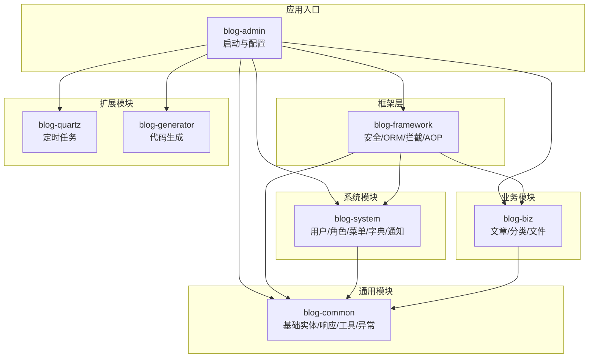
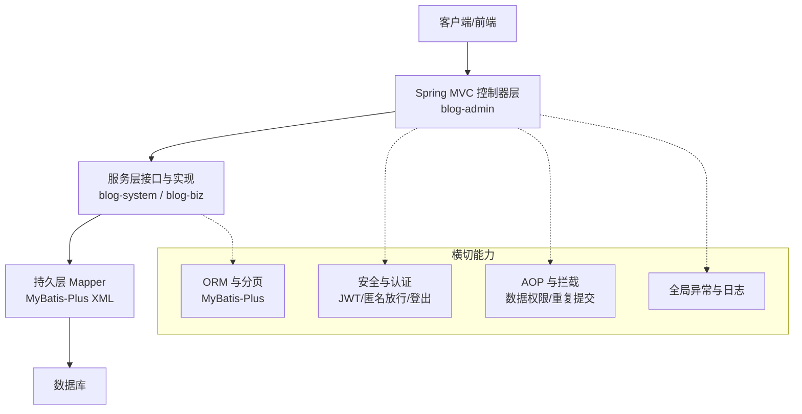
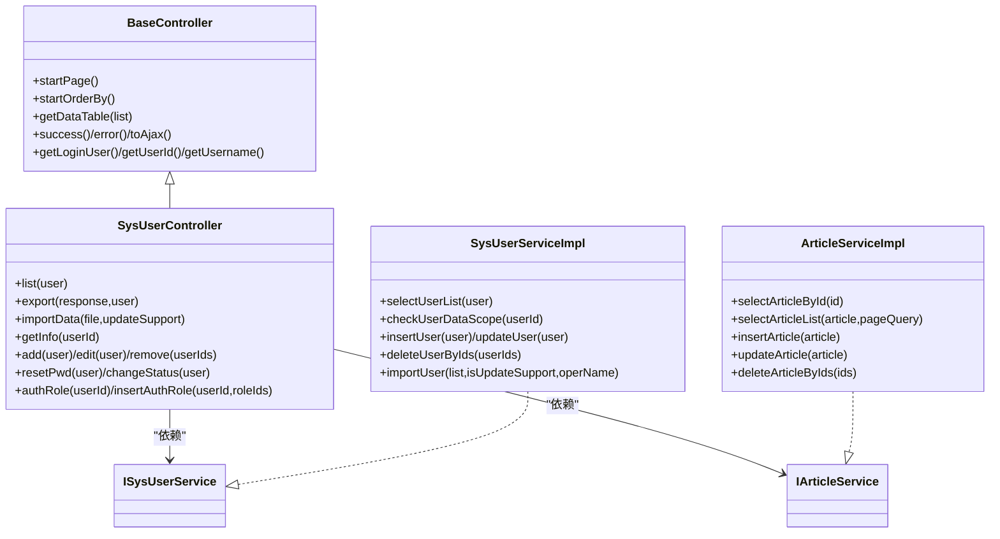
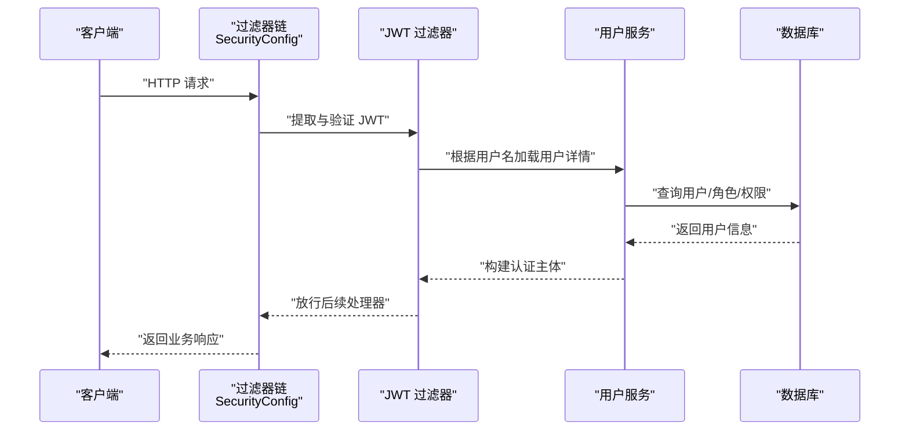
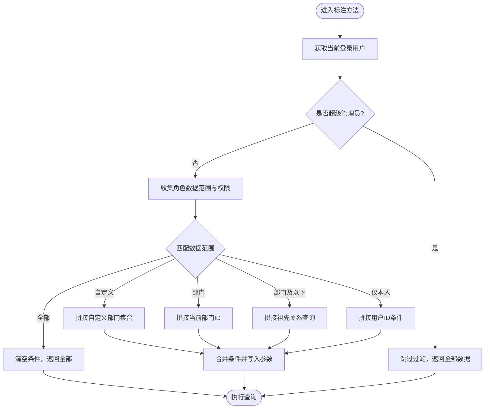
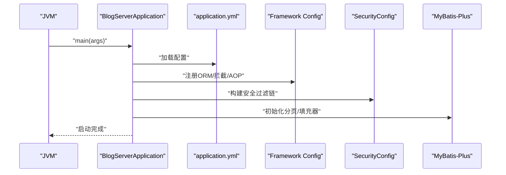
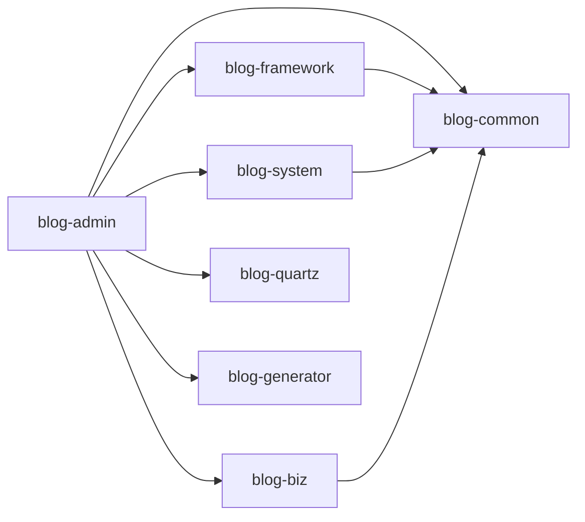

# 整体架构概览

<cite>
**本文引用的文件**
- [pom.xml](file://pom.xml)
- [BlogServerApplication.java](file://blog-admin/src/main/java/blog/BlogServerApplication.java)
- [application.yml](file://blog-admin/src/main/resources/application.yml)
- [ApplicationConfig.java](file://blog-framework/src/main/java/blog/framework/config/ApplicationConfig.java)
- [SecurityConfig.java](file://blog-framework/src/main/java/blog/framework/config/SecurityConfig.java)
- [MybatisPlusConfig.java](file://blog-framework/src/main/java/blog/framework/config/MybatisPlusConfig.java)
- [BaseController.java](file://blog-common/src/main/java/blog/common/base/controller/BaseController.java)
- [SysUserController.java](file://blog-admin/src/main/java/blog/web/controller/system/SysUserController.java)
- [SysUserServiceImpl.java](file://blog-system/src/main/java/blog/system/service/impl/SysUserServiceImpl.java)
- [ArticleServiceImpl.java](file://blog-biz/src/main/java/blog/biz/service/impl/ArticleServiceImpl.java)
- [BlogServerConfig.java](file://blog-common/src/main/java/blog/common/config/BlogServerConfig.java)
- [DataScopeAspect.java](file://blog-framework/src/main/java/blog/framework/aspectj/DataScopeAspect.java)
- [ScheduleConfig.java](file://blog-quartz/src/main/java/blog/quartz/config/ScheduleConfig.java)
- [GenConfig.java](file://blog-generator/src/main/java/blog/generator/config/GenConfig.java)
</cite>

## 目录
1. [简介](#简介)
2. [项目结构](#项目结构)
3. [核心组件](#核心组件)
4. [架构总览](#架构总览)
5. [详细组件分析](#详细组件分析)
6. [依赖分析](#依赖分析)
7. [性能考虑](#性能考虑)
8. [故障排查指南](#故障排查指南)
9. [结论](#结论)
10. [附录](#附录)

## 简介
本文件面向初学者与进阶开发者，系统性梳理 Leejie 博客系统的整体架构与实现要点。系统采用基于 Spring Boot 的多模块分层架构，遵循 MVC 三层架构模式，结合模块化设计理念，将通用能力下沉至公共模块，业务能力集中在业务模块，系统提供完善的权限控制、数据过滤、分页与日志等横切能力，并通过 MyBatis-Plus 提供高效的 ORM 能力与分页支持。系统同时集成 JWT 无状态认证、Swagger/OpenAPI 文档、MinIO 文件存储、定时任务等能力，形成可扩展、可维护的现代化后端架构。

## 项目结构
系统以 Maven 多模块组织，顶层 POM 统一管理版本与模块清单，子模块按职责划分如下：
- blog-admin：Web 启动模块，负责应用入口、资源配置与对外接口暴露
- blog-framework：框架层，提供安全、MyBatis-Plus、拦截器、AOP、异步与全局异常处理等基础设施
- blog-system：系统模块，提供用户、角色、菜单、字典、通知等系统管理能力
- blog-biz：业务模块，封装文章、分类、文件等核心业务逻辑
- blog-common：通用模块，提供基础实体、响应封装、工具类、常量、校验与异常体系
- blog-quartz：定时任务模块，提供任务调度与日志管理
- blog-generator：代码生成模块，提供基于模板的前后端代码生成能力

图表来源
- [pom.xml:225-233](file://pom.xml#L225-L233)
- [BlogServerApplication.java:12](file://blog-admin/src/main/java/blog/BlogServerApplication.java#L12)

章节来源
- [pom.xml:225-233](file://pom.xml#L225-L233)
- [BlogServerApplication.java:12](file://blog-admin/src/main/java/blog/BlogServerApplication.java#L12)

## 核心组件
- 应用入口与启动
  - 启动类排除数据源自动装配，配合框架层统一配置，确保启动可控与可扩展
  - 通过配置文件设置端口、上下文路径、日志级别、MyBatis-Plus、分页、OpenAPI 等
- 框架层
  - 安全配置：基于 Spring Security 的无状态认证，启用 CORS、JWT 过滤器、匿名放行策略与登出处理
  - ORM 配置：MyBatis-Plus 分页插件、雪花 ID 生成器、元对象填充器
  - AOP 与拦截：数据权限切面、重复提交拦截、动态数据源等
- 通用模块
  - 控制器基类：统一分页、排序、结果封装与登录用户信息获取
  - 配置读取：项目名称、上传路径、验证码类型等
- 系统模块与业务模块
  - 系统模块：用户、角色、菜单、字典、通知等管理能力，含数据权限注解与事务控制
  - 业务模块：文章、分类、文件等业务服务，基于 MyBatis-Plus 实现 CRUD 与分页
- 扩展模块
  - 定时任务：提供任务与日志管理（当前配置为注释状态）
  - 代码生成：基于模板的前后端代码生成配置

章节来源
- [BlogServerApplication.java:12-19](file://blog-admin/src/main/java/blog/BlogServerApplication.java#L12-L19)
- [application.yml:13-161](file://blog-admin/src/main/resources/application.yml#L13-L161)
- [ApplicationConfig.java:16-29](file://blog-framework/src/main/java/blog/framework/config/ApplicationConfig.java#L16-L29)
- [SecurityConfig.java:31-137](file://blog-framework/src/main/java/blog/framework/config/SecurityConfig.java#L31-L137)
- [MybatisPlusConfig.java:16-56](file://blog-framework/src/main/java/blog/framework/config/MybatisPlusConfig.java#L16-L56)
- [BaseController.java:30-182](file://blog-common/src/main/java/blog/common/base/controller/BaseController.java#L30-L182)
- [SysUserController.java:42-233](file://blog-admin/src/main/java/blog/web/controller/system/SysUserController.java#L42-L233)
- [SysUserServiceImpl.java:42-513](file://blog-system/src/main/java/blog/system/service/impl/SysUserServiceImpl.java#L42-L513)
- [ArticleServiceImpl.java:21-95](file://blog-biz/src/main/java/blog/biz/service/impl/ArticleServiceImpl.java#L21-L95)
- [BlogServerConfig.java:11-120](file://blog-common/src/main/java/blog/common/config/BlogServerConfig.java#L11-L120)
- [DataScopeAspect.java:26-154](file://blog-framework/src/main/java/blog/framework/aspectj/DataScopeAspect.java#L26-L154)
- [ScheduleConfig.java:14-58](file://blog-quartz/src/main/java/blog/quartz/config/ScheduleConfig.java#L14-L58)
- [GenConfig.java:13-87](file://blog-generator/src/main/java/blog/generator/config/GenConfig.java#L13-L87)

## 架构总览
系统采用“启动模块 + 框架层 + 业务/系统模块 + 通用模块 + 扩展模块”的分层架构，MVC 三层架构通过 Spring MVC 控制器、服务层与持久层协同完成请求处理。安全与横切能力由框架层统一提供，业务能力在业务模块中实现，系统管理能力在系统模块中实现，通用能力在通用模块中沉淀。

图表来源
- [SecurityConfig.java:94-127](file://blog-framework/src/main/java/blog/framework/config/SecurityConfig.java#L94-L127)
- [MybatisPlusConfig.java:19-52](file://blog-framework/src/main/java/blog/framework/config/MybatisPlusConfig.java#L19-L52)
- [SysUserController.java:42-233](file://blog-admin/src/main/java/blog/web/controller/system/SysUserController.java#L42-L233)
- [SysUserServiceImpl.java:42-513](file://blog-system/src/main/java/blog/system/service/impl/SysUserServiceImpl.java#L42-L513)
- [ArticleServiceImpl.java:21-95](file://blog-biz/src/main/java/blog/biz/service/impl/ArticleServiceImpl.java#L21-L95)

## 详细组件分析

### MVC 三层架构与模块职责
- 控制器层（web 层）
  - 位于 admin 模块，负责接收请求、参数校验、调用服务层并返回结果
  - 示例：用户管理控制器对权限注解、Excel 导入导出、日志注解等进行统一处理
- 服务层（biz/system 层）
  - 系统模块：用户、角色、菜单、字典、通知等管理，包含数据权限注解与事务控制
  - 业务模块：文章、分类、文件等业务服务，基于 MyBatis-Plus 实现 CRUD 与分页
- 持久层（mapper 层）
  - 通过 MyBatis-Plus 提供的通用 CRUD 与分页能力，结合 XML 映射实现复杂查询

图表来源
- [BaseController.java:30-182](file://blog-common/src/main/java/blog/common/base/controller/BaseController.java#L30-L182)
- [SysUserController.java:42-233](file://blog-admin/src/main/java/blog/web/controller/system/SysUserController.java#L42-L233)
- [SysUserServiceImpl.java:42-513](file://blog-system/src/main/java/blog/system/service/impl/SysUserServiceImpl.java#L42-L513)
- [ArticleServiceImpl.java:21-95](file://blog-biz/src/main/java/blog/biz/service/impl/ArticleServiceImpl.java#L21-L95)

章节来源
- [SysUserController.java:42-233](file://blog-admin/src/main/java/blog/web/controller/system/SysUserController.java#L42-L233)
- [SysUserServiceImpl.java:42-513](file://blog-system/src/main/java/blog/system/service/impl/SysUserServiceImpl.java#L42-L513)
- [ArticleServiceImpl.java:21-95](file://blog-biz/src/main/java/blog/biz/service/impl/ArticleServiceImpl.java#L21-L95)
- [BaseController.java:30-182](file://blog-common/src/main/java/blog/common/base/controller/BaseController.java#L30-L182)

### 安全与认证流程（JWT 无状态）
系统采用 Spring Security + JWT 的无状态认证方案，请求在进入控制器前需经过 CORS、JWT 与登录过滤器链，匿名放行部分公开接口，其余接口均需认证。

图表来源
- [SecurityConfig.java:94-127](file://blog-framework/src/main/java/blog/framework/config/SecurityConfig.java#L94-L127)

章节来源
- [SecurityConfig.java:31-137](file://blog-framework/src/main/java/blog/framework/config/SecurityConfig.java#L31-L137)

### 数据权限与过滤（AOP）
系统通过数据权限切面在方法执行前根据用户角色与权限动态拼接 SQL 条件，实现“自定义/部门/部门及以下/仅本人”等多维度的数据范围控制。

图表来源
- [DataScopeAspect.java:65-142](file://blog-framework/src/main/java/blog/framework/aspectj/DataScopeAspect.java#L65-L142)

章节来源
- [DataScopeAspect.java:26-154](file://blog-framework/src/main/java/blog/framework/aspectj/DataScopeAspect.java#L26-L154)

### 应用启动与初始化流程
- 启动类排除数据源自动装配，便于集中配置与扩展
- 读取 application.yml 中的端口、上下文路径、MyBatis-Plus、分页、OpenAPI、Redis、MinIO 等配置
- 框架层注册 MyBatis-Plus 分页插件、雪花 ID 生成器、元对象填充器与 Mapper 扫描
- 安全配置启用无状态会话、匿名放行、JWT 过滤器与 CORS 过滤器

图表来源
- [BlogServerApplication.java:12-19](file://blog-admin/src/main/java/blog/BlogServerApplication.java#L12-L19)
- [application.yml:13-161](file://blog-admin/src/main/resources/application.yml#L13-L161)
- [ApplicationConfig.java:16-29](file://blog-framework/src/main/java/blog/framework/config/ApplicationConfig.java#L16-L29)
- [MybatisPlusConfig.java:19-52](file://blog-framework/src/main/java/blog/framework/config/MybatisPlusConfig.java#L19-L52)
- [SecurityConfig.java:94-127](file://blog-framework/src/main/java/blog/framework/config/SecurityConfig.java#L94-L127)

章节来源
- [BlogServerApplication.java:12-19](file://blog-admin/src/main/java/blog/BlogServerApplication.java#L12-L19)
- [application.yml:13-161](file://blog-admin/src/main/resources/application.yml#L13-L161)
- [ApplicationConfig.java:16-29](file://blog-framework/src/main/java/blog/framework/config/ApplicationConfig.java#L16-L29)
- [MybatisPlusConfig.java:19-52](file://blog-framework/src/main/java/blog/framework/config/MybatisPlusConfig.java#L19-L52)
- [SecurityConfig.java:94-127](file://blog-framework/src/main/java/blog/framework/config/SecurityConfig.java#L94-L127)

## 依赖分析
- 顶层 POM 统一管理 Spring Boot、MyBatis-Plus、Druid、JWT、MinIO、Swagger/OpenAPI 等依赖版本
- 模块间依赖关系
  - admin 依赖 framework、system、biz、common、quartz、generator
  - framework 依赖 common
  - system 依赖 common
  - biz 依赖 common
  - quartz 与 generator 为独立扩展模块

图表来源
- [pom.xml:168-220](file://pom.xml#L168-L220)

章节来源
- [pom.xml:168-220](file://pom.xml#L168-L220)

## 性能考虑
- ORM 与分页
  - 使用 MyBatis-Plus 分页插件与合理化配置，避免大表全量扫描
  - 元对象填充器减少重复赋值开销
- 并发与线程
  - 合理设置 Tomcat 线程池参数，平衡吞吐与延迟
- 缓存与存储
  - Redis 用于会话与缓存，MinIO 用于对象存储，注意连接池与超时配置
- 安全与防护
  - 启用 CORS 与 Xss 过滤，防止常见 Web 攻击
- 定时任务
  - 当前配置为注释状态，避免不必要的资源占用；如启用需配置数据源与集群策略

## 故障排查指南
- 启动失败
  - 检查 application.yml 中端口、上下文路径、数据库与 Redis 连接配置
  - 确认启动类排除了数据源自动装配，避免冲突
- 认证失败或跨域问题
  - 检查 SecurityConfig 中匿名放行列表与 JWT 过滤器顺序
  - 确认 Header 名称与密钥一致
- 权限与数据范围异常
  - 检查数据权限注解与切面是否生效，确认用户角色与权限字符匹配
- 分页与排序异常
  - 检查 BaseController 中分页与排序参数是否正确传递
- 文件上传与 MinIO
  - 检查上传路径与 MinIO 配置，确认桶与凭证正确

章节来源
- [application.yml:13-161](file://blog-admin/src/main/resources/application.yml#L13-L161)
- [SecurityConfig.java:94-127](file://blog-framework/src/main/java/blog/framework/config/SecurityConfig.java#L94-L127)
- [DataScopeAspect.java:65-142](file://blog-framework/src/main/java/blog/framework/aspectj/DataScopeAspect.java#L65-L142)
- [BaseController.java:50-70](file://blog-common/src/main/java/blog/common/base/controller/BaseController.java#L50-L70)
- [BlogServerConfig.java:68-118](file://blog-common/src/main/java/blog/common/config/BlogServerConfig.java#L68-L118)

## 结论
本系统通过模块化与分层架构实现了高内聚、低耦合的设计目标，结合 Spring Security 的 JWT 无状态认证、MyBatis-Plus 的 ORM 能力与丰富的横切能力，形成了稳定、可扩展的后端技术栈。对于初学者而言，建议从 admin 启动模块入手，逐步理解框架层与通用模块的作用，再深入系统与业务模块的职责边界与交互方式。

## 附录
- 技术选型说明
  - Spring Boot：自动配置与起步依赖，简化配置与部署
  - MyBatis-Plus：增强 ORM 能力，内置分页、元对象填充、雪花 ID 等
  - Spring Security + JWT：无状态认证，适合微服务与前后端分离
  - OpenAPI/Swagger：自动生成接口文档，提升协作效率
  - MinIO：对象存储，适配图片与文件上传场景
  - AOP 与拦截器：统一处理数据权限、重复提交、日志等横切关注点