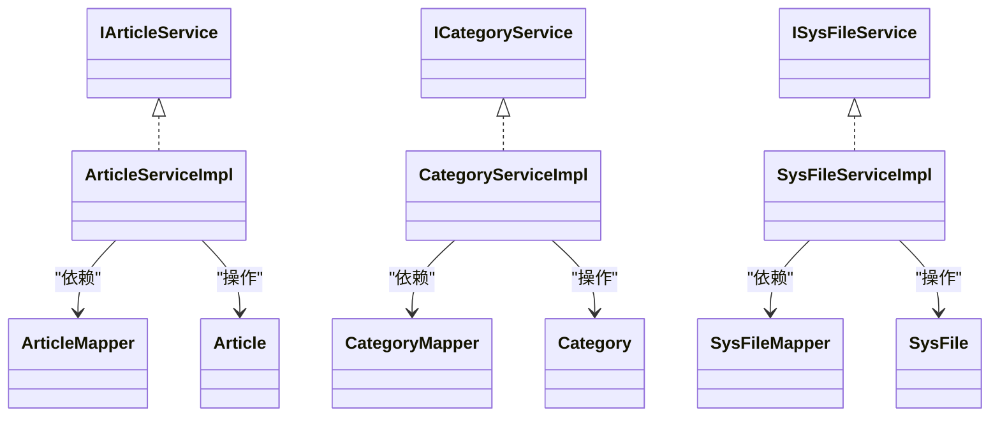
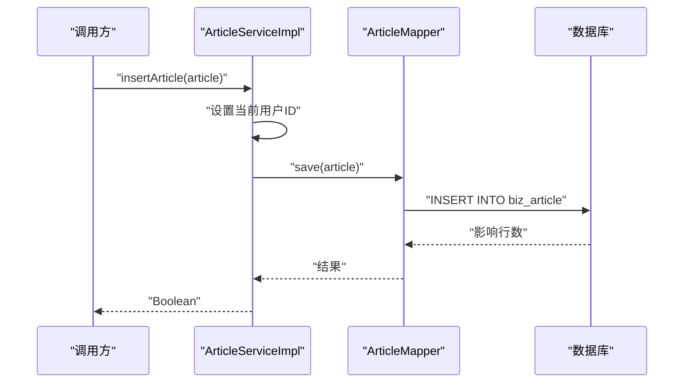
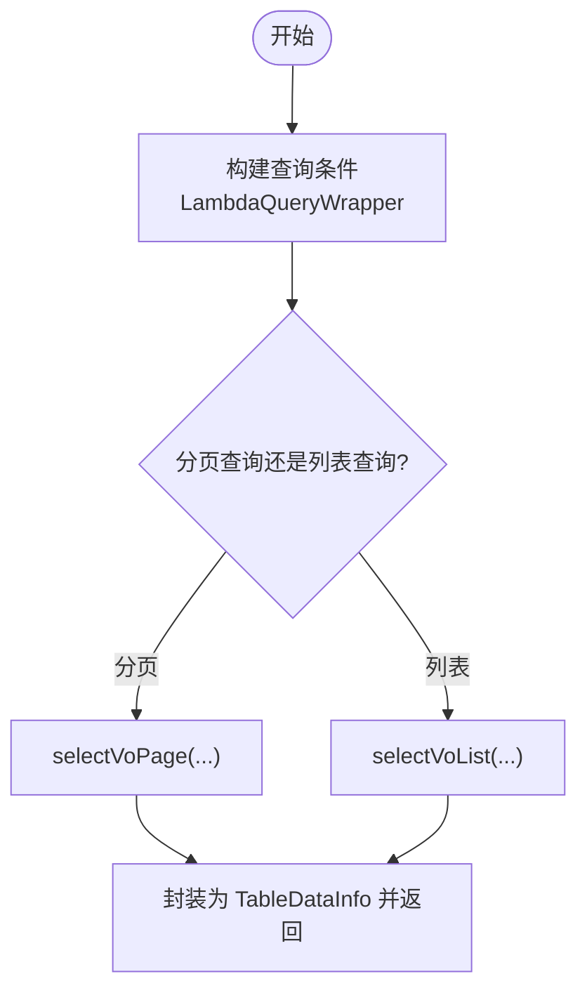
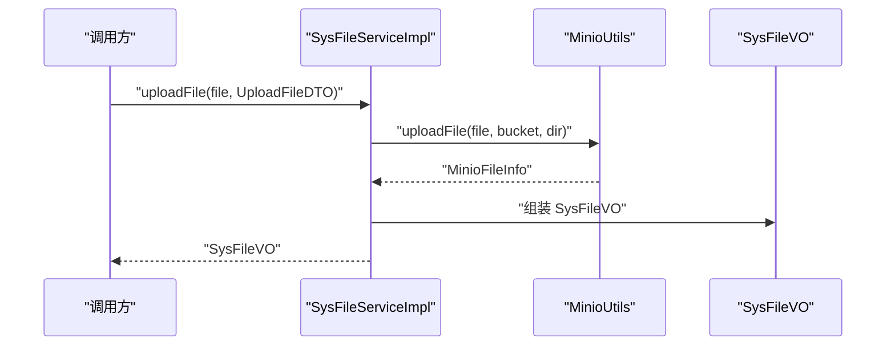
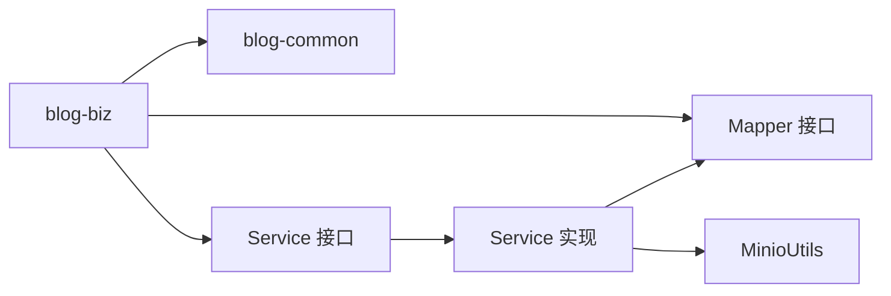
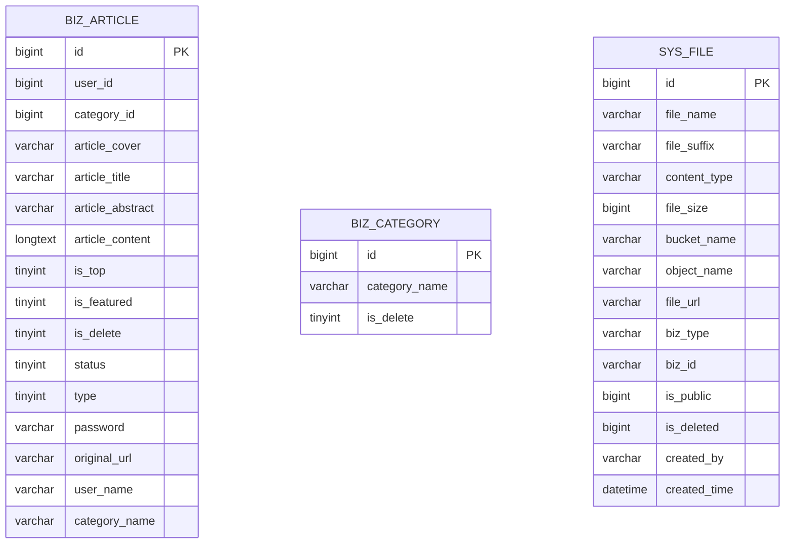

# 业务逻辑模块设计

<cite>
**本文引用的文件**   
- [blog-biz/pom.xml](file://blog-biz/pom.xml)
- [Article.java](file://blog-biz/src/main/java/blog/biz/domain/Article.java)
- [Category.java](file://blog-biz/src/main/java/blog/biz/domain/Category.java)
- [SysFile.java](file://blog-biz/src/main/java/blog/biz/domain/SysFile.java)
- [CategoryDTO.java](file://blog-biz/src/main/java/blog/biz/domain/dto/CategoryDTO.java)
- [SysFileDTO.java](file://blog-biz/src/main/java/blog/biz/domain/dto/SysFileDTO.java)
- [UploadFileDTO.java](file://blog-biz/src/main/java/blog/biz/domain/dto/UploadFileDTO.java)
- [CategoryVO.java](file://blog-biz/src/main/java/blog/biz/domain/vo/CategoryVO.java)
- [SysFileVO.java](file://blog-biz/src/main/java/blog/biz/domain/vo/SysFileVO.java)
- [IArticleService.java](file://blog-biz/src/main/java/blog/biz/service/IArticleService.java)
- [ICategoryService.java](file://blog-biz/src/main/java/blog/biz/service/ICategoryService.java)
- [ISysFileService.java](file://blog-biz/src/main/java/blog/biz/service/ISysFileService.java)
- [ArticleServiceImpl.java](file://blog-biz/src/main/java/blog/biz/service/impl/ArticleServiceImpl.java)
- [CategoryServiceImpl.java](file://blog-biz/src/main/java/blog/biz/service/impl/CategoryServiceImpl.java)
- [SysFileServiceImpl.java](file://blog-biz/src/main/java/blog/biz/service/impl/SysFileServiceImpl.java)
- [ArticleMapper.java](file://blog-biz/src/main/java/blog/biz/mapper/ArticleMapper.java)
- [CategoryMapper.java](file://blog-biz/src/main/java/blog/biz/mapper/CategoryMapper.java)
- [SysFileMapper.java](file://blog-biz/src/main/java/blog/biz/mapper/SysFileMapper.java)
</cite>

## 目录
1. [简介](#简介)
2. [项目结构](#项目结构)
3. [核心组件](#核心组件)
4. [架构总览](#架构总览)
5. [详细组件分析](#详细组件分析)
6. [依赖分析](#依赖分析)
7. [性能考虑](#性能考虑)
8. [故障排查指南](#故障排查指南)
9. [结论](#结论)
10. [附录](#附录)

## 简介
本设计文档聚焦于 Leejie 博客系统中的业务逻辑模块（blog-biz），系统性阐述文章管理、分类管理和文件管理三大核心业务域的领域模型、服务接口设计、数据访问层集成与业务规则实现。文档提供业务流程图、接口设计规范与实体关系说明，帮助开发者快速理解并遵循业务层的设计原则与编码规范。

## 项目结构
blog-biz 模块采用“领域模型 + 服务接口 + 实现 + Mapper”的分层组织方式，结合 DTO/VO 对外暴露数据契约，确保职责清晰、边界明确，并通过统一的分页返回结构 TableDataInfo 提供一致的查询结果封装。

图表来源
- [blog-biz/pom.xml:19-27](file://blog-biz/pom.xml#L19-L27)

章节来源
- [blog-biz/pom.xml:1-30](file://blog-biz/pom.xml#L1-L30)

## 核心组件
- 领域模型：Article（文章）、Category（分类）、SysFile（文件）
- 数据传输对象：CategoryDTO、SysFileDTO、UploadFileDTO
- 视图对象：CategoryVO、SysFileVO
- 服务接口：IArticleService、ICategoryService、ISysFileService
- 服务实现：ArticleServiceImpl、CategoryServiceImpl、SysFileServiceImpl
- 数据访问：ArticleMapper、CategoryMapper、SysFileMapper

章节来源
- [Article.java:14-94](file://blog-biz/src/main/java/blog/biz/domain/Article.java#L14-L94)
- [Category.java:10-37](file://blog-biz/src/main/java/blog/biz/domain/Category.java#L10-L37)
- [SysFile.java:11-94](file://blog-biz/src/main/java/blog/biz/domain/SysFile.java#L11-L94)
- [CategoryDTO.java:11-28](file://blog-biz/src/main/java/blog/biz/domain/dto/CategoryDTO.java#L11-L28)
- [SysFileDTO.java:13-82](file://blog-biz/src/main/java/blog/biz/domain/dto/SysFileDTO.java#L13-L82)
- [UploadFileDTO.java:11-35](file://blog-biz/src/main/java/blog/biz/domain/dto/UploadFileDTO.java#L11-L35)
- [CategoryVO.java:12-41](file://blog-biz/src/main/java/blog/biz/domain/vo/CategoryVO.java#L12-L41)
- [SysFileVO.java:18-113](file://blog-biz/src/main/java/blog/biz/domain/vo/SysFileVO.java#L18-L113)
- [IArticleService.java:8-63](file://blog-biz/src/main/java/blog/biz/service/IArticleService.java#L8-L63)
- [ICategoryService.java:13-70](file://blog-biz/src/main/java/blog/biz/service/ICategoryService.java#L13-L70)
- [ISysFileService.java:15-74](file://blog-biz/src/main/java/blog/biz/service/ISysFileService.java#L15-L74)

## 架构总览
业务层遵循“接口隔离 + 组合优先”的设计原则，服务实现继承通用基类以复用分页、校验与通用 CRUD 能力；文件上传通过注入 MinIO 工具完成对象存储交互；查询侧广泛使用 LambdaQueryWrapper 构建动态条件，提升可维护性。

图表来源
- [IArticleService.java:14](file://blog-biz/src/main/java/blog/biz/service/IArticleService.java#L14)
- [ICategoryService.java:19](file://blog-biz/src/main/java/blog/biz/service/ICategoryService.java#L19)
- [ISysFileService.java:21](file://blog-biz/src/main/java/blog/biz/service/ISysFileService.java#L21)
- [ArticleServiceImpl.java:22](file://blog-biz/src/main/java/blog/biz/service/impl/ArticleServiceImpl.java#L22)
- [CategoryServiceImpl.java:36](file://blog-biz/src/main/java/blog/biz/service/impl/CategoryServiceImpl.java#L36)
- [SysFileServiceImpl.java:38](file://blog-biz/src/main/java/blog/biz/service/impl/SysFileServiceImpl.java#L38)
- [ArticleMapper.java:17](file://blog-biz/src/main/java/blog/biz/mapper/ArticleMapper.java#L17)
- [CategoryMapper.java:13](file://blog-biz/src/main/java/blog/biz/mapper/CategoryMapper.java#L13)
- [SysFileMapper.java:13](file://blog-biz/src/main/java/blog/biz/mapper/SysFileMapper.java#L13)
- [Article.java:24](file://blog-biz/src/main/java/blog/biz/domain/Article.java#L24)
- [Category.java:19](file://blog-biz/src/main/java/blog/biz/domain/Category.java#L19)
- [SysFile.java:20](file://blog-biz/src/main/java/blog/biz/domain/SysFile.java#L20)

## 详细组件分析

### 文章管理（Article）
- 领域模型：Article 封装文章元数据、状态、类型、访问控制与关联信息（作者、分类、作者名、分类名等）。
- 服务接口：IArticleService 定义查询、分页、新增、更新、批量删除等能力。
- 服务实现：ArticleServiceImpl 复用通用基类，补充当前用户设置与更新时间等业务细节。
- 数据访问：ArticleMapper 提供基础 CRUD 与分页查询方法。

图表来源
- [ArticleServiceImpl.java:55-59](file://blog-biz/src/main/java/blog/biz/service/impl/ArticleServiceImpl.java#L55-L59)
- [ArticleMapper.java:39-40](file://blog-biz/src/main/java/blog/biz/mapper/ArticleMapper.java#L39-L40)

章节来源
- [Article.java:14-94](file://blog-biz/src/main/java/blog/biz/domain/Article.java#L14-L94)
- [IArticleService.java:8-63](file://blog-biz/src/main/java/blog/biz/service/IArticleService.java#L8-L63)
- [ArticleServiceImpl.java:15-95](file://blog-biz/src/main/java/blog/biz/service/impl/ArticleServiceImpl.java#L15-L95)
- [ArticleMapper.java:11-65](file://blog-biz/src/main/java/blog/biz/mapper/ArticleMapper.java#L11-L65)

### 分类管理（Category）
- 领域模型：Category 表示文章分类，包含分类名与软删除标志。
- DTO/VO：CategoryDTO 用于新增/编辑校验；CategoryVO 用于对外展示。
- 服务接口：ICategoryService 支持按 DTO 条件分页查询、列表查询、新增/修改、带校验的批量删除。
- 服务实现：CategoryServiceImpl 使用 LambdaQueryWrapper 构建查询条件，BeanUtil 进行属性拷贝，预留保存前校验扩展点。

图表来源
- [CategoryServiceImpl.java:58-75](file://blog-biz/src/main/java/blog/biz/service/impl/CategoryServiceImpl.java#L58-L75)
- [CategoryMapper.java:13](file://blog-biz/src/main/java/blog/biz/mapper/CategoryMapper.java#L13)

章节来源
- [Category.java:10-37](file://blog-biz/src/main/java/blog/biz/domain/Category.java#L10-L37)
- [CategoryDTO.java:11-28](file://blog-biz/src/main/java/blog/biz/domain/dto/CategoryDTO.java#L11-L28)
- [CategoryVO.java:12-41](file://blog-biz/src/main/java/blog/biz/domain/vo/CategoryVO.java#L12-L41)
- [ICategoryService.java:13-70](file://blog-biz/src/main/java/blog/biz/service/ICategoryService.java#L13-L70)
- [CategoryServiceImpl.java:27-133](file://blog-biz/src/main/java/blog/biz/service/impl/CategoryServiceImpl.java#L27-L133)
- [CategoryMapper.java:7-15](file://blog-biz/src/main/java/blog/biz/mapper/CategoryMapper.java#L7-L15)

### 文件管理（SysFile）
- 领域模型：SysFile 描述文件在对象存储中的元信息（桶、对象名、URL、业务类型/ID、公开性、大小、类型等）。
- DTO/VO：SysFileDTO 用于入库参数校验；SysFileVO 用于对外返回；UploadFileDTO 用于上传时的业务上下文（bizType、bizId 自动拼装目录）。
- 服务接口：ISysFileService 在 SysFile 基础上增加分页查询、列表查询、新增/修改、带校验的批量删除与文件上传能力。
- 服务实现：SysFileServiceImpl 注入 MinioUtils 完成上传，返回 SysFileVO；查询侧同样基于 LambdaQueryWrapper 动态拼装条件。

图表来源
- [SysFileServiceImpl.java:151-167](file://blog-biz/src/main/java/blog/biz/service/impl/SysFileServiceImpl.java#L151-L167)
- [UploadFileDTO.java:32-34](file://blog-biz/src/main/java/blog/biz/domain/dto/UploadFileDTO.java#L32-L34)

章节来源
- [SysFile.java:11-94](file://blog-biz/src/main/java/blog/biz/domain/SysFile.java#L11-L94)
- [SysFileDTO.java:13-82](file://blog-biz/src/main/java/blog/biz/domain/dto/SysFileDTO.java#L13-L82)
- [UploadFileDTO.java:11-35](file://blog-biz/src/main/java/blog/biz/domain/dto/UploadFileDTO.java#L11-L35)
- [SysFileVO.java:18-113](file://blog-biz/src/main/java/blog/biz/domain/vo/SysFileVO.java#L18-L113)
- [ISysFileService.java:15-74](file://blog-biz/src/main/java/blog/biz/service/ISysFileService.java#L15-L74)
- [SysFileServiceImpl.java:29-169](file://blog-biz/src/main/java/blog/biz/service/impl/SysFileServiceImpl.java#L29-L169)
- [SysFileMapper.java:7-15](file://blog-biz/src/main/java/blog/biz/mapper/SysFileMapper.java#L7-L15)

## 依赖分析
- 模块依赖：blog-biz 仅依赖 blog-common，保证业务层与通用工具解耦。
- 服务实现依赖：各 ServiceImpl 依赖对应 Mapper 接口与通用基类能力。
- 查询依赖：统一使用 MyBatis-Plus 的 LambdaQueryWrapper 构建查询条件，支持多字段动态过滤。
- 文件上传依赖：通过注入 MinioUtils 完成对象存储上传，返回标准化的文件元信息。

图表来源
- [blog-biz/pom.xml:22-25](file://blog-biz/pom.xml#L22-L25)
- [SysFileServiceImpl.java:41](file://blog-biz/src/main/java/blog/biz/service/impl/SysFileServiceImpl.java#L41)

章节来源
- [blog-biz/pom.xml:19-27](file://blog-biz/pom.xml#L19-L27)
- [SysFileServiceImpl.java:38-41](file://blog-biz/src/main/java/blog/biz/service/impl/SysFileServiceImpl.java#L38-L41)

## 性能考虑
- 分页查询：统一使用 PageQuery 构造分页对象，避免一次性加载全量数据。
- 动态查询：LambdaQueryWrapper 按需拼接条件，减少无效查询。
- 字段序列化：对长整型 ID 使用 ToStringSerializer，避免前端精度丢失。
- 文件上传：建议在上传前进行文件大小与类型校验，避免大文件占用带宽与存储资源。

## 故障排查指南
- 上传异常：检查 MinIO 配置与桶权限，确认 UploadFileDTO 的 bizType、bizId 与目录拼装逻辑正确。
- 查询无结果：确认 SysFileDTO/CategoryDTO 的查询条件是否与实际数据匹配，注意空字符串与空值的处理。
- 保存失败：关注 validEntityBeforeSave 扩展点，必要时补充唯一性校验与业务规则校验。
- 分页错乱：确认排序字段与分页参数是否正确传入，避免重复或缺失排序导致的数据抖动。

章节来源
- [SysFileServiceImpl.java:151-167](file://blog-biz/src/main/java/blog/biz/service/impl/SysFileServiceImpl.java#L151-L167)
- [CategoryServiceImpl.java:114-116](file://blog-biz/src/main/java/blog/biz/service/impl/CategoryServiceImpl.java#L114-L116)
- [SysFileServiceImpl.java:132-134](file://blog-biz/src/main/java/blog/biz/service/impl/SysFileServiceImpl.java#L132-L134)

## 结论
blog-biz 模块通过清晰的分层与契约设计，实现了文章、分类与文件三大业务域的高内聚低耦合。服务层复用通用基类能力，Mapper 层专注数据映射，DTO/VO 明确数据边界，配合统一的分页与查询机制，既满足当前需求，也为后续扩展提供了良好基础。

## 附录

### 实体关系说明

图表来源
- [Article.java:27-92](file://blog-biz/src/main/java/blog/biz/domain/Article.java#L27-L92)
- [Category.java:24-36](file://blog-biz/src/main/java/blog/biz/domain/Category.java#L24-L36)
- [SysFile.java:25-91](file://blog-biz/src/main/java/blog/biz/domain/SysFile.java#L25-L91)